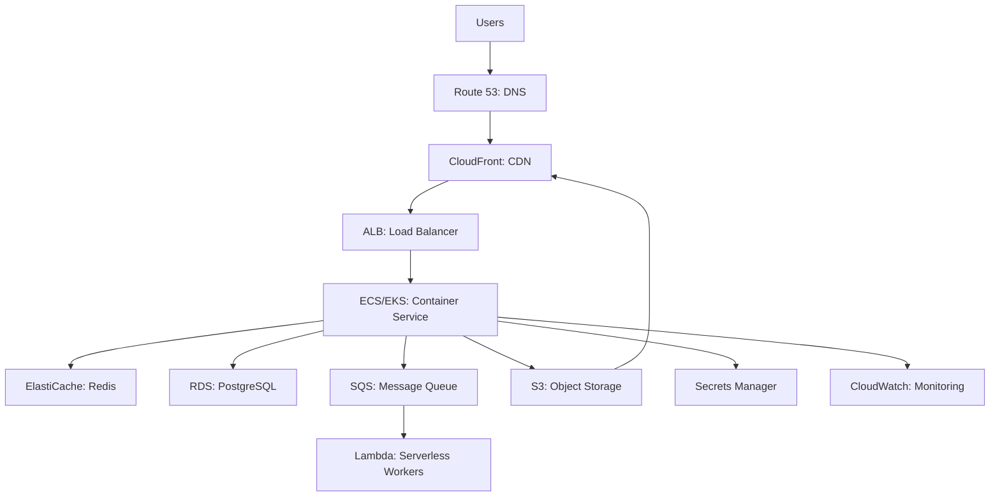

#system-design #intermediate #cloud #aws

# Cloud Architecture Patterns — AWS/GCP in System Design

> Knowing cloud-specific patterns and service names shows production experience.

---

## Common Architecture on AWS



---

## AWS Service Mapping to System Design Concepts

| System Design Concept | AWS Service | GCP Equivalent |
|----------------------|-------------|----------------|
| Load Balancer (L7) | ALB | Cloud Load Balancing |
| Load Balancer (L4) | NLB | TCP/UDP Load Balancing |
| Container Orchestration | ECS / EKS (Kubernetes) | GKE |
| Serverless Functions | Lambda | Cloud Functions |
| SQL Database | RDS (PostgreSQL, MySQL) | Cloud SQL |
| NoSQL (Key-Value) | DynamoDB | Firestore / Bigtable |
| Cache | ElastiCache (Redis) | Memorystore |
| Message Queue | SQS | Cloud Tasks |
| Event Streaming | MSK (Kafka) / Kinesis | Pub/Sub |
| Object Storage | S3 | Cloud Storage |
| CDN | CloudFront | Cloud CDN |
| DNS | Route 53 | Cloud DNS |
| Search | OpenSearch (Elasticsearch) | — (use Elastic Cloud) |
| Monitoring | CloudWatch | Cloud Monitoring |
| Secrets | Secrets Manager | Secret Manager |
| Container Registry | ECR | Artifact Registry |

---

## Serverless Architecture

```
API Gateway → Lambda → DynamoDB
                    → S3
                    → SQS → Lambda (async processing)
```

**When serverless:**
- Sporadic/unpredictable traffic (scales to zero)
- Simple request-response (< 15 min execution)
- Event-driven processing (S3 upload triggers Lambda)
- Cost-sensitive (pay per invocation)

**When NOT serverless:**
- Sustained high traffic (EC2/containers cheaper)
- Long-running processes (> 15 min)
- Need persistent connections (WebSocket)
- Complex orchestration

---

## Multi-AZ vs Multi-Region

### Multi-AZ (High Availability)
```
Region: ap-south-1 (Mumbai)
  AZ-a: App servers, DB primary
  AZ-b: App servers, DB replica
  AZ-c: App servers, DB replica

If AZ-a goes down → traffic routes to AZ-b and AZ-c
Latency between AZs: <2ms (same city, different data centers)
```

### Multi-Region (Global Distribution)
```
ap-south-1 (Mumbai): Primary — India users
us-east-1 (Virginia): Secondary — US users
eu-west-1 (Ireland): Secondary — EU users

Cross-region latency: 100-200ms
Cross-region replication: async (eventual consistency)
```

**Multi-AZ:** Always do this. Same cost, higher availability.
**Multi-Region:** Only when you need global low-latency or regulatory compliance (GDPR: EU data stays in EU).

---

## Cost Optimization Patterns

| Pattern | Savings | How |
|---------|---------|-----|
| **Reserved Instances** | 30-60% | Commit to 1-3 year usage |
| **Spot Instances** | 60-90% | Use for fault-tolerant workloads (batch processing) |
| **Auto-scaling** | Variable | Scale down during off-peak |
| **S3 lifecycle** | 50-80% storage | Move old data to Glacier |
| **Right-sizing** | 20-40% | Monitor and downsize over-provisioned instances |
| **Serverless** | Variable | Pay only for actual usage |

---

## What to Say in Interviews

Map your design to cloud services:

> "On AWS, I'd use ALB for load balancing, ECS for container orchestration with auto-scaling, RDS PostgreSQL for the database in Multi-AZ for high availability, ElastiCache Redis for caching, SQS for async processing, and S3 + CloudFront for media delivery. CloudWatch for monitoring with alerts on P99 latency and error rate."

This translates abstract boxes into real infrastructure.

## Links

- [[../10_hld/capacity_planning]] — Infrastructure sizing
- [[../06_trade_offs/cost_vs_performance]] — Cost optimization
- [[docker_and_kubernetes]] — Container orchestration
