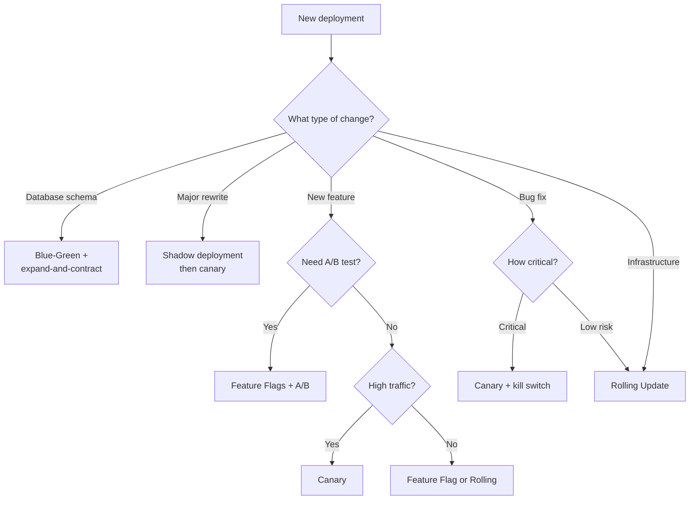

#system-design #deployment #devops #infrastructure

# Deployment Strategies

> How to ship code to production safely — from rolling updates to canary analysis.

11/15 top tech companies use canary deployments. Feature flags are used by 10/15.
Knowing these strategies separates senior from junior engineers.

---

## Why This Matters

```
  Developer writes code → CI/CD pipeline → ???
  ┌──────────────────────────────────────────────┐
  │  HOW does this reach production safely?       │
  │  - Without downtime?                          │
  │  - Without breaking existing users?           │
  │  - With the ability to rollback instantly?     │
  │  - With data-driven confidence?               │
  └──────────────────────────────────────────────┘
```

**The cost of getting deployment wrong:**
- Knight Capital lost $440 million in 45 minutes from a bad deploy (2012)
- GitLab accidentally deleted a production database during maintenance
- Amazon's S3 outage (2017) was triggered by a deployment command with wrong input

---

## The Six Core Strategies — Overview

```
  Risk ▲
       │
  High │  Recreate (Big Bang)
       │
       │  Rolling Update
  Med  │
       │  Blue-Green
       │
  Low  │  Canary          Shadow/Dark Launch
       │  Feature Flags   A/B Testing
       └──────────────────────────────────────► Complexity
            Low          Medium          High
```

---

## Strategy 1: Rolling Update

Replace running instances one-by-one with the new version. **Default in Kubernetes.**

```
  Time →

  t0:  [v1] [v1] [v1] [v1] [v1]    ← all old
  t1:  [v2] [v1] [v1] [v1] [v1]    ← first replaced
  t2:  [v2] [v2] [v1] [v1] [v1]
  t3:  [v2] [v2] [v2] [v1] [v1]    ← halfway
  t4:  [v2] [v2] [v2] [v2] [v2]    ← all new
```

### Kubernetes Config

```yaml
apiVersion: apps/v1
kind: Deployment
metadata:
  name: my-app
spec:
  replicas: 5
  strategy:
    type: RollingUpdate
    rollingUpdate:
      maxUnavailable: 1    # at most 1 pod down at a time
      maxSurge: 1           # at most 1 extra pod during update
  template:
    spec:
      containers:
      - name: my-app
        image: my-app:2.0
        readinessProbe:
          httpGet:
            path: /health
            port: 8080
          initialDelaySeconds: 10
          periodSeconds: 5
```

### Traffic During Rolling Update

```
         Load Balancer
              |
    ┌─────────┼──────────┐
   [v2]     [v1]       [v1]       ← mixed versions!
  Users may hit v1 OR v2 during transition
```

### Pros and Cons

| Aspect | Detail |
|--------|--------|
| **Zero downtime** | Yes — always some pods serving |
| **Resource cost** | Low — only 1 extra pod at a time |
| **Rollback speed** | Slow — must roll back one-by-one |
| **Version mixing** | Yes — v1 and v2 serve simultaneously |
| **Database compat** | Must handle both schemas simultaneously |

**Use when:** Standard web services, backward-compatible changes, tight budget.
**Avoid when:** Breaking schema changes, need instant rollback.

---

## Strategy 2: Blue-Green Deployment

Two identical production environments. Only one serves live traffic at a time.

```
  Step 1: Blue is live
  Users ──→ LB ──→ [BLUE - v1] (ACTIVE)
                    [GREEN]     (IDLE)

  Step 2: Deploy v2 to Green, smoke test
  Users ──→ LB ──→ [BLUE - v1] (ACTIVE)
                    [GREEN - v2] (TESTING)

  Step 3: Switch traffic
  Users ──→ LB ──→ [GREEN - v2] (ACTIVE)
                    [BLUE - v1]  (STANDBY)

  Step 4: Problems? Switch back instantly
  Users ──→ LB ──→ [BLUE - v1] (ACTIVE)
                    [GREEN - v2] (FAILED)
```

### Traffic Switching Options

```
  Option A: DNS Switch (slow — TTL propagation delay)
  my-app.example.com → CNAME → blue.example.com

  Option B: Load Balancer Target Group Switch (fast — instant)
  ALB → Target Group blue-tg (weight: 100 → 0)
      → Target Group green-tg (weight: 0 → 100)
```

### The Database Problem

```
  [BLUE - v1] ──→ ┌──────────┐ ←── [GREEN - v2]
                   │ Database │
                   └──────────┘  ← SHARED!

  If v2 changes schema, v1 breaks.

  Solution: Expand-and-Contract Migration
  ─────────────────────────────────────────
  Phase 1 (expand):  Add new columns, keep old    → both versions work
  Phase 2 (switch):  Flip traffic to Green
  Phase 3 (contract): Remove old columns           → only v2 needs to work
```

### Pros and Cons

| Aspect | Detail |
|--------|--------|
| **Rollback speed** | Instant — flip the switch back |
| **Version mixing** | No — clean cutover |
| **Resource cost** | High — 2x infrastructure |
| **Database migrations** | Complex — must use expand-and-contract |
| **Testing in prod** | Can smoke test Green before switching |

**Use when:** Critical services, instant rollback mandatory, compliance-heavy.
**Avoid when:** Budget-constrained, frequent DB changes, microservices (prefer canary).

---

## Strategy 3: Canary Deployment

Deploy to a **small subset** first (1-5%). Monitor metrics. If healthy, expand. If degraded, rollback.

```
  Phase 1: Canary (5%)
     LB ──→ [v1][v1][v1]..  (95%)
         └→ [v2]             (5%)  ← canary
             │
             ▼
       Monitor 15-30 min

  Phase 2: Expand (25%)
     LB ──→ [v1][v1][v1]..  (75%)
         └→ [v2][v2]..       (25%)

  Phase 3: Expand (50%) → Phase 4: Full (100%)
     LB ──→ [v2][v2][v2][v2][v2]..  (100%)
```

### Netflix Canary Analysis (Kayenta)

```
  DON'T compare: canary vs current production
  (production has warm caches, established connections)

  DO compare: canary vs FRESH BASELINE

  Production (existing)    ← ignore
  ├── Baseline (fresh v1)  ← compare THIS
  │     ↕
  └── Canary (fresh v2)    ← against THIS

  Both baseline and canary:
  - Same instance count, same traffic %
  - Spun up at the same time
  - Cold caches, fresh connections
  → Eliminates warm-vs-cold bias
```

### Statistical Analysis

```
  Metrics Monitored:
  1. Error rate (5xx)        4. Memory usage
  2. Latency p50/p95/p99    5. Business metrics
  3. CPU utilization

  Method: Mann-Whitney U Test (non-parametric)
  - Compares distributions, not just means
  - "Is the canary statistically different from baseline?"

  Decision:
  Score >= 95%  →  PASS      →  proceed to next phase
  Score 50-95%  →  MARGINAL  →  extend observation
  Score < 50%   →  FAIL      →  auto-rollback
```

### Argo Rollouts Config

```yaml
apiVersion: argoproj.io/v1alpha1
kind: Rollout
metadata:
  name: my-app
spec:
  replicas: 20
  strategy:
    canary:
      steps:
      - setWeight: 5
      - pause: { duration: 10m }
      - analysis:
          templates:
          - templateName: canary-analysis
      - setWeight: 25
      - pause: { duration: 10m }
      - setWeight: 50
      - pause: { duration: 10m }
      - setWeight: 100
```

### Analysis Template (Prometheus)

```yaml
apiVersion: argoproj.io/v1alpha1
kind: AnalysisTemplate
metadata:
  name: canary-analysis
spec:
  metrics:
  - name: error-rate
    interval: 2m
    count: 5
    successCondition: result[0] < 0.01
    failureLimit: 2
    provider:
      prometheus:
        address: http://prometheus:9090
        query: |
          sum(rate(http_requests_total{service="my-app",status=~"5..",role="canary"}[2m]))
          /
          sum(rate(http_requests_total{service="my-app",role="canary"}[2m]))
  - name: latency-p99
    interval: 2m
    count: 5
    successCondition: result[0] < 500
    failureLimit: 2
    provider:
      prometheus:
        address: http://prometheus:9090
        query: |
          histogram_quantile(0.99,
            sum(rate(http_request_duration_seconds_bucket{
              service="my-app",role="canary"
            }[2m])) by (le)) * 1000
```

### Google's Progressive Rollout

```
  1. Deploy to 1 canary pod in 1 datacenter     → wait 30 min
  2. Deploy to 1% of pods in 1 datacenter        → wait 1 hour
  3. Deploy to 10% in 1 datacenter               → wait 2 hours
  4. Deploy to 100% of 1 datacenter              → wait 4 hours
  5. Deploy to 25% of all datacenters            → wait 4 hours
  6. Deploy to 100% of all datacenters

  Total: ~24-48 hours for critical services
  Even 1% of Google traffic = thousands of QPS (plenty for stats)
```

**Use when:** User-facing services at scale, good observability exists.
**Avoid when:** Low traffic (no statistical significance), schema-only changes.

---

## Strategy 4: Feature Flags

Deploy code to all servers **dark** (flag off). Control activation via runtime config.

```
  Code Change → Build → Deploy → DARK (flag off)
                                    │
                                    ├── Enable for 1% → monitor
                                    ├── Enable for 10%, 50%, 100%
                                    └── Kill switch → disable instantly (no redeploy)
```

### Request Flow with Feature Flags

```
  User Request → App Server
                     │
           ┌─────────┴──────────┐
           │  Flag Evaluation    │
           │  Input: flag_name,  │
           │    user_id, country │
           │  Rules: 5% of US   │
           │  Output: true/false │
           └─────────┬──────────┘
                     │
              ┌──────┴──────┐
              ▼             ▼
         new code       old code
         path            path
```

### Types of Feature Flags

| Type | Purpose | Lifespan | Example |
|------|---------|----------|---------|
| **Release** | Gate new features | Days-weeks | `enable-new-search` |
| **Experiment** | A/B test variants | Weeks-months | `checkout-flow-variant` |
| **Ops** | Control operational behavior | Permanent | `enable-rate-limiting` |
| **Permission** | Gate by user tier/plan | Permanent | `premium-analytics` |

### Meta's Gatekeeper

```
  Engineer defines flag → Configerator → push to all servers (seconds)

  ┌──────────┐  ┌──────────┐  ┌──────────┐
  │ Server 1 │  │ Server 2 │  │ Server N │
  │ In-proc  │  │ In-proc  │  │ In-proc  │
  │ flag     │  │ flag     │  │ flag     │
  │ cache    │  │ cache    │  │ cache    │
  └──────────┘  └──────────┘  └──────────┘

  - In-process evaluation (no network call)
  - Sub-microsecond latency
  - Thousands of active flags at any time
```

### Implementation: Unleash (Open Source)

```java
Unleash unleash = new DefaultUnleash(config);

// Simple check
if (unleash.isEnabled("new-checkout-flow")) {
    return newCheckoutFlow(request);
} else {
    return oldCheckoutFlow(request);
}

// With user context (percentage rollout)
UnleashContext context = UnleashContext.builder()
    .userId(user.getId())
    .addProperty("country", user.getCountry())
    .build();

if (unleash.isEnabled("new-checkout-flow", context)) {
    return newCheckoutFlow(request);
}
```

### The Kill Switch Pattern

```
  Traditional rollback:
    Identify bad deploy (5-10 min) → Start rollback (5-15 min)
    → Wait for completion (10-30 min) → Verify (5 min)
    Total: 25-60 minutes

  Kill switch:
    Toggle flag OFF in dashboard → Takes effect in seconds
    Total: < 1 minute
```

### Feature Flag Tech Debt

```
  WARNING: Stale flags accumulate fast

  After 6 months without cleanup:
  if (flag("new-checkout") && !flag("old-payment") ||
      flag("experiment-42") && flag("premium-user")) {
      // What does this code even DO anymore?
  }

  Best practices:
  1. Set expiration dates on release flags
  2. Track flag ownership (team/person)
  3. Automated alerts when flags are >30 days old
  4. Quarterly cleanup sprints
  5. Lint rules that flag nested flag conditions
```

**Use when:** Decoupling deploy from release, kill switch needed, gradual rollout.
**Avoid when:** You can't manage flag lifecycle (tech debt risk).

---

## Strategy 5: A/B Testing

Feature flags + metrics = A/B testing. Randomly assign users, measure business metrics, pick the winner.

```
  User Request
       │
       ▼
  hash(user_id + experiment_id) % 100
       │
       ├── 0-49  → Control (A) — old checkout
       └── 50-99 → Treatment (B) — new checkout
              │                │
              ▼                ▼
         Log events       Log events
              └───────┬────────┘
                      ▼
              Kafka → Flink → Druid
                      │
                      ▼
              Statistical Analysis (95% CI)
                      │
                      ▼
              Winner declared
```

### Deterministic User Assignment

```python
import hashlib

def get_variant(user_id: str, experiment_id: str) -> int:
    key = f"{user_id}:{experiment_id}"
    hash_value = int(hashlib.sha256(key.encode()).hexdigest(), 16)
    return hash_value % 100

def is_in_treatment(user_id: str, experiment_id: str, pct: int = 50) -> bool:
    return get_variant(user_id, experiment_id) < pct

# Same user always gets the same result — no DB needed
```

### Netflix: 200-400 Concurrent A/B Tests

```
  Challenge: Avoid experiments interfering with each other

  Solution: Mutual Exclusivity Layers

  Layer 1 (UI):     Bucket 0-30: Homepage test | 31-60: Thumbnail test | 61-100: free
  Layer 2 (Recs):   Bucket 0-50: Ranking algo  | 51-80: Diversity test | 81-100: free
  Layer 3 (Video):  Bucket 0-20: Codec test    | 21-100: free

  Each layer has independent hashing:
  - User in Layer 1 test CAN also be in Layer 2 test
  - User can NEVER be in two tests within the same layer
```

### Statistical Significance

```
  Control:   10,000 users, 3.2% conversion
  Treatment: 10,000 users, 3.5% conversion

  Is the 0.3% difference real or noise?
  Z-test: p-value = 0.03 → significant (< 0.05)
  CI: [0.05%, 0.55%] lift → Treatment wins

  Pitfalls:
  - Peeking too early (inflates false positives)
  - Not accounting for multiple comparisons
  - Sample ratio mismatch (unequal groups = bug)
  - Novelty effect (engagement boost just because it's new)
```

---

## Strategy 6: Shadow / Dark Launch

Send **duplicate traffic** to the new system without serving its responses to users.

```
  User Request
       │
       ▼
  Traffic Splitter
       │        │
       │        │ (copy)
       ▼        ▼
  [Old System]  [New System]
       │             │
       │        (response discarded)
       │             │
       │             ▼
       │        Compare: latency, errors, output diff
       ▼
  Response to User (always from old system)
```

### Twitter's Ruby to Scala Migration

```
  Ran both Ruby and Scala services simultaneously (~18 months):
  1. Forked every read request to both systems
  2. Compared responses for correctness
  3. Compared latency (Scala was 3x faster)
  4. Gradually shifted real traffic once confidence was high
```

### Envoy Traffic Mirroring

```yaml
routes:
- match: { prefix: "/" }
  route:
    cluster: old_system
    request_mirror_policies:
    - cluster: new_system
      runtime_fraction:
        default_value:
          numerator: 100
          denominator: HUNDRED
```

### Handling Writes

```
  Problem: Can't duplicate writes (creates duplicates/side effects)

  Solutions:
  1. Mirror reads only (GET requests)
  2. Dry-run writes (process but don't persist)
  3. Separate shadow DB
  4. Diff output (compare what new system WOULD write)
```

**Use when:** Major migrations, validating under real load.
**Avoid when:** Write-heavy, external side effects (emails, charges), tight budget.

---

## Comparison Table

| Strategy | Risk | Complexity | Rollback Speed | Infra Cost | Best For |
|----------|------|-----------|----------------|------------|----------|
| **Rolling Update** | Medium | Low | Slow (minutes) | Low | Standard services |
| **Blue-Green** | Low | Medium | Instant | High (2x) | Critical services |
| **Canary** | Very Low | High | Fast (seconds) | Low | User-facing at scale |
| **Feature Flags** | Very Low | Medium | Instant | None | Decoupled releases |
| **A/B Testing** | Low | Very High | Instant | Low | Product experiments |
| **Shadow/Dark** | None | High | N/A | High (2x) | Migrations |

---

## Decision Flowchart



### Quick Selection

```
  Database migration?     → Blue-green + expand-and-contract
  Major rewrite?          → Shadow first, then canary
  Product feature to test?→ Feature flags + A/B testing
  Standard backend change?→ Canary deployment
  Internal tool?          → Rolling update
  Critical finance svc?   → Blue-green + feature flag kill switch
```

---

## Combining Strategies (Real-World)

In practice, mature companies never use just one strategy. They layer them together.

### Netflix Production Deployment Pipeline

```
  1. Feature flag: code deployed dark (flag off)
  2. Enable for internal employees (dogfood for 24 hours)
  3. Canary at 1% with Kayenta statistical analysis
  4. If canary passes → 5%, 25%, 50%, 100%
  5. A/B test runs concurrently to measure business impact
  6. Kill switch available at every stage
  7. If any stage fails → automatic rollback, flag toggled off

  Timeline:
  ──────────
  Day 0: Code merged, deployed dark
  Day 1: Internal dogfood
  Day 2: Canary at 1% (Kayenta analysis running)
  Day 2: If pass → expand to 5%
  Day 3: 25% → 50% → 100%
  Day 3+: A/B test continues for business metrics
  Week 2: A/B test concludes, winner declared
```

### Shopify BFCM Strategy

```
  Shopify handles $7B+ in sales during Black Friday / Cyber Monday.
  Their deployment strategy shifts based on the calendar:

  4 weeks before BFCM:
  - All feature flags for new features are frozen
  - Only critical fixes deployed (via canary with extended analysis)
  - Kill switches prepared and tested for every major system
  - Shadow testing for new infrastructure components
  - Load testing at 2x expected peak

  During BFCM (Thursday-Monday):
  - Complete code freeze — zero deployments
  - Ops flags only (rate limiting, cache tuning, circuit breakers)
  - Kill switches on standby with run-books
  - War room staffed 24/7

  After BFCM:
  - Resume normal deployment cadence
  - Retrospective on any flags that were toggled
```

### Uber's Deployment Velocity

```
  Uber deploys ~100,000 times per week across ~4,500 services.

  Their layered approach:
  1. All changes go through automated canary (5 min minimum)
  2. Feature flags for user-facing changes
  3. Automated rollback triggers on SLO violation
  4. DORA metrics tracked per team:
     - Deployment frequency
     - Lead time for changes
     - Change failure rate
     - Time to restore service
```

---

## Real-World Examples

| Company | Scale | Strategy | Key Detail |
|---------|-------|----------|------------|
| **Netflix** | 200M+ subs, 1000+ services | Canary + Kayenta | Statistical analysis, <0.1% bad deploys |
| **Google** | Billions of users | Progressive rollout | 24-48 hour rollouts, "rollback first, debug later" |
| **Meta** | 3B+ users | Gatekeeper flags | In-process evaluation, sub-microsecond |
| **Uber** | 4500+ services | Canary + flags | Thousands of deploys/week |
| **Shopify** | BFCM peak | Flags + kill switches | Code freeze during peak |

---

## Monitoring During Deployments

```
  ┌────────────────────────────────────────────────┐
  │  DEPLOYMENT MONITORING CHECKLIST               │
  │                                                │
  │  Infrastructure:                               │
  │  □ CPU < 70%    □ Memory < 80%                 │
  │  □ Pod restarts = 0    □ OOM kills = 0         │
  │                                                │
  │  Application:                                  │
  │  □ Error rate < 0.1%                           │
  │  □ Latency p50 within baseline                 │
  │  □ Latency p99 within 2x baseline              │
  │  □ Throughput not dropping                     │
  │                                                │
  │  Business:                                     │
  │  □ Conversion rate stable                      │
  │  □ Revenue per session stable                  │
  └────────────────────────────────────────────────┘
```

---

## Implementation Tools

| Tool | Type | What It Does |
|------|------|-------------|
| **Argo Rollouts** | K8s controller | Canary, blue-green with analysis |
| **Flagger** | K8s controller | Progressive delivery, auto-canary |
| **Unleash** | Feature flags | Open-source, multi-language SDKs |
| **LaunchDarkly** | Feature flags | Managed service, enterprise |
| **Spinnaker** | CD platform | Multi-cloud deployment orchestration |
| **Kayenta** | Canary analysis | Statistical comparison (Netflix) |

---

## Interview Prep

### "How Would You Deploy This Safely?"

```
  1. STRATEGY: "Canary deployment with feature flags"

  2. STEPS:
     - Deploy code behind a feature flag (dark)
     - Enable for internal users first (dogfood)
     - Canary at 1% of traffic
     - Monitor error rate, latency p99, business metrics
     - If healthy after 15 min, expand to 5%, 25%, 50%, 100%
     - If degraded, auto-rollback via flag toggle

  3. MONITORING:
     - Error rate < 0.1%, latency p99 < 500ms
     - Compare canary vs fresh baseline (Netflix approach)
     - Statistical significance via Mann-Whitney U test

  4. ROLLBACK:
     - Instant via feature flag kill switch
     - No redeploy needed
```

### Common Follow-Ups

| Question | Answer |
|----------|--------|
| Database migration? | Expand-and-contract: add new cols, deploy, backfill, drop old |
| Rollback with DB changes? | Can't easily — that's why expand-and-contract keeps every state backward-compatible |
| Stateful services? | Blue-green with shared state, or rolling with session draining |
| Netflix at 200M users? | Canary + Kayenta, fresh baseline vs canary, progressive 1%→100% |
| Testing feature flags? | Test both paths in CI, flag overrides, expiration dates, cleanup sprints |

### Interview Quick Reference

| Scenario | Say This |
|----------|----------|
| Standard backend deploy | "Canary with automated analysis" |
| New user feature | "Feature flag, enable gradually, A/B test" |
| Database migration | "Blue-green with expand-and-contract" |
| Major rewrite | "Shadow deployment, then canary" |
| Emergency hotfix | "Rolling update with short canary" |
| Peak traffic event | "Code freeze + kill switches + ops flags" |

---

## Cross-References

- [[03_design_patterns/circuit_breaker]] — Complements deployment safety (auto-disable failing services)
- [[15_intermediate_topics/docker_and_kubernetes]] — K8s rolling updates, Argo Rollouts
- [[15_intermediate_topics/testing_strategies]] — Testing pyramid supports deployment confidence
- [[15_intermediate_topics/service_mesh]] — Istio/Envoy enable traffic splitting for canary
- [[15_intermediate_topics/kafka_deep_dive]] — A/B test metrics pipeline uses Kafka
- [[03_design_patterns/back_pressure]] — Protects services during deployment transitions

---

## Summary Cheat Sheet

```
  ┌────────────────────────────────────────────────────────────┐
  │              DEPLOYMENT STRATEGIES CHEAT SHEET             │
  ├────────────────────────────────────────────────────────────┤
  │  Rolling Update:  Replace pods one by one                  │
  │                   Default K8s. Simple. Slow rollback.      │
  │                                                            │
  │  Blue-Green:      Two environments, flip traffic           │
  │                   Instant rollback. 2x cost.               │
  │                                                            │
  │  Canary:          Deploy to 1%, analyze, expand            │
  │                   Low risk. Needs metrics. Industry std.   │
  │                                                            │
  │  Feature Flags:   Deploy dark, enable via config           │
  │                   Instant rollback. Watch for tech debt.   │
  │                                                            │
  │  A/B Testing:     Flags + metrics = experiments            │
  │                   Data-driven. Needs stats pipeline.       │
  │                                                            │
  │  Shadow/Dark:     Mirror traffic, discard responses        │
  │                   Zero risk. Great for migrations.         │
  ├────────────────────────────────────────────────────────────┤
  │  Golden combo: Canary + Feature Flags + Kill Switch        │
  │  "Deploy behind a flag, canary at 1%, auto-analyze,        │
  │   expand gradually, kill switch for instant rollback."     │
  └────────────────────────────────────────────────────────────┘
```
