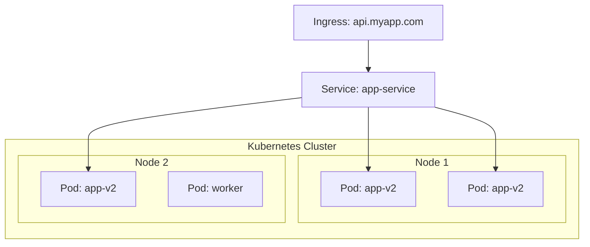

#system-design #intermediate #devops #docker #kubernetes

# Docker & Kubernetes — What System Designers Must Know

> You don't need to be a DevOps expert, but understanding containers and orchestration is expected at intermediate level.

---

## Docker — Packaging Applications

### What Problem Does Docker Solve?

"It works on my machine" → package the app WITH its environment.

```dockerfile
# Dockerfile — recipe for building a container image
FROM openjdk:17-slim
COPY target/app.jar /app.jar
EXPOSE 8080
CMD ["java", "-jar", "/app.jar"]
```

```bash
docker build -t my-app:1.0 .           # Build image
docker run -p 8080:8080 my-app:1.0     # Run container
docker push registry.com/my-app:1.0    # Push to registry
```

### Docker Compose — Multi-Container Setup

```yaml
# docker-compose.yml — your entire development environment
services:
  app:
    build: .
    ports: ["8080:8080"]
    depends_on: [postgres, redis, kafka]
    environment:
      DB_URL: jdbc:postgresql://postgres:5432/mydb

  postgres:
    image: postgres:15
    environment:
      POSTGRES_PASSWORD: secret
    volumes: [postgres_data:/var/lib/postgresql/data]

  redis:
    image: redis:7-alpine

  kafka:
    image: confluentinc/cp-kafka:7.5.0
    environment:
      KAFKA_BROKER_ID: 1
      KAFKA_ZOOKEEPER_CONNECT: zookeeper:2181

volumes:
  postgres_data:
```

`docker-compose up` → entire stack running locally. **Essential for system design projects.**

---

## Kubernetes — Orchestrating Containers at Scale

### Why Kubernetes?

Docker runs ONE container. Kubernetes runs THOUSANDS across many machines:
- Auto-scaling (add pods when CPU > 70%)
- Self-healing (restart crashed containers)
- Load balancing (distribute traffic across pods)
- Rolling updates (zero-downtime deployments)
- Service discovery (pods find each other by name)

### Key Concepts



| Concept | What | Analogy |
|---------|------|---------|
| **Pod** | Smallest unit — one or more containers | A single process |
| **Deployment** | Manages pods (replicas, updates) | "Run 5 copies of my app" |
| **Service** | Stable network endpoint for pods | Internal load balancer |
| **Ingress** | External entry point (routes HTTP traffic) | External load balancer |
| **ConfigMap** | Configuration data | Environment variables |
| **Secret** | Sensitive data (passwords, keys) | Encrypted env vars |
| **Namespace** | Isolation boundary | Folders for organizing resources |

### Basic Deployment YAML

```yaml
apiVersion: apps/v1
kind: Deployment
metadata:
  name: order-service
spec:
  replicas: 3              # Run 3 instances
  selector:
    matchLabels:
      app: order-service
  template:
    spec:
      containers:
      - name: order-service
        image: my-app:2.0
        ports:
        - containerPort: 8080
        resources:
          requests:
            cpu: "250m"     # 0.25 CPU core
            memory: "512Mi"
          limits:
            cpu: "500m"
            memory: "1Gi"
        livenessProbe:      # Restart if unhealthy
          httpGet:
            path: /health
            port: 8080
          periodSeconds: 10
---
apiVersion: v1
kind: Service
metadata:
  name: order-service
spec:
  selector:
    app: order-service
  ports:
  - port: 80
    targetPort: 8080
```

### Auto-Scaling

```yaml
apiVersion: autoscaling/v2
kind: HorizontalPodAutoscaler
metadata:
  name: order-service-hpa
spec:
  scaleTargetRef:
    name: order-service
  minReplicas: 3
  maxReplicas: 20
  metrics:
  - type: Resource
    resource:
      name: cpu
      target:
        averageUtilization: 70  # Scale up when CPU > 70%
```

---

## How This Maps to System Design

| System Design Concept | Kubernetes Implementation |
|----------------------|--------------------------|
| "Multiple app servers behind a load balancer" | Deployment (replicas) + Service |
| "Auto-scale based on load" | HorizontalPodAutoscaler |
| "Health checks remove unhealthy servers" | Liveness/Readiness probes |
| "Zero-downtime deployment" | Rolling update strategy |
| "Canary deployment" | Weighted traffic split (Istio) |
| "Service discovery" | Kubernetes DNS (service-name.namespace) |
| "Secrets management" | Kubernetes Secrets + external vault |

---

## What to Say in Interviews

You don't need to write YAML in interviews. Just say:

> "We'd containerize each service with Docker and deploy on Kubernetes for auto-scaling, self-healing, and zero-downtime rolling updates. HPA scales based on CPU utilization. Services discover each other via Kubernetes DNS."

This shows practical production knowledge.

## Links

- [[../10_hld/microservices_patterns]] — Deployment patterns (blue-green, canary)
- [[../04_system_evolutions/from_monolith_to_microservices]] — Where K8s fits
- [[../02_building_blocks/monitoring_and_logging]] — Observability in K8s
