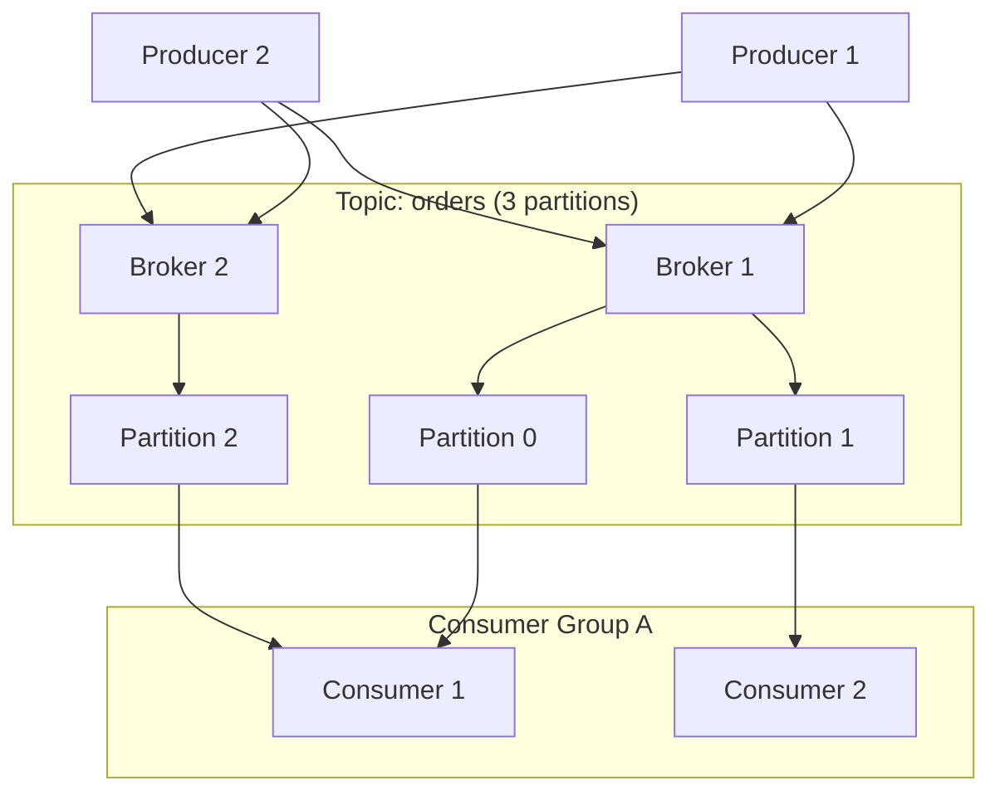

#system-design #intermediate #kafka #messaging

# Kafka Deep Dive — Beyond "We'll Use Kafka"

> Saying "Kafka" in an interview without understanding partitions, consumer groups, and delivery guarantees is a red flag. This note fixes that.

---

## Kafka Architecture



### Key Concepts

| Concept | What | Analogy |
|---------|------|---------|
| **Topic** | Category of messages | Database table |
| **Partition** | Ordered, immutable log within a topic | Table shard |
| **Offset** | Position of a message in a partition | Row number |
| **Broker** | Kafka server (stores partitions) | Database node |
| **Producer** | Sends messages to topics | Writer |
| **Consumer** | Reads messages from topics | Reader |
| **Consumer Group** | Group of consumers that share the work | Worker pool |

---

## Partitions — The Key to Kafka's Scale

**Each partition is an ordered, append-only log:**
```
Partition 0: [msg0] [msg1] [msg2] [msg3] [msg4] ...
                                            ↑ offset=4
Partition 1: [msg0] [msg1] [msg2] ...
Partition 2: [msg0] [msg1] [msg2] [msg3] ...
```

**Ordering guarantee:** Messages are ordered WITHIN a partition, NOT across partitions.

**Partition key determines which partition:**
```java
// All orders for user_123 go to the same partition → ordered
producer.send(new ProducerRecord<>("orders", "user_123", orderJson));

// Partition = hash("user_123") % numPartitions
```

**Choose partition key wisely:**
- Same key = same partition = ordered processing
- `user_id` → all events for a user are ordered
- `order_id` → all events for an order are ordered
- null key → round-robin (no ordering guarantee)

---

## Consumer Groups — Parallel Processing

```
Topic: "orders" (6 partitions)

Consumer Group A (Order Service): 3 consumers
  Consumer 1 → Partition 0, 1
  Consumer 2 → Partition 2, 3
  Consumer 3 → Partition 4, 5

Consumer Group B (Analytics): 2 consumers
  Consumer 4 → Partition 0, 1, 2
  Consumer 5 → Partition 3, 4, 5
```

**Rules:**
- Each partition is consumed by exactly ONE consumer in a group
- Adding consumers → automatic rebalancing
- More consumers than partitions → some consumers idle
- **Max parallelism = number of partitions**

**Scaling:** Need more throughput? Add more partitions + more consumers.

---

## Delivery Guarantees

### At-Most-Once (Fire and Forget)
```java
props.put("acks", "0");  // Don't wait for broker acknowledgment
// Fast but messages can be lost
```

### At-Least-Once (Default — Recommended)
```java
props.put("acks", "all");           // Wait for all replicas
props.put("retries", 3);            // Retry on failure
props.put("enable.idempotence", true);  // Prevent duplicates from retries
// Messages never lost, but consumer might process duplicates
// → Make your consumer IDEMPOTENT
```

### Exactly-Once (Transactional)
```java
producer.initTransactions();
producer.beginTransaction();
producer.send(record1);
producer.send(record2);
producer.commitTransaction();  // Atomic: both succeed or both fail
// Slowest but guaranteed exactly-once within Kafka
```

**In practice:** Use at-least-once + idempotent consumers. Exactly-once is expensive.

---

## Kafka vs Other Queues

| | Kafka | RabbitMQ | AWS SQS |
|--|-------|----------|---------|
| **Throughput** | 1M+ msg/sec | 10K-50K msg/sec | 3K-30K msg/sec |
| **Retention** | Days/weeks (configurable) | Until consumed | 14 days max |
| **Replay** | Yes (re-read old messages) | No | No |
| **Ordering** | Per-partition | Per-queue | Best-effort (FIFO available) |
| **Consumer model** | Pull (consumer controls pace) | Push + Pull | Pull |
| **Use case** | Event streaming, logs, analytics | Task queues, RPC | Simple async, serverless |
| **Complexity** | High | Medium | Low (managed) |

### When to Use Kafka

- High throughput (>10K msg/sec)
- Need message replay (reprocess events)
- Event sourcing / event-driven architecture
- Multiple consumers need the same events
- Log aggregation / data pipeline

### When NOT to Use Kafka

- Simple task queue (<1K msg/sec) → use SQS or RabbitMQ
- Request-reply pattern → use gRPC or HTTP
- Small team, low complexity → Kafka's operational overhead isn't worth it

---

## Kafka in Production

### Replication
```
Topic: orders, replication-factor=3
  Partition 0: Leader=Broker1, Replicas=Broker2, Broker3
  Partition 1: Leader=Broker2, Replicas=Broker1, Broker3
```
If Broker1 dies → Broker2 or Broker3 promoted as new leader for Partition 0.

### Key Configs

| Config | Default | Production Recommendation |
|--------|---------|--------------------------|
| `replication.factor` | 1 | 3 (minimum for production) |
| `min.insync.replicas` | 1 | 2 (with acks=all) |
| `retention.ms` | 7 days | Based on use case (1 day for logs, 30 days for events) |
| `num.partitions` | 1 | Start with 6-12, scale based on throughput |
| `max.message.bytes` | 1MB | Increase only if needed |

### Consumer Lag Monitoring

```
Consumer lag = Latest offset - Consumer's committed offset

Topic: orders, Partition 0
  Latest offset: 1,000,000
  Consumer offset: 999,500
  Lag: 500 messages

Lag growing → consumer can't keep up → add more consumers or optimize processing
```

Monitor lag with: Kafka Manager, Burrow, or Prometheus + kafka-exporter.

---

## Java Producer/Consumer Example

```java
// Producer
Properties props = new Properties();
props.put("bootstrap.servers", "kafka:9092");
props.put("key.serializer", StringSerializer.class.getName());
props.put("value.serializer", StringSerializer.class.getName());
props.put("acks", "all");
props.put("enable.idempotence", "true");

KafkaProducer<String, String> producer = new KafkaProducer<>(props);
producer.send(new ProducerRecord<>("orders", orderId, orderJson),
    (metadata, exception) -> {
        if (exception != null) log.error("Send failed", exception);
        else log.info("Sent to partition {} offset {}", metadata.partition(), metadata.offset());
    });

// Consumer
Properties cprops = new Properties();
cprops.put("bootstrap.servers", "kafka:9092");
cprops.put("group.id", "order-processing");
cprops.put("auto.offset.reset", "earliest");
cprops.put("enable.auto.commit", "false");  // Manual commit for at-least-once

KafkaConsumer<String, String> consumer = new KafkaConsumer<>(cprops);
consumer.subscribe(List.of("orders"));

while (true) {
    ConsumerRecords<String, String> records = consumer.poll(Duration.ofMillis(100));
    for (ConsumerRecord<String, String> record : records) {
        processOrder(record.value());  // Process
    }
    consumer.commitSync();  // Commit AFTER processing (at-least-once)
}
```

## Links

- [[../02_building_blocks/message_queues]] — Queue comparison
- [[../03_design_patterns/pub_sub]] — Pub/sub pattern
- [[../03_design_patterns/event_sourcing]] — Kafka as event store
- [[../14_real_projects/project_notification_service]] — Kafka in practice
