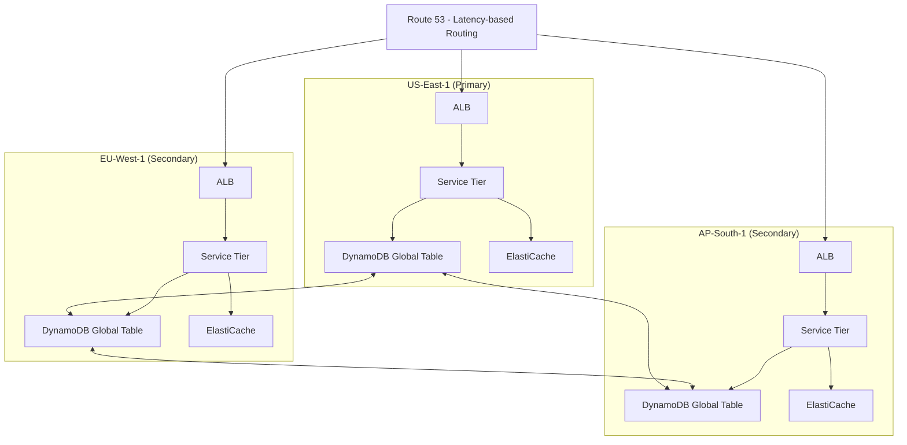
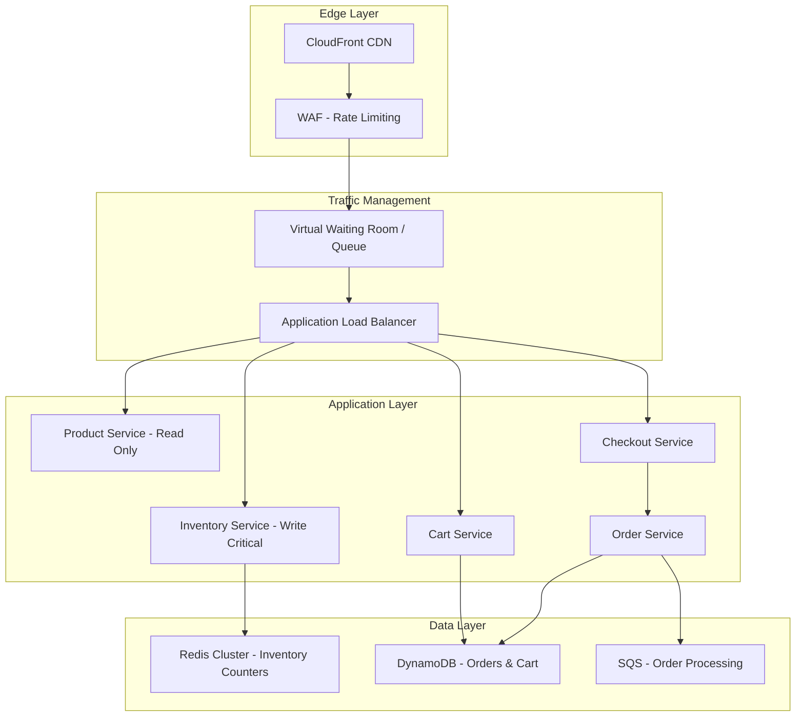

# Amazon System Design Interview Guide

> **Last Updated:** 2026-02-23
> **Back to:** [[17_company_interview_guide/index]]
> **Framework:** [[07_interview_framework/the_four_step_framework]]

---

## Table of Contents

1. [Company Overview & Levels](#company-overview--levels)
2. [Interview Process](#interview-process)
3. [System Design Round Details](#system-design-round-details)
4. [Leadership Principles Integration](#leadership-principles-integration)
5. [Top 10 Most-Asked Questions](#top-10-most-asked-questions)
6. [Amazon-Specific Patterns](#amazon-specific-patterns)
7. [Sample Walkthrough — Design Flash Sale System](#sample-walkthrough--design-flash-sale-system)
8. [Red Flags & Green Flags](#red-flags--green-flags)
9. [Amazon-Specific Tips by Level](#amazon-specific-tips-by-level)
10. [Preparation Checklist](#preparation-checklist)

---

## Company Overview & Levels

### Level Structure

Amazon uses an L4-L10 level system. System design interviews begin at **L5 (SDE-2)** and increase
in depth/scope at higher levels. L4 candidates may get a lighter design question or a
design-oriented coding round.

| Level | Title | Scope | System Design? |
|-------|-------|-------|----------------|
| L4 | SDE-1 | Single component/feature | Light / Optional |
| L5 | SDE-2 | Full service or system | Yes — Core round |
| L6 | SDE-3 / Sr. SDE | Multi-service architecture | Yes — Deep + Trade-offs |
| L7 | Principal Engineer | Org-wide / company-wide systems | Yes — Vision + Strategy |
| L8 | Sr. Principal Engineer | Cross-org technical direction | Yes — Architecture Review style |
| L10 | Distinguished Engineer | Company-wide impact | Conversations, not interviews |

### Compensation Bands (2025-2026 Ranges)

#### United States (USD, Total Compensation)

| Level | Base Salary | RSU (4-yr vest) | Signing Bonus | Total Comp (Yr 1) |
|-------|------------|-----------------|---------------|-------------------|
| L4 (SDE-1) | $120K-$175K | $80K-$200K | $20K-$50K | $160K-$260K |
| L5 (SDE-2) | $150K-$210K | $200K-$500K | $30K-$80K | $230K-$380K |
| L6 (SDE-3) | $175K-$250K | $400K-$900K | $50K-$120K | $340K-$550K |
| L7 (Principal) | $210K-$300K | $800K-$2M+ | $80K-$200K | $500K-$900K+ |

> **Note:** Amazon's RSU vesting is notoriously back-loaded: **5% / 15% / 40% / 40%** over four
> years. Signing bonuses in Years 1-2 offset this. Year 3+ compensation jumps significantly.

#### India (INR, Total Compensation)

| Level | Base Salary | RSU (4-yr vest) | Total Comp (Yr 1) |
|-------|------------|-----------------|-------------------|
| L4 (SDE-1) | 18L-30L | 10L-30L | 22L-40L |
| L5 (SDE-2) | 28L-50L | 30L-80L | 38L-70L |
| L6 (SDE-3) | 45L-75L | 60L-1.5Cr | 60L-1.2Cr |
| L7 (Principal) | 70L-1.2Cr | 1.5Cr-4Cr+ | 1Cr-2.5Cr+ |

> L = Lakhs INR, Cr = Crores INR. India RSUs follow the same 5/15/40/40 vest schedule.

### Team Structure — Two-Pizza Teams

Amazon operates on the "two-pizza team" model — every team should be small enough to be fed by
two pizzas (6-10 people). This has deep implications for system design interviews:

- **Each team owns a service end-to-end** (you build it, you run it)
- **Operational excellence is paramount** — you are on-call for what you build
- **Services communicate via well-defined APIs** — SOA is Amazon's DNA
- **Autonomy over standardization** — teams choose their own tech within guardrails
- **Microservices architecture** grew organically from this model

### What Amazon Looks For

1. **Ownership mentality** — You designed it, you deploy it, you page for it at 3 AM
2. **Customer-backward thinking** — Start from the customer experience, work backward
3. **Operational awareness** — Monitoring, alerting, runbooks, blast radius control
4. **Cost consciousness** — AWS bills are real; your design should be cost-efficient
5. **Bias toward simplicity** — Solve the problem at hand, not a hypothetical future one
6. **Deep technical understanding** — Not just "use Kafka" but WHY Kafka, HOW it works

---

## Interview Process

### Pipeline Overview

```
┌─────────────┐    ┌──────────────┐    ┌─────────────────┐    ┌──────────┐
│   Online     │───▶│  Phone       │───▶│  Onsite Loop    │───▶│  Offer   │
│  Assessment  │    │  Screen      │    │  (4-5 rounds)   │    │  / Debrief│
│  (OA)        │    │  (1 round)   │    │                 │    │          │
└─────────────┘    └──────────────┘    └─────────────────┘    └──────────┘
    1-2 weeks          1 week              1 day                 1-2 weeks
```

### Stage 1: Online Assessment (OA)

- **Duration:** 90-120 minutes
- **Content:** 2 coding problems (LC Medium-Hard) + Work Style Assessment
- **Work Style Assessment:** Situational judgment questions mapped to Leadership Principles
- **Pass Rate:** ~30-40% advance to phone screen
- **Note:** L6+ candidates sometimes skip the OA

### Stage 2: Phone Screen

- **Duration:** 45-60 minutes
- **Content:** 1 coding problem + LP behavioral question
- **For L5+:** May include a lightweight system design question (15-20 min)
- **Interviewer:** Usually a hiring manager or senior SDE from the team
- **Pass Rate:** ~40-50% advance to onsite

### Stage 3: Onsite "Loop"

The onsite loop is 4-5 back-to-back interviews, each 55-60 minutes:

| Round | Focus | LP Weight | Notes |
|-------|-------|-----------|-------|
| 1 | Coding (Data Structures & Algorithms) | 30% LP, 70% Technical | Usually LC Medium-Hard |
| 2 | Coding (Problem Solving) | 30% LP, 70% Technical | May be OOD for L5+ |
| 3 | **System Design** | **50% LP, 50% Technical** | The focus of this guide |
| 4 | Behavioral / LP Deep Dive | 90% LP, 10% Technical | STAR method stories |
| 5 | Bar Raiser Round | 50% LP, 50% Mixed | Could be any format |

> **Critical Insight:** EVERY single round includes Leadership Principle evaluation.
> Even in coding rounds, your interviewer is scoring you on LPs. The system design round
> has the **highest LP integration** of any technical round.

### The Bar Raiser

The **Bar Raiser** is Amazon's unique quality control mechanism:

- One interviewer in every loop is a trained "Bar Raiser" (BR)
- The BR is from a **different team** than the hiring team — no bias toward filling the role
- The BR has **veto power** — they can single-handedly reject a candidate
- The BR ensures the candidate "raises the bar" — is better than 50% of current Amazonians at that level
- The BR can conduct ANY type of round (coding, design, behavioral)
- **If the BR does system design:** expect deeper LP probing and harder trade-off questions

### Timeline

| Event | Typical Duration |
|-------|-----------------|
| Application to OA | 1-3 days |
| OA result | 3-7 days |
| Phone screen scheduling | 1-2 weeks |
| Phone screen result | 3-5 days |
| Onsite scheduling | 1-3 weeks |
| Onsite to debrief | 3-5 business days |
| Debrief to offer | 1-5 business days |
| **Total pipeline** | **4-8 weeks** |

---

## System Design Round Details

### Format

- **Duration:** 55-60 minutes (45 min design + 10-15 min LP questions woven in)
- **Whiteboard or virtual:** Whiteboard onsite, virtual whiteboard (Chime/Amazon internal tool) remote
- **Interviewer:** L6+ engineer, often from a related team
- **No specific template required** — but Amazon interviewers appreciate structured approaches

### How Amazon UNIQUELY Integrates LPs

This is the single most important differentiator of Amazon's system design interview. At Google
or Meta, you design a system and defend trade-offs. At Amazon, you design a system **while
demonstrating Leadership Principles through your design decisions.**

**Example — the same design choice, with and without LP framing:**

> **Without LP framing (weak):**
> "I'll use DynamoDB here because it scales well."
>
> **With LP framing (strong):**
> "Starting from the customer experience — Customer Obsession — our users need sub-100ms
> product page loads. Working backward from that requirement, I'll choose DynamoDB because its
> single-digit-millisecond reads at any scale directly serve that customer need. And from an
> Invent and Simplify perspective, using a managed service lets us focus on business logic
> rather than undifferentiated heavy lifting of managing a database cluster."

### Scoring

Amazon uses a binary scoring system for each interview round:

| Score | Meaning |
|-------|---------|
| **Inclined** | Candidate meets or exceeds the bar for this level |
| **Not Inclined** | Candidate does not meet the bar |

There is no middle ground. Each interviewer independently submits their rating before the debrief.
To receive an offer, you typically need:

- **All rounds Inclined**, OR
- **At most 1 Not Inclined** (not from the Bar Raiser) with strong Inclined from others
- **Bar Raiser must be Inclined** — a BR "Not Inclined" is almost always a rejection

### What Bar Raisers Look For in System Design

1. **Structured thinking** — Did you clarify requirements before jumping into design?
2. **Customer-first reasoning** — Did you tie requirements to customer outcomes?
3. **Depth AND breadth** — Can you go deep on one component while maintaining the big picture?
4. **Operational maturity** — Did you address monitoring, alerting, failure modes?
5. **LP demonstration** — Did your design decisions map to Leadership Principles?
6. **Self-awareness** — Did you acknowledge trade-offs and limitations?
7. **Level-appropriate scope** — L5 should nail one service; L7 should architect the ecosystem

---

## Leadership Principles Integration

Amazon has **16 Leadership Principles** (as of 2024, including the added "Strive to be Earth's
Best Employer" and "Success and Scale Bring Broad Responsibility"). Here is how each relevant
LP maps to system design behaviors:

### LP-to-System-Design Mapping Table

| # | Leadership Principle | System Design Behavior | Example Statement |
|---|---------------------|----------------------|-------------------|
| 1 | **Customer Obsession** | Start with user requirements, define SLAs from the user's perspective | "Let me start by understanding who our customers are and what experience they expect." |
| 2 | **Ownership** | Design for operability — monitoring, alerting, runbooks, on-call considerations | "Since we own this service end-to-end, I want to add health checks and circuit breakers." |
| 3 | **Invent and Simplify** | Choose the simplest architecture that meets requirements; avoid over-engineering | "We could use event sourcing here, but a simple queue-based approach meets our needs with less complexity." |
| 4 | **Are Right, A Lot** | Make defensible technical decisions with clear reasoning | "Based on the read-heavy access pattern (100:1 read:write), a caching layer will give us the best ROI." |
| 5 | **Learn and Be Curious** | Show awareness of alternative approaches, new technologies | "I've seen that some teams use CRDTs for this kind of conflict resolution — though for our use case, last-write-wins is sufficient." |
| 6 | **Hire and Develop the Best** | Design systems that are easy for other engineers to understand and extend | "I'll keep the API contract clean so that any team consuming this service can onboard quickly." |
| 7 | **Insist on the Highest Standards** | Define tight SLAs, design for 99.99% availability, address edge cases | "For a payment system, we need exactly-once semantics — at-least-once with idempotency keys." |
| 8 | **Think Big** | Design for 10x scale from day one; consider future extensibility | "While we're designing for 1M DAU now, the sharding strategy I'm proposing handles 10M without re-architecture." |
| 9 | **Bias for Action** | Make decisions and move forward rather than debating endlessly | "There are trade-offs between SQL and NoSQL here. Given our access patterns, I'll go with DynamoDB and explain why." |
| 10 | **Frugality** | Optimize for cost; avoid unnecessary infrastructure | "Using S3 lifecycle policies to move old data to Glacier saves ~70% on storage costs." |
| 11 | **Earn Trust** | Be transparent about trade-offs, acknowledge what you don't know | "I'm not 100% sure about the throughput limits of Kinesis vs. Kafka — but here's how I'd evaluate that decision." |
| 12 | **Dive Deep** | Go deep into at least one component — data model, algorithm, or failure mode | "Let me dive into the consistent hashing ring for our cache layer and walk through what happens during node failure." |
| 13 | **Have Backbone; Disagree and Commit** | Push back on requirements if they don't make sense; defend your design | "I'd push back on the real-time requirement here — near-real-time (sub-5s) is sufficient and dramatically simplifies the architecture." |
| 14 | **Deliver Results** | Focus on a working, deployable design rather than a theoretical masterpiece | "Let me prioritize the critical path — product search, add-to-cart, and checkout — and handle recommendations as a Phase 2." |
| 15 | **Strive to be Earth's Best Employer** | Consider developer experience, team cognitive load | "I'll use well-documented APIs and standard patterns so the on-call engineer can debug issues quickly." |
| 16 | **Success and Scale Bring Broad Responsibility** | Consider societal impact, data privacy, sustainability | "We should encrypt PII at rest and in transit, and implement data retention policies for GDPR compliance." |

### The Top 5 LPs That Matter Most in System Design

Based on interviewer feedback and debrief patterns, these five LPs carry the most weight in
system design rounds:

```
┌──────────────────────────────────────────────────────┐
│           LP Importance in System Design              │
├──────────────────────────────────────────────────────┤
│  1. Customer Obsession         ████████████████ HIGH  │
│  2. Ownership                  ███████████████  HIGH  │
│  3. Dive Deep                  ██████████████   HIGH  │
│  4. Bias for Action            ████████████     MED+  │
│  5. Insist on Highest Standards████████████     MED+  │
│  6. Think Big                  ██████████       MED   │
│  7. Invent and Simplify        ██████████       MED   │
│  8. Frugality                  ████████         MED-  │
│  9. Earn Trust                 ████████         MED-  │
│ 10. Deliver Results            ██████           LOW+  │
└──────────────────────────────────────────────────────┘
```

### How to Naturally Integrate LPs

Do NOT say "As per the Leadership Principle of Customer Obsession..." — that sounds rehearsed
and unnatural. Instead, **embody** the principle through your actions:

| Instead of... | Do this... |
|---------------|-----------|
| "Per Customer Obsession, I'll consider the user" | "Who are our users? What latency do they expect? Let me design backward from their experience." |
| "Per Dive Deep, let me go deeper" | "I want to zoom into the payment processing component — specifically how we handle idempotency." |
| "Per Ownership, I'll add monitoring" | "Since we'll be on-call for this, I want dashboards for p50/p99 latency, error rates, and queue depth." |
| "Per Frugality, I'll save money" | "We can use spot instances for the batch processing tier — if a node dies mid-batch, the checkpoint mechanism lets us resume." |

---

## Top 10 Most-Asked Questions

### 1. Design Amazon Product Search

| Attribute | Detail |
|-----------|--------|
| **Level** | SDE-2 / SDE-3 (L5/L6) |
| **Frequency** | Very High |
| **Related** | [[05_case_studies/design_search_autocomplete]] |

**What Amazon Specifically Emphasizes:**
- **Relevance ranking** — How do you balance text relevance, purchase history, reviews, and sponsored results?
- **Customer Obsession** — Search is the front door. Sub-200ms p99 latency is non-negotiable.
- **Personalization** — Amazon's search is personalized. How does user context affect ranking?
- **Operational excellence** — How do you handle index corruption? How do you roll back a bad ranking model?
- **Scale** — 300M+ products, billions of queries/day, multi-language support.

**Key Components:**
- Query understanding (tokenization, spell correction, intent classification)
- Inverted index (Elasticsearch/OpenSearch)
- Ranking service (ML-based, two-phase: retrieval + re-ranking)
- Personalization layer (user embeddings, session context)
- A/B testing infrastructure for ranking experiments

---

### 2. Design Shopping Cart at Scale

| Attribute | Detail |
|-----------|--------|
| **Level** | SDE-2 (L5) |
| **Frequency** | Very High |
| **Related** | [[10_hld/examples/hld_ecommerce]] |

**What Amazon Specifically Emphasizes:**
- **Data durability** — The "Dynamo paper" was born from Amazon's cart. Carts must NEVER be lost.
- **Availability over consistency** — Amazon prefers showing a slightly stale cart over showing an error.
- **Merge conflicts** — What happens when a user adds items from phone and laptop simultaneously?
- **Session vs. authenticated carts** — How do you merge a guest cart with a logged-in cart?
- **Frugality** — Cart data is ephemeral (most carts are abandoned). Don't over-provision storage.

**Key Components:**
- Cart service API (add, remove, update quantity, merge)
- DynamoDB or similar (partition key = user_id, sort key = item_id)
- Conflict resolution (last-write-wins or vector clocks for multi-device)
- Session cart store (Redis/ElastiCache with TTL)
- Cart merge logic on login
- Event stream for analytics (cart abandonment tracking)

---

### 3. Design S3 / Object Storage

| Attribute | Detail |
|-----------|--------|
| **Level** | SDE-3+ (L6+) |
| **Frequency** | High |
| **Related** | [[05_case_studies/design_key_value_store]] |

**What Amazon Specifically Emphasizes:**
- **11 nines of durability** (99.999999999%) — How do you achieve this?
- **Dive Deep** — Erasure coding vs. replication trade-offs. Reed-Solomon specifics.
- **Cost tiers** — S3 Standard vs. Infrequent Access vs. Glacier. How does tiered storage work?
- **Ownership** — Operational monitoring for data integrity (checksums, bit rot detection).
- **Think Big** — Exabyte-scale storage. Metadata management at billions of objects.

**Key Components:**
- Metadata service (object name to physical location mapping)
- Data placement service (rack-aware, AZ-aware distribution)
- Erasure coding engine (e.g., RS(10,4) — 10 data chunks, 4 parity)
- Garbage collection and compaction
- Lifecycle management (automated tiering)
- Multi-part upload for large objects
- Consistency model (strong read-after-write as of 2020)

---

### 4. Design Notification System

| Attribute | Detail |
|-----------|--------|
| **Level** | SDE-2 (L5) |
| **Frequency** | High |
| **Related** | [[05_case_studies/design_notification_system]] |

**What Amazon Specifically Emphasizes:**
- **Multi-channel delivery** — Push, SMS, email, in-app. Amazon uses SNS internally.
- **Customer Obsession** — Notification fatigue is real. How do you avoid spamming users?
- **Prioritization** — "Your package is arriving today" > "You might also like..." Priority queues.
- **Delivery guarantees** — At-least-once delivery with deduplication at the client.
- **Rate limiting** — Per-user, per-channel, per-notification-type rate limits.

**Key Components:**
- Notification ingestion API
- Template service (localization, personalization)
- Priority queue system (SQS with priority lanes)
- Channel dispatchers (APNS, FCM, SES, SMS gateway)
- User preference service (opt-in/out, quiet hours)
- Delivery tracking and analytics
- See [[02_building_blocks/message_queues]] for queue patterns

---

### 5. Design Flash Sale System

| Attribute | Detail |
|-----------|--------|
| **Level** | SDE-2+ (L5+) |
| **Frequency** | High (especially for Amazon-specific teams) |
| **Related** | [[05_case_studies/design_flash_sale]] |

**What Amazon Specifically Emphasizes:**
- **Prime Day** — Amazon's biggest flash sale. 300M+ items sold in 48 hours.
- **Inventory consistency** — Cannot oversell. This is the core challenge.
- **Graceful degradation** — Shed load on non-critical paths (recommendations, reviews) to protect checkout.
- **Frugality** — Burst capacity. Don't pay for Prime Day infrastructure 363 days/year.
- **Bias for Action** — Pre-warming caches, pre-scaling infrastructure.

**Detailed walkthrough below in [Sample Walkthrough](#sample-walkthrough--design-flash-sale-system).**

---

### 6. Design URL Shortener

| Attribute | Detail |
|-----------|--------|
| **Level** | SDE-1 (L4) |
| **Frequency** | High (entry-level) |
| **Related** | [[05_case_studies/design_url_shortener]] |

**What Amazon Specifically Emphasizes:**
- **Scale estimation** — How many URLs/day? Storage for 5 years? QPS?
- **Ownership** — What happens when the service goes down? Redirect latency SLA?
- **Simplicity** — This is an L4 question. Don't over-engineer. Show you can ship.
- **Analytics** — Click tracking, geographic distribution, referrer analysis.
- Use [[07_interview_framework/estimation_cheat_sheet]] for back-of-envelope math.

---

### 7. Design Distributed Cache

| Attribute | Detail |
|-----------|--------|
| **Level** | SDE-2+ (L5+) |
| **Frequency** | High |
| **Related** | [[05_case_studies/design_distributed_cache]] |

**What Amazon Specifically Emphasizes:**
- **ElastiCache experience** — Amazon runs one of the world's largest Redis/Memcached deployments.
- **Dive Deep** — Consistent hashing, cache eviction policies (LRU, LFU, TTL), hot key handling.
- **Availability** — What happens during cache node failure? Thundering herd problem?
- **Think Big** — Multi-region cache coherence. How do you keep caches in sync across regions?
- **Sharding** — See [[03_design_patterns/sharding]] for partitioning strategies.

---

### 8. Design Ad Click Aggregation

| Attribute | Detail |
|-----------|--------|
| **Level** | SDE-3+ (L6+) |
| **Frequency** | Medium-High |
| **Related** | [[03_design_patterns/event_sourcing]] |

**What Amazon Specifically Emphasizes:**
- **Accuracy** — Ad revenue depends on accurate click counting. Billing implications.
- **Real-time + batch** — Lambda architecture. Real-time for dashboards, batch for reconciliation.
- **Fraud detection** — Click fraud is a major concern. How do you detect and filter invalid clicks?
- **Scale** — Billions of ad impressions/day. High-throughput ingestion.
- **Dive Deep** — Exactly-once counting semantics. Watermarking in stream processing.

**Key Components:**
- Click ingestion service (high-throughput, low-latency)
- Stream processing (Kinesis/Kafka + Flink)
- Aggregation windows (tumbling, sliding, session windows)
- Deduplication layer (click_id + timestamp fingerprint)
- Fraud detection ML pipeline
- Reconciliation batch job (compare real-time vs. batch counts)
- Advertiser dashboard API

---

### 9. Design Logging/Monitoring System

| Attribute | Detail |
|-----------|--------|
| **Level** | SDE-2+ (L5+) |
| **Frequency** | Medium-High |
| **Related** | [[05_case_studies/design_logging_system]] |

**What Amazon Specifically Emphasizes:**
- **Operational Excellence** — This IS Amazon's culture. "You build it, you run it."
- **Ownership** — A logging system that's down when you need it is useless. Meta-monitoring.
- **Cost** — Log storage is expensive at scale. Tiered retention, sampling strategies.
- **Insist on Highest Standards** — p50/p99 dashboards, anomaly detection, automated alerting.
- **Scale** — Amazon generates petabytes of logs per day across thousands of services.

---

### 10. Design Rate Limiter

| Attribute | Detail |
|-----------|--------|
| **Level** | SDE-2 (L5) |
| **Frequency** | Medium-High |
| **Related** | [[05_case_studies/design_rate_limiter]] |

**What Amazon Specifically Emphasizes:**
- **API Gateway integration** — Rate limiting at the edge (CloudFront, API Gateway).
- **Fairness** — Per-customer, per-API, per-tier rate limits. Premium customers get higher limits.
- **Dive Deep** — Token bucket vs. sliding window vs. leaky bucket. Distributed rate limiting with Redis.
- **Graceful degradation** — Return 429 with Retry-After header. Don't just drop requests silently.
- **Frugality** — Rate limiting protects your infrastructure from overprovisioning.

---

## Amazon-Specific Patterns

### AWS Service Awareness

Amazon interviewers expect you to be aware of (though not necessarily use) AWS services. You
don't HAVE to use AWS services in your design, but showing awareness earns you points for
**Learn and Be Curious**.

| Use Case | AWS Service | Open-Source Equivalent |
|----------|------------|----------------------|
| NoSQL Database | **DynamoDB** | Cassandra, MongoDB |
| Message Queue | **SQS** | RabbitMQ, ActiveMQ |
| Pub/Sub | **SNS** | Kafka (for fan-out) |
| Object Storage | **S3** | MinIO, HDFS |
| Serverless Compute | **Lambda** | OpenFaaS, Knative |
| Container Orchestration | **ECS / EKS** | Kubernetes |
| Stream Processing | **Kinesis** | Kafka Streams, Flink |
| In-Memory Cache | **ElastiCache** | Redis, Memcached |
| Search | **OpenSearch** | Elasticsearch |
| CDN | **CloudFront** | Cloudflare, Akamai |
| DNS | **Route 53** | BIND, PowerDNS |
| Load Balancer | **ALB/NLB** | Nginx, HAProxy |
| Relational DB | **Aurora / RDS** | PostgreSQL, MySQL |

### Operational Excellence Focus

Amazon is arguably the most operationally-focused big tech company. In system design, always
address:

```
┌─────────────────────────────────────────────────────────┐
│              Operational Excellence Checklist             │
├─────────────────────────────────────────────────────────┤
│                                                          │
│  □ Health checks (deep + shallow)                        │
│  □ Metrics: p50, p90, p99, p99.9 latency                │
│  □ Error rate dashboards (4xx vs 5xx)                    │
│  □ Alerting thresholds (static + anomaly-based)          │
│  □ Runbooks for common failure modes                     │
│  □ Circuit breakers between services                     │
│  □ Retry with exponential backoff + jitter               │
│  □ Blast radius control (cell-based architecture)        │
│  □ Canary deployments (1% → 5% → 25% → 100%)            │
│  □ Automated rollback on metric degradation              │
│  □ Dependency isolation (bulkhead pattern)                │
│  □ Graceful degradation paths defined                    │
│                                                          │
└─────────────────────────────────────────────────────────┘
```

### "Undifferentiated Heavy Lifting"

This is a core Amazon philosophy: **Don't build what you can buy (or use as a managed service).**

- Use DynamoDB instead of running your own Cassandra cluster
- Use SQS instead of managing RabbitMQ
- Use Lambda for glue code instead of maintaining a microservice
- Use S3 instead of building object storage

**In interviews:** Acknowledge this philosophy when choosing managed services. Say something like
"This is undifferentiated heavy lifting — we should use the managed service so our team can
focus on customer-facing features."

### Cost Awareness (Frugality)

Amazon engineers think about cost constantly. In your design, mention:

- **Compute:** Right-sizing instances, spot instances for batch, reserved instances for steady-state
- **Storage:** Tiered storage (hot/warm/cold), TTL for ephemeral data, compression
- **Data transfer:** Minimize cross-AZ and cross-region transfer (most expensive line item)
- **Caching:** Cache aggressively to reduce compute and database costs
- **Serverless:** Use Lambda for sporadic workloads instead of always-on servers

### Multi-Region by Default

Amazon operates globally. Your designs should address:



**Multi-region design considerations:**
- **Data replication:** DynamoDB Global Tables, Aurora Global Database, or custom CDC
- **Conflict resolution:** Last-writer-wins, vector clocks, or application-level merge
- **Routing:** Route 53 latency-based or geolocation-based routing
- **Failover:** Automated health checks + DNS failover (RTO < 1 minute)
- **Data residency:** GDPR requires EU data to stay in EU. Design for data sovereignty.

---

## Sample Walkthrough — Design Flash Sale System

> **Related:** [[05_case_studies/design_flash_sale]] for the full case study.
> This walkthrough shows how to integrate LPs throughout.

### The Prompt

> "Design a system to handle Amazon Prime Day flash sales. Millions of users will be trying
> to buy limited-inventory items at exactly the same time."

### Step 1: Requirements Clarification (5 min)

**What to say:**

> "Before I start designing, I want to make sure I deeply understand the customer experience
> we're optimizing for. Let me ask a few questions."
>
> *[This demonstrates **Customer Obsession** — starting from the customer]*

**Questions to ask:**

> "1. What's the expected peak concurrency? Are we talking 1M or 10M simultaneous users at
>    the flash sale start time?"
>
> *Interviewer: "Plan for 10M concurrent users at peak, with ~100K requests/second to the
> purchase endpoint for a single hot item."*
>
> "2. How many items are in a typical flash sale deal? Are we talking 1,000 units or 100,000?"
>
> *Interviewer: "Varies — some deals have 500 units, some have 50,000."*
>
> "3. What's more important: never overselling (consistency) or always being available
>    (availability)? My instinct says we can NEVER oversell — selling more than inventory
>    leads to terrible customer experience and potential legal issues."
>
> *Interviewer: "Correct. No overselling."*
>
> *[This demonstrates **Insist on the Highest Standards** and **Customer Obsession**]*
>
> "4. What's the acceptable latency for the purchase flow? I'd propose sub-500ms for
>    add-to-cart and sub-2s for checkout."
>
> *Interviewer: "That sounds right."*

### Step 2: High-Level Design (10-15 min)

> "Let me sketch the high-level architecture. I'm going to design this in layers, separating
> the hot path (purchase flow) from everything else, because during a flash sale we need to
> shed load on non-critical paths to protect the critical one."
>
> *[This demonstrates **Deliver Results** — prioritizing the critical path]*



**Design decisions with LP reasoning:**

> "A few key decisions here:
>
> **Virtual Waiting Room:** When 10M users hit at once, I'd rather give them an honest 'You're
> #45,231 in line' than a 500 error. This is better for the customer experience because it
> sets expectations and prevents a frustrating retry loop."
>
> *[**Customer Obsession** — honest UX over hiding the problem]*
>
> "**Separate Read and Write paths:** Product details (images, descriptions, pricing) are
> read-heavy and can be served from CDN cache. The inventory decrement is the only write-hot
> operation. By isolating it, we protect the critical path."
>
> *[**Invent and Simplify** — clean separation of concerns]*
>
> "**Redis for inventory counters:** We need atomic decrement-and-check operations with
> sub-millisecond latency. Redis DECR is atomic and single-threaded, giving us the strong
> consistency we need for inventory without the overhead of a distributed transaction."
>
> *[**Dive Deep** — specific technical choice with clear reasoning]*

### Step 3: Deep Dive — Inventory Service (15 min)

> "I want to dive deep into the inventory service because it's the core of the flash sale
> problem — it's where the 'fairness' and 'no oversell' guarantees live."
>
> *[**Dive Deep** — explicitly calling out what you're zooming into and why]*

**Inventory Decrement Flow:**

```
User clicks "Buy"
    │
    ▼
┌─────────────────────┐
│ Rate Limiter (WAF)   │  ← Per-user: 5 req/sec per deal
│ Check: token bucket  │  ← Per-deal: based on inventory
└─────────┬───────────┘
          │
          ▼
┌─────────────────────┐
│ Inventory Service    │
│ Redis EVAL script:   │
│   local count =      │
│     redis.call(      │
│       'DECR', key)   │
│   if count >= 0 then │
│     return 1 (OK)    │
│   else               │
│     redis.call(      │
│       'INCR', key)   │
│     return 0 (SOLD   │
│       OUT)           │
│   end                │
└─────────┬───────────┘
          │
    ┌─────┴─────┐
    │           │
  SUCCESS    SOLD OUT
    │           │
    ▼           ▼
┌────────┐  ┌────────────┐
│ Reserve │  │ Show "Sold │
│ item in │  │  Out" page │
│ cart    │  └────────────┘
│ (5 min  │
│  TTL)   │
└────┬────┘
     │
     ▼
┌──────────────────┐
│ Checkout Service  │
│ Confirm payment   │
│ Create order      │
│ Reduce inventory  │
│ in DynamoDB       │
│ (source of truth) │
└──────────────────┘
```

> "The Lua script in Redis is critical. It makes the decrement-and-check atomic. If the count
> goes below zero, we immediately increment it back. This gives us a lock-free, highly
> concurrent inventory control mechanism."
>
> "Now, Redis is our fast layer, but DynamoDB is the source of truth. We have a reconciliation
> job that runs every 30 seconds to ensure Redis counts match DynamoDB. If there's a
> discrepancy — say Redis crashed and lost a few decrements — we reconcile from DynamoDB."
>
> *[**Ownership** — thinking about failure modes and recovery]*

**Handling cart expiration:**

> "When a user reserves an item, they have 5 minutes to complete checkout. If they don't, the
> reservation expires and the inventory is released back. I'll implement this with a Redis
> sorted set where the score is the expiration timestamp. A background worker polls for
> expired reservations every second."
>
> *[**Frugality** — don't let abandoned carts hold inventory hostage]*

### Step 4: Operational Concerns & Wrap-up (10 min)

> "Before we wrap, I want to address how we operate this system — because flash sales are
> high-stakes events where issues are extremely visible to customers."
>
> *[**Ownership** — thinking about operations]*

**Pre-sale preparation:**

> "We'd pre-warm everything:
> - CDN cache: pre-populate product detail pages
> - Auto-scaling: pre-scale to expected capacity (don't rely on reactive scaling)
> - Redis: pre-load inventory counts from DynamoDB 1 hour before sale
> - Load test: run a dress rehearsal at 120% expected traffic the week before"
>
> *[**Bias for Action** — proactive preparation]*

**Monitoring dashboard:**

> "I'd build a real-time dashboard showing:
> - Requests/sec to the inventory service
> - Inventory remaining per deal
> - p99 latency for the purchase flow
> - Error rate by endpoint
> - Queue depth in the waiting room
>
> And set alerts for: p99 > 1s, error rate > 0.1%, inventory discrepancy > 5 units."
>
> *[**Insist on the Highest Standards** — rigorous monitoring]*

**Graceful degradation:**

> "If the system is under extreme stress, we degrade non-critical features:
> 1. Turn off personalized recommendations → serve static 'popular items'
> 2. Reduce image quality → save CDN bandwidth
> 3. Disable review loading → show star rating only
> 4. Queue non-critical writes (analytics, browsing history)
>
> The purchase flow is the last thing to degrade."
>
> *[**Customer Obsession** — protect what matters most to the customer]*

---

## Red Flags & Green Flags

See also: [[07_interview_framework/common_red_flags]]

### Red Flags (Things That Get You "Not Inclined")

| Red Flag | Why It's Bad | LP Violated |
|----------|-------------|-------------|
| Jump straight into architecture without clarifying requirements | Shows you don't think about the customer first | Customer Obsession |
| Design without mentioning monitoring or alerting | Shows you don't think about operations | Ownership |
| "We can figure out scaling later" | Shows you're not thinking ahead | Think Big |
| Refuse to make a decision when facing trade-offs | Shows analysis paralysis | Bias for Action |
| Over-engineer a simple problem (e.g., microservices for a URL shortener at L4) | Shows poor judgment on simplicity | Invent and Simplify |
| Cannot go deep into ANY component when asked | Shows surface-level understanding | Dive Deep |
| Ignore cost implications of the design | Amazon culture is frugal | Frugality |
| "I don't know" without attempting to reason through it | Shows lack of intellectual curiosity | Learn and Be Curious |
| Design everything from scratch instead of using managed services | Wastes team effort on undifferentiated work | Invent and Simplify, Frugality |
| No consideration of failure modes or edge cases | Shows lack of production experience | Ownership, Highest Standards |
| Dismiss the interviewer's suggestions or hints | Shows inability to collaborate | Earn Trust |
| Design only for the happy path | Shows lack of experience with production systems | Insist on Highest Standards |

### Green Flags (Things That Get You "Inclined")

| Green Flag | Why It's Good | LP Demonstrated |
|------------|-------------|----------------|
| Start with "Who is the user and what do they need?" | Customer-first thinking | Customer Obsession |
| Proactively discuss operational concerns | Shows production maturity | Ownership |
| Make clear decisions with stated trade-offs | Shows confidence and technical judgment | Bias for Action, Are Right A Lot |
| Naturally connect design choices to business outcomes | Shows big-picture thinking | Think Big, Customer Obsession |
| Go deep on a critical component unprompted | Shows real understanding | Dive Deep |
| Mention cost optimization strategies | Shows Amazon cultural fit | Frugality |
| Suggest phased rollout (MVP → V2 → V3) | Shows practical delivery mindset | Deliver Results |
| Acknowledge unknowns honestly and propose how to investigate | Shows intellectual honesty | Earn Trust, Learn and Be Curious |
| Push back on unreasonable requirements with reasoning | Shows backbone | Have Backbone; Disagree and Commit |
| Discuss monitoring, alerting, and runbooks without being asked | Shows operational DNA | Ownership, Highest Standards |
| Reference relevant AWS services with understanding of trade-offs | Shows domain awareness | Learn and Be Curious |
| Consider data privacy and compliance implications | Shows mature thinking | Success and Scale Bring Broad Responsibility |

---

## Amazon-Specific Tips by Level

### SDE-1 (L4) — If You Get a Design Question

**Expectation:** Basic end-to-end design of a simple system. No deep distributed systems knowledge required.

**Tips:**
- Use [[07_interview_framework/the_four_step_framework]] rigorously — structure matters most at this level
- Focus on getting a **working design** with clear API contracts and data models
- You're NOT expected to discuss consensus algorithms or distributed transactions
- Show that you can estimate scale: use [[07_interview_framework/estimation_cheat_sheet]]
- Keep it simple — one database, one cache, one queue. Don't introduce Kafka for a simple system
- Demonstrate you understand the basics: load balancer → app server → database
- **LP focus:** Customer Obsession, Bias for Action, Deliver Results
- **Common questions:** URL shortener, Pastebin, simple notification system
- Reference: [[05_case_studies/design_url_shortener]], [[05_case_studies/design_pastebin]]

### SDE-2 (L5) — The Core System Design Level

**Expectation:** Design a complete service with thoughtful trade-offs, scalability considerations, and operational awareness.

**Tips:**
- This is the level where system design becomes a **core evaluation axis**
- You must demonstrate ability to design a system that handles millions of users
- Show deep understanding of at least ONE component (database schema, caching strategy, etc.)
- Address failure modes: what happens when the database goes down? When the cache is cold?
- Discuss monitoring and alerting as a first-class concern, not an afterthought
- Show awareness of [[02_building_blocks/databases_nosql]] and when to use them vs SQL
- Demonstrate cost consciousness — mention instance sizing, caching for cost reduction
- **LP focus:** Customer Obsession, Ownership, Dive Deep, Bias for Action
- **Common questions:** Shopping cart, notification system, rate limiter, chat system
- Reference: [[05_case_studies/design_notification_system]], [[05_case_studies/design_rate_limiter]], [[05_case_studies/design_chat_system]]

### SDE-3 (L6) — Senior-Level Design

**Expectation:** Architect multi-service systems with clear service boundaries, data flow, and organizational considerations.

**Tips:**
- You're expected to own the conversation and drive the design proactively
- Define **service boundaries** — which team owns which component? API contracts between services
- Discuss **data consistency models** across services (eventual consistency, saga pattern, outbox)
- Address **multi-region** deployment, failover, and data residency
- Show understanding of **organizational impact** — how does this design affect team structure?
- Talk about **migration strategy** — if replacing an existing system, how do you migrate?
- Discuss **testing strategy** — integration tests, load tests, chaos engineering
- **LP focus:** All of the above + Think Big, Invent and Simplify, Have Backbone
- **Common questions:** S3/object storage, ad click aggregation, distributed cache, search
- Reference: [[05_case_studies/design_key_value_store]], [[05_case_studies/design_distributed_cache]]
- Use [[08_reference/latency_numbers]] to justify design decisions with real numbers

### Principal Engineer (L7+) — Architecture-Level Design

**Expectation:** Define the technical vision for an entire product area. Multi-year roadmap. Organizational design.

**Tips:**
- The question is often open-ended: "How would you redesign Amazon's checkout experience?"
- You're expected to define the **problem space**, not just solve a given problem
- Discuss **organizational structure** — which teams need to exist? How do they interact?
- Address **build vs. buy** decisions at a strategic level
- Talk about **technical debt** and how to manage it across multiple teams
- Show **cross-functional thinking** — security, compliance, product, business stakeholders
- Discuss **platform thinking** — how to build foundations other teams can build on
- **LP focus:** Think Big, Are Right A Lot, Have Backbone, Hire and Develop the Best
- **You set the agenda.** Don't wait for the interviewer to guide you.

---

## Preparation Checklist

### 4 Weeks Before the Interview

- [ ] Master [[07_interview_framework/the_four_step_framework]] — practice with a timer
- [ ] Study all 16 Leadership Principles — prepare 2 STAR stories for each relevant LP
- [ ] Complete at least 6 full system design practice sessions (45 min each)
- [ ] Study [[08_reference/latency_numbers]] — know them cold for back-of-envelope math
- [ ] Review [[07_interview_framework/estimation_cheat_sheet]] for quick calculations
- [ ] Read Amazon's architecture blog posts (aws.amazon.com/architecture)

### 2 Weeks Before

- [ ] Do mock interviews with LP integration — practice connecting design decisions to LPs
- [ ] Study Amazon-specific patterns: DynamoDB, SQS/SNS, S3, Lambda
- [ ] Practice the Top 10 questions listed above
- [ ] Read the Amazon Dynamo paper (at least the summary — it shows up in cart/KV store questions)
- [ ] Review [[05_case_studies/design_flash_sale]] and [[05_case_studies/design_notification_system]] in depth
- [ ] Practice estimating: "How many requests per second does Amazon.com handle?"

### 1 Week Before

- [ ] Do 2 full mock interviews (45 min system design + 15 min LP questions)
- [ ] Review your notes on all 10 common questions
- [ ] Prepare your "opening move" — how you start EVERY system design question:
  - "Let me start by understanding the customer experience we're designing for..."
- [ ] Review [[07_interview_framework/common_red_flags]] to know what to avoid
- [ ] Prepare questions to ask your interviewers (shows Learn and Be Curious)

### Day Of

- [ ] Have scratch paper / whiteboard markers ready
- [ ] Test your internet / video setup (if virtual)
- [ ] Review the LP-to-System-Design mapping table above
- [ ] Remember: **every design decision is an opportunity to demonstrate an LP**
- [ ] Breathe. Be yourself. Show that you think like an Amazonian.

### Practice Template for Each Question

Use this template when practicing any Amazon system design question:

```
QUESTION: _______________

1. REQUIREMENTS (5 min)
   - Customer: Who uses this? What do they care about?
   - Functional: List 3-5 core features
   - Non-functional: Latency, throughput, availability, consistency
   - Scale: Users, QPS, storage
   - LP moment: Customer Obsession, Insist on Highest Standards

2. HIGH-LEVEL DESIGN (10 min)
   - Draw the architecture
   - Identify services and their responsibilities
   - Define APIs (REST/gRPC)
   - LP moment: Invent and Simplify, Bias for Action

3. DEEP DIVE (15 min)
   - Pick the hardest component
   - Data model / schema
   - Algorithm / protocol details
   - Failure modes and recovery
   - LP moment: Dive Deep, Ownership

4. OPERATIONAL CONCERNS (10 min)
   - Monitoring & alerting
   - Deployment strategy
   - Cost optimization
   - Multi-region considerations
   - LP moment: Ownership, Frugality, Think Big

5. WRAP-UP (5 min)
   - Summarize trade-offs
   - Suggest future improvements (Phase 2)
   - LP moment: Deliver Results, Learn and Be Curious
```

---

## Quick Reference Card

### The Amazon System Design Formula

```
Amazon System Design = Technical Design + LP Demonstration + Operational Excellence
```

### The Three Things Every Amazon Interviewer Writes Down

1. **Technical signal:** Can this person design scalable, reliable systems?
2. **LP signal:** Does this person embody Amazon's Leadership Principles?
3. **Level signal:** Is the depth and scope of their thinking appropriate for the target level?

### The One Sentence That Summarizes Amazon Interviews

> **Design like you'll be on-call for it, explain it like you're writing a 6-pager,
> and always start from the customer.**

---

**See also:**
- [[07_interview_framework/the_four_step_framework]] — The universal approach
- [[07_interview_framework/common_red_flags]] — What to avoid everywhere
- [[10_hld/examples/hld_ecommerce]] — E-commerce architecture deep dive
- [[17_company_interview_guide/index]] — Other company guides
