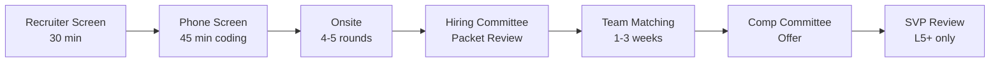
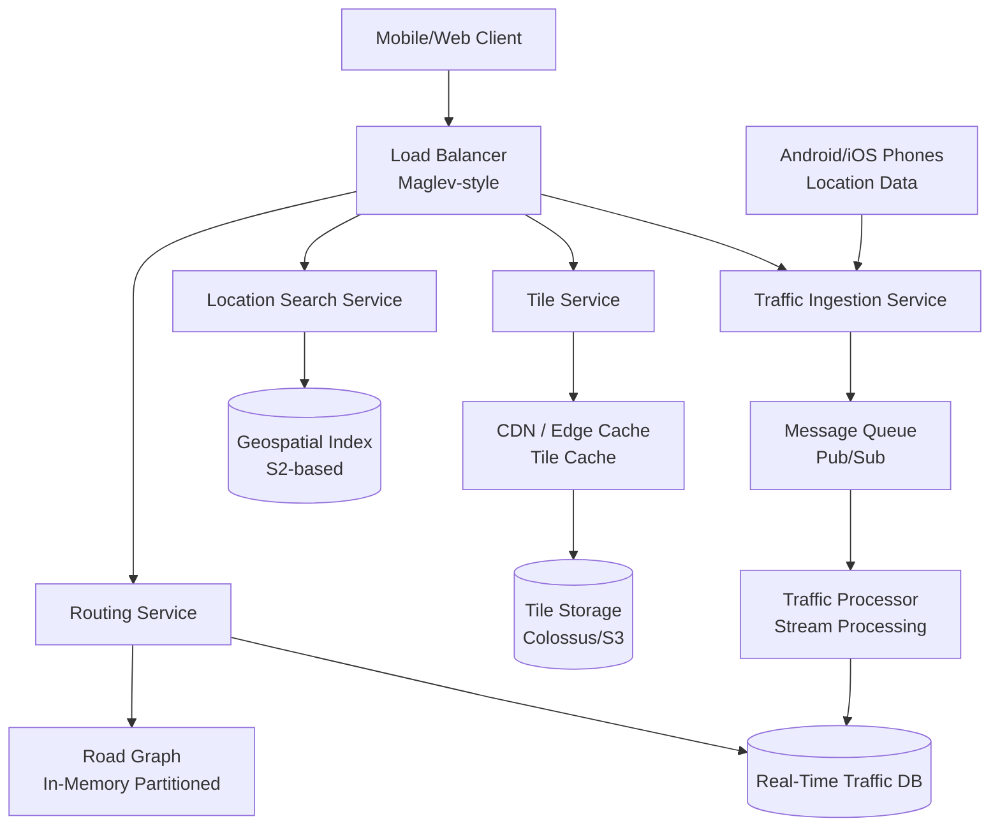
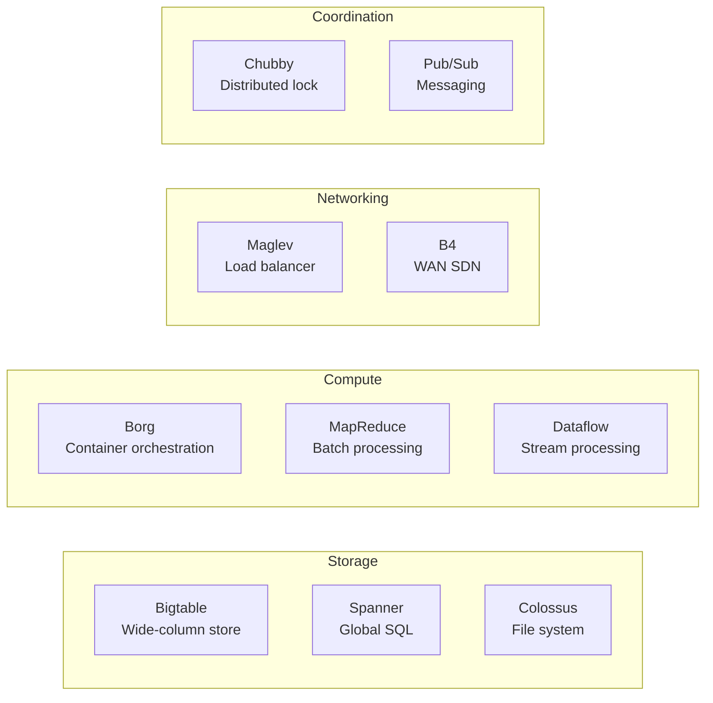

#system-design #interview-prep #google

# Google System Design Interview Guide

> [!info] Navigation
> Back to [[17_company_interview_guide/index]] | Framework: [[07_interview_framework/the_four_step_framework]]

---

## Company Overview

### Engineering Levels

Google uses a level system from L3 (entry-level SWE) through L11 (Senior Fellow). System design interviews begin at L4 and become progressively harder.

| Level | Title | US Total Comp (2024-25) | India Total Comp (2024-25) | System Design? |
|-------|-------|------------------------|---------------------------|----------------|
| L3 | SWE II | $180K - $260K | INR 25L - 45L | Light / Optional |
| L4 | SWE III | $260K - $380K | INR 40L - 70L | Yes (1 round) |
| L5 | Senior SWE | $380K - $550K | INR 60L - 1.2Cr | Yes (1-2 rounds) |
| L6 | Staff SWE | $550K - $800K | INR 1Cr - 2Cr | Yes (2 rounds) |
| L7 | Senior Staff | $800K - $1.3M | INR 1.5Cr - 3Cr+ | Yes (2 rounds, leadership) |

> [!note] Comp Breakdown
> US comp is roughly 60% base, 25% RSU (4-year vest, front-loaded after 2025 change), 15% bonus. India comp is roughly 70% base, 20% RSU, 10% bonus. Refresher grants are significant at L5+.

### Team Structure

- Google organizes into **Product Areas** (PAs): Search, Ads, Cloud, YouTube, Android, Chrome, etc.
- Each PA has multiple teams. You do NOT pick a team before interviewing.
- **Team matching happens AFTER you pass the hiring committee** (HC). This is unique to Google.
- Your interviewer may not be on the team you eventually join.

### What Google Looks For: "Googliness"

Google evaluates on four axes (confirmed by internal rubrics leaked/shared):

1. **General Cognitive Ability (GCA)** - Can you break down ambiguous problems?
2. **Role-Related Knowledge (RRK)** - Do you know distributed systems, data structures, scale?
3. **Leadership** - Do you drive the conversation or wait for hints?
4. **Googliness** - Collaborative, humble, pushback gracefully, comfortable with ambiguity

For system design specifically, **RRK and GCA are the primary signals**.

---

## Interview Process

### Pipeline Overview



### Timeline

| Stage | Duration | Notes |
|-------|----------|-------|
| Application to recruiter screen | 1-3 weeks | Referrals skip to phone screen |
| Phone screen to onsite | 1-2 weeks | Sometimes same week |
| Onsite to HC decision | 2-6 weeks | This is the slow part |
| HC to team matching | 1-3 weeks | You talk to 2-5 teams |
| Team match to offer | 1-2 weeks | Comp committee finalizes |
| **Total end-to-end** | **6-14 weeks** | Average is ~8 weeks |

### Onsite Round Breakdown

| Round | Type | Duration | Applies To |
|-------|------|----------|------------|
| 1 | Coding (DSA) | 45 min | All levels |
| 2 | Coding (DSA) | 45 min | All levels |
| 3 | System Design | 45 min | L4+ |
| 4 | System Design OR Behavioral | 45 min | L5+ get 2nd SD |
| 5 | Behavioral (Googleyness + Leadership) | 45 min | All levels |

### How System Design Differs by Level

| Aspect | L3/L4 | L5 | L6+ |
|--------|-------|----|-----|
| Scope | Single service, clear requirements | Multi-service, ambiguous | Org-wide system, vague prompt |
| Estimation | Guided, basic math | Self-driven, accurate | Expected without prompting |
| Depth | 1 deep-dive area | 2-3 deep-dive areas | Architecture-level decisions |
| Trade-offs | Acknowledge them | Analyze with data | Drive decisions with reasoning |
| APIs | Basic REST design | Versioned, paginated, error-handled | API contracts across services |
| Data model | Schema design | Sharding + replication strategy | Multi-region, consistency models |
| Driving | Interviewer guides 40% | Candidate drives 70% | Candidate drives 90% |

---

## System Design Round Details

### Format

- **Duration**: 45 minutes (strict — Google interviewers are trained to cut off)
- **Medium**: Google Doc (virtual) or whiteboard (onsite). Since 2022, most are virtual via Google Meet with a shared doc.
- **Structure**: Interviewer gives a 1-sentence prompt. YOU drive from there.
- **Interviewer role**: They have a rubric with specific "signal moments" they are looking for. They will redirect you if you go off track, but L5+ candidates should need minimal redirection.

### Google's Scoring Rubric

Google uses a 4-point scale internally:

| Score | Label | What It Means |
|-------|-------|---------------|
| **4** | Strong Hire | Exceeded expectations. Clear, structured, deep. Would be a top 10% hire. |
| **3** | Lean Hire | Met expectations. Solid design with good trade-offs. Minor gaps. |
| **2** | Lean No Hire | Below expectations. Gaps in fundamentals or scale thinking. |
| **1** | Strong No Hire | Significantly below bar. Memorized answer or no structure. |

> [!warning] The Hiring Committee Threshold
> You generally need **no scores below 2** and **at least two 3+ scores** across all rounds to pass HC. A single "Strong No Hire" in system design is almost always a rejection, even if coding rounds are perfect.

### Google's Four Evaluation Axes for System Design

1. **Requirements Gathering & Estimation**
   - Did you clarify scope before designing?
   - Did you do back-of-envelope calculations?
   - Did you identify functional vs non-functional requirements?

2. **High-Level Design & API Design**
   - Is the architecture clean and logical?
   - Are APIs well-designed (RESTful, clear contracts)?
   - Is the data model appropriate?

3. **Scalability & Deep Dives**
   - Can you handle Google-scale (billions of users)?
   - Can you go deep on at least one component?
   - Do you understand caching, sharding, replication?

4. **Trade-off Analysis**
   - Can you articulate WHY you made each choice?
   - Do you acknowledge alternatives?
   - Do you reason about consistency vs availability?

---

## Top 10 Most-Asked System Design Questions at Google

### Overview Table

| # | Question | Typical Level | Frequency | Vault Link |
|---|----------|--------------|-----------|------------|
| 1 | Design Google Maps | L5+ | Very High | [[05_case_studies/design_google_maps]] |
| 2 | Design YouTube / Video Streaming | L5+ | Very High | [[05_case_studies/design_video_streaming]] |
| 3 | Design Web Crawler | L4+ | High | [[05_case_studies/design_web_crawler]] |
| 4 | Design Search Autocomplete | L4+ | High | [[05_case_studies/design_search_autocomplete]] |
| 5 | Design Google Docs | L5+ | High | [[05_case_studies/design_google_docs]] |
| 6 | Design URL Shortener | L3/L4 | Medium | [[05_case_studies/design_url_shortener]] |
| 7 | Design Distributed Cache | L4+ | Medium | [[05_case_studies/design_distributed_cache]] |
| 8 | Design Rate Limiter | L4+ | Medium | [[05_case_studies/design_rate_limiter]] |
| 9 | Design Key-Value Store | L5+ | Medium | [[05_case_studies/design_key_value_store]] |
| 10 | Design Gmail / Notification System | L4+ | Medium | [[05_case_studies/design_notification_system]] |

---

### 1. Design Google Maps (L5+)

**What Google specifically emphasizes:**
- **Graph algorithms at scale**: Dijkstra/A* on a road network with billions of edges. They want you to discuss pre-computation (contraction hierarchies) vs real-time routing.
- **Tile-based rendering**: How map tiles are generated, cached, and served at different zoom levels. Mention QuadTrees and Hilbert curves.
- **ETA prediction**: ML-based traffic prediction, not just shortest path. They love hearing about real-time data ingestion from phones.
- **Location indexing**: Geospatial indexing using S2 geometry (Google's actual library). Mention S2 cells explicitly.
- **Offline support**: How do you handle map downloads and offline routing?

**Google-internal references to drop**: S2 Geometry Library, Bigtable for tile storage, Borg for compute scheduling, traffic data from Android phones.

See: [[05_case_studies/design_google_maps]]

---

### 2. Design YouTube / Video Streaming (L5+)

**What Google specifically emphasizes:**
- **Upload pipeline**: Transcoding at scale. YouTube processes 500+ hours of video per minute. How do you parallelize transcoding across resolutions (360p, 720p, 1080p, 4K)?
- **CDN and edge caching**: They want to hear about edge PoPs, cache hierarchies, and how popular videos are pre-warmed.
- **Adaptive bitrate streaming**: HLS/DASH, how the client switches quality based on bandwidth. Discuss chunked transfer.
- **Recommendation feed**: Not deep ML, but the data pipeline — how do you generate and serve personalized feeds at scale?
- **Content moderation**: How do you scan uploads for policy violations before they go live?

**Google-internal references to drop**: Colossus (distributed file system), Borg (container orchestration), Vitess (YouTube's MySQL sharding layer), Maglev (load balancer).

See: [[05_case_studies/design_video_streaming]]

---

### 3. Design Web Crawler (L4+)

**What Google specifically emphasizes:**
- **Politeness and robots.txt**: They care deeply about crawl ethics. Rate limiting per domain is mandatory.
- **URL frontier management**: Priority queues, URL deduplication (Bloom filters), how to handle billions of URLs.
- **Freshness vs coverage trade-off**: How do you decide which pages to re-crawl and how often?
- **Distributed coordination**: How do multiple crawler nodes avoid duplicating work? Consistent hashing for URL assignment.
- **Content extraction**: Parsing HTML, extracting links, handling JavaScript-rendered pages.

**Google-internal references to drop**: MapReduce for processing crawled data, Bigtable for storing crawl state, PageRank for prioritization.

See: [[05_case_studies/design_web_crawler]]

---

### 4. Design Search Autocomplete (L4+)

**What Google specifically emphasizes:**
- **Trie data structures**: In-memory tries for prefix matching, but at Google scale you need distributed tries.
- **Ranking**: Not just prefix match — personalization, trending queries, geography-aware suggestions.
- **Latency**: Autocomplete must return in <100ms. Every keystroke triggers a request. Discuss debouncing and client-side caching.
- **Data collection pipeline**: How do you aggregate search queries to build suggestion data? Discuss privacy (k-anonymity, differential privacy).
- **Freshness**: How do trending topics (breaking news) appear in autocomplete within minutes?

**Google-internal references to drop**: Spanner for globally consistent suggestion data, Bigtable for query logs, Borg for serving infrastructure.

See: [[05_case_studies/design_search_autocomplete]]

---

### 5. Design Google Docs (L5+)

**What Google specifically emphasizes:**
- **Real-time collaboration**: Operational Transformation (OT) vs CRDTs. Google Docs uses OT — know the difference and trade-offs.
- **Conflict resolution**: What happens when two users edit the same paragraph simultaneously? Walk through a concrete example.
- **Presence**: Showing cursors, selections, who's online. This is a separate real-time channel.
- **Storage and versioning**: How do you store document history efficiently? Discuss snapshots + deltas.
- **Permission model**: ACLs, sharing links, organization-wide access. This is more important than you think.

**Google-internal references to drop**: Paxos/Raft for consensus, Spanner for strongly consistent storage, Chubby for distributed locking.

See: [[05_case_studies/design_google_docs]]

---

### 6. Design URL Shortener (L3/L4 Warm-up)

**What Google specifically emphasizes:**
- This is a **warm-up question** or used for L3/L4 candidates. If you get this at L5+, they expect you to finish in 20 minutes and then they give a harder follow-up.
- **Hash collision handling**: Base62 encoding, counter-based vs hash-based ID generation.
- **Read-heavy optimization**: 100:1 read-to-write ratio. Caching strategy with [[02_building_blocks/caching]].
- **Analytics**: Click tracking, geographic distribution, time-series data.
- **Expiration**: TTL handling, cleanup jobs, storage reclamation.

See: [[05_case_studies/design_url_shortener]]

---

### 7. Design Distributed Cache (L4+)

**What Google specifically emphasizes:**
- **Consistent hashing**: This is non-negotiable. See [[03_design_patterns/consistent_hashing]].
- **Cache eviction policies**: LRU, LFU, TTL-based. When to use which.
- **Cache coherence**: How do you handle stale data across cache nodes? Invalidation vs TTL.
- **Hot key problem**: What if one key gets 10x the traffic? Discuss replication of hot keys.
- **Failure handling**: What happens when a cache node dies? Thundering herd problem.

See: [[05_case_studies/design_distributed_cache]]

---

### 8. Design Rate Limiter (L4+)

**What Google specifically emphasizes:**
- **Algorithm choices**: Token bucket, sliding window, fixed window, leaky bucket. Know trade-offs of each.
- **Distributed rate limiting**: How do you enforce global rate limits across multiple servers? Discuss eventual consistency.
- **Granularity**: Per-user, per-IP, per-API-key, per-endpoint. Multi-tier rate limiting.
- **Performance**: Rate limiter is on the hot path. Must be <1ms. Where do you store counters?
- **Graceful degradation**: What happens when the rate limiter itself fails? Fail open vs fail closed.

See: [[05_case_studies/design_rate_limiter]]

---

### 9. Design Key-Value Store (L5+)

**What Google specifically emphasizes:**
- **Consistency models**: This is where they test [[01_fundamentals/cap_theorem]] and [[01_fundamentals/consistency_models]] deeply.
- **Replication strategy**: Leader-follower vs leaderless. Quorum reads/writes (W + R > N).
- **Partitioning**: Consistent hashing with virtual nodes. Rebalancing strategy.
- **Write path**: Write-ahead log, memtable, SSTable, compaction (LSM-tree). Know the Bigtable paper.
- **Read path**: Bloom filters to avoid unnecessary disk reads. Read repair.

**Google-internal references to drop**: Bigtable (the OG paper), Spanner (strongly consistent), Megastore.

See: [[05_case_studies/design_key_value_store]]

---

### 10. Design Gmail / Notification System (L4+)

**What Google specifically emphasizes:**
- **Email-specific challenges**: SMTP protocol, spam filtering pipeline, attachment storage.
- **Notification fan-out**: Push vs pull, priority channels, batching, user preference management.
- **Search on email**: Full-text search over billions of emails per user. Inverted index design.
- **Storage**: Email is append-heavy. How do you store and retrieve efficiently? Labels as virtual folders.
- **Reliability**: Email cannot be lost. Discuss durability guarantees, exactly-once delivery.

See: [[05_case_studies/design_notification_system]]

---

## Google-Specific Patterns and Expectations

### Pattern 1: Estimation is Mandatory

Unlike other companies where estimation is "nice to have," at Google it is a **scored evaluation criterion**. Every system design answer should begin with numbers.

**Key numbers to memorize (see [[08_reference/powers_of_two]] and [[08_reference/latency_numbers]]):**

| Metric | Value | Use Case |
|--------|-------|----------|
| Google Search QPS | ~100K | Baseline for "Google-scale" |
| YouTube daily uploads | 500+ hours/min | Storage estimation |
| Gmail users | ~1.8 billion | User-scale estimation |
| Google Maps daily users | ~1 billion | Request volume estimation |
| Average HTTP request size | ~1-10 KB | Bandwidth estimation |
| Average video size (1 min, 720p) | ~50 MB | Storage estimation |
| SSD random read | ~100 microseconds | Latency estimation |
| Network round-trip (same DC) | ~0.5 ms | Latency estimation |
| Network round-trip (cross-continent) | ~100-150 ms | Geo-distribution estimation |
| Disk sequential write throughput | ~200 MB/s | Write throughput estimation |

**Estimation template Google interviewers expect:**

```
1. Users: DAU, MAU
2. Read/Write ratio
3. QPS: average and peak (peak = 3-5x average)
4. Storage: per-object size x objects/day x retention period
5. Bandwidth: QPS x object size
6. Memory (cache): 80/20 rule — cache 20% of daily data
```

### Pattern 2: Google-Scale Thinking

Google interviewers are trained to push you on scale. Common probes:

- "What if we have 10x the users?" — Your design should handle this without rearchitecting
- "What happens in a single datacenter failure?" — Multi-region is expected at L5+
- "What's the bottleneck?" — Identify it before they ask
- "How do you monitor this?" — Metrics, alerting, SLOs

**Scale thresholds that change your architecture:**

| Scale | Implication |
|-------|-------------|
| <1K QPS | Single server, monolith is fine |
| 1K-10K QPS | Need load balancer, read replicas |
| 10K-100K QPS | Need caching layer, sharding |
| 100K-1M QPS | Need CDN, multi-region, async processing |
| 1M+ QPS | Need custom infrastructure, edge computing |

### Pattern 3: They Love Consistency Model Discussions

Google invented Spanner — they care deeply about consistency. Be ready to discuss:

- **Strong consistency**: When is it worth the latency cost? (Financial transactions, inventory)
- **Eventual consistency**: When is it acceptable? (Social feeds, view counts)
- **Causal consistency**: Middle ground — what depends on what?
- **Read-your-writes**: Users should see their own updates immediately

Reference: [[01_fundamentals/consistency_models]] and [[01_fundamentals/cap_theorem]]

### Pattern 4: Know Google's Internal Technology Stack

You do NOT need to say "we should use Bigtable." But referencing Google's internal systems shows depth and research. Use them as analogies.

| Google System | Open-Source Equivalent | What It Does |
|---------------|----------------------|--------------|
| Bigtable | HBase, Cassandra | Wide-column store, sparse, sorted |
| Spanner | CockroachDB, YugabyteDB | Globally distributed SQL with strong consistency |
| Colossus | HDFS | Distributed file system (successor to GFS) |
| Borg | Kubernetes | Container orchestration (K8s was born from Borg) |
| MapReduce | Hadoop MapReduce | Batch processing (largely replaced by Flume/Dataflow) |
| Chubby | ZooKeeper, etcd | Distributed lock service and configuration store |
| Maglev | NGINX (sort of) | Network load balancer using consistent hashing |
| Dremel | Apache Drill, Presto | Interactive SQL on large datasets (powers BigQuery) |
| Pub/Sub | Kafka, RabbitMQ | Message queue / event streaming |
| Megastore | - | Scalable storage with ACID across DCs (deprecated) |

**How to use these in an interview:**

> "For this tile storage, we could use something like Bigtable — a wide-column store optimized for sparse data with row-key-based access. The open-source equivalent would be HBase or Cassandra, but Bigtable gives us single-digit-millisecond reads at petabyte scale."

### Pattern 5: WHY Over WHAT

Google interviewers are explicitly trained to probe your reasoning. Every design choice needs a "because."

**Bad**: "I'll use Redis for caching."
**Good**: "I'll use an in-memory cache like Redis or Memcached. Redis gives us data structures (sorted sets for leaderboards) and persistence options, but Memcached is simpler and faster for pure key-value lookups. For this use case — caching user profile data — Memcached is sufficient because we don't need persistence; the source of truth is in the database."

---

## Sample Interview Walkthrough: Design Google Maps

This is Google's most-asked system design question. Here is a full 45-minute walkthrough showing exactly what a "Strong Hire" answer looks like.

### Minutes 0-5: Requirements Gathering

**You should ask these questions:**

> "Before I start designing, let me clarify the scope. When you say Google Maps, which features are in scope?"

| Question | Expected Answer | Why You Ask |
|----------|----------------|-------------|
| "Are we designing the full product or specific features?" | "Focus on: map rendering, routing (A-to-B navigation), and location search." | Scopes down the problem |
| "What platforms? Web, mobile, both?" | "Both, but focus on the backend." | Avoids wasting time on UI details |
| "Do we need real-time traffic?" | "Yes, traffic-aware routing." | Adds complexity to routing |
| "What about offline support?" | "Out of scope for now." | Removes a large feature area |
| "What's our target user base?" | "1 billion DAU globally." | Sets scale expectations |
| "What latency is acceptable for route calculation?" | "Under 2 seconds for most routes." | Sets performance targets |

**Write down requirements explicitly:**

Functional Requirements:
1. Render map tiles at various zoom levels
2. Search for locations by name or address
3. Calculate routes between two points with traffic awareness
4. Display real-time traffic conditions
5. Provide ETA estimation

Non-Functional Requirements:
1. 1 billion DAU, geographically distributed
2. Route calculation < 2 seconds (P99)
3. Map tile load < 200ms
4. High availability (99.99%)
5. Support for incremental map updates

### Minutes 5-10: Back-of-Envelope Estimation

**Show your math. Write every step.**

```
Users and Traffic:
- DAU: 1 billion
- Each user makes ~5 map tile requests/session, ~2 sessions/day
- Tile requests: 1B x 5 x 2 = 10B tile requests/day
- Tile QPS: 10B / 86400 = ~115K QPS (average)
- Peak QPS: ~350K QPS (3x average, rush hour)

- Route requests: ~10% of users request routing/day = 100M routes/day
- Route QPS: 100M / 86400 = ~1,150 QPS average, ~3,500 peak

Storage:
- World road network: ~1 billion road segments
- Each segment: ~200 bytes (coordinates, speed limit, road type, etc.)
- Road graph: 1B x 200B = ~200 GB (fits in memory across cluster)
- Map tiles: ~20 zoom levels, Earth surface ~510M km^2
- Pre-rendered tiles: ~50 billion tiles total at all zoom levels
- Average tile: ~20 KB (PNG/WebP)
- Total tile storage: 50B x 20KB = ~1 PB
- With multiple styles (satellite, terrain): ~5 PB

Bandwidth:
- Tile serving: 115K QPS x 20 KB = ~2.3 GB/s average
- Peak: ~7 GB/s
```

> [!tip] Interviewer Signal Moment
> When you write estimation unprompted and show your work, this is one of the strongest positive signals at Google. See [[07_interview_framework/signal_moments]].

### Minutes 10-25: High-Level Design

**Draw this architecture:**



**Walk through each component:**

**1. Tile Service**
- Pre-renders map tiles at 20+ zoom levels
- Tiles are static and highly cacheable
- Serve from CDN edge nodes (95%+ cache hit rate expected)
- Use QuadTree-based tile addressing: zoom/x/y
- Tiles generated offline via MapReduce-style pipeline

**2. Routing Service**
- Partitions the road graph by geographic region using S2 cells
- Each partition fits in memory (~10-20 GB per region)
- Uses modified A* with contraction hierarchies for fast routing
- Contraction hierarchies pre-compute "shortcut" edges — reduces a 1M-node graph query from seconds to milliseconds
- Overlays real-time traffic data on edge weights

**3. Location Search Service**
- Geospatial index using S2 cells (Google's actual system)
- S2 maps the Earth's surface onto a unit sphere, then projects onto faces of a cube
- Each cell at level 30 covers ~1 cm^2
- For "coffee near me": find S2 cell for user's location, expand to neighboring cells, query index
- Full-text search over place names using inverted index

**4. Traffic Ingestion Pipeline**
- Android phones (with permission) send anonymized location data
- Aggregate into road segments using map-matching algorithms
- Compute average speed per segment, compare to free-flow speed
- Update traffic DB every 30-60 seconds
- Also ingest data from: traffic cameras, government feeds, Waze reports

**API Design:**

```
# Get map tiles
GET /api/v1/tiles/{zoom}/{x}/{y}
Response: image/webp (tile image)
Headers: Cache-Control: max-age=86400

# Search locations
GET /api/v1/search?q={query}&lat={lat}&lng={lng}&radius={radius}
Response: { results: [{ place_id, name, lat, lng, address, type }] }

# Calculate route
POST /api/v1/routes
Body: {
  origin: { lat, lng },
  destination: { lat, lng },
  waypoints: [{ lat, lng }],  // optional
  departure_time: "2025-01-15T08:00:00Z",
  mode: "driving" | "walking" | "transit"
}
Response: {
  routes: [{
    distance_meters: 15200,
    duration_seconds: 1080,
    polyline: "encoded_polyline_string",
    steps: [{ instruction, distance, duration, polyline }],
    traffic_summary: "moderate"
  }]
}

# Get real-time traffic for viewport
GET /api/v1/traffic?bbox={south},{west},{north},{east}&zoom={zoom}
Response: { segments: [{ polyline, speed_ratio, color }] }
```

### Minutes 25-40: Deep Dives

Google interviewers will pick 2-3 areas to drill into. Here are the most common deep-dives for Google Maps and how to handle each.

**Deep Dive 1: Routing Algorithm at Scale**

Interviewer: "Walk me through how a route is actually calculated."

Your answer:

> "Naive Dijkstra on a billion-edge graph would take too long. We use contraction hierarchies (CH), which is what Google actually uses in production.
>
> **Preprocessing (offline, done once):**
> 1. Rank all nodes by importance (intersections of highways > residential streets)
> 2. For each node, in order of importance: if removing this node creates a longer shortest path between its neighbors, add a shortcut edge
> 3. This creates a hierarchy where highways are at the top
>
> **Query time (online):**
> 1. Run bidirectional Dijkstra — one from source going UP the hierarchy, one from target going UP
> 2. They meet at some high-level node (likely on a highway)
> 3. Unpack the shortcut edges to get the actual path
> 4. Query time: ~milliseconds instead of seconds
>
> **Traffic overlay:**
> - Edge weights are base_time + traffic_delay
> - Traffic delay comes from real-time traffic DB
> - For departure-time-aware routing, use time-dependent edge weights"

**Deep Dive 2: Tile Rendering and Caching**

Interviewer: "How do you handle tile caching at this scale?"

Your answer:

> "Three-tier caching strategy:
>
> **Tier 1 — Client cache**: Mobile app caches tiles locally. Key = zoom/x/y. LRU eviction, ~200MB budget. This handles ~60% of requests (users revisit same areas).
>
> **Tier 2 — CDN edge**: Tiles are served from edge PoPs (200+ locations globally). Cache-Control headers set to 24 hours for most tiles. Cache hit rate: ~95% for populated areas. This is where the CDN shines — tiles are static and highly cacheable.
>
> **Tier 3 — Origin storage**: Tiles stored in a distributed file system (Colossus-like). Tiles are pre-rendered offline. Only accessed on CDN cache miss.
>
> **Cache invalidation**: When map data changes (new road, business update), we regenerate affected tiles. Use a pub/sub system to notify CDN edge nodes to purge stale tiles. Tiles at different zoom levels have different update frequencies — zoom level 18 (street level) changes more often than zoom level 5 (country level)."

**Deep Dive 3: How Does S2 Geospatial Indexing Work?**

Interviewer: "Explain the spatial indexing for location search."

Your answer:

> "S2 is a spherical geometry library that maps Earth's surface to a Hilbert curve on a cube.
>
> **Key ideas:**
> 1. Project the sphere onto 6 cube faces
> 2. On each face, use a Hilbert curve to map 2D space to 1D
> 3. This creates a cell ID — a single 64-bit integer that represents any region on Earth
> 4. At level 30, each cell is ~1 cm^2. At level 12, ~3.3 km^2.
>
> **For 'coffee near me' query:**
> 1. Convert user's lat/lng to S2 cell ID at appropriate level
> 2. Find covering cells for the search radius (e.g., 1 km radius might be covered by ~8 level-14 cells)
> 3. Query the geospatial index: SELECT * FROM places WHERE s2_cell BETWEEN cell_start AND cell_end
> 4. Because S2 cell IDs preserve spatial locality (nearby points have similar IDs), this is a simple range query — very efficient on a sorted data store like Bigtable
>
> **Why S2 over geohash?** S2 has no discontinuities at edges (geohashes break at boundaries), and S2 cells are more uniform in size across latitudes."

### Minutes 40-45: Wrap-Up

**Monitoring and SLOs:**

| SLO | Target | How to Measure |
|-----|--------|---------------|
| Tile latency (P99) | < 200ms | Client-side instrumentation |
| Route latency (P99) | < 2s | Server-side timer |
| Search latency (P99) | < 300ms | Server-side timer |
| Tile CDN hit rate | > 95% | CDN metrics |
| System availability | 99.99% | Uptime monitoring |
| Traffic data freshness | < 2 min | Pipeline lag metric |

**Future improvements to mention:**
- Predictive routing: Pre-compute routes for common commute patterns
- 3D building rendering: WebGL-based 3D tiles
- AR navigation: Camera-based overlay for walking directions
- Multi-modal routing: Combine driving + transit + walking

---

## What Google Interviewers Love (Green Flags)

### 1. Quantitative Thinking Without Being Asked

**Example**: Before the interviewer asks about scale, you say:
> "Let me estimate the traffic first. With 1 billion DAU and an average of 10 tile requests per session..."

This shows you internalize scale thinking. See [[07_interview_framework/estimation_cheat_sheet]].

### 2. Proactive Trade-off Discussion

**Example**: Without being prompted:
> "We have a choice here between strong consistency and availability for the location search index. I'd choose eventual consistency with a staleness window of ~30 seconds because users can tolerate slightly outdated search results, and this lets us scale reads across replicas without coordination overhead. However, for the routing service, we need the latest traffic data, so I'd use a real-time stream processing pipeline with at-most 60-second lag."

### 3. Referencing Google's Internal Systems Appropriately

**Do this**: "For the tile storage layer, we need something like Colossus — a distributed file system optimized for large, immutable files. In an open-source stack, this would be HDFS or S3."

**Do NOT do this**: "We should use Colossus because Google uses it." (You are not designing for Google's infrastructure.)

### 4. Clean API Design with Versioning

```
GET /api/v1/tiles/{zoom}/{x}/{y}
     ^^^^
     Version in path
```

Include: pagination, error codes, rate limit headers, idempotency keys for writes.

### 5. Discussing Failure Modes Proactively

**Example**: "What happens if the traffic ingestion pipeline goes down? Routes would use stale traffic data. We should have a fallback to historical traffic patterns (same day of week, same time) and surface a warning to users that traffic data may be outdated."

### 6. Drawing Clean Diagrams

- Use boxes for services, cylinders for databases, arrows for data flow
- Label every arrow with the protocol (HTTP, gRPC, pub/sub)
- Group related components visually
- Number the steps in a request flow

### 7. Structured Communication

Follow [[07_interview_framework/the_four_step_framework]]:
1. Requirements
2. Estimation
3. High-level design
4. Deep dives

Announce transitions: "Now that we have the high-level design, let me dive deeper into the routing algorithm."

---

## What Gets You Rejected (Red Flags)

See also: [[07_interview_framework/common_red_flags]]

### 1. No Estimation

If you skip straight to drawing boxes, you lose an entire evaluation axis. At L5+, this is nearly disqualifying.

### 2. "We Can Just Use Redis for Everything"

This signals shallow understanding. Every technology choice needs:
- What problem it solves
- Why it is better than alternatives for this specific case
- What its limitations are

### 3. Not Considering Scale

Designing for 1,000 users when the prompt implies Google-scale shows you cannot think at the company's level. Always ask: "What's our target DAU?"

### 4. Unable to Go Deep on Any Component

Breadth without depth gets you a "Lean No Hire." You MUST be able to explain at least one component in detail — the data model, the algorithm, the caching strategy, etc.

### 5. Memorized Answer Without Understanding

Google interviewers are trained to deviate from standard questions. If you recite a textbook answer and cannot handle follow-up questions like "What if we change this constraint?" you will be caught.

**How they test for this**: "What if we need strong consistency instead of eventual? How would that change your design?" If you freeze, they know you memorized.

### 6. Not Driving the Conversation (L5+)

At L5+, the interviewer expects YOU to set the agenda. If you wait for questions after each section, you look like an L4.

### 7. Over-Engineering

Proposing a multi-region active-active setup with CRDTs for a URL shortener signals poor judgment about appropriate complexity.

### 8. Ignoring Non-Functional Requirements

Security, monitoring, alerting, deployment strategy — mentioning these shows production experience. Ignoring them shows you have only done tutorials.

---

## Google-Specific Tips by Level

### L3 (SWE II) — Entry Level

System design is **light or optional** at L3. If asked, expect a simple question.

| Focus Area | What to Demonstrate |
|-----------|-------------------|
| Fundamentals | Client-server model, REST APIs, basic SQL schema |
| Clean design | One clear, correct solution |
| One deep-dive | Pick one area (e.g., database schema) and show depth |
| Communication | Structured approach, check in with interviewer |

**Likely questions**: [[05_case_studies/design_url_shortener]], [[05_case_studies/design_pastebin]]

**Time allocation**: 10 min requirements + estimation, 20 min design, 10 min deep-dive, 5 min wrap-up

---

### L4 (SWE III) — Expected Level for System Design

This is the first level where system design is a **real evaluation criterion**.

| Focus Area | What to Demonstrate |
|-----------|-------------------|
| Trade-off analysis | Present 2 options, pick one with reasoning |
| Estimation | Complete back-of-envelope without prompting |
| Multiple components | Show how 3-5 services interact |
| Data model | Schema + indexes + sharding key |
| Caching strategy | What to cache, eviction policy, invalidation |

**Likely questions**: [[05_case_studies/design_rate_limiter]], [[05_case_studies/design_web_crawler]], [[05_case_studies/design_search_autocomplete]], [[05_case_studies/design_notification_system]]

**Time allocation**: 7 min requirements + estimation, 18 min high-level design, 15 min deep-dive, 5 min wrap-up

---

### L5 (Senior SWE) — The Most Common SD Interview Level

L5 is where most experienced candidates interview. The bar is significantly higher.

| Focus Area | What to Demonstrate |
|-----------|-------------------|
| Drive the conversation | Set the agenda, minimal interviewer guidance |
| Multiple deep-dives | Go deep on 2-3 areas |
| Consistency models | Know when to use strong vs eventual consistency |
| Multi-region design | Active-active, conflict resolution, geo-routing |
| Failure analysis | What fails, how to detect it, how to recover |
| Production readiness | Monitoring, alerting, SLOs, deployment strategy |

**Likely questions**: [[05_case_studies/design_google_maps]], [[05_case_studies/design_video_streaming]], [[05_case_studies/design_google_docs]], [[05_case_studies/design_key_value_store]]

**Time allocation**: 5 min requirements + estimation, 15 min high-level design, 20 min deep-dives, 5 min wrap-up

**Critical L5 pattern**: Identify requirements the interviewer did NOT state. For example, if asked to "Design YouTube," proactively say: "I assume we need content moderation, copyright detection, and geo-restricted content — should I include these?"

---

### L6+ (Staff and Above)

At L6+, the question is often deliberately vague: "Design Google's notification infrastructure" or "Design a global configuration management system."

| Focus Area | What to Demonstrate |
|-----------|-------------------|
| Ambiguity resolution | You define the problem, not the interviewer |
| Organizational impact | How does this system affect other teams? |
| Evolution over time | V1, V2, V3 — how does the system grow? |
| Cost optimization | Infrastructure cost awareness |
| Team and operational model | Who operates this? On-call? SRE? |

**Time allocation**: 5 min scoping (you drive), 10 min estimation + high-level, 25 min deep-dives with trade-off analysis, 5 min operational concerns

---

## Common Follow-Up Questions Google Interviewers Ask

Be prepared for these probes regardless of which question you get:

| Follow-Up | What They're Testing |
|-----------|---------------------|
| "What's the bottleneck in your system?" | Can you identify the weakest link? |
| "How would you handle a datacenter failure?" | Multi-region thinking |
| "What metrics would you monitor?" | Production experience |
| "How would you test this system?" | Testing strategy for distributed systems |
| "What if the requirement changes to need strong consistency?" | Flexibility, consistency model knowledge |
| "How would you migrate from V1 to V2?" | Operational maturity |
| "What's the cost of running this?" | Infrastructure cost awareness |
| "How does this handle a 10x traffic spike?" | Elasticity, auto-scaling |
| "What's the deployment strategy?" | Blue-green, canary, progressive rollout |
| "How do you handle data privacy / GDPR?" | Compliance awareness |

---

## Google-Internal System References Cheat Sheet

When to mention each Google system and what it signals:



| When to Mention | System | Example Phrasing |
|----------------|--------|-----------------|
| Need a KV store at petabyte scale | Bigtable | "A Bigtable-like wide-column store, or Cassandra in open-source" |
| Need strong consistency across regions | Spanner | "A Spanner-like globally consistent database, similar to CockroachDB" |
| Need to store large immutable files | Colossus | "A distributed file system like Colossus or HDFS" |
| Need container orchestration | Borg | "Container orchestration via Borg — Kubernetes in the open-source world" |
| Need distributed locking | Chubby | "A coordination service like Chubby or ZooKeeper" |
| Need batch data processing | MapReduce/Dataflow | "A batch pipeline like MapReduce, though modern systems use Dataflow/Beam" |
| Need load balancing at L4 | Maglev | "A consistent-hashing-based L4 load balancer like Maglev" |

---

## Preparation Checklist

### Core Case Studies (Must Complete)

- [ ] [[05_case_studies/design_google_maps]] — #1 most asked, full walkthrough above
- [ ] [[05_case_studies/design_video_streaming]] — YouTube is Google's core product
- [ ] [[05_case_studies/design_web_crawler]] — Fundamental to Google Search
- [ ] [[05_case_studies/design_search_autocomplete]] — Core Search feature
- [ ] [[05_case_studies/design_google_docs]] — Tests real-time collaboration
- [ ] [[05_case_studies/design_url_shortener]] — Warm-up question, should be fast
- [ ] [[05_case_studies/design_distributed_cache]] — Infrastructure building block
- [ ] [[05_case_studies/design_rate_limiter]] — API infrastructure
- [ ] [[05_case_studies/design_key_value_store]] — Storage fundamentals
- [ ] [[05_case_studies/design_notification_system]] — Fan-out and messaging

### Supporting Case Studies (Recommended)

- [ ] [[05_case_studies/design_chat_system]] — Real-time messaging patterns
- [ ] [[05_case_studies/design_twitter]] — Feed generation and fan-out
- [ ] [[05_case_studies/design_logging_system]] — Observability infrastructure
- [ ] [[05_case_studies/design_zoom]] — Video conferencing at scale

### Fundamentals to Review

- [ ] [[01_fundamentals/cap_theorem]] — Must explain with examples
- [ ] [[01_fundamentals/consistency_models]] — Strong, eventual, causal
- [ ] [[02_building_blocks/load_balancers]] — L4 vs L7, algorithms
- [ ] [[02_building_blocks/caching]] — Strategies, invalidation, consistency
- [ ] [[02_building_blocks/message_queues]] — Pub/sub vs point-to-point
- [ ] [[03_design_patterns/consistent_hashing]] — Virtual nodes, rebalancing
- [ ] [[03_design_patterns/sharding]] — Strategies, hot spots, rebalancing
- [ ] [[03_design_patterns/replication]] — Leader-follower, quorum

### Interview Skills

- [ ] [[07_interview_framework/the_four_step_framework]] — Memorize and practice
- [ ] [[07_interview_framework/estimation_cheat_sheet]] — Must be second nature
- [ ] [[07_interview_framework/common_red_flags]] — Know what to avoid
- [ ] [[07_interview_framework/signal_moments]] — Know what scores points
- [ ] [[08_reference/latency_numbers]] — Memorize the key ones
- [ ] [[08_reference/powers_of_two]] — For quick mental math

### Practice Plan

| Week | Focus | Activities |
|------|-------|-----------|
| 1 | Fundamentals | Review all [[01_fundamentals/]] and [[02_building_blocks/]] notes. Do estimation drills daily. |
| 2 | Core questions | Design Google Maps, YouTube, Web Crawler from scratch (timed 45 min each). |
| 3 | More questions | Design Autocomplete, Google Docs, Distributed Cache, KV Store. |
| 4 | Mock interviews | 3 mock interviews with a partner. Use the timer strictly. Record yourself. |
| 5 | Weak areas | Review mock interview feedback. Re-do weak areas. Study Google internal systems. |
| 6 | Final prep | One mock per day. Review estimation cheat sheet. Light review of all designs. |

### Day-Before Checklist

- [ ] Can you estimate QPS, storage, and bandwidth for any system in under 3 minutes?
- [ ] Can you explain CAP theorem with a concrete example?
- [ ] Can you draw a clean high-level architecture in under 5 minutes?
- [ ] Can you name 5 Google internal systems and their open-source equivalents?
- [ ] Can you explain consistent hashing with virtual nodes?
- [ ] Can you walk through a full 45-minute design without notes?
- [ ] Did you get a good night's sleep?

---

## Quick Reference: The 45-Minute Template

```
┌─────────────────────────────────────────────────┐
│  0:00 - 5:00   REQUIREMENTS & ESTIMATION        │
│  ├─ Clarify scope (functional + non-functional)  │
│  ├─ Write down requirements explicitly           │
│  └─ Back-of-envelope: users, QPS, storage, BW   │
│                                                   │
│  5:00 - 10:00  API DESIGN                        │
│  ├─ Define core endpoints (REST or gRPC)         │
│  ├─ Request/response schemas                     │
│  └─ Pagination, versioning, error handling       │
│                                                   │
│  10:00 - 25:00 HIGH-LEVEL DESIGN                 │
│  ├─ Draw architecture diagram                    │
│  ├─ Walk through each component                  │
│  ├─ Data model / schema design                   │
│  └─ Data flow for key operations                 │
│                                                   │
│  25:00 - 40:00 DEEP DIVES                        │
│  ├─ Interviewer picks 2-3 areas (or you suggest) │
│  ├─ Go deep: algorithms, data structures, scale  │
│  ├─ Trade-offs: present options, pick with reason │
│  └─ Failure modes and mitigation                 │
│                                                   │
│  40:00 - 45:00 WRAP UP                           │
│  ├─ Monitoring: key metrics, SLOs, alerting      │
│  ├─ Bottlenecks and how to address them          │
│  └─ Future improvements (shows vision)           │
└─────────────────────────────────────────────────┘
```

---

## Links to Vault Files

### Case Studies
- [[05_case_studies/design_google_maps]]
- [[05_case_studies/design_video_streaming]]
- [[05_case_studies/design_web_crawler]]
- [[05_case_studies/design_search_autocomplete]]
- [[05_case_studies/design_google_docs]]
- [[05_case_studies/design_url_shortener]]
- [[05_case_studies/design_distributed_cache]]
- [[05_case_studies/design_rate_limiter]]
- [[05_case_studies/design_key_value_store]]
- [[05_case_studies/design_notification_system]]
- [[05_case_studies/design_chat_system]]
- [[05_case_studies/design_twitter]]
- [[05_case_studies/design_logging_system]]
- [[05_case_studies/design_zoom]]
- [[05_case_studies/design_pastebin]]

### Frameworks and Reference
- [[07_interview_framework/the_four_step_framework]]
- [[07_interview_framework/estimation_cheat_sheet]]
- [[07_interview_framework/common_red_flags]]
- [[07_interview_framework/signal_moments]]
- [[08_reference/latency_numbers]]
- [[08_reference/powers_of_two]]

### Fundamentals
- [[01_fundamentals/cap_theorem]]
- [[01_fundamentals/consistency_models]]
- [[02_building_blocks/load_balancers]]
- [[02_building_blocks/caching]]
- [[02_building_blocks/message_queues]]
- [[03_design_patterns/consistent_hashing]]
- [[03_design_patterns/sharding]]
- [[03_design_patterns/replication]]

### Related
- [[10_hld/]] — High-level design notes
- [[11_lld/]] — Low-level design notes
- [[17_company_interview_guide/index]] — Other company guides
