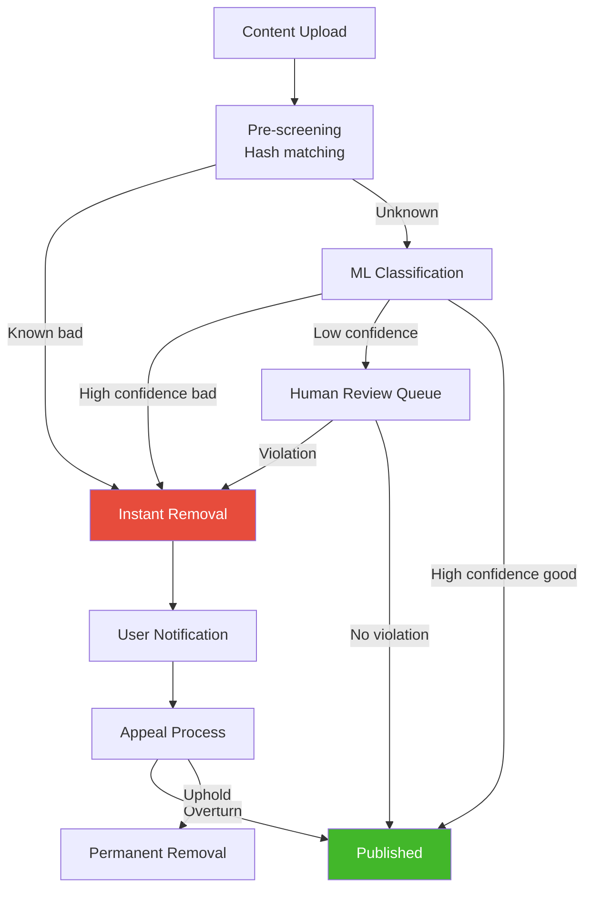

# Meta/Facebook System Design Interview Guide

> **Last Updated:** 2026-02-23
> **Parent:** [[17_company_interview_guide/index]]
> **Framework:** [[07_interview_framework/the_four_step_framework]]

---

## Table of Contents

1. [Company Overview & Levels](#company-overview--levels)
2. [Interview Process](#interview-process)
3. [System Design Round Details](#system-design-round-details)
4. [Top 10 Most-Asked Questions](#top-10-most-asked-questions)
5. [Meta-Specific Patterns](#meta-specific-patterns)
6. [Sample Walkthrough: Design Facebook News Feed](#sample-walkthrough-design-facebook-news-feed)
7. [Red Flags — Instant Rejection](#red-flags--instant-rejection)
8. [Green Flags — Strong Hire Signals](#green-flags--strong-hire-signals)
9. [Meta-Specific Tips by Level](#meta-specific-tips-by-level)
10. [Preparation Checklist](#preparation-checklist)

---

## Company Overview & Levels

### Engineering Levels

Meta uses an IC (Individual Contributor) track from E3 to E9, though interviews
typically target E3 through E7. The expectations per level are clearly defined:

| Level | Title                    | YoE (Typical) | System Design? | Scope                        |
|-------|--------------------------|----------------|-----------------|------------------------------|
| E3    | Software Engineer        | 0-2            | Simplified      | Single feature, guided       |
| E4    | Software Engineer        | 2-5            | Yes (Product)   | Full feature, some trade-offs|
| E5    | Senior Software Engineer | 5-10           | Yes (Deep)      | Multi-service, scale focus   |
| E6    | Staff Engineer           | 8-15           | Yes (Arch-level)| Org-wide, cross-team systems |
| E7    | Senior Staff Engineer    | 12+            | Yes (Vision)    | Company-wide, novel solutions|

> **Key Insight:** E3 and E4 are the same title at Meta — "Software Engineer." The
> difference is scope and compensation. Many candidates with 3-5 years of experience
> get down-leveled from E5 to E4 during the process. This is common and not a red flag.

### Compensation Bands (2025-2026 Ranges)

#### United States (Menlo Park / NYC / Seattle)

| Level | Base Salary (USD) | RSU (4yr total) | Signing Bonus | Total Comp Year 1 |
|-------|--------------------|------------------|---------------|---------------------|
| E3    | $120K - $160K      | $80K - $200K     | $10K - $40K   | $170K - $260K       |
| E4    | $155K - $195K      | $200K - $400K    | $20K - $60K   | $230K - $360K       |
| E5    | $195K - $260K      | $350K - $700K    | $40K - $100K  | $340K - $530K       |
| E6    | $245K - $320K      | $600K - $1.2M    | $50K - $150K  | $450K - $770K       |
| E7    | $300K - $400K      | $1M - $2M+       | $100K - $200K | $650K - $1.1M+      |

> RSUs vest over 4 years with quarterly vesting. Meta moved to quarterly vesting
> in 2021, which is more favorable than the old annual cliff model.

#### India (Hyderabad / Gurugram / Bengaluru)

| Level | Base (INR/yr)     | RSU (4yr, USD) | Total Comp Year 1 (INR) |
|-------|-------------------|----------------|--------------------------|
| E3    | 25L - 40L         | $30K - $80K    | 35L - 60L                |
| E4    | 35L - 55L         | $80K - $180K   | 55L - 95L                |
| E5    | 50L - 80L         | $180K - $400K  | 90L - 1.6Cr              |
| E6    | 70L - 1.1Cr       | $350K - $700K  | 1.4Cr - 2.5Cr            |

#### London (UK)

| Level | Base (GBP)        | RSU (4yr, USD) | Total Comp Year 1 (GBP)  |
|-------|--------------------|----------------|--------------------------|
| E3    | £65K - £85K        | $60K - $150K   | £85K - £130K              |
| E4    | £80K - £110K       | $150K - $300K  | £120K - £200K             |
| E5    | £110K - £155K      | $300K - $550K  | £190K - £330K             |
| E6    | £140K - £200K      | $500K - $1M    | £280K - £500K             |

### What Meta Looks For

Meta's engineering culture is built on a few core principles that directly influence
how they evaluate candidates:

1. **Move Fast** — Speed of iteration matters more than perfection. In interviews,
   this means they want to see you make decisions quickly, not deliberate endlessly.

2. **Be Bold** — They want engineers who propose ambitious solutions, then scale
   back as needed — not engineers who play it safe from the start.

3. **Focus on Impact** — Every design decision should trace back to user impact.
   "Why does this matter to 3 billion users?" is the implicit question behind
   every interviewer's follow-up.

4. **Be Open** — Communicate your thought process. Meta interviewers penalize
   candidates who go silent and draw without explaining.

5. **Build Social Value** — Meta's products are social. They care deeply about
   how your system serves social interactions, not just data flow.

---

## Interview Process

### Process Overview (Typical E4/E5)


### Stage Breakdown

#### 1. Recruiter Screen (30 min)

- Casual conversation about your background
- They confirm your target level (push for E5 if you have 5+ YoE)
- They explain the process and timeline
- **Ask about:** Team matching process, timeline, whether they're backfilling or net-new

> **Pro Tip:** Meta recruiters are empowered to move fast. If they like you, you can
> go from recruiter screen to onsite in 2-3 weeks. They are known for being one of
> the fastest big-tech pipelines.

#### 2. Phone Screen (45 min)

- **One coding round** (LeetCode medium/hard)
- Conducted over CoderPad or similar
- Topics: arrays, strings, graphs, trees, dynamic programming
- You need to solve 1 hard or 2 mediums cleanly
- **No system design at phone screen stage**

#### 3. Onsite (Virtual or In-Person) — 4-5 Rounds

| Round | Duration | Format                                       | Level Req |
|-------|----------|----------------------------------------------|-----------|
| Coding 1         | 45 min | Algorithm + data structures          | All       |
| Coding 2         | 45 min | Algorithm + data structures          | All       |
| System Design    | 45 min | Product Design (E4+) or System Design| E4+       |
| Behavioral       | 45 min | "Tell me about a time when..."       | All       |
| System Design 2  | 45 min | Architecture-focused (E6+ only)      | E6+       |

> **E3 candidates** do NOT get a system design round. They get a third coding round
> instead. Some E3 candidates get a "lightweight design" question as part of coding.

> **E6+ candidates** get TWO system design rounds: one product-focused, one
> architecture-focused. The architecture round goes deeper into distributed systems,
> consistency models, and failure modes.

#### 4. Hiring Committee (~1 week)

- Interviewers submit independent feedback before any discussion
- Committee reviews all feedback and makes a hire/no-hire/borderline decision
- **Borderline cases** at Meta often result in a "hire at lower level" rather than reject
- No single interviewer can veto — it's consensus-based

#### 5. Team Matching (1-3 weeks)

Meta does **blind hiring** — you interview without a target team, then match after.
This is a distinctive feature of their process.

- You talk to 3-5 hiring managers across different orgs
- **You choose the team**, not the other way around
- Popular orgs: Instagram, WhatsApp, Reality Labs, Ads, Feed, Integrity
- Team matching calls are 30 min each — ask about tech stack, team size, oncall

#### Timeline Summary

| Stage               | Duration        |
|----------------------|-----------------|
| Recruiter → Phone    | 1-2 weeks       |
| Phone → Onsite       | 1-3 weeks       |
| Onsite → HC Decision | 1-2 weeks       |
| HC → Team Matching   | 1-3 weeks       |
| Team Match → Offer   | 3-7 days        |
| **Total**            | **4-10 weeks**  |

> Meta is aggressive about competing with other offers. If you have a competing
> deadline from Google/Amazon/etc, tell your recruiter — they can accelerate the
> entire pipeline to 3-4 weeks total.

---

## System Design Round Details

### The "Product Design" Distinction

**This is the single most important thing to understand about Meta's system design
interview.** At E4+, Meta calls their round "Product Design" or "System Design"
interchangeably, but the emphasis is unmistakably product-first.

What this means in practice:

| Aspect              | Typical SD Interview (Google/Amazon) | Meta "Product Design" Interview     |
|---------------------|--------------------------------------|-------------------------------------|
| Starting point      | "Design X service"                   | "Design X product"                  |
| First 5 minutes     | Clarify technical requirements       | Clarify **user** requirements       |
| API design          | REST/gRPC endpoints                  | User-facing features first, then API|
| Data model          | Entities and relationships           | Social graph + content models       |
| Deep dive           | Scaling, sharding, replication       | **Feed ranking, real-time, privacy**|
| Trade-offs          | CAP theorem, consistency             | User experience vs. latency         |
| Success metric      | Handles X QPS at Y latency           | Serves Z billion users meaningfully |

### Round Structure (45 Minutes)

```
 0:00 - 0:05  →  Problem Statement + Clarifying Questions
 0:05 - 0:10  →  Feature Scoping + Prioritization
 0:10 - 0:15  →  High-Level Architecture
 0:15 - 0:25  →  Core Component Deep Dive
 0:25 - 0:35  →  Scaling + Trade-offs + Edge Cases
 0:35 - 0:45  →  Interviewer-Directed Deep Dive / Q&A
```

### Scoring Rubric (Internal Categories)

Meta interviewers evaluate across these dimensions. Each gets a score:

| Dimension                  | Weight | What They Assess                                              |
|----------------------------|--------|---------------------------------------------------------------|
| **Problem Exploration**    | 20%    | Did you ask the right clarifying questions? Did you scope well?|
| **High-Level Design**      | 25%    | Is your architecture sound? Are components well-chosen?       |
| **Technical Depth**        | 25%    | Can you go deep on at least one component with real expertise?|
| **Trade-off Analysis**     | 15%    | Do you weigh alternatives and justify choices?                |
| **Product Sense**          | 15%    | Do you think about the user? Do you understand social products?|

Final ratings map to:

| Rating                | Meaning                                                  |
|------------------------|----------------------------------------------------------|
| **Strong Hire**        | Exceeded expectations; would fight for this candidate    |
| **Hire**               | Met the bar; confident they'd succeed at this level      |
| **Lean Hire**          | Borderline positive; some concerns but mostly good       |
| **Lean No Hire**       | Borderline negative; showed some skill but gaps too large|
| **No Hire**            | Did not meet the bar; clear gaps in fundamentals         |
| **Strong No Hire**     | Significant red flags; not close to the bar              |

> You need mostly **Hire** or above across all rounds to pass HC. One **Lean No Hire**
> can be overcome if other rounds are strong. Two or more and it's typically a reject.

---

## Top 10 Most-Asked Questions

### 1. Design Facebook News Feed

| Attribute     | Detail                                                      |
|---------------|-------------------------------------------------------------|
| **Level**     | E5+ (also asked at E4 with reduced scope)                   |
| **Frequency** | Very High — Meta's signature question                       |
| **Vault Link**| [[05_case_studies/design_twitter]]                          |

**What Meta Specifically Emphasizes:**

- **Fan-out strategy:** Fan-out on write vs. fan-out on read. Meta uses a hybrid
  approach internally. For celebrity accounts (high follower count), they use
  fan-out on read. For regular users, fan-out on write. You MUST discuss this.
- **Ranking algorithm:** Don't just show chronological. Meta wants you to design
  a ranking pipeline — ML scoring, engagement prediction, diversity injection.
- **Social graph integration:** How do you leverage friend-of-friend connections,
  mutual friends, group memberships to rank content?
- **Real-time updates:** How does the feed update when a friend posts? Long polling?
  WebSockets? Server-Sent Events?
- **Content types:** Text, photos, videos, links, stories, reels — how does your
  system handle heterogeneous content?

**Key numbers to know:**
- 2B+ daily active users
- Average user has ~300-400 friends
- Average feed load serves ~50-200 posts
- P99 feed latency target: < 500ms

---

### 2. Design Instagram

| Attribute     | Detail                                                      |
|---------------|-------------------------------------------------------------|
| **Level**     | E4+ (one of the most common E4 questions)                   |
| **Frequency** | Very High                                                   |
| **Vault Link**| [[05_case_studies/design_instagram_stories]]                |

**What Meta Specifically Emphasizes:**

- **Photo upload pipeline:** Client → CDN → image processing (resize, filter, thumbnail)
  → storage. How do you handle 100M+ uploads/day?
- **Stories vs. Feed:** Ephemeral content (24hr TTL) vs. permanent posts. Different
  storage and caching strategies.
- **Explore/Discovery:** How do you recommend content to users who don't follow the
  creator? This is where ML and engagement signals come in.
- **CDN strategy:** Geographic distribution of content. How do you serve images in
  < 100ms globally?
- **Social features:** Likes, comments, DMs, tagging — how do these interact with
  the main photo system?

---

### 3. Design Facebook Messenger

| Attribute     | Detail                                                      |
|---------------|-------------------------------------------------------------|
| **Level**     | E4+                                                         |
| **Frequency** | High                                                        |
| **Vault Link**| [[05_case_studies/design_chat_system]]                      |

**What Meta Specifically Emphasizes:**

- **Real-time delivery:** WebSocket connections, connection management at scale
  (billions of concurrent connections). How do you route messages when sender and
  receiver are on different servers?
- **Group chats:** Fan-out to group members. How do you handle groups with 250
  members? What about broadcast lists?
- **Read receipts and presence:** How do you track who's online and who's read
  which message? This is a massive write amplification problem.
- **End-to-end encryption:** Meta rolled out E2EE for Messenger. How does this
  affect your architecture? Key exchange, message storage.
- **Offline message delivery:** How do you queue messages for users who are offline
  and deliver when they come back?
- **Media messages:** Photos, videos, voice messages, files. How do you handle
  large media in a real-time chat context?

See also: [[02_building_blocks/message_queues]], [[03_design_patterns/pub_sub]]

---

### 4. Design Live Video Streaming

| Attribute     | Detail                                                      |
|---------------|-------------------------------------------------------------|
| **Level**     | E5+                                                         |
| **Frequency** | Medium-High                                                 |
| **Vault Link**| [[05_case_studies/design_video_streaming]]                  |

**What Meta Specifically Emphasizes:**

- **Ingest pipeline:** How does a live video stream get from a phone camera to
  viewers? RTMP ingest → transcoding → adaptive bitrate → CDN edge distribution.
- **Ultra-low latency:** Facebook Live targets < 5 second latency. How do you
  achieve this vs. typical 30-60 second HLS latency?
- **Concurrent viewers:** A viral live stream can have 1M+ concurrent viewers.
  How do you scale the distribution layer?
- **Live comments and reactions:** Real-time overlay of social engagement on the
  stream. This is a separate real-time system layered on top.
- **Recording and replay:** Once the live stream ends, it becomes a VOD. How do
  you handle this transition?

---

### 5. Design URL Shortener

| Attribute     | Detail                                                      |
|---------------|-------------------------------------------------------------|
| **Level**     | E3 (warm-up / phone screen level)                           |
| **Frequency** | Medium (more common for E3, rare for E5+)                   |
| **Vault Link**| [[05_case_studies/design_url_shortener]]                    |

**What Meta Specifically Emphasizes:**

- **This is a calibration question.** Meta uses it to quickly assess if a candidate
  can think about system design at all. For E3, doing this well is sufficient.
- **Analytics:** Click tracking, geographic distribution, referrer tracking. Meta
  cares about the data pipeline aspect.
- **Custom aliases:** How do you handle vanity URLs? Collision detection?
- **Scale:** 100M URLs created/day, 10B redirects/day. Can you design for this?
- **Expiration and cleanup:** How do you handle link rot? TTL? Archival?

See also: [[02_building_blocks/caching]], [[08_reference/latency_numbers]]

---

### 6. Design Content Moderation Pipeline

| Attribute     | Detail                                                      |
|---------------|-------------------------------------------------------------|
| **Level**     | E5+                                                         |
| **Frequency** | Medium-High (increasingly common since 2023)                |
| **Vault Link**| No direct vault link (unique to Meta)                       |

**What Meta Specifically Emphasizes:**

This question is deeply tied to Meta's Integrity org, one of their largest engineering
teams. They want to see:

- **Multi-modal detection:** Text (hate speech, misinformation), images (nudity,
  violence), video (harmful content), audio (speech-to-text → text analysis).
- **ML pipeline:** How do you build a pipeline that classifies content at upload time?
  What about content that becomes harmful in context (e.g., satire vs. real threat)?
- **Speed vs. accuracy trade-off:** Some content (CSAM, terrorism) needs instant
  removal (< 1 second). Other content (misinformation) can tolerate slower review.
  How do you tier your response?
- **Human review queue:** ML isn't perfect. How do you route borderline cases to
  human reviewers? How do you prioritize the queue?
- **Appeals process:** Users can appeal moderation decisions. How does the system
  handle re-review?
- **Scale:** 3B+ users posting content. Billions of pieces of content per day.
  You cannot review everything manually.



---

### 7. Design Facebook Search

| Attribute     | Detail                                                      |
|---------------|-------------------------------------------------------------|
| **Level**     | E4+                                                         |
| **Frequency** | Medium                                                      |
| **Vault Link**| [[05_case_studies/design_search_autocomplete]]              |

**What Meta Specifically Emphasizes:**

- **Social-weighted search:** Search results are ranked by social proximity. If you
  search "John," your friend John appears before the celebrity John. This is unique
  to Meta's search.
- **Multi-entity search:** Users, pages, groups, posts, events, marketplace items.
  Your search system needs to query multiple indices and merge results.
- **Typeahead / autocomplete:** Sub-100ms response for typeahead. How do you serve
  suggestions as the user types? Prefix trees? Pre-computed suggestions?
- **Privacy-aware indexing:** You can only find content that's visible to YOU based
  on the poster's privacy settings. How do you build a search index that respects
  per-viewer permissions?
- **Real-time indexing:** When someone creates a post, it should be searchable
  within seconds. How do you keep the index fresh?

---

### 8. Design Photo Sharing

| Attribute     | Detail                                                      |
|---------------|-------------------------------------------------------------|
| **Level**     | E3-E4                                                       |
| **Frequency** | Medium                                                      |
| **Vault Link**| [[05_case_studies/design_instagram_stories]] (partial)      |

**What Meta Specifically Emphasizes:**

- **Upload flow:** Resumable uploads, client-side compression, metadata extraction
  (EXIF data, location, faces).
- **Storage:** Object storage (like S3 / Meta's internal Haystack) for photos.
  Multiple resolutions generated on upload.
- **Albums and organization:** How do you model albums, tagged photos, shared albums?
- **Privacy:** Photo-level privacy controls. Only friends? Specific friends? Public?
  How does this affect your data model and query patterns?
- **Performance:** Photo thumbnail loading must be < 200ms. Full-size < 1 second.
  CDN caching strategy is critical.

---

### 9. Design Notification System

| Attribute     | Detail                                                      |
|---------------|-------------------------------------------------------------|
| **Level**     | E4+                                                         |
| **Frequency** | Medium                                                      |
| **Vault Link**| [[05_case_studies/design_notification_system]]              |

**What Meta Specifically Emphasizes:**

- **Multi-channel delivery:** Push (iOS/Android), email, SMS, in-app badge, in-app
  toast. Each channel has different latency requirements and rate limits.
- **Aggregation:** "John and 47 others liked your photo." How do you aggregate
  related notifications instead of spamming users?
- **User preferences:** Per-user, per-channel, per-notification-type preferences.
  Complex preference matrix.
- **Priority system:** A message notification is higher priority than a "suggested
  friend" notification. How do you rank and potentially drop low-priority ones?
- **Rate limiting:** Don't send more than X push notifications per hour. How do
  you implement per-user rate limiting across billions of users?

See also: [[05_case_studies/design_rate_limiter]]

---

### 10. Design Spotify-like Music Streaming

| Attribute     | Detail                                                      |
|---------------|-------------------------------------------------------------|
| **Level**     | E4+                                                         |
| **Frequency** | Medium (increasingly common)                                |
| **Vault Link**| [[05_case_studies/design_spotify]]                         |

**What Meta Specifically Emphasizes:**

- **Audio streaming:** Adaptive bitrate streaming, buffering strategy, codec choice.
  How do you minimize skip latency (time from pressing play to hearing audio)?
- **Recommendation engine:** Collaborative filtering, content-based features,
  listening history. Meta cares about the ML/data pipeline aspect.
- **Offline mode:** How do you handle downloaded content? DRM? Storage management?
- **Social features:** Shared playlists, listening activity feed, collaborative
  playlists. This ties back to Meta's social-first emphasis.
- **Scale:** 100M+ concurrent listeners, 100M+ tracks, personalized for each user.

---

## Meta-Specific Patterns

### 1. Product-First Thinking

At Meta, every system design answer should start with: **"Who is the user and what
are they trying to do?"**

```
❌ Bad opening:  "Let me start with the high-level architecture..."
✅ Good opening: "Let me clarify the user experience first. When a user opens
                  the app, they see..."
```

This is not filler — Meta interviewers are trained to evaluate product sense as a
core dimension. If you skip straight to boxes and arrows, you've already lost points.

### 2. Social Graph Awareness

Almost every Meta question has a social graph dimension. Always ask yourself:

- How does the friend graph affect this feature?
- How do privacy settings (friends-only, public, custom lists) change the system?
- Can we leverage social signals for ranking/recommendations?

**The social graph is Meta's secret weapon.** It's what differentiates their products
from competitors. Show that you understand this.

```
Key social graph numbers:
- Average user: ~300-400 friends
- Median user: ~200 friends
- Power users: 5,000 friends (the limit)
- Average user is in ~30 groups
- 2-degree connections: ~90,000 people (friend-of-friend)
```

### 3. Real-Time Emphasis

Meta products are fundamentally real-time:
- Messenger: < 100ms delivery
- News Feed: < 5 second content freshness
- Live Video: < 5 second stream latency
- Notifications: < 1 second push delivery

Always discuss real-time mechanisms:
- WebSockets for bidirectional real-time
- Server-Sent Events for server push
- Long polling as a fallback
- MQTT (Meta uses this for mobile push — it's lightweight)

### 4. Eventual Consistency Preference

Meta overwhelmingly prefers **eventual consistency** over strong consistency. Their
internal philosophy is:

> "It's better to show a slightly stale feed instantly than to show a perfectly
> consistent feed after 2 seconds."

See [[01_fundamentals/cap_theorem]] for the theoretical background.

In practice, this means:
- News Feed: Eventually consistent (you might not see a post for a few seconds)
- Like counts: Eventually consistent (off by a few for seconds)
- Friend lists: Eventually consistent (unfriending might take seconds to propagate)
- Messages: Strongly consistent per-conversation (you can't lose messages)
- Payments: Strongly consistent (financial transactions require it)

**When to use strong consistency at Meta:**
- Financial transactions
- Privacy setting changes (must propagate immediately)
- Account security (password changes, 2FA)
- Content takedowns (legal/safety requirements)

### 5. Meta's Internal Tech Stack

Understanding Meta's actual stack helps you make credible design choices:

| Component        | Meta's Tool       | Open-Source Equivalent     |
|------------------|-------------------|----------------------------|
| Database         | MySQL (InnoDB)    | MySQL / PostgreSQL          |
| Cache            | Memcached (TAO)   | Redis / Memcached           |
| Message Queue    | Scribe            | Kafka / RabbitMQ            |
| Object Storage   | Haystack / f4     | S3 / MinIO                  |
| Graph Store      | TAO               | Neo4j / custom              |
| Search           | Unicorn           | Elasticsearch               |
| Load Balancer    | Proxygen          | nginx / HAProxy / Envoy     |
| RPC Framework    | Thrift            | gRPC / Thrift               |
| ML Serving       | PyTorch (native)  | TensorFlow Serving          |
| Container Orch   | Twine             | Kubernetes                  |

> **TAO (The Associations and Objects):** This is Meta's most important internal
> system. It's a distributed, graph-aware caching layer over MySQL that serves the
> social graph. If you mention TAO in your interview, it signals deep knowledge.
> TAO handles billions of reads/sec with < 1ms p50 latency.

See also: [[02_building_blocks/caching]], [[03_design_patterns/sharding]]

### 6. "Move Fast" in Interviews

Meta's culture of speed translates directly to interview expectations:

- **Don't over-engineer.** Start simple, scale when asked.
- **Make decisions quickly.** "I'll use a relational database here because..." not
  "Well, we could use SQL or NoSQL or a graph database or..."
- **Iterate.** Present v1, then improve. Don't try to design the perfect system
  from the start.
- **Acknowledge shortcuts.** "For v1, I'd skip this optimization. In v2, we'd add..."

---

## Sample Walkthrough: Design Facebook News Feed

> This is a full 45-minute walkthrough of Meta's most-asked system design question.
> Dialogue is written as Candidate (C) and Interviewer (I) exchanges.

### Phase 1: Problem Exploration (0:00 - 0:05)

**I:** "Let's design the Facebook News Feed. How would you approach this?"

**C:** "Great question. Before I dive in, let me make sure I understand the scope.
The News Feed is the central experience — when a user opens Facebook, they see a
personalized feed of posts from friends, pages, and groups they follow. Let me
ask a few clarifying questions:

1. **Scale:** Are we designing for Facebook's full scale — ~2 billion DAU?
2. **Content types:** Should I cover text, photos, videos, links, stories, or
   focus on a subset?
3. **Feed algorithm:** Should the feed be purely chronological or ranked?
4. **Features in scope:** Are we including likes, comments, shares, or just the
   feed rendering itself?"

**I:** "Design for full scale. Cover the main content types. The feed should be
ranked, not chronological. Include the interaction features at a high level."

**C:** "Perfect. Let me also clarify the key non-functional requirements:
- **Latency:** Feed should load in under 500ms (p99)
- **Availability:** 99.99% — users should always see a feed, even if slightly stale
- **Freshness:** New posts should appear within 5-10 seconds for most users
- **Read-heavy:** Ratio of reads to writes is roughly 1000:1"

### Phase 2: Feature Scoping (0:05 - 0:10)

**C:** "Let me break down the core features I'll design:

**Must have (P0):**
- Publish a post (text, photo, video, link)
- Generate personalized ranked feed for each user
- Real-time feed updates (new posts appear without refresh)

**Important (P1):**
- Like, comment, share interactions
- Privacy controls (who can see each post)

**Nice to have (P2):**
- Stories integration
- Ads insertion into feed

I'll focus on P0 and touch on P1 where relevant to architecture. Sound good?"

**I:** "Sounds good. Let's go."

### Phase 3: High-Level Architecture (0:10 - 0:15)

**C:** "Here's my high-level architecture."

```
┌─────────────┐     ┌──────────────┐     ┌─────────────────┐
│   Mobile /   │────▶│  API Gateway  │────▶│  Post Service   │
│   Web Client │     │  + LB        │     │  (write path)   │
└─────────────┘     └──────────────┘     └────────┬────────┘
       │                    │                      │
       │                    │                      ▼
       │                    │              ┌───────────────┐
       │                    │              │  Fan-out       │
       │                    │              │  Service       │
       │                    │              └───────┬───────┘
       │                    │                      │
       │                    ▼                      ▼
       │            ┌───────────────┐     ┌───────────────┐
       │            │  Feed Service │     │  Feed Cache    │
       │            │  (read path)  │────▶│  (per-user)    │
       │            └───────────────┘     └───────────────┘
       │                    │
       │                    ▼
       │            ┌───────────────┐     ┌───────────────┐
       │            │  Ranking      │     │  Social Graph  │
       │            │  Service      │────▶│  Service (TAO) │
       │            └───────────────┘     └───────────────┘
       │
       │            ┌───────────────┐     ┌───────────────┐
       └───────────▶│  Notification │     │  Media         │
                    │  Service      │     │  Service + CDN │
                    └───────────────┘     └───────────────┘
```

**C:** "There are two main paths:

**Write Path (Publishing):**
1. User creates a post → hits Post Service
2. Post Service stores the post in the Posts DB
3. Fan-out Service determines who should see this post
4. For normal users (~300 friends): fan-out on write — push post ID to each
   friend's feed cache
5. For celebrities (1M+ followers): fan-out on read — don't push, instead pull
   at read time

**Read Path (Feed Loading):**
1. User opens app → hits Feed Service
2. Feed Service pulls pre-computed feed from Feed Cache (fan-out on write results)
3. For celebrity content, merges in real-time pulls
4. Sends candidate posts to Ranking Service
5. Ranking Service scores and orders posts using ML model
6. Returns ranked feed to client"

### Phase 4: Core Component Deep Dive (0:15 - 0:25)

**I:** "Let's go deeper on the fan-out and ranking. How does the hybrid fan-out
work exactly?"

**C:** "Great, this is the most critical part.

**Fan-out Decision Logic:**

```
if poster.follower_count < 10,000:
    fan_out_on_write(post, poster.friends)
elif poster.follower_count < 1,000,000:
    fan_out_on_write(post, poster.close_friends)  # subset
    mark_for_pull(post, poster.id)                  # rest pull at read
else:
    mark_for_pull(post, poster.id)                  # pure pull
```

**Fan-out on Write Implementation:**
- When a user publishes, the Fan-out Service reads their friend list from the
  Social Graph Service
- For each friend, it appends the post ID + timestamp + score hint to that
  friend's feed list in Redis/Memcached
- Each user's feed list is a sorted set, capped at ~1000 entries
- This is asynchronous — the user doesn't wait for fan-out to complete

**Feed Assembly at Read Time:**
1. Pull pre-computed feed IDs from cache (fan-out on write results)
2. For each celebrity the user follows, query the celebrity's recent posts
3. Merge these two lists by timestamp
4. Send merged list (200-500 candidate posts) to Ranking Service

**Ranking Service:**
- Takes candidate posts + user context (demographics, past engagement, time of day)
- Runs a lightweight ML model (logistic regression or small neural net)
- Predicts P(engagement) for each post — probability the user will like, comment,
  share, or spend time reading
- Scores each post, then applies diversity rules:
  - No more than 2 consecutive posts from the same friend
  - Mix content types (not all videos, not all text)
  - Insert ad slots at positions 3, 7, 12, etc.
- Returns top 50 posts in ranked order

The ranking model features include:
- Social closeness (how often do you interact with this friend?)
- Content type preference (does this user prefer videos or articles?)
- Recency (newer posts get a boost)
- Post engagement (posts with more likes get a boost — social proof)
- Creator quality (does this creator post high-quality content historically?)"

### Phase 5: Scaling & Trade-offs (0:25 - 0:35)

**I:** "How do you handle the storage and caching at 2B DAU scale?"

**C:** "Let me walk through the data model and scaling strategy.

**Data Model:**

```
Posts Table (MySQL, sharded by user_id):
- post_id (snowflake ID)
- user_id
- content_type (text/photo/video/link)
- text_content
- media_urls (JSON array)
- privacy_level (public/friends/custom)
- created_at
- updated_at

Feed Cache (Redis/Memcached, sharded by user_id):
- Key: feed:{user_id}
- Value: Sorted set of (post_id, score, timestamp)
- TTL: 24 hours (rebuilt on cache miss)
- Max entries: 1000 per user

Social Graph (TAO-like system):
- Edges: (user_id, friend_id, edge_type, created_at)
- Cached aggressively — friend lists change infrequently
```

**Sharding Strategy:**
- Posts DB: Shard by user_id (hash-based) across 10,000+ shards
- Feed Cache: Shard by user_id across thousands of cache nodes
- Social Graph: Shard by user_id with replicas for read scaling

**Caching Layers:**

```
Client Cache (local, 5 min TTL)
    ↓ cache miss
CDN / Edge Cache (for media)
    ↓ cache miss
Feed Cache (Redis, per-user, 24hr TTL)
    ↓ cache miss
Application Cache (Memcached, post objects, 1hr TTL)
    ↓ cache miss
Database (MySQL)
```

**Key Trade-offs I'm Making:**

1. **Eventual consistency over strong consistency.** A user might not see a friend's
   post for 5-10 seconds. This is acceptable for a social feed. The alternative —
   synchronous fan-out — would make post publishing take seconds instead of
   milliseconds.

2. **Memory over computation.** Pre-computing feeds (fan-out on write) uses
   significant memory but makes reads fast. At 2B users × 1000 post IDs × 8 bytes
   = ~16 TB of feed cache. This is large but feasible across a distributed cache
   cluster.

3. **Hybrid fan-out over pure fan-out on write.** Pure fan-out on write for a
   celebrity with 100M followers would mean 100M cache writes per post — this is
   too slow and wasteful. The hybrid approach caps the worst case.

4. **Approximate ranking over exact ranking.** We rank ~200-500 candidates, not
   all possible posts. This might miss the theoretically best post, but it keeps
   latency under 500ms."

### Phase 6: Interviewer Deep Dive (0:35 - 0:45)

**I:** "What happens when a user hasn't opened the app in 30 days and their feed
cache is empty?"

**C:** "Good edge case. For cold-start feed generation:

1. We can't fan-out on write for 30 days of content — that's stale.
2. Instead, we fall back to a **pull-based reconstruction:**
   - Fetch the user's friend list (say 300 friends)
   - For each friend, fetch their 10 most recent posts (3,000 candidates)
   - Also fetch top posts from followed pages and groups
   - Run these through the ranking service
   - Cache the result for future reads
3. This cold-start path is slower (~1-2 seconds) but only happens once.
4. We can pre-warm caches for users who show re-engagement signals (e.g., they
   clicked a notification email).

To avoid this being a thundering herd problem (many returning users at once, say
after a service outage), we'd add jitter to the cache rebuild and have a circuit
breaker that falls back to a generic 'trending content' feed if the system is
overloaded."

**I:** "How would you handle privacy? If a user changes a post from public to
friends-only?"

**C:** "Privacy changes need to propagate, but the approach differs from real-time
feed updates:

1. **Immediate:** Update the post's privacy field in the Posts DB. Any new feed
   requests will check privacy at render time and exclude the post if the viewer
   doesn't have access.
2. **Asynchronous cleanup:** Queue a job to remove this post ID from the feed
   caches of non-friends. This can take minutes and that's acceptable — but the
   privacy check at read time ensures no unauthorized access even before the
   cache cleanup completes.
3. **Double-check at render time:** When rendering a feed, we always do a
   lightweight privacy check (viewer_id in poster's friend list AND post
   privacy allows it). The cache is an optimization, not the source of truth
   for access control.

This is a defense-in-depth approach — the real-time check is the safety net, the
cache cleanup is the optimization."

---

## Red Flags — Instant Rejection

These behaviors will get you a **No Hire** or **Strong No Hire** at Meta:

### Technical Red Flags

| # | Red Flag                                          | Why It's Fatal                                |
|---|---------------------------------------------------|-----------------------------------------------|
| 1 | Starting with the database schema                 | Shows no product thinking                     |
| 2 | Single-server design with no scaling discussion   | Unaware of distributed systems fundamentals   |
| 3 | Cannot explain CAP theorem trade-offs             | Missing foundational knowledge                |
| 4 | No caching layer in the design                    | Impossible to serve 2B users without caching  |
| 5 | Using only SQL JOINs for social graph queries     | Doesn't understand graph query performance    |
| 6 | No fan-out strategy for feed-like questions        | Missing the core architectural challenge      |
| 7 | Ignoring privacy/access control entirely          | Critical gap for Meta specifically            |

### Behavioral Red Flags

| # | Red Flag                                          | Why It's Fatal                                |
|---|---------------------------------------------------|-----------------------------------------------|
| 8 | Going silent for > 30 seconds while thinking      | Meta values communication above all           |
| 9 | Refusing to make trade-offs ("it depends")        | Indecisiveness signals lack of experience     |
| 10| Not asking any clarifying questions               | Shows inability to scope problems             |
| 11| Arguing with the interviewer's hints              | Cultural misfit — Meta values openness        |
| 12| Designing for 1,000 users instead of 1B+         | Not thinking at Meta's scale                  |
| 13| No mention of the user or product experience      | Fails Meta's product-sense evaluation         |

See also: [[07_interview_framework/common_red_flags]]

---

## Green Flags — Strong Hire Signals

These behaviors make Meta interviewers write **Strong Hire**:

### Technical Green Flags

| # | Green Flag                                        | Why It Impresses                              |
|---|---------------------------------------------------|-----------------------------------------------|
| 1 | Opens with user experience, not architecture      | Shows product thinking — Meta's top signal    |
| 2 | Proactively discusses fan-out trade-offs          | Demonstrates deep knowledge of feed systems   |
| 3 | Mentions eventual consistency with justification  | Shows mature distributed systems thinking     |
| 4 | References Meta's actual stack (TAO, Memcached)   | Shows you've done your homework               |
| 5 | Designs for failure (what if cache goes down?)    | Shows production engineering experience       |
| 6 | Calculates back-of-envelope numbers unprompted    | Demonstrates rigor and scale awareness        |
| 7 | Proposes ML-based ranking with feature discussion | Shows depth beyond basic architecture         |

### Behavioral Green Flags

| # | Green Flag                                        | Why It Impresses                              |
|---|---------------------------------------------------|-----------------------------------------------|
| 8 | "I'll start simple and iterate"                   | Aligns with Meta's "move fast" culture        |
| 9 | Draws clear diagrams while explaining verbally    | Strong communication — a Meta core value      |
| 10| Acknowledges uncertainty: "I'd validate this with load testing" | Shows intellectual honesty       |
| 11| Asks "What would you like me to go deeper on?"   | Shows awareness of interviewer's goals        |
| 12| Discusses monitoring and observability            | Production-ready thinking                     |
| 13| Connects technical decisions to user impact       | "This reduces feed latency, which increases engagement" |

---

## Meta-Specific Tips by Level

### E3 — Software Engineer (New Grad / Junior)

**What to expect:**
- No dedicated system design round (3 coding rounds + 1 behavioral)
- You might get a lightweight design question embedded in a coding round
- Focus 90% of your prep on coding (LeetCode medium/hard)

**If you DO get a design question:**
- It will be simple: URL shortener, key-value store, basic API design
- Focus on: API design, basic data model, simple scaling concepts
- You are NOT expected to discuss: distributed consensus, advanced caching,
  ML ranking pipelines

**Tips:**
1. Master arrays, strings, trees, graphs, and dynamic programming
2. Practice explaining your code while writing it
3. Know basic system design vocabulary (load balancer, cache, database, CDN)
4. Prepare 3-4 strong behavioral stories (Meta calls this "experience" round)

See: [[05_case_studies/design_url_shortener]], [[05_case_studies/design_key_value_store]]

---

### E4 — Software Engineer (Mid-Level)

**What to expect:**
- 1 system design round (the "Product Design" framing)
- Questions will be scoped to a single product/feature
- You're expected to drive the conversation but interviewer will guide you

**What's expected:**
- Solid API design and data modeling
- Basic scaling: horizontal scaling, caching, load balancing, database sharding
- Product awareness: who are the users? What are the key features?
- Trade-off discussion: at least 2-3 explicit trade-offs with reasoning

**What's NOT expected:**
- Advanced distributed systems (Paxos, Raft, vector clocks)
- ML pipeline design
- Multi-region architecture
- Detailed failure mode analysis

**Tips:**
1. Practice the "Product Design" framing — always start with user stories
2. Know these patterns cold: fan-out, pub/sub, caching strategies, sharding
3. Be able to do back-of-envelope calculations (see [[07_interview_framework/estimation_cheat_sheet]])
4. Prepare to discuss 1-2 components in depth when the interviewer pushes

See: [[05_case_studies/design_chat_system]], [[05_case_studies/design_notification_system]]

---

### E5+ — Senior Software Engineer and Above

**What to expect:**
- 1 system design round (E5) or 2 rounds (E6+)
- Open-ended questions with minimal guidance
- Interviewer will challenge your decisions and push for alternatives
- You are expected to drive the ENTIRE conversation

**What's expected:**
- Everything from E4, plus:
- Multi-service architecture with clear service boundaries
- Detailed scaling analysis with numbers
- Failure mode analysis (what happens when X goes down?)
- Consistency model discussion (strong vs. eventual, where and why)
- Data pipeline design (offline processing, batch vs. stream)
- Monitoring, alerting, and operational concerns
- Cost and resource estimation

**E6+ additional expectations:**
- Cross-team/cross-org system design (how does this integrate with 5 other teams?)
- Multi-region/multi-datacenter architecture
- Long-term evolution of the system (what does v2 look like in 2 years?)
- Technical leadership: how do you break this into workstreams for a team of 10?
- Novel solutions to unique problems (not just applying known patterns)

**Tips:**
1. Practice driving a 45-minute conversation without interviewer prompting
2. Always have a "depth zone" — one area you can go 3-4 levels deep on
3. Know Meta's internal systems at a conceptual level (TAO, Scribe, Haystack)
4. Practice articulating trade-offs as "Option A gives us X at the cost of Y"
5. For E6+: practice the "tech lead" perspective — how would you actually build
   this with a team? What are the milestones? What are the risks?

See: [[05_case_studies/design_twitter]], [[05_case_studies/design_video_streaming]]

---

## Preparation Checklist

### Phase 1: Foundations (Week 1-2)

- [ ] Review [[07_interview_framework/the_four_step_framework]]
- [ ] Memorize [[08_reference/latency_numbers]]
- [ ] Study [[01_fundamentals/cap_theorem]]
- [ ] Review [[02_building_blocks/caching]] — Memcached vs. Redis, cache invalidation
- [ ] Review [[02_building_blocks/message_queues]] — Kafka, async processing
- [ ] Review [[03_design_patterns/pub_sub]] — Fan-out patterns
- [ ] Review [[03_design_patterns/sharding]] — Consistent hashing, range vs. hash
- [ ] Practice [[07_interview_framework/estimation_cheat_sheet]] — Do 5 envelope calculations

### Phase 2: Meta-Specific Patterns (Week 3)

- [ ] Understand Meta's "Product Design" framing (reread this guide)
- [ ] Study social graph concepts and their impact on system design
- [ ] Learn about fan-out on write vs. fan-out on read (hybrid approach)
- [ ] Understand eventual consistency and when to use strong consistency
- [ ] Research Meta's tech stack: TAO, Memcached/MySQL, Haystack, Scribe
- [ ] Practice starting every design with user experience, not architecture

### Phase 3: Practice Questions (Week 4-5)

- [ ] Design Facebook News Feed — [[05_case_studies/design_twitter]]
- [ ] Design Instagram — [[05_case_studies/design_instagram_stories]]
- [ ] Design Facebook Messenger — [[05_case_studies/design_chat_system]]
- [ ] Design Live Video Streaming — [[05_case_studies/design_video_streaming]]
- [ ] Design URL Shortener — [[05_case_studies/design_url_shortener]]
- [ ] Design Content Moderation Pipeline (use this guide's section above)
- [ ] Design Facebook Search — [[05_case_studies/design_search_autocomplete]]
- [ ] Design Notification System — [[05_case_studies/design_notification_system]]
- [ ] Design Spotify-like Streaming — [[05_case_studies/design_spotify]]
- [ ] Design a Distributed Cache — [[05_case_studies/design_distributed_cache]]

### Phase 4: Mock Interviews (Week 6)

- [ ] Do at least 3 mock system design interviews with a timer (45 min strict)
- [ ] Practice talking out loud while drawing diagrams
- [ ] Record yourself and watch for red flags (see [[07_interview_framework/common_red_flags]])
- [ ] Get feedback from someone who's worked at Meta or passed Meta interviews
- [ ] Practice the "cold start" — opening the interview without any warm-up

### Phase 5: Final Review (Interview Week)

- [ ] Reread this guide's red flags and green flags sections
- [ ] Review your notes on the top 10 questions
- [ ] Do one final 45-minute mock with the News Feed question
- [ ] Prepare your "depth zones" — 2-3 areas you can go very deep on
- [ ] Get a good night's sleep — Meta interviews are cognitively demanding

---

## Quick Reference Card

> Print this or keep it open during your final prep session.

```
META SYSTEM DESIGN INTERVIEW — CHEAT SHEET

1. OPEN WITH PRODUCT (0-5 min)
   → "Who is the user? What are they doing?"
   → Clarify scale: DAU, QPS, storage
   → Scope features: P0, P1, P2

2. HIGH-LEVEL DESIGN (5-15 min)
   → Draw the user → API → services → storage flow
   → Name each service clearly
   → Identify read path vs. write path

3. DEEP DIVE (15-35 min)
   → Go deep on 1-2 core components
   → Fan-out strategy for feed questions
   → Caching strategy (what, where, TTL, invalidation)
   → Data model (tables, indices, sharding key)
   → Show back-of-envelope numbers

4. TRADE-OFFS & SCALING (35-45 min)
   → Eventual vs. strong consistency
   → Fan-out on write vs. read
   → Cache memory vs. DB compute
   → "For v1 I'd do X, for v2 I'd improve with Y"

ALWAYS REMEMBER:
   ✓ Start with the user, not the database
   ✓ Meta = social graph + real-time + eventual consistency
   ✓ Make decisions fast, explain reasoning
   ✓ Mention privacy/access control
   ✓ TAO + Memcached + MySQL is Meta's holy trinity
```

---

## Related Resources

- [[17_company_interview_guide/index]] — All company guides
- [[07_interview_framework/the_four_step_framework]] — Universal framework
- [[07_interview_framework/estimation_cheat_sheet]] — Back-of-envelope math
- [[07_interview_framework/common_red_flags]] — General anti-patterns
- [[05_case_studies/design_twitter]] — News Feed deep dive
- [[05_case_studies/design_chat_system]] — Messenger deep dive
- [[05_case_studies/design_instagram_stories]] — Instagram deep dive
- [[05_case_studies/design_video_streaming]] — Live video deep dive
- [[05_case_studies/design_notification_system]] — Notification system deep dive
- [[05_case_studies/design_search_autocomplete]] — Search deep dive
- [[05_case_studies/design_spotify]] — Music streaming deep dive
- [[05_case_studies/design_url_shortener]] — URL shortener (E3 warm-up)
- [[05_case_studies/design_distributed_cache]] — Cache system design
- [[05_case_studies/design_key_value_store]] — KV store design

---

*This guide is tailored for Meta/Facebook system design interviews as of 2025-2026.
Interview processes change — verify current details with your recruiter.*
