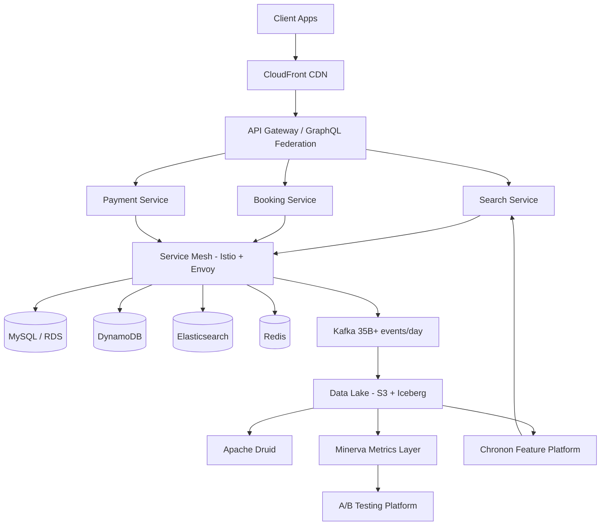
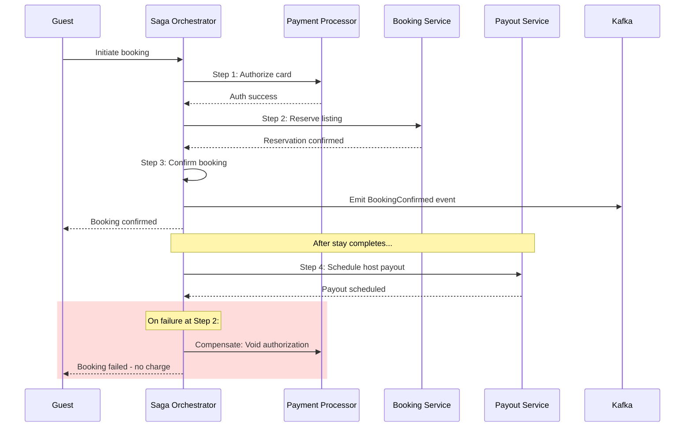
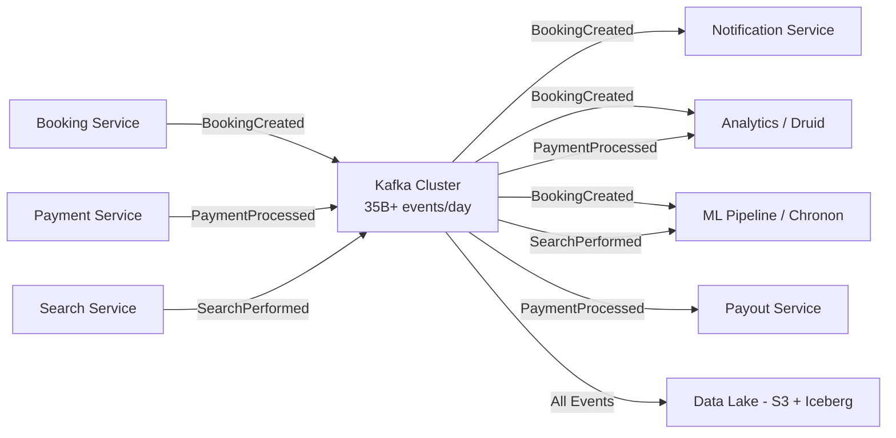
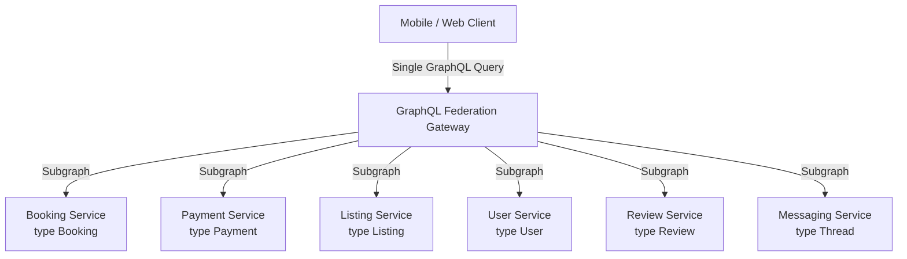

# Airbnb — How Patterns Work in Production

> 150M+ users, 7M+ listings, 191 countries. Key systems: Chronon, Minerva, Search ranking, Payments, Service mesh. Open-source contributions: Apache Airflow, Chronon.

---

## High-Level Architecture

```
                        ┌─────────────────────────────┐
                        │        CDN (CloudFront)      │
                        └──────────────┬──────────────┘
                                       │
                        ┌──────────────▼──────────────┐
                        │     API Gateway / GraphQL    │
                        │       Federation Layer       │
                        └──────────────┬──────────────┘
                                       │
              ┌────────────────────────┼────────────────────────┐
              │                        │                        │
     ┌────────▼────────┐    ┌─────────▼────────┐    ┌─────────▼────────┐
     │  Search Service  │    │ Booking Service  │    │ Payment Service  │
     │   (Java + ML)    │    │     (Java)       │    │     (Java)       │
     └────────┬────────┘    └─────────┬────────┘    └─────────┬────────┘
              │                       │                        │
              │              ┌────────▼────────┐    ┌─────────▼────────┐
              │              │  Pricing Service │    │ Payout Service   │
              │              │     (Java)       │    │     (Java)       │
              │              └────────┬────────┘    └─────────┬────────┘
              │                       │                        │
     ┌────────▼──────────────────────┼────────────────────────┤
     │                    Service Mesh (Istio + Envoy)         │
     └────────┬──────────────────────┬────────────────────────┘
              │                      │
  ┌───────────▼──────────┐   ┌──────▼──────────────────┐
  │  MySQL / RDS         │   │  Kafka Clusters          │
  │  DynamoDB            │   │  35B+ events/day         │
  │  Elasticsearch       │   └──────┬──────────────────┘
  │  Redis               │          │
  └──────────────────────┘   ┌──────▼──────────────────┐
                             │  Data Lake (S3 + Iceberg)│
                             │  Druid (real-time OLAP)  │
                             │  Minerva (metrics layer) │
                             └──────────────────────────┘
```



---

## Pattern Deep Dives

---

### Pattern 1: Saga Pattern — Payments Orchestration

**Pattern:** [[03_design_patterns/saga_pattern]]
**System:** Payments platform
**Problem:** A single booking involves authorization on a guest's card, listing reservation, booking confirmation, and eventual host payout — spanning multiple services, 191 countries, and 70+ currencies. A traditional distributed transaction (2PC) would be too slow and too brittle across this many services and external payment processors (Stripe, Adyen, Braintree, etc.).

**How Airbnb applies it:**

Airbnb uses an **orchestrated saga** (not choreography) for payment flows. A central saga orchestrator drives the sequence and owns the compensation logic. This is a deliberate choice — financial transactions demand centralized control so that failure compensation can be reasoned about deterministically.

```
  Guest Initiates Booking
          │
          ▼
  ┌───────────────────┐
  │  Payment Gateway   │   ◄── Unified API for all processors
  │  (append-only log) │       Bi-directional transaction support
  └────────┬──────────┘
           │
   ┌───────▼───────────────────────────────────────────┐
   │              Saga Orchestrator                      │
   │                                                     │
   │  Step 1: Authorize payment (guest card)             │
   │      │   Compensate: void authorization             │
   │      ▼                                              │
   │  Step 2: Reserve listing (booking service)          │
   │      │   Compensate: release listing                │
   │      ▼                                              │
   │  Step 3: Confirm booking                            │
   │      │   Compensate: cancel + notify guest/host     │
   │      ▼                                              │
   │  Step 4: Schedule payout (after stay completion)    │
   │      │   Compensate: reverse payout, issue refund   │
   │                                                     │
   │  On failure at any step → run compensations in      │
   │  reverse order from the failed step                 │
   └─────────────────────────────────────────────────────┘
```



**Key design decisions:**
- **Orchestration over choreography** — Financial transactions require centralized control. With choreography, reasoning about what happens when step 3 fails but step 1 and 2 succeeded becomes nearly impossible across 70+ currencies and dozens of payment processors.
- **Append-only data model** — Every transaction state change creates a new immutable record. Never mutate. This provides a full audit trail required by financial regulations across 191 countries.
- **Idempotency keys** — Every saga step is idempotent. If the orchestrator retries a step (e.g., network timeout), the downstream service recognizes the duplicate and returns the existing result.

**Why this pattern, not alternatives:**
- **Not 2PC** — Too slow, too many external participants (Stripe, Adyen, etc.) that do not support prepare/commit.
- **Not choreography** — Too hard to reason about compensation ordering in financial flows; debugging event chains across 70+ currencies is a nightmare.
- **Not eventual consistency alone** — Guests expect immediate confirmation. The saga provides a clear "success or fully compensated" guarantee.

---

### Pattern 2: Service Mesh — Istio + Envoy on Kubernetes

**Pattern:** [[15_intermediate_topics/service_mesh]]
**System:** Infrastructure layer across all 1,000+ services
**Problem:** With 1,000+ services running on tens of thousands of pods across dozens of Kubernetes clusters, managing service-to-service communication, security, retries, circuit breaking, and observability at the application level was unsustainable.

**How Airbnb applies it:**

Every pod gets an Envoy sidecar proxy injected automatically via Kubernetes admission controller webhooks. All service-to-service traffic flows through Envoy — no direct connections. Istiod (the control plane) pushes routing rules, certificates, and policies to all sidecars via xDS APIs.

```
  ┌─────────────────────────────────────────────────────────┐
  │                    Istiod (Control Plane)                │
  │  ┌──────────┐  ┌──────────┐  ┌──────────────────────┐  │
  │  │  Pilot   │  │ Citadel  │  │ Config Management    │  │
  │  │ (routing │  │ (mTLS,   │  │ (VirtualService,     │  │
  │  │  rules)  │  │  certs)  │  │  DestinationRule)    │  │
  │  └──────────┘  └──────────┘  └──────────────────────┘  │
  └────────────────────────┬────────────────────────────────┘
                           │ xDS APIs (push-based)
        ┌──────────────────┼──────────────────┐
        │                  │                  │
  ┌─────▼──────┐    ┌─────▼──────┐    ┌─────▼──────┐
  │  Pod A      │    │  Pod B      │    │  Pod C      │
  │ ┌────────┐ │    │ ┌────────┐ │    │ ┌────────┐ │
  │ │Service │ │    │ │Service │ │    │ │Service │ │
  │ └───┬────┘ │    │ └───┬────┘ │    │ └───┬────┘ │
  │     │      │    │     │      │    │     │      │
  │ ┌───▼────┐ │    │ ┌───▼────┐ │    │ ┌───▼────┐ │
  │ │ Envoy  │ │    │ │ Envoy  │ │    │ │ Envoy  │ │
  │ │Sidecar │◄├────├►│Sidecar │◄├────├►│Sidecar │ │
  │ └────────┘ │    │ └────────┘ │    │ └────────┘ │
  └────────────┘    └────────────┘    └────────────┘
       mTLS              mTLS              mTLS
```

**What the mesh handles (so services do not have to):**

| Concern | How Envoy Handles It |
|---|---|
| **Encryption** | mTLS everywhere — Citadel auto-rotates certs |
| **Retries** | Configurable per-route retry policies |
| **Circuit breaking** | DestinationRules define outlier detection |
| **Load balancing** | Weighted, round-robin, or locality-aware |
| **Observability** | Distributed tracing headers, metrics emission |
| **Traffic shifting** | Canary deploys via VirtualService weight rules |
| **Rate limiting** | Envoy rate limit filters per service |

**Key design decisions:**
- **Chose Istio** for its "extensibility, broad feature support and scalability" — specifically the ability to enforce consistent security policies (mTLS, AuthorizationPolicy) across 1,000+ services without any application code changes.
- **Cost awareness** — Envoy sidecars add ~0.5 CPU and ~50MB memory per pod. At tens of thousands of pods, this is significant. They actively monitor and optimize sidecar resource consumption.
- **Transparent injection** — Kubernetes admission controller webhooks inject sidecars automatically. Service developers write zero mesh-related code.

**Why this pattern, not alternatives:**
- **Not library-based (e.g., Hystrix)** — Would require every service in every language to adopt the library. Airbnb uses Java, Ruby, Python, Kotlin, Scala.
- **Not DNS-based service discovery alone** — Need traffic shaping, mTLS, and observability that DNS cannot provide.

---

### Pattern 3: CQRS — Payments Read/Write Separation

**Pattern:** [[03_design_patterns/cqrs]]
**System:** Payments platform
**Problem:** After splitting the payments monolith into microservices, data scattered across many services. Aggregating payment information (fees, currency fluctuations, taxes, discounts, chargebacks) required calling too many services. Read latency was unacceptable.

**How Airbnb applies it:**

Writes go to MySQL (the source of truth, append-only transaction ledger). A change-data-capture pipeline streams mutations into denormalized Elasticsearch indices optimized for read queries. The read layer serves dashboards, customer support tools, and internal reporting.

```
  ┌─────────────────────┐
  │   Write Path         │
  │                      │
  │  Payment Service     │
  │       │              │
  │       ▼              │
  │  MySQL / RDS         │──── Source of truth
  │  (normalized,        │     Append-only ledger
  │   append-only)       │     Optimized for writes
  └──────────┬──────────┘
             │
             │  CDC (Change Data Capture)
             ▼
  ┌──────────────────────┐
  │  Denormalization      │
  │  Pipeline             │
  │  (Kafka + Transform)  │
  └──────────┬───────────┘
             │
             ▼
  ┌──────────────────────┐
  │   Read Path           │
  │                       │
  │  Elasticsearch        │──── Denormalized views
  │  (pre-joined,         │     150x latency improvement
  │   query-optimized)    │     99.9% read reliability
  └───────────────────────┘
```

**Results:**
- **150x latency improvement** on payment data reads
- **99.9% reliability** on the read path
- Customer support can pull complete payment history for any reservation in milliseconds instead of seconds

**Key design decisions:**
- **Eventual consistency is acceptable for reads** — Support agents and dashboards can tolerate a few seconds of lag. The write path (MySQL) is always the authoritative source.
- **Denormalization is intentional** — The ES indices pre-join data from multiple payment services (fees, taxes, FX rates, refunds) into a single document per reservation. This eliminates the N+1 service call problem.
- **Append-only writes** — The MySQL layer never mutates records. Every state change is a new row. This simplifies the CDC pipeline (no UPDATE/DELETE handling) and provides a natural audit trail.

**Why this pattern, not alternatives:**
- **Not a single normalized database** — The SOA migration already distributed data across services. Reunifying into one DB would undo the SOA benefits.
- **Not API aggregation at query time** — Calling 5-10 services per read request is too slow (seconds) and too fragile (any service down = partial data).
- **Not materialized views in MySQL** — MySQL materialized views cannot span multiple service databases. Elasticsearch provides full-text search and flexible aggregation that MySQL cannot match.

---

### Pattern 4: ML Pipeline — Search Ranking

**System:** Search ranking across 7M+ listings
**Problem:** Showing the right listings to the right guests. Small ranking improvements translate directly to bookings and revenue. The first ML model (GBDT, ~2015) gave one of the largest step improvements in home bookings in Airbnb history.

**How Airbnb applies it:**

A four-stage pipeline: candidate retrieval, pre-ranking, main ranking, and re-ranking. Each stage progressively narrows and reorders results with increasing model complexity.

```
  User Query (location, dates, guests, filters)
      │
      ▼
  ┌───────────────────────┐
  │  Candidate Retrieval  │   ◄── Two-Tower EBR Model
  │  (Embedding-Based     │       Query tower: runs online (real-time)
  │   Retrieval)          │       Listing tower: computed daily offline
  │  ~1000 candidates     │       ANN index for fast lookup
  └───────────┬───────────┘
              │
      ┌───────▼───────┐
      │  Pre-Ranking   │   ◄── Lightweight scoring, geo/date filters
      │  (~500 items)  │       Removes clearly irrelevant candidates
      └───────┬───────┘
              │
      ┌───────▼───────────────┐
      │  Main Ranker (DNN)    │   ◄── Transformer-based set-wise scoring
      │  Journey Ranker:      │       Multi-task: guest prefs + host prefs
      │   - Guest state       │       Chronon features (sub-10ms serving)
      │   - Search context    │       Hundreds of features per candidate
      │   - Listing features  │
      └───────┬───────────────┘
              │
      ┌───────▼───────┐
      │  Re-Ranking    │   ◄── Diversity, freshness, cold-start boost
      │  (~50 items)   │       Business rules overlay
      └───────┬───────┘
              │
              ▼
        Search Results Page
```

**Evolution of ranking models:**

| Era | Model | Key Insight |
|---|---|---|
| Pre-2015 | Hand-tuned scoring | Manually weighted signals; brittle |
| ~2015 | GBDT | Largest single booking lift in Airbnb history |
| 2016-2018 | Simple NN (1 layer, 32 units) | Initially booking-neutral vs GBDT; required iteration |
| 2018-2020 | Hybrid NN+FM+GBDT | Combined FM predictions + GBDT leaf indices as NN features |
| 2020+ | Journey Ranker | Multi-task DNN; guest actions as milestone labels |
| Current | Transformer set-wise | Deprecated most manual feature engineering; scaling laws validated |

**The ABCs framework:**
- **A**rchitecture — Evolve DNN topology (from single-layer to transformer)
- **B**ias — Position bias correction was one of their most significant wins
- **C**old start — Special treatment for new listings with no engagement history

**Key design decisions:**
- **Listing tower computed daily offline** — Only the query tower runs at request time, dramatically reducing online latency while maintaining embedding quality.
- **Listing ID embeddings were attempted but led to overfitting** — They learned that "better data beats bigger models."
- **Multi-task learning** — The Journey Ranker predicts multiple guest actions (view, contact, book) rather than a single binary outcome, providing richer training signal.
- **Every ranking change validated via A/B test** — No change ships without controlled experiment results from Minerva.

---

### Pattern 5: Pub/Sub — Kafka Event Backbone

**Pattern:** [[03_design_patterns/pub_sub]]
**System:** Platform-wide event infrastructure
**Problem:** With 1,000+ services, point-to-point communication creates an O(n^2) dependency graph. Services need to react to events (booking created, payment processed, review submitted) without tight coupling.

**How Airbnb applies it:**

Apache Kafka processes **35 billion+ events per day** across multiple clusters. It serves as the central nervous system — services publish domain events and other services subscribe independently. This is choreography at the platform level (even though individual payment flows use orchestration).



**Key event categories:**

| Event Category | Examples | Consumers |
|---|---|---|
| **Booking events** | BookingCreated, BookingCancelled, CheckInCompleted | Notifications, Analytics, Payments, ML |
| **Payment events** | PaymentAuthorized, PaymentCaptured, PayoutScheduled | Ledger, Notifications, Fraud detection |
| **Search events** | SearchPerformed, ListingViewed, ListingClicked | ML training data, Analytics, Personalization |
| **User events** | ProfileUpdated, ReviewSubmitted, MessageSent | Notifications, Trust & Safety, ML |
| **Listing events** | ListingPublished, PriceUpdated, AvailabilityChanged | Search index, Pricing, Analytics |

**Key design decisions:**
- **Choreography over orchestration at the platform level** — Services publish events without knowing or caring who consumes them. New consumers can subscribe without modifying the producer.
- **Kafka as the single event bus** — One technology, one operational model. No fragmentation across RabbitMQ, SQS, etc.
- **All events flow to the data lake** — Every Kafka topic has a sink connector to S3/Iceberg. This creates a complete event history for ML training, analytics backfills, and debugging.
- **Schema registry** — Avro schemas with backward compatibility enforcement. Producers cannot break consumers by changing event shapes.

**Why this pattern, not alternatives:**
- **Not direct service-to-service calls for notifications** — Would couple the booking service to every downstream consumer.
- **Not a shared database** — Services should not read each other's databases. Events are the public API.
- **Not SQS per consumer** — Too many queues to manage. Kafka's consumer group model handles fan-out natively.

---

### Pattern 6: Sharding — MySQL and Kafka Partitioning

**Pattern:** [[03_design_patterns/sharding]]
**System:** MySQL databases and Kafka topics
**Problem:** A single MySQL instance cannot handle the write throughput of 150M+ users and 7M+ listings. A single Kafka partition cannot parallelize consumption for 35B+ events/day.

**How Airbnb applies it:**

**MySQL sharding:**
- **Listing data** — Sharded by `listing_id`. All data for a listing (availability, pricing, reviews, photos) lives on the same shard. Queries by listing are single-shard.
- **User data** — Sharded by `user_id`. Profile, preferences, booking history co-located.
- **Payment data** — Sharded by reservation ID to keep all payment records for a booking together.

**Kafka topic partitioning:**
- Topics partitioned by entity key (listing_id, user_id, reservation_id).
- Ordering guaranteed within a partition — all events for a single booking arrive in order.
- Consumer groups scale horizontally by adding consumers up to the partition count.

```
  MySQL Sharding (by listing_id):

  ┌──────────┐  ┌──────────┐  ┌──────────┐  ┌──────────┐
  │ Shard 0  │  │ Shard 1  │  │ Shard 2  │  │ Shard 3  │
  │ IDs 0-N  │  │ IDs N-2N │  │IDs 2N-3N │  │IDs 3N-4N │
  │          │  │          │  │          │  │          │
  │ listing  │  │ listing  │  │ listing  │  │ listing  │
  │ avail.   │  │ avail.   │  │ avail.   │  │ avail.   │
  │ pricing  │  │ pricing  │  │ pricing  │  │ pricing  │
  │ reviews  │  │ reviews  │  │ reviews  │  │ reviews  │
  └──────────┘  └──────────┘  └──────────┘  └──────────┘

  Kafka Partitioning (by reservation_id):

  Topic: booking-events
  ┌───────────┐ ┌───────────┐ ┌───────────┐ ┌───────────┐
  │Partition 0│ │Partition 1│ │Partition 2│ │Partition 3│
  │ res 0,4,8 │ │ res 1,5,9 │ │ res 2,6,10│ │ res 3,7,11│
  │ (ordered) │ │ (ordered) │ │ (ordered) │ │ (ordered) │
  └───────────┘ └───────────┘ └───────────┘ └───────────┘
       │              │              │              │
   Consumer 0    Consumer 1    Consumer 2    Consumer 3
```

**Key design decisions:**
- **Shard key = primary access pattern** — Listing data sharded by listing_id because the dominant query is "get everything for this listing." Cross-shard queries (e.g., "all listings in Paris") go through Elasticsearch, not MySQL.
- **Co-location of related data** — All payment records for a reservation live on the same shard. This avoids distributed joins.
- **Kafka partition count set high** — Over-partition initially so consumer groups can scale without repartitioning (which requires topic recreation).

---

### Pattern 7: A/B Testing — Minerva-Powered Experimentation

**System:** Search ranking, product features, pricing models
**Problem:** Every ranking change, UI experiment, and pricing algorithm needs rigorous validation. Without a standardized experimentation framework, teams measure different metrics differently, leading to conflicting conclusions.

**How Airbnb applies it:**

Minerva provides the **single source of truth** for all A/B test metrics. 12,000+ metrics and 4,000+ dimensions are defined declaratively in YAML, code-reviewed, and version-controlled. Every experiment reads from the same metric definitions.

```
  ┌────────────────────────────────────────────┐
  │        Metric Definitions (YAML)           │
  │   (facts, dimensions, aggregation rules)   │
  └──────────────────┬─────────────────────────┘
                     │
         ┌───────────▼───────────┐
         │  Minerva Runtime      │
         │  (DAG generation,     │
         │   self-healing,       │
         │   data quality checks)│
         └───────────┬───────────┘
                     │
         ┌───────────▼───────────┐
         │  Denormalized Tables  │
         │  (Hive / Iceberg)     │
         └───────────┬───────────┘
                     │
         ┌───────────▼───────────┐
         │     Minerva API       │
         │  (split-apply-combine │
         │   query execution)    │
         └───┬───┬───┬───┬───┬──┘
             │   │   │   │   │
             ▼   ▼   ▼   ▼   ▼
          A/B  Exec  Data  Data  Notebooks
          Test Rpts  Cat.  Expl.
```

**Scale:**
- 12,000+ metrics, 4,000+ dimensions
- 200+ data producers across Data, Product, Finance, and Engineering
- Metric definitions go through the same PR process as application code

**Key design decisions:**
- **Metrics are code, not queries** — Metric definitions are version-controlled YAML. Changing a metric definition is a PR, not a dashboard edit. This prevents drift.
- **Split-apply-combine** — The API layer splits queries by partitions, applies aggregations, and combines results. This makes the API compute-agnostic.
- **Backfill with zero downtime** — New metric definitions can be backfilled historically without affecting production serving. This means new experiments can reference historical data.
- **Pre-aggregation** — Common metric slices are pre-computed, dramatically speeding up dashboard loads and experiment result pages.

**Why centralized metrics matter for A/B testing:**
Before Minerva, the same metric ("bookings") was computed differently by different teams. One team counted confirmed bookings, another counted initiated bookings, another excluded cancellations differently. Leadership received conflicting numbers. Minerva eliminates this class of error entirely.

---

### Pattern 8: Inverted Index — Elasticsearch for Search and Payments

**Pattern:** [[02_building_blocks/search_systems]]
**System:** Listings search + payments read layer
**Problem:** Two distinct problems, same solution. (1) Guests need to search 7M+ listings by location, date, price, amenities, and dozens of other facets. (2) The payments team needs to query denormalized payment data across multiple dimensions.

**How Airbnb applies it:**

**Listings search:**
- Elasticsearch indexes all 7M+ listings with their attributes (location, price, amenities, availability, reviews, photos).
- Inverted indices enable fast filtering by any combination of facets.
- Geo-spatial indices enable location-based queries ("listings within 5km of downtown Paris").
- The ES results feed into the ML ranking pipeline as candidates.

**Payments read layer (CQRS read side):**
- Denormalized payment documents indexed by reservation, guest, host, date range, payment method, currency, and status.
- Support agents query by any dimension — "show me all refunds for this guest in the last 90 days" returns in milliseconds.
- This is the same Elasticsearch cluster described in the CQRS pattern above.

**Key design decisions:**
- **Elasticsearch for both search and CQRS reads** — One operational model for two use cases. The team has deep ES expertise; adding a second system (e.g., Solr, Cassandra) would increase operational burden.
- **Listings index updated near-real-time** — When a host updates pricing or availability, the change propagates to ES within seconds.
- **Custom scoring plugins** — The search ES cluster uses custom scoring plugins that integrate with the ML ranking pipeline, blending text relevance with ML model scores.

---

### Pattern 9: GraphQL Federation — API Gateway

**System:** API layer serving all client applications
**Problem:** With 1,000+ backend services, clients should not need to know which service owns which data. A booking detail page requires data from booking, payment, messaging, review, and listing services. REST would require multiple round-trips or a monolithic BFF.

**How Airbnb applies it:**

A federated GraphQL gateway sits between clients and backend services. Each backend service exposes a GraphQL subgraph defining its portion of the schema. The gateway composes these subgraphs into a unified schema and resolves queries by fanning out to the appropriate services.



**Example: Booking detail page**

```graphql
# Client sends ONE query:
query BookingDetail($id: ID!) {
  booking(id: $id) {
    status
    checkIn
    checkOut
    listing {          # Resolved by Listing Service
      title
      location
      photos
    }
    payment {          # Resolved by Payment Service
      total
      currency
      status
    }
    guest {            # Resolved by User Service
      name
      avatar
    }
    reviews {          # Resolved by Review Service
      rating
      text
    }
  }
}
```

The gateway decomposes this into subgraph queries, executes them in parallel where possible, and assembles the response.

**Key design decisions:**
- **Federation, not schema stitching** — Each service owns and deploys its own subgraph independently. No central schema file that becomes a bottleneck.
- **Client-driven queries** — Mobile clients fetch less data (smaller screens), web clients fetch more. One endpoint, different query shapes.
- **Dataloader pattern** — The gateway batches and deduplicates entity lookups to prevent N+1 queries when resolving lists.

---

### Pattern 10: Feature Store — Chronon

**System:** ML feature platform powering search ranking, pricing, fraud detection, customer support routing
**Problem:** ML engineers were spending the majority of their time managing data pipelines rather than modeling. Feature management was the most consistent pain point across all ML teams. Before Chronon, each team independently glued together Kafka, Spark, Hive, and Airflow for every new model.

**How Airbnb applies it:**

Chronon is Airbnb's open-source end-to-end feature platform. A single YAML definition generates both batch (Spark + Hive, daily) and streaming (Spark Streaming + Kafka, real-time) pipelines. Online serving via Vert.x delivers features at sub-10ms p99 latency.

```
  ┌──────────────────────────────────────────────────┐
  │               Feature Definitions                 │
  │        (GroupBy, Join, StagingQuery — YAML)       │
  └──────────────────┬───────────────────────────────┘
                     │
         ┌───────────▼───────────┐
         │   Chronon Compiler    │
         │  (generates DAGs)     │
         └───┬──────────────┬────┘
             │              │
   ┌─────────▼──────┐  ┌───▼──────────────┐
   │  Batch Path    │  │  Streaming Path   │
   │  Spark + Hive  │  │  Spark Streaming  │
   │  (daily)       │  │  + Kafka (RT)     │
   └─────────┬──────┘  └───┬──────────────┘
             │              │
         ┌───▼──────────────▼────┐
         │   Online KV Store     │
         │   (Vert.x serving)    │
         │   p99 < 10ms          │
         └───────────┬───────────┘
                     │
         ┌───────────▼───────────┐
         │  Consistency Monitor  │
         │  (replays online fetch│
         │   logs through batch  │
         │   path, compares      │
         │   values quantitatively)
         └───────────────────────┘
```

**Key design decisions:**
- **Define once, use everywhere** — A single YAML definition generates both batch and streaming pipelines. This eliminates online/offline skew by construction, not by convention.
- **Consistency monitoring** — A pipeline replays online fetch logs through the batch path and compares values. This gives quantified online/offline consistency metrics — catching drift before it degrades model performance.
- **Vert.x for online serving** — Chose Vert.x for its non-blocking, event-driven I/O model. Critical for sub-10ms latency at high throughput.
- **Point-in-time correctness** — Prevents label leakage in training data backfills. Features are computed as of the timestamp when the event occurred, not as of "now."

**Why this pattern matters:**
- Before Chronon, a common failure mode: model performs well offline (because features were computed with future data leaking in), degrades in production (where features are computed in real-time). Chronon's architecture makes this class of bug structurally impossible.
- Open-sourced in 2024; co-maintained with Stripe. Chronon Summit (March 2025): 10 companies, 80+ attendees.

---

## Pattern Summary

| # | Pattern | System | Key Benefit | Scale | Vault Link |
|---|---|---|---|---|---|
| 1 | **Saga Pattern** | Payments | Distributed transactions with compensation | 191 countries, 70+ currencies | [[03_design_patterns/saga_pattern]] |
| 2 | **Service Mesh** | Infrastructure | Cross-cutting concerns at infra level | 1,000+ services, 10K+ pods | [[15_intermediate_topics/service_mesh]] |
| 3 | **CQRS** | Payments | 150x read latency improvement | 99.9% read reliability | [[03_design_patterns/cqrs]] |
| 4 | **ML Pipeline** | Search ranking | Right listings for right guests | 7M+ listings, billions of searches/yr | — |
| 5 | **Pub/Sub** | Platform-wide | Decoupled event-driven architecture | 35B+ events/day | [[03_design_patterns/pub_sub]] |
| 6 | **Sharding** | MySQL + Kafka | Horizontal scalability | 150M+ users, 7M+ listings | [[03_design_patterns/sharding]] |
| 7 | **A/B Testing** | Experimentation | Rigorous, consistent experiment analysis | 12,000+ metrics, 4,000+ dimensions | — |
| 8 | **Inverted Index** | Search + Payments | Fast multi-facet queries | 7M+ listings indexed | [[02_building_blocks/search_systems]] |
| 9 | **GraphQL Federation** | API layer | Single query, multiple services | All client applications | — |
| 10 | **Feature Store** | ML platform | Define once, use everywhere | Sub-10ms p99 serving | — |

---

## Failure Stories

### 1. SOA Introduced Its Own Complexity

After moving from the Ruby on Rails monolith ("Monorail") to 1,000+ Java services, Airbnb discovered that microservices traded one set of problems for another. Feature development sometimes became **slower** because engineers needed to understand and modify multiple services, deploy them in the correct order, and manage cross-service contracts. Engineers were delayed ~15 hours/week on average due to reverts and rollbacks in the monolith era, but the SOA era introduced "distributed monolith" problems where a change required coordinated deploys across multiple services.

**Resolution:** Introduced a layered SOA topology — presentation layer, business logic layer, platform/service blocks layer, infrastructure layer. Higher-tier services can call lower-tier, never vice versa. This prevents dependency cycles and cascading failures. "Service blocks" at the platform layer encapsulate data and business logic behind stable APIs.

**Pattern lesson:** Service mesh (Pattern 2) was essential to making SOA manageable. Without it, every service team would have to independently implement retries, circuit breaking, mTLS, and observability.

### 2. Data Fragmentation Post-SOA (Payments)

When the payments monolith was split into services, data scattered across many different services. Aggregating payment information (fees, currency fluctuations, taxes, discounts) required calling too many services. A single "show payment details" operation could fan out to 5-10 services, each with its own database.

**Resolution:** CQRS (Pattern 3). Added denormalized Elasticsearch read replicas that pre-join data from multiple payment services. Reduced read latency by up to 150x and achieved 99.9% reliability on the read path.

**Pattern lesson:** SOA distributes data. If you need aggregated reads, you need a denormalized read model. CQRS is not optional in a payment microservices architecture — it is a survival pattern.

### 3. ML Online/Offline Skew

Before Chronon, ML models would perform well offline but degrade in production. Root causes:
- Feature computation code differed between training (Python/Spark) and serving (Java) environments.
- Point-in-time correctness violations — training features accidentally included future data (label leakage).
- Streaming features had subtle differences from batch features due to windowing semantics.

**Resolution:** Chronon (Pattern 10). "Define once, use everywhere" approach generates both batch and streaming pipelines from a single YAML definition. The consistency monitoring pipeline quantifies online/offline drift.

**Pattern lesson:** Feature stores are not just organizational convenience — they are correctness infrastructure. Without them, every ML team independently builds (and independently gets wrong) the same data plumbing.

### 4. GBDT to DNN — Patience Required

When first replacing their GBDT search ranking model with a deep neural network, results were **neutral** — the NN did not outperform GBDT. Instead of abandoning the approach, they iterated through four key experiments following the ABCs framework (Architecture, Bias correction, Cold-start handling). Position bias correction alone was one of their most significant wins.

**Pattern lesson:** "Better data beats bigger models." The path from GBDT to transformer was not a single leap — it was years of incremental experiments, each validated by A/B testing (Pattern 7) and powered by consistent feature infrastructure (Pattern 10).

---

## Interview Quick Reference

| Interview Question | Relevant Airbnb System | Patterns to Discuss | Key Numbers |
|---|---|---|---|
| "Design a booking system" | Booking + Payments | Saga (#1), CQRS (#3), Pub/Sub (#5) | 191 countries, 70+ currencies |
| "Design a search system" | Search Ranking | ML Pipeline (#4), Inverted Index (#8), Sharding (#6) | 7M+ listings, 4-stage pipeline |
| "Design a notification system" | Notifications | Pub/Sub (#5), GraphQL (#9) | 35B+ events/day on Kafka |
| "Design a payment system" | Payments | Saga (#1), CQRS (#3), Sharding (#6) | 150x read latency improvement |
| "Design an ML feature store" | Chronon | Feature Store (#10), Pub/Sub (#5) | Sub-10ms p99, batch + streaming |
| "Design a metrics platform" | Minerva | A/B Testing (#7) | 12K+ metrics, 4K+ dimensions |
| "How to migrate from monolith" | The Great Migration | Service Mesh (#2), Pub/Sub (#5) | 200 to 1,000+ engineers |
| "Design for multi-currency" | Payment Gateway | Saga (#1), Sharding (#6) | 70+ currencies, append-only |
| "Design a search ranking system" | Search ML Pipeline | ML Pipeline (#4), Feature Store (#10), A/B Testing (#7) | GBDT to transformer evolution |

**Five talking points for interviews:**

1. **Saga pattern in practice** — Airbnb's payment flow is a textbook orchestrated saga: authorize, reserve, confirm, payout. Each step has a compensating transaction. They chose orchestration over choreography because financial flows demand centralized reasoning about compensation ordering. Reference [[03_design_patterns/saga_pattern]].

2. **CQRS for read-heavy systems** — The payments team added denormalized ES indices as read replicas, achieving 150x latency improvement. Key insight: SOA distributes data, and CQRS is how you get it back for reads without coupling services.

3. **ML system design** — The search ranking pipeline shows clean stage separation: candidate retrieval (two-tower EBR) then pre-ranking then main ranking (transformer DNN) then re-ranking. Chronon provides the feature backbone. Every change validated via A/B test.

4. **Scaling organizations, not just systems** — Airbnb's monolith worked for a decade. The migration was driven by engineering team growth (200 to 1,000+ engineers), not by traffic alone. Service boundaries map to team boundaries (Conway's Law).

5. **Feature stores prevent a class of bugs** — Chronon's "define once, use everywhere" approach eliminates online/offline skew structurally. This is a common interview topic: "How do you ensure training features match serving features?"

---

## Startup Playbook — What to Steal from Airbnb

### Phase 1: Pre-Product-Market Fit (0-50 engineers)

**Steal: Monolith-first philosophy.**
Airbnb ran on a single Ruby on Rails monolith ("Monorail") for nearly a decade. Do not start with microservices. A monolith is faster to iterate on, easier to debug, and simpler to deploy. You do not have the organizational complexity that necessitates service boundaries.

**Steal: Invest in workflow orchestration early.**
Airbnb created Apache Airflow because they needed reliable data pipelines before they needed microservices. If you have any batch processing, ETL, or scheduled jobs, adopt Airflow (or Dagster/Prefect) from day one. The alternative — cron jobs and custom scripts — becomes unmanageable fast.

### Phase 2: Growth (50-200 engineers)

**Steal: Centralized metrics from the start.**
Minerva was built because teams were computing the same metrics differently. You will hit this problem at 10 engineers, not 1,000. Define your key metrics in one place (even a shared dbt project counts) before teams start building their own dashboards with their own SQL.

**Steal: Event backbone (Kafka or equivalent).**
Start publishing domain events to Kafka early, even if you only have one consumer. When you eventually need notifications, analytics, ML training data, and search index updates, the event history is already there. Airbnb's 35B+ events/day started with much smaller numbers.

**Steal: A/B testing discipline.**
Airbnb validates every search ranking change via controlled experiment. You do not need Minerva's scale, but you need the discipline. Ship an experimentation framework (even LaunchDarkly + a simple metrics pipeline) before you have 10 product engineers making changes based on intuition.

### Phase 3: Scale (200+ engineers)

**Steal: CQRS when reads and writes diverge.**
When your read patterns no longer match your write patterns (e.g., your support tool needs to join data from 5 services), add a denormalized read layer. Elasticsearch or a materialized view. Do not force every read through your normalized write path.

**Steal: Feature store before your second ML model.**
If you ship one ML model, you can manage features ad-hoc. The moment you ship a second model that needs some of the same features, you need a feature store. Chronon is open-source. Use it before each ML team builds its own bespoke pipeline.

**Steal: Service mesh before your 50th service.**
Once you have ~50 services, managing mTLS, retries, circuit breaking, and observability in application code is untenable. Adopt Istio/Envoy (or Linkerd if you want simpler). The mesh pays for itself in reduced per-service boilerplate.

### What NOT to Steal

- **Do not adopt GraphQL federation at 5 services.** A simple REST API gateway or BFF is sufficient until you have dozens of services and multiple client platforms with different data needs.
- **Do not shard MySQL at 100K users.** Airbnb shards because they have 150M+ users and 7M+ listings. A single PostgreSQL instance handles more than most startups will ever need. Premature sharding adds complexity with no benefit.
- **Do not build a custom ML pipeline at your scale.** Use managed services (SageMaker, Vertex AI) until you have a dedicated ML platform team. Airbnb has ~1,000 engineers; you probably do not.

---

## Cross-References

- [[03_design_patterns/saga_pattern]] — Airbnb's payment orchestration is a canonical saga implementation
- [[03_design_patterns/cqrs]] — Payments write to MySQL, read from denormalized Elasticsearch
- [[03_design_patterns/pub_sub]] — Kafka as the central event backbone (35B+ events/day)
- [[03_design_patterns/sharding]] — MySQL sharded by listing/user, Kafka partitioned by entity key
- [[02_building_blocks/search_systems]] — Elasticsearch for listings search and payments read layer
- [[15_intermediate_topics/service_mesh]] — Istio + Envoy across 1,000+ services
- [[05_case_studies/design_notification_system]] — Booking confirmations, payout alerts, messaging via pub/sub

---

## Sources

### Official Airbnb Engineering Blog Posts
- [Chronon: A Declarative Feature Engineering Framework](https://medium.com/airbnb-engineering/chronon-a-declarative-feature-engineering-framework-b7b8ce796e04)
- [Chronon, Airbnb's ML Feature Platform, Is Now Open Source](https://medium.com/airbnb-engineering/chronon-airbnbs-ml-feature-platform-is-now-open-source-d9c4dba859e8)
- [How Airbnb Achieved Metric Consistency at Scale (Minerva)](https://medium.com/airbnb-engineering/how-airbnb-achieved-metric-consistency-at-scale-f23cc53dea70)
- [Scaling Airbnb's Payment Platform](https://medium.com/airbnb-engineering/scaling-airbnbs-payment-platform-43ebfc99b324)
- [Unified Payments Data Read at Airbnb](https://airbnb.tech/data/unified-payments-data-read-at-airbnb-2/)
- [Measuring Transactional Integrity in Airbnb's Distributed Payment Ecosystem](https://medium.com/airbnb-engineering/measuring-transactional-integrity-in-airbnbs-distributed-payment-ecosystem-a670d6926d22)
- [Embedding-Based Retrieval for Airbnb Search](https://airbnb.tech/uncategorized/embedding-based-retrieval-for-airbnb-search/)

### Academic Papers
- [Applying Deep Learning To Airbnb Search (2018)](https://arxiv.org/abs/1810.09591)
- [Improving Deep Learning For Airbnb Search (2020)](https://arxiv.org/abs/2002.05515)

### Conference Talks
- [Airbnb's Great Migration: From Monolith to Service-Oriented — QCon SF 2018](https://qconsf.com/sf2018/sf2018/presentation/airbnbs-great-migration-monolith-service-oriented.html)
- [Chronon: Airbnb's End-to-End Feature Platform — QCon SF 2023](https://qconsf.com/presentation/oct2023/chronon-airbnbs-end-end-feature-platform)

### Open-Source
- [Chronon on GitHub](https://github.com/airbnb/chronon)
- [Apache Airflow](https://airflow.apache.org/)
