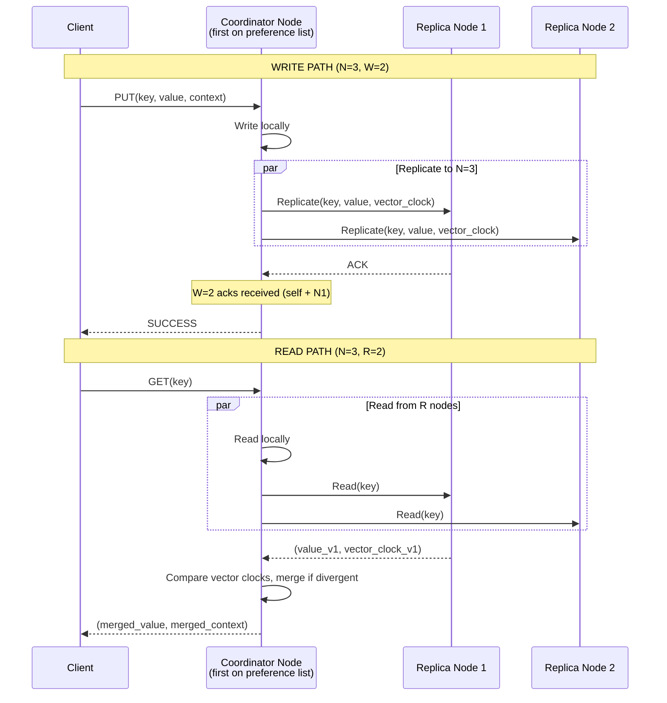
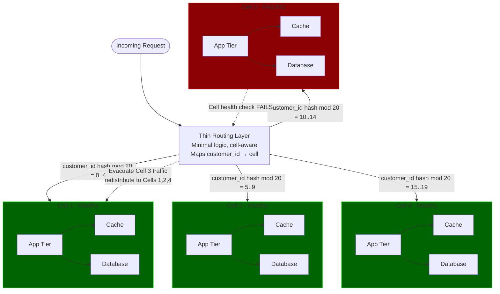
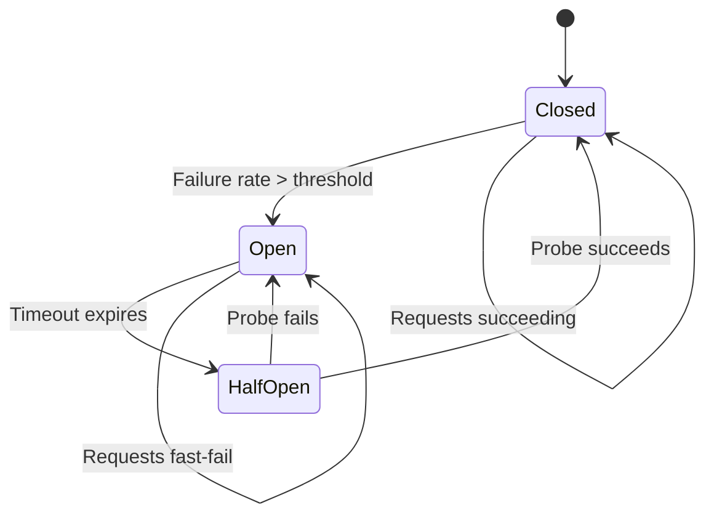

# Amazon/AWS --- How Patterns Work in Production

> AWS: 33 regions, 105+ AZs, 100K+ microservices on amazon.com, trillions of Lambda invocations/month. Key systems: Dynamo (2007 paper), DynamoDB, S3 (350T+ objects), Aurora ("log is the database"), Lambda/Firecracker.

---

## High-Level Architecture

### ASCII --- Request Flow Through AWS Infrastructure

```
                     ┌──────────────────────────────────┐
                     │          Route 53 (DNS)           │
                     │   Latency-based / failover routing│
                     │   Health checks per cell          │
                     └───────────────┬──────────────────┘
                                     │
                     ┌───────────────▼──────────────────┐
                     │        CloudFront (CDN)           │
                     │   400+ edge locations             │
                     │   TLS termination, caching        │
                     └───────────────┬──────────────────┘
                                     │
                     ┌───────────────▼──────────────────┐
                     │   Application Load Balancer       │
                     │   Per-AZ, per-cell routing        │
                     │   Health checks → unhealthy = drain│
                     └───────────────┬──────────────────┘
                                     │
          ┌──────────────────────────┼──────────────────────────┐
          │                          │                           │
   ┌──────▼────────┐         ┌──────▼────────┐         ┌───────▼───────┐
   │   Cell A       │         │   Cell B       │         │   Cell N       │
   │ ┌────────────┐ │         │ ┌────────────┐ │         │ ┌────────────┐ │
   │ │ App Tier   │ │         │ │ App Tier   │ │         │ │ App Tier   │ │
   │ │ (ECS/EKS)  │ │         │ │ (ECS/EKS)  │ │         │ │ (ECS/EKS)  │ │
   │ ├────────────┤ │         │ ├────────────┤ │         │ ├────────────┤ │
   │ │ Cache      │ │         │ │ Cache      │ │         │ │ Cache      │ │
   │ │(ElastiCache)│ │         │ │(ElastiCache)│ │         │ │(ElastiCache)│ │
   │ ├────────────┤ │         │ ├────────────┤ │         │ ├────────────┤ │
   │ │ DynamoDB   │ │         │ │ DynamoDB   │ │         │ │ DynamoDB   │ │
   │ │ / Aurora   │ │         │ │ / Aurora   │ │         │ │ / Aurora   │ │
   │ └────────────┘ │         │ └────────────┘ │         │ └────────────┘ │
   │ Customers A-D  │         │ Customers E-H  │         │ Customers ...  │
   └────────────────┘         └────────────────┘         └────────────────┘
          │                          │                           │
          └──────────────────────────┼───────────────────────────┘
                                     │
                     ┌───────────────▼──────────────────┐
                     │     S3 (images, assets, logs)     │
                     │     SQS/SNS (async processing)    │
                     │     Lambda (event-driven compute)  │
                     └──────────────────────────────────┘
```

### Mermaid --- End-to-End Request Flow

```mermaid
flowchart TD
    Client([Client]) --> R53[Route 53<br/>DNS + Health Checks]
    R53 --> CF[CloudFront CDN<br/>400+ Edge Locations]
    CF --> ALB[Application Load Balancer<br/>Per-Cell Routing]

    ALB --> CellA[Cell A]
    ALB --> CellB[Cell B]
    ALB --> CellN[Cell N]

    subgraph CellA [Cell A - Customers A-D]
        AppA[App Tier<br/>ECS / EKS] --> CacheA[ElastiCache]
        AppA --> DBA[DynamoDB / Aurora]
        AppA --> SQSA[SQS → Lambda]
    end

    subgraph CellB [Cell B - Customers E-H]
        AppB[App Tier] --> CacheB[ElastiCache]
        AppB --> DBB[DynamoDB / Aurora]
    end

    subgraph CellN [Cell N]
        AppN[App Tier] --> CacheN[ElastiCache]
        AppN --> DBN[DynamoDB / Aurora]
    end

    SQSA --> Lambda[Lambda<br/>Firecracker microVMs]
    AppA --> S3[S3<br/>Object Storage]

    style CellA fill:#1a1a2e,stroke:#e94560
    style CellB fill:#1a1a2e,stroke:#0f3460
    style CellN fill:#1a1a2e,stroke:#533483
```



---

## Pattern Deep Dives

---

### Pattern 1: Consistent Hashing --- Dynamo Partitioning

**Link:** [[03_design_patterns/consistent_hashing]]

**The problem:** Amazon's shopping cart, session store, and catalog services needed to partition data across hundreds of nodes. Traditional modular hashing (`hash(key) % N`) means adding or removing a node reshuffles almost all keys --- catastrophic for a system serving millions of requests per second.

**How Dynamo uses it:**

Dynamo arranges nodes on a logical hash ring. Each key is hashed (MD5) and placed on the ring. The key is assigned to the first node clockwise from its position --- the **coordinator node**. To handle hot spots and heterogeneous hardware, Dynamo uses **virtual nodes (vnodes)**: each physical node owns multiple positions on the ring.

```
              Key "cart-user-42"
                    │ hash
                    ▼
            ┌───────────────┐
        ────┤    Token 23    ├────
       │    └───────────────┘    │
       │                         │
  ┌────┴────┐               ┌───┴─────┐
  │ Node C  │               │ Node A  │ ← coordinator
  │Token 85 │               │Token 30 │   (first node CW)
  │(vnode x3)│              │(vnode x3)│
  └────┬────┘               └───┬─────┘
       │                        │
       │    ┌───────────────┐   │
        ────┤    Node B      ├───
            │   Token 55     │
            │  (vnode x3)    │
            └───────────────┘

    Preference list: [A, B, C] (N=3 replicas)
    Write to all 3, require W=2 acks
    Read from R=2, merge results
    W + R > N → quorum overlap guarantees freshness
```

**Preference list:** For each key, Dynamo maintains an ordered list of N nodes responsible for that key. The first N *distinct physical nodes* walking clockwise from the key's position form the preference list. This ensures replicas land on different machines even with virtual nodes.

**Key routing:** The client library (or a load balancer) maintains a copy of the ring topology (learned via gossip). It routes directly to the coordinator, avoiding a central router bottleneck.

**Why virtual nodes matter:**
- A node with 2x capacity gets 2x virtual nodes, so it handles 2x the key range
- When a node fails, its load is spread across many other nodes (not just the next one on the ring)
- When a new node joins, it takes even slices from many existing nodes

**Dynamo read/write flow (Mermaid):**



**Consistent hashing vs. alternatives:**

| Approach | Key redistribution on node add/remove | Load balance | Complexity |
|----------|---------------------------------------|-------------|------------|
| Modular hash (`key % N`) | ~100% of keys move | Perfect if uniform | Trivial |
| Consistent hashing (no vnodes) | ~1/N of keys move | Uneven (depends on node placement) | Low |
| Consistent hashing + vnodes | ~1/N of keys move | Even (vnodes smooth out imbalance) | Medium |
| Range-based partitioning | Manual rebalance | Depends on range selection | High (requires metadata service) |

Dynamo chose consistent hashing + vnodes because it balances all three axes: minimal redistribution, even load, and manageable complexity.

**Interview insight:** When asked "design a distributed key-value store," start with consistent hashing + vnodes. Mention the preference list and how W/R/N quorums give tunable consistency. Reference the Dynamo paper directly.

---

### Pattern 2: Vector Clocks --- Dynamo Conflict Detection

**The problem:** Dynamo is "always writable" --- it accepts writes even during network partitions. This means two clients can update the same key concurrently on different nodes, creating conflicting versions. How do you detect and resolve these conflicts without a central authority?

**How Dynamo uses it:**

Each write carries a **version vector** --- a list of `(node, counter)` pairs. When a client reads, it gets the version vector. When it writes back, the coordinator increments its own counter. If two writes happen concurrently on different nodes, the version vectors are *incomparable* (neither dominates the other), signaling a conflict.

```
Timeline:

  Client 1 reads key "cart" → version [(A,1)]
  Client 2 reads key "cart" → version [(A,1)]

  Client 1 writes via Node A → version [(A,2)]
  Client 2 writes via Node B → version [(A,1), (B,1)]

  Next read sees BOTH versions:
    [(A,2)]  and  [(A,1), (B,1)]
    Neither dominates → CONFLICT

  Application resolves by merging cart contents
  Writes merged result → version [(A,2), (B,1), (A,3)]
```

**Conflict resolution strategies:**
- **Semantic reconciliation (Dynamo):** Application merges conflicting versions. For the shopping cart, this means taking the union of items --- better to show a deleted item than to lose an added item.
- **Last-writer-wins (DynamoDB):** The managed DynamoDB service abandoned vector clocks in favor of last-writer-wins with timestamps. Simpler, but risks silent data loss on concurrent writes. The DynamoDB team decided this trade-off was acceptable because most workloads do not have true concurrent writes to the same item.

**Why Dynamo deprecated vector clocks:** Vector clocks add complexity to every client. The version vector can grow unbounded if many nodes coordinate writes. In practice, Amazon found that most services preferred simplicity over perfect conflict detection. DynamoDB uses Paxos-based single-leader replication per partition, eliminating the need for vector clocks entirely.

**Interview insight:** Know the difference between vector clocks and Lamport timestamps. Vector clocks detect *concurrent* writes (incomparable versions); Lamport timestamps only give total ordering but can mask true concurrency. Mention the Dynamo-to-DynamoDB evolution as a real-world example of trading correctness for simplicity.

---

### Pattern 3: Gossip Protocol --- Dynamo Membership and Failure Detection

**Link:** [[03_design_patterns/gossip_protocol]]

**The problem:** In a decentralized system with hundreds of nodes and no central coordinator, how does each node learn about cluster membership (who is alive, who is dead, who just joined)?

**How Dynamo uses it:**

Every second, each node picks a random peer and exchanges membership state. The state includes a **heartbeat counter** per node that increments periodically. If a node's heartbeat has not advanced for a configured timeout (e.g., 10 seconds), it is considered suspected-down.

```
Gossip round:

  Node A state: {A:47, B:31, C:22, D:15}
  Node B state: {A:45, B:31, C:22, D:16}

  A picks B, they exchange:
  After merge:
  Node A state: {A:47, B:31, C:22, D:16}  ← D updated from B
  Node B state: {A:47, B:31, C:22, D:16}  ← A updated from A

  Convergence: O(log N) rounds for N nodes
  With 100 nodes, ~7 gossip rounds to propagate a membership change
```

**Properties:**
- **Epidemic-style propagation:** Information spreads exponentially, reaching all nodes in O(log N) rounds
- **Distributed failure detection:** No single point of failure for detecting node failures. Every node independently concludes whether a peer is alive.
- **Scalable:** Each gossip message is small (node-id + counter pairs). With 1000 nodes, each message is a few KB.

**Hinted handoff integration:** When gossip detects Node D is down, writes destined for D are sent to a "hint" node (the next healthy node on the ring). The hint node stores the data temporarily. When gossip detects D has recovered, the hint node forwards the data to D. This is how Dynamo achieves "always writable" even during node failures.

**Gossip protocol characteristics:**

| Property | Value in Dynamo |
|----------|----------------|
| Gossip interval | 1 second |
| Convergence time (100 nodes) | ~7 seconds (O(log N) rounds) |
| Convergence time (1000 nodes) | ~10 seconds |
| Message size | Few KB (node-id + heartbeat counter per member) |
| Failure detection timeout | ~10 seconds (configurable) |
| False positive rate | Low (requires multiple missed heartbeats) |

**Gossip vs. centralized service discovery:**

| Aspect | Gossip (Dynamo) | Centralized (ZooKeeper/etcd) |
|--------|----------------|------------------------------|
| Single point of failure | None | Yes (ZK quorum is critical path) |
| Consistency | Eventually consistent | Strongly consistent |
| Convergence speed | O(log N) rounds | Immediate (watch notification) |
| Operational overhead | Low (peer-to-peer) | High (must maintain ZK cluster) |
| Scale limit | Thousands of nodes | Hundreds to low thousands |
| Network overhead | O(N) per round | O(1) per change (watcher) |

Dynamo chose gossip because it prioritized availability over consistency (AP system). A centralized registry like ZooKeeper is itself a dependency that can fail. Gossip eliminates that dependency at the cost of brief periods where different nodes have different views of membership.

**Interview insight:** Gossip is the go-to answer for "how do nodes in a leaderless system discover each other?" Contrast with centralized service discovery (ZooKeeper, etcd) --- gossip is eventually consistent but has no single point of failure.

---

### Pattern 4: Cell-Based Architecture --- Blast Radius Containment

**Link:** [[03_design_patterns/cell_based_architecture]]

**The problem:** A single bad deployment, a poison-pill request, or a hardware failure can cascade through an entire service if all traffic flows through one shared infrastructure. The 2017 S3 outage and 2021 US-EAST-1 outage both demonstrated that region-wide blast radii are unacceptable.

**How AWS uses it:**

A **cell** is a fully independent, self-contained deployment of a service --- its own compute, cache, database, and monitoring. A thin routing layer maps each customer to a cell deterministically. If Cell 3 fails, only ~5% of customers (those mapped to Cell 3) are affected.



**Where AWS uses cells:**
- **Route 53:** Each cell handles ~5% of DNS queries. 20 cells means a cell failure affects at most 5% of DNS resolution.
- **S3:** Storage partitioned into cells; post-2017, the index subsystem was cellularized to prevent region-wide index restart.
- **DynamoDB:** Each table partition is effectively a cell with its own Paxos leader.
- **Internal amazon.com services:** 20-50 cells per region is common.

**Static customer-to-cell mapping:** Customers are deterministically assigned to cells (hash of customer ID). This is intentionally *not* dynamic load balancing. Why?
- Deterministic routing means caches are warm for that customer's data
- No cross-cell coordination needed for routing decisions
- The routing layer is thin and nearly stateless --- it itself cannot become a bottleneck

**Cell evacuation vs. cell repair:** When health checks detect a failing cell, the primary recovery mechanism is *evacuation* (drain traffic to healthy cells), not in-place repair. Repairing under load is risky; evacuating is fast and deterministic. Cell repair happens offline, after the cell is empty.

**Interview insight:** Cell architecture is one of the most powerful answers to "how do you limit blast radius?" in a system design interview. Always pair it with health checks and shuffle sharding.

---

### Pattern 5: Write-Ahead Log (WAL) --- Aurora "Log Is the Database"

**Link:** [[03_design_patterns/write_ahead_log]]

**The problem:** Traditional MySQL on EBS writes data pages (16KB each) to disk *and* ships them to replicas over the network. For a single transaction, MySQL might write the redo log, the binlog, the double-write buffer, and the actual data pages --- 5 different I/O paths. This is an enormous network and disk bottleneck.

**How Aurora uses it:**

Aurora's radical insight: **the redo log IS the database.** The compute tier (writer instance) sends *only* redo log records to the storage tier. Storage nodes apply the log records to reconstruct data pages asynchronously. This reduces network I/O by ~7.7x compared to mirrored MySQL.

```
Traditional MySQL on EBS:
  Writer → (data pages 16KB each) → EBS Volume → Mirror
  Network I/O per transaction: ~46KB (data page + redo + binlog + double-write)

Aurora:
  Writer → (redo log records ~few hundred bytes) → Storage Nodes
  Network I/O per transaction: ~few hundred bytes

  Storage nodes reconstruct pages from redo log asynchronously
  Readers fetch pages from storage (or from page cache)
```

**6-way replication with quorum:**

Aurora replicates each 10GB storage segment to 6 copies across 3 AZs (2 copies per AZ).

```
              AZ-1              AZ-2              AZ-3
           ┌─────────┐      ┌─────────┐      ┌─────────┐
  Seg 1 →  │ Copy 1  │      │ Copy 3  │      │ Copy 5  │
           │ Copy 2  │      │ Copy 4  │      │ Copy 6  │
           └─────────┘      └─────────┘      └─────────┘

  Write quorum: 4/6 (can lose an entire AZ = 2 copies, still write)
  Read quorum:  3/6 (can lose an AZ + 1 node, still read)

  4 + 3 = 7 > 6 → quorum overlap guarantees read sees latest write
```

**Why 10GB segments?** Each segment is the unit of replication, repair, and failure. A 10GB segment can be fully re-replicated in ~10 seconds over a 10Gbps network link. This means when a disk fails, the system is back to full redundancy in seconds, not hours.

**Reader replicas:** Up to 15 read replicas connect to the *same* storage layer. They do not need binlog replication. The writer broadcasts redo log records to readers, who apply them to their in-memory page cache. Result: sub-20ms replica lag vs. minutes for standard MySQL replication.

**Aurora write path step by step:**

```
1. Client sends SQL INSERT to writer instance
2. Writer generates redo log record (few hundred bytes)
3. Writer sends redo log record to all 6 storage nodes in parallel
4. Each storage node:
   a. Appends redo log record to its local log
   b. ACKs back to the writer
5. Writer waits for 4/6 ACKs (write quorum)
6. Writer returns SUCCESS to client
7. Asynchronously, storage nodes apply redo log to data pages
   (this happens in background, not on the write path)

Key: Step 7 is async! The write path only involves log append,
     never data page writes. This is why Aurora is so fast.
```

**Failure scenarios and quorum behavior:**

| Scenario | Copies Available | Can Write? (need 4) | Can Read? (need 3) |
|----------|-----------------|---------------------|---------------------|
| All healthy | 6 | Yes | Yes |
| 1 node down | 5 | Yes | Yes |
| 1 AZ down (2 nodes) | 4 | Yes (barely) | Yes |
| 1 AZ + 1 node down | 3 | **No** | Yes |
| 2 AZs down (4 nodes) | 2 | **No** | **No** |

This quorum design means Aurora can survive the most common failure modes (single node, single AZ) without any interruption to either reads or writes.

**Interview insight:** "Log is the database" is the single most important concept in Aurora. When designing any replicated database, consider whether you can ship just the WAL instead of full data pages. The quorum math (4/6 write, 3/6 read) is a favorite interview question.

---

### Pattern 6: Replication --- Aurora Storage-Level Replication

**Link:** [[03_design_patterns/replication]]

**The problem:** Traditional MySQL replication ships full binlog events to replicas, which replay them. This is slow (minutes of lag), wasteful (full data pages over the network), and fragile (a replica that falls behind must be rebuilt).

**How Aurora does it differently:**

Aurora pushes replication *into the storage layer*, below the database engine. The storage tier is a shared, distributed, fault-tolerant log-structured store. All 6 copies of a segment see the same stream of redo log records.

```mermaid
flowchart TD
    Writer[Writer Instance<br/>MySQL/PostgreSQL Engine] -->|redo log records| SL[Storage Layer<br/>Distributed across 3 AZs]

    SL --> S1[Segment Copy 1<br/>AZ-1]
    SL --> S2[Segment Copy 2<br/>AZ-1]
    SL --> S3[Segment Copy 3<br/>AZ-2]
    SL --> S4[Segment Copy 4<br/>AZ-2]
    SL --> S5[Segment Copy 5<br/>AZ-3]
    SL --> S6[Segment Copy 6<br/>AZ-3]

    S1 & S2 & S3 & S4 & S5 & S6 -->|page reads| Reader1[Reader 1]
    S1 & S2 & S3 & S4 & S5 & S6 -->|page reads| Reader2[Reader 2]

    Writer -.->|redo log stream<br/>for cache invalidation| Reader1
    Writer -.->|redo log stream<br/>for cache invalidation| Reader2

    style Writer fill:#e94560,stroke:#fff
    style Reader1 fill:#0f3460,stroke:#fff
    style Reader2 fill:#0f3460,stroke:#fff
```



**Key differences from traditional replication:**

| Aspect | Traditional MySQL | Aurora |
|--------|------------------|--------|
| What crosses the network | Data pages (16KB) + binlog + double-write | Redo log records (few hundred bytes) |
| Replica lag | Minutes | < 20ms |
| Failover time | Minutes (replay binlog) | < 30 seconds (no replay needed) |
| Storage shared? | No (each replica has full copy) | Yes (all replicas read same storage) |
| Adding a replica | Full data copy | Near-instant (connect to shared storage) |

**Segment repair:** When a storage node fails, Aurora detects via quorum (missing acks) and begins re-replicating the affected 10GB segments to healthy nodes. With 10Gbps links, a 10GB segment re-replicates in ~10 seconds. The entire repair is invisible to the database engine.

**Interview insight:** Aurora's replication model is a powerful reference when discussing the trade-offs between shared-nothing and shared-storage architectures. Shared storage simplifies replica management dramatically but introduces a dependency on the storage layer's availability.

---

### Pattern 7: Serverless / Bulkhead --- Lambda and Firecracker MicroVMs

**Link:** [[03_design_patterns/bulkhead_pattern]]

**The problem:** Multi-tenant compute requires strong isolation. Containers share the host kernel --- a kernel exploit in one container can compromise neighbors. Traditional VMs provide strong isolation but are heavy (seconds to boot, hundreds of MB of overhead). AWS needed the isolation of VMs at the density and speed of containers.

**How Lambda uses it:**

AWS built **Firecracker**, an open-source microVM monitor written in Rust. Firecracker boots a minimal Linux guest kernel in ~125ms, uses ~5MB of memory overhead, and provides the hardware-level isolation of a VM. Each Lambda function invocation runs inside its own Firecracker microVM.

```
┌──────────────────────────────────────────────────────┐
│                    Host (Bare Metal)                   │
│                    Nitro Hypervisor                    │
│                                                       │
│  ┌─────────────────┐  ┌─────────────────┐            │
│  │ Firecracker VM 1 │  │ Firecracker VM 2 │  ...×1000s│
│  │ ┌─────────────┐ │  │ ┌─────────────┐ │            │
│  │ │Guest Kernel  │ │  │ │Guest Kernel  │ │            │
│  │ │ ┌─────────┐ │ │  │ │ ┌─────────┐ │ │            │
│  │ │ │Customer │ │ │  │ │ │Customer │ │ │            │
│  │ │ │A's Code │ │ │  │ │ │B's Code │ │ │            │
│  │ │ └─────────┘ │ │  │ │ └─────────┘ │ │            │
│  │ └─────────────┘ │  │ └─────────────┘ │            │
│  │  5MB overhead    │  │  5MB overhead    │            │
│  │  ~125ms boot     │  │  ~125ms boot     │            │
│  └─────────────────┘  └─────────────────┘            │
│                                                       │
│  Isolation boundary: HARDWARE (not just namespaces)   │
│  A kernel exploit in VM 1 cannot touch VM 2           │
└──────────────────────────────────────────────────────┘
```

**Bulkhead pattern in action:**

The bulkhead pattern isolates failures so one component cannot sink the whole ship. Lambda applies this at multiple levels:

| Level | Isolation Mechanism | Blast Radius |
|-------|-------------------|--------------|
| Function-to-function | Separate Firecracker microVMs | One function crash cannot touch another |
| Account-to-account | Separate hosts (placement service) | One account's workload cannot starve another |
| AZ-to-AZ | Spread across AZs | AZ failure does not take down all invocations |
| Region-to-region | Independent deployments | Regional failure is contained |

**Per-function isolation (not per-account):** Even within a single customer's account, each function gets its own microVM. Function A having a memory leak cannot impact Function B's performance. This is more granular than most container-based platforms, which share resources at the pod or account level.

**Warm vs. cold starts:** After a function's microVM is created, it stays alive (warm) for ~5-15 minutes awaiting reuse. Warm invocations skip the boot overhead and execute in < 1ms overhead. Lambda SnapStart (for Java) pre-initializes the JVM and snapshots it, reducing cold starts from seconds to ~200ms.

**Interview insight:** When asked about multi-tenant isolation, Firecracker is the gold standard reference. The key trade-off: containers are faster but weaker isolation; VMs are slower but stronger isolation; Firecracker splits the difference.

---

### Pattern 8: Retry with Exponential Backoff + Jitter

**Link:** [[03_design_patterns/retry_with_backoff]]

**The problem:** When a service fails and recovers, all clients retry simultaneously --- the **thundering herd**. The service, already struggling, gets slammed with a burst of retry traffic that is often larger than the original load. The service fails again. Retries repeat. The system enters a death spiral.

**How AWS handles it:**

AWS published the definitive analysis of retry strategies. The AWS SDK implements **full jitter** as the recommended default:

```
sleep = random_between(0, min(cap, base * 2^attempt))

Where:
  base    = initial backoff (e.g., 100ms)
  cap     = maximum backoff (e.g., 30 seconds)
  attempt = retry number (0, 1, 2, ...)

Attempt 0: sleep = random(0, 100ms)
Attempt 1: sleep = random(0, 200ms)
Attempt 2: sleep = random(0, 400ms)
Attempt 3: sleep = random(0, 800ms)
...
Attempt 8: sleep = random(0, 25.6s)
Attempt 9: sleep = random(0, 30s)    ← capped
```

**Why full jitter beats other strategies:**

```
Without jitter (exponential backoff only):
  T=0:    1000 clients fail
  T=1s:   1000 clients retry simultaneously → fail again
  T=3s:   1000 clients retry simultaneously → fail again
  T=7s:   1000 clients retry simultaneously → fail again
  System never recovers.

With equal jitter (base/2 + random(0, base/2)):
  Clients spread within upper half of backoff window.
  Better, but still clustered.

With full jitter (random(0, base * 2^attempt)):
  T=0:    1000 clients fail
  T=0-1s: ~100 clients retry (random spread across [0, 1s])
  T=0-3s: ~100 clients retry (random spread across [0, 3s])
  T=0-7s: ~100 clients retry (random spread across [0, 7s])
  Load is smooth. Service recovers.
```

**AWS SDK implementation details:**
- Full jitter is the default for all AWS SDK retries
- Maximum of 3 retries by default (configurable)
- Adaptive retry mode: tracks request success rates and adjusts retry behavior dynamically, including a token bucket to limit retry rate when the service is struggling
- Client-side rate limiting: the SDK tracks throttle responses (429/503) and proactively limits request rate

**Interview insight:** Always mention jitter when discussing retries. "Exponential backoff" alone is incomplete --- without jitter, retries are synchronized and create thundering herds. Full jitter is the optimal strategy (AWS proved this empirically).

---

### Pattern 9: Health Checks --- ALB, Route 53, and Cell Health Monitoring

**Link:** [[02_building_blocks/service_discovery]]

**The problem:** In a system with thousands of instances across multiple AZs and cells, you must continuously detect unhealthy instances, cells, and AZs --- and route traffic away from them automatically, without human intervention.

**How AWS layers health checks:**

```
Layer 1: Instance-Level (ALB Health Checks)
  ALB → HTTP GET /health → each target every 10-30s
  Response: 200 OK = healthy, anything else = unhealthy
  Threshold: 2-3 consecutive failures → mark unhealthy → stop sending traffic
  Recovery: 3-5 consecutive successes → mark healthy → resume traffic

Layer 2: Cell-Level (Custom Health Aggregation)
  Aggregate instance health within each cell
  If >30% of instances in a cell are unhealthy → evacuate entire cell
  Route traffic to remaining healthy cells

Layer 3: AZ-Level (Route 53 Failover)
  Route 53 health checks query each AZ independently
  If an AZ fails health checks → Route 53 stops routing DNS to that AZ
  TTL: 60s → clients pick up the change within 1-2 minutes

Layer 4: Region-Level (Cross-Region Failover)
  Route 53 latency-based routing with health checks
  If all AZs in a region fail → Route 53 routes to next-closest healthy region
```

**Health check design principles (from AWS Builders' Library):**

1. **Shallow health checks:** `/health` returns 200 if the process is running. Good for load balancer routing but misses dependency failures.
2. **Deep health checks:** `/health` checks database connectivity, cache availability, disk space. Good for detecting real problems but can cause flapping (DB is slow for 1 second, instance marked unhealthy, traffic drains, DB recovers, traffic returns, DB slows again...).
3. **AWS recommendation:** Use shallow health checks for load balancer routing + deep health checks for alarms/dashboards. Do not use deep health checks for traffic routing unless you have robust flap-dampening.

**Constant-work health checking:** Route 53 health checkers run on a *constant schedule* --- they poll every N seconds regardless of whether the target is healthy or sick. This is a deliberate design choice (constant work pattern). An on-demand model (check harder when something seems wrong) is unpredictable and can itself contribute to overload.

**Health check configuration best practices (from AWS Builders' Library):**

| Parameter | Recommended Value | Why |
|-----------|------------------|-----|
| Check interval | 10-30 seconds | Frequent enough to detect quickly, not so frequent as to overload targets |
| Unhealthy threshold | 2-3 consecutive failures | Avoids marking healthy targets as unhealthy due to transient blips |
| Healthy threshold | 3-5 consecutive successes | Avoids flapping (marking a recovering target as healthy too soon) |
| Timeout | 5 seconds | If a health check takes > 5s, the target is effectively unhealthy for real traffic |
| Health check endpoint | `/health` (shallow) for ALB; `/health/deep` for monitoring | Separate endpoints for different consumers |

**The flapping problem:**

```
Deep health check: checks DB connectivity

T=0:  DB slow for 1 second → health check fails
T=10: ALB marks instance unhealthy → drains connections
T=20: DB recovers → health check passes
T=30: ALB marks instance healthy → sends traffic
T=40: Traffic surge to just-recovered instance → DB slows again
T=50: Health check fails again → drain connections
... cycle repeats indefinitely

Solution: Use shallow health checks for routing + deep checks for alerts only.
          OR: increase the healthy threshold to 5+ (dampening).
```

**Interview insight:** Health checks seem simple but the deep vs. shallow trade-off and the flapping problem are common follow-up questions. Always mention the layered approach (instance, cell, AZ, region) for defense in depth.

---

### Pattern 10: Shuffle Sharding --- Correlated Failure Reduction

**The problem:** Traditional sharding assigns all of a customer's traffic to one shard. If that shard fails (or a poison-pill customer overloads it), the entire shard's customer set is impacted. Worse, if you have a "noisy neighbor" who sends 100x normal traffic, every customer on their shard suffers.

**How AWS uses it:**

Shuffle sharding assigns each customer to a *unique random combination* of N workers from a pool. Even if a bad customer takes down their assigned workers, the probability that another customer shares the *exact same* set of workers is extremely low.

```
Pool: 8 workers
Each customer assigned 2 workers

  Customer A → Workers {1, 4}
  Customer B → Workers {2, 7}
  Customer C → Workers {3, 5}
  Customer D → Workers {1, 7}

  Poison-pill from Customer A crashes Workers 1 and 4:
    Customer B → Workers {2, 7} → UNAFFECTED (0 overlap)
    Customer C → Workers {3, 5} → UNAFFECTED (0 overlap)
    Customer D → Workers {1, 7} → PARTIALLY AFFECTED (Worker 1 down, but Worker 7 OK)

  Combinations: C(8,2) = 28
  P(two customers share same pair) = 1/28 ≈ 3.6%

  Scale up:
    C(100, 5) = 75,287,520 combinations
    P(full overlap) ≈ 0.0000013%
```

**Where AWS uses shuffle sharding:**
- **Route 53:** Each hosted zone is assigned to a random subset of DNS servers from a large pool. A DDoS attack on one hosted zone's DNS servers only affects the small number of other hosted zones that share those same servers.
- **GameLift:** Each game session is assigned to a random subset of servers.
- **Internal services:** Used widely to isolate the blast radius of noisy neighbors.

**Shuffle sharding vs. cell architecture:**

| Property | Cell Architecture | Shuffle Sharding |
|----------|------------------|-----------------|
| Isolation granularity | Customer → 1 cell | Customer → N random resources |
| Failure blast radius | All customers in that cell | Only customers with same N-combo |
| Complexity | Simpler (deterministic mapping) | More complex (random assignment, need discovery) |
| Best for | Service-level isolation | Resource-level isolation within a service |

They are complementary: use cells at the service level, shuffle sharding within each cell.

**Scaling the math:**

```
Pool size: P, Resources per customer: K
Combinations: C(P, K) = P! / (K! * (P-K)!)

P=8,   K=2: C(8,2)   =        28 combos → 3.6% overlap probability
P=20,  K=2: C(20,2)  =       190 combos → 0.53% overlap probability
P=50,  K=3: C(50,3)  =    19,600 combos → 0.005% overlap probability
P=100, K=5: C(100,5) = 75,287,520 combos → 0.0000013% overlap probability

With 100 workers and 5 per customer, the chance of two customers
sharing the exact same 5 workers is effectively zero.
Even partial overlap (sharing 3+ of 5) is extremely rare.
```

**Interview insight:** Shuffle sharding is a less well-known but extremely powerful pattern. Mentioning it in a system design interview immediately signals deep knowledge of AWS-style reliability engineering.

---

### Pattern 11: Leader Election --- Aurora and DynamoDB

**Link:** [[03_design_patterns/leader_election]]

**The problem:** Many distributed systems need a single leader for certain operations --- processing writes, coordinating commits, or making ordering decisions. The leader must be elected reliably, and failover must be fast when the leader dies.

**How Aurora uses it:**

Aurora has a single **writer instance** (the leader) and up to 15 read replicas. The writer is the only node that can generate redo log records. If the writer fails, Aurora promotes a read replica to writer.

```
Normal operation:
  Writer (leader) ──redo logs──► Storage Layer (6 copies)
  Reader 1 ──────page reads────► Storage Layer
  Reader 2 ──────page reads────► Storage Layer

Writer failure:
  1. Writer misses heartbeat (detected in ~5s)
  2. Storage layer stops accepting writes from old writer (fencing)
  3. Promotion: highest-priority reader becomes new writer
  4. New writer catches up by reading latest redo log from storage
  5. Total failover time: < 30 seconds

  Key: No data replay needed! Storage already has all committed data.
        New writer just needs to know the latest Log Sequence Number (LSN).
```

**How DynamoDB uses it:**

DynamoDB partitions each table by partition key. Each partition has a **leader** elected via Paxos that handles all writes and strong-consistency reads. Non-leader replicas handle eventually-consistent reads.

```
DynamoDB partition "users#A-F":
  Leader (AZ-1):   handles writes + strongly-consistent reads
  Replica (AZ-2):  handles eventually-consistent reads
  Replica (AZ-3):  handles eventually-consistent reads

  Paxos ensures:
    - Only one leader per partition at any time
    - Leader election completes in < 1 second
    - Split-brain is impossible (Paxos requires majority)
```

**Fencing (preventing split-brain):** When Aurora promotes a new writer, the storage layer uses a **fencing token** (epoch number). The old writer's redo log records carry the old epoch and are rejected by storage nodes. This prevents the old writer (which might still be running but partitioned from the control plane) from corrupting data.

**Leader election comparison across AWS services:**

| Service | Algorithm | Failover Time | Fencing Mechanism |
|---------|-----------|---------------|-------------------|
| Aurora | Quorum-based promotion | < 30 seconds | Epoch number on redo log records |
| DynamoDB | Paxos | < 1 second | Paxos ballot number |
| ElastiCache (Redis) | Sentinel / Cluster gossip | 15-30 seconds | Configuration epoch |
| ECS | Placement service (centralized) | Seconds | Task generation ID |
| MSK (Kafka) | ZooKeeper (moving to KRaft) | Seconds to minutes | Controller epoch |

**The fencing problem illustrated:**

```
Time 0: Leader A is active, epoch = 5
Time 1: Leader A becomes partitioned from storage
Time 2: New leader B elected, epoch = 6
Time 3: Leader A recovers, still thinks it is leader

Without fencing:
  Leader A sends write with epoch=5
  Storage accepts it → DATA CORRUPTION (two writers!)

With fencing:
  Leader A sends write with epoch=5
  Storage sees current epoch=6, rejects the write
  Leader A realizes it has been fenced, steps down
```

**Interview insight:** Always mention fencing tokens when discussing leader election. A leader election algorithm alone is not sufficient --- you must also prevent the old leader from continuing to act. Aurora's epoch-based fencing is a clean example.

---

### Pattern 12: Circuit Breaker --- AWS SDK and Service Throttling

**Link:** [[03_design_patterns/circuit_breaker]]

**The problem:** When a downstream dependency is failing, continuing to send requests wastes resources on both sides and delays recovery. Without a circuit breaker, a cascade of failures propagates upstream --- Service A calls failing Service B, A's threads block waiting, A runs out of threads, A becomes unavailable, A's callers fail.

**How AWS uses it:**

```
Circuit breaker states:

  CLOSED (normal):
    All requests pass through
    Track failure rate (e.g., last 100 requests)
    If failure rate > threshold (e.g., 50%) → OPEN

  OPEN (tripped):
    All requests fail immediately (fast-fail)
    No requests sent to downstream
    Timer starts (e.g., 30 seconds)
    After timer expires → HALF-OPEN

  HALF-OPEN (testing):
    Allow ONE request through
    If it succeeds → CLOSED (reset counters)
    If it fails → OPEN (restart timer)
```



**Multi-layer circuit breaking at AWS:**

| Layer | Mechanism | Purpose |
|-------|-----------|---------|
| **SDK-level** | AWS SDK adaptive retry mode | Track throttle responses per service; reduce request rate automatically |
| **Service-level** | Token bucket rate limiting | Each service limits inbound requests per-account (e.g., DynamoDB: provisioned throughput, Lambda: concurrency limit) |
| **Cell-level** | Cell evacuation | If a cell's error rate exceeds threshold, drain all traffic from that cell |
| **Region-level** | Route 53 health-check failover | If an entire region's services are failing, DNS routes to another region |

**Throttling as a circuit breaker:** DynamoDB's provisioned throughput is a form of circuit breaker. If a table is provisioned for 1000 WCU and receives 5000 WCU, DynamoDB returns `ProvisionedThroughputExceededException` for the excess. The client's SDK circuit breaker detects these errors and backs off. This protects both DynamoDB (from overload) and the customer (from burning through a burst budget).

**The retry + circuit breaker + jitter triad:**

```
Request fails
    │
    ▼
Is circuit breaker OPEN?
    │
    ├── YES → fail immediately (fast-fail), return cached/default response
    │
    └── NO → retry with backoff + jitter
              │
              ▼
         Retry succeeds?
              │
              ├── YES → return response, reset failure counter
              │
              └── NO → increment failure counter
                        │
                        ▼
                   Failure rate > threshold?
                        │
                        ├── YES → trip circuit breaker to OPEN
                        │         start cooldown timer
                        │
                        └── NO → continue accepting requests
                                  with retries
```

This triad is the foundation of resilient service-to-service communication at AWS. Every internal service client implements all three. The AWS SDK exposes them as configurable defaults.

**Interview insight:** Circuit breakers prevent cascading failures. Always pair them with retries + backoff + jitter. The three form a triad: circuit breaker stops the bleeding, backoff + jitter manages the recovery.

---

## Pattern Summary

| # | Pattern | Primary AWS System | Key Mechanism | Trade-Off | Vault Link |
|---|---------|-------------------|---------------|-----------|------------|
| 1 | Consistent Hashing | Dynamo, DynamoDB, S3 | Virtual nodes on hash ring; preference list for N replicas | Even distribution vs. complexity of vnode management | [[03_design_patterns/consistent_hashing]] |
| 2 | Vector Clocks | Dynamo (deprecated in DynamoDB) | `(node, counter)` pairs detect concurrent writes | Perfect conflict detection vs. client complexity; DynamoDB chose LWW simplicity | --- |
| 3 | Gossip Protocol | Dynamo | Epidemic-style state exchange; O(log N) convergence | Decentralized + no SPOF vs. eventual consistency of membership | [[03_design_patterns/gossip_protocol]] |
| 4 | Cell-Based Architecture | S3, DynamoDB, Route 53 | Independent service deployments; static customer-to-cell mapping | Blast radius containment vs. operational overhead of N deployments | [[03_design_patterns/cell_based_architecture]] |
| 5 | Write-Ahead Log | Aurora | Redo log IS the database; 7.7x network I/O reduction | Brilliant write performance vs. read amplification on page reconstruction | [[03_design_patterns/write_ahead_log]] |
| 6 | Replication | Aurora | 6 copies across 3 AZs; 4/6 write quorum, 3/6 read quorum; 10GB segments | Extreme durability vs. write latency (must wait for 4/6 acks) | [[03_design_patterns/replication]] |
| 7 | Serverless / Bulkhead | Lambda, Firecracker | Per-function microVM isolation; ~125ms boot, ~5MB overhead | Hardware-level isolation vs. cold start latency | [[03_design_patterns/bulkhead_pattern]] |
| 8 | Retry with Backoff + Jitter | AWS SDK (all services) | `sleep = random(0, min(cap, base * 2^attempt))` | Smooth load distribution vs. increased tail latency for individual requests | [[03_design_patterns/retry_with_backoff]] |
| 9 | Health Checks | ALB, Route 53, Cell monitors | Layered: instance → cell → AZ → region; constant-work polling | Defense in depth vs. flapping risk with deep health checks | [[02_building_blocks/service_discovery]] |
| 10 | Shuffle Sharding | Route 53, GameLift | Customer assigned N random resources from pool; C(pool, N) combos | Near-zero correlated failures vs. discovery/routing complexity | --- |
| 11 | Leader Election | Aurora (quorum), DynamoDB (Paxos) | Single writer with fencing tokens; Paxos for partition leaders | Write consistency vs. single writer bottleneck | [[03_design_patterns/leader_election]] |
| 12 | Circuit Breaker | AWS SDK, DynamoDB throttling | Closed → Open → Half-Open; fast-fail when downstream is sick | Prevents cascading failures vs. temporary request rejection | [[03_design_patterns/circuit_breaker]] |

---

## Failure Stories

### S3 Outage --- February 28, 2017

**Link:** [[09_real_outages/amazon_s3_outage_2017]]

**What happened:** An authorized team member ran a command to remove a small number of servers from the S3 billing subsystem in US-EAST-1. A typo caused the command to remove far more servers than intended, taking down critical servers in the **index subsystem** (which maps object keys to storage locations) and the **placement subsystem** (which allocates new storage).

**Why it was so bad:**
- S3's index subsystem had to do a **full restart**, which took hours because of the sheer size of the index
- The blast radius was region-wide because S3 in US-EAST-1 was **not yet cellularized** --- all customers shared one index tier
- Dozens of AWS services depend on S3 (Lambda stores code in S3, ECS stores container images in S3, CloudWatch stores dashboard definitions in S3). When S3 went down, these services degraded too.
- The **AWS Service Health Dashboard itself was hosted on S3** and could not display status updates about the S3 outage

**Duration:** ~4 hours of degradation in US-EAST-1.

**Patterns that were missing or insufficient:**
- **Cell-based architecture:** S3's index was a single blast radius. Post-outage, AWS cellularized the index subsystem.
- **Circuit breaker on operational tooling:** The removal command had no rate limit or safety check. Post-outage, AWS added guardrails (max removal rate, require confirmation above a threshold).
- **Health checks for the dashboard:** The dashboard depended on the service it was monitoring. Post-outage, AWS moved the dashboard to independent infrastructure.

**Key lesson:** Operational tooling needs the same rigor as production code. The outage was not caused by a software bug --- it was caused by an operational tool without guardrails.

---

### US-EAST-1 Outage --- December 7, 2021

**Link:** [[09_real_outages/aws_us_east_1_outage_2021]]

**What happened:** An automated scaling activity on the **internal network** (the network connecting AWS services to each other, separate from the customer-facing network) triggered unexpected congestion on network devices. This internal network congestion caused cascading latency increases across services that communicate through it.

**Why it was so bad:**
- Services detecting latency on the internal network began **retrying aggressively** --- a thundering herd on an already congested network
- The retry storms **amplified the congestion**, turning a partial failure into a near-total one
- The AWS Console (which depends on internal service APIs) became unresponsive, so customers could not even see what was happening
- Duration: ~5 hours of degradation for multiple services (EC2, ECS, Lambda, RDS, etc.)

**Patterns that failed or were insufficient:**
- **Retry with backoff + jitter:** Some services were not using proper backoff, causing retry storms
- **Circuit breaker:** Services should have stopped calling the congested network after detecting persistent failures
- **Cell-based architecture:** The internal network was a shared dependency across all cells in the region

**Remediations:**
- Added capacity and improved monitoring for the internal network
- Enforced backoff + jitter in all internal service clients
- Added circuit breakers that detect internal network congestion and fail fast
- Invested in reducing cross-service dependencies on the internal network

**Key lesson:** Retry storms cause more damage than the original failure. Any retry strategy without jitter and circuit breaking is a liability.

---

### General Lessons from AWS Outages

1. **"Everything fails, all the time."** --- Werner Vogels. Design for failure, not against it.
2. **Blast radius containment > prevention.** You cannot prevent all failures. You *can* bound how much of the system they destroy.
3. **Operational tooling must have guardrails.** Rate limits, dry-run modes, confirmation thresholds, rollback capability.
4. **Retry storms are the #1 amplifier of outages.** Mandate backoff + jitter + circuit breaker for every service-to-service call.
5. **Dependencies are the enemy of availability.** If A depends on B, A's availability <= B's availability. Cache aggressively, fail open when possible, pre-compute.
6. **Static stability:** Systems should keep working even if a dependency they initialized with disappears. EC2 instances continue running even if the control plane is down.
7. **Constant work > on-demand work:** A system doing constant work regardless of load is more predictable. Route 53 health checks poll at a fixed rate, not on-demand.

---

## Interview Quick Reference

| Question | Pattern to Reference | Key Talking Points |
|----------|--------------------|--------------------|
| "Design a key-value store" | Consistent hashing, gossip, vector clocks, quorums | Start with Dynamo paper: hash ring + vnodes, preference list, sloppy quorum (W+R>N), gossip for membership, vector clocks for conflicts. Mention DynamoDB evolved to Paxos-based single leader. [[05_case_studies/design_key_value_store]] |
| "How do you handle partial failures?" | Cell architecture, shuffle sharding, circuit breaker | Cells bound blast radius. Shuffle sharding reduces correlated failures. Circuit breakers prevent cascading. Always mention the S3 2017 outage as a cautionary tale. |
| "How do you replicate data across data centers?" | Aurora replication (WAL), quorum writes | "Log is the database" --- ship redo logs, not data pages. 4/6 write quorum, 3/6 read quorum. 10GB segments for fast repair. |
| "How do you handle retries?" | Backoff + jitter, circuit breaker | Full jitter is optimal: `sleep = random(0, min(cap, base * 2^attempt))`. Always pair with circuit breaker. Reference AWS thundering herd analysis. |
| "How do you isolate tenants?" | Firecracker microVMs, bulkhead | Per-function microVM with hardware-level isolation. ~125ms boot, ~5MB overhead. Contrast with containers (shared kernel = weaker isolation). |
| "How does failover work?" | Leader election, health checks, fencing tokens | Aurora: quorum-based writer failover in < 30s. DynamoDB: Paxos partition leaders. Always mention fencing to prevent split-brain. |
| "What is cell architecture?" | Cell-based architecture, health checks | Independent deployments, static customer-to-cell mapping, cell evacuation for recovery. Each cell is a full stack (compute + cache + DB). |
| "How do you detect failures?" | Gossip protocol, health checks | Gossip for decentralized peer detection (Dynamo). Layered health checks for centralized detection (ALB → cell → AZ → region). Constant-work polling > on-demand. |
| "How do you prevent noisy neighbors?" | Shuffle sharding, bulkhead, throttling | Shuffle sharding gives each customer a unique N-resource combo. DynamoDB throttling caps per-table throughput. Lambda isolates per-function. |
| "Discuss CAP theorem trade-offs" | Dynamo (AP) vs. DynamoDB (CP per partition) | Dynamo chose AP: always writable, eventual consistency, vector clocks. DynamoDB chose CP per partition: Paxos leader, strong consistency option, last-writer-wins. Real systems make different trade-offs for different operations. |

**Cross-references:**
- [[17_company_interview_guide/amazon]] --- Amazon-specific interview prep
- [[05_case_studies/design_key_value_store]] --- Full key-value store design walkthrough

---

## Startup Playbook --- What to Steal from AWS

### Day 1 (< 100 users): Use Managed AWS Services

You do not need to build Dynamo. Use DynamoDB, Aurora Serverless, Lambda, S3, SQS. Focus on product, not infrastructure. AWS already solved these problems.

**What to adopt:**
- **Retry with backoff + jitter** in every HTTP client from day one. Use the AWS SDK defaults. This costs nothing and prevents problems later.
- **Health checks** on every service endpoint. Even a simple `/health` returning 200. Wire it to ALB target groups. This gives you automatic traffic routing around unhealthy instances.
- **Circuit breaker** for any external dependency (payment APIs, third-party services). Use a library like resilience4j (Java), polly (.NET), or tenacity (Python). Fast-fail is better than blocking threads.

### Day 100 (1K-10K users): Add Observability and Isolation

**What to adopt:**
- **Bulkhead pattern:** Separate thread pools for critical paths vs. non-critical paths. Your checkout flow should not block because the recommendations service is slow.
- **Deep health checks** for dashboards/alerts (but keep shallow checks for load balancer routing).
- **Structured retries:** Categorize errors as retryable (5xx, timeout) vs. non-retryable (4xx). Do not retry non-retryable errors.

### Day 1000 (100K+ users): Adopt Cell Thinking

**What to adopt:**
- **Cell-based architecture** for your most critical services. Start with 2-3 cells. Map customers deterministically. The operational overhead is real but the reliability improvement is dramatic.
- **Shuffle sharding** for multi-tenant resources. If you run a platform where different customers share workers/instances, assign each customer to a random subset.
- **Leader election** (using a library backed by etcd/ZooKeeper, or DynamoDB conditional writes) for any service that needs single-writer semantics. Always implement fencing tokens.

### Patterns You Should NOT Steal Early

| Pattern | Why Not Yet |
|---------|-------------|
| Vector clocks | Massive complexity for conflict detection. Use last-writer-wins (DynamoDB default) unless you have a proven need for semantic merge. |
| Gossip protocol | Only needed for truly decentralized systems with hundreds of nodes. Use centralized service discovery (Consul, etcd) until you outgrow it. |
| Custom consistent hashing | Use DynamoDB or Cassandra which implement it for you. Building your own hash ring is error-prone. |
| 6-way replication | Aurora already does this. Do not replicate your application-level data 6 ways. Use Aurora or DynamoDB and let them handle it. |

### The Meta-Lesson

AWS's most important patterns are not the clever distributed systems algorithms. They are the **operational patterns**: retry with jitter, health checks at every layer, circuit breakers for every dependency, cell architecture for blast radius containment, and relentless failure testing. These patterns are available to any team at any scale. Adopt them before you adopt the fancy algorithms.

---

*Last updated: 2026-02-23*
*Tags: #system-design #aws #amazon #dynamo #aurora #s3 #lambda #cell-architecture #distributed-systems #consistent-hashing #vector-clocks #gossip #circuit-breaker #retry-jitter*
