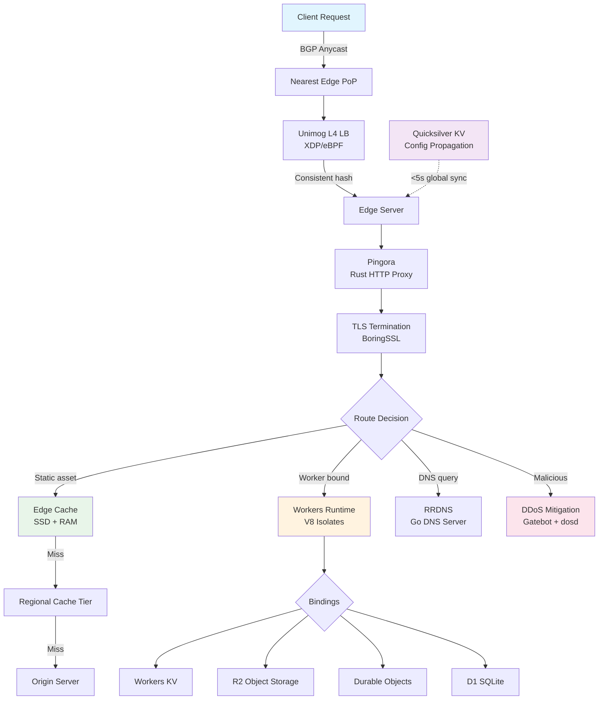
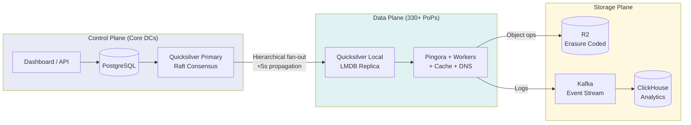
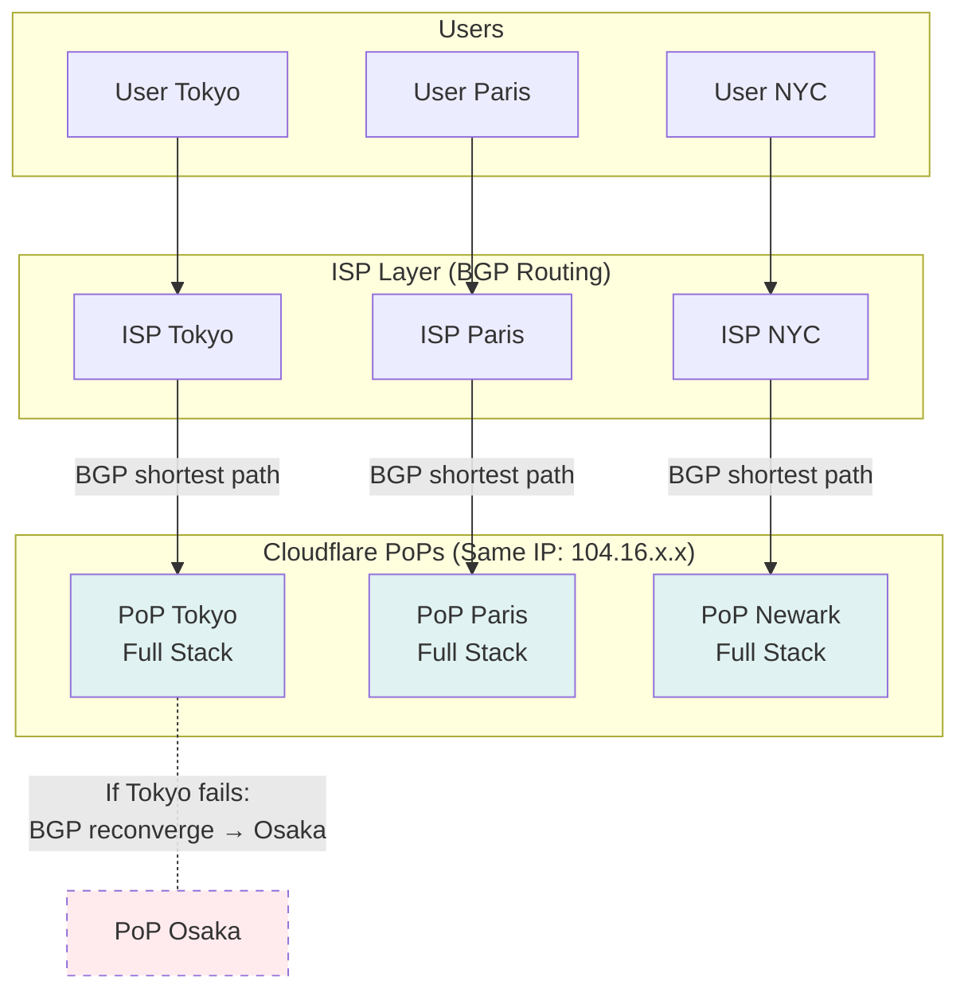

# Cloudflare — How Patterns Work in Production

> 20%+ of internet traffic, 330+ cities, 209+ Tbps capacity. Key systems: Workers, Anycast, Quicksilver, R2, Argo. Open-source: Pingora, CFSSL, Quiche, BoringTun.

---

## High-Level Architecture

### ASCII Overview

```
                            INTERNET
                               │
                    ┌──────────┴──────────┐
                    │   BGP Anycast        │
                    │   Same IPs announced │
                    │   from 330+ cities   │
                    └──────────┬──────────┘
                               │
              ┌────────────────┼────────────────┐
              │                │                │
              ▼                ▼                ▼
     ┌──────────────┐ ┌──────────────┐ ┌──────────────┐
     │  Edge PoP    │ │  Edge PoP    │ │  Edge PoP    │
     │  Tokyo       │ │  Paris       │ │  Newark      │
     │              │ │              │ │              │
     │ ┌──────────┐ │ │ ┌──────────┐ │ │ ┌──────────┐ │
     │ │ Unimog   │ │ │ │ Unimog   │ │ │ │ Unimog   │ │
     │ │ (L4 LB)  │ │ │ │ XDP/eBPF │ │ │ │          │ │
     │ └────┬─────┘ │ │ └────┬─────┘ │ │ └────┬─────┘ │
     │      ▼       │ │      ▼       │ │      ▼       │
     │ ┌──────────┐ │ │ ┌──────────┐ │ │ ┌──────────┐ │
     │ │ Pingora  │ │ │ │ Pingora  │ │ │ │ Pingora  │ │
     │ │ (Rust    │ │ │ │ (HTTP    │ │ │ │ (Proxy)  │ │
     │ │  Proxy)  │ │ │ │  Proxy)  │ │ │ │          │ │
     │ └────┬─────┘ │ │ └────┬─────┘ │ │ └────┬─────┘ │
     │      │       │ │      │       │ │      │       │
     │ ┌────┴────┐  │ │ ┌────┴────┐  │ │ ┌────┴────┐  │
     │ │Workers  │  │ │ │Workers  │  │ │ │Workers  │  │
     │ │Cache    │  │ │ │Cache    │  │ │ │Cache    │  │
     │ │DNS      │  │ │ │DNS      │  │ │ │DNS      │  │
     │ │WAF/DDoS │  │ │ │WAF/DDoS │  │ │ │WAF/DDoS │  │
     │ └────┬────┘  │ │ └────┬────┘  │ │ └────┬────┘  │
     │      │       │ │      │       │ │      │       │
     │ ┌────┴─────┐ │ │ ┌────┴─────┐ │ │ ┌────┴─────┐ │
     │ │Quicksilver│ │ │ │Quicksilver│ │ │ │Quicksilver│ │
     │ │(Local KV) │ │ │ │(Local KV) │ │ │ │(Local KV) │ │
     │ └──────────┘ │ │ └──────────┘ │ │ └──────────┘ │
     └──────┬───────┘ └──────┬───────┘ └──────┬───────┘
            │                │                │
            └────────────────┼────────────────┘
                             │
                    ┌────────┴────────┐
                    │  Argo Private   │
                    │  Backbone       │
                    └────────┬────────┘
                             │
                    ┌────────┴────────┐
                    │  Core DCs       │
                    │ ┌─────────────┐ │
                    │ │ R2 Storage  │ │
                    │ │ ClickHouse  │ │
                    │ │ PostgreSQL  │ │
                    │ │ Kafka       │ │
                    │ └─────────────┘ │
                    └─────────────────┘
```

### Mermaid: Request Lifecycle



### Mermaid: Data Plane vs Control Plane



---

## Pattern Deep Dives

---

### Pattern 1: Edge Computing — Workers

**Core idea:** Run application code at the edge in V8 isolates (not containers), achieving sub-millisecond cold starts and deploying to every PoP simultaneously.

**How Cloudflare implements it:**

Workers uses the same V8 JavaScript engine that powers Chrome. Instead of spinning up a container or VM per function invocation, Workers creates a V8 isolate -- a lightweight execution context within a shared V8 process. Each isolate gets its own heap, its own globals, and strict memory caps (128 MB), but shares the JIT compiler and runtime with all other isolates on the machine.

The result: cold starts under 5ms (typically sub-millisecond for pre-warmed isolates), versus 100-500ms for AWS Lambda. Memory overhead per isolate is roughly 5 MB vs 50+ MB for a container. This density advantage is what allows Cloudflare to run customer code on every server in every PoP.

**Scale numbers:**
- 10+ billion invocations per day
- Sub-millisecond cold start (pre-warmed V8 contexts)
- 128 MB memory limit per isolate
- 30s CPU time (paid), 10ms CPU time (free)
- Code deploys to 330+ cities in a single operation

**Bindings model:** Workers connect to storage via bindings -- compile-time declarations that link a Worker to KV (global eventually-consistent store), R2 (object storage), D1 (SQLite), Durable Objects (strongly consistent single-point coordination), Queues, and external services. Bindings are resolved locally at the PoP level, avoiding round-trips to a central region.

```
  V8 Isolate Architecture
  ═══════════════════════════════════════════

  Single V8 Process (per CPU core)
  ┌─────────────────────────────────────────┐
  │                                         │
  │  ┌──────────┐ ┌──────────┐ ┌────────┐  │
  │  │ Isolate  │ │ Isolate  │ │Isolate │  │
  │  │ Worker A │ │ Worker B │ │Worker C│  │
  │  │          │ │          │ │        │  │
  │  │ Own heap │ │ Own heap │ │Own heap│  │
  │  │ Own scope│ │ Own scope│ │Own     │  │
  │  │ 128MB cap│ │ 128MB cap│ │scope   │  │
  │  └──────────┘ └──────────┘ └────────┘  │
  │                                         │
  │  Shared: V8 engine, JIT cache,          │
  │          built-in modules, TLS context  │
  │                                         │
  │  Isolation boundary: heap separation    │
  │  (no filesystem, no process boundary)   │
  └─────────────────────────────────────────┘

  Comparison:
  ┌──────────────┬───────────┬──────────┬──────────┐
  │              │ V8 Isolate│ Container│ VM       │
  ├──────────────┼───────────┼──────────┼──────────┤
  │ Cold start   │ <5ms      │ 50-500ms │ 1-10s    │
  │ Memory       │ ~5 MB     │ ~50 MB   │ ~256 MB  │
  │ Isolation    │ Heap only │ Namespace│ Hardware │
  │ Languages    │ JS/Wasm   │ Any      │ Any      │
  │ Density      │ Thousands │ Hundreds │ Tens     │
  └──────────────┴───────────┴──────────┴──────────┘
```

**Trade-offs:**
- V8 isolates sacrifice strong process-level isolation for density and startup speed. A V8 engine bug could theoretically allow cross-isolate access (Cloudflare mitigates with Spectre hardening and dynamic process recycling).
- Language support is limited to JavaScript/TypeScript natively. Other languages must compile to WebAssembly, which adds a compilation step and limits some system-level operations.
- Global-only deployment simplifies the model but means data-heavy workloads must use Durable Objects or external databases rather than co-located storage.

**Interview anchor:** When discussing serverless architecture, reference Workers as the extreme end of the cold-start vs isolation trade-off spectrum. "Cloudflare chose V8 isolates to get sub-ms cold starts at the cost of weaker isolation boundaries -- suitable for multi-tenant edge compute but not for running untrusted system-level code."

---

### Pattern 2: Anycast Routing

**Core idea:** Announce the same IP addresses from every data center worldwide via BGP. The internet's routing infrastructure automatically sends users to the nearest PoP.

**How Cloudflare implements it:**

Every Cloudflare server in every PoP runs the complete software stack -- Pingora, Workers, DNS, cache, WAF, DDoS mitigation. There are no specialized node types. When a user sends a request to a Cloudflare-protected domain, the destination IP is the same regardless of whether the user is in Tokyo, Paris, or Sao Paulo. BGP routing tables at intermediate ISPs direct the packet to the nearest PoP advertising that IP prefix.

This design provides two critical properties:

1. **Automatic failover:** If a PoP goes offline, it withdraws its BGP routes. Within seconds, BGP reconverges and traffic flows to the next-nearest PoP. No DNS TTL delays, no health check intervals -- the network layer handles it.

2. **DDoS absorption:** Attack traffic is automatically distributed across all 330+ PoPs. A 1 Tbps attack becomes ~3 Gbps per PoP on average -- manageable for each location individually.

**Scale numbers:**
- Same /24 prefixes announced from 330+ cities in 120+ countries
- 209+ Tbps aggregate network capacity
- BGP failover in seconds (vs minutes for DNS-based failover)
- Every server runs every service (homogeneous fleet)



**Key design decisions:**
- **Homogeneous fleet over specialized roles:** Every machine runs every service. This eliminates internal service routing complexity but means every new feature (e.g., Workers AI) must be deployable to every server in the fleet.
- **Own hardware:** Cloudflare designs and deploys custom servers (custom NIC selection, SSD configuration, kernel tuning). This gives control that cloud VMs cannot provide but requires a global hardware supply chain operation.
- **Unimog for intra-PoP balancing:** Within a PoP, the XDP/eBPF-based Unimog load balancer uses consistent hashing to distribute connections across machines, maintaining stateful L4 connection tracking without hardware load balancers.

**Contrast with DNS-based routing (traditional CDNs):**

| Property | Anycast (Cloudflare) | DNS-based (traditional) |
| --- | --- | --- |
| Failover speed | Seconds (BGP reconvergence) | Minutes (DNS TTL) |
| Routing accuracy | Network-layer (actual packet path) | DNS resolver location (often wrong) |
| DDoS absorption | Automatic across all PoPs | Requires manual traffic steering |
| Complexity | BGP expertise required | Simpler operationally |

---

### Pattern 3: Consistent Hashing — Quicksilver KV

> Cross-ref: [[03_design_patterns/consistent_hashing]]

**Core idea:** Propagate configuration changes (DNS records, WAF rules, Worker deployments) from a central control plane to every server in 330+ cities in under 5 seconds, using hierarchical fan-out with consistent hashing for partition assignment.

**How Cloudflare implements it:**

Quicksilver is a distributed KV store built on top of LMDB (Lightning Memory-Mapped Database). The architecture has three tiers:

1. **Primary cluster (core DCs):** Raft consensus for durability. Receives writes from the API/control plane. Serializes every change into an ordered log.
2. **Regional hubs:** Fan-out layer. Each hub subscribes to a partition of the change log (assigned via consistent hashing). Hubs replicate changes to PoPs in their region.
3. **Edge replicas (every server):** Each server runs a local Quicksilver agent that maintains a full LMDB replica. Reads are zero-copy memory-mapped lookups -- no network round-trip, no serialization overhead.

```
  Quicksilver Hierarchical Fan-Out
  ═══════════════════════════════════════════

  Customer API Call: "Update DNS record"
       │
       ▼
  ┌────────────────────────┐
  │  Control Plane          │
  │  PostgreSQL → Raft      │
  │  Primary Quicksilver    │
  └──────────┬─────────────┘
             │
      ┌──────┴──────┬──────────────┐
      │             │              │
      ▼             ▼              ▼
  ┌────────┐  ┌────────┐    ┌────────┐
  │Regional│  │Regional│    │Regional│
  │Hub: US │  │Hub: EU │    │Hub: AP │
  │West    │  │        │    │        │
  └──┬─────┘  └──┬─────┘   └──┬─────┘
     │           │             │
  ┌──┼──┐    ┌──┼──┐       ┌──┼──┐
  ▼  ▼  ▼    ▼  ▼  ▼       ▼  ▼  ▼
 LAX SJC SEA CDG LHR AMS  NRT HKG SIN
  │   │   │   │   │   │    │   │   │
  ▼   ▼   ▼   ▼   ▼   ▼   ▼   ▼   ▼
 Every server: local LMDB replica
 (memory-mapped, zero-copy reads)

 Total: <5 seconds, core to edge globally
```

**Why consistent hashing matters here:** Regional hubs use consistent hashing to own partitions of the key space. When a hub joins or leaves, only its partition range is re-assigned -- minimal disruption. The same principle applies to the Quicksilver primary cluster's internal sharding.

**Key design decisions:**
- **LMDB for local storage:** Memory-mapped B-tree. Zero-copy reads mean Pingora reads config keys without serialization overhead. Crash-safe, excellent read performance for this read-heavy (99.99% reads) workload.
- **Eventual consistency accepted:** A DNS change may be visible in Tokyo before Paris. For config propagation, the <5s global convergence window is the contract. No need for linearizability.
- **Log-based replication:** Every change is a log entry with a sequence number. Servers that fall behind can catch up by replaying the log from their last known position.

**Interview anchor:** "Design a config distribution system" -- reference Quicksilver's three-tier hierarchy. Key insight: direct replication from 1 primary to 10,000+ servers creates too many connections. Regional hubs reduce fan-out while keeping propagation under 5 seconds.

---

### Pattern 4: Rate Limiting

> Cross-ref: [[02_building_blocks/rate_limiter]]

**Core idea:** Enforce request rate limits at the edge using multi-layer sliding window counters, applied per-IP, per-path, or per-custom-key, before requests ever reach the origin.

**How Cloudflare implements it:**

Cloudflare's rate limiting operates in multiple layers:

1. **L3/L4 layer (XDP/eBPF):** Packet-rate limits applied in the kernel before packets reach userspace. Drops volumetric attacks at line rate.
2. **L7 layer (Pingora):** HTTP request-rate limits using sliding window counters. Rules defined per zone (customer configuration) with keys like IP, path, headers, or combinations.
3. **Bot Management layer:** Behavioral rate limiting that adapts thresholds based on client reputation scores, JA3 fingerprints, and challenge completion history.

The sliding window algorithm combines two fixed windows to approximate a continuous rate:

```
  Sliding Window Rate Limiting
  ═══════════════════════════════════════════

  Window size: 60 seconds
  Limit: 100 requests/window

  Fixed Window 1 (00:00-01:00): 80 requests counted
  Fixed Window 2 (01:00-02:00): currently at 01:45

  Current time: 01:45 (75% through Window 2)

  Approximate count =
    Window 2 count + (Window 1 count * remaining %)
    = 30 + (80 * 0.25) = 50

  50 < 100 → ALLOW

  ┌─────────────────┬─────────────────┐
  │  Window 1       │  Window 2       │
  │  80 requests    │  30 requests    │
  │                 │        ↑        │
  │     25% weight──┤  now: 01:45     │
  └─────────────────┴─────────────────┘

  Stored in local memory per edge server.
  Cross-PoP coordination: NOT required for
  per-IP limits (same IP → same PoP via Anycast).
```

**Why per-PoP works:** Anycast routing means the same client IP consistently routes to the same PoP. So rate counters stored locally at each PoP accurately track per-IP request rates without cross-datacenter coordination. For global rate limits (per-API-key across all IPs), Cloudflare uses Durable Objects for strongly consistent counting.

**Key design decisions:**
- **Sliding window over fixed window:** Fixed windows allow burst at window boundaries (2x the limit). Sliding windows smooth this without the memory cost of tracking individual request timestamps.
- **Multi-layer defense:** L3/L4 rate limits (eBPF) stop volumetric floods. L7 rate limits (Pingora) handle application-layer abuse. The layers complement each other.
- **Edge-local counters:** No central rate limit service to become a bottleneck. The trade-off: a distributed attack from many IPs across many PoPs can bypass per-IP per-PoP limits -- which is why bot management adds behavioral analysis on top.

**Interview anchor:** Reference Cloudflare's sliding window when asked "Design a rate limiter." Key insight: Anycast makes per-IP rate limiting trivially consistent because the same IP always hits the same PoP.

> See also: [[05_case_studies/design_rate_limiter]]

---

### Pattern 5: CDN Edge Caching

> Cross-ref: [[02_building_blocks/cdn]]

**Core idea:** Three-tier caching hierarchy -- edge (local SSD/RAM) to regional hub to origin -- with Cache-Tag-based selective invalidation for fine-grained purging.

**How Cloudflare implements it:**

```
  Tiered Caching Architecture
  ═══════════════════════════════════════════

  Request from user in Berlin
       │
       ▼
  ┌────────────────────┐
  │ Edge PoP: Berlin   │
  │ Local Cache (SSD)  │──► HIT? → serve directly
  └────────┬───────────┘    (fastest, ~1ms)
           │ MISS
           ▼
  ┌────────────────────┐
  │ Regional Hub:      │
  │ Frankfurt          │──► HIT? → serve + populate Berlin
  └────────┬───────────┘    (regional, ~5ms)
           │ MISS
           ▼
  ┌────────────────────┐
  │ Origin Server      │──► Fetch + populate Frankfurt + Berlin
  │ (customer's)       │    (origin round-trip, 50-200ms)
  └────────────────────┘

  WITHOUT tiered caching:
  100 PoPs × MISS = 100 origin requests for same asset

  WITH tiered caching:
  100 PoPs → 5 regional hubs → 1 origin request (worst case)
  Origin load reduced by ~90%
```

**Cache-Tag purging:** Customers tag cached assets with arbitrary strings (e.g., `product-page`, `user-123`, `lang-en`). Purging by tag invalidates all assets matching that tag across all PoPs in <5 seconds (via Quicksilver propagation). This is far more precise than purging by URL pattern or purging everything.

**Key design decisions:**
- **Tiered caching reduces origin load:** Without regional hubs, a cache miss at any of 330+ PoPs triggers an origin fetch. With ~15 regional hubs, the worst case is 15 origin fetches for a globally popular asset (one per region).
- **SSD + RAM caching at edge:** Hot objects in RAM, warm objects on NVMe SSD. Eviction is LRU-based with popularity boosting.
- **Respect for origin cache headers:** Cloudflare respects Cache-Control, but customers can override via Page Rules or Cache Rules. This flexibility is critical because many origins misconfigure cache headers.

**Interview anchor:** "Design a CDN" -- reference the three-tier model. Key insight: tiered caching collapses N PoPs into K regional hubs (K << N), reducing origin load by an order of magnitude. Cache-Tag purging solves selective invalidation without brute-force approaches.

> See also: [[05_case_studies/design_distributed_cache]]

---

### Pattern 6: Bloom Filters

> Cross-ref: [[03_design_patterns/bloom_filters]]

**Core idea:** Use probabilistic data structures to perform cheap membership checks before expensive computations -- specifically in bot detection and WAF rule matching.

**How Cloudflare implements it:**

In bot management, Cloudflare needs to check whether a client IP, JA3 fingerprint, or token has been seen before, flagged as malicious, or recently challenged. Checking a full database for every request at 57M+ requests/second is prohibitively expensive.

Bloom filters provide a space-efficient answer: "definitely not in set" or "probably in set." The false positive rate is tunable (typically 1-5%) and the false positive cost is low -- it means an occasional legitimate request gets an extra check, not a block.

```
  Bloom Filter in Bot Detection Pipeline
  ═══════════════════════════════════════════

  Incoming request
       │
       ▼
  ┌──────────────────────────────────────────┐
  │ Step 1: Bloom Filter Check               │
  │ "Is this IP in the known-bot set?"       │
  │                                          │
  │  Hash IP through k hash functions        │
  │  Check k bit positions in bit array      │
  │                                          │
  │  All bits set? → PROBABLY in set → Step 2│
  │  Any bit zero? → DEFINITELY NOT → ALLOW  │
  │                                          │
  │  Cost: O(k) lookups, ~1 microsecond      │
  │  Memory: ~1 byte per tracked element     │
  └──────────────────┬───────────────────────┘
                     │ (only for "probably yes")
                     ▼
  ┌──────────────────────────────────────────┐
  │ Step 2: Full Lookup / ML Scoring         │
  │                                          │
  │  Expensive operations:                   │
  │  - Database lookup for IP reputation     │
  │  - ML model inference for bot scoring    │
  │  - Challenge issuance (Turnstile)        │
  │                                          │
  │  Cost: 1-10 milliseconds                 │
  └──────────────────────────────────────────┘

  Result: 95%+ of requests skip expensive Step 2
```

**WAF rule matching:** The WAF has thousands of rules. Before running full regex matching on a request body, a Bloom filter check against known-safe patterns can skip most rule evaluations entirely.

**Key properties at Cloudflare's scale:**
- At 57M requests/second, saving even 1ms per request through Bloom filter pre-checks saves ~57,000 CPU-seconds per second across the fleet.
- Bloom filters are updated periodically (not in real-time) and distributed to edge servers -- they are read-only at the edge, rebuilt centrally.
- False positives trigger additional verification, not blocking. False negatives (impossible with Bloom filters for membership queries) would be the real danger.

**Interview anchor:** When discussing "Design a rate limiter" or "Design a web application firewall," reference Bloom filters as the pre-check layer. Key insight: probabilistic data structures are the first line of defense at high-throughput systems -- they trade a small false positive rate for massive computation savings.

---

### Pattern 7: Canary Deployments

> Cross-ref: [[15_intermediate_topics/deployment_strategies]]

**Core idea:** Roll out changes progressively across the 330+ city fleet: single PoP, then canary set, then full deployment. Apply to both code releases and configuration changes.

**How Cloudflare implements it:**

After the 2019 regex outage (where a WAF rule deployed globally in seconds and crashed the entire network), Cloudflare overhauled its deployment pipeline for both code and config:

```
  Canary Deployment Pipeline
  ═══════════════════════════════════════════

  Stage 1: Single PoP (e.g., SJC or a small PoP)
  ┌───────┐
  │ 1 PoP │  Deploy + observe for 15-30 minutes
  └───┬───┘  Metrics: error rate, latency p50/p99,
      │      CPU usage, memory
      │
  Stage 2: Canary Set (5-10 diverse PoPs)
  ┌───────┐ ┌───────┐ ┌───────┐
  │ 5-10  │ │ Mixed │ │ Geo   │  Expand if Stage 1 clean
  │ PoPs  │ │ sizes │ │ spread│  Observe for 1-2 hours
  └───┬───┘ └───┬───┘ └───┬───┘  Automated rollback on
      │         │         │      anomaly detection
      │
  Stage 3: Regional Rollout
  ┌─────────────┐ ┌──────────────┐
  │ Region by   │ │ Staggered    │  One region at a time
  │ region      │ │ over hours   │  Each region observed
  └──────┬──────┘ └──────┬───────┘  before proceeding
         │
  Stage 4: Global
  ┌──────────────────────────┐
  │ All 330+ PoPs            │  Full fleet deployment
  │ Total time: hours to days│  Depending on risk level
  └──────────────────────────┘

  Rollback: Automatic on metric anomaly.
  Quicksilver propagates rollback in <5 seconds.
```

**Critical lesson from the 2019 regex outage:** Quicksilver's speed (propagation in <5 seconds) is a feature for fast rollouts but a liability when the change is bad. The fix: route all changes (code and config) through the canary pipeline. WAF rules, DNS changes, and Workers runtime updates all follow the same staged rollout.

**Automated rollback triggers:**
- Error rate increase >0.1% compared to baseline
- Latency p99 increase >20% compared to baseline
- CPU utilization spike beyond expected range
- Manual override by on-call engineer

**Interview anchor:** Use the Cloudflare regex outage as the canonical example of why canary deployments matter for config changes, not just code. "Fast propagation systems like Quicksilver need built-in blast radius controls -- Cloudflare learned this after a single regex took down 20% of the internet."

---

### Pattern 8: Serverless Isolation

**Core idea:** Choose the right isolation boundary for multi-tenant code execution. V8 isolates trade stronger isolation for dramatically lower overhead compared to containers and VMs.

**How Cloudflare implements it:**

Workers runs thousands of customer isolates per machine. The isolation model is fundamentally different from AWS Lambda (containers) or traditional VMs:

```
  Isolation Model Comparison
  ═══════════════════════════════════════════

  VM-based (EC2, Firecracker):
  ┌──────────────────────────────────┐
  │ Host OS                          │
  │  ┌────────────┐ ┌────────────┐  │
  │  │ Guest OS   │ │ Guest OS   │  │
  │  │ ┌────────┐ │ │ ┌────────┐ │  │
  │  │ │ App A  │ │ │ │ App B  │ │  │
  │  │ └────────┘ │ │ └────────┘ │  │
  │  └────────────┘ └────────────┘  │
  │  Hardware isolation boundary     │
  │  Startup: 1-10 seconds           │
  │  Memory: ~256 MB per VM          │
  └──────────────────────────────────┘

  Container-based (Lambda, K8s):
  ┌──────────────────────────────────┐
  │ Host OS (shared kernel)          │
  │  ┌────────────┐ ┌────────────┐  │
  │  │ Container  │ │ Container  │  │
  │  │ Namespaces │ │ Namespaces │  │
  │  │ ┌────────┐ │ │ ┌────────┐ │  │
  │  │ │ App A  │ │ │ │ App B  │ │  │
  │  │ └────────┘ │ │ └────────┘ │  │
  │  └────────────┘ └────────────┘  │
  │  Namespace + cgroup boundary     │
  │  Startup: 50-500 milliseconds    │
  │  Memory: ~50 MB per container    │
  └──────────────────────────────────┘

  V8 Isolate-based (Cloudflare Workers):
  ┌──────────────────────────────────┐
  │ Host OS                          │
  │  ┌─────────────────────────────┐ │
  │  │ Single V8 Process           │ │
  │  │ ┌───────┐┌───────┐┌──────┐ │ │
  │  │ │Isolate││Isolate││Isolat│ │ │
  │  │ │ App A ││ App B ││App C │ │ │
  │  │ └───────┘└───────┘└──────┘ │ │
  │  └─────────────────────────────┘ │
  │  Heap isolation only             │
  │  Startup: <5 milliseconds        │
  │  Memory: ~5 MB per isolate       │
  │  Density: thousands per machine  │
  └──────────────────────────────────┘
```

**Security mitigations for weaker isolation:**
- **Spectre hardening:** V8 includes mitigations against Spectre side-channel attacks. Cloudflare additionally uses process-level isolation between customers with different trust levels.
- **Dynamic process recycling:** Isolate processes are periodically recycled to limit the window of any potential memory leak or isolation escape.
- **CPU time limits:** Hard limits (10ms free, 30s paid) prevent infinite loops and resource exhaustion.
- **No filesystem access:** Workers have no access to the host filesystem. All I/O goes through controlled bindings (KV, R2, etc.).

**Interview anchor:** When asked about multi-tenant isolation, present the three-tier model (VM > container > isolate) and explain Cloudflare's choice. "V8 isolates give 100x better density and 100x faster cold starts, but the security boundary is software-enforced heap isolation rather than hardware-enforced VM boundaries. The right choice depends on your threat model."

---

### Pattern 9: Sharding — R2 Object Storage

> Cross-ref: [[03_design_patterns/sharding]]

**Core idea:** Distribute objects across storage nodes using key-based sharding with erasure coding for durability, achieving 11 nines durability without 3x replication overhead.

**How Cloudflare implements it:**

R2 is Cloudflare's S3-compatible object storage. Objects are distributed across storage nodes in core data centers using consistent hashing on the object key. Data is not simply replicated 3x (as in typical distributed storage); instead, R2 uses erasure coding to split data into data shards and parity shards.

```
  R2 Storage Architecture
  ═══════════════════════════════════════════

  Client (S3 SDK or Workers binding)
       │
       ▼
  ┌──────────────────────────────────────────┐
  │ R2 Gateway (runs at every edge PoP)      │
  │ - Authenticates via S3 auth or Workers   │
  │ - Routes to appropriate storage cluster  │
  └──────────────────┬───────────────────────┘
                     │
                     ▼
  ┌──────────────────────────────────────────┐
  │ Metadata Layer                           │
  │ Distributed index: key → location        │
  │ Consistent hashing for partition assign  │
  └──────────────────┬───────────────────────┘
                     │
                     ▼
  ┌──────────────────────────────────────────┐
  │ Storage Layer (Erasure Coded)            │
  │                                          │
  │ Object "photo.jpg" (12 MB)              │
  │ Split into 8 data + 4 parity shards     │
  │                                          │
  │ ┌──┐┌──┐┌──┐┌──┐┌──┐┌──┐┌──┐┌──┐       │
  │ │D1││D2││D3││D4││D5││D6││D7││D8│       │
  │ └──┘└──┘└──┘└──┘└──┘└──┘└──┘└──┘       │
  │ ┌──┐┌──┐┌──┐┌──┐                        │
  │ │P1││P2││P3││P4│  (parity)              │
  │ └──┘└──┘└──┘└──┘                        │
  │                                          │
  │ Tolerates loss of any 4 shards          │
  │ Storage overhead: 1.5x (vs 3x for       │
  │ triple replication)                      │
  │ Durability: 99.999999999% (11 nines)    │
  └──────────────────────────────────────────┘

  Erasure coding vs replication:
  ┌───────────────┬──────────┬───────────────┐
  │               │ 3x Repli │ Erasure (8+4) │
  ├───────────────┼──────────┼───────────────┤
  │ Storage cost  │ 3.0x     │ 1.5x          │
  │ Fault tolerance│ 2 nodes │ 4 nodes       │
  │ Read perf     │ Any copy │ Need 8 of 12  │
  │ Repair cost   │ Copy 1   │ Reconstruct   │
  └───────────────┴──────────┴───────────────┘
```

**Key design decisions:**
- **Zero egress pricing:** The entire R2 product thesis. AWS S3 egress ($0.09/GB) creates massive lock-in. R2 charges $0, making multi-cloud economically viable.
- **S3 API compatibility:** Customers change an endpoint URL and migrate. No code rewrite required. This is a deliberate strategy to reduce switching costs.
- **Workers integration:** R2 + Workers enables compute-on-storage at the edge. Data does not move to compute; compute runs where data is accessible.

**Interview anchor:** When discussing distributed storage, reference R2's erasure coding as an alternative to simple replication. "Erasure coding gives better durability with less storage overhead -- 1.5x vs 3x -- but adds computational complexity for writes and reconstruction during failures."

---

### Pattern 10: Back Pressure — Argo Smart Routing

> Cross-ref: [[03_design_patterns/back_pressure]]

**Core idea:** Use real-time latency telemetry from billions of requests to build a weighted network graph, then apply Dijkstra's shortest path algorithm to route traffic through the fastest paths on Cloudflare's private backbone -- applying back pressure by routing around congested links.

**How Cloudflare implements it:**

BGP routing optimizes for policy and cost, not latency. Packets often traverse congested peering points. Argo Smart Routing maintains a real-time latency graph where every edge in the graph is a link between two Cloudflare PoPs, weighted by measured latency.

```
  Argo Smart Routing: Latency Graph
  ═══════════════════════════════════════════

  Default BGP path (optimizes for cost):
  User ──► ISP ──► Transit A ──► Transit B ──► Origin
                   (congested)   (suboptimal)
                   +40ms         +30ms
                                       Total: ~150ms

  Argo path (optimizes for latency):
  User ──► CF PoP ──► CF Backbone ──► CF PoP ──► Origin
           (nearest)  (private,       (nearest
            +5ms       uncongested)   to origin)
                       +15ms          +5ms
                                       Total: ~85ms

  Real-time latency graph (simplified):
  ┌─────┐  12ms  ┌─────┐  8ms   ┌─────┐
  │ LAX ├────────► DFW ├───────► IAD │
  │     │         │     │        │     │
  └──┬──┘         └─────┘        └──┬──┘
     │   45ms (direct via BGP)      │
     └──────────────────────────────┘

  Argo picks: LAX → DFW → IAD (20ms total)
  BGP picks:  LAX → IAD direct (45ms)

  Back pressure mechanism:
  - When LAX→DFW link degrades (congestion, packet loss),
    its weight increases in the graph
  - Dijkstra recalculates: LAX → SJC → DEN → IAD
  - Traffic automatically shifts away from congested links
  - Re-evaluation happens every few seconds
```

**How it implements back pressure:**

The back pressure pattern manifests in how Argo responds to congestion. When a link between two PoPs becomes congested:
1. Latency measurements increase for that edge in the graph
2. Dijkstra's algorithm recalculates shortest paths, routing around the congested link
3. Traffic shifts to alternative paths through the backbone
4. The congested link's load decreases, recovering naturally

This is back pressure through routing: rather than dropping requests or queuing them, the system routes them around the bottleneck.

**Scale numbers:**
- ~30% average latency reduction for Argo-enabled sites
- Telemetry from 57M+ requests/second feeds the latency model
- Path recalculation every few seconds
- Private backbone spanning 330+ cities

**Key design decisions:**
- **Overlay network over BGP:** Rather than fighting BGP, Cloudflare builds a virtual overlay. Packets still traverse physical links, but Cloudflare chooses which PoPs to relay through.
- **Real-user telemetry over synthetic probes:** Latency data comes from actual user traffic, reflecting real conditions rather than theoretical measurements.
- **Opt-in pricing model:** Argo is $5/month + $0.10/GB. This funds the private backbone infrastructure.

**Interview anchor:** When discussing back pressure or load shedding, Argo illustrates a routing-based approach. "Instead of dropping requests when a path is congested, Cloudflare's Argo routes around the congestion using a real-time Dijkstra computation over its backbone graph -- back pressure through path adaptation rather than request rejection."

---

## Pattern Summary

| # | Pattern | Cloudflare System | Key Mechanism | Scale | Cross-Reference |
| --- | --- | --- | --- | --- | --- |
| 1 | Edge Computing | Workers | V8 isolates, sub-ms cold start, global deploy | 10B+ invocations/day | -- |
| 2 | Anycast Routing | Network / BGP | Same IP from 330+ cities, auto failover | 209+ Tbps capacity | -- |
| 3 | Consistent Hashing | Quicksilver KV | Hierarchical fan-out, LMDB local replicas | <5s global propagation | [[03_design_patterns/consistent_hashing]] |
| 4 | Rate Limiting | Pingora / eBPF | Sliding window, per-IP at edge, multi-layer | 57M+ req/s | [[02_building_blocks/rate_limiter]] |
| 5 | CDN Edge Caching | Tiered Cache | Edge → regional → origin, Cache-Tag purge | 330+ PoPs | [[02_building_blocks/cdn]] |
| 6 | Bloom Filters | Bot Management / WAF | Probabilistic pre-check before expensive ops | 95%+ requests skip heavy path | [[03_design_patterns/bloom_filters]] |
| 7 | Canary Deployments | Deployment Pipeline | 1 PoP → canary set → regional → global | Hours to days rollout | [[15_intermediate_topics/deployment_strategies]] |
| 8 | Serverless Isolation | Workers Runtime | V8 isolates: heap isolation, no FS access | Thousands per machine | -- |
| 9 | Sharding | R2 Object Storage | Erasure coding (8+4), consistent hash routing | 11 nines durability | [[03_design_patterns/sharding]] |
| 10 | Back Pressure | Argo Smart Routing | Real-time Dijkstra over latency graph | ~30% latency reduction | [[03_design_patterns/back_pressure]] |

---

## Failure Stories

### 1. The Regex Outage (July 2, 2019)

> See: [[09_real_outages/cloudflare_regex_outage_2019]]

**What happened:** A single WAF rule containing a catastrophic backtracking regex was deployed globally via Quicksilver. The regex `.*(?:.*=.*)` caused exponential backtracking in the PCRE engine, spiking CPU to 100% on every server worldwide. Cloudflare went offline for 27 minutes.

**Timeline:**
| Time (UTC) | Event |
| --- | --- |
| 13:42 | WAF rule deployed globally via Quicksilver |
| 13:45 | Global CPU spike detected by monitoring |
| 13:52 | Engineering team paged |
| 14:02 | Root cause identified as WAF rule |
| 14:07 | Global WAF kill switch activated |
| 14:09 | Traffic recovery begins |

**Patterns that failed:**
- **Canary deployment was bypassed.** The WAF rule went directly to global deployment without staged rollout.
- **Fast propagation amplified the blast radius.** Quicksilver did its job perfectly -- it pushed the bad config everywhere in seconds.
- **No CPU-time guardrails on regex execution.** The PCRE engine allowed unbounded backtracking.

**What they fixed:**
1. All WAF rules now go through canary pipeline (Pattern 7)
2. Migrated regex engine from PCRE to Rust's regex crate (guarantees linear-time matching)
3. Added CPU time limits for all regex evaluations
4. Improved WAF kill switch to be faster and automated

**Interview lesson:** Fast propagation is a double-edged sword. Any system that can push changes to 330+ cities in 5 seconds can also push a catastrophic mistake in 5 seconds. Canary deployments are mandatory for config changes, not just code.

### 2. Backbone Outage (June 21, 2022)

**What happened:** A BGP misconfiguration during maintenance accidentally withdrew routes for 19 data centers. The change was intended to modify traffic engineering policies in a single core PoP but had a cascading effect on dependent route advertisements.

**Duration:** ~20 minutes of partial unavailability.

**Patterns that failed:**
- **Lack of automated pre-flight checks for BGP changes.** The change was applied manually without dry-run validation.
- **Blast radius not contained.** A single PoP's change affected 18 other locations.

**What they fixed:**
1. Automated pre-flight validation for all BGP configuration changes
2. Maximum Change Rate (MCR) limits -- caps how many routes can change per minute
3. Improved BGP change rollback procedures

### 3. Leap Second Bug (January 1, 2017)

**What happened:** Cloudflare's Go-based DNS resolver (RRDNS) crashed across multiple PoPs when the UTC leap second caused `time.Now()` to return a timestamp that, when subtracted from a prior timestamp, produced a negative duration. The Go code did not handle this case, causing a panic.

**Duration:** DNS resolution failures for several minutes after midnight UTC.

**Patterns that failed:**
- **Assumption that time is monotonic.** The code used wall-clock time for duration calculations instead of monotonic clocks.
- **Insufficient edge case testing.** Leap seconds are rare (last one before this was June 2015) and hard to simulate.

**What they fixed:**
1. Switched to monotonic clock sources for all duration calculations
2. Added leap-second simulation to test suites
3. Contributed upstream fixes to Go's time handling

**Interview lesson:** Time is the most deceptive primitive in distributed systems. Any code that computes `t2 - t1` must handle clock skew, leap seconds, NTP jumps, and monotonicity violations.

---

## Interview Quick Reference

| Interview Question | Cloudflare Pattern to Reference | Key Insight | Vault Link |
| --- | --- | --- | --- |
| Design a CDN | Tiered caching (Pattern 5) + Anycast (Pattern 2) | Three-tier cache collapses 330 PoPs into ~15 regional hubs, reducing origin load 90%+ | [[05_case_studies/design_distributed_cache]] |
| Design a rate limiter | Sliding window at edge (Pattern 4) + Bloom filters (Pattern 6) | Anycast makes per-IP rate limiting trivially consistent -- same IP always hits same PoP | [[05_case_studies/design_rate_limiter]] |
| Design a distributed cache | Quicksilver (Pattern 3) + Tiered cache (Pattern 5) | Hierarchical fan-out for propagation, LMDB for zero-copy local reads | [[05_case_studies/design_distributed_cache]] |
| Design a config system | Quicksilver (Pattern 3) | Three-tier hierarchy: core → regional hubs → edge servers, eventual consistency | -- |
| Design a serverless platform | Workers (Pattern 1) + Isolation (Pattern 8) | V8 isolates: 100x density, sub-ms cold start, trade-off is weaker isolation | -- |
| Design object storage | R2 sharding (Pattern 9) | Erasure coding (8+4) gives 11 nines durability at 1.5x overhead vs 3x for replication | -- |
| Design a DDoS mitigation system | Anycast (Pattern 2) + Rate limiting (Pattern 4) | Anycast distributes attack traffic; eBPF drops packets at NIC before kernel | -- |
| Design a deployment pipeline | Canary (Pattern 7) | 2019 regex outage: fast propagation without canary = global blast radius | -- |
| How does back pressure work at scale? | Argo (Pattern 10) | Route around congestion via real-time Dijkstra, not drop/queue | -- |

**Top 3 talking points for any Cloudflare discussion:**

1. **"Every server runs every service"** -- Homogeneous fleet eliminates service mesh complexity. Know when this works (Cloudflare's model) and when it does not (heterogeneous workloads with different resource profiles).

2. **V8 isolates vs containers** -- The defining architectural bet. Sub-ms cold starts and thousands-per-machine density, at the cost of software-only isolation. The right choice depends on threat model: fine for multi-tenant edge compute, insufficient for running untrusted system-level code.

3. **The regex outage as a teaching moment** -- Fast config propagation (Quicksilver) is a superpower and a liability. Any system that can deploy globally in seconds needs staged rollout with automated rollback. This applies to feature flags, firewall rules, DNS changes -- not just code.

---

## Startup Playbook — What to Steal from Cloudflare

### 1. Steal the Tiered Caching Pattern (Cost: Free)

**What:** Instead of every edge server hitting your origin on cache miss, add a regional cache tier (even just 3-5 nodes).

**How to implement cheaply:**
- Use Nginx or Varnish as a regional cache tier between your CDN and origin
- Configure your CDN (even free Cloudflare) with Argo Tiered Cache if budget allows
- Or self-host: 3 regional caches (US, EU, AP) reduce origin load by 80-90%

**Impact:** Origin server costs drop dramatically. A $500/month origin can serve 10x the traffic with a $150/month cache tier in front.

### 2. Steal the Sliding Window Rate Limiter (Cost: Free)

**What:** Implement the sliding window algorithm from Pattern 4 at your API gateway.

**How to implement:**
```
# Pseudocode (works in Redis, in-memory, anywhere)
def is_allowed(key, limit, window_seconds):
    now = current_timestamp()
    current_window = now // window_seconds
    previous_window = current_window - 1

    current_count = get_count(key, current_window)
    previous_count = get_count(key, previous_window)

    elapsed_ratio = (now % window_seconds) / window_seconds
    weight = previous_count * (1 - elapsed_ratio) + current_count

    return weight < limit
```

**Impact:** Protects your API from abuse with two Redis keys per client, no external service needed.

### 3. Steal Bloom Filter Pre-Checks (Cost: Free)

**What:** Before any expensive lookup (database query, API call, ML inference), check a Bloom filter first.

**Use cases for startups:**
- Check if a username exists before hitting the database
- Check if a URL has been crawled before scheduling a crawl job
- Check if an email is in a blocklist before processing

**Impact:** 10-100x reduction in expensive lookups for negative cases. A Bloom filter with 1% false positive rate uses ~10 bits per element -- you can track 100M items in ~120 MB of RAM.

### 4. Steal the Canary Deployment Mindset (Cost: Free)

**What:** Never deploy anything to 100% at once. Even a 2-stage rollout (10% then 100%) catches most catastrophic issues.

**Minimum viable canary for startups:**
- Feature flags with percentage rollout (LaunchDarkly, Unleash, or DIY)
- Deploy to staging that receives 5% of production traffic (shadow mode)
- Automated rollback trigger: if error rate > 2x baseline for 5 minutes, revert

**Impact:** Prevents the "one bad deploy takes down everything" scenario that kills startups.

### 5. Steal the Hierarchical Propagation Model (Cost: Low)

**What:** If you need to distribute config/data to many nodes, do not fan out directly from one source. Add an intermediate tier.

**When you need this:** Feature flags, config updates, cache invalidation across >10 servers.

**Simple implementation:**
- Source publishes to 3-5 regional "relay" nodes
- Each relay pushes to the servers in its region
- Reduces source connections from N to 5, reduces total propagation time

**Impact:** Scales config propagation from "works for 10 servers" to "works for 10,000 servers" with minimal architecture change.

### 6. Steal Zero-Egress Thinking for Storage Decisions (Cost: Saves Money)

**What:** Before choosing a storage provider, calculate your egress bill, not just storage cost.

**The math:**
- 1 TB stored on S3: ~$23/month storage
- 1 TB served from S3: ~$90/month egress
- Total: $113/month, and egress dominates

**Alternatives:** R2 ($0 egress), Backblaze B2 ($0 egress to Cloudflare), self-hosted MinIO for internal workloads.

**Impact:** For read-heavy workloads, egress costs can be 4-10x storage costs. Choosing the right provider saves thousands per month at moderate scale.

---

## Sources & Further Reading

### Official Cloudflare Blog Posts
- [Cloud Computing Without Containers (Workers)](https://blog.cloudflare.com/cloud-computing-without-containers/)
- [How Pingora Connects Cloudflare to the Internet](https://blog.cloudflare.com/how-we-built-pingora-the-proxy-that-connects-cloudflare-to-the-internet/)
- [Cloudflare Outage July 2, 2019 (Regex)](https://blog.cloudflare.com/details-of-the-cloudflare-outage-on-july-2-2019/)
- [Quicksilver: Configuration Distribution at Internet Scale](https://blog.cloudflare.com/introducing-quicksilver-configuration-distribution-at-internet-scale/)
- [Unimog: Edge Load Balancer](https://blog.cloudflare.com/unimog-cloudflares-edge-load-balancer/)
- [R2 General Availability](https://blog.cloudflare.com/r2-ga/)
- [How BPF Eats the World (Architecture)](https://blog.cloudflare.com/cloudflare-architecture-and-how-bpf-eats-the-world/)

### Related Vault Notes
- [[09_real_outages/cloudflare_regex_outage_2019]] -- Regex outage deep dive
- [[03_design_patterns/consistent_hashing]] -- Used in Quicksilver, Unimog, Durable Objects
- [[03_design_patterns/sharding]] -- Used in R2
- [[03_design_patterns/bloom_filters]] -- Used in bot detection, WAF
- [[03_design_patterns/back_pressure]] -- Used in Argo routing
- [[02_building_blocks/rate_limiter]] -- Edge rate limiting design
- [[02_building_blocks/cdn]] -- CDN caching patterns
- [[05_case_studies/design_distributed_cache]] -- Cache design reference
- [[05_case_studies/design_rate_limiter]] -- Rate limiter design reference
- [[15_intermediate_topics/deployment_strategies]] -- Canary and rollout patterns

---

*Last updated: 2026-02-23*
