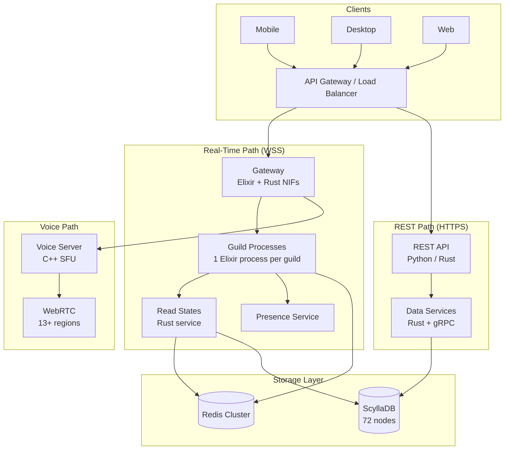
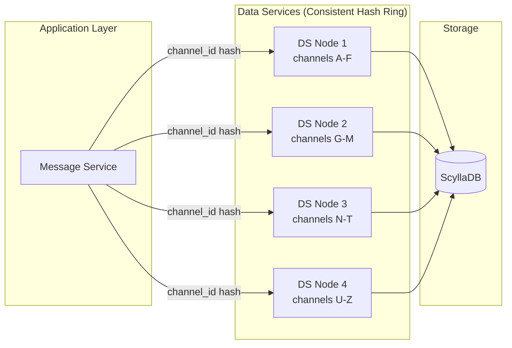
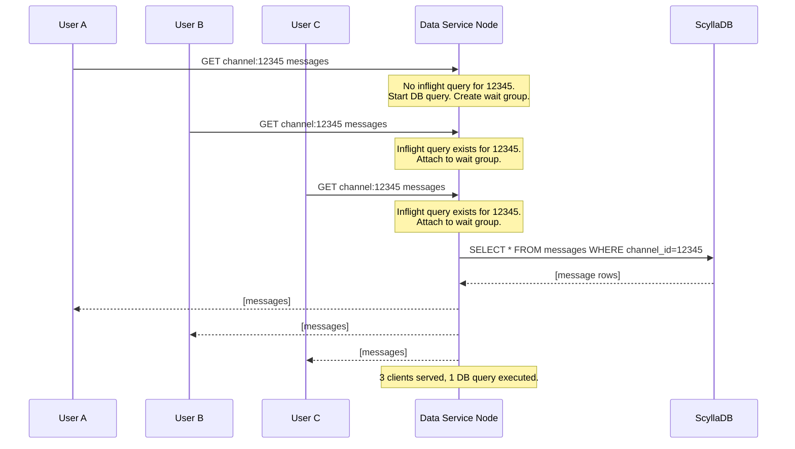
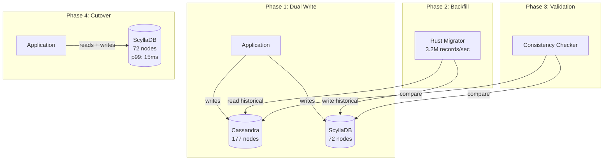
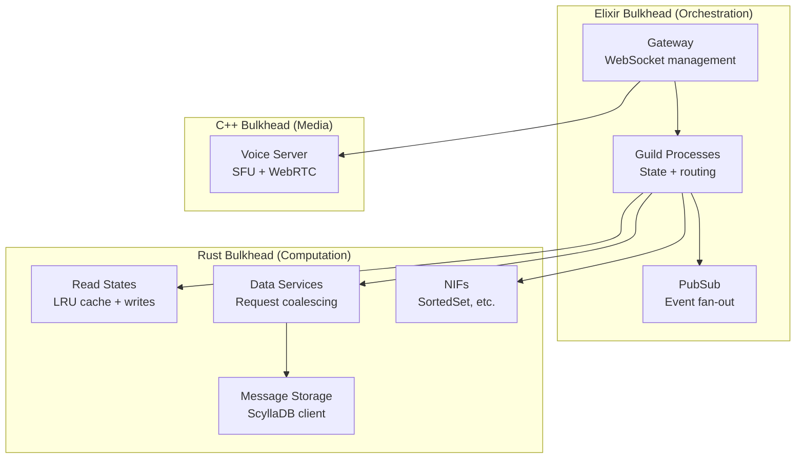

# Discord — How Patterns Work in Production

> **200M+ MAU, 15M+ concurrent at peak. Key: Elixir to Rust migration,
> ScyllaDB migration, Gateway, Guild sharding. Infra: GCP.**

---

## High-Level Architecture

### ASCII Overview

```
                         +-----------+     +-----------+     +-----------+
                         |  Mobile   |     |  Desktop  |     |    Web    |
                         |  Client   |     |  Client   |     |  Client   |
                         +-----+-----+     +-----+-----+     +-----+-----+
                               |                 |                 |
                               +--------+--------+--------+--------+
                                        |  HTTPS / WSS     |
                                        v                  v
                               +--------+---------+  +-----------+
                               |   API Gateway    |  |  CDN Edge |
                               | (load balancer)  |  | (media)   |
                               +--------+---------+  +-----------+
                                        |
                               +--------+--------+
                               |                 |
                               v                 v
                         +-----+------+   +------+-----+
                         |  REST API  |   |  Gateway   |
                         |  (Python/  |   | (Elixir +  |
                         |   Rust)    |   |  Rust NIFs)|
                         +-----+------+   +------+-----+
                               |                 |
                               +--------+--------+
                                        |
                            +-----------+-----------+
                            |           |           |
                            v           v           v
                      +-----+---+ +----+----+ +----+----+
                      |  Guild  | |  Read   | | Message |
                      |Sessions | | States  | | Service |
                      |(Elixir) | | (Rust)  | | (Rust)  |
                      +-----+---+ +----+----+ +----+----+
                            |           |           |
                            v           v           v
                      +-----+---+ +----+----+ +----+----+
                      |  Redis  | | ScyllaDB| |ScyllaDB |
                      | Cluster | | + Redis | | Cluster |
                      +---------+ +---------+ +---------+
```

### Mermaid — End-to-End Request Flow



### Tech Stack Quick Reference

| Layer               | Technology                                       |
|---------------------|--------------------------------------------------|
| Gateway (WebSocket) | Elixir on BEAM VM + Rust NIFs                    |
| Message Storage     | ScyllaDB (migrated from Cassandra)               |
| Data Services       | Rust + gRPC                                      |
| Read States         | Rust (migrated from Go)                          |
| Voice               | C++ (WebRTC, custom Selective Forwarding Unit)   |
| API                 | Python (Django-era) + Rust services              |
| Cache               | Redis (cluster mode)                             |
| Metadata / Auth     | PostgreSQL                                       |
| Pub/Sub             | Redis Pub/Sub, custom Elixir PubSub              |
| Infrastructure      | GCP, Kubernetes, Terraform                       |

### Scale Numbers at a Glance

| Metric                | Value                                  |
|-----------------------|----------------------------------------|
| Monthly Active Users  | 200M+ (2024)                           |
| Peak Concurrent Users | 15M+ (single guild tested to 1M+)     |
| Messages Per Day      | 4 billion+                             |
| Active Guilds         | 32.6M+ (2025)                          |
| ScyllaDB Cluster      | 72 nodes (down from 177 Cassandra)     |
| p99 Read Latency      | 15 ms (down from 40-125 ms)            |
| Infrastructure        | Google Cloud Platform (GCP)            |

---

## Pattern Deep Dives

---

### Pattern 1: Sharding — Guild-Based Partitioning

**Link:** [[03_design_patterns/sharding]]

#### The Core Idea

A **guild** (Discord server) is the atomic unit of sharding. Every piece of
state — members, channels, presence, permissions, voice — belongs to exactly
one guild, and each guild maps to exactly one Elixir process on exactly one
node. The shard assignment formula:

```
shard_id = (guild_id >> 22) % num_shards
```

This uses the Snowflake timestamp bits to get uniform distribution across
shards. Each shard maps to an Elixir node.

#### Architecture

```
                          +-------------------+
                          |  Shard Manager    |
                          | guild_id % N      |
                          +--------+----------+
                                   |
                  +----------------+----------------+
                  |                |                |
                  v                v                v
           +------+------+  +-----+-------+  +-----+-------+
           |  Shard 0    |  |  Shard 1    |  |  Shard N-1  |
           | (Elixir     |  | (Elixir     |  | (Elixir     |
           |  Node A)    |  |  Node B)    |  |  Node C)    |
           +------+------+  +-----+-------+  +-----+-------+
                  |                |                |
           +------+------+  +-----+-------+  +-----+-------+
           | guild:1001  |  | guild:1002  |  | guild:1003  |
           | guild:1004  |  | guild:1005  |  | guild:1006  |
           | ...         |  | ...         |  | ...         |
           +-------------+  +-------------+  +-------------+
```

#### Why Guild-Based Sharding Works

1. **Natural partition boundary**: Everything users interact with lives inside
   a guild — messages, voice, presence, permissions. No cross-shard joins
   needed for the common case.

2. **Locality of reference**: When a user sends a message in a guild, the
   guild process already has member list, permissions, and channel metadata
   in memory. Zero network hops for authorization.

3. **Isolation**: A misbehaving guild (spam, bot abuse) cannot affect other
   guilds on different shards. Process crash = guild restart, not system restart.

4. **DMs always go to shard 0**: Simplifies routing for direct messages.

#### The Midjourney Mega-Guild Challenge

When Midjourney's server exploded past 1 million concurrent users, the
single-guild-single-process model broke down. The fan-out problem: every
message or presence event had to be delivered to 1M+ WebSocket connections.

A senior engineering team formed to solve this with three techniques:

- **Lazy member lists**: Only send the visible portion of the member list
  to each client, not the full 1M+ list.
- **Partitioned fan-out**: Break event distribution into parallel batches
  across multiple nodes, rather than one process serializing 1M sends.
- **Presence compression**: Aggregate presence updates (online/offline/idle)
  into bulk diffs rather than individual events per member.

#### When to Use This Pattern

- Your data has a natural grouping (guilds, tenants, organizations).
- Cross-group queries are rare (users mostly interact within one group).
- Group sizes vary dramatically (3-person friend groups to 1M communities).
- You need fault isolation between groups.

#### Key Gotcha

Mega-shards (guilds with 1M+ users) require special handling. The sharding
model gives you isolation, but the fan-out within a single shard can still
overwhelm a node. Plan for outliers.

---

### Pattern 2: Consistent Hashing — Gateway and Data Services Routing

**Link:** [[03_design_patterns/consistent_hashing]]

#### The Core Idea

Discord uses consistent hashing in two critical places:

1. **Gateway**: Assigning users to guild processes via a hash ring. When a
   user connects, the gateway looks up which node holds their guilds and
   subscribes to events from those processes.

2. **Data Services**: Routing requests to the correct data service instance
   by `channel_id`. This ensures all requests for the same channel hit the
   same data service node, enabling request coalescing.

#### Architecture — Data Services Routing



#### Why Consistent Hashing Instead of Simple Modulo

Simple `channel_id % N` breaks when you add or remove nodes — every key
gets reshuffled. Consistent hashing means adding a node only moves `1/N` of
keys. At Discord's scale (trillions of messages, 72 ScyllaDB nodes), this
is the difference between a smooth scale-up and a thundering herd.

#### How It Enables Request Coalescing

Because consistent hashing routes all requests for `channel_id=12345` to
the same data service node, that node can detect concurrent reads and batch
them:

```
  Time 0ms: User A requests channel 12345 -> DS Node 2 starts DB query
  Time 1ms: User B requests channel 12345 -> DS Node 2 attaches to existing query
  Time 2ms: User C requests channel 12345 -> DS Node 2 attaches to existing query
  Time 5ms: DB returns result -> DS Node 2 responds to A, B, and C simultaneously

  Result: 3 users, 1 database query
```

Without consistent hashing, these three requests might hit three different
data service nodes, producing three separate DB queries.

#### When to Use This Pattern

- You need to add/remove nodes without reshuffling all keys.
- Request coalescing or caching benefits from routing the same key to the
  same node.
- Your key space is large and unpredictable (channel IDs, guild IDs).

---

### Pattern 3: CRDTs — Read States Without Coordination

#### The Core Idea

Discord tracks **billions of read states** — one per user per channel. Each
read state records the last message the user saw and the count of unread
mentions. The data model:

```
ReadState {
    user_id:          Snowflake
    channel_id:       Snowflake
    last_message_id:  Snowflake   // last message the user read
    mention_count:    u32         // unread @mentions
    last_pin_ts:      Timestamp   // last pin the user saw
}
```

The challenge: read states are updated from multiple sources concurrently.
A user might read a channel on their phone while simultaneously receiving
new messages on desktop. The `mention_count` is especially tricky — it needs
to be incremented when someone @mentions the user and reset when the user
reads the channel. These operations can race.

#### CRDT-Like Semantics

Discord's read states use CRDT-like conflict resolution:

- **`last_message_id`**: Last-writer-wins (LWW) register. Snowflake IDs are
  time-ordered, so the "latest" read position always wins. No conflict.
- **`mention_count`**: Treated as a grow-only counter with explicit reset.
  Increments are commutative (order does not matter). Resets use the
  `last_message_id` as a fence — mentions before the read position are
  cleared, mentions after are preserved.
- **`last_pin_ts`**: LWW register, same as `last_message_id`.

This means replicas can process updates independently without coordination.
No distributed locks. No two-phase commits. Updates converge.

#### Why Not Traditional Locking

At billions of read states updated on every single message send and every
channel open, traditional locking would be a bottleneck. The CRDT approach
means:

- Writes never block on reads.
- Multiple replicas can accept writes simultaneously.
- Eventual consistency is acceptable (a 1-second delay in unread count is fine).
- No distributed lock manager to become a single point of failure.

#### When to Use This Pattern

- Counters or flags that are updated from multiple sources concurrently.
- Eventual consistency is acceptable (seconds, not milliseconds).
- The data has natural merge semantics (max wins, sum, set union).
- The alternative (distributed locking) would be a performance killer.

---

### Pattern 4: Back Pressure — Gateway Flow Control

**Link:** [[03_design_patterns/back_pressure]]

#### The Core Idea

The Gateway enforces back pressure at multiple levels to prevent slow or
misbehaving clients from degrading the system for everyone else.

#### Three Levels of Back Pressure

```
  Level 1: Rate Limiting (preventive)
  ┌─────────────────────────────────────────────────────────┐
  │ Client sends > 120 events per 60 seconds                │
  │ → Gateway rejects excess events with error code 4008    │
  │ → Client must slow down or be disconnected              │
  └─────────────────────────────────────────────────────────┘

  Level 2: Send Buffer (absorptive)
  ┌─────────────────────────────────────────────────────────┐
  │ Server has events for client, but client reads slowly   │
  │ → Gateway buffers outgoing events in per-connection     │
  │   send queue (bounded buffer)                           │
  │ → Buffer absorbs temporary slowness (mobile switching   │
  │   networks, brief CPU spike on client)                  │
  └─────────────────────────────────────────────────────────┘

  Level 3: Disconnect (ejective)
  ┌─────────────────────────────────────────────────────────┐
  │ Send buffer fills up — client is truly too slow         │
  │ → Gateway disconnects the client (close code 4000)      │
  │ → Client reconnects via Resume protocol                 │
  │ → Missed events replayed from server-side session cache │
  └─────────────────────────────────────────────────────────┘
```

#### Fan-Out Back Pressure for Large Guilds

When a message is sent in a 1M-member guild, the guild process must fan out
the event to 1M+ WebSocket connections. Without back pressure, this would
saturate the network and memory of the guild process node.

Discord's approach:

1. **Batched fan-out**: Events are distributed in chunks, not all at once.
2. **Priority queues**: Typing indicators and presence updates are lower
   priority than messages. Under load, low-priority events are dropped first.
3. **Aggregation**: Multiple rapid presence updates are compressed into a
   single bulk update.

#### Design Philosophy

Discord explicitly documents that disconnects are "semi-regular" and expected.
The Resume protocol is a first-class operation, not an error-handling edge
case. This mindset — designing for disconnection as the normal case — is what
makes back pressure work at scale. Clients that cannot keep up are ejected
cleanly, reconnect, and catch up. No one else is affected.

#### When to Use This Pattern

- Producers (servers) can generate events faster than consumers (clients).
- Client performance varies wildly (fiber optic desktop vs. spotty mobile).
- Degraded service for one client must not affect others.
- You have a reconnection/replay mechanism (otherwise disconnect = data loss).

---

### Pattern 5: Cache Stampede Prevention — Request Coalescing

#### The Core Idea

When a popular Discord channel is opened by thousands of users simultaneously
(e.g., an announcement in a 500K-member guild), naive caching would cause a
**cache stampede**: all requests miss the cache at the same time, flooding the
database with identical queries.

Discord's data services layer prevents this with **request coalescing**: multiple
concurrent requests for the same key are collapsed into a single database query.

#### How It Works



#### Implementation Details

The request coalescing works because of two prerequisites:

1. **Consistent hashing**: All requests for `channel_id=12345` are routed to
   the same data service node. This is required — if requests were spread
   across nodes, each node would make its own DB query.

2. **Inflight request tracking**: Each data service node maintains a map of
   currently-executing queries keyed by the request parameters. New requests
   check this map first.

```
  Pseudocode:
  fn get_messages(channel_id):
      if channel_id in inflight_queries:
          return inflight_queries[channel_id].await()    // attach to existing
      else:
          future = db.query(channel_id)
          inflight_queries[channel_id] = future
          result = future.await()
          inflight_queries.remove(channel_id)
          return result
```

#### Scale Impact

Discord reported that during peak events (World Cup, major game launches),
request coalescing reduced database load by orders of magnitude. Without it,
the ScyllaDB cluster would have faced the same hot partition problems that
plagued the old Cassandra cluster.

#### When to Use This Pattern

- Many clients request the same resource at the same time (viral content,
  announcements, breaking news).
- Database queries are expensive relative to in-process synchronization.
- You already use consistent hashing to route requests by key.
- Cache TTLs cause periodic stampedes at expiration time.

---

### Pattern 6: Sharding + Migration — Cassandra to ScyllaDB at Trillion Scale

**Link:** [[03_design_patterns/sharding]]

#### The Problem

By 2022, Discord's Cassandra cluster had grown to **177 nodes** storing
trillions of messages. The problems were compounding:

| Problem                | Impact                                      |
|------------------------|---------------------------------------------|
| Java GC pauses         | Unpredictable latency spikes (40-125ms p99)  |
| Hot partitions         | Popular channels caused cascading latency    |
| Compaction storms      | Background compaction competed with reads    |
| Operational toil       | Required constant manual node babysitting    |

#### The Migration Architecture



#### The Rust Migrator Story

The off-the-shelf Spark-based migrator estimated **3 months** to move
trillions of messages. Engineer Bo Ingram rewrote the migrator in Rust in
a single day:

| Metric                | Spark Migrator     | Rust Migrator       |
|-----------------------|--------------------|---------------------|
| Migration speed       | Slow               | 3.2 million rec/sec |
| Estimated duration    | ~3 months          | 9 days              |
| Development time      | Off-the-shelf      | 1 day               |
| Resource usage        | JVM memory bloat   | Predictable, lean   |

#### Why ScyllaDB — Shard-Per-Core Architecture

ScyllaDB is a C++ rewrite of Cassandra's data model with a fundamentally
different execution model:

```
  Cassandra (JVM):
  ┌─────────────────────────────────────┐
  │ JVM Process                         │
  │  ├── Thread pool (shared heap)      │
  │  ├── GC scans entire heap           │
  │  └── Compaction competes with reads │
  └─────────────────────────────────────┘

  ScyllaDB (C++ / Seastar):
  ┌─────────────────────────────────────┐
  │ Core 0: Shard 0 (own memory, own I/O)
  │ Core 1: Shard 1 (own memory, own I/O)
  │ Core 2: Shard 2 (own memory, own I/O)
  │ ...
  │ Core N: Shard N (own memory, own I/O)
  │                                       │
  │ No shared heap → No GC → No pauses   │
  │ Each core handles its own compaction  │
  └─────────────────────────────────────┘
```

#### Results

| Metric              | Cassandra (before) | ScyllaDB (after)  |
|---------------------|--------------------|-------------------|
| Nodes               | 177                | 72                |
| p99 read latency    | 40-125 ms          | 15 ms             |
| p99 write latency   | 5-70 ms            | 5 ms              |
| GC pauses           | Frequent, severe   | None (no JVM)     |
| Disk utilization    | Baseline           | 53% reduction     |
| Operational toil    | Constant           | Minimal           |

#### Super-Disk Topology on GCP

Discord invented a "super-disk" topology: RAID1 mirroring local NVMe SSDs
to persistent disks on GCP. This gives local disk speed for reads with
persistent disk durability for writes. If a node dies, the persistent disk
survives and can be reattached.

#### When to Use This Pattern

- Your existing database has GC-related latency problems at scale.
- You need zero-downtime migration (dual-write, backfill, validate, cutover).
- Off-the-shelf migration tools are too slow for your data volume.
- Shard-per-core databases (ScyllaDB, Redpanda) fit your access pattern.

---

### Pattern 7: Rate Limiting — Multi-Dimensional Throttling

**Link:** [[02_building_blocks/rate_limiter]]

#### The Core Idea

Discord applies rate limits at multiple dimensions simultaneously. Every API
request is checked against several independent rate limit buckets:

```
  Request: POST /channels/12345/messages

  Check 1: Per-user global     → 50 requests/sec (across all endpoints)
  Check 2: Per-user per-route  → 5 messages/5 sec (this endpoint specifically)
  Check 3: Per-guild           → Guild-level aggregate limit
  Check 4: Per-channel         → Channel-level aggregate limit

  All four must pass. First failure = HTTP 429 Too Many Requests.
```

#### Rate Limit Headers

Discord returns explicit rate limit state in every response:

```
  HTTP/1.1 200 OK
  X-RateLimit-Limit: 5
  X-RateLimit-Remaining: 4
  X-RateLimit-Reset: 1470173023.123
  X-RateLimit-Bucket: channel_messages:12345

  HTTP/1.1 429 Too Many Requests
  Retry-After: 1.234
  X-RateLimit-Global: false
  {
    "message": "You are being rate limited.",
    "retry_after": 1.234,
    "global": false
  }
```

This transparency allows well-behaved clients (especially bots) to self-
throttle proactively instead of hammering the API and getting rejected.

#### Bot-Specific Limits

Bots have different limits than human users because bots tend to be much
more aggressive with API calls:

| Limit Type           | Value                    |
|----------------------|--------------------------|
| Global rate limit    | 50 requests/sec          |
| Gateway identifies   | 1 per 5 seconds          |
| Presence updates     | 5 per 60 seconds         |
| Max guilds per shard | 2,500                    |
| Invalid requests     | 10,000 per 10 min (ban)  |

#### When to Use This Pattern

- Your API serves both human users and automated clients (bots).
- Different resources have different capacity (a small channel vs. a large one).
- You want clients to self-throttle (transparent rate limit headers).
- Abuse on one dimension (one user) should not affect other dimensions.

---

### Pattern 8: Write-Behind Caching — Read States Persistence

#### The Core Idea

The Read States service handles the hottest path in Discord: every message
send increments unread counters, and every channel open resets them. Doing
a database write on every single one of these events would overwhelm any
database. Instead, Discord uses **write-behind caching**: updates are applied
to an in-memory LRU cache immediately and flushed to the database lazily.

#### Architecture

```
  +-------------------+
  |   Gateway         |
  |   (event stream)  |
  +--------+----------+
           |
           v
  +--------+-------------------+
  | Read States Service (Rust) |
  |                            |
  | +-----------------------+  |
  | | LRU Cache             |  |
  | | 8 million read states |  |      Flush triggers:
  | | per node              |  |      1. LRU eviction (cache full)
  | +-----------+-----------+  |      2. 30 seconds after last update
  |             |              |      3. Graceful shutdown
  |             | flush        |
  |             v              |
  | +-----------+-----------+  |
  | | Write Buffer          |  |
  | | Batch + coalesce      |  |
  | | multiple updates to   |  |
  | | same key              |  |
  | +-----------+-----------+  |
  |             |              |
  +-------------|------- ------+
                |
                v
       +--------+---------+
       |    ScyllaDB      |
       | (durable store)  |
       +------------------+
```

#### Why Write-Behind, Not Write-Through

| Approach       | Write Latency     | DB Load              | Durability Risk       |
|----------------|-------------------|----------------------|-----------------------|
| Write-through  | DB write latency  | 1 write per update   | None                  |
| Write-behind   | Memory-speed      | 1 write per flush    | Up to 30s of data     |
| Discord choice | **Microseconds**  | **Orders of mag less**| **Acceptable trade** |

The durability trade-off is acceptable because read states are not critical
data. If a node crashes and 30 seconds of read states are lost, the worst
case is that a user sees a channel as "unread" that they already read. Minor
UX inconvenience, not data corruption.

#### The Go-to-Rust Rewrite

The original Go implementation hit a wall:

| Metric                  | Go Version              | Rust Version            |
|-------------------------|-------------------------|-------------------------|
| Average response time   | Milliseconds            | Microseconds            |
| p99 latency spikes      | 10-40 ms every 2 min    | Eliminated              |
| LRU cache capacity      | Limited (GC pressure)   | 8 million entries       |
| GC pauses               | Every 2 min minimum     | None (no GC)            |

**Root cause**: Go forces a garbage collection run every 2 minutes minimum,
regardless of heap pressure. The LRU cache held millions of entries, and the
GC had to scan them all. Making the cache smaller reduced GC time but
increased cache misses, worsening p99 latency. There was no good trade-off
within Go's runtime model.

**Why Rust fixed it**: Rust's ownership model means memory is freed
deterministically when values leave scope. When a read state is evicted from
the LRU cache, it is immediately deallocated. No garbage collector scanning.

#### When to Use This Pattern

- Write frequency far exceeds what the database can handle per-key.
- Reads are served from cache anyway (so the DB is only for durability).
- Losing a few seconds of writes on crash is acceptable.
- The working set fits in memory (or a well-sized LRU covers the hot set).

---

### Pattern 9: Actor Model — One Process Per Guild

#### The Core Idea

Discord runs on the Erlang/OTP BEAM VM via Elixir. Each guild is a single
Elixir process with its own:

- **Heap**: No shared memory between guild processes. Garbage collection
  of one guild does not pause any other guild.
- **Mailbox**: Messages (events) are queued in FIFO order. Processing is
  serialized within a guild, eliminating the need for locks.
- **Supervisor**: If a guild process crashes, its supervisor restarts it
  automatically. Other guilds are unaffected.

```
  BEAM VM Node
  ┌───────────────────────────────────────────────────────┐
  │                                                       │
  │  ┌──────────┐  ┌──────────┐  ┌──────────┐           │
  │  │Guild 1001│  │Guild 1002│  │Guild 1003│  ...       │
  │  │          │  │          │  │          │           │
  │  │ Heap: 4MB│  │ Heap: 2MB│  │ Heap:90MB│           │
  │  │ Mailbox: │  │ Mailbox: │  │ Mailbox: │           │
  │  │ [msg,msg]│  │ []       │  │ [msg]    │           │
  │  │          │  │          │  │          │           │
  │  │ Members: │  │ Members: │  │ Members: │           │
  │  │ RustNIF  │  │ RustNIF  │  │ RustNIF  │           │
  │  │ SortedSet│  │ SortedSet│  │ SortedSet│           │
  │  └──────────┘  └──────────┘  └──────────┘           │
  │                                                       │
  │  Scheduler 1    Scheduler 2    Scheduler 3   ...      │
  │  (OS thread)    (OS thread)    (OS thread)            │
  │                                                       │
  │  Processes are preemptively scheduled across           │
  │  schedulers. No process can starve others.             │
  └───────────────────────────────────────────────────────┘
```

#### Why the Actor Model Fits Chat

1. **Natural mapping**: A chat room (guild) is inherently a stateful entity
   with ordered events. One actor per guild matches the domain model exactly.

2. **Concurrency without locks**: The BEAM scheduler runs millions of
   lightweight processes across OS threads. Within each process, execution
   is sequential — no mutexes, no deadlocks, no race conditions on guild
   state.

3. **Fault isolation**: When a guild process crashes (out of memory, bug),
   only that guild is affected. The supervisor restarts it, the guild
   reloads its state, and users reconnect. The BEAM's "let it crash"
   philosophy means you do not write defensive error-handling code for
   every possible failure.

4. **Hot code reloading**: The BEAM can upgrade code in running processes
   without restarting. Discord uses this for deploying Gateway updates
   without disconnecting millions of users.

#### The Limitation That Led to Rust NIFs

The BEAM is excellent at concurrency but poor at raw computational performance
on large data structures. When a user joins a 100K-member guild, the BEAM must
copy and rebuild the entire sorted member list (immutable data structures).

Solution: Rust NIFs (Native Implemented Functions) for the hot data structures.
The `SortedSet` NIF gives:

| Operation          | Pure Elixir       | Rust NIF            |
|--------------------|-------------------|---------------------|
| Insert (best case) | 6.5x slower       | Baseline            |
| Insert (worst case)| 160x slower       | Baseline            |
| Memory model       | Immutable (copy)  | Mutable (in-place)  |
| GC impact          | Yes (heap growth) | None (Rust-managed) |

#### When to Use This Pattern

- Your system has many independent stateful entities (rooms, sessions, devices).
- Each entity processes events in order (serializable workload).
- You need fault isolation between entities.
- You need millions of concurrent entities on a single node.

---

### Pattern 10: Bulkhead — Language Migration as Isolation Boundary

**Link:** [[03_design_patterns/bulkhead_pattern]]

#### The Core Idea

A **bulkhead** isolates components so that failure in one does not sink the
whole ship. Discord applies this pattern at the language level: performance-
critical services are rewritten in Rust, creating hard isolation boundaries
between the Elixir orchestration layer and the Rust computation layer.

#### The Bulkhead Boundaries



#### What Each Bulkhead Isolates

| Bulkhead | Language | Failure Mode Isolated                        |
|----------|----------|----------------------------------------------|
| Elixir   | Elixir   | Connection management, routing, state machine |
| Rust     | Rust     | Memory-intensive computation, GC-free caches  |
| C++      | C++      | Real-time media processing, codec overhead    |

#### The SortedSet Migration as a Case Study

When Discord identified that the Elixir SortedSet was causing CPU spikes
on large guilds, they did not rewrite the entire guild process in Rust.
They isolated the hot data structure behind a NIF boundary:

- **Before**: Guild process (Elixir) owns everything. Large member list
  operations cause GC spikes that affect message routing, presence updates,
  and permission checks — all within the same process.

- **After**: Guild process (Elixir) delegates member list operations to a
  Rust NIF. The NIF operates on its own memory. If the NIF has a bug, it
  panics and the guild process restarts. The rest of the node is unaffected.

Performance improvement: **6.5x best case, 160x worst case**.

#### The Read States Migration as a Case Study

The Go Read States service had GC pauses every 2 minutes that caused
latency spikes across the entire service. The Rust rewrite:

- Eliminated GC pauses entirely (no garbage collector).
- Allowed the LRU cache to grow to 8 million entries (Go could not handle
  this due to GC scanning overhead).
- Reduced average response time from milliseconds to microseconds.

This is a bulkhead in action: the Rust service is completely isolated from
the Elixir layer. A performance problem in Read States cannot cause latency
in the Gateway or Guild processes.

#### When to Use This Pattern

- Different components have fundamentally different performance requirements.
- A GC-based language works for most of your system but not the hot paths.
- You want to contain blast radius: a memory bug in one component should not
  affect others.
- Your team can maintain multiple language runtimes.

---

## Pattern Summary

| #  | Pattern                    | Where Used at Discord                                     | Key Benefit                          | Link                                    |
|----|----------------------------|-----------------------------------------------------------|--------------------------------------|-----------------------------------------|
| 1  | Sharding (Guild-based)     | Guild process placement, ScyllaDB partitioning            | Natural isolation + locality         | [[03_design_patterns/sharding]]         |
| 2  | Consistent Hashing         | Data services routing, Gateway guild assignment           | Smooth scaling + request coalescing  | [[03_design_patterns/consistent_hashing]]|
| 3  | CRDTs                      | Read states (mention counts, last-read positions)         | No coordination, no locks            | —                                       |
| 4  | Back Pressure              | Gateway flow control, fan-out throttling                  | Slow clients cannot degrade system   | [[03_design_patterns/back_pressure]]    |
| 5  | Cache Stampede Prevention  | Data services request coalescing                          | N clients = 1 DB query               | —                                       |
| 6  | Sharding + Migration       | Cassandra to ScyllaDB (177 to 72 nodes)                   | 8x latency reduction                 | [[03_design_patterns/sharding]]         |
| 7  | Rate Limiting              | Per-user, per-guild, per-endpoint API throttling          | Abuse isolation + client self-tuning | [[02_building_blocks/rate_limiter]]     |
| 8  | Write-Behind Caching       | Read states batch persistence                             | Microsecond writes, durable storage  | —                                       |
| 9  | Actor Model                | One Elixir process per guild (BEAM VM)                    | Fault isolation + lock-free          | —                                       |
| 10 | Bulkhead                   | Language-level isolation (Elixir / Rust / C++)            | GC containment + blast radius        | [[03_design_patterns/bulkhead_pattern]] |

---

## Failure Stories

### Failure 1: Cassandra Hot Partitions During Midjourney Load

**What happened**: When Midjourney's Discord server went viral, millions of
users began generating images and posting results. The Midjourney channels
became some of the most active on the platform. In Cassandra, messages are
partitioned by `channel_id`. The Midjourney channels became extreme hot
partitions — a small number of Cassandra nodes handled a disproportionate
share of traffic.

**Cascade**: Hot partitions caused elevated latency on the affected nodes.
Cassandra's coordinator nodes began timing out. Retries amplified the load.
GC pauses on the hot nodes made the situation worse — Java's garbage collector
kicked in at exactly the wrong time, causing stop-the-world pauses that
further increased latency and retry pressure.

**Resolution**: This was one of the catalysts for the ScyllaDB migration.
Short-term, the team manually rebalanced partitions and added nodes. Long-
term, the data services layer with request coalescing eliminated the hot
partition problem entirely — even if a channel is extremely popular, only
one database query is in flight at any time.

**Lesson**: Hot partitions are not just a database problem — they are an
application architecture problem. The data services layer (consistent hashing
+ request coalescing) solved what no amount of database tuning could fix.

### Failure 2: Discord Message Outage (2024)

**Full post-mortem**: [[09_real_outages/discord_message_outage_2024]]

**What happened**: A significant message delivery outage affected Discord's
core messaging functionality. The key themes from the incident:

- **Thundering herd**: A cache invalidation event caused many services to
  simultaneously request the same data, overwhelming the storage layer.
- **GC compounding**: Under elevated load, garbage collection pauses in
  Java-based components (residual Cassandra infrastructure) worsened latency,
  creating a feedback loop.
- **Recovery complexity**: The interconnected nature of the Gateway, Guild
  processes, and storage layer meant that recovery required careful
  sequencing — you cannot just restart everything at once without causing
  another thundering herd.

**Lesson**: Request coalescing and circuit breakers are critical during
recovery. Restarting a fleet of services simultaneously can be worse than
the original failure if every service tries to warm its cache at the same
time.

### Failure 3: Go Read States GC Death Spiral

**What happened**: The Go-based Read States service experienced a self-
reinforcing performance degradation that could not be fixed within Go's
runtime model.

The sequence:
1. Read States LRU cache held millions of entries in Go's heap.
2. Go forces a GC run at least every 2 minutes, regardless of memory pressure.
3. GC had to scan all millions of cache entries, causing 10-40ms pauses.
4. Engineers tried making the cache smaller to reduce GC scan time.
5. Smaller cache = more cache misses = more database reads = higher p99 latency.
6. Engineers tried making the cache larger to reduce misses.
7. Larger cache = longer GC scans = higher p99 latency.
8. No configuration of cache size could solve the problem.

**Resolution**: Complete rewrite in Rust. The ownership model eliminated GC
entirely. Cache size could be set to 8 million entries with zero GC impact.
Average response time dropped from milliseconds to microseconds.

**Lesson**: Garbage-collected languages have a ceiling for stateful services
with large in-memory working sets. This is not a tuning problem — it is a
fundamental runtime model limitation. If your hot path holds millions of
long-lived objects in memory, GC will find you.

---

## Interview Quick Reference

| Interview Question                    | Discord's Answer                                      | Pattern Used                  |
|---------------------------------------|-------------------------------------------------------|-------------------------------|
| "How would you shard a chat system?"  | Guild-based: `guild_id >> 22 % N`. Natural boundary.  | Sharding                      |
| "How to handle hot partitions?"       | Data services layer with request coalescing.           | Consistent Hashing + Stampede |
| "How to track read/unread?"           | Per-user-per-channel read state, LRU cache, write-behind. | Write-Behind + CRDTs      |
| "WebSocket at scale?"                 | Elixir BEAM VM, 1 process per connection, back pressure. | Actor Model + Back Pressure|
| "How to handle slow clients?"         | Buffer, then disconnect. Resume protocol replays missed events. | Back Pressure          |
| "Message ordering?"                   | Snowflake IDs (timestamp + worker + sequence).         | —                             |
| "When to rewrite in another language?"| When GC becomes the bottleneck for stateful services.  | Bulkhead                      |
| "How to migrate a live database?"     | Dual-write, backfill, validate, cutover. Zero downtime.| Sharding + Migration          |
| "How to handle 1M users in one room?" | Lazy member lists, partitioned fan-out, presence compression. | Sharding + Back Pressure |
| "Rate limiting strategy?"             | Multi-dimensional: per-user, per-guild, per-endpoint.  | Rate Limiting                 |

### Key Numbers to Remember

| Metric                          | Number            |
|---------------------------------|-------------------|
| Peak concurrent users           | 15 million        |
| Messages per day                | 4 billion         |
| Cassandra nodes (before)        | 177               |
| ScyllaDB nodes (after)          | 72                |
| p99 read latency improvement    | 125ms to 15ms     |
| Rust migrator speed             | 3.2M records/sec  |
| Migration duration              | 9 days            |
| Read states LRU cache size      | 8 million entries |
| Rust NIF improvement (worst)    | 160x              |
| Gateway heartbeat interval      | 41.25 seconds     |

### Canonical Chat System Design Reference

For a complete walkthrough of designing a chat system from scratch using
these patterns, see: [[05_case_studies/design_chat_system]]

---

## Startup Playbook — What to Steal from Discord

### Day 1 (MVP)

**Steal the actor model**: Even if you do not use Elixir, model your real-time
entities as independent actors with their own state and message queue. In Node.js
this could be a Map of room objects. In Go, a goroutine per room with a channel.
The key insight: one stateful process per logical entity (room, guild, session).

**Steal guild-based sharding**: Pick your natural partition boundary early. For
a B2B SaaS, it is the tenant/org. For a chat app, it is the room/channel. For
a game, it is the match/lobby. Route everything by this key.

### Day 100 (Growing)

**Steal request coalescing**: Before you scale your database, add a caching
layer that deduplicates concurrent reads. This is the highest-ROI optimization
Discord built — it requires only a few hundred lines of code and can reduce
database load by 10-100x for popular resources.

**Steal transparent rate limiting**: Return rate limit state in headers from
day one. Your API clients (and your future bot ecosystem) will thank you.
Clients that can self-throttle are clients that do not cause outages.

### Day 1000 (Scaling)

**Steal the data services layer**: When your database starts showing hot
partition symptoms, do not just add more database nodes. Add an intermediate
service layer with consistent hashing and request coalescing. This solved
problems for Discord that no amount of Cassandra tuning could fix.

**Steal write-behind caching**: For any counter or state that is updated on
every user action (read states, view counts, online status), serve from memory
and flush to the database on a timer. Accept the durability trade-off for
non-critical data.

### Day 10000 (At Scale)

**Steal selective language migration**: You do not need to rewrite everything
in Rust. Identify the specific services where garbage collection is the
bottleneck (large in-memory working sets, latency-sensitive hot paths) and
rewrite only those. Keep your orchestration layer in a productive GC language.
Discord kept Elixir for the Gateway and Guild processes. They only moved to
Rust for Read States, Data Services, and NIFs.

**Steal the bulkhead mindset**: As you decompose your monolith, think of each
service as a bulkhead. Different languages, different runtimes, different
failure modes. A GC pause in your cache service should not affect your
WebSocket layer.

---

## Sources and Further Reading

### Discord Engineering Blog (Primary Sources)

- [How Discord Stores Trillions of Messages](https://discord.com/blog/how-discord-stores-trillions-of-messages) — ScyllaDB migration, data services layer, super-disk topology
- [Why Discord is Switching from Go to Rust](https://discord.com/blog/why-discord-is-switching-from-go-to-rust) — Read States rewrite, GC elimination, LRU cache optimization
- [Using Rust to Scale Elixir for 11 Million Concurrent Users](https://discord.com/blog/using-rust-to-scale-elixir-for-11-million-concurrent-users) — Rust NIFs, SortedSet, BEAM VM performance
- [How Discord Serves 15 Million Users on One Server](https://blog.bytebytego.com/p/how-discord-serves-15-million-users) — Mega-guild scaling

### External Analysis

- [How Discord Migrated Trillions of Messages from Cassandra to ScyllaDB (ScyllaDB)](https://www.scylladb.com/tech-talk/how-discord-migrated-trillions-of-messages-from-cassandra-to-scylladb/)
- [Discord Migrates Trillions of Messages from Cassandra to ScyllaDB (InfoQ)](https://www.infoq.com/news/2023/06/discord-cassandra-scylladb/)

### Open Source

- [discord/sorted_set_nif](https://github.com/discord/sorted_set_nif) — Elixir SortedSet backed by Rust NIF

### Vault Cross-References

- [[03_design_patterns/consistent_hashing]] — Data services routing and guild placement
- [[03_design_patterns/back_pressure]] — Gateway, data services, and fan-out layers
- [[03_design_patterns/sharding]] — Guild-based sharding model
- [[03_design_patterns/bulkhead_pattern]] — Language-level isolation boundaries
- [[02_building_blocks/rate_limiter]] — Multi-dimensional API throttling
- [[05_case_studies/design_chat_system]] — Full chat system design walkthrough
- [[09_real_outages/discord_message_outage_2024]] — Production outage post-mortem
