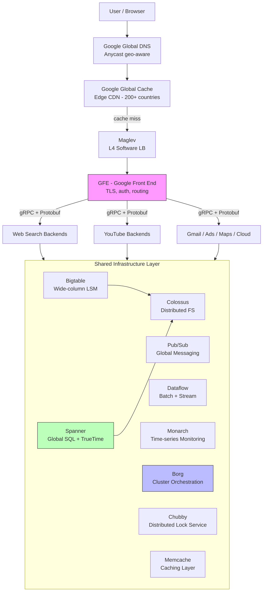
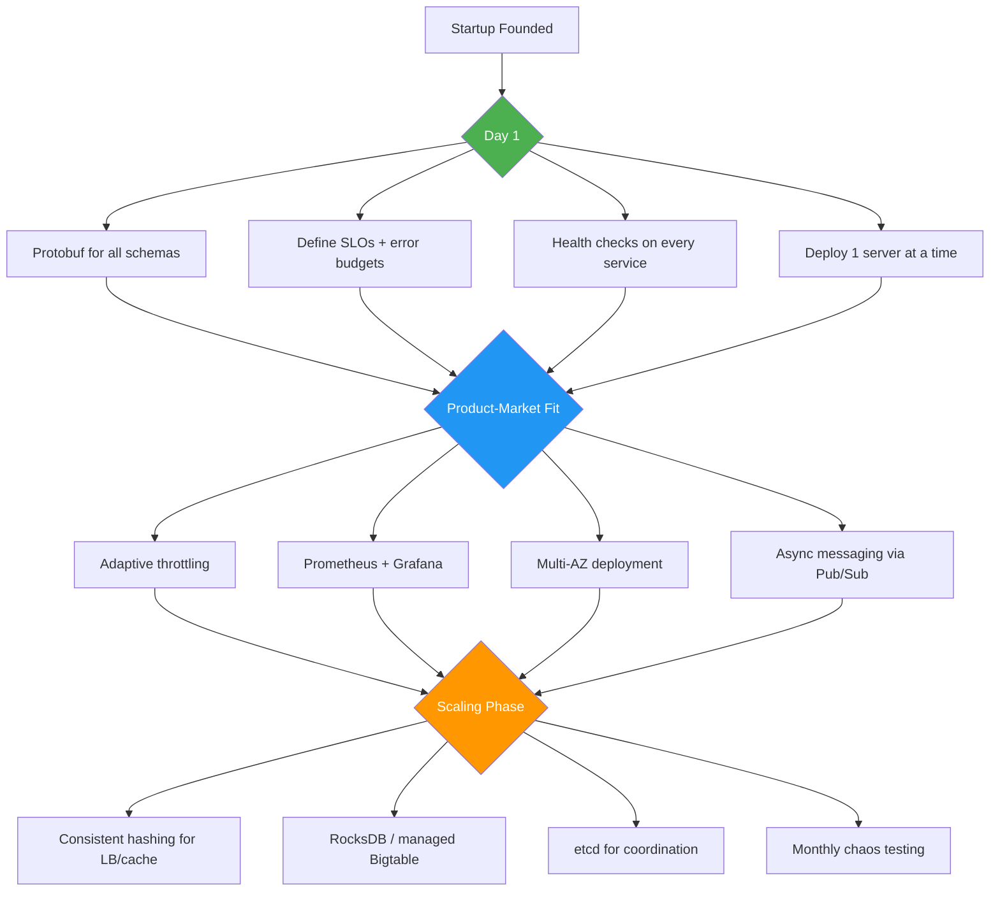

# Google — How Patterns Work in Production

> Serves 8.5B searches/day across millions of machines; built Bigtable, Spanner, Borg, Colossus, Maglev, Monarch, Pub/Sub, Dataflow; open-sourced Kubernetes, gRPC, Protobuf, TensorFlow, Go.

---

## High-Level Architecture

```
                        ┌──────────────────────┐
                        │     User / Browser   │
                        └──────────┬───────────┘
                                   │
                        ┌──────────▼───────────┐
                        │   Google Global DNS   │  Anycast, geo-aware routing
                        │   (returns closest    │  to nearest PoP
                        │    healthy endpoint)  │
                        └──────────┬───────────┘
                                   │
                        ┌──────────▼───────────┐
                        │  Google Global Cache  │  Edge CDN in 200+ countries
                        │  (GGC) — YouTube,    │  (static content served here)
                        │   static assets       │
                        └──────────┬───────────┘
                                   │ cache miss
                                   │
                        ┌──────────▼───────────┐
                        │      Maglev          │  L4 software load balancer
                        │  (consistent hashing, │  per-packet ECMP across
                        │   per-packet LB)      │  backend pool
                        └──────────┬───────────┘
                                   │
                        ┌──────────▼───────────┐
                        │    GFE (Google       │  TLS termination, auth,
                        │    Front End)        │  rate limiting, routing
                        └──────────┬───────────┘
                                   │  Stubby/gRPC + Protobuf
                                   │
              ┌────────────────────┼────────────────────┐
              │                    │                     │
       ┌──────▼──────┐     ┌──────▼──────┐      ┌──────▼──────┐
       │ Web Search  │     │  YouTube    │      │ Gmail/Ads/  │
       │  Backends   │     │  Backends   │      │ Maps/Cloud  │
       └──────┬──────┘     └──────┬──────┘      └──────┬──────┘
              │                   │                     │
              └───────────────────┼─────────────────────┘
                                  │
       ┌──────────────────────────▼──────────────────────────┐
       │              Shared Infrastructure Layer             │
       │                                                      │
       │  ┌───────────┐ ┌──────────┐ ┌───────────────────┐  │
       │  │ Bigtable  │ │ Spanner  │ │ Colossus (GFS v2) │  │
       │  │ (wide-col)│ │ (global  │ │ (distributed FS,  │  │
       │  │ LSM+SST   │ │ SQL+Paxos│ │  erasure coded)   │  │
       │  └───────────┘ └──────────┘ └───────────────────┘  │
       │                                                      │
       │  ┌───────────┐ ┌──────────┐ ┌───────────────────┐  │
       │  │  Pub/Sub  │ │ Dataflow │ │   Monarch         │  │
       │  │ (global   │ │ (batch + │ │   (time-series    │  │
       │  │  messaging│ │  stream) │ │    monitoring)     │  │
       │  └───────────┘ └──────────┘ └───────────────────┘  │
       │                                                      │
       │  ┌───────────┐ ┌──────────┐ ┌───────────────────┐  │
       │  │ Memcache  │ │ Chubby   │ │   Borg            │  │
       │  │ (caching) │ │ (locks/  │ │   (cluster mgmt,  │  │
       │  │           │ │  coord)  │ │    scheduling)     │  │
       │  └───────────┘ └──────────┘ └───────────────────┘  │
       └─────────────────────────────────────────────────────┘
```



---

## Pattern Deep Dives

### 1. LSM Trees + Bloom Filters — Bigtable

> **Vault:** [[03_design_patterns/bloom_filters]] | [[03_design_patterns/database_indexing]]

**The problem:** A database serving petabytes of web index data needs to handle millions of writes per second without destroying disk I/O. Traditional B-trees require random writes to disk for every insert, which is 100x slower than sequential writes on spinning disks and still significantly slower on SSDs.

**How Google implements it:**

Bigtable uses a Log-Structured Merge Tree (LSM Tree) to convert random writes into sequential writes. Every write first goes to an in-memory sorted buffer (MemTable), then periodically flushes to immutable on-disk sorted files (SSTables). Background compaction merges SSTables to keep read amplification bounded.

```
WRITE PATH:
                                                        Colossus
  Client ──► Tablet Server                              (durable storage)
                  │                                         │
                  ├─1─► Commit Log (WAL) ──────────────────►│ (sequential append)
                  │     (write-ahead, sequential)            │
                  │                                         │
                  └─2─► MemTable (in-memory, sorted)        │
                        │                                   │
                        │ (when ~64-200 MB full)            │
                        ▼                                   │
                   Flush to SSTable ────────────────────────►│ (immutable file)
                                                            │
                                                            │
COMPACTION (background):                                    │
                                                            │
  SSTable-0 ─┐                                              │
  SSTable-1 ─┼──► Merge Sort ──► New SSTable ──────────────►│
  SSTable-2 ─┘    (discard      (fewer, larger files)       │
                   deleted/                                  │
                   expired rows)                             │


READ PATH:

  Client ──► Tablet Server
                  │
                  ├─1─► MemTable (check in-memory first)
                  │     Found? Return immediately.
                  │
                  ├─2─► Block Cache (recently read SSTable blocks)
                  │     Found? Return immediately.
                  │
                  └─3─► SSTables (newest to oldest)
                        │
                        For each SSTable:
                        │
                        ├── Check Bloom Filter ──► "Definitely NOT here"
                        │   (probabilistic, ~1% false positive)
                        │   Skip this SSTable entirely ──► next SSTable
                        │
                        └── Bloom says "Maybe here"
                            ├── Check index block ──► binary search
                            └── Read data block ──► return row
```

**Key implementation details:**

- MemTable is a concurrent skip list or red-black tree, allowing lock-free reads during writes
- Each SSTable has a Bloom filter in its metadata block -- typically 10 bits per key gives ~1% false positive rate
- Without Bloom filters, a read for a non-existent key must check ALL SSTables (potentially dozens). With Bloom filters, it skips ~99% of them
- SSTables are immutable -- once written, never modified. This eliminates concurrency issues on reads
- Minor compaction: flush MemTable to SSTable (fast, frequent)
- Major compaction: merge all SSTables into one (slow, infrequent, reclaims space from deletions)
- Bigtable stores SSTables in Google's SSTable file format (64KB blocks, block-level compression, per-block index)

**Real numbers:**
- MemTable size: 64-200 MB before flush
- SSTable block size: 64 KB (configurable)
- Bloom filter: ~10 bits per key, 6-7 hash functions
- Read latency: single-digit ms (p50) on SSD, ~10-20 ms (p99)
- Write throughput: millions of rows/sec per cluster

**Evolution:**
- 2006: Original Bigtable paper described basic LSM with GFS as storage
- 2010+: Moved to Colossus (distributed metadata, erasure coding)
- Added multi-level compaction strategies (leveled vs. size-tiered)
- Added SSD support with tuned compaction to reduce write amplification
- Cloud Bigtable (external) now auto-tunes compaction based on workload patterns

---

### 2. Sharding (Range-Based) — Bigtable Tablet Splitting

> **Vault:** [[03_design_patterns/sharding]]

**The problem:** A single machine cannot hold billions of rows and petabytes of data. You need to distribute data across thousands of machines, but you also need efficient range scans (e.g., "give me all URLs under com.google.maps/*"). Hash-based sharding destroys range scan ability.

**How Google implements it:**

Bigtable uses range-based sharding by row key. The table's key space is divided into contiguous ranges called "tablets." Each tablet is served by exactly one tablet server. When a tablet grows too large (100-200 MB), it splits into two. When a tablet server is overloaded, tablets are moved to less busy servers.

```
KEY SPACE (lexicographic order):
────────────────────────────────────────────────────────────────────────►
"aaa..."              "mmm..."              "sss..."              "zzz..."

 ◄──── Tablet 0 ────► ◄──── Tablet 1 ────► ◄──── Tablet 2 ────►
   Tablet Server A       Tablet Server B       Tablet Server C


TABLET SPLITTING (when Tablet 1 exceeds 200 MB):

BEFORE:
  Tablet Server B
  ┌─────────────────────────────────┐
  │ Tablet 1: "mmm..." → "sss..."  │  250 MB (too large!)
  └─────────────────────────────────┘

AFTER:
  Tablet Server B                Tablet Server D (or B)
  ┌───────────────────┐         ┌───────────────────┐
  │ Tablet 1a:        │         │ Tablet 1b:        │
  │ "mmm..."→"ppp..." │         │ "ppp..."→"sss..." │
  │ ~125 MB           │         │ ~125 MB           │
  └───────────────────┘         └───────────────────┘


METADATA HIERARCHY (3-level B-tree for tablet lookup):

  Root tablet (in Chubby)
       │
       ▼
  METADATA tablets (special Bigtable table)
       │
       ▼
  User tablets (actual data)

  Client caches tablet locations → amortized cost is zero RPCs
  for repeated accesses to the same row range.
```

**Key implementation details:**

- Row keys are sorted lexicographically -- this is why key design matters enormously
- Tablet assignment is managed by the Bigtable master (elected via Chubby)
- Tablet servers do NOT store data locally -- SSTables live on Colossus. This means tablet reassignment is fast (just update metadata, no data movement)
- The METADATA table itself is a Bigtable table, creating a 3-level hierarchy
- Client library caches tablet locations aggressively; 99%+ of reads hit the cache

**The hot tablet problem and mitigations:**

```
BAD KEY DESIGN (monotonic timestamp):
  All writes → same tablet → hot spot!

  Tablet 0          Tablet 1          Tablet 2
  [old data]        [old data]        [ALL NEW WRITES!] ← bottleneck
                                       ↑ ↑ ↑ ↑ ↑ ↑ ↑


GOOD KEY DESIGN (reversed domain + timestamp):
  com.google.maps/2026-02-23  →  maps.google.com/2026-02-23
  com.google.mail/2026-02-23  →  mail.google.com/2026-02-23

  Writes distribute across tablets by domain prefix:
  Tablet 0 (a-g)    Tablet 1 (h-m)    Tablet 2 (n-z)
  [gmail data]       [maps data]        [youtube data]
  balanced!          balanced!          balanced!
```

**Evolution:**
- Original Bigtable (2006): manual tablet management, fixed split thresholds
- Modern Bigtable: automatic load-based splitting and merging, tablet servers report load metrics, master rebalances proactively
- Cloud Bigtable: fully managed, auto-splits based on both size and CPU load

---

### 3. Leader Election + Replication — Spanner (Paxos + TrueTime)

> **Vault:** [[03_design_patterns/leader_election]] | [[03_design_patterns/replication]]

**The problem:** You need a globally distributed SQL database with ACID transactions that work across continents. Without a global ordering of transactions, you get anomalies (stale reads, lost writes). Traditional approaches use either eventual consistency (weak guarantees) or 2PC with locks (terrible latency). You need a way to assign globally meaningful timestamps to transactions.

**How Google implements it:**

Spanner runs Paxos consensus per shard (called a "split"). Each split has replicas across 3-5 zones (which can be different continents). One replica is the Paxos leader (10-second lease). The leader handles all reads and writes for that split. TrueTime provides globally synchronized clocks (GPS + atomic clocks in every DC), giving bounded uncertainty on the current time. This allows Spanner to assign commit timestamps that preserve real-time ordering.

```
SPANNER ARCHITECTURE (single split, 3 zones):

  Zone A (US-East)       Zone B (EU-West)       Zone C (Asia)
  ┌──────────────┐      ┌──────────────┐      ┌──────────────┐
  │  SpanServer  │      │  SpanServer  │      │  SpanServer  │
  │  (LEADER)    │      │  (Follower)  │      │  (Follower)  │
  │              │      │              │      │              │
  │  Paxos Log   │      │  Paxos Log   │      │  Paxos Log   │
  │  Data        │      │  Data        │      │  Data        │
  └──────┬───────┘      └──────┬───────┘      └──────┬───────┘
         │                     │                     │
         │◄────── Paxos consensus (2/3 quorum) ─────►│
         │                     │                     │
  ┌──────▼───────┐      ┌──────▼───────┐      ┌──────▼───────┐
  │  Colossus    │      │  Colossus    │      │  Colossus    │
  └──────────────┘      └──────────────┘      └──────────────┘


TRUETIME:

  Every data center has:
  ┌─────────────────────────────────┐
  │  TrueTime Master               │
  │  ┌──────────┐ ┌──────────────┐ │
  │  │ GPS      │ │ Atomic Clock │ │  (two independent time sources
  │  │ Receiver │ │ (Caesium)    │ │   for fault tolerance)
  │  └──────────┘ └──────────────┘ │
  │                                 │
  │  API: TT.now() → [earliest, latest]                │
  │  Uncertainty: typically 1-7 ms (avg ~4 ms)         │
  └─────────────────────────────────┘


WRITE TRANSACTION WITH TRUETIME:

  Client              Leader (Zone A)         Followers (B, C)
    │                      │                        │
    │── Begin Tx ─────────►│                        │
    │                      │── Acquire locks        │
    │                      │── Execute SQL          │
    │                      │                        │
    │                      │── Pick commit          │
    │                      │   timestamp s           │
    │                      │   s = TT.now().latest   │
    │                      │                        │
    │                      │── Paxos replicate ────►│
    │                      │          (log entry)    │
    │                      │◄── ACK (2/3 quorum) ──│
    │                      │                        │
    │                      │── COMMIT WAIT ──────── │
    │                      │   Wait until           │
    │                      │   TT.now().earliest > s│
    │                      │   (typically ~4 ms)    │
    │                      │                        │
    │◄── Commit OK ────────│                        │
    │   (timestamp = s)    │                        │

  WHY COMMIT WAIT WORKS:
  After waiting, we KNOW that s is in the past.
  Any future transaction will get a timestamp > s.
  Therefore: real-time ordering is preserved.
  This is "external consistency" — stronger than linearizability.
```

**Key implementation details:**

- Paxos leader lease: 10 seconds (leader can serve reads without consensus during lease)
- Leader handles both read-write and strong-read transactions
- Stale reads (bounded staleness) can go to ANY replica -- no Paxos needed, ~1ms latency
- Two-phase commit for cross-shard transactions, with Paxos per shard as participant
- TrueTime uncertainty is kept small by disciplined synchronization -- clocks are corrected every 30 seconds
- If TrueTime uncertainty spikes (e.g., GPS antenna issues), commit latency increases proportionally

**Real numbers:**
- Read latency (same zone, strong): 1-5 ms
- Read latency (stale, any replica): ~1 ms
- Write latency (single shard): 5-10 ms (includes ~4 ms commit wait)
- Write latency (cross-shard): 10-20 ms (2PC over Paxos)
- Availability: 99.999% (five 9s) for multi-region configs
- TrueTime uncertainty: 1-7 ms (typically <4 ms)

**Evolution:**
- 2012: Spanner paper -- focused on KV with external consistency
- 2017: "Spanner: Becoming a SQL System" -- full SQL engine added (query optimizer, distributed joins)
- F1 (Google Ads database) was the first major migration from sharded MySQL to Spanner
- Cloud Spanner (2017): external offering without TrueTime (uses a combination of GPS-disciplined clocks and commit-wait in Google's data centers)

---

### 4. Write-Ahead Log (WAL) — Bigtable + Spanner

> **Vault:** [[03_design_patterns/write_ahead_log]]

**The problem:** If a server crashes after writing to memory but before persisting to disk, data is lost. You need durability without the latency of writing the full data structure to disk on every operation.

**How Google implements it:**

Both Bigtable and Spanner write every mutation to a durable append-only log BEFORE applying it to the in-memory state. On crash recovery, the log is replayed to reconstruct the state. The key insight: appending to a log is a sequential write (fast), while updating a B-tree or SSTable index is a random write (slow).

```
BIGTABLE WAL:

  Write Request
       │
       ▼
  ┌─────────────────────────────────────────────────┐
  │ Tablet Server                                    │
  │                                                  │
  │  Step 1: Append to Commit Log (on Colossus)     │
  │  ┌──────────────────────────────────────────┐   │
  │  │ Commit Log (append-only, sequential)      │   │
  │  │ [op1][op2][op3][op4][NEW OP] ◄── here     │   │
  │  └──────────────────────────────────────────┘   │
  │           │                                      │
  │           │ ACK durability                       │
  │           ▼                                      │
  │  Step 2: Apply to MemTable (in-memory)          │
  │  ┌──────────────────────┐                        │
  │  │ MemTable (sorted)    │                        │
  │  │ key1 → val1          │                        │
  │  │ key2 → val2 (updated)│                        │
  │  │ key3 → val3 (new)    │                        │
  │  └──────────────────────┘                        │
  │           │                                      │
  │           │ Return success to client             │
  └─────────────────────────────────────────────────┘


  CRASH RECOVERY:
  ┌─────────────────────────────────────┐
  │ New Tablet Server starts            │
  │                                     │
  │ 1. Read Commit Log from Colossus    │
  │ 2. Replay all operations since      │
  │    last SSTable flush               │
  │ 3. Rebuild MemTable                 │
  │ 4. Resume serving                   │
  └─────────────────────────────────────┘


SPANNER WAL (Paxos Log):

  The Paxos consensus log IS the WAL.
  Every committed transaction is a Paxos log entry
  replicated to 3-5 nodes before ACK.

  Leader Log:  [T1][T2][T3][T4][T5]...
  Replica Log: [T1][T2][T3][T4][T5]...  (identical via Paxos)
  Replica Log: [T1][T2][T3][T4][T5]...

  Recovery: any replica with a majority of the log
  can become the new leader and reconstruct state.
```

**Key implementation details:**

- Bigtable originally used one commit log per tablet server (not per tablet) -- this reduces the number of file writes but complicates recovery (must sort log entries by tablet during replay)
- Group commit: Bigtable batches multiple writes into a single log append (amortizes fsync cost)
- Spanner's Paxos log provides both durability AND replication in one mechanism -- no separate replication layer needed
- Log truncation: after MemTable flushes to SSTable, the corresponding log segment can be garbage collected

**Real numbers:**
- Bigtable commit log append: sub-millisecond (sequential write to Colossus)
- Spanner Paxos log append: 5-10 ms (includes cross-zone replication)
- Recovery time: seconds to minutes depending on log size since last checkpoint

---

### 5. Cell-Based Architecture — Borg Cells

> **Vault:** [[03_design_patterns/cell_based_architecture]]

**The problem:** If your entire fleet of millions of machines is managed as one unit, a single bad configuration change or software bug can take down everything simultaneously. You need blast radius containment.

**How Google implements it:**

Google partitions its infrastructure into "cells" -- independent clusters of about 10,000 machines each. Each Borg cell has its own BorgMaster (5 Paxos replicas), its own scheduler, and its own set of Borglets. A failure in one cell (bad config, master crash, network partition) does not affect other cells. Services are deployed across multiple cells for redundancy.

```
GOOGLE DATA CENTER REGION:

┌─────────────────────────────────────────────────────────────────┐
│ Region (e.g., us-central1)                                       │
│                                                                   │
│  ┌─────────────────────┐  ┌─────────────────────┐               │
│  │ Borg Cell A         │  │ Borg Cell B         │               │
│  │ ~10,000 machines    │  │ ~10,000 machines    │               │
│  │                     │  │                     │               │
│  │ ┌───────────────┐   │  │ ┌───────────────┐   │               │
│  │ │ BorgMaster    │   │  │ │ BorgMaster    │   │               │
│  │ │ (5x Paxos)    │   │  │ │ (5x Paxos)    │   │               │
│  │ └───────────────┘   │  │ └───────────────┘   │               │
│  │                     │  │                     │               │
│  │ ┌──┐┌──┐┌──┐┌──┐   │  │ ┌──┐┌──┐┌──┐┌──┐   │               │
│  │ │B1││B2││B3││..│   │  │ │B1││B2││B3││..│   │               │
│  │ └──┘└──┘└──┘└──┘   │  │ └──┘└──┘└──┘└──┘   │               │
│  │ 10K Borglets        │  │ 10K Borglets        │               │
│  └─────────────────────┘  └─────────────────────┘               │
│                                                                   │
│  ┌─────────────────────┐  ┌─────────────────────┐               │
│  │ Borg Cell C         │  │ Borg Cell D         │               │
│  │ ~10,000 machines    │  │ ~10,000 machines    │               │
│  │ (same structure)    │  │ (same structure)    │               │
│  └─────────────────────┘  └─────────────────────┘               │
│                                                                   │
│  Total: ~40,000 machines in this region across 4 cells           │
└─────────────────────────────────────────────────────────────────┘


BLAST RADIUS CONTAINMENT:

  Scenario: Bad config push to Cell A's BorgMaster

  Cell A: ██████ DOWN ██████   ← affected (10K machines)
  Cell B: ✓ Running normally   ← unaffected
  Cell C: ✓ Running normally   ← unaffected
  Cell D: ✓ Running normally   ← unaffected

  Impact: 25% of region capacity lost, NOT 100%.
  Services deployed across cells continue serving
  from Cells B, C, D with increased load.


SERVICE DEPLOYMENT ACROSS CELLS:

  Gmail Backend:
  ┌──────────┐  ┌──────────┐  ┌──────────┐
  │ Cell A   │  │ Cell B   │  │ Cell C   │
  │ 500 tasks│  │ 500 tasks│  │ 500 tasks│
  └──────────┘  └──────────┘  └──────────┘
  If Cell A dies → Cells B & C absorb load
  (over-provisioned by design)
```

**Key implementation details:**

- Each cell is completely independent -- its own binary versions, its own monitoring, its own failure domain
- BorgMaster is 5 replicas using Paxos -- survives up to 2 simultaneous machine failures
- Scheduler throughput: ~10,000 tasks/minute per cell
- Priority bands: prod tasks (latency-sensitive) are never preempted by other prod tasks; batch tasks fill gaps and can be preempted
- Utilization: ~60-70% average CPU (industry average 10-20%) thanks to mixing prod + batch workloads

**Kubernetes mapping:**

| Borg Concept | Kubernetes Equivalent |
|---|---|
| Cell | Cluster |
| BorgMaster | kube-apiserver + etcd |
| Borglet | kubelet |
| Alloc | Pod |
| Job | Deployment / StatefulSet |
| Task | Container |
| Priority bands | PriorityClass |

**Evolution:**
- Early Google: single large clusters, frequent blast-radius incidents
- 2003+: Cell architecture introduced with Borg
- 2014: Kubernetes open-sourced -- cells become "clusters"
- 2020: Autopilot paper -- ML-driven resource sizing within cells

---

### 6. Consistent Hashing — Maglev (Minimum Disruption Hashing)

> **Vault:** [[03_design_patterns/consistent_hashing]]

**The problem:** Google's network edge receives millions of packets per second per load balancer machine. You need to distribute traffic across backend servers such that (a) adding/removing a backend disrupts minimal existing connections, and (b) all load balancer machines make the same forwarding decision for the same connection (no shared state between LB machines).

**How Google implements it:**

Maglev is Google's software-defined L4 load balancer. It uses a custom consistent hashing algorithm called "Maglev hashing" that builds a lookup table ensuring minimal disruption when backends change. Unlike ring-based consistent hashing (which can have uneven distribution), Maglev hashing guarantees near-perfect load balance.

```
MAGLEV ARCHITECTURE:

  Internet Traffic
       │
       ▼
  ┌─────────────────────────────────────────┐
  │ Router (ECMP — Equal-Cost Multi-Path)   │
  │ Sprays packets across Maglev machines   │
  └──────┬──────────┬──────────┬────────────┘
         │          │          │
    ┌────▼───┐ ┌────▼───┐ ┌────▼───┐
    │Maglev  │ │Maglev  │ │Maglev  │   Each machine independently
    │Machine │ │Machine │ │Machine │   computes the SAME lookup
    │   0    │ │   1    │ │   2    │   table (no shared state!)
    └────┬───┘ └────┬───┘ └────┬───┘
         │          │          │
         └──────────┼──────────┘
                    │ (all agree on which backend
                    │  handles each connection)
                    ▼
         ┌────────────────────┐
         │  Backend Pool      │
         │  ┌──┐ ┌──┐ ┌──┐   │
         │  │B0│ │B1│ │B2│   │
         │  └──┘ └──┘ └──┘   │
         └────────────────────┘


MAGLEV HASHING (simplified):

  Lookup table size M = 65537 (prime number)

  Step 1: Each backend generates a "preference list"
          (permutation of 0..M-1 based on hash of backend name)

  Backend B0 preference: [3, 0, 4, 1, 2, ...]
  Backend B1 preference: [0, 2, 4, 3, 1, ...]
  Backend B2 preference: [1, 4, 3, 2, 0, ...]

  Step 2: Round-robin fill the lookup table
          Each backend claims its next preferred slot
          if not already taken:

  Table index:  [0]  [1]  [2]  [3]  [4]  ...
  Assigned to:   B1   B2   B1   B0   B0   ...

  Step 3: To route a packet:
          hash(5-tuple) mod M → table index → backend

  Result: Every Maglev machine builds the SAME table
          (deterministic algorithm, same inputs → same output)


BACKEND FAILURE (minimal disruption):

  Before (3 backends):
  Table: [B1, B2, B1, B0, B0, B2, B1, B0, ...]

  After B2 removed (2 backends):
  Table: [B1, B0, B1, B0, B0, B1, B1, B0, ...]
                 ↑              ↑
           Only B2's slots redistributed.
           B0 and B1 slots: ~unchanged.

  Disruption: only 1/N of connections affected
  (where N = number of backends)
```

**Key implementation details:**

- Lookup table size: 65,537 (prime) -- large enough for even distribution, small enough to fit in L3 cache
- Packet processing: entirely in userspace (kernel bypass via DPDK-like technique)
- Line rate: 10 Gbps per Maglev machine (small packets)
- Connection tracking: Maglev maintains a connection table to ensure all packets of a flow go to the same backend, even during table rebuilds
- Health checking: Maglev actively probes backends; unhealthy backends are removed from the lookup table

**Real numbers:**
- Throughput: ~10M packets/second per machine
- Latency added: microseconds (in-memory lookup table)
- Table rebuild time: milliseconds (when backend pool changes)
- Used at every Google data center edge since 2008

**Evolution:**
- Pre-Maglev: hardware load balancers (expensive, limited, hard to program)
- 2008: Maglev deployed, replacing hardware LBs
- 2016: Maglev paper published
- Maglev hashing adopted in open-source projects (e.g., Envoy proxy)

---

### 7. Pub/Sub — Google Cloud Pub/Sub

> **Vault:** [[03_design_patterns/pub_sub]]

**The problem:** At Google's scale, services need to communicate asynchronously. A synchronous call from Ads to Analytics to Billing creates tight coupling -- if any service is down, the whole chain breaks. You need a messaging system that decouples producers and consumers, handles global distribution, and guarantees message delivery.

**How Google implements it:**

Google Cloud Pub/Sub is a global, ordered, exactly-once delivery messaging system. Producers publish messages to "topics," consumers subscribe to topics and receive messages. The system stores messages durably across multiple zones and replays on failure.

```
PUB/SUB ARCHITECTURE:

  Producers                        Consumers
  ┌──────────┐                    ┌──────────┐
  │ Ads Svc  │──publish──┐       ┌──pull/push──│ Analytics │
  └──────────┘           │       │             └──────────┘
  ┌──────────┐           ▼       ▼             ┌──────────┐
  │ Search   │──publish──► TOPIC ◄──subscribe──│ Billing  │
  └──────────┘           │  │    │             └──────────┘
  ┌──────────┐           │  │    │             ┌──────────┐
  │ YouTube  │──publish──┘  │    └──subscribe──│ ML Train │
  └──────────┘              │                  └──────────┘
                            │
               ┌────────────▼────────────────┐
               │    Durable Message Store     │
               │  (replicated across zones)   │
               │                              │
               │  Messages retained until     │
               │  all subscriptions ACK       │
               │  (or TTL expires, default 7d)│
               └──────────────────────────────┘


MESSAGE FLOW:

  Producer                 Pub/Sub                   Consumer
     │                       │                          │
     │── Publish(msg) ──────►│                          │
     │                       │── Store durably          │
     │                       │   (replicate to 3 zones) │
     │◄── ACK ──────────────│                          │
     │                       │                          │
     │                       │── Push or Pull ─────────►│
     │                       │                          │
     │                       │◄── ACK (processed) ─────│
     │                       │                          │
     │                       │── Delete from backlog    │


ORDERING GUARANTEE:

  With ordering key:
  Messages with same ordering key → delivered in publish order
  Messages with different keys → no ordering guarantee (parallel)

  Producer publishes:
  [user_123: event_A] [user_123: event_B] [user_456: event_C]

  Consumer receives:
  event_A before event_B (same ordering key: user_123)  ✓
  event_C can arrive in any order relative to A/B       ✓
```

**Key implementation details:**

- Exactly-once delivery: Pub/Sub deduplicates using message IDs; consumers can enable exactly-once processing with acknowledgment deadlines
- Global by default: a topic in us-central1 can have subscribers in eu-west1 with automatic cross-region message delivery
- Fan-out: one message published once, delivered to ALL subscriptions (1-to-many)
- Backpressure: if a consumer falls behind, messages accumulate in the backlog (retained up to 7 days)
- Dead letter topics: messages that fail processing N times are moved to a dead letter topic for investigation
- Flow control: consumers can limit the number of outstanding (unacked) messages to prevent OOM

**Real numbers:**
- Throughput: millions of messages/second per topic
- Latency: ~10-50 ms (same region), ~100-200 ms (cross-region)
- Message size limit: 10 MB
- Retention: 7 days default, configurable up to 31 days
- Exactly-once dedup window: 10 minutes

**Evolution:**
- Internal: Google's internal event bus predates Cloud Pub/Sub by years
- 2015: Cloud Pub/Sub launched as managed service
- Added ordering keys, exactly-once delivery, schema validation (Avro/Protobuf)
- Integrated with Dataflow for streaming pipelines

---

### 8. Load Shedding + Back Pressure — GFE Progressive Overload Protection

> **Vault:** [[03_design_patterns/back_pressure]]

**The problem:** When traffic spikes beyond capacity (flash mobs, DDoS, cascading failures), a server that tries to handle all requests will become so slow that it effectively handles none. Partial failure is better than total failure.

**How Google implements it:**

Google Front End (GFE) and backend services implement progressive overload protection: a multi-layer defense that gracefully degrades rather than collapsing. The strategy is: shed load early, shed it cheaply, and prioritize the most important traffic.

```
PROGRESSIVE OVERLOAD PROTECTION:

  Incoming Traffic
       │
       ▼
  ┌──────────────────────────────────────────────┐
  │ Layer 1: Maglev (Network Layer)              │
  │ - SYN flood protection                       │
  │ - Per-VIP rate limiting                      │
  │ - Cost: microseconds per packet              │
  └──────────────────────┬───────────────────────┘
                         │
  ┌──────────────────────▼───────────────────────┐
  │ Layer 2: GFE (Application Edge)              │
  │ - Per-user rate limiting (quota system)      │
  │ - Priority classification:                   │
  │   P0: Health checks, internal RPCs           │
  │   P1: Logged-in user requests                │
  │   P2: Anonymous/bot traffic                  │
  │ - If overloaded: drop P2 first, then P1      │
  │ - Return 503 with Retry-After header         │
  │ - Cost: ~1 ms per request                    │
  └──────────────────────┬───────────────────────┘
                         │
  ┌──────────────────────▼───────────────────────┐
  │ Layer 3: Backend Service                     │
  │ - Adaptive throttling (Google SRE book ch21) │
  │                                              │
  │   requests = total incoming                  │
  │   accepts  = requests successfully processed │
  │                                              │
  │   rejection_probability =                    │
  │     max(0, (requests - K * accepts)          │
  │              / (requests + 1))               │
  │                                              │
  │   K = 2.0 (tunable multiplier)               │
  │   When accepts ≈ requests: prob = 0 (normal) │
  │   When accepts << requests: prob → 1 (shed)  │
  │                                              │
  │ - CoDel-inspired queue management            │
  │ - Deadline propagation via RPC context        │
  └──────────────────────────────────────────────┘


BACK PRESSURE VIA gRPC:

  Service A ──RPC──► Service B ──RPC──► Service C
       │                  │                  │
       │                  │                  │ (overloaded!)
       │                  │                  │
       │                  │◄── RESOURCE_     │
       │                  │    EXHAUSTED     │
       │                  │    (gRPC status) │
       │                  │                  │
       │◄── propagate ───│                  │
       │    back pressure │                  │
       │                  │                  │
       │ (reduce request  │                  │
       │  rate or fail    │                  │
       │  fast to caller) │                  │


DEADLINE PROPAGATION:

  Client sets deadline: 500ms
       │
       ▼
  Service A receives at t=0, processes 100ms
  Forwards to B with deadline: 400ms remaining
       │
       ▼
  Service B receives at t=100ms, processes 50ms
  Forwards to C with deadline: 350ms remaining
       │
       ▼
  Service C receives at t=150ms
  If C estimates it needs 400ms → REJECT immediately
  (don't waste resources on a request that will timeout)
```

**Key implementation details:**

- Adaptive throttling uses a sliding window of recent requests vs. accepts
- The K multiplier (default 2.0) means a backend starts rejecting when requests exceed 2x its capacity
- Deadline propagation is built into Stubby/gRPC -- every RPC carries a remaining deadline
- CoDel (Controlled Delay) inspired queue management: if requests are spending too long in queue, start dropping from the front (oldest first -- they're most likely to timeout anyway)
- Criticality levels in RPCs: CRITICAL_PLUS, CRITICAL, SHEDDABLE_PLUS, SHEDDABLE

**Real numbers:**
- GFE can handle 10M+ requests/second per cluster
- Adaptive throttling kicks in within seconds of overload detection
- Recovery time: seconds after traffic subsides (sliding window resets)

---

### 9. Canary Deployments — Progressive Rollouts in Borg

> **Vault:** [[15_intermediate_topics/deployment_strategies]]

**The problem:** Deploying a new binary to thousands of tasks simultaneously is dangerous. A bug in the new version could take down the entire service instantly. You need to catch problems early while affecting the fewest users possible.

**How Google implements it:**

Borg supports progressive rollouts: a new binary version is deployed to a tiny fraction of tasks first, monitored for errors, then gradually expanded. The rollout can be automatically paused or rolled back based on SLO violations.

```
PROGRESSIVE ROLLOUT STAGES:

  Stage 1: CANARY (1 task)
  ┌──────────────────────────────────────────────┐
  │ Cell A: 1000 tasks total                     │
  │                                              │
  │ [v2]  [v1] [v1] [v1] [v1] [v1] ... (999x)  │
  │   ↑                                         │
  │   Canary task — receives ~0.1% of traffic    │
  │                                              │
  │ Monitor for 30 min:                          │
  │ - Error rate delta vs v1                      │
  │ - Latency p50/p99 delta vs v1                │
  │ - Resource usage (CPU/RAM) delta              │
  │ - Custom health signals                       │
  └──────────────────────────────────────────────┘
         │
         │ Pass? → Continue. Fail? → Auto-rollback
         ▼
  Stage 2: SMALL PERCENTAGE (1% = 10 tasks)
  ┌──────────────────────────────────────────────┐
  │ [v2] [v2] [v2] ... (10x)  [v1] ... (990x)  │
  │                                              │
  │ Monitor for 1 hour                           │
  └──────────────────────────────────────────────┘
         │
         ▼
  Stage 3: MEDIUM PERCENTAGE (10% = 100 tasks)
  ┌──────────────────────────────────────────────┐
  │ [v2] ... (100x)  [v1] ... (900x)            │
  │                                              │
  │ Monitor for 2 hours                          │
  └──────────────────────────────────────────────┘
         │
         ▼
  Stage 4: FULL ROLLOUT (100%)
  ┌──────────────────────────────────────────────┐
  │ [v2] [v2] [v2] [v2] [v2] [v2] ... (1000x)  │
  │                                              │
  │ Rollout complete. Old version drained.       │
  └──────────────────────────────────────────────┘


AUTO-ROLLBACK TRIGGER:

  Monitoring System (Monarch)
       │
       │ Detect: error rate increased 2x
       │ at Stage 2 (10 tasks on v2)
       │
       ▼
  ┌─────────────────────────┐
  │ ROLLBACK INITIATED      │
  │                         │
  │ 1. Stop draining v1     │
  │ 2. Restart v2 tasks     │
  │    with v1 binary       │
  │ 3. Alert on-call SRE    │
  │ 4. Log rollback reason  │
  └─────────────────────────┘
```

**Key implementation details:**

- Canary comparison is done against a baseline (running v1 tasks), not against historical data -- this eliminates seasonal/time-of-day confounders
- Rollouts respect cell boundaries: deploy to one cell first, then expand to other cells
- Bake time between stages is configurable per service (critical services use longer bake times)
- Rollout configuration is declarative (specify stages, thresholds, bake times in a config file)
- Emergency rollouts can skip stages (with explicit approval)

**Real numbers:**
- Typical rollout duration: 2-24 hours for a critical Google service
- Canary stage: 30 minutes minimum
- Automated rollbacks catch ~90% of bad deployments before user impact
- Google deploys thousands of binary updates per day across all services

---

### 10. Health Checks + Service Discovery — Borg Naming Service (BNS)

> **Vault:** [[02_building_blocks/service_discovery]]

**The problem:** With millions of tasks across thousands of machines, how does Service A find Service B? IP addresses change constantly as tasks are rescheduled, machines fail, and cells rebalance. You need a dynamic directory that is always current.

**How Google implements it:**

Borg Naming Service (BNS) provides service discovery for all Borg tasks. Every task gets a BNS address of the form `/bns/<cell>/<user>/<job>/<task>`. Clients resolve BNS names to IP:port tuples. Health checks (liveness and readiness probes) ensure only healthy tasks appear in the directory.

```
BNS RESOLUTION:

  Client wants to call: /bns/cell-a/gmail/frontend/0

  ┌──────────┐     ┌────────────────────┐     ┌──────────────┐
  │  Client  │────►│  BNS Resolver      │────►│  Borg Cell A │
  │          │     │  (cached locally)  │     │  BorgMaster  │
  │          │     │                    │     │  knows all   │
  │          │     │  Returns:          │     │  task→IP     │
  │          │     │  10.0.1.42:8080    │     │  mappings    │
  └──────────┘     └────────────────────┘     └──────────────┘


HEALTH CHECK FLOW:

  ┌──────────────────────────────────────────────┐
  │ Borglet (per-machine agent)                  │
  │                                              │
  │  For each task on this machine:              │
  │                                              │
  │  ┌────────────────────────────┐              │
  │  │ Task (container)           │              │
  │  │                            │              │
  │  │ Liveness Probe:            │              │
  │  │ - HTTP GET /healthz        │              │
  │  │ - or TCP connect           │              │
  │  │ - or exec command          │              │
  │  │                            │              │
  │  │ Readiness Probe:           │              │
  │  │ - HTTP GET /readyz         │              │
  │  │ - Determines if task       │              │
  │  │   should receive traffic   │              │
  │  └────────────────────────────┘              │
  │       │                                      │
  │       │ Health status                        │
  │       ▼                                      │
  │  ┌────────────────────────────┐              │
  │  │ Report to BorgMaster       │              │
  │  │                            │              │
  │  │ Healthy + Ready → in BNS   │              │
  │  │ Healthy + Not Ready → out  │              │
  │  │ Unhealthy → restart task   │              │
  │  └────────────────────────────┘              │
  └──────────────────────────────────────────────┘


SERVICE DISCOVERY IN PRACTICE:

  Service A needs Service B (across cells):

  /bns/cell-a/search/indexer/*  →  [10.0.1.1:8080, 10.0.1.2:8080, ...]
  /bns/cell-b/search/indexer/*  →  [10.0.2.1:8080, 10.0.2.2:8080, ...]

  Client-side load balancing (in Stubby/gRPC):
  - Round-robin across healthy endpoints
  - Weighted by observed latency
  - Avoid overloaded backends (subsetting)
```

**Key implementation details:**

- BNS is integrated into the gRPC/Stubby name resolution system -- applications just use BNS paths, not IP addresses
- Health check intervals: typically every 10-30 seconds
- Task restart policy: configurable (always restart, restart on failure, never restart)
- Draining: before shutting down a task, it is first removed from BNS (stops receiving new traffic), then given a grace period to finish in-flight requests

**Kubernetes mapping:**
- BNS = kube-dns / CoreDNS + Endpoints
- Liveness probe = livenessProbe
- Readiness probe = readinessProbe
- Borglet health check = kubelet health check

---

### 11. Autoscaling — Borg Autopilot (ML-Driven Resource Prediction)

> **Vault:** (no dedicated vault note yet)

**The problem:** Engineers are terrible at estimating resource needs. They over-provision (wasting money) or under-provision (causing OOMs and CPU throttling). Manual tuning does not scale when you have millions of jobs.

**How Google implements it:**

Borg Autopilot (2020 paper) uses machine learning to predict resource usage and automatically adjust CPU and memory limits for Borg tasks. It observes historical usage patterns, detects trends, and recommends (or auto-applies) new resource limits.

```
AUTOPILOT ARCHITECTURE:

  ┌───────────────────────────────────────────────────────┐
  │  Monarch (Monitoring)                                  │
  │  Collects per-task metrics:                            │
  │  - CPU usage (1-min avg, peak)                         │
  │  - Memory usage (RSS, peak)                            │
  │  - OOM kills, CPU throttle events                      │
  └────────────────────────┬──────────────────────────────┘
                           │
  ┌────────────────────────▼──────────────────────────────┐
  │  Autopilot Recommender                                 │
  │                                                        │
  │  Input: 14 days of usage history per task class        │
  │                                                        │
  │  Model:                                                │
  │  - Sliding window of peak usage                        │
  │  - Add safety margin (e.g., 15% for CPU, 5% for mem)  │
  │  - Account for diurnal patterns (day vs night)         │
  │  - Account for weekly patterns (weekday vs weekend)    │
  │                                                        │
  │  Output: recommended CPU/memory limits                 │
  └────────────────────────┬──────────────────────────────┘
                           │
  ┌────────────────────────▼──────────────────────────────┐
  │  Autopilot Actuator                                    │
  │                                                        │
  │  Mode 1: RECOMMEND ONLY                                │
  │  - Show recommendations in dashboard                   │
  │  - Engineer decides                                    │
  │                                                        │
  │  Mode 2: AUTO-APPLY                                    │
  │  - Gradually adjust limits (no sudden changes)         │
  │  - Roll back if OOM rate increases                     │
  │  - Respect minimum limits set by engineers             │
  └───────────────────────────────────────────────────────┘


BEFORE AUTOPILOT:
  ┌──────────────────────────────────────────┐
  │ Engineer requests: 4 CPU, 8 GB RAM       │
  │ Actual usage:      0.5 CPU, 2 GB RAM     │
  │ Waste:             87.5% CPU, 75% RAM    │
  └──────────────────────────────────────────┘

AFTER AUTOPILOT:
  ┌──────────────────────────────────────────┐
  │ Autopilot sets: 0.7 CPU, 2.3 GB RAM     │
  │ Actual usage:   0.5 CPU, 2 GB RAM       │
  │ Safety margin:  40% CPU, 15% RAM         │
  │ Waste reduced:  from 80%+ to ~20%        │
  └──────────────────────────────────────────┘
```

**Key implementation details:**

- Autopilot handles 96% of all Borg jobs at Google (as of the 2020 paper)
- Memory recommendations are conservative (OOM kills are more damaging than CPU throttling)
- Vertical scaling (changing limits in place) is preferred over horizontal scaling (adding more tasks) for efficiency
- Autopilot also handles "spike detection" -- if a task shows periodic spikes, the limit is set to cover the spike, not the average

**Real numbers:**
- Reduced resource waste by 23% for CPU and 36% for memory across Google
- OOM kill rate: kept below 0.1% (same as manual tuning)
- Recommendation latency: updated every few hours (not real-time)
- Adoption: 96% of Borg jobs use Autopilot

---

### 12. Chaos Engineering — DiRT (Disaster Recovery Testing)

> **Vault:** [[15_intermediate_topics/chaos_engineering]]

**The problem:** You cannot know if your failover works until it actually fails. But waiting for real failures to test your recovery is irresponsible. You need to deliberately inject failures in production to find weaknesses before they cause real outages.

**How Google implements it:**

DiRT (Disaster Recovery Testing) is Google's annual (and increasingly continuous) program of deliberately injecting failures into production systems. Teams simulate data center failures, network partitions, storage outages, and dependency losses to verify that services degrade gracefully.

```
DIRT TEST SCENARIOS:

  Scenario 1: DATA CENTER FAILURE
  ┌────────────────────────────────────────────┐
  │  Simulate: us-central1 goes completely     │
  │  offline (network cut, power loss)          │
  │                                             │
  │  Test: Does traffic automatically failover  │
  │  to us-east1 and eu-west1?                  │
  │                                             │
  │  Measure:                                   │
  │  - Failover time (target: <30 seconds)      │
  │  - Error rate during failover               │
  │  - Data loss (should be zero for Spanner)   │
  │  - Capacity of remaining DCs                │
  └────────────────────────────────────────────┘

  Scenario 2: DEPENDENCY FAILURE
  ┌────────────────────────────────────────────┐
  │  Simulate: Bigtable cluster unreachable    │
  │  for 10 minutes                            │
  │                                            │
  │  Test: Does the service:                   │
  │  - Serve from cache? (graceful degradation)│
  │  - Return partial results?                 │
  │  - Show a useful error page?               │
  │  - NOT cascade failure to other services?  │
  └────────────────────────────────────────────┘

  Scenario 3: NETWORK PARTITION
  ┌────────────────────────────────────────────┐
  │  Simulate: Partition between Zone A and    │
  │  Zone B within a region                    │
  │                                            │
  │  Test: Does Spanner (Paxos) correctly      │
  │  elect a new leader in the majority        │
  │  partition? Do clients retry to the        │
  │  correct zone?                             │
  └────────────────────────────────────────────┘


DIRT PROGRAM STRUCTURE:

  ┌─────────────────────────────────────────────────┐
  │  Annual DiRT Week                                │
  │                                                  │
  │  Day 1: Tabletop exercises (discuss scenarios)   │
  │  Day 2: Small injection tests (single service)   │
  │  Day 3: Cross-service dependency failures        │
  │  Day 4: Multi-region failure simulation          │
  │  Day 5: Full data center evacuation drill        │
  │                                                  │
  │  After each test:                                │
  │  - Blameless postmortem                          │
  │  - Action items tracked to completion            │
  │  - Repeat next quarter if failures found         │
  └─────────────────────────────────────────────────┘
```

**Key implementation details:**

- DiRT tests run in PRODUCTION (not staging) -- the whole point is to test real systems with real traffic
- Tests are coordinated with on-call teams (who know a test is happening) but the specific timing may be a surprise
- "Big red button" to abort a test if it causes unexpected user-facing impact
- Failure injection tools: network-level (drop packets between zones), process-level (kill tasks), storage-level (make Colossus return errors)
- Results feed into SLO/error budget calculations

**Key findings from DiRT over the years:**
- Discovered that many services had "hardcoded" IP addresses instead of using BNS -- failover did not work
- Found that some monitoring dashboards themselves depended on the systems they were monitoring (monitoring blackout during the outage)
- Revealed that manual runbooks were often outdated and contained incorrect steps

---

## Pattern Summary

| # | Pattern | Where at Google | Key Insight |
|---|---------|-----------------|-------------|
| 1 | LSM Trees + Bloom Filters | Bigtable read/write path | Convert random writes to sequential; skip 99% of irrelevant SSTables on read |
| 2 | Sharding (Range-Based) | Bigtable tablet splitting | Range-based enables scans but requires careful key design to avoid hot spots |
| 3 | Leader Election + Replication | Spanner Paxos per shard + TrueTime | Paxos for consensus + hardware clocks for global timestamp ordering |
| 4 | Write-Ahead Log | Bigtable commit log, Spanner Paxos log | Durability via sequential append; Spanner unifies WAL and replication log |
| 5 | Cell-Based Architecture | Borg cells (10K machines) | Independent failure domains; bad config in one cell cannot affect others |
| 6 | Consistent Hashing | Maglev minimum disruption hashing | Lookup table (not ring) gives perfect balance; fits in L3 cache |
| 7 | Pub/Sub | Cloud Pub/Sub (global, ordered) | Decouple producers/consumers; exactly-once with ordering keys |
| 8 | Load Shedding + Back Pressure | GFE progressive overload | Shed cheaply at edge; adaptive throttling formula in backends |
| 9 | Canary Deployments | Borg progressive rollouts | 1 task → 1% → 10% → 100% with automated rollback on SLO violation |
| 10 | Health Checks + Service Discovery | BNS + Borglet probes | Dynamic directory of healthy tasks; integrated into gRPC resolution |
| 11 | Autoscaling | Borg Autopilot (ML-driven) | ML predicts resource needs; reduced waste 23% CPU, 36% memory |
| 12 | Chaos Engineering | DiRT (Disaster Recovery Testing) | Test failover in production annually; found hardcoded IPs, stale runbooks |

### Additional patterns present but not deep-dived:

| Pattern | Where at Google | One-liner |
|---------|-----------------|-----------|
| Circuit Breaking | Stubby/gRPC | Exponential backoff + jitter on RPC failures; prevents cascading retries |
| Rate Limiting | GFE, Cloud APIs | Per-user per-API quotas; token bucket at edge, adaptive in backend |
| Database Indexing | Spanner secondary indexes | Global and local secondary indexes; interleaved tables for locality |
| MapReduce Pattern | Flume/Dataflow | Replaced by DAG-optimized Flume; unified batch+stream in Dataflow |
| Erasure Coding | Colossus | Reed-Solomon ~1.5x overhead vs. 3x replication; replaced GFS |
| Bin Packing | Borg scheduler | Feasibility check + scoring; priority bands enable 60-70% utilization |
| Caching | Memcache layer | In-memory cache in front of Bigtable/Spanner; per-cell deployment |

---

## Failure Stories

### 1. GFS Single-Master Bottleneck → Built Colossus

> **Lesson: Single points of coordination become single points of failure at scale**

The original Google File System (2003) had a single master node that held all metadata in memory. This worked when Google's data was in the terabyte range. By 2008-2009, data had grown to exabytes. The single master's memory could not hold all chunk metadata. Worse, garbage collection pauses in the master process caused cascading stalls across all GFS clients (Bigtable, MapReduce, everything).

**Fix:** Colossus (GFS v2, deployed ~2010) distributed the metadata layer across a Bigtable-based metadata service. No single master. Also replaced 3x replication with erasure coding (Reed-Solomon), cutting storage overhead from 200% to ~50%.

**Pattern lesson:** This is why [[03_design_patterns/cell_based_architecture]] and distributed coordination matter. A single-master design is fine at small scale but becomes a liability at hyperscale.

### 2. Bigtable Hot Tablet Problem

> **Lesson: Your sharding strategy is only as good as your key design**

Multiple Google teams discovered that using monotonically increasing row keys (timestamps, auto-increment IDs) caused all writes to hit the last tablet in the key range. This single tablet became a bottleneck while thousands of other tablets sat idle.

**Fix:** Key design best practices became mandatory in Google's Bigtable documentation:
- Reverse domain names: `com.google.maps/page1` → `maps.google.com/page1`
- Hash-prefix timestamps: `sha1(user_id)[0:4] + timestamp`
- Salted keys for write-heavy workloads

**Pattern lesson:** Range-based [[03_design_patterns/sharding]] gives you scans but demands thoughtful key design. This is the #1 Bigtable interview topic.

### 3. Google Cloud Outage (June 2022)

> **Lesson: Cascading failures across seemingly independent systems**
> See: [[09_real_outages/google_cloud_outage_2022]]

A combination of Cloud SQL provisioning issues and network control plane problems caused widespread failures across multiple Google Cloud regions. Services that depended on Cloud SQL for metadata/config were affected even if they did not directly use Cloud SQL for user data.

**Fix:** Improved dependency isolation, circuit breakers for control plane operations, and faster automated rollback of configuration changes.

**Pattern lesson:** [[03_design_patterns/back_pressure]] and circuit breaking must be applied to control plane paths, not just data plane.

---

## Interview Quick Reference

| If asked about... | Cite Google's... | Key pattern |
|---|---|---|
| Design a key-value store | Bigtable (LSM tree, MemTable → SSTable, Bloom filters, tablets) | LSM Trees + Sharding — [[05_case_studies/design_key_value_store]] |
| Design a globally consistent database | Spanner (Paxos per shard, TrueTime commit-wait) | Leader Election + Replication |
| Design a web crawler | GFS/Colossus for storage + Bigtable for URL frontier + MapReduce for processing | Sharding + Pub/Sub — [[05_case_studies/design_web_crawler]] |
| Design a load balancer | Maglev (consistent hashing, userspace packet processing, ECMP) | Consistent Hashing |
| Design a container orchestrator | Borg (cells, BorgMaster, Borglet, priority bands, bin packing) | Cell Architecture + Health Checks |
| Design a pub/sub system | Cloud Pub/Sub (topics, subscriptions, ordering keys, exactly-once) | Pub/Sub |
| Design a monitoring system | Monarch (time-series DB, inspired Prometheus via Borgmon) | Sharding + Replication |
| How to handle overload | GFE progressive overload + adaptive throttling formula | Load Shedding + Back Pressure |
| How to deploy safely | Borg canary → percentage rollout with auto-rollback | Canary Deployments |
| How to handle failures in prod | DiRT (chaos engineering) + SLO error budgets + blameless postmortems | Chaos Engineering |

**For Google-specific interview prep:** [[17_company_interview_guide/google]]

---

## Startup Playbook — What to Steal from Google

### Steal Immediately (Day 1)

**1. Protocol Buffers for schema evolution**

Every API contract, every event schema, every RPC definition should use Protobuf (or Avro/Thrift). Do NOT use raw JSON between services.

```protobuf
// schema.proto — backward compatible from day 1
syntax = "proto3";

message UserEvent {
  string user_id = 1;
  string event_type = 2;
  int64 timestamp_ms = 3;
  map<string, string> metadata = 4;
  // Field 5 added in v2 — old consumers simply ignore it
  string session_id = 5;
}
```

Why: Google has thousands of teams evolving schemas independently. Protobuf's field numbering means you can add fields without breaking any consumer. JSON schemas break silently.

**2. SLO/Error Budgets (from Google SRE book)**

Define your reliability target. Measure it. When you exceed your error budget, freeze features and fix reliability.

```
SLO: 99.9% availability (43.8 minutes downtime/month)

This month:
  Total requests:   10,000,000
  Failed requests:      5,000
  Success rate:     99.95%
  Error budget used:    50% (0.05% of 0.1% budget)
  Status: GREEN — safe to ship features
```

**3. Progressive rollouts**

Even with 2 servers, deploy to 1 first, wait 5 minutes, then deploy to the other. Set up a basic health check that gates the rollout.

### Steal at PMF Stage

**4. Adaptive throttling formula**

Copy this directly from the Google SRE book (Chapter 21):

```python
import random

class AdaptiveThrottler:
    def __init__(self, k=2.0, window_seconds=120):
        self.k = k
        self.requests = 0    # total incoming in window
        self.accepts = 0     # successfully processed in window

    def should_reject(self):
        rejection_prob = max(0,
            (self.requests - self.k * self.accepts) /
            (self.requests + 1)
        )
        return random.random() < rejection_prob
```

**5. Structured logging + monitoring (Monarch-inspired)**

Use Prometheus (directly inspired by Google's Borgmon) for metrics. Define the four golden signals: latency, traffic, errors, saturation.

**6. Cell-based thinking (even at small scale)**

Run services across 2+ availability zones from the start. Each AZ is a "cell." If one AZ fails, traffic shifts to the other.

### Steal When Scaling

**7. Maglev-inspired consistent hashing**

When you need a load balancer or distributed cache, use Maglev hashing (or ketama/jump hash) instead of naive modulo. Libraries exist in every language.

**8. LSM-tree storage (use existing implementations)**

Use RocksDB (Facebook's LSM engine, based on Google's LevelDB) for local storage. Use managed Bigtable or DynamoDB (AWS equivalent) for distributed storage.

**9. Paxos/Raft-based coordination**

Use etcd (Raft-based, from the Kubernetes ecosystem) for leader election, distributed locks, and service discovery. Do NOT build your own consensus.

**10. DiRT-inspired chaos testing**

Run monthly "game days" where you kill a random service in production and verify the system recovers. Start simple: kill one pod, observe.

### What NOT to Steal

| Google Thing | Why Not | What to Use Instead |
|---|---|---|
| TrueTime (GPS + atomic clocks) | Requires custom hardware in every DC; $millions | Use NTP + logical clocks; accept ~100ms uncertainty |
| Colossus (custom distributed FS) | Requires thousands of machines to justify | Use S3/GCS/Azure Blob (managed object storage) |
| Borg (custom cluster manager) | Kubernetes exists and is literally the open-source version | Use Kubernetes (or ECS/Cloud Run if simpler) |
| Custom RPC framework (Stubby) | gRPC exists and is literally the open-source version | Use gRPC |
| Spanner (build your own) | Requires TrueTime and massive engineering team | Use Cloud Spanner (managed) or CockroachDB |
| Custom monitoring (Monarch) | Prometheus + Grafana cover 95% of use cases | Use Prometheus + Grafana (or Datadog) |

```mermaid
gantt
    title Google Patterns — Startup Adoption Sequence
    dateFormat  X
    axisFormat %s

    section Day 1
    Protobuf schemas             :d1, 0, 1
    SLO / error budgets          :d2, 0, 1
    Progressive rollouts (basic) :d3, 0, 1
    Health checks (HTTP /healthz):d4, 0, 1

    section PMF Stage
    Adaptive throttling          :p1, 1, 2
    Prometheus + 4 golden signals:p2, 1, 2
    Multi-AZ deployment          :p3, 1, 2
    Pub/Sub for async work       :p4, 1, 2

    section Scaling
    Consistent hashing (LB/cache):s1, 2, 3
    LSM storage (RocksDB/managed):s2, 2, 3
    etcd for coordination        :s3, 2, 3
    Chaos testing (monthly)      :s4, 2, 3

    section Never Build
    TrueTime (use NTP)           :crit, n1, 3, 4
    Custom FS (use S3)           :crit, n2, 3, 4
    Custom scheduler (use K8s)   :crit, n3, 3, 4
```





---

## Cross-References

- Google interview preparation: [[17_company_interview_guide/google]]
- Design a key-value store (Bigtable-inspired): [[05_case_studies/design_key_value_store]]
- Design a web crawler (GFS + MapReduce): [[05_case_studies/design_web_crawler]]
- Google Cloud outage analysis: [[09_real_outages/google_cloud_outage_2022]]
- Pattern vault links: [[03_design_patterns/bloom_filters]], [[03_design_patterns/database_indexing]], [[03_design_patterns/sharding]], [[03_design_patterns/leader_election]], [[03_design_patterns/replication]], [[03_design_patterns/write_ahead_log]], [[03_design_patterns/cell_based_architecture]], [[03_design_patterns/consistent_hashing]], [[03_design_patterns/pub_sub]], [[03_design_patterns/back_pressure]], [[15_intermediate_topics/deployment_strategies]], [[02_building_blocks/service_discovery]], [[15_intermediate_topics/chaos_engineering]]

---

## Sources & Further Reading

### Foundational Papers

| Paper | Year | Key Contribution |
|---|---|---|
| The Google File System | 2003 | Single-master distributed FS, append-optimized |
| MapReduce | 2004 | Simplified parallel batch processing |
| Bigtable | 2006 | LSM-tree wide-column store at petabyte scale |
| Chubby | 2006 | Distributed lock service (inspired ZooKeeper) |
| Dremel | 2010 | Interactive columnar analytics (inspired BigQuery) |
| Spanner | 2012 | Global ACID with TrueTime |
| Borg | 2015 | Cluster management at scale (inspired Kubernetes) |
| Maglev | 2016 | Software L4 load balancer with consistent hashing |
| Spanner SQL | 2017 | Full SQL engine on Spanner |
| Zanzibar | 2019 | Global authorization system |
| Autopilot | 2020 | ML-driven resource autoscaling |

### Books

- *Site Reliability Engineering* (free: sre.google/sre-book) -- defines SLOs, error budgets, progressive rollouts
- *The Site Reliability Workbook* (free: sre.google/workbook) -- practical implementation guide
- *Designing Data-Intensive Applications* by Martin Kleppmann -- covers Google systems in context

---

*Last updated: 2026-02-23*
