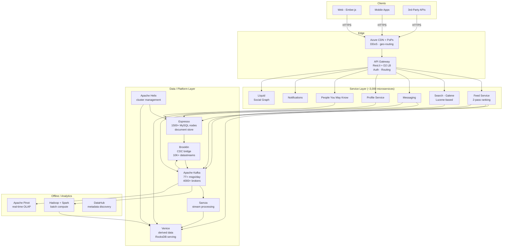
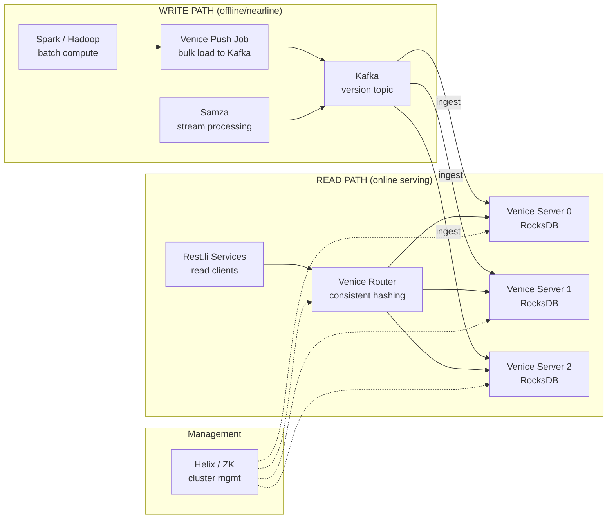
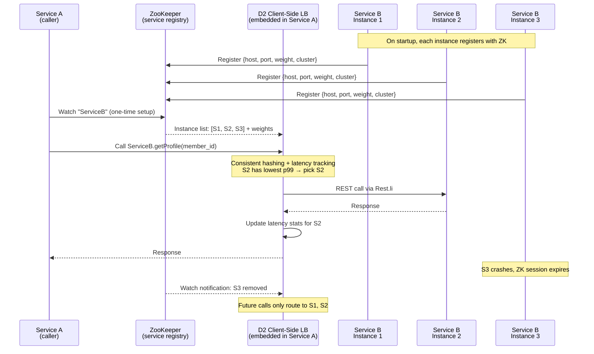

# LinkedIn — How Patterns Work in Production

> 1B+ members, 7T+ Kafka messages/day, 4000+ brokers, 3000+ microservices.
> Key: Kafka (origin), Espresso, Brooklin, Venice, Feed, D2, Helix. Open-source: Kafka, Samza, Rest.li, Venice, Brooklin, DataHub.

---

## High-Level Architecture

```
  ┌──────────────────────────────────────────────────────────────────────────┐
  │                         CLIENT LAYER                                     │
  │   Web (Ember.js)  ·  Mobile (iOS/Android)  ·  3rd-Party API Consumers  │
  │   (HTTPS to edge, push via SSE/WebSocket, tracking pixels)             │
  └──────────────────────────┬───────────────────────────────────────────────┘
                             │  HTTPS
                             ▼
  ┌──────────────────────────────────────────────────────────────────────────┐
  │                      EDGE / GATEWAY LAYER                                │
  │  ┌──────────────────────────────────────────────────────────────────┐   │
  │  │  AZURE CDN + LINKEDIN PoPs                                       │   │
  │  │  DDoS mitigation · geo-routing · TLS termination                │   │
  │  └──────────────────────────────────────────────────────────────────┘   │
  │  ┌──────────────────────────────────────────────────────────────────┐   │
  │  │  API GATEWAY (Rest.li + D2 Service Discovery)                    │   │
  │  │  ┌──────────────┐ ┌───────────────┐ ┌────────────────────────┐ │   │
  │  │  │ Auth + TLS   │ │ Request       │ │ D2 Client-Side LB      │ │   │
  │  │  │ + routing    │ │ validation    │ │ (ZK-backed registry)   │ │   │
  │  │  └──────────────┘ └───────────────┘ └────────────────────────┘ │   │
  │  └──────────────────────────────────────────────────────────────────┘   │
  └──────────────────────────┬─────────────────────────────────────────────┘
                             │
  ┌──────────────────────────▼─────────────────────────────────────────────┐
  │             SERVICE LAYER (~3,000 microservices, Rest.li RPC)          │
  │                                                                        │
  │  ┌──────────────┐  ┌──────────────┐  ┌──────────────┐  ┌───────────┐ │
  │  │   Feed       │  │   Search     │  │  Messaging   │  │  Profile  │ │
  │  │   Service    │  │  (Galene)    │  │   Service    │  │  Service  │ │
  │  │  2-pass rank │  │  Lucene idx  │  │  real-time   │  │  Espresso │ │
  │  └──────┬───────┘  └──────┬───────┘  └──────┬───────┘  └─────┬─────┘ │
  │         │                 │                  │                │       │
  │  ┌──────────────┐  ┌──────────────┐  ┌──────────────┐  ┌───────────┐ │
  │  │  PYMK        │  │  Ads         │  │  Notifications│  │  Graph   │ │
  │  │  (People You │  │  Service     │  │   Service     │  │ (LIquid) │ │
  │  │   May Know)  │  │              │  │               │  │  2nd/3rd │ │
  │  └──────────────┘  └──────────────┘  └──────────────┘  └───────────┘ │
  └──────┬─────────────────┬──────────────────┬────────────────┬──────────┘
         │                 │                  │                │
  ┌──────▼─────────────────▼──────────────────▼────────────────▼──────────┐
  │                      DATA / PLATFORM LAYER                            │
  │                                                                        │
  │  ┌──────────┐ ┌──────────┐ ┌───────┐ ┌─────────┐ ┌──────┐ ┌───────┐ │
  │  │ Espresso │ │  Kafka   │ │Venice │ │Brooklin │ │ Samza│ │Voldem.│ │
  │  │ (doc DB  │ │ 7T+msgs/ │ │derived│ │  CDC    │ │stream│ │  KV   │ │
  │  │  MySQL)  │ │  day     │ │RocksDB│ │ bridge  │ │proc. │ │ store │ │
  │  └──────────┘ └──────────┘ └───────┘ └─────────┘ └──────┘ └───────┘ │
  │                                                                        │
  │  ┌──────────┐ ┌──────────┐ ┌───────┐ ┌─────────┐ ┌────────────────┐  │
  │  │  Helix   │ │  Pinot   │ │Galene │ │ Couchbase│ │  Hadoop/Spark  │  │
  │  │ cluster  │ │ real-time│ │search │ │  cache   │ │  offline       │  │
  │  │  mgmt    │ │  OLAP    │ │ index │ │          │ │  analytics     │  │
  │  └──────────┘ └──────────┘ └───────┘ └─────────┘ └────────────────┘  │
  └──────────────────────────────────────────────────────────────────────────┘
```



---

## Pattern Deep Dives

### 1. Pub/Sub — Kafka Origin Story: Why LinkedIn Built It

> **Vault:** [[03_design_patterns/pub_sub]]

**The problem:** By 2010, LinkedIn had an N-by-M integration nightmare. Every service that
produced data (page views, profile updates, search queries) had point-to-point pipelines
to every consumer (Hadoop, monitoring, search indexing, recommendation engines). Adding a
new consumer meant building a new ETL job. Data freshness ranged from minutes to days.
Activity tracking alone produced billions of events per day. Existing message brokers
(ActiveMQ, RabbitMQ) could not handle LinkedIn's throughput — they were designed for
per-message acknowledgment and complex routing, not raw firehose volume.

**How LinkedIn implements it:**

Jay Kreps, Neha Narkhede, and Jun Rao designed Kafka as a distributed commit log that
traded traditional broker features (per-message acks, complex routing, priority queues)
for sequential disk throughput and horizontal scalability. The name "Kafka" was chosen
because the system is "optimized for writing" — a nod to the author Franz Kafka.

```
  Before Kafka (2009):                     After Kafka (2011+):

  Service A ──→ Hadoop                     Service A ──┐
  Service A ──→ Monitoring                 Service B ──┤
  Service B ──→ Hadoop                     Service C ──┤
  Service B ──→ Search Indexer                         │
  Service C ──→ Hadoop                          ┌──────▼───────┐
  Service C ──→ Monitoring                      │    KAFKA     │
  Service C ──→ Search Indexer                  │ (commit log) │
                                                └──────┬───────┘
  N producers × M consumers = N×M pipes                │
  Every new consumer = new ETL                  ┌──┬───┼───┬──┐
                                                ▼  ▼   ▼   ▼  ▼
                                              Hadoop Monitor Search Rec Samza

                                              N producers + M consumers = N+M pipes
```

```
  Kafka Cluster Internals (LinkedIn scale):

  Producers (services, Brooklin CDC, tracking, Samza)
       │           │           │
       ▼           ▼           ▼
  ┌─────────┐ ┌─────────┐ ┌─────────┐
  │Broker 0 │ │Broker 1 │ │Broker 2 │     4,000+ brokers total
  │ P0-lead │ │ P1-lead │ │ P2-lead │     100+ clusters across DCs
  │ P1-repl │ │ P2-repl │ │ P0-repl │     Replication factor = 3
  │ P2-repl │ │ P0-repl │ │ P1-repl │     min-ISR = 2
  └─────────┘ └─────────┘ └─────────┘
       │           │           │
       └─────┬─────┴─────┬─────┘
             ▼           ▼
     ┌────────────┐ ┌────────────┐
     │ Consumer   │ │ Consumer   │     Tens of thousands of
     │ Group A    │ │ Group B    │     consumer groups
     │ (Samza)    │ │ (Spark)    │
     └────────────┘ └────────────┘
```

**Scale numbers (2024):**

| Metric | Value |
|--------|-------|
| Messages per day | 7+ trillion |
| Clusters | 100+ across multiple data centers |
| Topics | 100,000+ |
| Peak throughput | ~13 million messages/sec (aggregate) |
| Brokers | 4,000+ total |
| Data ingested per day | Multiple petabytes |
| Replication factor | Typically 3 (min-ISR = 2) |
| Consumer groups | Tens of thousands |
| Avg end-to-end latency | < 10 ms (99th percentile within DC) |

**Key implementation details:**

- **Append-only log over message queue:** Sequential disk I/O beats random I/O. The OS
  page cache does the heavy lifting instead of JVM heap management. A single broker can
  sustain GB/s of writes because it is purely sequential append.
- **Consumer-driven pull model:** Consumers track their own offset. This enables replay
  (rewind to any point), independent consumer progress, and eliminates the broker needing
  to track per-consumer state.
- **Zero-copy transfer:** The `sendfile()` syscall moves data directly from disk page
  cache to NIC buffer without copying into user space. This eliminates two memory copies
  and one kernel-user context switch per read.
- **Batching everywhere:** Producers batch records before sending. Brokers batch-write to
  disk (one fsync for many records). Consumers fetch in large batches. Compression (LZ4,
  Snappy) operates on batches, not individual records.
- **Partition-based parallelism:** A topic's partitions are the unit of parallelism.
  Partition count = max consumer parallelism. LinkedIn uses partition keys (e.g.,
  member_id) to guarantee ordering within a partition.
- **No per-message acknowledgment:** Offset-based commits replace per-message acks. A
  consumer commits "I have processed up to offset 42,017" — one write instead of 42,017
  individual acks.

**When to cite in interviews:** Any question about event-driven architecture, decoupling
services, or message broker design. Kafka's origin at LinkedIn is the canonical pub/sub
at-scale story.

---

### 2. Event Sourcing / CDC — Brooklin: LinkedIn's Change Data Capture Bridge

> **Vault:** [[03_design_patterns/event_sourcing]]

**The problem:** LinkedIn runs dozens of heterogeneous data stores (Espresso/MySQL,
Oracle legacy, Voldemort, Venice, Kafka clusters across DCs). When data changes in one
system, downstream systems need to know about it in near-real-time. Before Brooklin,
LinkedIn had Databus (for Oracle/MySQL CDC) and custom Kafka MirrorMaker setups — each
was a separate system to operate and monitor. Cross-DC replication required yet another
tool. The integration surface area was growing quadratically.

**How LinkedIn implements it:**

Brooklin is an open-source distributed streaming bridge that unifies all data movement
into a single framework with pluggable connectors. It captures every mutation as an
ordered, immutable event and delivers it to downstream consumers.

```
  Brooklin Architecture:

  ┌──────────────────────────────────────────────────────────────────┐
  │                    SOURCE SYSTEMS                                │
  │  ┌──────────┐  ┌──────────┐  ┌──────────┐  ┌──────────┐       │
  │  │ Espresso │  │  Oracle  │  │  Kafka   │  │  MySQL   │       │
  │  │ (binlog) │  │(GoldenGt)│  │Cluster A │  │ (binlog) │       │
  │  └────┬─────┘  └────┬─────┘  └────┬─────┘  └────┬─────┘       │
  └───────┼──────────────┼─────────────┼──────────────┼────────────┘
          │              │             │              │
          ▼              ▼             ▼              ▼
  ┌──────────────────────────────────────────────────────────────────┐
  │              BROOKLIN SERVER CLUSTER                             │
  │                                                                  │
  │  ┌────────────┐  ┌────────────┐  ┌────────────┐                │
  │  │ MySQL-CDC  │  │ Oracle-CDC │  │ Kafka      │                │
  │  │ Connector  │  │ Connector  │  │ Mirror     │                │
  │  └────────────┘  └────────────┘  └────────────┘                │
  │                                                                  │
  │  ┌──────────────────────────────────────────────────────┐       │
  │  │  Helix-managed partition assignment                   │       │
  │  │  Checkpointing (binlog offset, Kafka offset)         │       │
  │  │  At-least-once delivery guarantee                    │       │
  │  └──────────────────────────────────────────────────────┘       │
  │                                                                  │
  │  ┌──────────────────────────────────────────────────────┐       │
  │  │  Transport / Producer abstraction layer              │       │
  │  └──────────────────────────────────────────────────────┘       │
  └───────┬──────────────┬─────────────┬──────────────┬────────────┘
          │              │             │              │
          ▼              ▼             ▼              ▼
  ┌──────────────────────────────────────────────────────────────────┐
  │                    DESTINATION SYSTEMS                           │
  │  ┌──────────┐  ┌──────────┐  ┌──────────┐  ┌──────────┐       │
  │  │  Kafka   │  │  Venice  │  │  Kafka   │  │   HDFS   │       │
  │  │ (local)  │  │ (derived)│  │Cluster B │  │ (archive)│       │
  │  └──────────┘  └──────────┘  └──────────┘  └──────────┘       │
  └──────────────────────────────────────────────────────────────────┘
```

**Scale numbers:**

| Metric | Value |
|--------|-------|
| Datastreams managed | 10,000+ |
| Events streamed per day | Trillions (combined with Kafka) |
| Cross-DC mirror throughput | Millions of messages/sec |
| Source systems supported | MySQL binlog, Espresso, Oracle, Kafka |
| Destination systems | Kafka, Espresso, Venice, HDFS |

**Key implementation details:**

- **Connector abstraction:** Adding a new source or destination requires implementing a
  connector interface. The framework handles partitioning, checkpointing, failover, and
  monitoring. This is conceptually similar to Kafka Connect but was built before Connect
  existed.
- **At-least-once delivery:** Brooklin guarantees at-least-once. Consumers must handle
  idempotency. This is a deliberate trade-off — exactly-once across heterogeneous systems
  is impractical; at-least-once with consumer-side dedup is more robust.
- **Checkpointing:** Each connector checkpoints its progress (e.g., MySQL binlog position,
  Kafka offset) to survive restarts without data loss. Checkpoints are stored in ZooKeeper.
- **Elastic partitioning via Helix:** Datastreams are partitioned and distributed across
  Brooklin nodes. Apache Helix manages assignment and rebalancing when nodes join or leave.
- **MySQL binlog as event source:** Espresso's storage layer is MySQL/InnoDB. Brooklin
  reads the MySQL binary log, converts each row mutation into a structured change event,
  and publishes it to Kafka. This is the foundation for all downstream derived data.

**When to cite in interviews:** Any question about CDC, cross-system data synchronization,
or "how do you keep multiple databases in sync?" Brooklin is a production CDC system at
trillion-event scale.

---

### 3. CQRS — Venice: Derived Data Platform with Separate Write/Read Paths

> **Vault:** [[03_design_patterns/cqrs]]

**The problem:** LinkedIn has many use cases where data is computed offline (in Spark or
Hadoop) or via stream processing (Samza), but needs to be served online with low-latency
reads. Examples: "People You May Know" scores, ML feature vectors, ad targeting segments,
search ranking signals. Before Venice, teams loaded derived datasets into Espresso or
Voldemort, but these stores were not optimized for bulk-loading precomputed data. Write
amplification was high, and swapping dataset versions atomically was impossible.

**How LinkedIn implements it:**

Venice is a purpose-built derived data platform that fully separates the write path
(offline/nearline computation + Kafka ingestion) from the read path (RocksDB-backed
low-latency serving). The write and read paths have completely different characteristics,
scaling independently.



**Dual ingestion modes:**

```
  MODE 1: BATCH PUSH (full version swap)
  ┌────────────────────────────────────────────────────────────────┐
  │  Spark job → writes entire dataset → Kafka version topic      │
  │                                                                │
  │  Venice servers consume full version → build new RocksDB SST  │
  │                                                                │
  │  Atomic swap: old version serves reads until new one is ready │
  │  Zero downtime. No partial states visible to readers.         │
  └────────────────────────────────────────────────────────────────┘

  MODE 2: NEARLINE (incremental delta)
  ┌────────────────────────────────────────────────────────────────┐
  │  Samza/Kafka Streams → computes incremental updates           │
  │                                                                │
  │  Venice applies deltas to current version in real-time        │
  │                                                                │
  │  Enables low-latency feature updates for ML models            │
  │  (e.g., update a user's feature vector within seconds)        │
  └────────────────────────────────────────────────────────────────┘
```

**Scale numbers:**

| Metric | Value |
|--------|-------|
| Stores | 1,500+ |
| Read QPS | Millions per second |
| Data served | Hundreds of terabytes (compressed) |
| Batch push frequency | Hourly to daily, depending on dataset |
| Read latency (p99) | < 5 ms |
| Use cases | ML features, PYMK, ad targeting, search ranking |

**Key implementation details:**

- **RocksDB as embedded store:** Optimized for bulk loading (SST file ingestion) and point
  lookups. No separate database process needed — RocksDB runs embedded in the Venice server
  JVM.
- **Version-based atomic swaps:** A new dataset version is built entirely before becoming
  visible to readers. No partial states. Readers see either the old complete version or the
  new complete version, never a mix.
- **Read-compute at serving time:** Venice can evaluate simple expressions (e.g., dot
  products for cosine similarity) at read time. This reduces storage by not materializing
  all possible feature combinations.
- **Kafka as the universal ingestion channel:** Both batch pushes and nearline updates write
  to Kafka topics. Venice servers consume uniformly regardless of the source.
- **CQRS in pure form:** The writer (Spark/Samza) never reads from Venice. The reader
  (online services) never writes to Venice. Write and read paths share zero code, zero
  infrastructure, and zero scaling constraints.

**When to cite in interviews:** Any question about serving precomputed data, feature stores,
or read-heavy workloads with infrequent writes. Venice is a textbook CQRS implementation.

---

### 4. Replication — Espresso: Document Store on MySQL/InnoDB

> **Vault:** [[03_design_patterns/replication]]

**The problem:** LinkedIn needed an online, distributed, fault-tolerant document store to
replace a patchwork of Oracle databases and Voldemort KV stores. The new system needed
secondary indexes, conditional updates, document queries, cross-DC replication, and
automatic failover — all at millions of QPS with sub-5ms latency.

**How LinkedIn implements it:**

Espresso is built on top of MySQL/InnoDB. Each storage node runs a MySQL instance.
LinkedIn gets MySQL's battle-tested storage engine (transactions, crash recovery, B-tree
indexes) while adding distribution, routing, replication management, and a document API
on top. Replication is managed by Apache Helix, not by MySQL's built-in replication.

```
  Espresso Replication Architecture:

  ┌─────────────────────────────────────────────────────────────┐
  │  CLIENT (Rest.li service)                                   │
  └──────────────────────┬──────────────────────────────────────┘
                         │
                         ▼
  ┌─────────────────────────────────────────────────────────────┐
  │  ESPRESSO ROUTER (stateless, D2-discovered)                 │
  │  Routes by partition map from Helix                         │
  │  Writes → master only                                       │
  │  Reads  → master or slave (configurable per-table)          │
  └────────┬─────────────┬──────────────────┬───────────────────┘
           │             │                  │
           ▼             ▼                  ▼
  ┌──────────────┐ ┌──────────────┐ ┌──────────────┐
  │ Storage      │ │ Storage      │ │ Storage      │
  │ Node 0       │ │ Node 1       │ │ Node 2       │
  │ ┌──────────┐ │ │ ┌──────────┐ │ │ ┌──────────┐ │
  │ │ JVM +    │ │ │ │ JVM +    │ │ │ │ JVM +    │ │
  │ │ MySQL    │ │ │ │ MySQL    │ │ │ │ MySQL    │ │
  │ │ (InnoDB) │ │ │ │ (InnoDB) │ │ │ │ (InnoDB) │ │
  │ └──────────┘ │ │ └──────────┘ │ │ └──────────┘ │
  │              │ │              │ │              │
  │ Partitions:  │ │ Partitions:  │ │ Partitions:  │
  │ P0 (master)  │ │ P1 (master)  │ │ P2 (master)  │
  │ P1 (slave)   │ │ P2 (slave)   │ │ P0 (slave)   │
  │ P2 (slave)   │ │ P0 (slave)   │ │ P1 (slave)   │
  └──────┬───────┘ └──────┬───────┘ └──────┬───────┘
         │                │                │
         └────────┬───────┴────────┬───────┘
                  │                │
                  ▼                ▼
  ┌─────────────────────┐  ┌─────────────────────┐
  │  Apache Helix       │  │  Brooklin CDC       │
  │  (ZooKeeper-based)  │  │  (binlog → Kafka)   │
  │  partition map,     │  │  near-real-time      │
  │  master election,   │  │  change stream       │
  │  rebalancing        │  │                      │
  └─────────────────────┘  └─────────────────────┘
```

**Scale numbers:**

| Metric | Value |
|--------|-------|
| Databases on Espresso | 100+ |
| Storage nodes | ~1,500+ MySQL instances |
| QPS | Millions of reads/writes per second |
| Data stored | Hundreds of terabytes |
| Use cases | Member profiles, InMail, notifications, settings |
| Replication | Master-slave per partition; cross-DC async |
| SLA (read p99) | < 5 ms (in-DC) |

**Key implementation details:**

- **MySQL as storage engine, not as distributed database:** LinkedIn does not use MySQL
  replication. Helix manages which node is master for each partition. When a master fails,
  Helix promotes a slave and updates the routing table. This gives LinkedIn control over
  failover semantics that MySQL's built-in replication does not provide.
- **Cross-DC async replication:** Espresso replicates across data centers asynchronously.
  This means a write in DC-West is visible in DC-East after a short delay (typically
  tens of milliseconds). LinkedIn accepts this trade-off for lower write latency.
- **Helix-managed partition map:** The router tier is completely stateless — it reads the
  current partition-to-node mapping from Helix and routes accordingly. Routers can scale
  horizontally without coordination.
- **Binlog-based change capture:** Every write to MySQL generates a binlog entry. Brooklin
  reads the binlog and publishes change events to Kafka, enabling downstream consumers
  (Venice, search indexer, analytics) to react in near-real-time.
- **Schema evolution:** Espresso supports Avro-encoded documents with backward/forward
  compatible schema evolution, avoiding the need for coordinated schema migrations.

**When to cite in interviews:** Any question about building a distributed database on top
of an existing storage engine, or managing replication and failover with an external
coordinator (Helix) rather than consensus-based approaches (Raft/Paxos).

---

### 5. Leader Election — Kafka Partition Leadership and Helix Shard Management

> **Vault:** [[03_design_patterns/leader_election]]

**The problem:** LinkedIn runs two massive distributed systems that need leader election:
Kafka (partition leaders for 100K+ topics) and Espresso (master for each partition across
1,500+ storage nodes). The leader must handle all writes for its partition. If a leader
fails, a new one must be elected quickly without data loss. The two systems have different
leader election mechanisms reflecting their different requirements.

**How LinkedIn implements it:**

```
  KAFKA LEADER ELECTION:
  ┌──────────────────────────────────────────────────────────┐
  │  Topic: "user-activity" (Partition 0)                    │
  │                                                          │
  │  ISR (In-Sync Replica) set = {Broker0, Broker1, Broker2}│
  │  Leader = Broker0                                        │
  │                                                          │
  │  Broker0 crashes:                                        │
  │  1. ZK / KRaft controller detects failure                │
  │  2. Picks new leader from ISR: Broker1                   │
  │  3. Broker1 has ALL committed messages (was in-sync)     │
  │  4. No data loss if unclean.leader.election.enable=false │
  │                                                          │
  │  If ISR = {} (all replicas down):                        │
  │  → Partition UNAVAILABLE until a replica recovers        │
  │  → LinkedIn chose availability sacrifice over data loss  │
  └──────────────────────────────────────────────────────────┘

  ESPRESSO LEADER ELECTION (Helix):
  ┌──────────────────────────────────────────────────────────┐
  │  Resource: "member-profiles" (Partition 7)               │
  │                                                          │
  │  Helix Controller (ZK-based):                            │
  │  1. Defines "ideal state": P7-master=Node3, P7-slave=N5 │
  │  2. Monitors actual state via ZK ephemeral nodes         │
  │  3. Node3 crashes → ZK session expires                   │
  │  4. Controller computes new assignment: P7-master=Node5  │
  │  5. Sends state transition: Node5 SLAVE→MASTER           │
  │  6. Node5 promotes, router gets new partition map         │
  │  7. Failover time: ~seconds                              │
  └──────────────────────────────────────────────────────────┘
```

**Key implementation details:**

- **Kafka ISR-based election:** Only replicas in the In-Sync Replica set are eligible for
  leadership. A replica falls out of ISR if it falls behind the leader by more than
  `replica.lag.time.max.ms`. This ensures the new leader has all committed data.
- **Unclean leader election disabled at LinkedIn:** After a production data loss incident
  (see Failure Stories), LinkedIn sets `unclean.leader.election.enable=false`. If no ISR
  replica is available, the partition becomes unavailable rather than electing an out-of-sync
  replica that would lose messages.
- **Helix external management model:** Unlike Raft/Paxos where nodes elect their own leader,
  Helix uses an external controller. The controller has a global view of all partitions and
  nodes, enabling optimal placement decisions (rack-aware, load-balanced). This is
  LinkedIn's distinctive approach — centralized coordination rather than peer consensus.
- **KRaft migration:** LinkedIn has been migrating Kafka from ZooKeeper-based to KRaft-based
  metadata management. KRaft uses Raft consensus among a set of controller nodes, reducing
  the operational complexity of running separate ZK clusters.

**When to cite in interviews:** Any question about leader election or partition management.
The contrast between Kafka's ISR-based approach and Espresso's Helix-based external
controller is a great discussion point about different leader election strategies.

---

### 6. Sharding — Member-ID Partitioning Across Espresso and Kafka

> **Vault:** [[03_design_patterns/sharding]]

**The problem:** With 1B+ members generating trillions of events, no single machine can
store or process LinkedIn's data. The system must partition data across thousands of nodes
while maintaining locality (all data for one member on the same shard), enabling efficient
lookups, and supporting rebalancing as the cluster grows.

**How LinkedIn implements it:**

LinkedIn uses hash-based sharding with `member_id` as the primary partition key across
both Espresso and Kafka. This ensures that all data for a single member is co-located.

```
  ESPRESSO SHARDING:
  ┌────────────────────────────────────────────────────────────────┐
  │  member_id = 12345                                            │
  │  partition  = hash(12345) % num_partitions                    │
  │             = partition 7                                      │
  │                                                                │
  │  Router lookup: Helix partition map says P7 → Node 3 (master) │
  │  Route request to Node 3                                       │
  │                                                                │
  │  Database layout on Node 3:                                    │
  │  ┌─────────────────────────────────────────────────┐          │
  │  │  MySQL database: member_profiles_p7             │          │
  │  │  Table: documents                               │          │
  │  │  ┌──────────┬────────────────────────┐          │          │
  │  │  │ key      │ value (Avro document)  │          │          │
  │  │  ├──────────┼────────────────────────┤          │          │
  │  │  │ 12345    │ {name: "Alice", ...}   │          │          │
  │  │  │ 67890    │ {name: "Bob", ...}     │          │          │
  │  │  └──────────┴────────────────────────┘          │          │
  │  │  Secondary index on: industry, location         │          │
  │  └─────────────────────────────────────────────────┘          │
  └────────────────────────────────────────────────────────────────┘

  KAFKA SHARDING:
  ┌────────────────────────────────────────────────────────────────┐
  │  Topic: "member-activity" (256 partitions)                     │
  │                                                                │
  │  Producer sends: key=member_id, value=activity_event           │
  │  Partition = hash(member_id) % 256                             │
  │                                                                │
  │  Guarantee: All events for member_id=12345 go to same         │
  │  partition → ordered within that member's stream               │
  │                                                                │
  │  Consumer: each Samza task processes one partition             │
  │  → can build per-member state without cross-partition joins    │
  └────────────────────────────────────────────────────────────────┘
```

**Key implementation details:**

- **Hash-based, not range-based:** LinkedIn uses hash partitioning to avoid hotspots. Range
  partitioning would concentrate all members with IDs 1-1000 on one node, creating uneven
  load. Hash distribution is uniform.
- **Co-located sharding across systems:** Using the same partition key (member_id) and
  compatible partition functions across Espresso and Kafka means that a single member's
  profile data and activity events are processed on related shards, simplifying joins.
- **Rebalancing via Helix:** When adding new Espresso nodes, Helix redistributes partitions
  across the expanded cluster. The partition count stays fixed; partitions move between
  nodes. This avoids the reshuffling problem of naive hash(key) % N.
- **Secondary indexes are local:** Espresso supports secondary indexes, but they are
  partition-local. A query like "find all members in industry=tech" must scatter-gather
  across all partitions. For such queries, LinkedIn uses Galene (search) instead.
- **Kafka partition count is immutable (in practice):** Changing the partition count of a
  Kafka topic would break key-based routing. LinkedIn provisions topics with enough
  partitions upfront (commonly 256 or 512) and does not change them.

**When to cite in interviews:** Any sharding or partitioning question. The co-located
sharding across Espresso and Kafka using the same partition key is a sophisticated pattern
worth discussing.

---

### 7. Back Pressure — Feed System Two-Pass Ranking with Early Termination

> **Vault:** [[03_design_patterns/back_pressure]]

**The problem:** When a member opens the LinkedIn feed, the system must rank content from
a candidate pool of ~100K potential items (posts from connections, followed entities,
trending content, ads). Running the full neural ranking model on 100K items would take
seconds and blow the 200ms latency budget. The system needs to shed load progressively —
a form of back pressure where computational cost is bounded regardless of input size.

**How LinkedIn implements it:**

The feed uses a two-pass ranking pipeline with aggressive early termination at each stage.
This is computational back pressure: each stage limits what flows to the next.

```mermaid
graph TD
    subgraph CandidateGen["Stage 1: Candidate Generation"]
        Net[1st-degree network<br/>connections' posts]
        Second[2nd-degree<br/>PYMK, trending]
        Follow[Followed entities<br/>companies, hashtags]
        Ads[Ad candidates<br/>from ad server]
    end

    subgraph FirstPass["Stage 2: First-Pass Ranking (lightweight)"]
        LR[Logistic Regression / Small NN<br/>Features: author affinity,<br/>content age, engagement rate<br/>~100K candidates → ~500]
    end

    subgraph SecondPass["Stage 3: Second-Pass Ranking (heavy)"]
        DNN[Deep Neural Network<br/>Multi-objective: P(click),<br/>P(like), P(comment), P(share)<br/>~500 candidates → ~50 scored]
    end

    subgraph Assembly["Stage 4: Final Assembly"]
        Div[Diversity injection<br/>max 2 from same author]
        AdsInsert[Ad insertion at<br/>designated positions]
        Policy[Policy filters<br/>spam, low quality, blocked]
        Page[Paginate: ~10-20 items]
    end

    Net & Second & Follow & Ads --> LR
    LR -->|top ~500| DNN
    DNN -->|top ~50| Div
    Div --> AdsInsert --> Policy --> Page
```

```
  Feed Latency Budget Breakdown:

  ┌──────────────────────────────────────────────────────┐
  │  Total budget: < 200ms (p99)                         │
  │                                                      │
  │  Candidate generation:     ~30ms                     │
  │  ├── Network graph lookup (LIquid): ~15ms            │
  │  ├── Feature fetch (Venice): ~5ms                    │
  │  └── Ad candidate fetch: ~10ms                       │
  │                                                      │
  │  First-pass ranking:       ~40ms                     │
  │  ├── Score 100K candidates with lightweight model    │
  │  └── Prune to top ~500                               │
  │                                                      │
  │  Second-pass ranking:      ~80ms                     │
  │  ├── Score ~500 with deep neural net                 │
  │  ├── Multi-objective blending                        │
  │  └── Diversity + business rules                      │
  │                                                      │
  │  Assembly + serialization: ~30ms                     │
  │                                                      │
  │  Headroom for variance:    ~20ms                     │
  └──────────────────────────────────────────────────────┘
```

**Key implementation details:**

- **Fan-out on read (mostly):** LinkedIn uses a hybrid approach but leans toward
  fan-out-on-read. The feed is assembled at request time rather than pre-materialized.
  Only very high-connection members (influencers with millions of followers) get limited
  fan-out-on-write to avoid expensive real-time aggregation.
- **Early termination as back pressure:** If the first-pass model takes too long, the
  system terminates with whatever candidates have been scored so far. A partial ranking of
  300 candidates is better than timing out. This is back pressure: the system degrades
  gracefully under load.
- **Feature store via Venice:** Precomputed member features, content features, and
  author-viewer affinity scores are served from Venice with < 5ms reads. Without this,
  the ranking pipeline would need to compute features on the fly.
- **Diversity constraints:** Hard rules prevent echo chambers: max 2 posts from same author
  per page, mix of content types enforced, time-decay factor prevents resurfacing stale
  content.
- **Timeout cascades prevented:** Each downstream call (graph lookup, feature fetch, ad
  server) has an independent timeout. If the ad server is slow, the feed renders without
  ads rather than failing entirely.

**When to cite in interviews:** Any feed design question, or any question about managing
computational cost in ranking systems. The two-pass pattern with early termination is the
standard approach at scale.

---

### 8. Consistent Hashing — Venice Router Read Distribution

> **Vault:** [[03_design_patterns/consistent_hashing]]

**The problem:** Venice serves millions of read requests per second across hundreds of
storage nodes. The router must distribute reads across replicas of each partition evenly,
handle node failures gracefully (without reshuffling all traffic), and support smooth
scale-up (adding nodes without a thundering herd to new nodes).

**How LinkedIn implements it:**

The Venice router uses consistent hashing to map read requests to storage node replicas.
When a node fails, only the requests that were going to that node are redistributed to
its neighbors on the hash ring — other traffic is unaffected.

```
  Venice Router — Consistent Hashing:

  ┌──────────────────────────────────────────────────────────────┐
  │  Read request: key = "member_12345_features"                 │
  │                                                              │
  │  Step 1: Determine partition                                 │
  │          partition = hash(key) % num_partitions = P7          │
  │                                                              │
  │  Step 2: Find replicas for P7 (from Helix partition map)     │
  │          P7 replicas = {Node-A, Node-B, Node-C}              │
  │                                                              │
  │  Step 3: Consistent hash among replicas                      │
  │          hash(request_id) → position on ring → Node-B        │
  │                                                              │
  │  Step 4: Route to Node-B                                     │
  │          If Node-B is down → next node on ring (Node-C)      │
  └──────────────────────────────────────────────────────────────┘

  Hash Ring for Partition P7:

       Node-A          Node-B          Node-C
         │               │               │
    ─────●───────────────●───────────────●─────── ring
                    ▲
                    │
              hash(request_id)
              lands here → route to Node-B

  If Node-B fails:
    ─────●───────────────╳───────────────●─────── ring
                    ▲
                    │
              hash(request_id)
              Node-B down → route to Node-C (next clockwise)
              Only Node-B's traffic moves; Node-A's traffic unchanged
```

**Key implementation details:**

- **Two-level routing:** First, hash the key to find the partition (standard modular hash).
  Second, consistent-hash among the partition's replicas. This separates partitioning
  (managed by Helix) from load balancing (managed by the router).
- **Virtual nodes:** Each physical node gets multiple positions on the hash ring to ensure
  even distribution. Without virtual nodes, three replicas would divide the ring into
  uneven arcs.
- **Health-aware routing:** The router tracks replica health (latency, error rate). Unhealthy
  replicas are temporarily removed from the ring, redirecting their traffic to healthy
  neighbors.
- **Read affinity:** For batch queries that read many keys from the same partition, the
  router sends all keys to the same replica to maximize cache locality on that node.
- **Thin client vs. fast client:** Venice offers two client modes. The thin client routes
  through a Venice Router (which does the consistent hashing). The fast client embeds
  the routing logic directly, eliminating one network hop.

**When to cite in interviews:** Any question about load balancing reads across replicas or
minimizing redistribution during failures. Venice's two-level routing (partition by key,
then consistent-hash among replicas) is a clean example.

---

### 9. Materialized Views — Venice Precomputed ML Features

> No dedicated vault link. Related: [[03_design_patterns/cqrs]]

**The problem:** LinkedIn's ML models (feed ranking, PYMK, search ranking, ad targeting)
require feature vectors for members and content at inference time. Computing features on
the fly at serving time (querying graphs, aggregating activity, computing embeddings) would
take hundreds of milliseconds — far too slow for a < 200ms feed latency budget. The system
needs precomputed, materialized views of these features.

**How LinkedIn implements it:**

Venice stores are effectively materialized views of Kafka topics. Offline jobs (Spark) and
stream processors (Samza) compute derived datasets and publish them to Kafka. Venice
servers consume these topics and materialize them into RocksDB, serving the result as
low-latency key-value lookups.

```
  Materialized View Pipeline:

  ┌────────────────────────────────────────────────────────────┐
  │  RAW DATA SOURCES                                          │
  │  ┌─────────┐  ┌─────────┐  ┌──────────┐  ┌────────────┐  │
  │  │ Profile │  │Activity │  │ Graph    │  │  Content   │  │
  │  │ changes │  │ events  │  │ edges    │  │  features  │  │
  │  └────┬────┘  └────┬────┘  └────┬─────┘  └─────┬──────┘  │
  └───────┼────────────┼────────────┼───────────────┼─────────┘
          │            │            │               │
          ▼            ▼            ▼               ▼
  ┌────────────────────────────────────────────────────────────┐
  │  COMPUTE LAYER                                             │
  │                                                            │
  │  Spark (batch):                                            │
  │  - Compute PYMK scores for all member pairs                │
  │  - Aggregate 30-day engagement features                    │
  │  - Build author-viewer affinity matrix                     │
  │  - Run hourly / daily                                      │
  │                                                            │
  │  Samza (stream):                                           │
  │  - Update feature vectors incrementally as events arrive   │
  │  - Sliding window aggregations (1hr, 24hr engagement)      │
  │  - Real-time content quality signals                       │
  │  - Latency: seconds                                        │
  └───────────────────────┬────────────────────────────────────┘
                          │
                          ▼
  ┌────────────────────────────────────────────────────────────┐
  │  VENICE (materialized view)                                │
  │                                                            │
  │  Key: member_id or content_id                              │
  │  Value: feature vector (Avro-encoded)                      │
  │                                                            │
  │  Example:                                                  │
  │  key=12345 → {                                             │
  │    "industry_embedding": [0.12, -0.34, ...],               │
  │    "30d_post_count": 7,                                    │
  │    "avg_engagement_rate": 0.034,                           │
  │    "pymk_scores": {67890: 0.87, 11111: 0.72, ...}         │
  │  }                                                         │
  │                                                            │
  │  Served at: < 5ms p99, millions QPS                        │
  └────────────────────────────────────────────────────────────┘
```

**Key implementation details:**

- **Materialized views, not caches:** Venice stores are not caches that can be invalidated.
  They are the single source of truth for derived data. If Venice is down, the features are
  unavailable — there is no "origin" to fall back to. The origin is the computation that
  produced the data.
- **Read-compute for combinatorial features:** Venice supports server-side computation (e.g.,
  dot product of viewer embedding and content embedding) to avoid materializing O(N^2)
  pair-wise features. Only individual embeddings are stored; combinations are computed at
  read time.
- **Freshness trade-offs:** Batch materialized views (Spark) are stale by hours. Nearline
  views (Samza) are stale by seconds. LinkedIn uses both: batch for stable features (industry,
  connections), nearline for volatile features (recent engagement).
- **Schema evolution:** Feature schemas evolve as ML models change. Venice supports
  backward-compatible schema evolution via Avro, so old and new feature formats can coexist
  during model rollouts.

**When to cite in interviews:** Any question about feature stores, precomputed analytics,
or "how do you serve ML features at low latency?" Materialized views via Venice are
LinkedIn's answer.

---

### 10. Service Discovery — D2: Dynamic Discovery + Load Balancing

> **Vault:** [[02_building_blocks/service_discovery]]

**The problem:** With 3,000+ microservices communicating via Rest.li RPC, every service
needs to find and load-balance across instances of every other service it calls. Services
are deployed, scaled, and restarted continuously. Hard-coding service locations is
impossible. A centralized load balancer would be a single point of failure and a latency
bottleneck.

**How LinkedIn implements it:**

D2 (Dynamic Discovery) is LinkedIn's service discovery and client-side load balancing
library. It uses ZooKeeper as a service registry and embeds load balancing logic directly
in the client.



```
  D2 Architecture:

  ┌─────────────────────────────────────────────────────────┐
  │  SERVICE A (caller)                                     │
  │                                                         │
  │  ┌───────────────────────────────────────────────────┐  │
  │  │  D2 Client (embedded library)                     │  │
  │  │                                                   │  │
  │  │  ┌─────────────┐  ┌───────────────────────────┐  │  │
  │  │  │ ZK Watcher  │  │ Load Balancer             │  │  │
  │  │  │ (watches    │  │ ┌───────────────────────┐ │  │  │
  │  │  │  service    │  │ │ Latency-weighted      │ │  │  │
  │  │  │  registry)  │  │ │ Consistent hashing    │ │  │  │
  │  │  │             │  │ │ Degradation detection │ │  │  │
  │  │  │             │  │ │ Circuit breaker       │ │  │  │
  │  │  └─────────────┘  │ └───────────────────────┘ │  │  │
  │  │                   └───────────────────────────┘  │  │
  │  └───────────────────────────────────────────────────┘  │
  └─────────────────────────────────────────────────────────┘
```

**Key implementation details:**

- **Client-side load balancing:** No centralized load balancer. Each caller embeds the D2
  library, which maintains a local copy of the service registry (from ZK watches) and
  makes load balancing decisions locally. This eliminates a network hop and a single point
  of failure.
- **Latency-weighted routing:** D2 tracks response latency for each instance and routes
  more traffic to faster instances. An instance with 2ms p99 gets more requests than one
  with 10ms p99.
- **Degradation detection:** If an instance's error rate or latency exceeds thresholds, D2
  reduces its traffic weight gradually (not abruptly). This avoids thundering herd if an
  instance partially recovers.
- **ZooKeeper as registry:** Each service instance creates an ephemeral ZK node on startup.
  When the instance dies, the ZK session expires, the node disappears, and all watchers
  are notified. This provides automatic deregistration without explicit health checks.
- **Rest.li integration:** D2 is tightly integrated with Rest.li (LinkedIn's REST framework).
  Service discovery, serialization (Avro/JSON), and client-side circuit breakers are all
  handled by the framework.

**When to cite in interviews:** Any service discovery or load balancing question. D2's
client-side approach with ZK watches is a well-proven alternative to centralized load
balancers (like AWS ALB) or sidecar proxies (like Envoy/Istio).

---

### 11. Data Mesh — Decentralized Data Ownership with DataHub

> No dedicated vault link. Related: [[02_building_blocks/service_discovery]]

**The problem:** With 3,000+ microservices and thousands of engineers, centralized data
governance broke down. A central data team could not understand all the datasets, their
lineage, quality, and ownership. Data consumers could not find what data existed or trust
its quality. Teams duplicated datasets because they could not discover existing ones.

**How LinkedIn implements it:**

LinkedIn adopted data mesh principles: domain teams own their data end-to-end (production,
quality, documentation, access). DataHub (open-sourced in 2020) provides the metadata
layer that makes decentralized ownership work.

```
  Data Mesh at LinkedIn:

  ┌────────────────────────────────────────────────────────────────┐
  │                        DATAHUB                                 │
  │              (metadata discovery + governance)                 │
  │                                                                │
  │  ┌──────────┐  ┌──────────┐  ┌──────────┐  ┌──────────┐     │
  │  │ Search   │  │ Lineage  │  │ Schema   │  │ Quality  │     │
  │  │ "find    │  │ "where   │  │ "what    │  │ "is this │     │
  │  │  datasets│  │  does    │  │  fields  │  │  data    │     │
  │  │  by name │  │  this    │  │  exist,  │  │  fresh?" │     │
  │  │  or tag" │  │  data    │  │  what    │  │          │     │
  │  │          │  │  come    │  │  types?" │  │          │     │
  │  │          │  │  from?"  │  │          │  │          │     │
  │  └──────────┘  └──────────┘  └──────────┘  └──────────┘     │
  └──────────────────────┬─────────────────────────────────────────┘
                         │ metadata ingestion
                         │
    ┌────────────────────┼──────────────────────────────┐
    │                    │                              │
    ▼                    ▼                              ▼
  ┌────────────┐   ┌────────────┐              ┌────────────┐
  │ FEED DOMAIN│   │SEARCH DOMAIN│             │ADS DOMAIN  │
  │            │   │             │              │            │
  │ Owns:      │   │ Owns:       │              │ Owns:      │
  │ - feed     │   │ - search    │              │ - ad       │
  │   events   │   │   index     │              │   impressions│
  │ - ranking  │   │ - query     │              │ - targeting│
  │   features │   │   logs      │              │   segments │
  │ - engagement│  │ - typeahead │              │ - campaign │
  │   metrics  │   │   data      │              │   metrics  │
  │            │   │             │              │            │
  │ Published  │   │ Published   │              │ Published  │
  │ as Kafka   │   │ as Kafka    │              │ as Kafka   │
  │ topics +   │   │ topics +    │              │ topics +   │
  │ Venice     │   │ Pinot       │              │ Venice     │
  │ stores     │   │ tables      │              │ stores     │
  └────────────┘   └─────────────┘              └────────────┘
```

**Key implementation details:**

- **Domain ownership:** Each product domain (Feed, Search, Ads, Messaging) owns its
  datasets as "data products" — they are responsible for schema, quality, freshness SLAs,
  and access control. The central data platform team provides infrastructure (Kafka, Venice,
  Spark), not data management.
- **DataHub as the metadata layer:** DataHub indexes metadata from all data systems
  (Kafka topics, Espresso tables, Venice stores, HDFS paths, Pinot tables). Engineers
  search for datasets, view lineage graphs, and check data quality scores.
- **Self-serve data publishing:** Domain teams publish datasets to Kafka with well-defined
  schemas (Avro, enforced by a schema registry). Other teams can discover and consume
  these datasets without bilateral coordination.
- **Lineage tracking:** DataHub automatically tracks where data comes from and where it goes.
  If a Kafka topic is consumed by 12 Samza jobs that write to 5 Venice stores, the full
  lineage graph is visible. This is critical for impact analysis ("if I change this
  schema, who breaks?").
- **Open-sourced:** DataHub was open-sourced in 2020 and is now a widely adopted metadata
  platform beyond LinkedIn.

**When to cite in interviews:** Any question about data governance, data discovery, or
managing data at scale across many teams. Data mesh + DataHub is LinkedIn's answer to
"how do you manage thousands of datasets across thousands of engineers?"

---

## Pattern Summary

| # | Pattern | Where at LinkedIn | Key Detail | Vault Link |
|---|---------|-------------------|------------|------------|
| 1 | **Pub/Sub** | Kafka — 7T+ msgs/day, 4000+ brokers | Append-only log, zero-copy transfer, consumer-driven pull | [[03_design_patterns/pub_sub]] |
| 2 | **Event Sourcing / CDC** | Brooklin — 10K+ datastreams, pluggable connectors | MySQL binlog capture, at-least-once, Helix-managed partitions | [[03_design_patterns/event_sourcing]] |
| 3 | **CQRS** | Venice — batch/nearline writes, RocksDB reads | Spark writes via Kafka, RocksDB serves at < 5ms p99 | [[03_design_patterns/cqrs]] |
| 4 | **Replication** | Espresso — 1500+ MySQL nodes, master-slave | Helix-managed failover, cross-DC async, binlog CDC | [[03_design_patterns/replication]] |
| 5 | **Leader Election** | Kafka ISR + Espresso Helix | ISR-based (Kafka) vs. external controller (Helix) | [[03_design_patterns/leader_election]] |
| 6 | **Sharding** | Espresso + Kafka — member_id partitioning | Hash-based, co-located across systems, Helix rebalancing | [[03_design_patterns/sharding]] |
| 7 | **Back Pressure** | Feed — two-pass ranking pipeline | 100K candidates → 500 → 50, early termination on timeout | [[03_design_patterns/back_pressure]] |
| 8 | **Consistent Hashing** | Venice router — read distribution | Two-level: partition by key, then consistent-hash among replicas | [[03_design_patterns/consistent_hashing]] |
| 9 | **Materialized Views** | Venice — precomputed ML features | Batch (Spark) + nearline (Samza), read-compute for embeddings | — |
| 10 | **Service Discovery** | D2 — client-side LB with ZK registry | Latency-weighted routing, embedded in every service | [[02_building_blocks/service_discovery]] |
| 11 | **Data Mesh** | DataHub — decentralized data ownership | Domain teams own data products, metadata search + lineage | — |

---

## Failure Stories

### 1. The Great Site Outage of 2012 — Cascading Failure

**What happened:** LinkedIn experienced a major outage caused by a cascading failure in
the social graph service. A routine data load caused an unexpected spike in memory usage,
which triggered long GC pauses on multiple JVMs simultaneously. Requests backed up in
queues. Upstream services (Feed, Search, Profile) had no timeout protection — they waited
for the graph service, accumulated their own request queues, and eventually OOMed. Circuit
breakers did not exist yet. The cascade took down the entire site.

**Root cause:** No isolation between services. No load shedding. No circuit breakers. The
graph service's failure propagated upstream through unbounded request queues.

**Fix:**
- **Load shedding:** Services now reject requests when overloaded rather than queuing
  indefinitely. If a service's request queue exceeds a threshold, new requests get an
  immediate 503.
- **Graceful degradation:** The feed shows cached results when the ranking service is slow.
  Search returns approximate results when the graph service is degraded.
- **Circuit breakers in D2:** The D2 client-side library was enhanced with circuit breakers.
  If a downstream service's error rate exceeds a threshold, D2 stops sending traffic and
  returns a fallback response.
- **Game days:** LinkedIn began regular chaos testing — intentionally degrading services in
  production to verify isolation. This predated Netflix's Chaos Monkey by some accounts.

**Lesson:** Cascading failures are the most dangerous failure mode in microservices. Every
service-to-service call needs: (1) a timeout, (2) a circuit breaker, (3) a fallback, and
(4) load shedding. LinkedIn learned all four the hard way.

---

### 2. Kafka Unclean Leader Election Bug — Data Loss in Production

**What happened:** In early Kafka deployments at LinkedIn, a broker crash occurred during
a period when the ISR (In-Sync Replica) set had shrunk to just the leader. The leader
crashed. Kafka's default configuration allowed "unclean" leader election — an out-of-sync
replica was promoted to leader. This replica was missing recent messages. Those messages
were permanently lost. Downstream consumers (analytics, search indexer) processed
incomplete data.

**Root cause:** `unclean.leader.election.enable` was `true` by default. Kafka prioritized
availability over data consistency — if no in-sync replica was available, it would elect
any replica rather than making the partition unavailable.

**Fix:**
- LinkedIn changed the default to `unclean.leader.election.enable=false`. If no ISR
  replica is available, the partition becomes unavailable until one recovers. This is a
  deliberate choice: unavailability is preferable to silent data loss.
- Contributed the `min.insync.replicas` configuration upstream. Writes now fail if the ISR
  count drops below the threshold (typically 2), rather than succeeding to a single replica
  that could lose data on crash.
- Enhanced monitoring: alerts fire when ISR count drops below replication factor, long
  before a data loss scenario becomes possible.

**Lesson:** In distributed systems, the default should be safe, not fast. Availability is
recoverable (retry later). Data loss is not. This incident shaped Kafka's durability
guarantees and influenced the design of `min.insync.replicas`, which is now a standard
production configuration everywhere Kafka is deployed.

---

### 3. Espresso Migration Pain — Oracle to Document Store

**What happened:** When migrating from Oracle to Espresso (2012-2014), LinkedIn discovered
that query patterns that were trivial in Oracle (multi-table JOINs, complex WHERE clauses
with ORs across columns, ad-hoc analytical queries) were impossible in Espresso's
document model. Several teams attempted to migrate their Oracle schemas directly to
Espresso documents and found that their applications broke — queries that took 5ms in
Oracle either did not work or required scatter-gather across all partitions.

**Root cause:** Teams treated Espresso as a drop-in Oracle replacement. Document stores
require data modeling based on access patterns (denormalization), not on relational
normalization theory.

**Fix:**
- LinkedIn mandated a **"Data Modeling Design Review"** before any team could onboard to
  Espresso. The review requires teams to enumerate all access patterns and design their
  document schema to serve those patterns directly.
- Built tooling to analyze Oracle query logs and identify patterns that would not translate
  to Espresso, flagging them before migration.
- For truly relational workloads (complex joins, ad-hoc queries), LinkedIn kept Oracle or
  moved to purpose-built systems (Pinot for analytics, Galene for search).
- Accepted that some denormalization means data duplication. The trade-off (read performance
  + horizontal scalability) was worth it for the vast majority of use cases.

**Lesson:** "Lift and shift" from relational to document stores does not work. The data
model must be redesigned around access patterns, not normalized entities. This is a
universal lesson for any NoSQL migration. LinkedIn's mandatory design review process
prevented many future migration disasters.

---

## Interview Quick Reference

| Question Type | Key Patterns to Cite | LinkedIn-Specific Detail |
|--------------|---------------------|------------------------|
| "Design a news feed" | Pub/Sub, Back Pressure, CQRS, Materialized Views | Two-pass ranking (100K → 500 → 50), Venice feature store, fan-out-on-read, < 200ms budget |
| "Design a notification system" | Pub/Sub, Event Sourcing, Sharding | Kafka event bus, Samza processing, member_id sharding. See [[05_case_studies/design_notification_system]] |
| "Design a messaging system" | Replication, Sharding, Leader Election | Espresso for storage, Helix for failover, Kafka for async delivery |
| "Design a distributed KV store" | Consistent Hashing, Replication, Sharding | Voldemort: consistent hashing, vector clocks, eventual consistency |
| "Design a CDC system" | Event Sourcing, Pub/Sub | Brooklin: pluggable connectors, binlog capture, 10K+ datastreams |
| "Design a search system" | Sharding, Materialized Views | Galene (Lucene-based), partition-per-shard, Venice for ranking features |
| "Design a recommendation engine" | Materialized Views, CQRS, Pub/Sub | PYMK via Venice, graph traversal via LIquid, batch Spark + nearline Samza |
| "Consistency vs. availability?" | Replication, Leader Election | Espresso: cross-DC eventual consistency with causal tokens. Kafka: ISR-based, unclean election disabled. |
| "Design a service discovery system" | Service Discovery | D2: ZK-backed registry, client-side LB, latency-weighted routing |
| "How to handle cascading failures?" | Back Pressure, Circuit Breaker | 2012 outage led to load shedding + D2 circuit breakers + game days |

**What LinkedIn interviewers look for:**
- Deep understanding of distributed systems fundamentals (partitioning, replication, consistency)
- Knowledge of event-driven architecture (Kafka is central to everything at LinkedIn)
- Ability to make trade-offs and articulate why (e.g., availability vs. consistency)
- Understanding of data modeling for different storage engines (document vs. relational)
- Practical failure mode reasoning (not just happy-path design)

**Detailed interview prep:** [[17_company_interview_guide/linkedin_salesforce]]

---

## Startup Playbook — What to Steal from LinkedIn

### Day 1: Kafka as the Central Event Bus

Even at startup scale, use Kafka (or a managed equivalent like Confluent Cloud, AWS MSK,
or Redpanda) as the backbone for all event data. Do not build point-to-point integrations
between services. Every significant event (user signup, content created, payment processed)
goes to Kafka. Consumers subscribe as needed. This gives you replay capability, decoupled
services, and a foundation for analytics from day one.

**Minimal implementation:** A single Kafka cluster (3 brokers) with topics for core events.
One consumer group for real-time processing, one for analytics/warehouse loading.

### Day 1: Client-Side Service Discovery

Use Consul, etcd, or ZooKeeper for service registration. Embed a client-side load balancer
(like gRPC's built-in, or Envoy sidecar) in every service. Do not hard-code service
locations or rely on DNS-only discovery — DNS TTLs are too slow for dynamic environments.

### Week 1: Schema Registry for All Events

Deploy a schema registry (Confluent Schema Registry or equivalent) and enforce Avro/Protobuf
schemas on all Kafka topics from the start. Schema evolution rules (backward compatible)
prevent producers from breaking consumers. LinkedIn learned this lesson over years of
schema-related incidents — you can learn it for free.

### Month 1: CDC from Your Primary Database

Set up Debezium (open-source CDC) or a similar tool to capture changes from your primary
database and publish them to Kafka. This enables: search indexing, cache invalidation,
analytics pipelines, and audit trails — all without modifying your application code. This
is the startup version of Brooklin.

### Month 3: Derived Data Store for Read-Heavy Workloads

When you have features that require precomputed data (recommendations, dashboards,
search ranking), build a simple derived data pipeline: Kafka topic -> consumer ->
Redis/RocksDB. This is the startup version of Venice. Do not serve derived data from
your primary database — the read and write patterns are too different.

### What NOT to Steal Yet

- **Apache Helix for cluster management:** Use Kubernetes for orchestration. Helix solves a
  problem you will not have until you run 1,000+ stateful storage nodes.
- **Custom document store (Espresso):** Use PostgreSQL with JSONB columns. You get document
  flexibility with relational power. Build a custom store when PostgreSQL cannot keep up.
- **Custom search engine (Galene):** Use Elasticsearch or OpenSearch. Build custom only when
  you need sub-10ms search latency at billions of documents.
- **Data Mesh governance:** At < 50 engineers, a simple data catalog (even a spreadsheet) is
  sufficient. Data Mesh becomes necessary at hundreds of engineers with dozens of domains.
- **Multi-DC active-active:** Run in a single region with backups. Multi-DC adds enormous
  complexity (cross-DC replication lag, split-brain, causal consistency tokens). Do it only
  when regulatory or latency requirements demand it.

---

## Sources & Further Reading

### Official LinkedIn Engineering Blog
- "Kafka: a Distributed Messaging System for Log Processing" — original 2011 paper
- "Building Espresso: LinkedIn's Horizontally Scalable Document Store" — Engineering Blog
- "Venice: LinkedIn's Derived Data Platform" — Engineering Blog (2019)
- "Brooklin: Near Real-Time Data Streaming at LinkedIn" — Engineering Blog (2019)
- "The Log: What every software engineer should know about real-time data's unifying
  abstraction" — Jay Kreps (2013)
- "How LinkedIn Uses Samza to Process Trillions of Messages" — Engineering Blog
- "DataHub: A Generalized Metadata Search & Discovery Tool" — Engineering Blog (2020)

### Open Source Repositories
- Apache Kafka: https://github.com/apache/kafka
- Apache Samza: https://github.com/apache/samza
- Brooklin: https://github.com/linkedin/brooklin
- Venice: https://github.com/linkedin/venice
- Rest.li: https://github.com/linkedin/rest.li
- DataHub: https://github.com/datahub-project/datahub
- Apache Helix: https://github.com/apache/helix

### Talks & Presentations
- "How We Scaled LinkedIn's Feed" — QCon (2018)
- "Evolution of LinkedIn's Data Infrastructure" — Strange Loop (2016)
- "Building Venice" — LinkedIn Tech Talks (2020)
- Jay Kreps — "Putting Apache Kafka to Use" — multiple conferences (2013-2015)

### Books
- *Designing Data-Intensive Applications* — Martin Kleppmann (ex-LinkedIn, Samza contributor)
- *Kafka: The Definitive Guide* — Neha Narkhede, Gwen Shapira, Todd Palino
- *Making Sense of Stream Processing* — Jay Kreps

### Cross-Links
- [[17_company_interview_guide/linkedin_salesforce]] — Interview prep
- [[05_case_studies/design_notification_system]] — Notification system design
- [[03_design_patterns/pub_sub]] — Pub/Sub pattern theory
- [[03_design_patterns/event_sourcing]] — Event sourcing theory
- [[03_design_patterns/cqrs]] — CQRS pattern theory
- [[03_design_patterns/replication]] — Replication theory
- [[03_design_patterns/leader_election]] — Leader election theory
- [[03_design_patterns/sharding]] — Sharding theory
- [[03_design_patterns/back_pressure]] — Back pressure theory
- [[03_design_patterns/consistent_hashing]] — Consistent hashing theory
- [[02_building_blocks/service_discovery]] — Service discovery theory

---

*Last updated: 2026-02-23*
