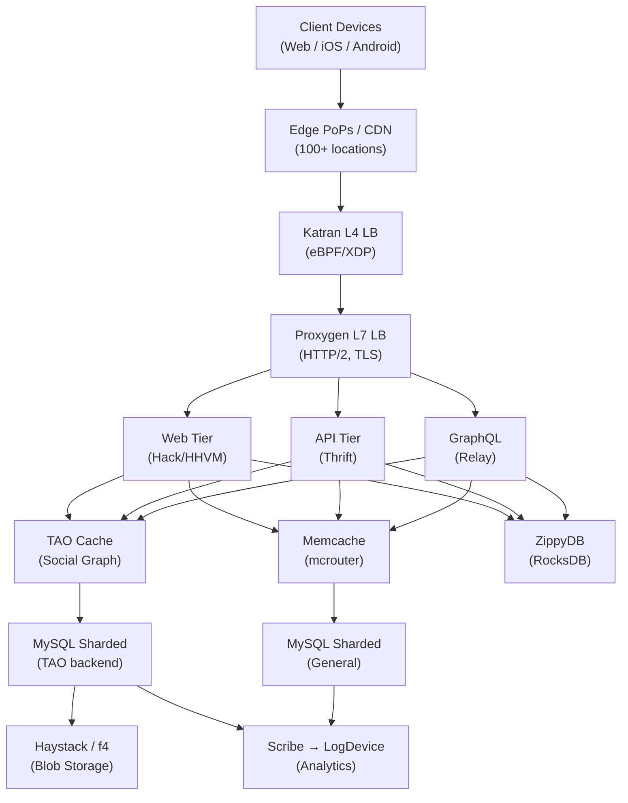
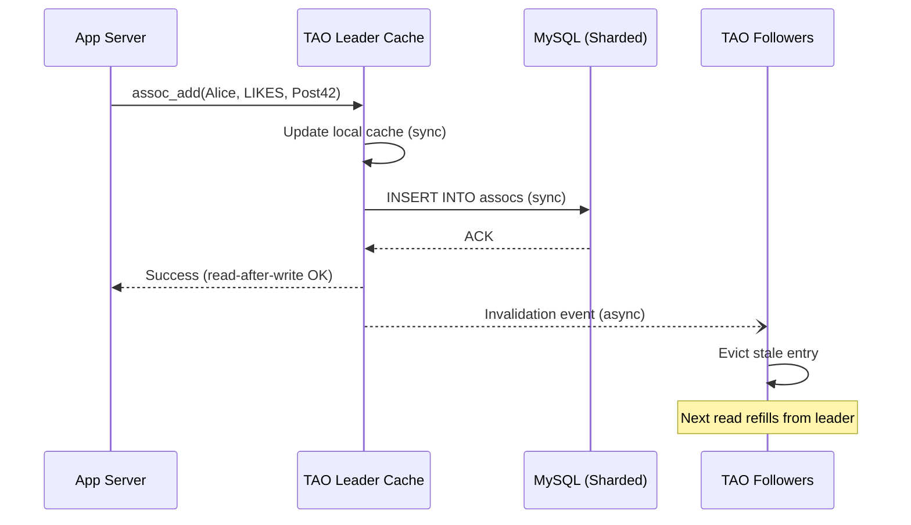
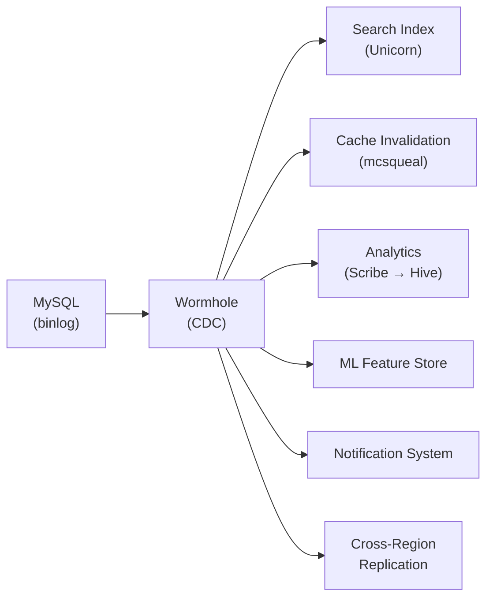
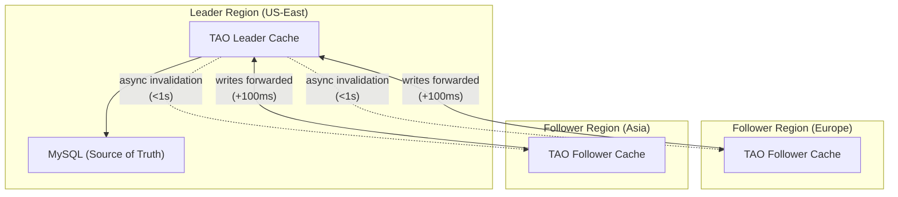

# Meta — How Patterns Work in Production

> 3.96B MAU, exabytes of data, 1000s of services. Key systems: TAO, Memcache fleet, Haystack, Gatekeeper. Open-source: React, PyTorch, RocksDB, Thrift.

---

## High-Level Architecture

```
                        ┌──────────────────────────────────┐
                        │         Client Devices            │
                        │   (Web / iOS / Android / USSD)    │
                        └───────────────┬──────────────────┘
                                        │
                                  HTTPS / QUIC
                                        │
                        ┌───────────────▼──────────────────┐
                        │        Edge PoPs / CDN            │
                        │     (100+ global locations)       │
                        │   Static assets, video, photos    │
                        └───────────────┬──────────────────┘
                                        │
                           ┌────────────▼────────────┐
                           │    Katran (L4 LB)       │
                           │    eBPF / XDP-based     │
                           └────────────┬────────────┘
                                        │
                           ┌────────────▼────────────┐
                           │   Proxygen (L7 LB)      │
                           │   HTTP/2, TLS term.     │
                           └────────────┬────────────┘
                                        │
                   ┌────────────────────┼────────────────────┐
                   │                    │                    │
           ┌───────▼───────┐   ┌───────▼───────┐   ┌───────▼───────┐
           │  Web Tier     │   │  API Tier     │   │  GraphQL      │
           │  (Hack/HHVM)  │   │  (Thrift)     │   │  (Relay)      │
           └───────┬───────┘   └───────┬───────┘   └───────┬───────┘
                   │                    │                    │
                   └────────────────────┼────────────────────┘
                                        │
           ┌────────────────────────────┼────────────────────────────┐
           │                            │                            │
   ┌───────▼───────┐          ┌────────▼────────┐          ┌───────▼───────┐
   │   TAO Cache   │          │   Memcache      │          │   ZippyDB     │
   │   (Social     │          │   (mcrouter)    │          │   (KV on      │
   │    Graph)     │          │   General cache  │          │    RocksDB)   │
   └───────┬───────┘          └────────┬────────┘          └───────────────┘
           │                           │
   ┌───────▼───────┐          ┌────────▼────────┐
   │  MySQL        │          │  MySQL          │
   │  (Sharded,    │          │  (Sharded,      │
   │   10K+ shards)│          │   source of     │
   └───────┬───────┘          │   truth)        │
           │                  └─────────────────┘
   ┌───────▼────────────────────────────┐
   │  Haystack / f4 (Blob Storage)     │
   └────────────────────────────────────┘
           │
   ┌───────▼────────────────────────────┐
   │  Scribe → LogDevice → Warehouse   │
   │  (Logging / Analytics Pipeline)   │
   └────────────────────────────────────┘
```



**Request lifecycle (simplified):** User opens app -> HTTPS/QUIC to nearest CDN PoP -> Katran (L4, eBPF) -> Proxygen (L7, TLS termination) -> Web/API tier -> TAO or Memcache (>99.8% cache hit) -> MySQL only on cache miss -> response assembled and returned. Median read latency: <1ms from TAO cache.

---

## Pattern Deep Dives

---

### Pattern 1: Multi-Layer Caching — TAO + Memcache Fleet

> [[02_building_blocks/caching]]

**The Problem:** A single cache layer cannot absorb 10B+ read QPS. Cache misses at this scale would destroy the database tier. Different data types (social graph vs. general KV) have different access patterns and consistency needs.

**How Meta Implements It:**

Meta stacks four cache tiers, each absorbing misses from the tier above:

```
   Request Flow (read path):

   ┌──────────────┐    HIT (~60-70%)
   │  CDN Edge    │───────────────────▶ Response
   │  (100+ PoPs) │
   └──────┬───────┘
          │ MISS
          │
   ┌──────▼───────┐    HIT (social graph: >99.8%)
   │  TAO Cache   │───────────────────▶ Response
   │  (in-memory, │    HIT (general: ~95-99%)
   │   per-region) │
   │       OR      │
   │  Memcache    │
   │  (mcrouter)  │
   └──────┬───────┘
          │ MISS (<0.2% for TAO)
          │
   ┌──────▼───────┐
   │  MySQL       │───────────────────▶ Response
   │  (Sharded)   │                     (+ backfill cache)
   └──────────────┘
```

**Tier breakdown:**

| Tier | System | Hit Rate | Latency | What It Caches |
|------|--------|----------|---------|----------------|
| L1 | CDN (100+ PoPs) | ~60-70% for static | <10ms | Photos, videos, static assets |
| L2 | TAO Leader/Follower cache | >99.8% | <1ms (p50) | Social graph objects + associations |
| L2 | Memcache (via mcrouter) | ~95-99% | ~200-300us | Sessions, computed results, ML features |
| L3 | MySQL (sharded) | 100% (source of truth) | 5-10ms | Everything, but rarely hit |

**Key details:**
- TAO and Memcache serve **different data models** at the same tier: TAO for graph (objects + edges), Memcache for flat KV
- Each tier reduces load on the next by 10-100x. Without the cache tiers, MySQL would need to handle ~10B QPS (impossible)
- TAO caches are **graph-aware** (understand objects and associations), while Memcache caches are **opaque blobs**
- CDN caches are **pull-based** (cache on first request), while TAO/Memcache are **push-invalidated** (binlog triggers)

**Evolution:**
- 2005: Raw Memcache on top of MySQL (single tier)
- 2010: CDN added as edge tier for photos (Haystack)
- 2013: TAO introduced as graph-aware cache tier (replaced raw Memcache for social graph)
- Present: Four-tier hierarchy with different consistency guarantees per tier

---

### Pattern 2: Cache Invalidation — Lease-Get / Lease-Set + Binlog Invalidation

**The Problem:** Two nasty bugs plague caching at scale:

1. **Thundering herd:** A popular key expires. 1000 concurrent requests all miss cache simultaneously and stampede the database.
2. **Stale set:** Request A reads old value from DB. Meanwhile, Request B writes new value and invalidates cache. Request A (still running) sets cache to old value. Cache is now permanently stale.

**How Meta Implements It:**

```
   THUNDERING HERD SOLUTION (lease-get / lease-set):

   Request A (first miss):
   ┌─────────┐  get(k)   ┌──────────┐  MISS    ┌─────────┐
   │Client A │──────────▶│ Memcache │─────────▶│ Returns  │
   │         │           │          │          │ lease=L1 │
   │         │◀────────────────────────────────│ (token)  │
   │         │                                 └─────────┘
   │         │  query DB, compute value
   │         │  set(k, val, lease=L1)  ← only succeeds with valid lease
   └─────────┘

   Requests B, C, D (concurrent misses):
   ┌─────────┐  get(k)   ┌──────────┐  MISS, but lease exists
   │Client B │──────────▶│ Memcache │─────────▶ "wait/retry"
   │         │◀──────────│          │           (not given a lease)
   │         │  told to  └──────────┘
   │         │  retry in
   │         │  ~10ms
   └─────────┘

   STALE SET SOLUTION:
   ┌─────────┐ get(k)→lease=L1  ┌──────────┐
   │Client A │─────────────────▶│ Memcache │
   │(slow    │                  │          │
   │ reader) │                  │          │
   │         │  Meanwhile:      │          │
   │         │  delete(k) ←─────│          │◀── invalidation event
   │         │  (lease L1 is    │          │    (from write path)
   │         │   now revoked)   │          │
   │         │                  │          │
   │         │ set(k,old,L1)───▶│  REJECT  │  ← lease L1 invalid
   │         │                  │  (stale  │    (was revoked by delete)
   └─────────┘                  │   set    │
                                │ prevented)│
                                └──────────┘

   BINLOG-BASED CROSS-REGION INVALIDATION:

   ┌──────────┐  write   ┌──────────┐  binlog   ┌───────────┐  delete(k)  ┌──────────┐
   │ App      │─────────▶│ MySQL    │──────────▶│ mcsqueal  │───────────▶│ Remote   │
   │ Server   │          │ (leader  │           │ (binlog   │            │ Memcache │
   │ (Region  │          │  region) │           │  tailer)  │            │ (Region  │
   │  A)      │          └──────────┘           └───────────┘            │  B)      │
   └──────────┘                                                          └──────────┘
```

**Key details:**
- **Lease** = 64-bit token returned on cache miss. Only the lease holder can populate the cache. If the key is deleted (invalidation) while a lease is outstanding, the lease is revoked.
- **mcsqueal** tails MySQL binlog and translates row changes into cache invalidation (delete) commands. This ensures cross-region caches are eventually consistent.
- **Delete over update**: Meta always deletes cache keys on write rather than updating them. Delete is idempotent, simpler, and avoids value-computation complexity. Next read triggers refill.
- Lease mechanism is **transparent to application code** -- the Memcache client library handles it automatically.

**Evolution:**
- Pre-2013: Raw get/set with manual invalidation. Thundering herds and stale sets were constant production issues.
- 2013: Lease-get/lease-set deployed (published in NSDI paper "Scaling Memcache at Facebook"). Both problems solved with zero application-level changes.
- Present: Same mechanism, extended with cross-region invalidation via mcsqueal and Wormhole CDC.

---

### Pattern 3: Write-Through Cache — TAO's Consistency Model

**The Problem:** Social media demands **read-after-write consistency** for the authoring user. You post a comment, you must see it immediately. But the social graph is read-heavy (1000:1 read:write ratio), so the cache must stay consistent without sacrificing read performance.

**How Meta Implements It:**

```
   TAO Write-Through Path:

   ┌──────────┐  assoc_add(Alice, LIKES, Post42)
   │ App Tier │──────────────────────────────────┐
   └──────────┘                                  │
                                                 ▼
                                  ┌──────────────────────────┐
                                  │   TAO Leader Cache       │
                                  │   (Region A, shard owner)│
                                  │                          │
                                  │  1. Update cache (sync)  │
                                  │  2. Write to MySQL (sync)│
                                  │  3. If MySQL fails →     │
                                  │     invalidate cache     │
                                  │  4. Send invalidation    │
                                  │     to followers (async) │
                                  └────┬──────────┬──────────┘
                                       │          │
                          ┌────────────▼──┐  ┌────▼────────────────┐
                          │ MySQL         │  │ TAO Followers       │
                          │ (source of    │  │ (same region +      │
                          │  truth)       │  │  remote regions)    │
                          │ SYNC write    │  │ ASYNC invalidation  │
                          └───────────────┘  └─────────────────────┘
```



**Key details:**
- **Write goes to cache first, then MySQL.** This means the authoring user's next read hits warm cache with fresh data.
- **If MySQL write fails, cache entry is invalidated** (not left stale). This preserves the invariant: cache is never newer than DB.
- **Followers receive async invalidation**, not the new value. This is intentional -- followers refill from leader on next read, ensuring they always get the authoritative value.
- **Cross-region writes are forwarded** to the leader region. A user in Europe writing to a shard owned by US-East incurs ~100-150ms of cross-region latency. Reads are always local.
- Consistency model: **read-after-write for the writer**, **eventual consistency for everyone else** (follower lag typically <1 second).

**Why write-through over write-behind?**
Write-behind (buffering writes) would improve write latency but sacrifice read-after-write consistency. For social media ("I just posted, where is my post?"), this is unacceptable. The 1000:1 read:write ratio means write latency matters less than read consistency.

**Evolution:**
- Pre-2011: Look-aside Memcache. App responsible for cache consistency. Bugs everywhere.
- 2013: TAO deployed. Write-through model centralized behind clean API. App code no longer deals with cache invalidation.
- Present: Same write-through model, optimized with batched invalidations and priority queues for high-fanout entities.

---

### Pattern 4: Sharding — TAO + Memcache + MySQL

> [[03_design_patterns/sharding]]

**The Problem:** No single machine can store trillions of objects or handle 10B QPS. Data must be split across thousands of machines, but the split strategy must minimize cross-shard operations (expensive) while keeping data balanced.

**How Meta Implements It:**

```
   TAO Sharding (social graph):

   shard_id = object_id % NUM_SHARDS    (typically 10K+ shards)

   Associations are co-located with the source object:
   ┌─────────────────────────────────────────────────────┐
   │ Shard 42 (owned by TAO Leader 7, MySQL Shard 42)   │
   │                                                     │
   │  Objects: User(42), User(10042), User(20042), ...   │
   │  Associations from these users:                     │
   │    FRIEND(42, FRIEND, 99)       ← stored here      │
   │    AUTHORED(42, AUTHORED, 1001) ← stored here      │
   │    LIKES(42, LIKES, 2005)       ← stored here      │
   │                                                     │
   │  NOT stored here:                                   │
   │    FRIEND(99, FRIEND, 42)       ← on shard 99%N    │
   └─────────────────────────────────────────────────────┘

   Memcache Sharding (general KV):

   mcrouter uses consistent hashing:
   ┌────────────────────────────────────────────────────────┐
   │                                                        │
   │    key="user:session:42"                               │
   │         │                                              │
   │         ▼                                              │
   │    hash(key) → position on ring → server S3            │
   │                                                        │
   │    ┌───┐   ┌───┐   ┌───┐   ┌───┐   ┌───┐   ┌───┐    │
   │    │S1 │───│S2 │───│S3 │───│S4 │───│S5 │───│S1 │    │
   │    └───┘   └───┘   └─▲─┘   └───┘   └───┘   └───┘    │
   │                       │                                │
   │              key lands here                            │
   │                                                        │
   │    If S3 dies: keys remap to S4 (minimal disruption)  │
   └────────────────────────────────────────────────────────┘
```

**Key details:**
- **TAO shards by object_id modulo** -- simple, deterministic, enables co-location of an entity with its outgoing edges
- **Memcache shards by consistent hashing** via mcrouter -- handles dynamic server additions/removals with minimal key redistribution
- **MySQL shards mirror TAO shards** -- each TAO shard maps to exactly one MySQL shard (same partition key)
- **Cross-shard reads** happen when you query an association whose destination is on another shard. TAO handles this transparently by issuing parallel reads to multiple shards.
- **Rebalancing**: TAO shard count is fixed at deploy time (expensive to change). Memcache consistent hashing allows online rebalancing.

**Tradeoffs:**
- Modulo sharding: simple, fast lookup, but adding shards requires reshuffling everything (TAO avoids this by using a large fixed shard count)
- Consistent hashing: graceful scaling, but introduces ring hotspots (solved with virtual nodes in mcrouter)
- Co-locating associations with source object: optimizes "get all friends of user X" but means "get all users who friended user X" hits many shards

**Evolution:**
- 2005: MySQL sharded by user_id. Manual shard map.
- 2013: TAO formalized sharding with fixed shard count + shard-to-host mapping
- Present: 10K+ MySQL shards, each with leader + replicas, fronted by TAO cache

---

### Pattern 5: Feature Flags — Gatekeeper

> [[15_intermediate_topics/deployment_strategies]]

**The Problem:** Deploying code to thousands of servers serving 3.96B users is slow and risky. You need to decouple **deployment** (code on servers) from **release** (feature visible to users). You also need instant rollback without redeploying.

**How Meta Implements It:**

```
   Gatekeeper Architecture:

   ┌─────────────────────────────────────┐
   │         Gatekeeper Web UI           │
   │   Engineer defines:                 │
   │   - gate: "new_feed_algo"           │
   │   - rollout: 5% of users           │
   │   - targeting: US, iOS only         │
   │   - kill-switch: enabled            │
   └──────────────┬──────────────────────┘
                  │ write config
                  ▼
   ┌─────────────────────────────────────┐
   │         Configerator                │
   │   (centralized config store)        │
   │   - ZooKeeper-backed               │
   │   - Push model (not polling)        │
   │   - Seconds-level global propagation│
   └──────────────┬──────────────────────┘
                  │ push to all servers (seconds)
       ┌──────────┼──────────┐
       ▼          ▼          ▼
   ┌────────┐ ┌────────┐ ┌────────┐
   │Server 1│ │Server 2│ │Server N│
   │        │ │        │ │        │
   │┌──────┐│ │┌──────┐│ │┌──────┐│
   ││Local ││ ││Local ││ ││Local ││
   ││Gate  ││ ││Gate  ││ ││Gate  ││
   ││Cache ││ ││Cache ││ ││Cache ││
   │└──┬───┘│ │└──┬───┘│ │└──┬───┘│
   │   │    │ │   │    │ │   │    │
   │ <1 us  │ │ <1 us  │ │ <1 us  │
   │ eval   │ │ eval   │ │ eval   │
   └────────┘ └────────┘ └────────┘

   Gate Evaluation (in-process, <1 microsecond):
   ┌─────────────────────────────────────────────────┐
   │ gate_check("new_feed_algo", user_id=42):        │
   │                                                  │
   │   1. Override list? → user_id in set? → Y/N     │
   │   2. Employee gate? → is_employee(user_id)?     │
   │   3. Country targeting? → geo(user_id) == US?   │
   │   4. Rollout %? → hash(user_id, gate_name)      │
   │                     % 100 < 5?                   │
   │   5. → return ENABLED / DISABLED                 │
   │                                                  │
   │   Deterministic: same user always gets same      │
   │   result (no flickering between page loads)      │
   └─────────────────────────────────────────────────┘
```

**Key details:**
- **In-process evaluation, not RPC**: Gate configs are pushed to every server and cached in-process. Evaluation is <1 microsecond (just a hash + comparison). No network call.
- **Deterministic hashing**: `hash(user_id, gate_name) % 100` ensures a user always sees the same variant. No session state needed.
- **Push model via Configerator**: Gate changes propagate to all servers in seconds. Far faster than polling (which wastes bandwidth or has high latency).
- **Kill-switch**: Any gate can be flipped to 0% instantly. Propagates globally in seconds. Faster than a code rollback.
- **~100K+ active gates** at any time. Thousands of concurrent A/B experiments.

**Why in-process over a flag service?**
An RPC-based flag service would add latency to every request (gates are checked on nearly every code path) and create a single point of failure. If the flag service goes down, every feature decision fails. In-process evaluation with pushed configs has zero runtime dependency.

**Evolution:**
- Early: Feature flags as config files. Manual deployment.
- Mid: Configerator introduced for centralized config distribution
- Present: Gatekeeper as full experimentation platform with statistical significance tracking, mutual exclusion between experiments, and automated ramp-up policies

---

### Pattern 6: Pub/Sub — Wormhole (Change Data Capture)

> [[03_design_patterns/pub_sub]]

**The Problem:** When data changes in MySQL, dozens of downstream systems need to know: search indexes, cache layers, analytics pipelines, ML feature stores, notification systems. Direct coupling (each writer notifies each consumer) creates an N*M integration nightmare.

**How Meta Implements It:**

```
   Wormhole CDC Pipeline:

   ┌──────────┐  write   ┌──────────┐
   │ App      │─────────▶│ MySQL    │
   │ Server   │          │ (source  │
   └──────────┘          │  of truth)│
                         └────┬─────┘
                              │ binlog (row-level changes)
                              ▼
                    ┌─────────────────────┐
                    │    Wormhole         │
                    │  (CDC framework)    │
                    │                     │
                    │  - Tails MySQL      │
                    │    binlog           │
                    │  - Exactly-once     │
                    │    delivery         │
                    │  - Ordered by       │
                    │    shard            │
                    └─────────┬───────────┘
                              │
              ┌───────────────┼───────────────┐
              │               │               │
              ▼               ▼               ▼
   ┌──────────────┐ ┌──────────────┐ ┌──────────────┐
   │ Search Index │ │ Cache Inval. │ │ Analytics    │
   │ (Unicorn)    │ │ (mcsqueal →  │ │ (Scribe →    │
   │              │ │  Memcache)   │ │  Hive)       │
   └──────────────┘ └──────────────┘ └──────────────┘
              │               │               │
              ▼               ▼               ▼
   ┌──────────────┐ ┌──────────────┐ ┌──────────────┐
   │ ML Feature   │ │ Notification │ │ Cross-Region │
   │ Store        │ │ System       │ │ Replication  │
   └──────────────┘ └──────────────┘ └──────────────┘
```



**Key details:**
- **Source**: MySQL binlog (row-level changes). No application-level event emission needed.
- **Delivery guarantee**: Exactly-once per consumer (using checkpointing)
- **Ordering**: Events ordered within a shard (same partition key). No global ordering (impossible at scale).
- **Latency**: Sub-second for most consumers. Seconds for cross-region.
- **Decoupling**: Writers never know about consumers. Adding a new consumer requires zero changes to the write path.

**Why binlog-based CDC over application-level events?**
Application-level events are easy to forget (developer writes to DB but forgets to emit event). Binlog tailing guarantees **every** database change is captured, regardless of which code path wrote it. It also captures changes from manual DB operations and migrations.

**Evolution:**
- Early: Direct coupling. Each service called downstream services after writes.
- 2013: mcsqueal introduced for cache invalidation via binlog
- Present: Wormhole as unified CDC platform. All MySQL changes flow through a single pub/sub backbone.

---

### Pattern 7: Back Pressure — Memcache Gutter Pools

> [[03_design_patterns/back_pressure]]

**The Problem:** When a Memcache server dies, all its keys become cache misses. Thousands of requests per second suddenly stampede the database. This is not a gradual degradation -- it is an instant cliff of backend load that can cascade into a full outage.

**How Meta Implements It:**

```
   Normal Operation:
   ┌──────────┐  get(k)   ┌──────────┐   HIT
   │ mcrouter │──────────▶│ Primary  │──────────▶ Response
   └──────────┘           │ Pool     │
                          └──────────┘

   Primary Server Dies:
   ┌──────────┐  get(k)   ┌──────────┐   SERVER DOWN
   │ mcrouter │──────────▶│ Primary  │──────▶ ✗
   │          │           │ Pool     │
   │          │           └──────────┘
   │          │
   │          │  failover  ┌──────────┐   MISS (first time)
   │          │───────────▶│ Gutter   │──────────▶ DB query
   │          │           │ Pool     │            + set in gutter
   │          │           │ (spare   │            with SHORT TTL
   │          │           │  servers,│            (~2 minutes)
   │          │           │  small)  │
   │          │           └──────────┘
   │          │
   │          │  subsequent ┌──────────┐   HIT (from gutter)
   │          │  requests  │ Gutter   │──────────▶ Response
   │          │───────────▶│ Pool     │   (stale but available)
   └──────────┘           └──────────┘

   Key Insight: Gutter absorbs the thundering herd.
   Instead of 10K requests/sec hitting DB, only the FIRST
   request hits DB. The rest get served from gutter (with
   short TTL to limit staleness).
```

**Key details:**
- **Gutter pools** are a small set of spare Memcache servers (much smaller than primary pool)
- **Short TTLs** (~2 minutes) in gutter prevent serving stale data for too long
- **mcrouter handles failover transparently** -- application code does not know about gutter
- **Back pressure mechanism**: By absorbing cache misses, gutter prevents the miss-storm from reaching (and killing) the database
- **Not a replacement** for the primary pool. Gutter is smaller and slower. It is a **shock absorber** for transient failures.

**Tradeoffs:**
- Gutter trades **consistency** (short-lived stale data) for **availability** (database does not get crushed)
- Gutter is **not replicated** -- it is temporary by design. If gutter itself dies, the DB takes the hit
- Alternative: rehash keys to remaining servers. But this causes a **cascade**: remaining servers now handle more load, may themselves fail, triggering more rehashing. Gutter avoids this cascade.

**Evolution:**
- Early: No failover. Dead server = thundering herd = database overload = cascading failure
- 2013: Gutter pools introduced (published in NSDI paper). Dramatically reduced blast radius of individual server failures.
- Present: Same mechanism, with refined TTL tuning and multi-tier gutter for different data criticality levels.

---

### Pattern 8: Consistent Hashing — mcrouter Routing

> [[03_design_patterns/consistent_hashing]]

**The Problem:** Meta's Memcache fleet has 10,000+ servers. When a server is added or removed (planned scaling, failures), naive modulo hashing (`hash(key) % N`) would remap nearly all keys, causing a massive miss storm. You need a routing scheme where adding/removing a server only affects `~1/N` of the keys.

**How Meta Implements It:**

```
   mcrouter Consistent Hash Ring:

   Server added/removed → only neighboring keys remap

        S1      S2      S3 (new)     S4      S5
   ──────●───────●────────●───────────●───────●──────
         │       │        │           │       │
         │       │    only keys in    │       │
         │       │    this arc move   │       │
         │       │◀──────▶│           │       │
         │       │        │           │       │

   Virtual Nodes (solving hotspot problem):

   Physical servers: S1, S2, S3
   Virtual nodes: S1a, S1b, S1c, S2a, S2b, S2c, S3a, S3b, S3c

   ──S1a──S3b──S2a──S1c──S3a──S2c──S1b──S2b──S3c──
     │                                           │
     └─────── better distribution ───────────────┘

   mcrouter Config (simplified):
   ┌────────────────────────────────────────────┐
   │ {                                          │
   │   "pools": {                               │
   │     "regional": {                          │
   │       "hash": "ch3",  // consistent hash v3│
   │       "servers": [                         │
   │         "mc001:11211",                     │
   │         "mc002:11211",                     │
   │         ...                                │
   │         "mc10000:11211"                    │
   │       ]                                    │
   │     }                                      │
   │   }                                        │
   │ }                                          │
   └────────────────────────────────────────────┘
```

**Key details:**
- **mcrouter** is the open-source Memcache proxy that implements consistent hashing (plus routing, replication, failover, connection pooling)
- **CH3** is Meta's consistent hashing variant optimized for minimal disruption during server changes
- **Virtual nodes**: Each physical server gets multiple positions on the ring, smoothing out load distribution
- **Automatic failover**: When a server is unreachable, mcrouter routes its keys to gutter pool (see Pattern 7) without remapping the entire ring
- **Topology-aware routing**: mcrouter can route to closest replica based on data center/rack topology

**Why consistent hashing over modulo?**
With 10K servers and modulo hashing, adding one server remaps ~99.99% of keys. With consistent hashing, adding one server remaps ~0.01% of keys. At 1B QPS, this is the difference between a brief blip and a catastrophic cache miss storm.

**Evolution:**
- Early: Modulo hashing. Server additions were painful (massive cache miss storm during rehashing).
- 2014: mcrouter open-sourced with consistent hashing. Server additions/removals became routine operations.
- Present: CH3 with virtual nodes, topology awareness, and integration with gutter pools for zero-downtime server changes.

---

### Pattern 9: Replication — TAO Cross-Region

> [[03_design_patterns/replication]]

**The Problem:** Meta has users on every continent. Routing all reads to a single data center would mean 100-200ms of latency for distant users. But replicating the social graph across regions introduces consistency challenges -- what happens when a user in Europe writes while reading from a European replica?

**How Meta Implements It:**

```
   TAO Cross-Region Replication:

   ┌─────────────────────────────────────────────────────────┐
   │                    LEADER REGION (US-East)               │
   │                                                         │
   │  ┌─────────────────────────────────┐                    │
   │  │    TAO Leader Cache             │                    │
   │  │    (handles ALL writes)         │                    │
   │  │    (serves local reads)         │                    │
   │  └──────────┬──────────────────────┘                    │
   │             │                                           │
   │  ┌──────────▼──────────────────────┐                    │
   │  │    MySQL (source of truth)      │                    │
   │  └─────────────────────────────────┘                    │
   └───────┬──────────────────────────────┬──────────────────┘
           │ async invalidation           │ async invalidation
           │ (typically <1s)              │
           ▼                              ▼
   ┌───────────────────┐       ┌───────────────────┐
   │ FOLLOWER REGION   │       │ FOLLOWER REGION   │
   │ (Europe)          │       │ (Asia)            │
   │                   │       │                   │
   │ ┌───────────────┐ │       │ ┌───────────────┐ │
   │ │TAO Follower   │ │       │ │TAO Follower   │ │
   │ │Cache          │ │       │ │Cache          │ │
   │ │- Serves reads │ │       │ │- Serves reads │ │
   │ │- Forwards     │ │       │ │- Forwards     │ │
   │ │  writes to    │ │       │ │  writes to    │ │
   │ │  leader       │ │       │ │  leader       │ │
   │ └───────────────┘ │       │ └───────────────┘ │
   └───────────────────┘       └───────────────────┘

   Write from Europe:
   ┌────────┐  write  ┌──────────┐  forward  ┌──────────┐  write  ┌───────┐
   │ User   │────────▶│ Europe   │──────────▶│ US-East  │────────▶│MySQL  │
   │(Europe)│         │ Follower │  (+100ms) │ Leader   │         │       │
   └────────┘         └──────────┘           └──────────┘         └───────┘
                           │
                      But: follower updates
                      its LOCAL cache immediately
                      after leader confirms
                      → read-after-write for
                        this user is preserved
```



**Key details:**
- **One leader region per shard** handles all writes. Follower regions are read-only replicas.
- **Writes from follower regions** are forwarded to the leader region (incurs ~100-150ms cross-region latency). But the follower updates its local cache immediately after leader confirmation, preserving read-after-write for the authoring user.
- **Invalidation, not replication**: Leader sends "invalidate key X" to followers, not the new value. Followers refill from leader on next read. This reduces cross-region bandwidth and avoids stale-value propagation.
- **Consistency model**: Strong consistency within leader region. Eventual consistency (typically <1s lag) for follower regions.
- **Shard ownership can be migrated** between regions (e.g., if most users for a shard are in Europe, make Europe the leader for that shard).

**Why leader-follower over multi-leader?**
Multi-leader would eliminate cross-region write latency but introduces write conflicts. For a social graph (where conflicts are hard to resolve -- did you unfriend or re-friend?), conflict resolution is complex and error-prone. Single-leader avoids this entirely.

**Evolution:**
- Pre-2013: Single data center. All traffic routed to US.
- 2013: TAO multi-region with leader-follower. Reads went local, writes forwarded to leader.
- Present: Dynamic leader assignment per shard based on write traffic origin. Some shards have European leaders for European-heavy user bases.

---

### Pattern 10: Blob Storage — Haystack + f4

> [[02_building_blocks/blob_storage]]

**The Problem:** Hundreds of billions of photos. POSIX filesystem requires 3+ disk I/O per photo read (directory inode, file inode, file data). At billions of photos, filesystem metadata does not fit in RAM, so every I/O is a disk seek. Reads become impossibly slow.

**How Meta Implements It:**

```
   Haystack: 1 I/O Per Photo Read

   Traditional Filesystem (3+ I/O):
   ┌────────┐    ┌──────────┐    ┌──────────┐    ┌──────────┐
   │ Read   │───▶│ Dir      │───▶│ File     │───▶│ File     │
   │ Request│    │ Inode    │    │ Inode    │    │ Data     │
   └────────┘    │ (DISK IO)│    │ (DISK IO)│    │ (DISK IO)│
                 └──────────┘    └──────────┘    └──────────┘

   Haystack (1 I/O):
   ┌────────┐    ┌──────────────────┐    ┌──────────┐
   │ Read   │───▶│ In-Memory Index  │───▶│ Volume   │
   │ Request│    │ ~40 bytes/photo  │    │ Data     │
   └────────┘    │ (RAM — no I/O)   │    │ (1 DISK  │
                 │                  │    │  I/O)    │
                 │ photo_id →       │    └──────────┘
                 │  (vol, offset,   │
                 │   length)        │
                 └──────────────────┘

   Physical Volume Layout (append-only):
   ┌──────────────────────────────────────────────────────┐
   │ Volume (~100GB)                                      │
   │                                                      │
   │ ┌─────┬──────┬─────┬──────┬─────┬──────┬─────┐     │
   │ │Hdr1 │Blob1 │Hdr2 │Blob2 │Hdr3 │Blob3 │ ... │     │
   │ │key  │photo │key  │photo │key  │photo │     │     │
   │ │off  │data  │off  │data  │off  │data  │     │     │
   │ │len  │      │len  │      │len  │      │     │     │
   │ └─────┴──────┴─────┴──────┴─────┴──────┴─────┘     │
   │                                                      │
   │ Append-only: new photos added to end                 │
   │ Deletes: mark header as deleted (compact later)      │
   └──────────────────────────────────────────────────────┘

   URL encodes routing info (no directory lookup on read):
   https://cdn.meta.com/hay/<volume_id>/<key>/<alt_key>

   Read path: CDN → Haystack Cache → Haystack Store → 1 disk I/O
   Write path: Upload → Haystack Directory → Store (3x replicas)
```

**f4: Cold storage with erasure coding:**

```
   Hot/Cold Tier Split:

   ┌─────────────────────────────────────────────────────┐
   │  Photo Age vs. Access Rate:                         │
   │                                                     │
   │  Access  │*                                         │
   │  Rate    │ *                                        │
   │          │   *                                      │
   │          │     **                                   │
   │          │        ****                              │
   │          │             **********                   │
   │          └───────────────────────────── Age         │
   │            HOT              COLD                    │
   │          (Haystack)        (f4)                     │
   │          3.6x repl.       2.1x repl.               │
   │                           (Reed-Solomon 10,4)       │
   └─────────────────────────────────────────────────────┘

   f4 Erasure Coding (Reed-Solomon 10,4):
   ┌─────────────────────────────────────────────────────┐
   │  10 data blocks + 4 parity blocks = 14 total       │
   │  Can lose any 4 blocks and reconstruct             │
   │  Storage overhead: 14/10 = 1.4x (vs 3x replicas)  │
   │                                                     │
   │  Effective replication: 2.1x (with XOR coding)     │
   │  Savings: ~30% vs Haystack's 3.6x                  │
   └─────────────────────────────────────────────────────┘
```

**Key details:**
- **In-memory index**: ~40 bytes per photo. At hundreds of billions of photos, this is ~terabytes of RAM across the fleet, but avoids all metadata disk I/O.
- **Append-only volumes**: ~100GB each. No random writes, no fragmentation. Deletes are logical (header flag), compacted later.
- **URL-embedded routing**: The photo URL itself contains volume_id + key + alt_key. CDN and cache route directly to the correct store machine with zero directory lookups on the read path.
- **Hot/cold split**: ~80% of photos are cold (rarely accessed) but consume ~80% of storage. f4 reduces replication from 3.6x to 2.1x via erasure coding, saving enormous storage costs. Trade-off: higher read latency for cold photos (must reconstruct from coding blocks).

**Evolution:**
- Pre-2009: POSIX filesystem (NFS). 3+ I/O per photo. Metadata thrashing.
- 2010: Haystack deployed. 1 I/O per photo. Published at OSDI.
- 2012: f4 deployed for cold storage. 30% storage savings.
- Present: Same architecture, with SSD tiers for warm data and NVMe for index storage.

---

### Pattern 11: Circuit Breaker — Memcache Overload Protection

> [[03_design_patterns/circuit_breaker]]

**The Problem:** A Memcache server becomes slow (not dead -- slow). Clients pile up waiting for responses, exhausting their own connection pools and thread pools. The slowness propagates upstream: one slow cache server can bring down an entire service tier.

**How Meta Implements It:**

```
   Circuit Breaker State Machine:

   ┌─────────┐   failures > threshold   ┌─────────┐
   │ CLOSED  │─────────────────────────▶│  OPEN   │
   │ (normal │                          │ (fail   │
   │  flow)  │                          │  fast)  │
   └─────────┘                          └────┬────┘
       ▲                                     │
       │                               timeout expires
       │ probe succeeds                      │
       │                                     ▼
       │                               ┌─────────┐
       └───────────────────────────────│HALF-OPEN│
                                       │ (test   │
                                       │  with 1 │
                                       │  request)│
                                       └─────────┘

   Memcache Connection-Level Circuit Breaker:

   ┌───────────┐                    ┌──────────────┐
   │ App       │   CONNECTION POOL  │ Memcache     │
   │ Server    │                    │ Server       │
   │           │   ┌────────────┐   │              │
   │           │──▶│ max=100    │──▶│  (healthy)   │  CLOSED: normal
   │           │   │ timeout=5ms│   │              │
   │           │   └────────────┘   └──────────────┘
   │           │
   │           │   5 timeouts in 10s → OPEN
   │           │
   │           │   ┌────────────┐   ┌──────────────┐
   │           │──▶│ CIRCUIT    │──X│  Memcache    │  OPEN: fail fast
   │           │   │ OPEN       │   │  Server      │  (return miss
   │           │   │ fail fast  │   │  (slow/down) │   immediately,
   │           │   └────────────┘   └──────────────┘   don't wait)
   │           │
   │           │   After 30s → try one request
   │           │
   │           │   ┌────────────┐   ┌──────────────┐
   │           │──▶│ HALF-OPEN  │──▶│  Memcache    │  HALF-OPEN: probe
   │           │   │ 1 test req │   │  Server      │  success → CLOSED
   │           │   └────────────┘   └──────────────┘  failure → OPEN
   └───────────┘
```

**Key details:**
- **Connection pool limits**: Each app server limits connections to each Memcache server (e.g., max 100). Prevents one slow server from consuming all connections.
- **Timeout-based tripping**: If a server exceeds its timeout threshold (e.g., 5 timeouts in 10 seconds), the circuit opens. Subsequent requests **fail fast** (return cache miss immediately) instead of waiting.
- **Fail-fast = graceful degradation**: A circuit-broken cache miss goes to the database, which is better than the alternative (threads blocked waiting for a slow server, causing cascading timeout upstream).
- **Half-open probing**: After a cooldown period, one test request is sent. If it succeeds, the circuit closes. If it fails, the circuit stays open.
- **Layered with gutter pools** (Pattern 7): When circuit breaks on a primary server, mcrouter can route to gutter pool, further reducing database load.

**Evolution:**
- Early: No circuit breaking. Slow servers caused cascading failures across entire service tiers.
- 2013: Connection-level circuit breaking in mcrouter. Combined with gutter pools for defense in depth.
- Present: Adaptive circuit breaking with per-server health scoring and automatic capacity-aware routing.

---

### Pattern 12: Gossip Protocol — Shard Manager Membership

> [[03_design_patterns/gossip_protocol]]

**The Problem:** Meta runs millions of containers across dozens of data centers. The shard manager needs to know which containers are alive, which shards they own, and detect failures quickly. A centralized membership service would be a single point of failure and a bottleneck.

**How Meta Implements It:**

```
   Gossip-Based Membership:

   Each node periodically picks a random peer and exchanges state:

   Time T=0:
   ┌────┐  ┌────┐  ┌────┐  ┌────┐  ┌────┐
   │ N1 │  │ N2 │  │ N3 │  │ N4 │  │ N5 │
   │alive│  │alive│  │alive│  │DEAD│  │alive│
   └────┘  └────┘  └────┘  └────┘  └────┘
   Only N3 knows N4 is dead (direct detection)

   Time T=1 (gossip round):
   N3 tells N1: "N4 is dead (timestamp T=0)"
   N1 tells N5: "N4 is dead (timestamp T=0)"

   Time T=2 (gossip round):
   N5 tells N2: "N4 is dead (timestamp T=0)"

   After O(log N) rounds: ALL nodes know N4 is dead

   ┌────┐  ┌────┐  ┌────┐  ┌────┐  ┌────┐
   │ N1 │  │ N2 │  │ N3 │  │ N4 │  │ N5 │
   │knows│  │knows│  │knows│  │DEAD│  │knows│
   └────┘  └────┘  └────┘  └────┘  └────┘

   Convergence: O(log N) rounds for N nodes
   With 1M containers: ~20 gossip rounds to converge
   At 1 round/second: full convergence in ~20 seconds
```

**Key details:**
- **Shard Manager** uses gossip for container-level membership: which containers are alive, which shards they own, load information
- **Epidemic protocol**: Information spreads like a virus -- each node tells random peers, who tell other random peers. Converges in O(log N) rounds.
- **No single point of failure**: Every node participates equally. No leader election needed for membership.
- **Failure detection**: Combines gossip with direct heartbeats. If a node does not heartbeat for T seconds, its peers mark it suspect. After gossip propagates the suspicion, the node is declared dead.
- **Consistency**: Gossip provides **eventually consistent** membership. Short-lived inconsistencies are tolerated (shard manager handles duplicate ownership gracefully).

**Why gossip over centralized membership?**
With millions of containers, a centralized membership service would need to handle millions of heartbeats per second and would be a single point of failure. Gossip distributes the load: each node only communicates with a few peers per round. Total network cost is O(N) per round, not O(N) to a single point.

**Evolution:**
- Early: Centralized membership via ZooKeeper. Works for thousands of nodes, breaks at millions.
- Present: Gossip-based membership in shard manager. ZooKeeper still used for configuration (smaller scale, stronger consistency), but not for heartbeat/membership at container scale.

---

## Pattern Summary

| # | Pattern | System | Scale | Key Mechanism | Vault Link |
|---|---------|--------|-------|---------------|------------|
| 1 | Multi-Layer Caching | TAO + Memcache + CDN | 10B read QPS, >99.8% hit | 4 tiers: CDN → TAO/Memcache → MySQL | [[02_building_blocks/caching]] |
| 2 | Cache Invalidation | Memcache lease-get/set | Billions of keys | 64-bit lease token prevents herd + stale sets | — |
| 3 | Write-Through Cache | TAO | 10M write QPS | Cache first, then MySQL. Invalidate on failure. | — |
| 4 | Sharding | TAO + Memcache + MySQL | 10K+ shards | id % N (TAO), consistent hash (Memcache) | [[03_design_patterns/sharding]] |
| 5 | Feature Flags | Gatekeeper | 100K+ gates, <1us eval | In-process eval, Configerator push | [[15_intermediate_topics/deployment_strategies]] |
| 6 | Pub/Sub (CDC) | Wormhole | All MySQL changes | Binlog tailing, exactly-once delivery | [[03_design_patterns/pub_sub]] |
| 7 | Back Pressure | Memcache gutter pools | Absorbs server failures | Spare servers with short TTL absorb herd | [[03_design_patterns/back_pressure]] |
| 8 | Consistent Hashing | mcrouter | 10K+ Memcache servers | CH3 with virtual nodes, ~0.01% remap | [[03_design_patterns/consistent_hashing]] |
| 9 | Replication | TAO cross-region | Dozens of regions | Leader writes, follower reads, async inval. | [[03_design_patterns/replication]] |
| 10 | Blob Storage | Haystack + f4 | Hundreds of billions of photos | 1 I/O read (in-mem index), erasure coding cold | [[02_building_blocks/blob_storage]] |
| 11 | Circuit Breaker | Memcache connections | Per-server health | Timeout-based trip, fail-fast, half-open probe | [[03_design_patterns/circuit_breaker]] |
| 12 | Gossip Protocol | Shard Manager | Millions of containers | Epidemic membership, O(log N) convergence | [[03_design_patterns/gossip_protocol]] |

---

## Failure Stories

### 1. The October 4, 2021 BGP Outage — 6 Hours of Global Darkness

> [[09_real_outages/facebook_bgp_outage_2021]]

**What happened:** A routine maintenance command on backbone routers inadvertently withdrew ALL BGP routes to Meta's data centers.

**Cascade:**
```
   Maintenance command (audit tool bug let it through)
       │
       ▼
   BGP routes withdrawn → Meta's IP prefixes disappear from global routing table
       │
       ▼
   DNS resolvers can't reach Meta's authoritative DNS servers
       │
       ▼
   facebook.com, instagram.com, whatsapp.com → NXDOMAIN
       │
       ▼
   Internal tools (dashboards, deploy systems, badge access) also down
       │
       ▼
   Engineers can't SSH into servers, can't access monitoring, can't badge into buildings
       │
       ▼
   Physical travel to data centers required. Recovery took 6 HOURS.
   Estimated revenue loss: ~$100M.
```

**Lessons:**
- **Out-of-band management is critical.** If your management plane runs on the same network as your data plane, a network failure prevents you from fixing the network failure. Meta has since built fully independent out-of-band management networks.
- **Defense in depth for risky commands.** The command should have been caught by safety checks, but the audit tool had a bug. Multiple independent validation layers are needed.
- **Cascading failures are non-linear.** BGP withdrawal alone = minutes to fix. BGP + DNS + internal tools + physical access = hours.

---

### 2. Memcache Thundering Herd — The Incident That Birthed Leases

**What happened (pre-2013):** A celebrity posted a photo. The associated cache key became extremely hot (millions of reads/second). When the key expired (TTL), thousands of concurrent requests simultaneously missed cache and hit MySQL. The database shard for that user buckled under load, causing cascading timeouts.

**Cascade:**
```
   Hot key expires (TTL)
       │
       ▼
   1000+ simultaneous cache misses → all hit MySQL shard
       │
       ▼
   MySQL shard CPU saturates → query latency spikes from 5ms to 5000ms
       │
       ▼
   App server threads block waiting for DB → thread pool exhaustion
       │
       ▼
   App servers start timing out on ALL requests (not just this key)
       │
       ▼
   User-facing errors across multiple products sharing that DB shard
```

**Fix:** The lease-get/lease-set mechanism (Pattern 2). On cache miss, only the **first** request gets a lease token and is allowed to query the database. All subsequent requests for the same key are told to wait or retry. Result: 1 DB query instead of 1000. Zero application-level code changes required.

**Lesson:** The best infrastructure abstractions are invisible to the application layer. Lease mechanism solved a class of bugs permanently, without any product team needing to change their code.

---

### 3. TAO vs. Raw Memcache — The Platform Lesson

**What happened (2011-2013):** Before TAO, every product team at Meta wrote their own cache invalidation logic on top of raw Memcache + MySQL. Each team made different decisions about consistency, TTLs, and invalidation timing. Result: inconsistent behavior, subtle bugs, and duplicated effort across hundreds of teams.

**Examples of bugs:**
- Team A invalidated cache before MySQL write committed. If the write failed, cache was already deleted, causing an unnecessary miss storm.
- Team B used set-on-write instead of delete-on-write. Race conditions caused stale data that persisted until TTL expiry.
- Team C forgot to invalidate cache for one code path. Users saw stale data for that specific operation.

**Fix:** TAO centralized graph caching behind a clean API (`obj_get`, `assoc_get`, `assoc_add`). Application teams no longer think about caching, invalidation, or sharding. TAO handles it all.

**Lesson:** When every team is solving the same caching problem differently, it is time to build a platform. The initial investment in TAO paid for itself many times over in reduced bugs and engineering time.

---

## Interview Quick Reference

> [[17_company_interview_guide/meta]]

| Interview Question | Key Systems to Reference | Patterns to Discuss |
|---|---|---|
| Design Facebook News Feed | TAO (graph), Memcache (cache), ML ranking | Multi-layer cache, write-through, sharding |
| Design Instagram Stories | Haystack (storage), CDN, TTL-based expiry | Blob storage, CDN caching, replication |
| Design Facebook Messenger | Iris protocol, MQTT, TAO (inbox) | Pub/sub, replication, back pressure |
| Design a feature flag system | Gatekeeper, Configerator | Feature flags, pub/sub (push model) |
| Design a social graph store | TAO architecture directly | Write-through cache, sharding, replication |
| Design a photo storage system | Haystack + f4 directly | Blob storage, erasure coding, CDN caching |
| Design a caching system | Memcache fleet + mcrouter directly | Consistent hashing, cache invalidation, circuit breaker |
| Design a notification system | Wormhole, mobile push | Pub/sub (CDC), back pressure |

**What Meta interviewers look for:**

1. **Scale awareness**: Billions of users, not millions. Do you naturally reach for sharding, multi-layer caching, and multi-region replication?
2. **Trade-off articulation**: "We chose X over Y because Z." Every design decision should have a clear rationale. Meta values engineers who can articulate trade-offs.
3. **Failure handling**: What happens when a cache server dies? When a data center goes offline? When a deploy is bad? Design for failure because failure at scale is constant.
4. **Pattern recognition**: Can you identify that your problem is a cache invalidation problem (and reach for leases), or a membership problem (and reach for gossip)?

---

## Startup Playbook — What to Steal from Meta

### Steal Now (Day 1 - 1M Users)

| Pattern | Meta's Version | Your Version | Why Now |
|---------|---------------|-------------|---------|
| Feature Flags | Gatekeeper | LaunchDarkly, Unleash, or simple DB-backed flags | Decouple deploy from release from day 1. Instant rollback saves you at 3am. |
| Cache Layer | Memcache + mcrouter | Redis or Memcached (single instance) | Even one cache server eliminates 90%+ of DB reads. Add before you need it. |
| Pub/Sub | Wormhole (CDC) | Debezium (CDC from Postgres) or simple event emission | Decouple your write path from downstream consumers early. Avoids N*M integration debt. |
| Circuit Breaker | Memcache circuit breaking | Resilience4j, Hystrix, or middleware-level timeout + retry | One slow dependency should not take down your entire service. |

### Steal Later (1M - 100M Users)

| Pattern | Meta's Version | Your Version | When You Need It |
|---------|---------------|-------------|-----------------|
| Multi-Layer Cache | CDN + TAO + Memcache | CloudFront/Fastly + Redis + DB | When single cache layer hit rate drops below 95%, or DB is still getting hammered. |
| Consistent Hashing | mcrouter CH3 | Redis Cluster, or Twemproxy | When you outgrow a single cache server and need to shard cache across machines. |
| Sharding | TAO id % N shards | Application-level sharding or Vitess (MySQL) / Citus (Postgres) | When single DB can't handle write throughput or storage. |
| Replication | TAO cross-region leader-follower | Read replicas (RDS) + write forwarding | When you expand to multiple regions and need local read latency. |

### Probably Never Steal (Unless You Are Meta-Scale)

| Pattern | Why Meta Needs It | Why You Probably Don't |
|---------|------------------|----------------------|
| Gossip for membership | Millions of containers, centralized service would be SPOF | Kubernetes handles membership for you at <100K pods. |
| Custom blob storage (Haystack) | Hundreds of billions of photos, POSIX metadata overhead | S3/GCS handles this. You won't hit filesystem metadata limits. |
| Erasure coding (f4) | Exabytes of cold storage, 30% savings is billions of dollars | Your cloud provider's storage tiers handle cold data. |
| Custom RPC (Thrift) | Thousands of services, binary protocol saves bandwidth at scale | gRPC is the open-source equivalent. Use it instead of building your own. |

### The Meta Principle

> Build a platform when 3+ teams are solving the same problem differently. TAO replaced per-team caching. Gatekeeper replaced per-team feature flags. Wormhole replaced per-team CDC. The initial investment is high, but the amortized cost across hundreds of teams is transformative.

---

## Cross-References

- [[02_building_blocks/caching]] — Caching fundamentals
- [[02_building_blocks/blob_storage]] — Blob storage patterns
- [[03_design_patterns/sharding]] — Horizontal partitioning strategies
- [[03_design_patterns/replication]] — Leader-follower and multi-region replication
- [[03_design_patterns/consistent_hashing]] — Hash ring and virtual nodes
- [[03_design_patterns/pub_sub]] — Event-driven messaging patterns
- [[03_design_patterns/circuit_breaker]] — Fault isolation in distributed systems
- [[03_design_patterns/back_pressure]] — Flow control under overload
- [[03_design_patterns/gossip_protocol]] — Epidemic protocols for membership
- [[05_case_studies/design_chat_system]] — Chat system design (Messenger context)
- [[05_case_studies/design_instagram_stories]] — Ephemeral content design
- [[09_real_outages/facebook_bgp_outage_2021]] — The 2021 global outage analysis
- [[15_intermediate_topics/deployment_strategies]] — Deployment and feature flag strategies
- [[17_company_interview_guide/meta]] — Meta-specific interview preparation

---

*Based on published papers (TAO USENIX ATC 2013, Memcache NSDI 2013, Haystack OSDI 2010, f4 OSDI 2014, Gorilla VLDB 2015), engineering blog posts, and conference talks. Internal implementations may have evolved.*
