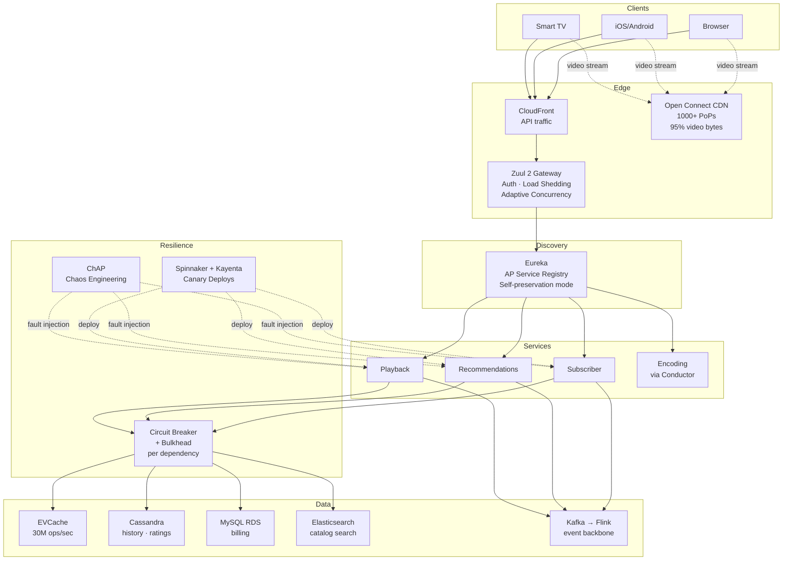
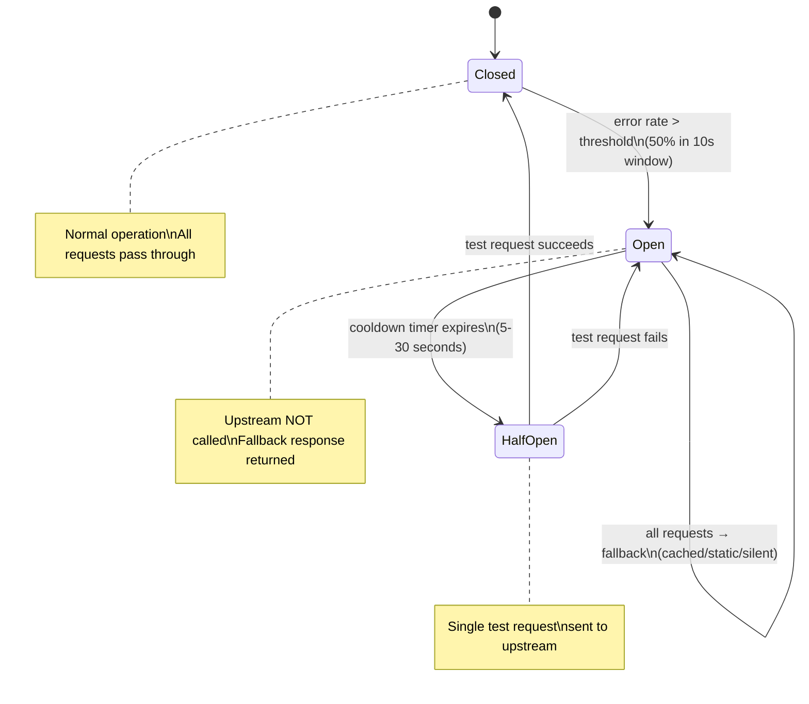
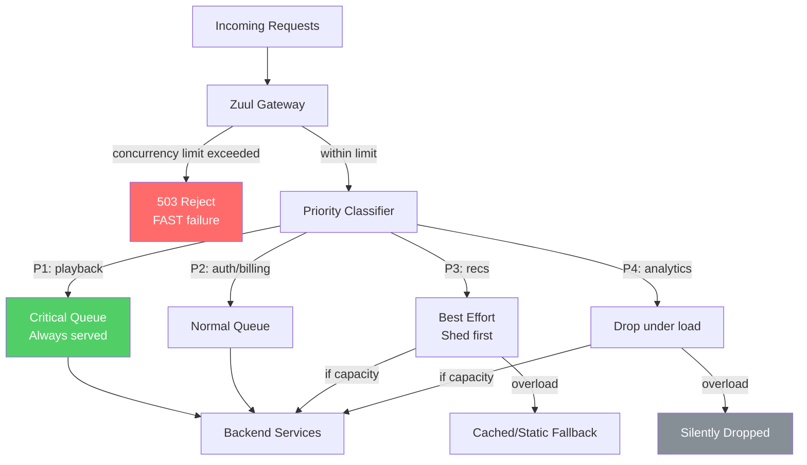
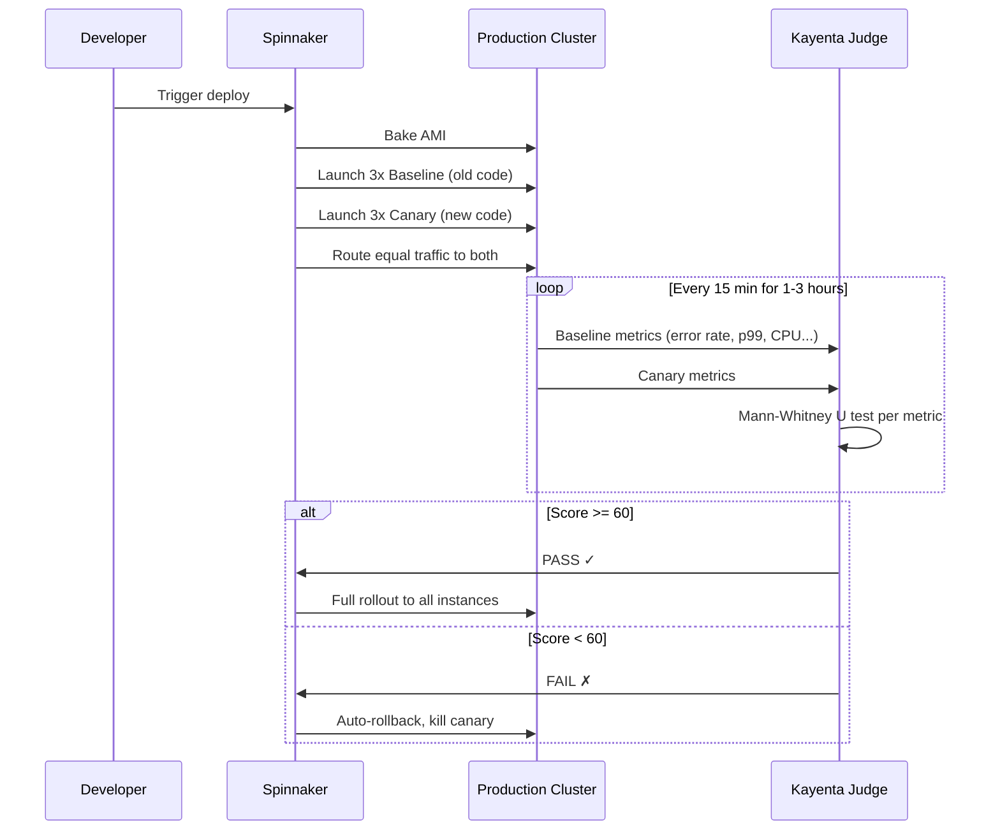
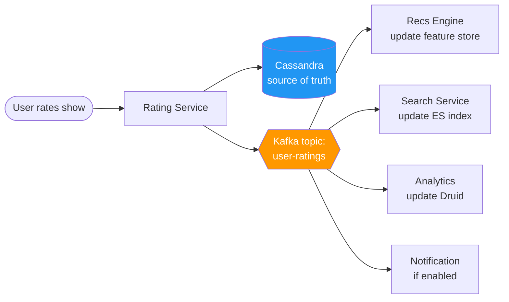
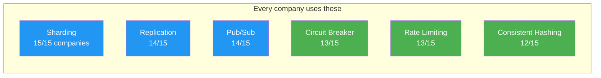
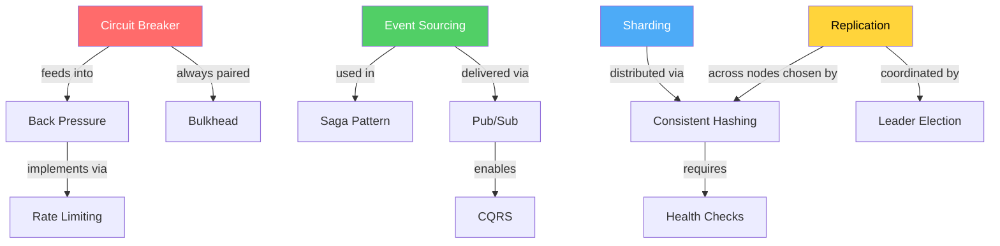
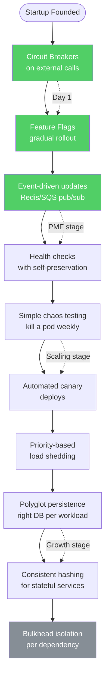

# Netflix — How Patterns Work in Production

> 260M+ subscribers, ~400K+ peak QPS, 1000+ microservices on AWS, custom CDN (Open Connect).
> Key open-source: Zuul, Hystrix, Eureka, Conductor, Spinnaker, Titus, Chaos Monkey.

---

## High-Level Architecture

```
  ┌──────────────────────────────────────────────────────────────────────────┐
  │                         CLIENT LAYER                                     │
  │   Smart TV  ·  iOS/Android  ·  Browser  ·  Game Console                 │
  │   (Adaptive bitrate client, A/B test assignment cached locally)         │
  └──────────────────────────┬───────────────────────────────────────────────┘
                             │
                ┌────────────┴────────────┐
                │                         │
                ▼                         ▼
  ┌──────────────────────┐   ┌──────────────────────────────────────┐
  │    AWS CloudFront    │   │         OPEN CONNECT CDN             │
  │  (API traffic only)  │   │  ┌──────┐ ┌──────┐ ┌──────┐        │
  └──────────┬───────────┘   │  │ OCA  │ │ OCA  │ │ OCA  │ 1000+  │
             │               │  │(ISP) │ │(ISP) │ │(IXP) │ PoPs   │
             │               │  └──────┘ └──────┘ └──────┘        │
             │               │  Video bytes served here (95%+)     │
             │               └──────────────────────────────────────┘
             ▼
  ┌──────────────────────────────────────────────────────────────┐
  │                      EDGE LAYER                              │
  │  ┌─────────────────────────────────────────────────────┐    │
  │  │  ZUUL 2 API GATEWAY (Netty non-blocking I/O)        │    │
  │  │  ┌──────────┐ ┌───────────┐ ┌────────────────────┐ │    │
  │  │  │ Auth +   │ │ Adaptive  │ │ Priority-based     │ │    │
  │  │  │ Rate     │ │ Concurr.  │ │ Load Shedding      │ │    │
  │  │  │ Limiting │ │ Limiter   │ │ (P1 > P2 > P3)     │ │    │
  │  │  └──────────┘ └───────────┘ └────────────────────┘ │    │
  │  └─────────────────────────────────────────────────────┘    │
  └──────────────────────────┬───────────────────────────────────┘
                             │
  ┌──────────────────────────▼───────────────────────────────────┐
  │                    SERVICE LAYER                              │
  │                                                              │
  │  ┌────────────┐  ┌───────────┐  ┌────────────┐  ┌────────┐ │
  │  │ Playback   │  │ Recommend │  │ Subscriber │  │ Search │ │
  │  │ Service    │  │ Engine    │  │ Service    │  │ Service│ │
  │  └─────┬──────┘  └─────┬─────┘  └──────┬─────┘  └───┬────┘ │
  │        │               │               │             │      │
  │  Each call wrapped in: Circuit Breaker + Bulkhead    │      │
  │  Discovery via: Eureka (AP, self-preservation mode)  │      │
  │                                                              │
  │  ┌─────────────────────────────────────────────────────┐    │
  │  │  CONDUCTOR — Workflow orchestration for encoding    │    │
  │  │  SPINNAKER + KAYENTA — Canary deploy + auto-judge  │    │
  │  │  ChAP — Chaos experiments (kill instances/AZs)      │    │
  │  └─────────────────────────────────────────────────────┘    │
  └───────┬──────────────┬──────────────┬────────────────────────┘
          │              │              │
          ▼              ▼              ▼
  ┌──────────────────────────────────────────────────────────────┐
  │                      DATA LAYER                              │
  │                                                              │
  │  ┌─────────┐  ┌───────────┐  ┌──────┐  ┌──────┐  ┌──────┐ │
  │  │EVCache  │  │ Cassandra │  │MySQL │  │Elastic│  │ S3 + │ │
  │  │(memcache│  │ (history, │  │(RDS) │  │Search │  │Iceberg│ │
  │  │ 30M     │  │  ratings, │  │(bill-│  │(cata- │  │(data │ │
  │  │ ops/sec)│  │  metadata)│  │ ing) │  │ log)  │  │ lake)│ │
  │  └─────────┘  └───────────┘  └──────┘  └──────┘  └──────┘ │
  │                                                              │
  │  ┌──────────────────────────────────────────────────┐       │
  │  │  KAFKA (event backbone) → FLINK (stream proc.)  │       │
  │  │  All state changes flow as events. No direct     │       │
  │  │  service-to-service data sync.                   │       │
  │  └──────────────────────────────────────────────────┘       │
  └──────────────────────────────────────────────────────────────┘
```



---

## Pattern Deep Dives

### 1. Circuit Breaker — Zuul + All Service-to-Service Calls

> **Vault:** [[03_design_patterns/circuit_breaker]]

**The problem:** With 1000+ microservices, a single slow backend can cascade failures
across the entire system. A recommendation service timing out causes Zuul threads to
pile up, which blocks playback requests, which kills streaming for millions of users.

**How Netflix implements it:**

Netflix originally built **Hystrix** as their circuit breaker library (now deprecated
in favor of **resilience4j**-style adaptive concurrency limiters). Every inter-service
call is wrapped in a circuit:

```
  Normal Flow (CLOSED state):
  ┌─────────┐    request    ┌──────────┐
  │ Service │──────────────▶│ Upstream │
  │   A     │◀──────────────│ Service  │
  └─────────┘   response    └──────────┘

  Failure Threshold Crossed → OPEN state:
  ┌─────────┐    request    ╔══════════╗
  │ Service │──────X        ║ Circuit  ║
  │   A     │◀─ fallback ──║  OPEN    ║   Upstream never called
  └─────────┘               ╚══════════╝

  After cooldown → HALF-OPEN state:
  ┌─────────┐  1 test req   ┌──────────┐
  │ Service │──────────────▶│ Upstream │
  │   A     │  success →    │ Service  │   → back to CLOSED
  └─────────┘  fail →       └──────────┘   → back to OPEN
```

**Key implementation details:**

- **Threshold:** Circuit opens after error rate exceeds threshold (e.g., 50% of
  requests in a 10-second sliding window)
- **Fallback strategies** — this is what makes Netflix's approach special:
  - **Cached fallback:** Return stale data from EVCache (e.g., yesterday's recommendations)
  - **Static fallback:** Return a pre-computed default (e.g., top-10 trending shows)
  - **Graceful degradation:** Remove personalization entirely, show generic UI
  - **Fail silent:** Return empty response (e.g., skip "Because You Watched" row)
- **Per-dependency isolation:** Each upstream dependency gets its own circuit breaker
  with independent thresholds. The recommendation service circuit can be open while
  the playback service circuit remains closed.
- **Thread pool bulkheads** (see Bulkhead pattern below) — Hystrix isolated each
  dependency call in its own thread pool, preventing one slow dependency from
  consuming all threads.

**Evolution — from static thresholds to adaptive concurrency:**

Netflix found static circuit breaker thresholds too coarse:
- Set threshold too high → failures cascade before the circuit opens
- Set threshold too low → false positives trip the circuit during normal variance

They moved to **gradient-based adaptive concurrency limiting**
(netflix-concurrency-limits library). Instead of counting errors, it:
1. Measures actual latency per request
2. Uses TCP Vegas-style congestion control algorithm
3. Dynamically adjusts the concurrency limit: `newLimit = currentLimit × gradient`
4. When latency rises → limit shrinks → excess requests get rejected immediately

```
  Adaptive Concurrency Limit (simplified):

  gradient = RTT_noload / RTT_actual
  newLimit = currentLimit × gradient + queueSize

  RTT_noload = 5ms (measured during low load)
  RTT_actual = 50ms (current measurement)
  gradient   = 5/50 = 0.1  → limit drops aggressively

  RTT_actual = 6ms
  gradient   = 5/6 = 0.83  → limit stays roughly the same
```



**When to cite in interviews:** Any question about microservice resilience, cascading
failures, or "what happens when service X goes down." Netflix's evolution from static
Hystrix → adaptive concurrency is a great advanced talking point.

---

### 2. Chaos Engineering — Chaos Monkey, Simian Army, ChAP

> No vault link (not in 03_design_patterns). Related: [[09_real_outages/aws_us_east_1_outage_2021]]

**The problem:** Cloud infrastructure fails unpredictably. You cannot test resilience
by hoping nothing breaks — you must break things deliberately and verify the system
handles it.

**How Netflix implements it:**

**Phase 1 — Chaos Monkey (2011):** Randomly kills production EC2 instances during
business hours. Opt-out, not opt-in — every service is subject to termination unless
explicitly exempted.

```
  Chaos Monkey Decision Loop:
  ┌──────────────────────────────┐
  │  For each enabled app group: │
  │  1. Pick random instance     │
  │  2. Verify during biz hours  │
  │  3. Terminate instance       │
  │  4. Log event                │
  │  5. Verify service recovers  │
  └──────────────────────────────┘
  Runs daily. If your service can't survive instance death, you find out fast.
```

**Phase 2 — Simian Army (2012):** Extended beyond instance killing:
- **Latency Monkey:** Injects artificial delays into RESTful calls
- **Conformity Monkey:** Shuts down instances that don't follow best practices
- **Chaos Gorilla:** Simulates entire AZ failure
- **Chaos Kong:** Simulates entire AWS region failure

**Phase 3 — ChAP (Chaos Automation Platform, current):**
Replaced ad-hoc tools with a structured experimentation platform:

```
  ChAP Experiment Lifecycle:
  ┌──────────────┐
  │  1. Define   │  What: kill instances / inject latency / block traffic
  │     scope    │  Where: specific service, AZ, or region
  │              │  Blast radius: % of traffic affected
  └──────┬───────┘
         ▼
  ┌──────────────┐
  │  2. Split    │  Route X% of traffic to experiment group
  │     traffic  │  Keep (100-X)% as control group
  └──────┬───────┘
         ▼
  ┌──────────────┐
  │  3. Inject   │  Apply fault to experiment group only
  │     fault    │
  └──────┬───────┘
         ▼
  ┌──────────────┐
  │  4. Compare  │  Key metrics: SPS (Streams Per Second)
  │     metrics  │  Compare experiment vs. control
  └──────┬───────┘  If SPS drops significantly → system is NOT resilient
         ▼
  ┌──────────────┐
  │  5. Auto-    │  If metrics deviate beyond threshold →
  │     abort    │  automatically stop experiment, restore normal
  └──────────────┘
```

**Key insight — SPS (Streams Per Second):** This is Netflix's "one metric that
matters." If SPS stays flat during fault injection, the system is resilient. If SPS
drops, something broke. This single metric simplifies experiment analysis enormously.

**Real example — Region evacuation drill:** Netflix runs quarterly drills where they
evacuate an entire AWS region (e.g., us-east-1). All traffic reroutes to us-west-2
and eu-west-1. They measure: can they maintain SPS with one fewer region? This is why
Netflix survived the 2021 us-east-1 outage — they had practiced that exact scenario.

---

### 3. Bulkhead — Thread Pool Isolation Across Dependencies

> No vault link. Related: [[03_design_patterns/circuit_breaker]]

**The problem:** Service A calls 10 upstream dependencies. If dependency #7 starts
responding slowly, its requests pile up, consuming all of Service A's threads. Now
dependencies #1-6 and #8-10 also fail because there are no threads left to serve
their requests. One slow dependency kills everything.

**How Netflix implements it:**

Named after ship bulkheads (watertight compartments), Netflix isolates each dependency
in its own resource pool:

```
  WITHOUT Bulkhead:
  ┌─────────────────────────────────────────┐
  │           Shared Thread Pool (200)       │
  │  ┌─┐┌─┐┌─┐┌─┐┌─┐┌─┐┌─┐┌─┐┌─┐┌─┐...  │
  │  │A││A││B││B││C││C││C││C││C││C│      │  C is slow → takes all threads
  │  └─┘└─┘└─┘└─┘└─┘└─┘└─┘└─┘└─┘└─┘      │  A and B starve
  └─────────────────────────────────────────┘

  WITH Bulkhead (Hystrix thread pool isolation):
  ┌──────────┐  ┌──────────┐  ┌──────────┐
  │ Pool: A  │  │ Pool: B  │  │ Pool: C  │
  │ (20 max) │  │ (20 max) │  │ (20 max) │
  │ ┌─┐┌─┐  │  │ ┌─┐┌─┐  │  │ ┌─┐┌─┐  │
  │ │ ││ │  │  │ │ ││ │  │  │ │ ││ │  │  C fills up its 20 threads
  │ └─┘└─┘  │  │ └─┘└─┘  │  │ └─┘└─┘  │  but A and B are UNAFFECTED
  └──────────┘  └──────────┘  └──────────┘
                               ↑ overflow → circuit opens → fallback
```

**Two isolation strategies Netflix uses:**

| Strategy | Mechanism | Overhead | When to Use |
|----------|-----------|----------|-------------|
| **Thread pool** | Dedicated thread pool per dependency | ~ms (thread scheduling) | Network calls, anything I/O-bound |
| **Semaphore** | Counter limits concurrent callers | ~0 overhead | In-memory lookups, local cache reads |

**How they size thread pools:**

Netflix uses this formula (from Hystrix documentation):
```
  threadPoolSize = peak_rps × p99_latency_sec × safety_multiplier

  Example for Recommendation Service:
  peak_rps = 1000 req/sec to this dependency
  p99_latency = 0.2 seconds
  safety_multiplier = 2 (buffer for bursts)
  threadPoolSize = 1000 × 0.2 × 2 = 400 threads
```

**Interaction with circuit breaker:** When the thread pool fills up, new requests are
rejected immediately (no queuing). This triggers the circuit breaker fallback.
Bulkhead (resource isolation) + circuit breaker (failure detection) work as a team.

---

### 4. Back Pressure — Zuul Load Shedding + EVCache Write Throttling

> **Vault:** [[03_design_patterns/back_pressure]]

**The problem:** During popular releases (e.g., Squid Game premiere), request volume
can spike 5-10x in minutes. Without back pressure, backends drown in requests and
response times degrade for everyone.

**How Netflix implements it — three layers:**

**Layer 1 — Zuul API Gateway (adaptive load shedding):**

Zuul uses the same adaptive concurrency limit described in the circuit breaker section.
When backend latency rises, Zuul's concurrency limit shrinks, causing excess requests
to be rejected at the edge with HTTP 503 before they ever reach backend services.

```
  Normal load:                    Overload:
  Client → Zuul → Backend         Client → Zuul ──X (503)
  Client → Zuul → Backend         Client → Zuul ──X (503)
  Client → Zuul → Backend         Client → Zuul → Backend  (only within limit)
  Client → Zuul → Backend         Client → Zuul ──X (503)

  Requests rejected at edge = backends never see the spike
```

**Layer 2 — Service-level priority queues:**

Critical services (playback, authentication) get priority over non-critical ones
(personalization, analytics). During overload:
- Priority 1 (playback): Always served — users MUST be able to watch
- Priority 2 (auth/billing): Served unless system is critically stressed
- Priority 3 (recommendations): Degraded to cached/static fallback
- Priority 4 (analytics/logging): Dropped first

```
  Incoming requests
       │
       ▼
  ┌──────────────────────────────┐
  │  Priority Classifier          │
  │  (based on endpoint + headers)│
  └──────┬───────┬───────┬───────┘
         │ P1    │ P2    │ P3/P4
         ▼       ▼       ▼
  ┌──────────┐ ┌──────┐ ┌──────┐
  │ Critical │ │Normal│ │ Best │
  │ Queue    │ │Queue │ │Effort│
  │ (always  │ │      │ │(shed │
  │  served) │ │      │ │first)│
  └──────────┘ └──────┘ └──────┘
```

**Layer 3 — EVCache write throttling:**

During high write bursts, EVCache clients limit their write rate to prevent
memcached OOM. They use a token bucket rate limiter on the write path:
- Each cache cluster has a max write ops/sec budget
- Client acquires a token before writing
- If no token available → write is dropped (data will be re-cached on next read miss)

**Key design principle:** Fail FAST, not slow. A rejected request (immediate 503) is
always better than a slow request (30-second timeout). Slow responses cascade; fast
rejections don't.



---

### 5. Canary Deployments — Spinnaker + Kayenta

> No vault link (not in 03_design_patterns)

**The problem:** With 100-150 deployments/day across 1000+ services, any release could
degrade the experience for 260M subscribers. You can't manually verify each deploy.

**How Netflix implements it:**

Every deployment goes through automated canary analysis via **Spinnaker** (deployment
orchestration) + **Kayenta** (canary analysis judge):

```
  Deployment Pipeline:
  ┌──────────┐    ┌──────────┐    ┌──────────┐    ┌──────────┐
  │  Build   │───▶│  Bake    │───▶│  Canary  │───▶│ Full     │
  │  & Test  │    │  AMI     │    │  Deploy  │    │ Rollout  │
  └──────────┘    └──────────┘    └────┬─────┘    └──────────┘
                                       │
                                       ▼
                          ┌──────────────────────┐
                          │    Canary Phase       │
                          │                       │
                          │  Production cluster:  │
                          │  ┌──────────────────┐│
                          │  │ Baseline (old)   ││  3 instances running old code
                          │  │ 3 instances      ││
                          │  └──────────────────┘│
                          │  ┌──────────────────┐│
                          │  │ Canary (new)     ││  3 instances running new code
                          │  │ 3 instances      ││
                          │  └──────────────────┘│
                          │                       │
                          │  Same traffic split → │
                          │  compare metrics      │
                          └──────────┬────────────┘
                                     │
                                     ▼
                          ┌──────────────────────┐
                          │   Kayenta Analysis    │
                          │                       │
                          │  Compare 100+ metrics:│
                          │  - Error rate         │
                          │  - Latency (p50/p99)  │
                          │  - CPU / memory       │
                          │  - Custom business    │
                          │    metrics            │
                          │                       │
                          │  Score: 0-100         │
                          │  Pass threshold: 60   │
                          │  If fail → auto       │
                          │    rollback           │
                          └──────────────────────┘
```

**Key implementation details:**

- **Baseline vs. canary** — Netflix doesn't compare canary against the existing
  production fleet. They spin up a FRESH baseline (same old code) alongside the
  canary (new code). This eliminates variables like instance age, cache warmth, etc.
- **Statistical analysis** — Kayenta uses the Mann-Whitney U test to determine if
  metric differences are statistically significant, not just noise.
- **Multi-metric scoring** — Each metric gets a pass/fail. The overall score is the
  percentage of metrics that passed. Threshold is configurable (typically 60-80).
- **Automatic rollback** — If the canary scores below threshold, Spinnaker
  automatically terminates canary instances and marks the deploy as failed. No human
  intervention needed.
- **Bake time** — Canary runs for a configurable period (typically 1-3 hours) to
  catch slow-burn regressions, not just immediate failures.



---

### 6. CDN Edge Caching — Open Connect

> Related: [[05_case_studies/design_video_streaming]]

**The problem:** Streaming petabytes of video daily from centralized servers is
impossible — latency would be terrible and bandwidth costs astronomical.

**How Netflix implements it:**

Netflix runs **Open Connect**, a purpose-built CDN with 1000+ Points of Presence
embedded directly inside ISP networks:

```
  Content Flow (Simplified):

  1. ENCODING (AWS)
  ┌───────────────────────────────────────────┐
  │  Source → Encode at 12+ bitrates/codecs   │
  │  4K HDR, 1080p, 720p, 480p, etc.         │
  │  VMAF-optimized per-title encoding        │
  │  Output: hundreds of files per title      │
  └─────────────────┬─────────────────────────┘
                    │ proactive fill
                    ▼
  2. DISTRIBUTION (overnight fill)
  ┌───────────────────────────────────────────┐
  │  Popularity prediction → pre-position     │
  │  content on OCAs closest to viewers       │
  │  Popular titles: fill all OCAs globally   │
  │  Niche titles: fill regional OCAs only    │
  └─────────────────┬─────────────────────────┘
                    │
                    ▼
  3. SERVING (request time)
  ┌───────────────────────────────────────────┐
  │  Client → Playback API → "stream from     │
  │  OCA at 203.0.113.42" (closest healthy)   │
  │                                           │
  │  Client → OCA (direct, within ISP)        │
  │  Adaptive bitrate: client adjusts quality │
  │  based on bandwidth measurement           │
  └───────────────────────────────────────────┘

  Where OCAs Live:
  ┌─────────────────────────────────────┐
  │  ISP Network (e.g., Comcast)        │
  │  ┌──────────┐  ┌──────────┐        │
  │  │  OCA     │  │  OCA     │  ◄── Netflix-provided hardware
  │  │ (100TB+) │  │ (100TB+) │       inside the ISP's data center
  │  └──────────┘  └──────────┘        │
  │       ↑             ↑              │
  │       └─────────────┘              │
  │       Subscribers never leave      │
  │       the ISP network              │
  └─────────────────────────────────────┘
```

**Patterns at play:**
- **Cache hierarchy:** OCA (ISP-level) → regional OCA → AWS origin. 95%+ of bytes
  served from ISP-level OCAs — only cache misses go upstream.
- **Consistent hashing:** OCAs are organized in hash rings per region. When an OCA
  fails, its content requests redistribute evenly to neighboring OCAs.
- **Proactive cache fill** (not reactive): Netflix predicts what content will be
  popular and pushes it to OCAs overnight during off-peak hours. This is the opposite
  of traditional CDNs that fill on first request.
- **Per-title encoding:** Each title gets its own encoding ladder optimized by VMAF
  (Visual Multi-method Assessment Fusion). An animated show needs fewer bits than an
  action movie at the same perceived quality.

---

### 7. Polyglot Persistence — Right Datastore for Each Job

> No vault link (not in 03_design_patterns)

**The problem:** No single database handles all Netflix workloads optimally.
Billing needs ACID, recommendations need high-throughput writes, caching needs
sub-ms reads, streaming analytics need time-series.

**How Netflix implements it:**

| Workload | Datastore | Why This One | Pattern Link |
|----------|-----------|-------------|-------------|
| **User accounts, billing** | MySQL (RDS) | ACID transactions, well-understood ops | [[03_design_patterns/replication]] |
| **Viewing history, ratings** | Cassandra | Write-heavy, linear horizontal scaling | [[03_design_patterns/sharding]] |
| **Hot-path caching** | EVCache (memcached) | Sub-ms reads, 30M ops/sec | Multi-layer caching |
| **Session state** | Cassandra + EVCache | Write-through: persist to Cassandra, cache in EVCache | Write-through cache |
| **Search index** | Elasticsearch | Full-text search across catalog | Inverted index |
| **Streaming analytics** | Kafka → Flink → Druid | Real-time event processing, time-series queries | [[03_design_patterns/pub_sub]] |
| **ML feature store** | Cassandra + S3 | Features for recommendation models | Feature store |
| **Video metadata** | Cassandra | High-availability, eventually consistent reads OK | [[03_design_patterns/replication]] |

**Key design principle — "choreography over orchestration":**

Each datastore is updated independently via event streaming (Kafka), not via
synchronized writes. When a user rates a show:
1. Rating service writes to Cassandra (source of truth)
2. Event published to Kafka
3. Recommendation service consumes event, updates its feature store
4. Search service consumes event, updates search index
5. Analytics pipeline consumes event, updates Druid

```
  User rates show → Rating Service → Cassandra (persist)
                          │
                          ▼
                       Kafka topic: "user-ratings"
                          │
              ┌───────────┼───────────┬──────────────┐
              ▼           ▼           ▼              ▼
         Recs Engine  Search Index  Analytics   Notification
         (feature     (ES update)  (Druid)     (if enabled)
          store)
```

No service directly calls another. Each reacts to events at its own pace.
This means: if the search indexer is slow, ratings and recommendations are
unaffected. This is [[03_design_patterns/event_sourcing]] + [[03_design_patterns/pub_sub]] in practice.



---

### 8. Health Checks + Service Discovery — Eureka

> Related: [[03_design_patterns/leader_election]]

**The problem:** With 1000+ microservices on AWS (where instances are ephemeral),
every service needs to find healthy instances of its dependencies in real time.

**How Netflix implements it:**

Netflix chose **Eureka** (AP system) over ZooKeeper (CP system) because:
- In a network partition, they'd rather have stale service registry data (might
  route to a recently-dead instance) than NO registry data (can't route at all)
- Availability > consistency for service discovery

```
  Eureka Architecture:
  ┌─────────────────────────────────────────────────────┐
  │              Eureka Server Cluster                    │
  │  ┌──────────┐  ┌──────────┐  ┌──────────┐          │
  │  │ Eureka-1 │◀▶│ Eureka-2 │◀▶│ Eureka-3 │  Peer    │
  │  └────┬─────┘  └────┬─────┘  └────┬─────┘  repl.   │
  └───────┼──────────────┼─────────────┼────────────────┘
          │              │             │
  ┌───────▼──────┐ ┌────▼─────┐ ┌────▼──────┐
  │ Service A    │ │Service B │ │Service C  │
  │              │ │          │ │           │
  │ Registers    │ │Heartbeat │ │Fetches    │
  │ on startup   │ │every 30s │ │registry   │
  │              │ │          │ │every 30s  │
  └──────────────┘ └──────────┘ └───────────┘
```

**Health check mechanism:**
1. Service registers with Eureka on startup (IP, port, health URL)
2. Service sends heartbeat every 30 seconds
3. If Eureka misses 3 consecutive heartbeats (90 seconds) → marks instance as DOWN
4. **Self-preservation mode:** If >15% of instances miss heartbeats simultaneously,
   Eureka assumes it's a network issue (not mass failure) and stops evicting instances.
   This prevents cascading deregistration during network partitions.
5. Clients cache the registry locally — even if all Eureka servers die, services can
   still route to the last known good instances for a while.

**Why this matters:** Self-preservation mode is the reason Netflix survived the 2012
AWS ELB outage. Eureka stopped evicting healthy instances when the network was
partitioned, preventing a total routing failure.

---

### 9. Consistent Hashing — EVCache Sharding

> **Vault:** [[03_design_patterns/consistent_hashing]]

**The problem:** EVCache clusters have 100s of memcached nodes per cluster. When nodes
are added/removed (scaling, failure), you don't want to invalidate the entire cache.

**How Netflix implements it:**

EVCache client uses consistent hashing with virtual nodes (vnodes) to distribute
keys across memcached instances:

```
  Hash Ring (simplified):

           0 ──────── 2^32
           │    A₁    │
      D₃ ──┤          ├── A₂
           │          │
      D₂ ──┤          ├── B₁
           │          │
      C₃ ──┤          ├── B₂
           │    C₁    │
           └──────────┘

  Each physical node (A, B, C, D) has multiple virtual nodes (A₁, A₂, etc.)
  Key "user:12345" → hash → lands in A₂'s range → routes to physical node A

  When node B fails:
  - Only keys in B₁ and B₂ ranges need to remap
  - They redistribute to neighboring vnodes (A₂ and C₃)
  - ~1/N of keys affected (not all keys)
```

**Netflix-specific additions to standard consistent hashing:**

- **Zone-affinity:** Client first tries the local AZ's cache. On miss, falls through
  to other AZs. This cuts cross-AZ data transfer (which AWS charges for).
- **Ketama hashing:** Netflix uses the Ketama consistent hashing algorithm, which
  provides 150 virtual nodes per physical node for even distribution.
- **Hot key replication:** For extremely hot keys (e.g., trending show metadata),
  Netflix replicates the value to ALL nodes in the cluster. Any node can serve it,
  eliminating single-node bottlenecks.

---

### 10. Feature Flags + A/B Testing — Internal Platform

> No vault link (not in 03_design_patterns)

**The problem:** Netflix runs thousands of concurrent A/B tests. Every UI element,
every algorithm change, every infrastructure tweak is tested on a subset of users
before full rollout.

**How Netflix implements it:**

```
  Request Flow:
  User → Zuul → Service → "Is feature X enabled for this user?"
                              │
                              ▼
                    ┌───────────────────┐
                    │  A/B Assignment   │
                    │  Service          │
                    │                   │
                    │  user_id → hash   │
                    │  hash → bucket    │
                    │  bucket → test    │
                    │  allocation       │
                    └───────────────────┘
```

**Key implementation details:**
- **Deterministic assignment:** Same user always gets same treatment (hash-based, not
  random). This ensures consistent experience across sessions.
- **Mutual exclusivity:** Users in test A are excluded from conflicting test B.
  Managed via "allocation layers" — each layer gets a non-overlapping slice of users.
- **Metrics pipeline:** Every A/B test automatically gets streaming engagement metrics
  (SPS, completion rate, browse-to-play ratio) via Kafka → Flink → Druid.
- **Statistical significance:** Tests run until they reach 95% confidence interval.
  Automated analysis flags when a test has conclusive results.
- **Blast radius control:** New tests start at 0.1% of users. If metrics look good,
  gradually ramp to 1% → 5% → 25% → 50% → 100%.

**Scale:** Netflix runs 200-400 concurrent A/B tests at any time. Everything from
artwork selection to encoding parameters to recommendation algorithms is tested.

---

## Pattern Summary

| # | Pattern | Where at Netflix | Key Insight |
|---|---------|-----------------|-------------|
| 1 | **Circuit Breaker** | All service-to-service calls (Hystrix → adaptive concurrency) | Evolved from static thresholds to TCP-Vegas-style adaptive limiting |
| 2 | **Chaos Engineering** | ChAP platform, region evacuation drills | SPS (Streams Per Second) is the single metric that matters |
| 3 | **Bulkhead** | Thread pool isolation per dependency | Prevents one slow dependency from killing all others |
| 4 | **Back Pressure** | Zuul load shedding, EVCache write throttling, priority queues | Three layers: edge → service → datastore |
| 5 | **Canary Deployments** | Spinnaker + Kayenta, every deploy | Fresh baseline + canary, Mann-Whitney U statistical test |
| 6 | **CDN Edge Caching** | Open Connect, 1000+ PoPs inside ISPs | Proactive fill (push overnight) not reactive (fill on miss) |
| 7 | **Polyglot Persistence** | MySQL + Cassandra + EVCache + ES + Kafka | Choreography via Kafka events, not orchestrated writes |
| 8 | **Health Checks** | Eureka service discovery | Self-preservation mode prevents cascade during partitions |
| 9 | **Consistent Hashing** | EVCache sharding across memcached nodes | Zone-affinity + hot key replication on top of Ketama |
| 10 | **Feature Flags / A/B** | Internal platform, 200-400 concurrent tests | Deterministic hash assignment, mutual exclusivity layers |

### Additional patterns present but not deep-dived:

| Pattern | Where | One-liner |
|---------|-------|-----------|
| **Pub/Sub** | Kafka everywhere — event backbone for all async communication | [[03_design_patterns/pub_sub]] |
| **Replication** | Cassandra multi-DC, EVCache cross-region async replication | [[03_design_patterns/replication]] |
| **Sharding** | Cassandra partition key, EVCache consistent hash ring | [[03_design_patterns/sharding]] |
| **Autoscaling** | Titus (container) + AWS ASG, driven by CPU + custom metrics | |
| **Load Shedding** | Zuul priority-based rejection during overload | |
| **Event Sourcing** | Viewing history as append-only event stream | [[03_design_patterns/event_sourcing]] |
| **Retry with Backoff+Jitter** | All service clients: exponential backoff with full jitter | |

---

## Failure Stories

**2012 Christmas Eve outage:** AWS ELB issue in us-east-1 caused Eureka to lose
heartbeats from healthy instances. Without self-preservation mode, Eureka would have
deregistered everything. Lesson: AP > CP for service discovery.

**2008 database corruption:** Pre-AWS era, Netflix lost 3 days of shipping data from
a corrupted Oracle DB. This was the catalyst for the AWS migration and the "build for
failure" philosophy that birthed chaos engineering.

**2021 us-east-1 outage:** AWS networking issue in us-east-1 affected many services.
Netflix's multi-region architecture (practiced via Chaos Kong drills) allowed traffic
to reroute to us-west-2 and eu-west-1 with minimal impact.
See: [[09_real_outages/aws_us_east_1_outage_2021]]

---

## Interview Quick Reference

| If asked about... | Cite Netflix's... | Key pattern |
|---|---|---|
| "How to handle cascading failures?" | Circuit breaker + bulkhead combo | [[03_design_patterns/circuit_breaker]] |
| "How to test resilience?" | ChAP + region evacuation drills | Chaos engineering |
| "How to deploy safely at scale?" | Spinnaker + Kayenta canary | Canary + statistical analysis |
| "How to handle traffic spikes?" | Zuul load shedding + priority queues | [[03_design_patterns/back_pressure]] |
| "Design a video streaming system" | Open Connect CDN inside ISPs | [[05_case_studies/design_video_streaming]] |
| "How to scale caching?" | EVCache + consistent hashing + zone-affinity | [[03_design_patterns/consistent_hashing]] |
| "How to choose a database?" | Polyglot persistence: right tool per workload | Choreography via pub/sub |

---

## Most Asked Patterns in System Design Interviews

These are the patterns interviewers expect you to bring up. Netflix is one of the
best companies to cite because they open-sourced most of their solutions.

### Tier 1 — Asked in Almost Every Interview

| Pattern | Freq | Netflix Example to Cite | What Interviewer Wants to Hear | Review |
|---------|:---:|---|---|---|
| **Sharding** | 9/10 | Cassandra partition key, EVCache hash ring | How you choose a shard key, handle hot shards, rebalance | [[03_design_patterns/sharding]] |
| **Caching** | 9/10 | EVCache (30M ops/sec, multi-layer, zone-affinity) | Cache invalidation strategy, thundering herd, cache-aside vs write-through | [[02_building_blocks/caching]] |
| **Load Balancing** | 8/10 | Zuul 2 (Netty, non-blocking, adaptive concurrency) | L4 vs L7, consistent hashing vs round-robin, health checks | [[02_building_blocks/load_balancers]] |
| **Pub/Sub / Message Queue** | 8/10 | Kafka as event backbone (choreography, not orchestration) | At-least-once vs exactly-once, ordering guarantees, consumer groups | [[03_design_patterns/pub_sub]] |
| **Replication** | 8/10 | Cassandra multi-DC, EVCache cross-region async | Leader-follower vs leaderless, sync vs async, consistency trade-offs | [[03_design_patterns/replication]] |
| **Rate Limiting** | 7/10 | Zuul token bucket + adaptive concurrency | Token bucket vs sliding window, where to place it (edge vs service) | [[02_building_blocks/rate_limiter]] |
| **Consistent Hashing** | 7/10 | EVCache Ketama with 150 vnodes, hot key replication | Virtual nodes, minimal key redistribution on node add/remove | [[03_design_patterns/consistent_hashing]] |

### Tier 2 — Asked in 30-50% of Interviews

| Pattern | Freq | Netflix Example to Cite | What Interviewer Wants to Hear | Review |
|---------|:---:|---|---|---|
| **Circuit Breaker** | 6/10 | Hystrix → adaptive concurrency limits (TCP Vegas) | States (closed/open/half-open), fallback strategies, when to trip | [[03_design_patterns/circuit_breaker]] |
| **Back Pressure** | 5/10 | Zuul load shedding (3-layer: edge → service → datastore) | Fail fast > fail slow, priority queues, 503 vs timeout | [[03_design_patterns/back_pressure]] |
| **Event Sourcing / CDC** | 5/10 | Viewing history as append-only stream via Kafka | Replay capability, rebuilding state, CQRS relationship | [[03_design_patterns/event_sourcing]] |
| **Database Selection** | 5/10 | Polyglot: MySQL (ACID), Cassandra (write-heavy), ES (search) | Trade-offs per workload, not "one DB for everything" | [[06_trade_offs/sql_vs_nosql]] |
| **API Gateway** | 5/10 | Zuul 2 (auth, routing, shedding, canary traffic split) | Cross-cutting concerns at edge, single entry point | [[02_building_blocks/api_gateway]] |
| **Service Discovery** | 4/10 | Eureka (AP, self-preservation mode) | AP vs CP trade-off, heartbeats, client-side caching | [[03_design_patterns/leader_election]] |

### Tier 3 — Differentiators (Impress the Interviewer)

| Pattern | Freq | Netflix Example to Cite | When to Drop This | Review |
|---------|:---:|---|---|---|
| **Chaos Engineering** | 3/10 | ChAP, Chaos Monkey, region evacuation drills | "How do you ensure reliability?" or "How to test at scale?" | — |
| **Canary Deployments** | 3/10 | Spinnaker + Kayenta (Mann-Whitney U test) | "How to deploy safely?" or "CI/CD at scale?" | — |
| **Bulkhead Isolation** | 2/10 | Thread pool per dependency (Hystrix) | Deep resilience discussions, after mentioning circuit breaker | [[03_design_patterns/circuit_breaker]] |
| **Feature Flags / A/B** | 2/10 | 200-400 concurrent tests, deterministic hashing | "How to release features safely?" or experiment platform design | — |
| **Adaptive Concurrency** | 1/10 | netflix-concurrency-limits (TCP Vegas algorithm) | Only if interviewer probes deep into circuit breaker evolution | [[03_design_patterns/back_pressure]] |

### How to Use Netflix in an Interview Answer

```
Step 1: State the pattern
  "I'd use a circuit breaker on the payment service call"

Step 2: Explain the mechanism (30 seconds)
  "If error rate exceeds 50% in a 10-second window, the circuit opens
   and all requests get a fallback response — maybe a cached result
   or a 'try again' message"

Step 3: Drop the Netflix reference (10 seconds)
  "Netflix does this with Hystrix — they wrap every inter-service call
   in a circuit breaker with per-dependency thread pool isolation"

Step 4: Show depth if probed (optional)
  "They actually moved beyond static thresholds to adaptive concurrency
   limiting — similar to TCP Vegas congestion control — because static
   thresholds were either too aggressive or too lenient"
```

---

## Most Used Patterns Across Companies

These patterns appear in 10+ of the 15 companies in this vault. They're the
universal building blocks — if you understand these deeply, you can design any system.

### Universal Patterns (Used by 12-15 companies)



| Pattern | Count | Why It's Universal | Review |
|---------|:---:|---|---|
| **Sharding** | 15/15 | Every company hits single-DB limits. Shard by user_id/tenant_id/geo. | [[03_design_patterns/sharding]] |
| **Replication** | 14/15 | Availability requires copies. Leader-follower (most) or leaderless (Cassandra users). | [[03_design_patterns/replication]] |
| **Pub/Sub** | 14/15 | Async communication is how microservices decouple. Kafka dominates. | [[03_design_patterns/pub_sub]] |
| **Circuit Breaker** | 13/15 | Any company with >5 services needs this or they'll cascade. | [[03_design_patterns/circuit_breaker]] |
| **Rate Limiting** | 13/15 | APIs must protect themselves. Token bucket at edge is standard. | [[02_building_blocks/rate_limiter]] |
| **Consistent Hashing** | 12/15 | Caches, load balancers, message partitioning all need stable distribution. | [[03_design_patterns/consistent_hashing]] |

### Common Patterns (Used by 8-11 companies)

| Pattern | Count | Notable Implementations | Review |
|---------|:---:|---|---|
| **Canary Deployments** | 11/15 | Netflix (Kayenta), Google (progressive rollouts), Uber (100K deploys/week) | — |
| **Feature Flags** | 10/15 | Meta (Gatekeeper), Netflix (A/B platform), Shopify (during BFCM) | — |
| **Back Pressure** | 10/15 | Netflix (3-layer), Discord (gateway flow control), Slack (rate limiting) | [[03_design_patterns/back_pressure]] |
| **Health Checks** | 10/15 | Netflix (Eureka), AWS (cell health), Uber (production readiness reviews) | — |
| **Event Sourcing / CDC** | 9/15 | LinkedIn (Brooklin CDC), Stripe (payment ledger), Razorpay (reconciliation) | [[03_design_patterns/event_sourcing]] |
| **Saga Pattern** | 8/15 | Stripe (payment pipeline), Airbnb (booking), Uber (Cadence workflows), Razorpay | [[03_design_patterns/saga_pattern]] |
| **Leader Election** | 8/15 | Google (Spanner Paxos), LinkedIn (Kafka partition leader), AWS (Aurora quorum) | [[03_design_patterns/leader_election]] |
| **Autoscaling** | 8/15 | Google (Borg Autopilot), Netflix (Titus), AWS (Lambda), Shopify (BFCM) | — |

### Specialized Patterns (Used by 3-7 companies, but critical in those domains)

| Pattern | Count | When You'd Need It | Review |
|---------|:---:|---|---|
| **Cell/Pod Architecture** | 5/15 | AWS, Shopify, Slack, Google (Borg cells) — tenant isolation, blast radius | — |
| **Chaos Engineering** | 4/15 | Netflix (ChAP), Slack (Disasterpiece Theater), Shopify (Toxiproxy) | — |
| **CRDTs** | 3/15 | Discord (read states), Shopify (cart merging) — conflict-free replication | — |
| **Gossip Protocol** | 3/15 | Uber (Ringpop), AWS (Dynamo), Cassandra users — membership + failure detection | — |
| **Vector Clocks** | 2/15 | AWS (Dynamo), distributed conflict resolution | — |
| **Bloom Filters** | 2/15 | Google (Bigtable SSTable lookups), Cloudflare (bot detection) | [[03_design_patterns/database_indexing]] |

### Pattern Co-occurrence — Which Patterns Always Appear Together



**Resilience cluster:** [[03_design_patterns/circuit_breaker|Circuit Breaker]] + Bulkhead + [[03_design_patterns/back_pressure|Back Pressure]] + [[02_building_blocks/rate_limiter|Rate Limiting]]
→ These 4 always appear together. If you mention one, bring up the others.

**Data distribution cluster:** [[03_design_patterns/sharding|Sharding]] + [[03_design_patterns/consistent_hashing|Consistent Hashing]] + [[03_design_patterns/replication|Replication]] + [[03_design_patterns/leader_election|Leader Election]]
→ Can't shard without hashing, can't replicate without electing leaders.

**Event-driven cluster:** [[03_design_patterns/event_sourcing|Event Sourcing]] + [[03_design_patterns/pub_sub|Pub/Sub]] + [[03_design_patterns/cqrs|CQRS]] + [[03_design_patterns/saga_pattern|Saga]]
→ Once you go event-driven, all four show up. Saga orchestrates, pub/sub delivers,
  CQRS separates read/write, event sourcing preserves history.

> **Interview tip:** When you mention one pattern from a cluster, proactively mention
> the related patterns. It shows you understand how they work together, not just in
> isolation. E.g., "I'd add a [[03_design_patterns/circuit_breaker|circuit breaker]] here, and since we're isolating
> dependencies, I'd also use bulkhead thread pools to prevent one slow service from
> hogging all threads."

---

## Startup Playbook — What to Steal from Netflix

These are the patterns you can adopt at a startup/small company TODAY, ranked by
effort-to-impact ratio. You don't need Netflix's scale to benefit from these ideas.

### Steal Immediately (Day 1, Zero Infrastructure)

**1. Circuit Breaker on all external calls**
- **What:** Wrap every HTTP client call (payment gateways, third-party APIs, partner
  services) in a circuit breaker. Use resilience4j (Java), polly (.NET), or
  cockatiel (Node.js).
- **Why now:** One flaky third-party API WILL take down your service eventually. This
  costs 30 minutes to add and saves you from your first cascading outage.
- **Startup version:** You don't need per-dependency thread pools (bulkhead). Just
  add error-count-based circuit breakers with static fallbacks.
```java
// resilience4j example — 5 lines to protect any call
CircuitBreaker cb = CircuitBreaker.of("payment-gateway",
    CircuitBreakerConfig.custom()
        .failureRateThreshold(50)
        .waitDurationInOpenState(Duration.ofSeconds(30))
        .slidingWindowSize(10)
        .build());

Supplier<PaymentResult> decorated = CircuitBreaker
    .decorateSupplier(cb, () -> paymentGateway.charge(amount));

Try<PaymentResult> result = Try.ofSupplier(decorated)
    .recover(CallNotPermittedException.class,
             e -> PaymentResult.queued("will retry"));
```

**2. Fail fast, not slow**
- Set aggressive timeouts on ALL HTTP clients (e.g., 3 seconds, not 30).
- Return 503 immediately when overloaded rather than queuing requests.
- A user seeing "try again in a moment" is 100x better than a 30-second spinner.

**3. Event-driven state propagation (choreography)**
- Instead of Service A calling Service B to sync data, publish events to a queue.
- Start with Redis Pub/Sub or even PostgreSQL LISTEN/NOTIFY at tiny scale.
- Graduate to Kafka/SQS when you hit 1K+ events/sec.
- This pattern decouples your services from day 1 and makes debugging easier
  (you can replay events).

### Steal When You Hit Product-Market Fit (10-50 engineers)

**4. Feature flags + gradual rollout**
- Use LaunchDarkly, Unleash (open-source), or even a simple DB table.
- Every new feature ships behind a flag. Roll out to 1% → 10% → 50% → 100%.
- This is your cheapest form of canary deployment.
- **Critical rule:** Default OFF. If the flag service is down, no new features
  activate — but nothing breaks.

**5. Priority-based load shedding**
- Classify your endpoints: P1 (checkout, auth) > P2 (browse, search) > P3 (analytics, recommendations).
- During overload, drop P3 first, degrade P2, never touch P1.
- Implementation: a middleware that checks current load and rejects low-priority
  requests when thread pool utilization exceeds 80%.

**6. Health checks with self-preservation**
- Don't evict services from your registry if >15% go "unhealthy" simultaneously —
  it's probably a network blip, not 15% of your fleet dying.
- In Kubernetes: set appropriate `failureThreshold` and `periodSeconds` on liveness
  probes. Aggressive liveness probes are a top cause of startup outages.

**7. Simple chaos testing**
- You don't need ChAP. Start with: kill one pod in production every Tuesday.
- Use Toxiproxy (Shopify, open-source) to inject latency between services in staging.
- Script: `kubectl delete pod -l app=payment-service --grace-period=0` and see
  what happens. Fix whatever breaks.

### Steal When Scaling (50+ engineers, multi-service)

**8. Automated canary deploys**
- Use Argo Rollouts (Kubernetes) or Flagger — open-source alternatives to Spinnaker.
- Even a simple version: deploy to 1 pod, wait 10 min, check error rate in Grafana,
  then deploy to all. Automate this with a CI pipeline stage.

**9. Polyglot persistence (right DB per workload)**
- Don't force everything into PostgreSQL. When specific workloads emerge:
  - High-write append-only → Kafka + ClickHouse
  - Full-text search → Elasticsearch/Meilisearch
  - Session/cache → Redis
  - Transactional → PostgreSQL
- **But:** only split when you hit real pain. Premature polyglot = ops nightmare.

**10. Consistent hashing for stateful routing**
- When you need sticky routing (WebSocket connections, in-memory caches, rate
  limiting per user), use consistent hashing instead of random load balancing.
- Libraries: ketama (Java), hashring (Go), consistent-hash (Node.js).
- Add virtual nodes from the start (150+ per physical node) to avoid hotspots.

### What NOT to Steal

| Netflix Pattern | Why Skip It at a Startup |
|----------------|--------------------------|
| **Custom CDN (Open Connect)** | Use CloudFront/Cloudflare. Building a CDN is a multi-year, multi-$100M effort. |
| **Custom container runtime (Titus)** | Use managed Kubernetes (EKS/GKE). You don't have the ops team for a custom runtime. |
| **Custom monitoring (Atlas)** | Use Datadog/Grafana Cloud. Build monitoring AFTER product-market fit. |
| **Region evacuation drills** | You probably run in one region. Multi-region is a scale problem, not a day-1 problem. |
| **200+ concurrent A/B tests** | You need users first. Start with feature flags + simple A/B via PostHog or Growthbook. |
| **Bulkhead thread pools per dependency** | Adds complexity. Circuit breakers alone handle 90% of the problem at small scale. |

### Pattern Adoption Sequence for Startups


