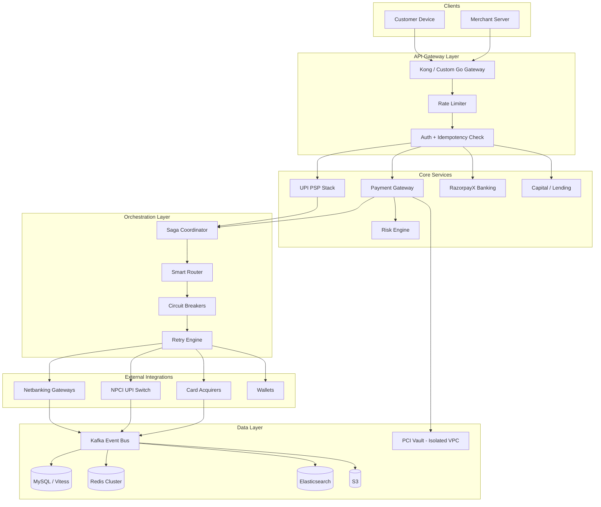
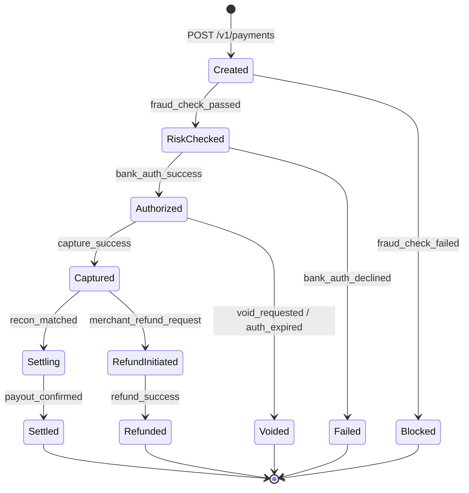
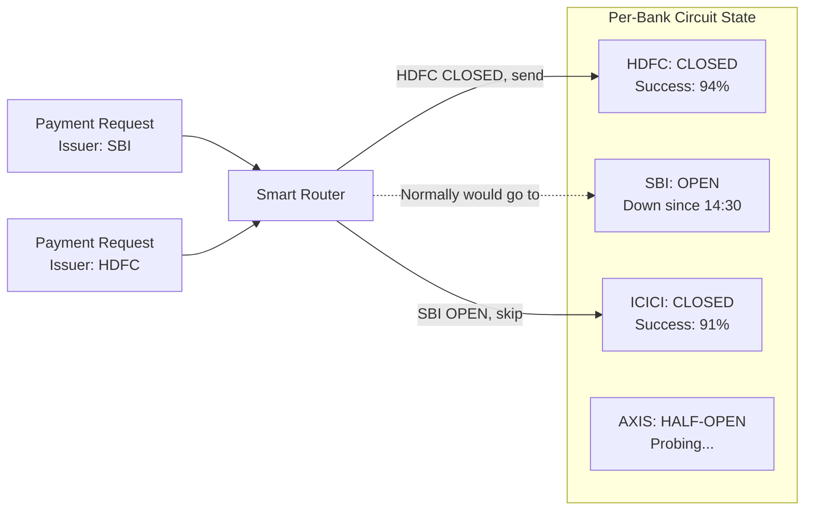

# Razorpay --- How Patterns Work in Production

> 10M+ merchants, $150B+ TPV, 5000-8000 TPS (spikes to 15K during flash sales).
> India's largest payment gateway. UPI PSP processing 800M+ UPI transactions/month.
> Go core, MySQL (Vitess-sharded), Kafka, Redis Cluster. AWS Mumbai (ap-south-1).

---

## High-Level Architecture

```
  Merchant App/Website              End Customer (UPI / Card / Netbanking)
         |                                     |
         v                                     v
  +----------------------------------------------------------+
  |              API Gateway (Kong / Custom Go)               |
  |     TLS termination, WAF, rate limiting, auth, routing    |
  +-----+----------+----------+----------+---------+---------+
        |          |          |          |         |
        v          v          v          v         v
  +---------+ +---------+ +---------+ +---------+ +---------+
  | Payment | |  UPI    | | Razor-  | | Capital | |  Risk   |
  | Gateway | |  PSP    | | payX    | | Lending | | Engine  |
  | Service | | Stack   | | Banking | | Engine  | | (Fraud) |
  |  (Go)   | |  (Go)   | |  (Go)   | | (Go/Py) | | (Go/Py) |
  +---------+ +---------+ +---------+ +---------+ +---------+
        |          |          |          |         |
        v          v          v          v         v
  +----------------------------------------------------------+
  |        Orchestration Layer (Saga Coordinator, Go)         |
  |  Routing engine, retry logic, circuit breakers, locks     |
  +-----+----------+----------+----------+---------+---------+
        |          |          |          |
        v          v          v          v
  +---------+ +---------+ +---------+ +---------+
  |  Card   | |  UPI    | | Net-    | | Wallet  |
  | Acquir- | |  NPCI   | | banking | | Integr- |
  |  ers    | | Switch  | | Banks   | | ations  |
  +---------+ +---------+ +---------+ +---------+
        |          |          |          |
        +----------+----------+----------+
                   |
                   v
  +----------------------------------------------------------+
  |             Kafka Event Bus (Multi-Cluster)               |
  |   tx-events, recon, settlements, webhooks, audit-log     |
  +-----+----------+----------+----------+---------+---------+
        |          |          |          |         |
        v          v          v          v         v
  +---------+ +---------+ +---------+ +---------+ +---------+
  | MySQL   | | Redis   | | Elastic-| | S3      | | PCI DSS |
  | (Vitess)| | Cluster | | search  | | Docs    | | Vault   |
  | Sharded | |         | |         | |         | | (Isol.) |
  +---------+ +---------+ +---------+ +---------+ +---------+
```



---

## Pattern Deep Dives

---

### Pattern 1: Saga Pattern --- Payment Lifecycle Orchestration

> **Link:** [[03_design_patterns/saga_pattern]]

**The Problem:**
A single payment touches 4-6 distributed systems: create order in MySQL, run fraud check, authorize with bank, debit customer, credit merchant, send webhook. If step 4 succeeds (bank debits customer) but step 5 fails (credit merchant), you have an inconsistent state where money has left the customer but not arrived at the merchant. You cannot use a traditional distributed transaction (2PC) across Razorpay, HDFC Bank, and NPCI -- these are independent organizations with no shared transaction coordinator.

**How Razorpay Uses It:**
Razorpay implements an **orchestrated saga** with the Saga Coordinator service (Go) as the central orchestrator. Each payment follows a state machine with compensating transactions at every step.

```
Payment Saga Steps (Card Flow):

  Step 1: CREATE            Step 2: RISK_CHECK         Step 3: AUTHORIZE
  +-----------------+       +-----------------+        +-----------------+
  | Insert payment  |  -->  | Run fraud rules |  -->   | Send to acquirer|
  | record (MySQL)  |       | + ML scoring    |        | (e.g., HDFC)   |
  | Status: created |       | Status: checked |        | Status: auth'd  |
  +-----------------+       +-----------------+        +-----------------+
  Compensate: soft-delete   Compensate: mark_blocked   Compensate: VOID

  Step 4: CAPTURE            Step 5: SETTLE             Step 6: WEBHOOK
  +-----------------+        +-----------------+        +-----------------+
  | Capture funds   |  -->   | Queue for T+1/  |  -->   | Notify merchant |
  | at acquirer     |        | T+2 settlement  |        | server via HTTP |
  | Status: captured|        | Status: settling|        | Status: complete|
  +-----------------+        +-----------------+        +-----------------+
  Compensate: REFUND         Compensate: hold_settle    Compensate: retry
```

**Saga Coordinator State Machine:**



**Key Implementation Details:**
- The saga coordinator stores the **current step and full history** in MySQL. If the coordinator crashes, it resumes from the last persisted step on restart.
- **Compensating transactions are pre-defined per step.** If authorization succeeds but capture fails, the coordinator issues a VOID to the acquirer automatically.
- **Two-phase payment model:** Razorpay separates `authorize` (hold funds) from `capture` (take funds). This gives merchants a window to verify inventory before capturing. The saga handles both phases and the timeout if capture never comes (auto-void after 5 days for cards).
- **UPI saga is different:** UPI collect flow is inherently async. The saga is: `initiate_collect -> await_customer_approval -> debit_request -> credit_confirm`. Each step has NPCI-mandated timeouts (e.g., 5 minutes for customer approval).

**Why Not 2PC:**
Banks are external systems. You cannot hold a distributed lock across Razorpay's MySQL and HDFC's core banking system. Sagas accept temporary inconsistency and use compensating transactions to restore consistency.

---

### Pattern 2: Event Sourcing --- Append-Only Payment Ledger

> **Link:** [[03_design_patterns/event_sourcing]]

**The Problem:**
RBI mandates that every financial transaction must have a complete, tamper-proof audit trail. Regulators can ask "show me every state change for transaction pay_XXXXX" and you must be able to reconstruct the full journey. Additionally, reconciliation requires matching internal records against bank settlement files -- you need the exact sequence of events, not just the current state.

**How Razorpay Uses It:**
Every payment state transition is appended as an immutable event to a Kafka-backed event store. The current state is a **projection** derived from replaying events.

```
Event Store for payment pay_A1B2C3:

  Event #1: { type: "payment.created",     ts: T+0ms,   data: {amount: 50000, method: "card"} }
  Event #2: { type: "risk.check_passed",   ts: T+45ms,  data: {score: 0.12, rules_matched: []} }
  Event #3: { type: "bank.auth_requested", ts: T+50ms,  data: {acquirer: "hdfc", ref: "HDF123"} }
  Event #4: { type: "bank.auth_success",   ts: T+320ms, data: {auth_code: "A9X2", rrn: "312..."} }
  Event #5: { type: "payment.authorized",  ts: T+325ms, data: {status: "authorized"} }
  Event #6: { type: "capture.requested",   ts: T+5min,  data: {triggered_by: "merchant_api"} }
  Event #7: { type: "bank.capture_success",ts: T+5min+200ms, data: {rrn: "312..."} }
  Event #8: { type: "payment.captured",    ts: T+5min+205ms, data: {status: "captured"} }
  ...
```

**Reconciliation via Event Sourcing:**

```
  Internal Event Stream (Kafka)           Bank Settlement Files (SFTP/S3)
  ================================        ================================
  payment.captured {                      HDFC_SETTLE_20260223.csv:
    pay_id: pay_A1B2C3,                   RRN,Amount,Status,Date
    amount: 50000,                        312...,500.00,SUCCESS,2026-02-23
    rrn: "312...",                         ...
    acquirer: "hdfc"
  }
            \                               /
             \                             /
              v                           v
         +----------------------------------+
         |    Reconciliation Engine (Go)    |
         |                                  |
         |  JOIN on: rrn + amount + date    |
         |                                  |
         |  Matched   --> update ledger     |
         |  Unmatched --> exception queue   |
         +----------------------------------+
```

**Key Implementation Details:**
- **Events are immutable.** No UPDATE or DELETE on the event store. Corrections are recorded as new events (e.g., `payment.amount_corrected`).
- **Projections for read models:** The payments dashboard, merchant settlement report, and analytics all read from materialized projections built by Kafka consumers. Each projection can be rebuilt by replaying from offset 0.
- **Bank-specific parsers:** India has no standard settlement file format. Each of 60+ bank integrations has a custom parser. The recon engine normalizes bank records into a common event format before matching.
- **Kafka topic design:** `tx-events` topic is partitioned by `payment_id` (ensures ordering per payment). Retention is 30 days for hot data, archived to S3 for 7-year regulatory retention.

**Why Event Sourcing (Not CRUD):**
- Regulatory compliance: RBI can ask for full transaction history at any time.
- Dispute resolution: When a customer says "I was charged but didn't get the product," you can replay the exact sequence.
- Reconciliation: Matching internal events against bank files requires knowing the exact sequence and timestamps.
- Debugging: In a system processing 5000+ TPS, event replay is the only reliable way to diagnose what happened.

---

### Pattern 3: Circuit Breaker --- Per-Bank Failover

> **Link:** [[03_design_patterns/circuit_breaker]]

**The Problem:**
India's banking infrastructure is unreliable. Individual banks go down regularly -- SBI might have a 2-hour maintenance window, HDFC's gateway might return 500s during batch processing, ICICI might have intermittent timeouts. If Razorpay keeps sending requests to a down bank, two bad things happen: (1) customer payments fail with long timeouts, (2) retry storms from Razorpay and other PSPs overwhelm the shared NPCI switch, causing healthy banks to fail too.

**How Razorpay Uses It:**
Every external integration (acquirer, bank gateway, UPI issuer, KYC provider) has an independent circuit breaker. The circuit breaker operates at the **(method, acquirer, issuer_bank)** granularity.

```
Circuit Breaker Per Integration:

  +---------+     5 failures in    +---------+     30s timer     +-----------+
  | CLOSED  | --- 60s window ----> |  OPEN   | --- expires ----> | HALF-OPEN |
  | (normal)|                      | (reject)|                   | (1 probe) |
  +---------+                      +---------+                   +-----------+
       ^                                                              |
       |                           Probe succeeds                     |
       +--------------------------------------------------------------+
       |                           Probe fails
       |                              |
       |                              v
       |                         +---------+
       +--- reset after 3 ----- |  OPEN   |
            consecutive          | (reject)|
            successes            +---------+

  Example:  Circuit: card_auth -> hdfc_acquirer
            Threshold: 5 failures in 60s
            Open duration: 30s
            Half-open probes: 1 request

  When OPEN: Route card payments to ICICI acquirer instead
```

**Multi-Bank Circuit Breaker Coordination:**



**Key Implementation Details:**
- **Granular circuits:** Not just "HDFC is down" but "HDFC card auth is down while HDFC UPI is healthy." Circuits are keyed by `(method, acquirer, operation)`.
- **Shared circuit state in Redis:** All payment service instances read circuit state from Redis. When one instance detects HDFC failures, the circuit opens for all instances simultaneously. TTL-based expiry handles the open-to-half-open transition.
- **NPCI-aware behavior:** In UPI, when a major issuer like SBI goes down (30%+ of UPI volume), Razorpay opens the circuit immediately. This prevents retry storms from overwhelming the shared NPCI switch -- a public good for the entire UPI ecosystem.
- **Metrics-driven thresholds:** Circuit thresholds are not hardcoded. They adapt based on historical success rates. A bank that normally has 95% success rate trips at 80%. A bank that normally has 85% trips at 65%.

---

### Pattern 4: Rate Limiting --- NPCI Compliance and Merchant Throttling

> **Link:** [[02_building_blocks/rate_limiter]]

**The Problem:**
Multiple rate limiting requirements converge: (1) NPCI imposes strict TPS limits on each UPI PSP -- exceed them and get blocked, (2) individual banks have contractual TPS limits with acquirers, (3) one merchant's flash sale should not starve other merchants, (4) API abuse and credential stuffing must be blocked.

**How Razorpay Uses It:**
Multi-layered rate limiting with different algorithms at each layer.

```
Rate Limiting Layers:

  Layer 1: API Gateway (Kong)
  +----------------------------------------------------------+
  | Per-IP:     100 req/min  (sliding window counter)        |
  | Per-API-Key: 1000 req/min (token bucket)                 |
  | Global:     50,000 req/s  (fixed window)                 |
  +----------------------------------------------------------+
           |
  Layer 2: Per-Merchant (Application Layer)
  +----------------------------------------------------------+
  | Standard merchant:  50 TPS                               |
  | Premium merchant:   500 TPS                              |
  | Enterprise:         5000 TPS (with pre-provisioning)     |
  | Burst: 2x sustained for 10 seconds                      |
  +----------------------------------------------------------+
           |
  Layer 3: Per-Method / Per-Acquirer
  +----------------------------------------------------------+
  | UPI total:       NPCI-assigned PSP limit (e.g., 2000 TPS)|
  | HDFC card auth:  800 TPS (contractual limit)             |
  | SBI netbanking:  200 TPS (bank-imposed)                  |
  +----------------------------------------------------------+
           |
  Layer 4: Velocity Checks (Fraud Prevention)
  +----------------------------------------------------------+
  | Per card:   5 transactions in 10 minutes                 |
  | Per phone:  10 UPI collects in 1 hour                    |
  | Per device: 20 transactions in 24 hours                  |
  +----------------------------------------------------------+
```

**Key Implementation Details:**
- **Redis-based sliding window** for most limits. Key pattern: `rl:{merchant_id}:{minute_bucket}`. INCR + EXPIRE in a single Redis pipeline. O(1) per check.
- **NPCI TPS compliance is critical.** If Razorpay exceeds its assigned PSP TPS limit, NPCI can throttle or temporarily block the PSP handle. The rate limiter for UPI has a **hard ceiling** with no burst allowance.
- **Pre-provisioned capacity for flash sales.** When Flipkart tells Razorpay about an upcoming sale, the ops team pre-increases that merchant's rate limit and pre-warms connection pools to acquirers. This avoids cold-start throttling.
- **Graceful degradation, not hard rejection.** When a merchant hits their limit, Razorpay returns HTTP 429 with `Retry-After` header and queues overflow requests in Kafka for processing within the next second (for merchants who opt in to async processing).

**See also:** [[05_case_studies/design_rate_limiter]]

---

### Pattern 5: Distributed Locking --- Payment Deduplication and Flash Sale Inventory

> **Link:** [[03_design_patterns/distributed_locking]]

**The Problem:**
Network unreliability in India causes merchant servers to retry payment creation requests. Without deduplication, a single customer click can create two charges. During flash sales, thousands of customers attempt to buy the same inventory simultaneously -- without locks, overselling occurs.

**How Razorpay Uses It:**

**Use Case A: Idempotency Locks**
```
Merchant retries POST /v1/payments with same idempotency_key:

  Request 1 (T=0):          Request 2 (T=200ms, retry):
       |                          |
       v                          v
  +----------+              +----------+
  | Redis    |              | Redis    |
  | SETNX    |              | SETNX    |
  | key=idem |              | key=idem |
  | _abc123  |              | _abc123  |
  | TTL=24h  |              | FAIL:    |
  | SUCCESS  |              | already  |
  +----+-----+              | exists   |
       |                    +----+-----+
       v                         |
  Process payment           Return cached
  Store result in Redis     response from
  with same key             first request
```

**Use Case B: Flash Sale Inventory Locks**
```
  Customer A: Buy item_123     Customer B: Buy item_123 (same time)
       |                              |
       v                              v
  Redis SETNX lock:            Redis SETNX lock:
  "inv_lock:item_123"          "inv_lock:item_123"
  TTL=30s, value=pay_A        FAIL (already held)
       |                              |
       v                              v
  Check inventory: 1 left      Queue with 5s retry
  Deduct inventory: 0               |
  Release lock                 (Lock released by A)
       |                              |
       v                              v
  Process payment              Acquire lock
                               Check inventory: 0
                               Return "out of stock"
                               Release lock
```

**Key Implementation Details:**
- **Redis SETNX with fencing tokens.** After the split-brain incident (see Failure Stories), all locks include a monotonically increasing fencing token. MySQL operations verify the fencing token before accepting writes.
- **Lock TTL is always set.** No lock can be held forever. Payment idempotency locks: 24h TTL. Inventory locks: 30s TTL. Settlement batch locks: 10 min TTL.
- **Defense-in-depth:** Redis lock is the fast path. MySQL UNIQUE constraint on `(idempotency_key, merchant_id)` is the fallback. If Redis fails, the system is slower but still correct.
- **Redlock avoided.** Razorpay evaluated Redlock (multi-node Redis lock) and chose single-node Redis + MySQL fallback instead. Simpler, and the MySQL fallback provides stronger guarantees than Redlock's probabilistic safety.

---

### Pattern 6: Sharding --- MySQL and Kafka Partitioning

> **Link:** [[03_design_patterns/sharding]]

**The Problem:**
500M+ transactions/month. A single MySQL instance cannot handle the write throughput (50K+ writes/sec at peak) or store the data volume (multiple TB of transaction data). Similarly, a single Kafka partition cannot handle 5000+ TPS with ordering guarantees.

**How Razorpay Uses It:**

**MySQL Sharding via Vitess:**

```
Shard Key: merchant_id (for payments, orders, settlements)
Shard Key: payment_id  (for events, refunds, disputes)

  +----------------------------------------------------------+
  |                    Vitess VTGate                          |
  |          (Query routing, scatter-gather)                  |
  +------+----------+----------+----------+---------+--------+
         |          |          |          |         |
    Shard 0     Shard 1     Shard 2    Shard 3   Shard N
  [merch 0-    [merch 1M   [merch 2M  [merch 3M  [merch NM
   999K]        -1.99M]     -2.99M]    -3.99M]    -(N+1)M]
    |              |           |          |          |
  +------+    +------+    +------+   +------+   +------+
  |MySQL |    |MySQL |    |MySQL |   |MySQL |   |MySQL |
  |Primary|   |Primary|   |Primary|  |Primary|  |Primary|
  |+ 2    |   |+ 2    |   |+ 2    |  |+ 2    |  |+ 2    |
  |replicas|  |replicas|  |replicas| |replicas| |replicas|
  +------+    +------+    +------+   +------+   +------+

  Why merchant_id?
  - 90% of queries are merchant-scoped (dashboard, settlement reports)
  - Merchant's payments are co-located -> no cross-shard joins
  - Hot merchants (Flipkart, Swiggy) get dedicated shards
```

**Kafka Partitioning:**

```
Topic: tx-events
  Partition key: payment_id
  Why: All events for one payment land in same partition -> ordering guaranteed
  Partitions: 256 (allows parallel consumers while maintaining per-payment order)

Topic: settlement-events
  Partition key: merchant_id
  Why: Settlement calculation needs all of a merchant's transactions together
  Partitions: 128

Topic: webhook-delivery
  Partition key: merchant_id
  Why: Webhooks for one merchant should be ordered (payment.created before payment.captured)
  Partitions: 64
```

**Key Implementation Details:**
- **Vitess for transparent sharding.** Application code writes normal SQL. Vitess VTGate routes queries to the correct shard. Cross-shard queries (e.g., "total volume across all merchants") use scatter-gather but are only used for analytics, never on the payment hot path.
- **Hot shard mitigation.** Enterprise merchants like Flipkart can generate more TPS than an entire shard. These merchants are assigned dedicated shards that can be independently scaled.
- **Resharding without downtime.** Vitess supports online resharding. Razorpay has resharded multiple times as merchant count grew from 100K to 10M. During resharding, writes briefly pause (<1s) per shard while the cut-over happens.

---

### Pattern 7: Idempotency --- Payment Deduplication

> **Link:** [[03_design_patterns/idempotency]]

**The Problem:**
In India, network connections drop frequently. Mobile networks, corporate firewalls, and ISP issues cause merchant servers to timeout and retry. A customer pressing "Pay" once can generate 2-3 identical requests hitting Razorpay. Processing all of them means charging the customer multiple times.

**How Razorpay Uses It:**
Every payment creation endpoint requires an `Idempotency-Key` header. The same key with the same request body always returns the same response.

```
Idempotency Flow:

  POST /v1/payments
  Headers: { Idempotency-Key: "order_123_attempt_1", Authorization: "..." }
  Body: { amount: 50000, currency: "INR", method: "card", ... }

  Step 1: Hash request = SHA256(merchant_id + idempotency_key)
  Step 2: Redis GET hash
          |
          +-- MISS: Acquire lock, process payment, store (hash -> response) with 24h TTL
          |
          +-- HIT:  Return stored response immediately (HTTP 200, same payment object)

  Critical: The stored response includes the full HTTP response (status code, body, headers).
  A retry sees EXACTLY what the first request saw.
```

**Idempotency Scope:**

| Endpoint | Idempotency Key | TTL | Notes |
|----------|----------------|-----|-------|
| `POST /v1/payments` | Merchant-provided or auto-generated | 24h | Most critical -- prevents double charges |
| `POST /v1/refunds` | `refund_{payment_id}_{amount}` | 24h | Prevents double refunds |
| `POST /v1/transfers` | Merchant-provided | 24h | Prevents double payouts |
| `POST /v1/settlements` | `settle_{batch_id}` | 7d | Prevents double settlement |

**Key Implementation Details:**
- **Idempotency key is scoped to merchant.** Two different merchants can use the same key string without conflict. The actual key is `SHA256(merchant_id + key)`.
- **Request body fingerprint.** If a merchant sends the same idempotency key but a different request body (different amount), Razorpay returns HTTP 422 (Unprocessable Entity) -- this is likely a bug in the merchant's code.
- **Two-layer storage:** Redis (fast, 24h TTL) + MySQL UNIQUE constraint (permanent, slower fallback). After the Redis split-brain incident, the MySQL layer was added as defense-in-depth.
- **In-flight deduplication.** If two identical requests arrive within milliseconds of each other (before the first one completes), the second request waits on a Redis lock rather than starting a new payment. When the first completes, the second returns the same result.

---

### Pattern 8: Retry with Smart Routing --- Thompson Sampling

> **Link:** [[03_design_patterns/retry_with_backoff]]

**The Problem:**
India has 15+ card acquirers and 250+ issuing banks. Success rates vary wildly: HDFC acquirer might have 96% success for HDFC-issued cards but only 88% for SBI-issued cards. These rates change throughout the day (batch processing windows, maintenance). Static routing leaves money on the table. A 1% success rate improvement at Razorpay's scale means millions of additional successful transactions per month.

**How Razorpay Uses It:**
The Smart Routing Engine uses **Thompson Sampling** (a multi-armed bandit algorithm) to dynamically route payments to the acquirer most likely to succeed, and automatically retries through alternative routes on soft failures.

```
Thompson Sampling Routing:

  For each (issuer_bank, card_bin, amount_bucket, acquirer) combination,
  maintain a Beta distribution: Beta(successes + 1, failures + 1)

  On each payment:
  1. Sample from each acquirer's Beta distribution
  2. Route to the acquirer with highest sampled value
  3. Observe outcome (success/failure)
  4. Update the Beta distribution

  Example for an SBI-issued Visa card, amount 500-5000:
  +------------------+------------+----------+---------+-----------------+
  | Acquirer         | Successes  | Failures | Mean    | Sampled Value   |
  +------------------+------------+----------+---------+-----------------+
  | HDFC Acquirer    | 9,412      | 623      | 93.8%   | 94.1% (sampled) |
  | ICICI Acquirer   | 4,201      | 389      | 91.5%   | 90.8% (sampled) |
  | Axis Acquirer    | 1,823      | 241      | 88.3%   | 89.2% (sampled) |
  | Juspay           |    87      |  14      | 86.1%   | 82.3% (sampled) |
  +------------------+------------+----------+---------+-----------------+
  Decision: Route to HDFC (highest sampled value = 94.1%)

  Why Thompson Sampling over simple "pick highest success rate"?
  - Exploration: Juspay has low samples, so its distribution is wide.
    Occasionally it will sample HIGH, sending traffic to gather more data.
  - Exploitation: HDFC has many samples, narrow distribution, reliably high.
  - Adapts automatically: If HDFC starts failing, its distribution shifts
    down and other acquirers start winning samples.
```

**Auto-Retry on Soft Decline:**

```
  Payment for Rs 5000 on SBI card:
       |
       v
  Route to HDFC (Thompson Sampling winner)
       |
       v
  HDFC returns: "BT" (Bank Timeout) -- SOFT DECLINE
       |
       v
  Classify decline: SOFT (retryable)
  Decrement retry budget: 2 -> 1
       |
       v
  Route to ICICI (next best from Thompson Sampling, exclude HDFC)
       |
       v
  ICICI returns: "00" (Approved) -- SUCCESS
       |
       v
  Update Thompson Sampling distributions:
    HDFC: failures += 1
    ICICI: successes += 1
```

**Key Implementation Details:**
- **Success rate DB updated every 60 seconds** from Kafka events. Redis stores pre-computed Beta distribution parameters per routing dimension.
- **Decline code classification is per-bank.** Error code "05" might mean "Do Not Honor" (hard decline) from one bank and "Temporary Issue" (soft decline) from another. Razorpay maintains a continuously updated mapping.
- **Retry budget:** Max 2 retries, total time budget 30 seconds. Tracked in Redis with TTL. Prevents infinite retry loops.
- **Success rate improvement:** Thompson Sampling routing achieves 5-8% higher success rates compared to static routing in A/B tests.

---

### Pattern 9: Bulkhead --- PCI DSS Isolation

> **Link:** [[03_design_patterns/bulkhead_pattern]]

**The Problem:**
Razorpay handles credit/debit card numbers (PAN), which falls under PCI DSS Level 1 compliance. If card data flows through the main application, the ENTIRE infrastructure is in PCI scope -- every server, every developer's laptop, every CI/CD pipeline needs PCI audit. This is prohibitively expensive and operationally painful.

**How Razorpay Uses It:**
Card data is isolated in a separate VPC (the "PCI Vault") that is physically and logically separated from the main application. The main application only sees tokens.

```
Bulkhead Architecture:

  +---------------------------------------------+  +------------------------+
  |          Main Application VPC                |  |   PCI DSS Vault VPC    |
  |                                              |  |   (Isolated Bulkhead)  |
  |  +----------+  +----------+  +----------+   |  |  +------------------+  |
  |  | Payment  |  | Merchant |  | Webhooks |   |  |  | Tokenization     |  |
  |  | Service  |  | Dashboard|  | Service  |   |  |  | Service          |  |
  |  +----+-----+  +----------+  +----------+   |  |  | - Encrypt PAN    |  |
  |       |                                      |  |  | - Store in HSM   |  |
  |       | (only tok_XXXXX)                     |  |  | - Return token   |  |
  |       +---------- mTLS ----------------------+--+->| +---->           |  |
  |                                              |  |  +--------+---------+  |
  |  +----------+  +----------+  +----------+   |  |           |            |
  |  | MySQL    |  | Redis    |  | Kafka    |   |  |  +--------v---------+  |
  |  | (tokens) |  | (tokens) |  | (tokens) |   |  |  | Card Vault DB    |  |
  |  +----------+  +----------+  +----------+   |  |  | (Encrypted PAN)  |  |
  |                                              |  |  | + HSM keys       |  |
  |  Zero card numbers in this VPC.              |  |  +------------------+  |
  |  PCI audit scope: NONE for this VPC.         |  |                        |
  +---------------------------------------------+  |  PCI audit scope:      |
                                                    |  THIS VPC ONLY.        |
                                                    +------------------------+
```

**Beyond Card Data -- Multi-Dimensional Bulkheads:**

| Bulkhead | What It Isolates | Why |
|----------|-----------------|-----|
| PCI Vault VPC | Card numbers (PAN) | Limit PCI DSS audit scope |
| Per-acquirer connection pool | HTTP connections to each bank | Slow bank cannot exhaust shared pool |
| Per-merchant-tier thread pool | Processing threads per merchant tier | Enterprise merchant spike does not affect SMBs |
| Kafka consumer group isolation | Separate consumer groups per domain | Settlement lag does not slow webhook delivery |
| KYC service isolation | Aadhaar/PAN verification | Third-party KYC provider outage does not affect payments |

**Key Implementation Details:**
- **mTLS between VPCs.** Communication between the main VPC and PCI Vault uses mutual TLS with certificate pinning. No other service can talk to the PCI Vault.
- **Token format:** `tok_` prefix + 20 character random string. Tokens are not reversible -- you cannot derive the card number from the token. Only the PCI Vault can detokenize.
- **Per-acquirer connection pools** are sized based on contractual TPS limits. HDFC gets 800 connections, SBI gets 200, etc. Implemented in Go with `http.Client` per acquirer with `MaxIdleConnsPerHost` tuned.
- **Result:** PCI DSS audit covers only the PCI Vault VPC (~20 servers) instead of the entire infrastructure (~2000+ servers). Annual audit cost reduced by an estimated 80%.

---

### Pattern 10: Back Pressure --- Bank Gateway Throttling

> **Link:** [[03_design_patterns/back_pressure]]

**The Problem:**
Banks go down or slow down regularly. When HDFC's gateway responds in 10 seconds instead of the usual 300ms, Razorpay's thread pools fill up, connections are exhausted, and the system starts failing even for other banks. Additionally, when a bank comes back online after downtime, sending a burst of queued requests can overwhelm it again (thundering herd).

**How Razorpay Uses It:**
Back pressure propagates from bank gateways all the way back to the API gateway, with controlled queuing and draining at each layer.

```
Back Pressure Flow:

  Normal State (HDFC responding in 300ms):
  +---------+       +---------+       +---------+
  | API GW  | 5000  | Payment | 5000  |  HDFC   | 5000
  | (Kong)  | TPS   | Service | TPS   | Gateway | TPS
  |         |------>|  (Go)   |------>|         |-------> Success
  +---------+       +---------+       +---------+

  HDFC Slowing Down (responding in 5s):
  +---------+       +---------+       +---------+
  | API GW  | 5000  | Payment | 5000  |  HDFC   |  200     (thread pool filling)
  | (Kong)  | TPS   | Service | TPS   | Gateway | TPS
  |         |------>|  (Go)   |------>|         |-------> Slow
  +---------+       +---------+       +---------+
                         |
                    Detect: HDFC p99 > 2s
                         |
                         v
  Back Pressure Response:
  1. Circuit breaker: HALF-OPEN for HDFC
  2. Reduce HDFC traffic to 50 TPS (probe rate)
  3. Queue HDFC-destined payments in Kafka: "bank-overflow" topic
  4. Route new HDFC payments to ICICI (via Smart Router)
  5. Return 202 Accepted to merchants (async processing)

  HDFC Recovers:
  +---------+       +---------+       +---------+
  | API GW  | 5000  | Payment | 2000  |  HDFC   | 2000    (draining queue)
  | (Kong)  | TPS   | Service | TPS   | Gateway | TPS
  |         |------>|  (Go)   |------>|         |-------> Success
  +---------+       |  +      |       +---------+
                    |  |      |
                    | drain   |
                    | queue   |
                    | at 500  |
                    | TPS     |
                    +---------+

  Drain Strategy:
  - Start at 10% of normal rate (500 TPS)
  - Increase by 20% every 30 seconds if success rate > 90%
  - Full rate restored after ~3 minutes of healthy responses
  - This prevents thundering herd on bank recovery
```

**Key Implementation Details:**
- **Timeout budget propagation.** Each payment has a total time budget (e.g., 30s). As it flows through the system, remaining budget is passed downstream. If only 5s remains when reaching the bank gateway, and the bank's p50 is currently 8s, the system skips the bank and routes elsewhere.
- **Kafka as overflow buffer.** Payments that cannot be processed immediately are queued in a `bank-overflow` Kafka topic, partitioned by bank. A separate consumer drains the queue when the bank recovers. Merchants are notified asynchronously via webhook.
- **Graduated ramp-up.** When a bank recovers, traffic is restored gradually (10% -> 30% -> 50% -> 80% -> 100%) over ~3 minutes. Each step requires sustained success rate > 90% before proceeding.
- **Merchant-visible degradation.** When back pressure is active, the checkout page dynamically hides the affected payment method or shows "temporarily unavailable." This is better UX than showing the method and then failing.

---

## Pattern Summary

| # | Pattern | Where Used | Key Mechanism | Why Critical |
|---|---------|-----------|---------------|-------------|
| 1 | **Saga** [[03_design_patterns/saga_pattern]] | Payment lifecycle, UPI flows, settlement | Orchestrated state machine + compensating transactions | Multi-step financial ops across banks need coordinated rollback |
| 2 | **Event Sourcing** [[03_design_patterns/event_sourcing]] | Payment ledger, reconciliation, audit | Append-only events, projections for reads | RBI compliance mandates full transaction history |
| 3 | **Circuit Breaker** [[03_design_patterns/circuit_breaker]] | Every bank integration, NPCI, KYC providers | Per-(method, acquirer, bank) circuit with shared Redis state | Bank downtime is frequent; prevents cascade to healthy banks |
| 4 | **Rate Limiting** [[02_building_blocks/rate_limiter]] | API gateway, per-merchant, per-method, NPCI limits | Multi-layer: sliding window (Redis), token bucket, velocity | NPCI PSP limits are hard; one merchant must not starve others |
| 5 | **Distributed Locking** [[03_design_patterns/distributed_locking]] | Idempotency, inventory locks, settlement batches | Redis SETNX + fencing tokens + MySQL fallback | Prevents double charges (financial correctness) |
| 6 | **Sharding** [[03_design_patterns/sharding]] | MySQL (Vitess, by merchant_id), Kafka (by payment_id) | Range sharding with hot-shard isolation | 500M+ tx/month cannot fit on single node |
| 7 | **Idempotency** [[03_design_patterns/idempotency]] | All payment creation/refund/transfer endpoints | Hash(merchant_id + key) -> Redis + MySQL UNIQUE | Network unreliability causes retries; must not double-charge |
| 8 | **Smart Routing + Retry** [[03_design_patterns/retry_with_backoff]] | Payment routing to acquirers | Thompson Sampling bandit + soft/hard decline classification | 5-8% success rate improvement = millions more successful payments |
| 9 | **Bulkhead** [[03_design_patterns/bulkhead_pattern]] | PCI Vault VPC, per-acquirer pools, per-merchant tiers | Physical and logical isolation of failure domains | Limits PCI audit scope; prevents cross-domain contamination |
| 10 | **Back Pressure** [[03_design_patterns/back_pressure]] | Bank gateway throttling, overflow queuing | Timeout budgets, Kafka overflow buffer, graduated ramp-up | Prevents thundering herd on recovery; graceful degradation |

---

## Failure Stories

### 1. Demonetization Surge (November 2016)

- **What happened:** Indian government announced demonetization of Rs 500/1000 notes on November 8, 2016. Digital payment volumes surged 10x in days. Every shop, auto-rickshaw, and street vendor suddenly needed digital payments.
- **Impact:** MySQL connection pool exhaustion. Kafka consumer lag spiked to millions of messages. Webhook delivery delays of hours. The PHP monolith could not handle the concurrency. Settlement reconciliation fell days behind.
- **Root cause:** System designed for 200 TPS hit 2000+ TPS. No sharding, no async processing, no circuit breakers. Everything was synchronous through one MySQL instance.
- **Fix (immediate):** Emergency MySQL read replicas, Kafka partition increases, horizontal scaling of webhook workers.
- **Fix (long-term):** This event was the catalyst for Razorpay's architecture transformation -- migration from PHP monolith to Go microservices, introduction of Kafka event bus, MySQL sharding via Vitess, and implementation of circuit breakers on all bank integrations.
- **Pattern lesson:** You cannot predict black swan events in India (policy-driven 10-100x traffic spikes). **Back pressure** and **sharding** must be in place before you need them.

### 2. UPI Cascade Failures

- **What happened:** SBI (handling 30%+ of UPI volume) experienced gateway issues. PhonePe, Google Pay, Paytm, and Razorpay all kept retrying SBI transactions. The combined retry storm overwhelmed NPCI's central UPI switch. Healthy banks (HDFC, ICICI) started failing because NPCI could not process their transactions either.
- **Impact:** UPI success rates dropped to 60% across the entire ecosystem for 2+ hours. Not just Razorpay -- every UPI PSP was affected.
- **Root cause:** No per-bank circuit breakers. Retries were unbounded. The shared NPCI switch became the bottleneck.
- **Fix:** Implemented per-bank **circuit breakers** with aggressive thresholds. When SBI's success rate drops below 70%, Razorpay opens the circuit within 30 seconds and stops sending SBI requests entirely. Combined with **back pressure** -- SBI-destined payments are queued, not retried.
- **Pattern lesson:** In shared infrastructure (NPCI), **circuit breakers are a public good.** Your retries are everyone's problem.

### 3. Redis Split-Brain (AWS Maintenance Event)

- **What happened:** During scheduled AWS maintenance, Redis Cluster experienced a network partition. Two nodes both believed they were primary (split-brain).
- **Impact:** Idempotency checks gave inconsistent results. Some payments were processed twice -- customers charged twice for the same order. Distributed locks became unreliable -- settlement batches were processed by multiple workers simultaneously.
- **Root cause:** Redis Cluster's failover is not linearizable. During the partition, both nodes accepted writes. The idempotency system had no fallback beyond Redis.
- **Fix:** Added **defense-in-depth for idempotency** -- MySQL UNIQUE constraint on `(merchant_id, idempotency_key)` as a fallback when Redis is unreliable. All **distributed locks** now use fencing tokens; downstream MySQL operations verify the fencing token before accepting writes.
- **Pattern lesson:** Never rely on a single layer for financial correctness. **Idempotency** needs two-layer verification. **Distributed locks** need fencing tokens.

### 4. Settlement File Format Changes

- **What happened:** A major acquiring bank changed their settlement CSV format (reordered columns, changed date format from DD/MM/YYYY to YYYY-MM-DD) without prior notice.
- **Impact:** Reconciliation engine parsed the file successfully (no errors) but matched wrong columns. Amounts were mismatched. Merchant settlements were incorrect for 8 hours before someone noticed.
- **Root cause:** Parser did positional column parsing, not header-based. No schema validation on ingested data. No anomaly detection on reconciliation match rates.
- **Fix:** All bank parsers now use header-based column resolution. Schema validation on every file ingestion. Anomaly alerting when reconciliation match rate drops below 99%. Bank format versioning with automated detection of format changes.
- **Pattern lesson:** **Event sourcing** is only as good as the data going in. External data sources (bank files) need rigorous schema validation. Trust nothing from external systems.

---

## Interview Quick Reference

| Question | Key Patterns | Key Insight |
|----------|-------------|------------|
| "Design a payment gateway" | Saga, Circuit Breaker, Idempotency, Smart Routing | Separate authorize/capture. Idempotency is non-negotiable. Per-bank circuit breakers. |
| "Design UPI payment flow" | Saga, Event Sourcing, Circuit Breaker, Rate Limiting | Async by nature. NPCI is shared switch. PSP TPS limits. Per-bank isolation. |
| "Design reconciliation system" | Event Sourcing, Saga, Distributed Locking | Stream + batch hybrid. Bank-specific parsers. Idempotent settlement. |
| "Design smart routing engine" | Thompson Sampling (Retry), Circuit Breaker, Sharding | Multi-armed bandit. Soft vs hard decline classification. Explore/exploit. |
| "Design fraud detection" | Rate Limiting (velocity), Bulkhead (PCI isolation), Event Sourcing (audit) | <50ms budget. Hot-reloadable rules. ML + rules hybrid. |
| "Handle flash sale traffic" | Rate Limiting, Distributed Locking, Back Pressure, Sharding | Pre-provision. Per-merchant isolation. Inventory locks. Overflow queue. |
| "What if a bank goes down?" | Circuit Breaker, Back Pressure, Smart Routing | Open circuit fast. Queue overflow. Graduated ramp-up on recovery. |
| "Prevent double charging" | Idempotency, Distributed Locking | Two-layer: Redis + MySQL UNIQUE. Fencing tokens. In-flight dedup. |

**India Fintech-Specific Angles (also see [[17_company_interview_guide/phonepe_cred]]):**
- UPI architecture: PSP vs TPAP (Third Party App Provider). Razorpay is a PSP with direct NPCI connectivity.
- NPCI is the single point of aggregation for all UPI. When it slows, everyone suffers. Circuit breakers are a public good.
- RBI PA/PG license requirements: KYC, fraud monitoring, settlement timelines, escrow accounts.
- PCI DSS Level 1: Why bulkhead isolation for card data reduces audit scope from 2000 servers to 20.
- Settlement cycles: T+1/T+2 mean merchants get paid 1-2 days after transactions. Reconciliation must be automated.
- No standard bank APIs in India: 60+ banks, each with different error codes, file formats, and quirks.

---

## Startup Playbook --- What to Steal from Razorpay

### 1. Idempotency from Day One
Do not wait for your first double-charge incident. Every state-mutating endpoint gets an idempotency key. Redis SETNX with TTL is 20 lines of middleware code. Add MySQL UNIQUE constraint as fallback. This is the highest-ROI pattern for any payment system.

### 2. Event Sourcing for Financial Records
Never UPDATE or DELETE financial records. Append-only event log from the start. You will need it for: debugging production issues, regulatory audits, dispute resolution, reconciliation. Kafka + append-only MySQL table. Start simple, it pays off immediately.

### 3. Circuit Breakers on All External Integrations
If you integrate with even one bank, wrap it in a circuit breaker. Libraries: `gobreaker` (Go), `resilience4j` (Java), `pybreaker` (Python). Configure: 5 failures in 60s to open, 30s open duration, 1 probe in half-open. Tune from there.

### 4. Per-Tenant Rate Limiting
Multi-tenant systems need isolation from day one. One bad API integration should not take down your system. Token bucket per API key. Start with generous limits, tighten as you learn traffic patterns.

### 5. Separate Card Data Early
Even before PCI DSS audit, separate card handling into its own service. Use a third-party vault (Skyflow, Very Good Security) if you cannot build your own. Token everything. When audit time comes, your scope is tiny.

### 6. Smart Routing is a Moat
If you work with multiple acquirers/payment processors, start collecting success rate data immediately. Even a simple "route to the acquirer with highest success rate in the last hour" beats static routing. Graduate to Thompson Sampling when you have volume.

### 7. Bank-Specific Adapters with Hot Config
Indian banks change behavior without notice. Build an adapter layer where per-bank configuration (timeouts, error code mappings, retry behavior) can be changed via config without code deployment. Hot-reload from a config service every 30-60 seconds.

### 8. Reconciliation Automation
Manual reconciliation does not scale past 100 transactions/day. Build automated recon from the start: ingest bank files, normalize to common schema, match on reference numbers. Alert on mismatches. The engineering cost is low; the operational cost of not doing it is enormous.

---

**Cross-links:**
- [[03_design_patterns/saga_pattern]] | [[03_design_patterns/event_sourcing]] | [[03_design_patterns/circuit_breaker]]
- [[02_building_blocks/rate_limiter]] | [[03_design_patterns/distributed_locking]] | [[03_design_patterns/sharding]]
- [[03_design_patterns/idempotency]] | [[03_design_patterns/retry_with_backoff]] | [[03_design_patterns/bulkhead_pattern]]
- [[03_design_patterns/back_pressure]] | [[05_case_studies/design_rate_limiter]]
- [[17_company_interview_guide/phonepe_cred]] | [[18_real_world_architecture/stripe]]

---

*Last updated: 2026-02-23*
