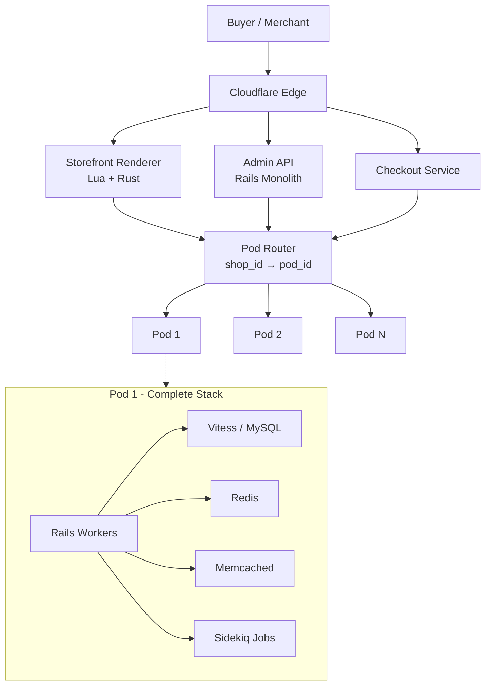
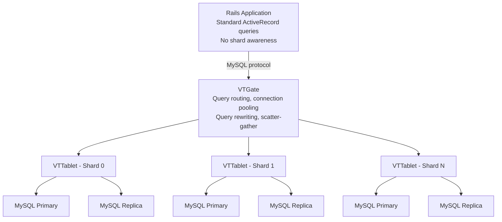
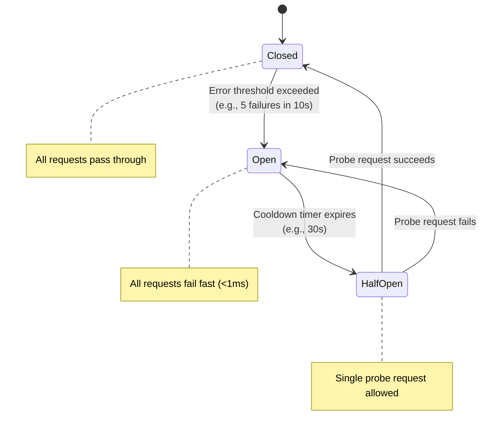
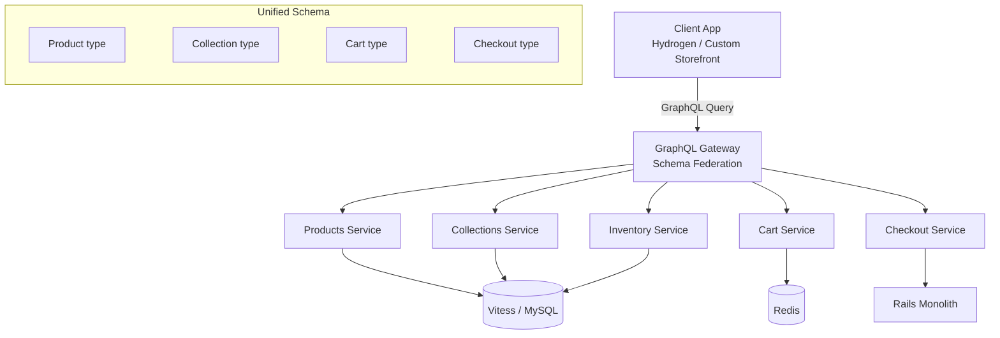

# Shopify — How Patterns Work in Production

> 2M+ merchants, $236B+ GMV. Key: Pod architecture, Vitess, Flash sale infra, Storefront Renderer. Open-source: Toxiproxy, Semian.

---

## Company Snapshot

| Metric | Value |
|---|---|
| Merchants | 2M+ active across 175+ countries |
| GMV (2023) | $236B+ gross merchandise volume |
| BFCM 2023 peak | $4.2M/minute, $9.3B+ over weekend |
| Languages | Ruby (3M+ line monolith), Go (infra), Rust (perf), TypeScript (frontend) |
| Datastores | MySQL via Vitess, Redis, Memcached, Elasticsearch |
| Infrastructure | GCP, Kubernetes, Cloudflare edge |
| Open-source | Toxiproxy, Semian, Liquid, Packwerk, Polaris, Hydrogen |
| Deploys/day | ~80 merges/day via Shipit (continuous deployment) |

---

## High-Level Architecture

```
                          ┌─────────────────────────┐
                          │     Buyer / Merchant     │
                          │   Browser / Mobile App   │
                          └────────────┬────────────┘
                                       │
                                       ▼
                        ┌──────────────────────────────┐
                        │       Cloudflare Edge         │
                        │  DDoS, WAF, rate limiting,    │
                        │  bot detection, TLS, caching  │
                        └──────────────┬───────────────┘
                                       │
                  ┌───────────────────┬┴──────────────────┐
                  │                   │                    │
                  ▼                   ▼                    ▼
     ┌──────────────────┐  ┌──────────────────┐  ┌──────────────────┐
     │   Storefront      │  │   Admin / API    │  │  Checkout        │
     │   Renderer (SFR)  │  │   Rails Monolith │  │  Service         │
     │   Lua + Rust      │  │   GraphQL + REST │  │  (Rails)         │
     │   @ Edge          │  │                  │  │                  │
     └────────┬─────────┘  └────────┬─────────┘  └────────┬─────────┘
              │                     │                      │
              └─────────────────────┼──────────────────────┘
                                    │
                                    ▼
                        ┌───────────────────────┐
                        │     Pod Router         │
                        │  shop_id → pod_id      │
                        │  (lightweight lookup)  │
                        └───────────┬───────────┘
                                    │
              ┌─────────────────────┼─────────────────────┐
              │                     │                     │
              ▼                     ▼                     ▼
     ┌─────────────┐      ┌─────────────┐       ┌─────────────┐
     │   Pod 1     │      │   Pod 2     │       │   Pod N     │
     │  Rails x N  │      │  Rails x N  │       │  Rails x N  │
     │  Sidekiq    │      │  Sidekiq    │       │  Sidekiq    │
     │  Vitess     │      │  Vitess     │       │  Vitess     │
     │  Redis      │      │  Redis      │       │  Redis      │
     │  Memcached  │      │  Memcached  │       │  Memcached  │
     └─────────────┘      └─────────────┘       └─────────────┘
```



---

## Pattern Deep Dives

---

### Pattern 1: Cell-Based Architecture — Pods

> **Pattern:** [[03_design_patterns/cell_based_architecture]]
> **Core idea:** Divide the entire platform into isolated, self-contained units (cells/pods), each with a complete stack. Route tenants to a specific cell.

#### Why Shopify Needed This

By 2018-2019, the single-tenant monolith could not scale further. A single MySQL primary was the bottleneck. Rather than decomposing into microservices (rewriting 3M+ lines of Ruby), they chose cell-based architecture to achieve horizontal scaling while preserving the monolith's development velocity.

#### How It Works

```
                    ┌─────────────────────────────────────┐
                    │           Global Router              │
                    │  shop_id → pod_id lookup             │
                    │  (lightweight Redis/config)          │
                    └───────────────┬─────────────────────┘
                                    │
           ┌────────────────────────┼────────────────────────┐
           │                        │                        │
           ▼                        ▼                        ▼
   ┌───────────────┐       ┌───────────────┐        ┌───────────────┐
   │    Pod A       │       │    Pod B       │        │    Pod C       │
   │               │       │               │        │               │
   │  Shops:       │       │  Shops:       │        │  Shops:       │
   │  1-50,000     │       │  50,001-      │        │  100,001-     │
   │               │       │  100,000      │        │  150,000      │
   │  ┌──────────┐ │       │  ┌──────────┐ │        │  ┌──────────┐ │
   │  │ Rails x N│ │       │  │ Rails x N│ │        │  │ Rails x N│ │
   │  │ Sidekiq  │ │       │  │ Sidekiq  │ │        │  │ Sidekiq  │ │
   │  │ Vitess   │ │       │  │ Vitess   │ │        │  │ Vitess   │ │
   │  │ Redis    │ │       │  │ Redis    │ │        │  │ Redis    │ │
   │  │ Memcached│ │       │  │ Memcached│ │        │  │ Memcached│ │
   │  └──────────┘ │       │  └──────────┘ │        │  └──────────┘ │
   │               │       │               │        │               │
   │  Blast radius:│       │  Blast radius:│        │  Blast radius:│
   │  ~1-2% total  │       │  ~1-2% total  │        │  ~1-2% total  │
   └───────────────┘       └───────────────┘        └───────────────┘
```

#### Production Numbers

| Metric | Value |
|---|---|
| Total pods | 100+ in production |
| Shops per pod | Tens of thousands |
| Blast radius per pod | ~1-2% of total merchants |
| Pod composition | Full clone of application (not a partial shard) |
| Large merchants | Dedicated pods (e.g., Kylie Cosmetics) |

#### Key Design Decisions

- **Chose pod architecture over microservices** -- kept monolith intact, avoided rewriting millions of lines
- Each pod is a **full clone** of the application, not a shard of specific tables
- Pod assignment uses consistent hashing; rebalancing happens offline
- **Live migration** -- shops can be moved between pods with minimal downtime
- Cross-pod operations (Shopify Payments aggregation, analytics) use separate global services
- Pod routing is a lightweight lookup, not a heavyweight proxy

#### What Makes This Different From Generic Cell Architecture

Most cell architectures shard at the infrastructure level. Shopify's pods shard the **entire application stack** -- compute, data, cache, jobs. This means:
- A pod failure is fully contained (no shared MySQL, no shared Redis)
- Each pod can be independently scaled, deployed, or drained
- The monolith code is identical across pods; only the data differs

#### Interview Angle

> "Shopify runs 100+ identical pods, each with full Rails + Vitess + Redis + Memcached. A pod failure affects only ~1-2% of merchants. This is how you scale a monolith without microservices."

---

### Pattern 2: Sharding via Vitess

> **Pattern:** [[03_design_patterns/sharding]]
> **Core idea:** Horizontal partitioning of MySQL via Vitess middleware, using shop_id as the shard key, transparent to the application layer.

#### Why Shopify Needed This

By 2016-2017, the largest MySQL instances hit vertical scaling limits -- multi-TB databases, replication lag, schema migration pain. They needed horizontal sharding but could not rewrite millions of ActiveRecord queries.

#### How It Works



#### Vitess Components in Shopify's Stack

| Component | Role |
|---|---|
| **VTGate** | MySQL-compatible proxy. Receives queries from Rails, parses them, routes to correct shard. Connection pooling (multiplexes thousands of Rails connections). |
| **VTTablet** | Runs alongside each MySQL instance. Manages replication, health checks, query filtering. |
| **Topology service** | Stores shard map and tablet health (backed by etcd). |
| **VReplication** | Online schema migrations (gh-ost style) orchestrated across all shards simultaneously. |

#### Shard Key: shop_id

This is the critical decision. **All data for a single shop lives on the same shard.** This means:

```
  Query: SELECT * FROM orders WHERE shop_id = 12345 AND created_at > '2024-01-01'

  VTGate routing:
    1. Extract shop_id = 12345 from WHERE clause
    2. Hash(12345) → shard_3
    3. Route query ONLY to shard_3
    4. Return results directly (no scatter-gather)

  Anti-pattern (avoided in hot paths):
    SELECT * FROM orders WHERE created_at > '2024-01-01'
    → No shop_id → scatter-gather across ALL shards → expensive
```

#### Production Numbers

| Metric | Value |
|---|---|
| MySQL instances | Hundreds across all pods |
| Total data | Petabytes across all shards |
| Schema migrations | Run across all shards simultaneously via VReplication |
| Read replicas | Used extensively for catalog/analytics reads |
| ActiveRecord changes required | Zero (VTGate speaks MySQL protocol) |

#### Key Design Decisions

- Adopted Vitess (YouTube/Google) instead of building custom sharding middleware
- Contributed significant patches upstream to the Vitess open-source project
- Cross-shard queries **avoided in hot paths**; aggregation done asynchronously in separate services
- Read/write splitting: reads routed to replicas, writes to primary

#### Interview Angle

> "Vitess gave Shopify horizontal MySQL sharding without changing a single ActiveRecord query. The key insight: shop_id as shard key means zero cross-shard joins in checkout/storefront hot paths."

---

### Pattern 3: Distributed Locking — Flash Sales

> **Pattern:** [[03_design_patterns/distributed_locking]]
> **Core idea:** Redis-based distributed locks with TTL for inventory reservation during flash sales. Prevents overselling without blocking the entire system.

#### Why Shopify Needed This

Flash sales (Kylie Cosmetics drops, Supreme, Fenty Beauty) go from near-zero to 200K+ concurrent users in seconds. In 2015-2016, Kylie Cosmetics launches were crashing pods and affecting other merchants. Inventory overselling was the critical failure mode.

#### How It Works

```
   ┌───────────────────────────────────────────────────┐
   │              Flash Sale Traffic Spike              │
   │         (0 → 200K+ concurrent in seconds)         │
   └──────────────────────┬────────────────────────────┘
                          │
                          ▼
   ┌───────────────────────────────────────────────────┐
   │                 Cloudflare Edge                    │
   │  Rate limiting + bot detection + challenge pages   │
   └──────────────────────┬────────────────────────────┘
                          │
                          ▼
   ┌───────────────────────────────────────────────────┐
   │              Checkout Queue                        │
   │  (virtual waiting room — throttles checkout       │
   │   creation rate to protect downstream)            │
   │                                                   │
   │  ┌─────────┐  ┌─────────┐  ┌─────────┐          │
   │  │ Waiting │→ │ Allowed │→ │Checkout │          │
   │  │  Room   │  │ to Proc │  │Complete │          │
   │  │ (queue) │  │  eed    │  │         │          │
   │  └─────────┘  └─────────┘  └─────────┘          │
   └──────────────────────┬────────────────────────────┘
                          │
                          ▼
   ┌───────────────────────────────────────────────────┐
   │              Inventory Locking                     │
   │                                                   │
   │  1. ACQUIRE lock on variant_id (Redis SETNX+TTL) │
   │  2. CHECK inventory count > 0                     │
   │  3. DECREMENT inventory atomically                │
   │  4. RELEASE lock (or TTL auto-expires)            │
   │                                                   │
   │  Lock TTL: short (seconds) to prevent deadlocks   │
   │  Oversell prevention: optimistic locking fallback │
   └──────────────────────┬────────────────────────────┘
                          │
                          ▼
   ┌───────────────────────────────────────────────────┐
   │            Payment Processing                     │
   │  (only after inventory successfully reserved)     │
   └───────────────────────────────────────────────────┘
```

#### Inventory Locking Pseudocode

```ruby
# Simplified — actual implementation is more nuanced
def reserve_inventory(variant_id, quantity)
  lock_key = "inventory_lock:#{variant_id}"

  # Acquire distributed lock with TTL
  acquired = redis.set(lock_key, request_id, nx: true, ex: 5)
  raise InventoryLockError unless acquired

  begin
    current = db.select_for_update("SELECT quantity FROM variants WHERE id = ?", variant_id)
    raise OutOfStockError if current.quantity < quantity

    db.update("UPDATE variants SET quantity = quantity - ? WHERE id = ? AND quantity >= ?",
              quantity, variant_id, quantity)  # optimistic locking fallback
  ensure
    redis.del(lock_key) if redis.get(lock_key) == request_id  # safe release
  end
end
```

#### Production Numbers

| Metric | Value |
|---|---|
| Kylie Cosmetics peak | 200,000+ concurrent users at drop |
| Checkout throughput | ~10,000+ checkouts/minute during peak |
| Lock TTL | Seconds (prevents deadlocks on crash) |
| Pre-BFCM load testing | 2-3x expected peak traffic simulation |
| BFCM 2023 peak | $4.2M/minute sales rate |

#### Key Design Decisions

- Checkout queue (waiting room) is a **separate concern** from checkout itself
- Inventory reservation uses **short-lived TTL locks** -- if a process crashes, the lock auto-expires
- Bot detection at Cloudflare edge to prevent automated purchasing
- **Dedicated pod assignment** for merchants expecting flash sale traffic
- Merchants can self-configure queue thresholds via admin dashboard
- Caches **pre-warmed** before known flash sale events

See also: [[05_case_studies/design_flash_sale]]

#### Interview Angle

> "Flash sales need three layers: edge-level bot detection + rate limiting, a checkout queue (virtual waiting room) to smooth the spike, and Redis distributed locks with TTL on inventory to prevent overselling."

---

### Pattern 4: Circuit Breaker — Semian

> **Pattern:** [[03_design_patterns/circuit_breaker]]
> **Core idea:** Wrap every external dependency call with a circuit breaker that fails fast when the dependency is degraded, preventing thread exhaustion and cascade failures.

#### Why Shopify Needed This

In a monolith calling MySQL, Redis, Memcached, and dozens of external APIs, a single slow dependency can exhaust all available threads. If MySQL on one pod becomes slow, every Rails worker blocks on the MySQL call, and the entire pod becomes unresponsive -- even for requests that do not need MySQL.

#### How Semian Works

```
   Normal operation:
   Rails → Semian(CLOSED) → MySQL → Response (fast)

   Dependency becomes slow:
   Rails → Semian(CLOSED) → MySQL → Timeout (slow) ... repeated failures

   Error threshold reached:
   Rails → Semian(OPEN) → FAIL FAST (no MySQL call)
                           Return error in <1ms
                           (protects threads from blocking)

   After cooldown period:
   Rails → Semian(HALF-OPEN) → MySQL → Response (fast)
   → Success → Semian(CLOSED) — circuit healed

   Rails → Semian(HALF-OPEN) → MySQL → Timeout
   → Failure → Semian(OPEN) — circuit stays open
```



#### Semian Architecture

| Component | Detail |
|---|---|
| **State storage** | Shared memory (SysV semaphores) -- survives Ruby process restarts, shared across Unicorn workers |
| **Wrapped resources** | MySQL, Redis, Memcached, gRPC, HTTP (Net::HTTP) |
| **Configuration** | Per-resource: error threshold, error timeout, half-open resource timeout |
| **Bulkhead** | Ticket-based: limits concurrent connections per resource (see Pattern 9) |

#### Semian Configuration Example

```ruby
# config/initializers/semian.rb
Semian.configure do |config|
  config.register(
    :mysql_primary,
    circuit_breaker: true,
    success_threshold: 2,        # 2 successes to close
    error_threshold: 5,          # 5 failures to open
    error_timeout: 30,           # stay open for 30s
    bulkhead: true,
    tickets: 20                  # max 20 concurrent connections
  )

  config.register(
    :redis_sessions,
    circuit_breaker: true,
    error_threshold: 3,
    error_timeout: 10,
    tickets: 15
  )
end
```

#### Key Design Decisions

- State stored in **shared memory** (not Redis) -- circuit breaker must work even when Redis is the failing dependency
- **Per-resource granularity** -- MySQL primary and Redis sessions have separate circuits
- Open-source: github.com/Shopify/semian
- Combined with Toxiproxy in CI to test circuit breaker behavior under fault injection

#### Interview Angle

> "Semian stores circuit breaker state in shared memory, not Redis -- because Redis itself might be the failing dependency. Each external resource gets its own circuit with independent thresholds."

---

### Pattern 5: Edge Computing — Storefront Renderer

> **Core idea:** Push Liquid template rendering to Cloudflare edge PoPs using Lua and Rust, serving storefront pages without hitting the Rails monolith.

#### Why Shopify Needed This

Originally, every storefront page request hit the Rails monolith for Liquid template rendering. This was CPU-intensive, added latency (500ms+ TTFB), and wasted monolith capacity on read-only page renders.

#### How It Works

```
   Buyer's Browser
        │  GET mystore.myshopify.com/products/shirt
        ▼
   Cloudflare Edge PoP (nearest to buyer)
        │
        ▼
   ┌────────────────────────────────────────────┐
   │     Storefront Renderer (SFR)              │
   │                                            │
   │  1. Check edge cache → HIT?                │
   │     └── Return cached HTML immediately     │
   │                                            │
   │  2. MISS? Fetch data from:                 │
   │     ├── Storefront Data API (product JSON) │
   │     ├── Memcached (session, cart)           │
   │     └── Theme assets (CDN)                 │
   │                                            │
   │  3. Render Liquid template                 │
   │     ┌──────────────────────────────┐       │
   │     │ Liquid Engine (Rust)         │       │
   │     │ .liquid → AST → HTML output  │       │
   │     └──────────────────────────────┘       │
   │                                            │
   │  4. Return HTML + cache for next request   │
   └────────────────────────────────────────────┘
        │
        │ (on cache miss only — lightweight JSON fetch)
        ▼
   Storefront Data API → Memcached / Vitess
```

#### Production Numbers

| Metric | Value |
|---|---|
| Storefront views | Billions per day |
| p50 TTFB | ~50-100ms (down from 500ms+ via monolith = **5x improvement**) |
| Traffic offloaded | 80%+ of storefront reads never hit Rails monolith |
| Edge cache hit rate | ~60-80% for popular storefronts |
| Liquid support | 100+ filters and tags |

#### Key Design Decisions

- **Custom renderer** rather than generic SSR frameworks -- Liquid is sandboxed (merchants cannot execute arbitrary code)
- **Rust** for hot-path template rendering, replacing slower Ruby-based Liquid
- SFR can **serve stale content** if backend is down (graceful degradation)
- Cart and checkout **bypass SFR** and hit Rails directly (stateful operations need the monolith)
- Template compilation: `.liquid` pre-compiled to AST for fast repeated rendering

#### Interview Angle

> "Shopify moved storefront rendering to Cloudflare edge using Rust. 80% of reads never touch the monolith. 5x TTFB improvement. Stale-on-error provides graceful degradation."

---

### Pattern 6: Rate Limiting

> **Pattern:** [[02_building_blocks/rate_limiter]]
> **Core idea:** Multi-layer rate limiting protecting both the platform and individual merchants from abuse, with different strategies at each layer.

#### How It Works at Shopify

```
   Layer 1: Cloudflare Edge
   ├── DDoS protection (volumetric)
   ├── Bot detection + CAPTCHA challenges
   └── Per-IP rate limits for storefront

   Layer 2: Application-Level API Rate Limiting
   ├── REST API: bucket-based, 40 requests/second per app per store
   ├── GraphQL API: cost-based (each query has a calculated cost)
   │   └── 1,000 points/second, complex queries cost more points
   └── Leaky bucket algorithm with burst allowance

   Layer 3: Flash Sale Throttling
   ├── Per-merchant checkout rate limits
   ├── Virtual waiting room (queue-based)
   └── Configurable by merchant for expected traffic
```

#### Rate Limit Headers (Shopify API)

```
HTTP/1.1 200 OK
X-Shopify-Shop-Api-Call-Limit: 32/40     # REST: 32 of 40 bucket used
Retry-After: 2.0                          # seconds until bucket refills (on 429)

# GraphQL:
X-Shopify-Query-Cost: 12                  # this query cost 12 points
X-Shopify-Throttle-Max: 1000             # max 1000 points
X-Shopify-Throttle-Currently-Available: 988
X-Shopify-Throttle-Restore-Rate: 50      # 50 points/second restore
```

#### Key Design Decisions

- **Cost-based GraphQL rate limiting** -- prevents a single expensive query from consuming all capacity
- Different limits for different API versions and plan tiers (Plus merchants get higher limits)
- Flash sale rate limiting is **merchant-configurable** -- they know their expected traffic
- Rate limits are **per-app-per-store**, not per-IP (prevents legitimate API integrations from being throttled)

#### Interview Angle

> "Shopify uses cost-based rate limiting for GraphQL -- each query has a computed cost, and merchants get 1,000 points/second. This prevents a single complex query from consuming all capacity, unlike simple request-count limits."

---

### Pattern 7: Idempotency

> **Pattern:** [[03_design_patterns/idempotency]]
> **Core idea:** Every mutating operation (order creation, payment processing) uses idempotency keys to ensure exactly-once semantics despite retries, timeouts, and network failures.

#### Why This Matters for E-Commerce

In checkout, a network timeout during payment authorization is catastrophic without idempotency:
- Did the payment go through? Retry could double-charge.
- Did the order get created? Retry could create a duplicate.
- Did inventory get decremented? Retry could over-decrement.

#### How It Works

```
   Client (checkout)                          Server (Shopify)
        │                                          │
        │  POST /orders                            │
        │  Idempotency-Key: abc-123                │
        │──────────────────────────────────────────→│
        │                                          │
        │  1. Check idempotency store:             │
        │     Key "abc-123" exists?                │
        │     ├── YES → return stored response     │
        │     └── NO → proceed                     │
        │                                          │
        │  2. Lock key "abc-123"                   │
        │  3. Process order + payment              │
        │  4. Store response for key "abc-123"     │
        │  5. Unlock key                           │
        │                                          │
        │  ←──────────── 201 Created ──────────────│
        │                                          │
   (network timeout — client retries)              │
        │                                          │
        │  POST /orders                            │
        │  Idempotency-Key: abc-123 (same key)     │
        │──────────────────────────────────────────→│
        │                                          │
        │  Key "abc-123" found → return stored     │
        │  response (no re-processing)             │
        │                                          │
        │  ←──────────── 201 Created ──────────────│
        │  (same response as first attempt)        │
```

#### Implementation Details

| Aspect | Detail |
|---|---|
| Key storage | Database (MySQL) with TTL -- keys expire after 24-48 hours |
| Key scope | Per-merchant, per-endpoint |
| Concurrent requests | Same idempotency key with in-flight request returns 409 Conflict |
| Response stored | Full HTTP response body + status code |
| Payment layer | Stripe also enforces idempotency -- defense in depth |

#### Key Design Decisions

- Idempotency enforced at **every boundary** (API layer, payment service, inventory service)
- Keys stored in the **database** (not Redis) for durability -- a lost idempotency key means potential double-charge
- Combined with distributed locking to prevent concurrent execution of the same idempotent operation
- Stripe partnership provides an additional idempotency layer at the payment network level

#### Interview Angle

> "Shopify enforces idempotency at every mutating boundary: order creation, payment auth, inventory decrement. Keys are stored in MySQL (not Redis) because losing an idempotency key in e-commerce means potentially double-charging a customer."

---

### Pattern 8: Chaos Engineering — Toxiproxy

> **Pattern:** [[15_intermediate_topics/chaos_engineering]]
> **Core idea:** Inject network faults (latency, jitter, packet loss, connection refused) in CI/CD pipelines to verify resilience before production.

#### Why Shopify Needed This

With Semian circuit breakers wrapping every dependency, Shopify needed to verify that the circuit breakers actually work correctly. How do you test that your app handles a slow MySQL gracefully? You simulate it.

#### How Toxiproxy Works

```
   Without Toxiproxy (normal):
   Rails App → MySQL (direct connection)

   With Toxiproxy (testing):
   Rails App → Toxiproxy (localhost:3307) → MySQL (localhost:3306)
                    │
                    ├── Inject 500ms latency
                    ├── Inject 10% packet loss
                    ├── Inject connection reset
                    ├── Inject bandwidth limit
                    └── Inject timeout after 2s

   In CI pipeline:
   1. Start Toxiproxy alongside test MySQL/Redis
   2. Run test suite with Toxiproxy proxying all connections
   3. Mid-test: inject faults via Toxiproxy API
   4. Verify: app degrades gracefully (Semian opens circuit, errors are handled)
   5. Remove faults: verify recovery (Semian closes circuit)
```

#### Toxiproxy API Example

```ruby
# In integration tests
Toxiproxy[:mysql_primary].toxic(:latency, latency: 2000).apply do
  # MySQL calls now have 2 second latency injected
  # Verify Semian opens the circuit after threshold
  assert_raises(Semian::OpenCircuitError) do
    5.times { Order.find(1) }  # trigger error threshold
  end

  # Verify the app returns a graceful error, not a timeout
  response = get "/api/orders/1"
  assert_equal 503, response.status
  assert_includes response.body, "temporarily unavailable"
end
```

#### Toxiproxy Toxics (Fault Types)

| Toxic | Effect |
|---|---|
| `latency` | Add fixed latency to all data (upstream/downstream) |
| `bandwidth` | Limit throughput (bytes/second) |
| `slow_close` | Delay closing TCP connection |
| `timeout` | Stop all data after timeout period |
| `slicer` | Slice data into small bits with delay between |
| `limit_data` | Close connection after N bytes |

#### Key Design Decisions

- **CI-integrated** -- faults injected during automated test runs, not just manual game days
- Open-source: github.com/Shopify/toxiproxy
- Written in Go for minimal overhead as a TCP proxy
- REST API for programmatic control from any language
- Paired with Semian: Toxiproxy creates the failure, Semian handles it

#### Interview Angle

> "Toxiproxy is a TCP proxy that injects network faults in CI. Shopify uses it to verify Semian circuit breakers actually trip correctly. Every dependency gets a Toxiproxy proxy in test, so every test run validates resilience."

---

### Pattern 9: Bulkhead — Pod Architecture AS Bulkhead

> **Pattern:** [[03_design_patterns/bulkhead_pattern]]
> **Core idea:** The pod architecture is inherently a bulkhead. Pod 3 failure = only Pod 3 merchants affected. At a finer grain, Semian provides per-resource thread pool bulkheads within each pod.

#### Two Levels of Bulkhead

```
   MACRO BULKHEAD: Pod Architecture
   ┌──────────┐  ┌──────────┐  ┌──────────┐  ┌──────────┐
   │  Pod 1   │  │  Pod 2   │  │  Pod 3   │  │  Pod 4   │
   │  ✓ OK    │  │  ✓ OK    │  │  ✗ DOWN  │  │  ✓ OK    │
   │          │  │          │  │          │  │          │
   │  ~2%     │  │  ~2%     │  │  ~2%     │  │  ~2%     │
   │ merchants│  │ merchants│  │ merchants│  │ merchants│
   └──────────┘  └──────────┘  └──────────┘  └──────────┘
   Impact: Pod 3 merchants experience downtime.
   98% of merchants are completely unaffected.

   MICRO BULKHEAD: Semian (within a single pod)
   ┌────────────────────────────────────────────────────┐
   │  Pod 1 — Rails Worker Pool                         │
   │                                                    │
   │  ┌──────────────┐  ┌──────────────┐               │
   │  │ MySQL Pool   │  │ Redis Pool   │               │
   │  │ (20 tickets) │  │ (15 tickets) │               │
   │  │              │  │              │               │
   │  │ If MySQL is  │  │ Redis OK →   │               │
   │  │ slow, only   │  │ requests     │               │
   │  │ 20 threads   │  │ using Redis  │               │
   │  │ blocked.     │  │ still work.  │               │
   │  └──────────────┘  └──────────────┘               │
   │                                                    │
   │  Without bulkhead: ALL threads block on slow MySQL │
   │  With bulkhead: Only 20 threads block; rest serve  │
   │  requests that don't need MySQL.                   │
   └────────────────────────────────────────────────────┘
```

#### Semian Bulkhead: Ticket System

```ruby
# Semian limits concurrent connections per resource
# "tickets" = max concurrent threads that can access this resource

Semian.register(
  :mysql_primary,
  tickets: 20,       # max 20 concurrent MySQL connections
  timeout: 0.5       # wait 500ms for a ticket, then fail fast
)

Semian.register(
  :redis_cache,
  tickets: 15,
  timeout: 0.3
)

# If 20 threads are already waiting on slow MySQL,
# thread 21 gets Semian::ResourceBusyError immediately
# → it can still serve cached responses or return graceful errors
```

#### Key Design Decisions

- **Pod-level bulkhead** is automatic: the architecture IS the bulkhead
- **Semian-level bulkhead** uses SysV semaphores for ticket counting (shared across forked processes)
- Ticket counts tuned per-resource based on observed concurrency patterns
- Timeout on ticket acquisition prevents indefinite waiting

#### Interview Angle

> "Shopify has two bulkhead layers. Macro: pod architecture limits blast radius to ~2% of merchants. Micro: Semian's ticket system limits concurrent connections per resource, so a slow MySQL can't exhaust all threads."

---

### Pattern 10: GraphQL Federation — Storefront API

> **Core idea:** Federated GraphQL schema across multiple backend services, exposed as a unified Storefront API for headless commerce and custom storefronts.

#### How It Works



#### Two GraphQL APIs at Shopify

| API | Purpose | Rate Limiting | Audience |
|---|---|---|---|
| **Admin API** | Merchant backend operations (manage orders, products, inventory) | Cost-based: 1,000 points/s | Apps, integrations |
| **Storefront API** | Buyer-facing (product catalog, cart, checkout) | IP-based + cost-based | Custom storefronts, Hydrogen |

#### Federation Approach

| Aspect | Detail |
|---|---|
| Schema composition | Services own their types; gateway stitches them together |
| Query planning | Gateway decomposes query, fetches from relevant services in parallel |
| N+1 prevention | DataLoader pattern for batching entity lookups |
| Caching | CDN-level caching for Storefront API (persisted queries with cache keys) |
| Versioning | No REST-style versioning; additive schema evolution, deprecation annotations |

#### Key Design Decisions

- **Storefront API is public** -- powers Hydrogen (Shopify's headless commerce framework) and third-party storefronts
- Admin API has been migrating from REST to GraphQL (REST maintained for backward compatibility)
- GraphQL cost calculation prevents expensive queries from consuming all capacity (ties into rate limiting pattern)
- Persisted queries for Storefront API reduce parsing overhead and enable edge caching

#### Interview Angle

> "Shopify runs two federated GraphQL APIs: Admin (for merchants/apps) and Storefront (for buyers). Cost-based rate limiting on GraphQL means each query has a computed cost, preventing a single expensive query from degrading the platform."

---

## Pattern Summary

| # | Pattern | Shopify Implementation | Scale | Vault Link |
|---|---|---|---|---|
| 1 | Cell-Based Architecture | 100+ pods, each with full Rails + Vitess + Redis + Memcached | 2M+ merchants, ~1-2% blast radius per pod | [[03_design_patterns/cell_based_architecture]] |
| 2 | Sharding (Vitess) | MySQL horizontal sharding, shop_id shard key, VTGate proxy | Petabytes, hundreds of MySQL instances | [[03_design_patterns/sharding]] |
| 3 | Distributed Locking | Redis SETNX+TTL for inventory, checkout queue for flash sales | 200K+ concurrent, $4.2M/min BFCM | [[03_design_patterns/distributed_locking]] |
| 4 | Circuit Breaker (Semian) | Per-resource circuit breakers in shared memory, wraps MySQL/Redis/gRPC | Every dependency call in the monolith | [[03_design_patterns/circuit_breaker]] |
| 5 | Edge Computing (SFR) | Lua/Rust Liquid rendering at Cloudflare edge | Billions of views/day, 5x TTFB improvement | -- |
| 6 | Rate Limiting | Leaky bucket (REST), cost-based (GraphQL), per-merchant flash sale | 40 req/s REST, 1000 pts/s GraphQL | [[02_building_blocks/rate_limiter]] |
| 7 | Idempotency | Idempotency keys at every mutating boundary (orders, payments) | Every checkout and payment operation | [[03_design_patterns/idempotency]] |
| 8 | Chaos Engineering (Toxiproxy) | TCP proxy injecting faults in CI, validating Semian circuits | Every CI run tests resilience | [[15_intermediate_topics/chaos_engineering]] |
| 9 | Bulkhead | Macro: pod isolation. Micro: Semian ticket-based thread pools | Pod-level: 2% blast radius. Thread-level: per-resource | [[03_design_patterns/bulkhead_pattern]] |
| 10 | GraphQL Federation | Federated schema across services, unified Storefront + Admin APIs | Public API powering headless commerce | -- |

---

## Failure Stories

### BFCM War Room Operations

Shopify runs its largest annual operational event around Black Friday/Cyber Monday. The engineering team prepares for months, and a war room operates 24/7 during the weekend.

**Preparation (months before):**
- Load testing at 2-3x expected peak traffic
- Identify and fix bottlenecks in hot paths (checkout, inventory, payments)
- Pre-scale pods and GCP infrastructure
- Feature freeze 2-3 weeks before BFCM
- "BFCM readiness" reviews for every team

**During BFCM:**
- War room staffed with engineers from every critical team
- Real-time dashboards: GMV/minute, error rates, latency percentiles
- Automated load shedding if thresholds exceeded
- Non-critical background jobs deprioritized (reports, analytics)
- Incident commanders empowered for immediate decisions

### Incident Timeline

| Year | Incident | Root Cause | Lesson / Fix |
|---|---|---|---|
| 2016 | Kylie Cosmetics drop crashed shared infrastructure | Single tenant saturated shared pod resources | Led to **pod architecture** and tenant isolation. High-traffic merchants get dedicated pods. |
| 2018 | MySQL primary failover during BFCM peak traffic | Failover automation too slow, replication lag | Improved **Vitess failover automation**, reduced failover time |
| 2019 | Memcached thundering herd after cache flush | All pods simultaneously re-fetched cold data after cache invalidation | Implemented **staggered cache warming** with jitter. Never flush all caches simultaneously. |
| 2020 | COVID traffic 2x higher than BFCM projections | Unprecedented e-commerce surge, capacity planning based on historical peaks | Over-provision by **3x not 2x**. Expect the unexpected. |
| 2022 | Third-party shipping API timeout cascade | Slow external API blocked threads, cascading to checkout | **Semian circuit breakers tuned more aggressively**. Reduced timeout thresholds. |

### The Monolith Decision

Shopify explicitly chose NOT to decompose into microservices. Their reasoning:

1. **Developer velocity** -- new engineers productive in days, not weeks
2. **Refactoring ease** -- cross-cutting changes are a single PR, not N services
3. **Testing simplicity** -- integration tests run against one application
4. **Deployment atomicity** -- ship the whole app together, avoid version skew

Instead, they adopted "modular monolith" using **Packwerk** (open-source Ruby gem) to enforce component boundaries within the Rails codebase. Teams own components (modules) within the monolith, with explicit dependency declarations.

---

## Interview Quick Reference

| Interview Question | Relevant Patterns | Key Talking Points |
|---|---|---|
| "Design a flash sale system" | Distributed Locking (#3), Rate Limiting (#6), Bulkhead (#9), Edge Computing (#5) | Checkout queue + inventory locks + bot detection + dedicated pods |
| "Design an e-commerce platform" | All 10 patterns | Pod architecture + Vitess sharding + edge rendering + idempotent payments |
| "How to scale a monolith" | Cell-Based (#1), Sharding (#2), Edge (#5) | Pod architecture + Vitess sharding = horizontal scale without microservices |
| "Design a multi-tenant system" | Cell-Based (#1), Sharding (#2), Bulkhead (#9), Rate Limiting (#6) | shop_id routing, pod isolation, per-tenant rate limits |
| "Design a payment system" | Idempotency (#7), Distributed Locking (#3), Circuit Breaker (#4) | Idempotency keys at every boundary, tokenization, distributed locks for dedup |
| "Handle traffic spikes" | Rate Limiting (#6), Edge (#5), Distributed Locking (#3), Bulkhead (#9) | Edge caching + checkout queue + rate limiting + pod isolation |
| "Design for resilience" | Circuit Breaker (#4), Chaos Engineering (#8), Bulkhead (#9) | Semian + Toxiproxy + pod blast radius limiting |
| "GraphQL API design" | GraphQL Federation (#10), Rate Limiting (#6) | Cost-based rate limiting, federated schema, persisted queries |

### Key Talking Points for Any Shopify Reference

- **Monolith vs. microservices is a false dichotomy.** Shopify proves a modular monolith with cell-based architecture scales to $236B+ GMV.
- **Shard key selection matters enormously.** shop_id as shard key = zero cross-shard joins in hot paths.
- **Cell/pod architecture limits blast radius** without microservice operational complexity.
- **Invest in resilience tooling early.** Semian + Toxiproxy prevent cascading failures.
- **Edge rendering is high ROI.** 80% of reads offloaded from the monolith, 5x TTFB improvement.

---

## Startup Playbook — What to Steal from Shopify

### Phase 1: Day 1 (0-100 merchants equivalent)

**Steal: Idempotency keys from Day 1**
```
Every POST endpoint gets an Idempotency-Key header.
Store responses in your database. Return cached responses on retry.
Cost: ~2 days of work. Saves months of debugging double-charges later.
```

**Steal: Semian-style circuit breakers**
```
Wrap every external call (database, cache, APIs) with a circuit breaker.
Ruby: use Semian. Other languages: Resilience4j (Java), Polly (.NET), gobreaker (Go).
Cost: ~1 day per dependency. Prevents cascade failures from day 1.
```

### Phase 2: Growth (100-10K merchants equivalent)

**Steal: Toxiproxy in CI**
```
Add Toxiproxy to your CI pipeline. Proxy all test dependencies through it.
Inject latency and connection failures in integration tests.
Verify your circuit breakers actually work before production proves they don't.
Cost: ~3 days to set up. Catches resilience bugs before customers do.
```

**Steal: Cost-based rate limiting for APIs**
```
If you expose a GraphQL API, don't use request-count rate limiting.
Compute query cost (field complexity * depth) and limit by cost.
A simple query and a 10-join monster should not count the same.
```

### Phase 3: Scale (10K+ merchants equivalent)

**Steal: Cell-based architecture**
```
Before you need it, design for cell/pod routing.
Pick your shard key early (tenant_id, org_id, shop_id).
Route at the edge. Each cell gets its own data plane.
This is cheaper than microservices and limits blast radius.
```

**Steal: Edge rendering**
```
Move read-heavy pages to the edge. Even without custom Lua/Rust:
- Use Cloudflare Workers or Vercel Edge Functions
- Cache aggressively with stale-while-revalidate
- Only hit your backend for mutations and personalized content
```

### What NOT to Copy

| Shopify Does This | You Should NOT If... |
|---|---|
| 100+ pods | You have < 50K tenants (one pod is fine) |
| Vitess sharding | Your database fits on one instance (vertical scale first) |
| Custom Liquid engine in Rust | You don't need sub-100ms template rendering at edge |
| 3M-line modular monolith | You have < 10 engineers (just use a regular monolith, worry about modules later) |

### The Shopify Scaling Ladder

```
Phase 1: Single Rails app + single MySQL
         └── Works to ~10K merchants

Phase 2: Read replicas + Memcached + bigger hardware
         └── Works to ~100K merchants

Phase 3: Vitess sharding (shop_id shard key)
         └── Works to ~500K merchants

Phase 4: Pod/cell architecture (full stack isolation)
         └── Works to ~2M+ merchants

Phase 5: Edge rendering + selective service extraction
         └── Works to $236B+ GMV
```

---

## Sources & Further Reading

| Source | Type |
|---|---|
| Shopify Engineering Blog -- "Deconstructing the Monolith" | Blog post |
| Shopify Engineering Blog -- "Scaling Shopify's Multi-Tenant Architecture" | Blog post |
| Shopify Engineering Blog -- "How Shopify Reduced Storefront Response Times with a Rewrite" | Blog post |
| GopherCon 2019 -- "How Shopify Scales with Vitess" | Conference |
| QCon -- "Shopify's Architecture: Pods, Vitess, and Resilience" | Conference |
| github.com/Shopify/semian | Open source |
| github.com/Shopify/toxiproxy | Open source |
| github.com/Shopify/packwerk | Open source |
| Vitess.io -- "Shopify Case Study" | Case study |
| Shopify BFCM 2023 Data -- shopify.com/blog | Press |

See also: [[05_case_studies/design_flash_sale]]

---

*Last updated: 2026-02-23*
