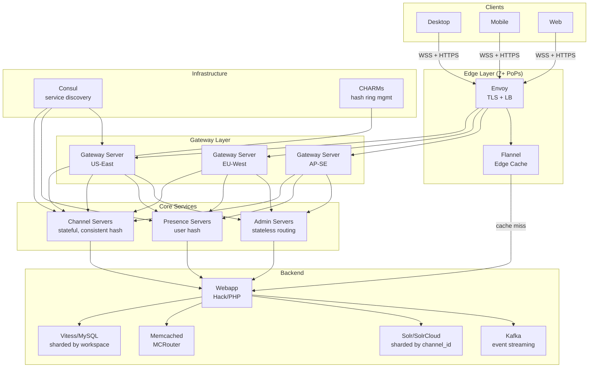
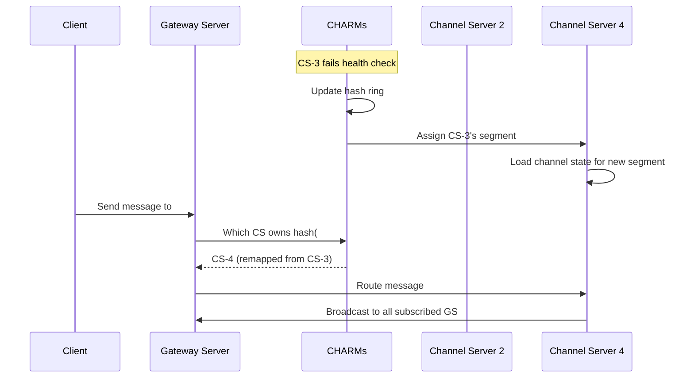
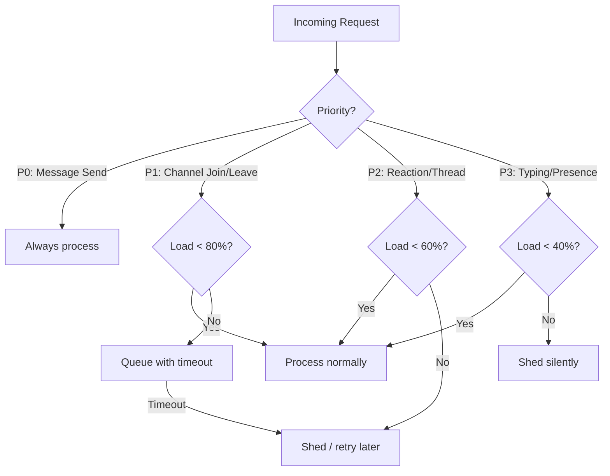
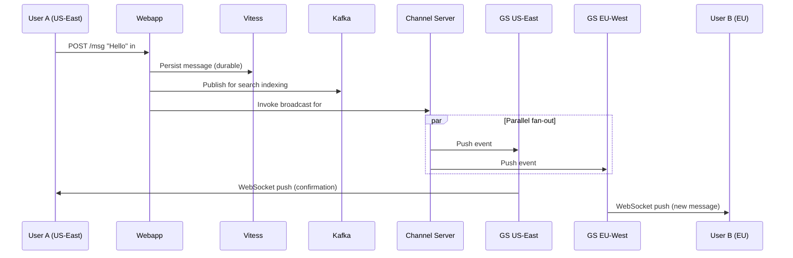

# Slack -- How Patterns Work in Production

> *65M+ DAU, 750K+ orgs, 5M+ concurrent WebSocket sessions. Key systems: Flannel
> (edge cache), Channel Service (real-time routing), Solr (search), Disasterpiece
> Theater (chaos engineering). This note dissects Slack through the lens of 10
> distributed systems patterns -- each one battle-tested at scale.*

---

## Company at a Glance

| Dimension             | Detail                                                        |
| --------------------- | ------------------------------------------------------------- |
| **DAU**               | 65M+ daily active users                                       |
| **Organizations**     | 750K+ paid workspaces                                         |
| **Messages/day**      | Billions of messages daily                                    |
| **Simultaneous WS**   | 5M+ concurrent WebSocket sessions at peak                     |
| **Languages**         | Hack (PHP), Java, Go, TypeScript, Python                      |
| **Primary datastore** | MySQL via Vitess (99% of query load)                          |
| **Caching**           | Memcached + MCRouter, Redis                                   |
| **Search**            | Apache Solr (SolrCloud)                                       |
| **Message bus**       | Custom pub/sub, Kafka                                         |
| **Infrastructure**    | AWS (primary), GCP (edge regions), Kubernetes                 |
| **Service mesh**      | Envoy (load balancing, TLS termination)                       |
| **Service discovery** | Consul (health checks, service registration)                  |
| **Observability**     | Prometheus (metrics), ELK stack (logging)                     |

---

## High-Level Architecture

### ASCII Overview

```
                        Slack Production Architecture
 ===========================================================================

  Clients (Desktop / Mobile / Web)
      |
      | HTTPS + WebSocket (TLS)
      v
 +-----------+     +-----------+     +-----------+
 | Edge PoP  |     | Edge PoP  |     | Edge PoP  |    7+ global edge regions
 | (Envoy)   |     | (Envoy)   |     | (Envoy)   |    AWS + GCP
 +-----+-----+     +-----+-----+     +-----+-----+
       |                 |                 |
       +--------+--------+--------+--------+
                |                 |
                v                 v
        +-------+------+  +------+--------+
        | Gateway      |  | Flannel       |       PATTERN: Multi-Layer Caching
        | Servers (GS) |  | Edge Cache    |       PATTERN: Pub/Sub
        | (WebSocket   |  | (workspace    |
        |  termination)|  |  data cache)  |
        +------+-------+  +------+--------+
               |                 |
       +-------+---------+------+--------+
       |                 |               |
       v                 v               v
 +-----+------+  +------+------+  +-----+------+
 | Channel    |  | Presence    |  | Admin      |
 | Servers    |  | Servers     |  | Servers    |    PATTERN: Consistent Hashing
 | (stateful) |  | (online     |  | (stateless)|    PATTERN: Cell Architecture
 |            |  |  tracking)  |  |            |
 +-----+------+  +------+------+  +-----+------+
       |                 |               |
       +--------+--------+-------+-------+
                |                |
                v                v
 +-----+------------------+-----+---------+
 |         Webapp (Hack / PHP)            |     PATTERN: Back Pressure
 |  (API layer, business logic, auth)     |     PATTERN: Circuit Breaker
 +---------+----------+----------+--------+
           |          |          |
           v          v          v
    +------+--+ +-----+----+ +--+--------+
    | Vitess  | | Memcached | | Solr /    |     PATTERN: Sharding
    | (MySQL) | | MCRouter  | | Search    |     PATTERN: Inverted Index
    +---------+ +----------+ +-----------+
```

### Mermaid -- Request Flow



---

## Pattern Deep Dives

---

### Pattern 1: Consistent Hashing -- Channel Service

**Link:** [[03_design_patterns/consistent_hashing]]

**The problem:** Slack has tens of millions of channels. Each message must be routed
to a specific server that knows the subscriber list for that channel. Adding or
removing servers should not remap all channels.

**How Slack uses it:** Channel Servers (CS) are stateful Java processes. Each CS is
responsible for a segment of the consistent hash ring. When a message arrives for
`#general`, the system computes `hash(channel_id)` and routes to the CS that owns
that segment. At peak, each CS manages approximately 16 million channels.

**CHARMs (Consistent Hash Ring Managers):** Dedicated processes that monitor CS
health via Consul. When a CS fails, CHARMs detect it, update the ring, and remap
only the affected segment's channels to surviving nodes. New CS ready in under 20
seconds.

```
  Consistent Hash Ring for Channel Servers
  =========================================

                    CS-1
                   /    \
              CS-6       CS-2        Ring of channel_id hashes
             /                \      Each CS owns a segment
           CS-5              CS-3
                \          /
                  CS-4

  hash(#general)    = 0x3A7... --> CS-2
  hash(#engineering)= 0xB12... --> CS-5
  hash(#random)     = 0x891... --> CS-4

  CS-3 dies:
  - CHARMs detect via Consul health check
  - CS-3's segment redistributed to CS-4 (clockwise neighbor)
  - Only ~1/N channels remapped (not all)
  - Recovery < 20 seconds
```



**Why consistent hashing over modulo:** With modulo (`channel_id % N`), adding one
server remaps nearly every channel. With consistent hashing, only `~1/N` channels
are remapped. At 16M channels per host, this difference is the difference between
a seamless scale-up and a minutes-long storm of state migration.

**Design tradeoffs:**

| Decision                              | Alternative                  | Why Slack chose this                                           |
| ------------------------------------- | ---------------------------- | -------------------------------------------------------------- |
| Stateful in-memory CS                 | Stateless + external store   | Sub-ms routing; state fits in RAM at 16M channels/host         |
| CHARMs as separate processes          | CS self-manage ring          | Separation of concerns; ring changes are centralized + atomic  |
| Consul for health checks              | Custom heartbeat             | Battle-tested; integrates with service discovery               |
| Spread channels across all CS hosts   | Partition by workspace       | Single CS failure affects small fraction of any workspace      |

---

### Pattern 2: Sharding -- Vitess and Solr

**Link:** [[03_design_patterns/sharding]]

**The problem:** Billions of messages across 750K+ workspaces cannot fit in a single
MySQL instance or a single search index.

**How Slack uses it:** Two independent sharding strategies for two different access
patterns.

#### Vitess/MySQL -- Sharded by Workspace

Vitess manages hundreds of MySQL shards. The shard key is `workspace_id`. All data
for a given workspace (messages, channels, users, files) lives on the same shard,
enabling efficient single-shard queries for most operations.

```
  Vitess Sharding Model
  =======================

  workspace_id=T001 --> Shard A (MySQL primary + replicas)
  workspace_id=T002 --> Shard A
  workspace_id=T003 --> Shard B
  ...
  workspace_id=T999 --> Shard N

  Query: SELECT * FROM messages WHERE workspace_id='T001' AND channel_id='C123'
  --> Routes to Shard A only (single-shard query, fast)

  Query: SELECT * FROM channel_members WHERE user_id='U456'
  --> If sharded by workspace, but queried by user_id:
      MUST scatter to ALL shards (expensive, cache-miss amplification)
```

#### Solr/SolrCloud -- Sharded by Channel ID

Search is sharded by `channel_id`. This co-locates all messages for a given channel
on the same Solr shard, enabling efficient full-text search within a channel. Cross-
channel search fans out to relevant shards.

**The critical tension -- shard key versus query key:** When the shard key (workspace_id)
does not match the query key (user_id), a cache miss on a single record triggers a
scatter query across every shard. This is exactly what caused the 2-22-22 incident.

**Design tradeoffs:**

| Decision                          | Alternative                   | Why Slack chose this                                      |
| --------------------------------- | ----------------------------- | --------------------------------------------------------- |
| Shard MySQL by workspace          | Shard by user_id              | Most queries are workspace-scoped; co-locates team data   |
| Shard Solr by channel_id          | Shard by workspace_id         | Search queries are typically within a channel              |
| Vitess over raw MySQL             | CockroachDB, Spanner          | MySQL expertise; Vitess was battle-tested at YouTube       |
| Hundreds of shards                | Fewer, larger shards          | Blast radius: one shard failure affects few workspaces     |

---

### Pattern 3: Back Pressure -- Rate Limiting and Graceful Degradation

**Link:** [[03_design_patterns/back_pressure]]

**The problem:** With 65M+ DAU, traffic spikes and misbehaving clients can overwhelm
any backend service. Without back pressure, one overloaded component cascades failure
across the entire system.

**How Slack uses it:** Multi-layered back pressure at every tier.

```
  Back Pressure Layers at Slack
  ==============================

  Layer 1: API Rate Limiting
  +--------------------------------------------------+
  | Per-workspace and per-user rate limits at API tier|
  | HTTP 429 Too Many Requests returned to client     |
  | Client SDKs implement exponential backoff         |
  +--------------------------------------------------+
           |
  Layer 2: Vitess Query Throttling
  +--------------------------------------------------+
  | Vitess enforces per-shard query rate limits       |
  | Slow queries are killed after timeout             |
  | Replica reads for non-critical queries            |
  +--------------------------------------------------+
           |
  Layer 3: Gateway Server Draining
  +--------------------------------------------------+
  | Overloaded GS stops accepting new WebSockets      |
  | Existing connections migrate to healthy GS        |
  | Envoy health checks detect and reroute traffic    |
  +--------------------------------------------------+
           |
  Layer 4: Feature Degradation
  +--------------------------------------------------+
  | Feature flags disable expensive features          |
  | Thread View disabled during "Query Strikes Again" |
  | Typing indicators dropped under load              |
  | Search rate limited for non-premium workspaces    |
  +--------------------------------------------------+
```

**Priority-based request handling:** Not all requests are equal. Message sends are
higher priority than emoji reactions. Presence updates are best-effort. During
overload, lower-priority requests are shed first.



**Key insight:** Graceful degradation is not just a theoretical pattern -- Slack has
used it in production incidents. Disabling Thread View during the "Query Strikes Again"
incident was an emergency lever that saved the system from total failure.

---

### Pattern 4: Chaos Engineering -- Disasterpiece Theater

**Link:** [[15_intermediate_topics/chaos_engineering]]

**The problem:** At tens of millions of DAU, you cannot wait for production failures
to discover weaknesses. Automated failover that has never been tested is not failover
-- it is hope.

**How Slack uses it:** Disasterpiece Theater is Slack's structured chaos engineering
process. It runs 4 phases with human judgment at every gate.

```
  Disasterpiece Theater -- 4-Phase Process
  ==========================================

  Phase 1: PLAN
  +----------------------------------------------+
  | - Define failure scenario (e.g., "kill 3 CS  |
  |   instances in US-East")                     |
  | - Document exact incitement commands          |
  | - Identify target EC2 instances               |
  | - Write hypothesis: "Expected customer        |
  |   impact: 0.1% of channels see 15s delay"    |
  | - Announce in #ops (700+ engineers)           |
  +----------------------+-----------------------+
                         |
  Phase 2: DEV ENVIRONMENT
  +----------------------v-----------------------+
  | - Execute failure scenario in dev             |
  | - Inspect logs, metrics, dashboards           |
  | - Observe: did automated remediation fire?    |
  | - Record: time-to-detection, time-to-recovery |
  | - Follow existing runbooks if manual steps    |
  +----------------------+-----------------------+
                         |
  Phase 3: GO / NO-GO GATE
  +----------------------v-----------------------+
  | Questions:                                    |
  | - Did automated remediation work in dev?      |
  | - Does team predict prod will behave same?    |
  | - Any unexpected cascading effects?           |
  |                                               |
  | NO-GO if: unexpected behavior in dev,         |
  |   runbook gaps, or low confidence             |
  +----------------------+-----------------------+
                         |
                     GO? |
                         v
  Phase 4: PRODUCTION
  +----------------------------------------------+
  | - Execute failure scenario in production      |
  | - Live updates in #disasterpiece-theater      |
  | - Broadcast status in #ops                    |
  | - OBSERVE, DO NOT RUSH TO FIX                 |
  | - Let automated systems respond first         |
  | - Document everything: what worked, what      |
  |   surprised, what to fix                      |
  +----------------------------------------------+
```

**The cardinal rule: "Observe, do not rush."** When the failure is injected, the team
resists the urge to intervene. They watch load balancers shift traffic, health checks
kick in, CHARMs remap the hash ring. The goal is to validate that automated systems
work -- not to prove that humans can fix things fast.

**Results from real exercises:**
- Killing Channel Servers: CHARMs remapped in under 20 seconds; no customer-visible impact
- Killing Flannel nodes: clients reconnected via Envoy to healthy nodes; cache rebuilt lazily
- Killing Vitess shard primary: replica promoted; brief blip in writes, reads unaffected
- Several exercises found serious vulnerabilities that were fixed before customers noticed

**Why process over pure automation:** Netflix's Chaos Monkey runs continuously and
automatically. Slack's Disasterpiece Theater is human-driven and deliberate. The
reasoning: Slack's architecture is complex enough that the human judgment at each
gate prevents exercises from becoming actual incidents. The go/no-go gate is the
critical safety mechanism.

---

### Pattern 5: Multi-Layer Caching -- Flannel Edge Cache

**Link:** [[02_building_blocks/caching]]

**The problem:** When a user opens Slack, the client needs the full workspace model:
users, channels, bots, emoji, preferences. For large teams (10K+ members), fetching
this from the backend on every boot was prohibitively expensive.

**How Slack uses it:** Flannel is an application-level edge cache deployed across 7+
global PoPs. It sits on the WebSocket path and caches workspace data with workspace-
affinity routing (all connections for workspace T001 hit the same Flannel node).

**Scale:** 4M+ simultaneous connections, 600K+ client queries/sec, 7 edge regions.
Boot time for largest workspaces dropped to 1/10th after Flannel deployment.

```
  Flannel Caching Architecture
  ==============================

  Client boot: "Give me workspace T001"
      |
      v
  Envoy (nearest PoP)
      |
      | workspace-affinity routing
      v
  +---+-------------------+
  | Flannel Cache Node    |
  | (holds full model     |
  |  for workspace T001)  |
  |                       |
  | users[]: cached       |  <-- HIT: respond directly (no backend call)
  | channels[]: cached    |
  | bots[]: cached        |
  | emoji[]: cached       |
  +-----------+-----------+
              |
              | cache MISS only
              v
  +-----------+-----------+
  | Webapp Backend (Hack) |
  | Fetch from Vitess     |
  +---+-------------------+

  Cache Invalidation:
  +--------------------------+
  | Pub/Sub event bus        |
  | (workspace events)       |
  |                          |
  | "user_joined T001"       |---> Flannel node for T001 updates cache
  | "channel_created T001"   |---> Flannel node for T001 updates cache
  | "emoji_added T001"       |---> Flannel node for T001 pushes to clients
  +--------------------------+
```

**Just-in-time annotation:** Flannel does not just respond to queries -- it predicts
what objects clients will request next and pushes them proactively. When a user is
about to open a channel, Flannel pre-sends the channel metadata, eliminating a
round trip.

**Lazy load/unload lifecycle:**
1. First user from workspace T001 connects to the PoP --> Flannel loads T001's model
2. Flannel subscribes to pub/sub events for T001 to keep cache fresh
3. Last user from T001 disconnects --> Flannel unloads T001's model, unsubscribes
4. Memory is bounded to active workspaces only

**Design tradeoffs:**

| Decision                              | Alternative                  | Why Slack chose this                                           |
| ------------------------------------- | ---------------------------- | -------------------------------------------------------------- |
| Edge deployment (not core DC)         | Centralized cache            | Latency: cache close to user, not close to DB                  |
| Workspace affinity routing            | Random LB to any Flannel     | One node holds full team model; no partial cache misses        |
| Lazy load/unload                      | Pre-warm all workspaces      | Memory bounded to active teams; scales with concurrent users   |
| Pub/sub invalidation                  | TTL-based expiry             | Real-time consistency for workspace mutations                  |
| Push-based annotation                 | Client polls for next object | Eliminates round trips; Flannel knows access patterns          |

---

### Pattern 6: Inverted Index -- Search at Scale

**Link:** [[02_building_blocks/search_systems]]

**The problem:** "Searchable Log of All Communication and Knowledge" is Slack's core
promise. Users expect instant full-text search across years of message history --
billions of documents.

**How Slack uses it:** Apache Solr (SolrCloud) with Lucene's inverted index. Sharded
by `channel_id` so all messages for a channel are co-located. Two-stage ranking:
fast Solr retrieval followed by ML re-ranking.

```
  Search Query Flow: "quarterly report"
  ========================================

  Client: search "quarterly report"
      |
      v
  +---+--------+
  | Webapp     |  Parse query, authenticate, determine scope
  | (Hack)     |  Apply enterprise ACL filters
  +---+--------+
      |
      v
  +---+---------+    +------------------+
  | Solr Query  |--->| SolrCloud        |
  | Service     |    | Shard 1: ch A-M  |  Stage 1: Lucene inverted index
  | (Java)      |    | Shard 2: ch N-Z  |  BM25 scoring + custom boosts
  |             |<---| Shard 3: ch ...  |  Return top-K candidates
  +---+---------+    +------------------+
      |
      | top-K candidates (e.g., 200 docs)
      v
  +---+---------+
  | Re-ranker   |  Stage 2: ML re-rank using SparkML SVM
  | (Java)      |
  |             |  Features:
  |             |  - Searcher affinity to message author
  |             |  - Channel engagement score
  |             |  - Recency decay function
  |             |  - Lucene base score
  |             |  - Position bias correction
  +---+---------+
      |
      | final ranked results (e.g., top 20)
      v
  Client: display results
```

**Enterprise security:** ACL filters are injected at the Solr query level. A user
can only see results from channels they belong to. This is enforced server-side --
the client never even receives unauthorized results.

**Position bias correction:** Slack discovered that a message at position N in search
results is approximately 30% more likely to be clicked than position N+1, regardless
of relevance. The ML training pipeline corrects for this bias.

**Slack AI search (2024+):** Tiered LLM processing layered on top of Solr. Not every
message hits the LLM -- cost is managed via tiered inference. Custom ranking combines
traditional search signals with AI reasoning.

**Why Solr over Elasticsearch:** Slack started with Solr early on and it served well
at scale. Migration cost to Elasticsearch was not justified by marginal benefits. Solr's
SolrCloud mode provides the distributed coordination needed.

---

### Pattern 7: Pub/Sub -- Real-Time Event Distribution

**Link:** [[03_design_patterns/pub_sub]]

**The problem:** When a user sends a message in `#general`, every member of that
channel -- potentially across multiple regions -- must receive it in real-time. The
sender should not need to know who the recipients are or where they are connected.

**How Slack uses it:** Multiple pub/sub layers working together.

```
  Pub/Sub Layers at Slack
  =========================

  Layer 1: Channel Server --> Gateway Servers (custom pub/sub)
  +-----------------------------------------------------------+
  | CS broadcasts message to all GS that have subscribers     |
  | for that channel. GS push to connected WebSocket clients. |
  |                                                           |
  | Publisher: Channel Server                                 |
  | Subscribers: Gateway Servers (one per region with members)|
  | Topic: channel_id                                         |
  +-----------------------------------------------------------+

  Layer 2: Workspace Events --> Flannel (custom pub/sub)
  +-----------------------------------------------------------+
  | When workspace data changes (user joins, channel created), |
  | events published to workspace topic. Flannel nodes that   |
  | cache this workspace consume events and update cache.     |
  |                                                           |
  | Publisher: Webapp (on mutation)                            |
  | Subscribers: Flannel nodes caching that workspace         |
  | Topic: workspace_id                                       |
  +-----------------------------------------------------------+

  Layer 3: Async Pipelines (Kafka)
  +-----------------------------------------------------------+
  | Kafka handles async, durable event streaming:             |
  | - Search indexing (message -> Solr)                       |
  | - Analytics pipelines                                     |
  | - Compliance/audit logging                                |
  | - Notification delivery                                   |
  |                                                           |
  | Decouples critical path from async consumers              |
  +-----------------------------------------------------------+
```



**Key design: Persist before broadcast.** The original architecture had CS persisting
messages, which meant a CS crash could lose a message. The current architecture
persists to Vitess first, then invokes CS purely for broadcast. Messages are durable
before any recipient sees them.

---

### Pattern 8: Circuit Breaker -- Overload Protection

**Link:** [[03_design_patterns/circuit_breaker]]

**The problem:** Slack's services have deep dependency chains: Gateway Server calls
Channel Server calls Webapp calls Vitess calls MySQL. If Vitess slows down, without
protection, every upstream service queues requests and eventually exhausts memory,
cascading failure to the entire system.

**How Slack uses it:** Circuit breakers on service-to-service calls, particularly
protecting Vitess from cascading failures during cache misses or query storms.

```
  Circuit Breaker States
  ========================

  CLOSED (normal operation)
  +---------------------------+
  | Requests flow normally    |
  | Track failure rate        |
  | If failure_rate > 50%     |
  |   for 10s window:         |
  |   --> transition to OPEN  |
  +---------------------------+
           |
           v failure threshold exceeded
  OPEN (rejecting requests)
  +---------------------------+
  | All requests immediately  |
  |   rejected / fallback     |
  | Timer: 30 seconds         |
  | After timer:              |
  |   --> transition to       |
  |       HALF-OPEN           |
  +---------------------------+
           |
           v timer expires
  HALF-OPEN (testing recovery)
  +---------------------------+
  | Allow 10% of requests     |
  | If success_rate > 90%:    |
  |   --> back to CLOSED      |
  | If failures persist:      |
  |   --> back to OPEN        |
  +---------------------------+

  Slack-specific:
  - Webapp -> Vitess: circuit breaker on per-shard basis
  - GS -> CS: circuit breaker per CS instance
  - Flannel -> Webapp: circuit breaker with cache-stale fallback
```

**Feature flags as circuit breakers:** Slack extends the circuit breaker concept to
the product layer. When a specific query pattern is hammering the database, engineers
can disable the feature that generates that query (e.g., Thread View) via feature
flag. This is a manual circuit breaker at the application level.

**Interaction with back pressure:** Circuit breakers and back pressure work together.
Back pressure says "slow down." Circuit breakers say "stop entirely." When Vitess
hit replication lag during the "Query Strikes Again" incident, back pressure (query
throttling) was insufficient -- the circuit breaker pattern (disabling Thread View)
was the lever that stopped the bleeding.

---

### Pattern 9: Cell Architecture -- Channel Server Partitioning

**Link:** [[03_design_patterns/cell_based_architecture]]

**The problem:** A single shared service means a single point of failure. If Channel
Server is one monolithic process, one bug or overload takes down messaging for all
65M+ users.

**How Slack uses it:** Channel Servers partitioned by consistent hash create an
effective cell architecture. Each CS "cell" handles a distinct subset of channels.
A failure in one cell only affects the channels mapped to it -- not the entire
system.

```
  Cell Isolation via Consistent Hashing
  ========================================

  Cell A (CS-1, CS-2):     channels 0x000...0x3FF
  Cell B (CS-3, CS-4):     channels 0x400...0x7FF
  Cell C (CS-5, CS-6):     channels 0x800...0xBFF
  Cell D (CS-7, CS-8):     channels 0xC00...0xFFF

  Workspace "Acme Corp" has 500 channels:
  - ~125 channels in Cell A
  - ~125 channels in Cell B
  - ~125 channels in Cell C
  - ~125 channels in Cell D

  Cell C goes down:
  - Acme Corp loses ~125 channels temporarily
  - 375 channels still work fine
  - CHARMs remap Cell C's channels in < 20 seconds
  - No other workspace is disproportionately affected
```

**Why channels are spread across cells (not grouped by workspace):** If all of Acme
Corp's channels were in one cell, a cell failure would take down Acme Corp entirely.
By spreading channels across all cells via consistent hashing, a cell failure degrades
each workspace proportionally (e.g., 25% of channels affected, not 100%).

**Vitess shards as data cells:** Vitess shards also function as cells. Each shard
holds a subset of workspaces. A shard failure (e.g., primary crash) only affects the
workspaces on that shard. Replica promotion limits downtime.

---

### Pattern 10: Service Discovery -- Consul

**Link:** [[02_building_blocks/service_discovery]]

**The problem:** With hundreds of Channel Server instances, Gateway Servers in 7+
regions, Flannel nodes across PoPs, and Vitess shards, no component can use hardcoded
addresses. Services start, stop, crash, and scale dynamically.

**How Slack uses it:** Consul provides service registration, health checking, and
DNS-based discovery.

```
  Service Discovery Flow
  ========================

  1. CS-42 starts up
     |
     +-- Registers with Consul:
         service: "channel-server"
         address: 10.0.5.42:8080
         health_check: HTTP GET /health every 5s

  2. CHARMs query Consul for all healthy channel-servers
     |
     +-- Consul returns: [CS-1, CS-2, ..., CS-42, ..., CS-100]
     +-- CHARMs build consistent hash ring from healthy set

  3. CS-42 fails health check (3 consecutive failures)
     |
     +-- Consul marks CS-42 as unhealthy
     +-- CHARMs receive watch notification
     +-- CHARMs update hash ring (remove CS-42)
     +-- CS-42's channels remap to neighbors

  4. Gateway Servers query Consul for nearest healthy GS
     |
     +-- Consul returns region-aware results
     +-- Envoy uses Consul for upstream discovery
```

**Consul + CHARMs integration:** CHARMs do not poll Consul -- they use Consul's watch
mechanism to receive push notifications when the healthy set of Channel Servers changes.
This enables sub-second detection of CS failures.

**Consul for feature flags:** Slack also uses Consul's key-value store for distributing
configuration and feature flags across the fleet. When engineers disable Thread View
during an incident, the flag propagates via Consul to all Webapp instances within
seconds.

---

## Pattern Summary

| #  | Pattern                                           | Where It Appears                                                  | Why It Matters                                                       |
| -- | ------------------------------------------------- | ----------------------------------------------------------------- | -------------------------------------------------------------------- |
| 1  | [[03_design_patterns/consistent_hashing]]         | CHARMs assign channels to CS via hash ring                        | Elastic scaling: add/remove CS remaps only ~1/N channels             |
| 2  | [[03_design_patterns/sharding]]                   | Vitess by workspace_id; Solr by channel_id                        | Horizontal scale for storage and search across billions of messages   |
| 3  | [[03_design_patterns/back_pressure]]              | API rate limits, Vitess throttling, GS draining, feature degradation | Multi-layer defense prevents cascading overload                     |
| 4  | Chaos Engineering (Disasterpiece Theater)          | 4-phase process: Plan, Dev, Go/No-Go, Production                  | Finds vulnerabilities before customers do                            |
| 5  | [[02_building_blocks/caching]] (Multi-Layer)      | Flannel edge cache: 4M+ connections, 600K queries/sec             | 10x boot time reduction for large workspaces                         |
| 6  | [[02_building_blocks/search_systems]] (Inverted Index) | Solr/SolrCloud with two-stage ranking                       | Full-text search across billions with enterprise ACLs                |
| 7  | [[03_design_patterns/pub_sub]]                    | CS-to-GS broadcast, Flannel invalidation, Kafka async pipelines   | Decoupled real-time delivery across regions                          |
| 8  | [[03_design_patterns/circuit_breaker]]            | Vitess protection, per-CS breakers, feature flags as breakers     | Stops cascading failures; feature-level emergency levers             |
| 9  | [[03_design_patterns/cell_based_architecture]]    | CS partitioned by consistent hash; Vitess shards                  | Blast radius containment: one cell failure is partial, not total     |
| 10 | [[02_building_blocks/service_discovery]]          | Consul: registration, health checks, watch-based notifications    | Dynamic fleet: services start, stop, crash without manual config     |

---

## Failure Stories

### The 2-22-22 Cache Miss Cascade

**What happened:** A Vitess keyspace storing channel membership (sharded by `user_id`)
became overloaded. A single channel missing from Memcached cache forced a scatter
query across every shard to find which users belonged to it.

**The cascade:**
1. Memcached partially failed (some keys evicted)
2. Cache misses triggered scatter queries (one miss = query to ALL shards)
3. Nearly all active users triggered scatter queries simultaneously
4. Read load grew superlinearly relative to cache miss rate
5. Vitess became overwhelmed; latency spiked across all workspaces

**The fix:**
- Modified query to fetch only missing data from Vitess (not full scatter)
- Added replica reads for non-critical membership queries
- Caches refilled gradually with rate limiting to prevent thundering herd

**Root cause lesson:** Shard key (workspace_id) did not match the query key (user_id).
Cache misses on cross-shard queries become full-scatter queries. Cache misses can
generate MORE load than having no cache at all (thundering herd with scatter).

**Patterns that applied:** [[03_design_patterns/sharding]], [[03_design_patterns/back_pressure]]

For deeper analysis: [[09_real_outages/slack_database_incident_2024]]

---

### The "Query Strikes Again" Incident

**What happened:** A bulk user deletion triggered a "forget user" job that burst writes
across many Vitess shards simultaneously. One shard holding 6% of subscription data
hit MySQL replication lag. Reads to replicas returned stale data; reads to primary
compounded the write pressure.

**The emergency lever:** Engineers disabled Thread View in the client via feature flag.
Thread View was the feature generating the heaviest read queries on the affected shard.
Disabling it dropped read load enough for replication to catch up.

**Root cause lesson:** Batch operations that fan out writes across shards can create
hotspots. Feature flags are not just for rollouts -- they are circuit breakers for
emergencies.

**Patterns that applied:** [[03_design_patterns/circuit_breaker]], [[03_design_patterns/back_pressure]]

---

### February 2025 Outage (~10 hours)

**What happened:** Routine database maintenance combined with a latent caching defect
caused traffic overload. Approximately 50% of instances became unavailable. Recovery
required shard-by-shard repair.

**Root cause lesson:** Maintenance operations and caching behavior must be tested
together. A latent defect that is invisible under normal conditions can become
catastrophic when combined with maintenance-induced load shifts.

**Patterns that applied:** [[02_building_blocks/caching]], [[03_design_patterns/sharding]]

---

### Principles from Slack's Failures

| Principle                                       | Incident that taught it                        |
| ----------------------------------------------- | ---------------------------------------------- |
| Cache misses can be worse than no cache          | 2-22-22: thundering herd + scatter queries     |
| Shard key != query key is dangerous              | 2-22-22: workspace shard, user query           |
| Feature flags are circuit breakers               | Query Strikes Again: disabled Thread View      |
| Batch operations need rate limiting              | Query Strikes Again: bulk delete fan-out       |
| Maintenance + latent bugs = outage               | Feb 2025: DB maintenance + caching defect      |
| Chaos engineering finds vulnerabilities first    | Disasterpiece Theater: dozens of pre-emptive fixes |
| Persist before broadcast eliminates data loss    | Early CS crashes that lost in-flight messages  |

---

## Interview Quick Reference

### "Design a Chat System" / "Design Slack"

| Interview Requirement         | Slack's Production Solution                        | Pattern                                           |
| ----------------------------- | -------------------------------------------------- | ------------------------------------------------- |
| Real-time messaging           | WebSocket via Gateway Servers + Channel Servers     | [[03_design_patterns/pub_sub]]                    |
| Message persistence           | Vitess (MySQL) with persist-before-broadcast        | [[03_design_patterns/sharding]]                   |
| Message search                | Solr, channel_id sharding, two-stage ML re-ranking  | [[02_building_blocks/search_systems]]             |
| Presence (online/offline)     | Dedicated Presence Servers with user hashing         | [[03_design_patterns/consistent_hashing]]         |
| Scalable storage              | Vitess horizontal sharding by workspace              | [[03_design_patterns/sharding]]                   |
| Edge performance              | Flannel edge cache with workspace affinity           | [[02_building_blocks/caching]]                    |
| Multi-region delivery         | Gateway Servers in 7+ regions, Envoy at edge         | [[03_design_patterns/cell_based_architecture]]    |
| Fault tolerance               | CHARMs for CS recovery, Disasterpiece Theater        | [[03_design_patterns/consistent_hashing]]         |
| Rate limiting                 | API-tier rate limits, Vitess query throttling         | [[03_design_patterns/back_pressure]]              |
| Overload protection           | Circuit breakers + feature flag kill switches         | [[03_design_patterns/circuit_breaker]]            |

### Common Follow-Up Questions

| Question                          | Answer                                                                                       |
| --------------------------------- | -------------------------------------------------------------------------------------------- |
| User in 10K channels?             | GS subscribes to all via consistent-hash CS. Flannel caches metadata at edge. No full scatter. |
| Message ordering?                 | Server-side timestamp in Vitess before broadcast. Clients reconcile via sequence numbers.     |
| How to scale search?              | Solr sharded by channel_id. Two-stage ranking. Enterprise ACLs at query layer.               |
| Channel Server crash?             | CHARMs remap in < 20s. No message loss (already persisted to Vitess).                        |
| Cache miss storm?                 | Rate-limited cache refill. Replica reads. Feature degradation as last resort.                |
| How to test reliability?          | Disasterpiece Theater: 4-phase chaos engineering. Dev first, go/no-go gate, then production. |
| Why not Elasticsearch?            | Started with Solr; migration cost not justified. SolrCloud scales well enough.               |
| Why stateful Channel Servers?     | Sub-ms routing. State fits in RAM (16M channels/host). Consistent hashing handles failures.  |

### Key Numbers to Remember

| Metric                            | Value                         |
| --------------------------------- | ----------------------------- |
| DAU                               | 65M+                          |
| Concurrent WebSockets             | 5M+                           |
| Channels per CS host              | ~16M                          |
| CS recovery time                  | < 20 seconds                  |
| Flannel connections               | 4M+ simultaneous              |
| Flannel queries/sec               | 600K+                         |
| Edge regions                      | 7+                            |
| Boot time improvement (Flannel)   | 10x reduction                 |
| Global message delivery           | ~500ms                        |
| Vitess query load share           | 99%                           |
| Position bias in search           | ~30% per rank position        |

---

## Startup Playbook -- What to Steal from Slack

### Phase 1: 0 to 100K Users (Steal the Fundamentals)

**Persist before broadcast.** This is Slack's most important architectural lesson
and it costs nothing extra. Never broadcast a message to recipients before it is
durable in your database. Early Slack lost messages when Channel Servers crashed
mid-broadcast. The fix is simple: write to DB first, then fan out.

**WebSocket with regional Gateway Servers.** Start with one region but design the
Gateway Server as a separate service from day one. When you need a second region,
you deploy another GS -- not refactor your monolith.

**Shard key = query key.** Choose your shard key to match your most common query
pattern. Slack shards by workspace because most queries are workspace-scoped. If
your shard key and query key diverge, cache misses become full-scatter queries.
Learn from the 2-22-22 incident before you experience your own.

### Phase 2: 100K to 1M Users (Steal the Scaling Patterns)

**Consistent hashing for stateful services.** If you have any stateful service
(message routing, session management, game state), use consistent hashing from the
start. Modulo-based assignment means adding one server remaps everything. Consistent
hashing remaps ~1/N. Build your own CHARMs equivalent -- a process that watches
health and manages the ring.

**Edge caching with affinity routing.** Do not just add a CDN -- build application-
level caching (like Flannel) that understands your data model. Workspace affinity
ensures one cache node holds the complete model for a team, eliminating partial
cache misses.

**Feature flags as emergency levers.** Implement feature flags not just for gradual
rollouts but as circuit breakers. When a specific feature's query pattern is killing
your database, you need a switch to turn it off in seconds, not a deploy that takes
minutes.

### Phase 3: 1M+ Users (Steal the Reliability Practices)

**Run your own Disasterpiece Theater.** You do not need Netflix-scale automation.
Slack's process is deliberately manual: plan, dev, go/no-go, production. Start by
killing one instance of your most critical service in dev and watching what happens.
If you do not know what will happen, that is exactly why you need to do it.

**Multi-layer back pressure.** Rate limiting at the API tier is not enough. Add
query throttling at the database tier, connection draining at the gateway tier, and
feature degradation at the product tier. Each layer catches what the previous one
missed.

**Invest in observability before you need it.** Slack broadcasts exercises to 700+
engineers in #ops. You need dashboards, alerts, and runbooks before the incident --
not during it.

### Patterns to Adopt in Order

| Priority | Pattern                    | When to adopt          | Cost of delay                              |
| -------- | -------------------------- | ---------------------- | ------------------------------------------ |
| 1        | Persist before broadcast   | Day 1                  | Lost messages, broken user trust           |
| 2        | Sharding strategy          | Before first shard     | Wrong shard key = 2-22-22 style incidents  |
| 3        | Feature flags              | Before first incident  | No emergency levers when DB is on fire     |
| 4        | Consistent hashing         | Before stateful scale  | Adding servers remaps everything            |
| 5        | Circuit breakers           | Before service mesh    | One slow dependency cascades to everything |
| 6        | Edge caching               | Before global users    | Expensive boot for remote users            |
| 7        | Chaos engineering          | Before you think ready | Untested failover is not failover          |
| 8        | Cell architecture          | Before massive scale   | Single failure = total outage              |

---

## Scaling Timeline

```
  Slack Scaling Timeline
  ================================================================

  2013  Founded. Single MySQL DB, monolithic PHP app.
  2014  Launch. MySQL active-active, Memcached, HAProxy.
  2015  1M+ DAU. Solr for search, monolith splitting begins.
  2016  4M+ DAU. Large teams hit boot walls. CS architecture designed.
  2017  6M+ DAU. Flannel deployed (Jan). Vitess migration begins.
  2018  10M+ DAU. Disasterpiece Theater starts. Envoy adopted.
  2019  12M+ DAU. 4M+ connections, 600K queries/sec, 7 edge regions.
  2020  COVID spike (12.5M -> 32.5M DAU). Vitess serves 99% of queries.
  2021  Salesforce acquisition. Enterprise Grid, EKM.
  2022  2-22-22 incident. Vitess overload from cache miss cascade.
  2023  16M channels/CS host. 5M+ WebSocket sessions. <20s CS recovery.
  2024  65M+ DAU. Slack AI search. Enterprise Grid growth.
  2025  Feb outage (~10h). DB maintenance + caching defect.
```

---

## Sources and Further Reading

### Primary Sources (Slack Engineering Blog)
- [Flannel: An Application-Level Edge Cache to Make Slack Scale](https://slack.engineering/flannel-an-application-level-edge-cache-to-make-slack-scale/)
- [Real-time Messaging](https://slack.engineering/real-time-messaging/)
- [Scaling Datastores at Slack with Vitess](https://slack.engineering/scaling-datastores-at-slack-with-vitess/)
- [Search at Slack](https://slack.engineering/search-at-slack/)
- [Disasterpiece Theater: Slack's Process for Approachable Chaos Engineering](https://slack.engineering/disasterpiece-theater-slacks-process-for-approachable-chaos-engineering/)
- [Slack's Incident on 2-22-22](https://slack.engineering/slacks-incident-on-2-22-22/)
- [The Query Strikes Again](https://slack.engineering/the-query-strikes-again/)

### Conference Talks
- [Scaling Slack - The Good, the Unexpected, and the Road Ahead (InfoQ 2018)](https://www.infoq.com/presentations/slack-scalability-2018/)
- [Keith Adams on the Architecture of Slack (InfoQ Podcast)](https://www.infoq.com/podcasts/slack-keith-adams/)

### Vault Cross-Links
- [[03_design_patterns/consistent_hashing]]
- [[03_design_patterns/sharding]]
- [[03_design_patterns/back_pressure]]
- [[03_design_patterns/pub_sub]]
- [[03_design_patterns/circuit_breaker]]
- [[03_design_patterns/cell_based_architecture]]
- [[02_building_blocks/caching]]
- [[02_building_blocks/search_systems]]
- [[02_building_blocks/service_discovery]]
- [[15_intermediate_topics/chaos_engineering]]
- [[05_case_studies/design_chat_system]]
- [[09_real_outages/slack_database_incident_2024]]
