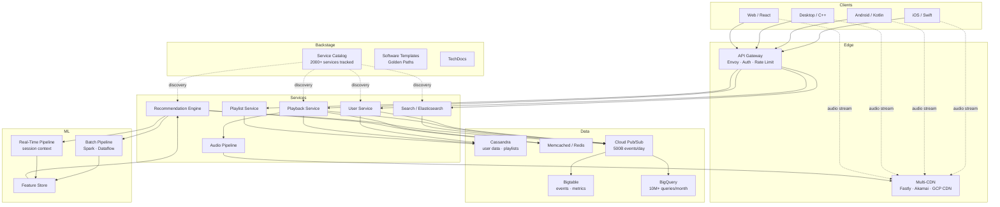
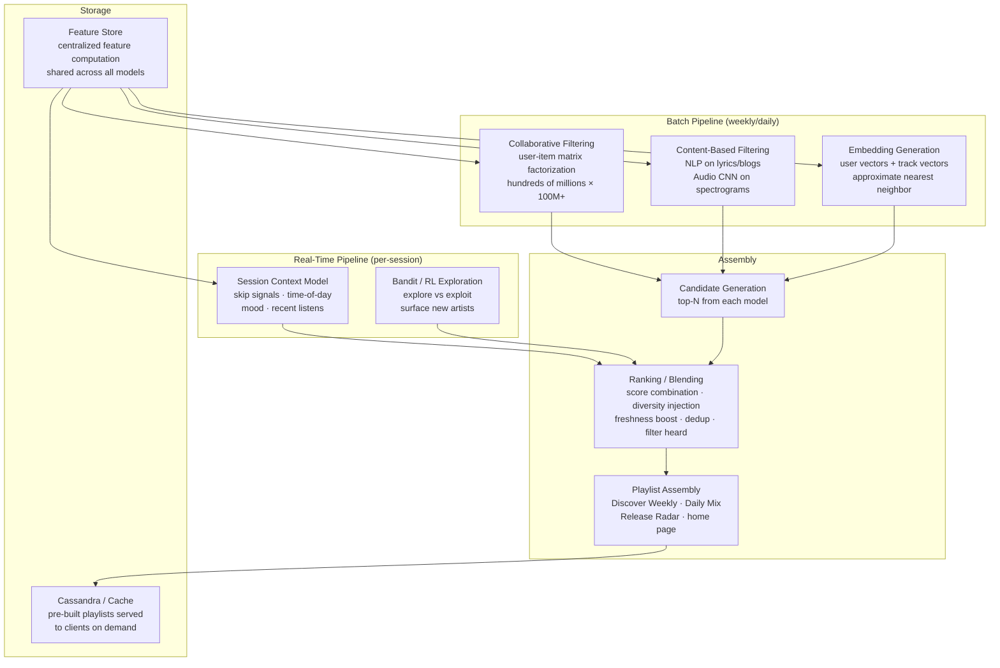
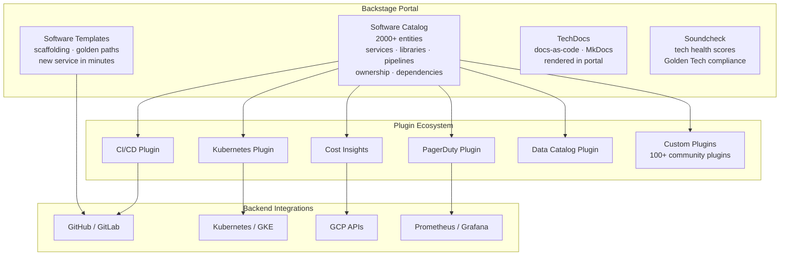
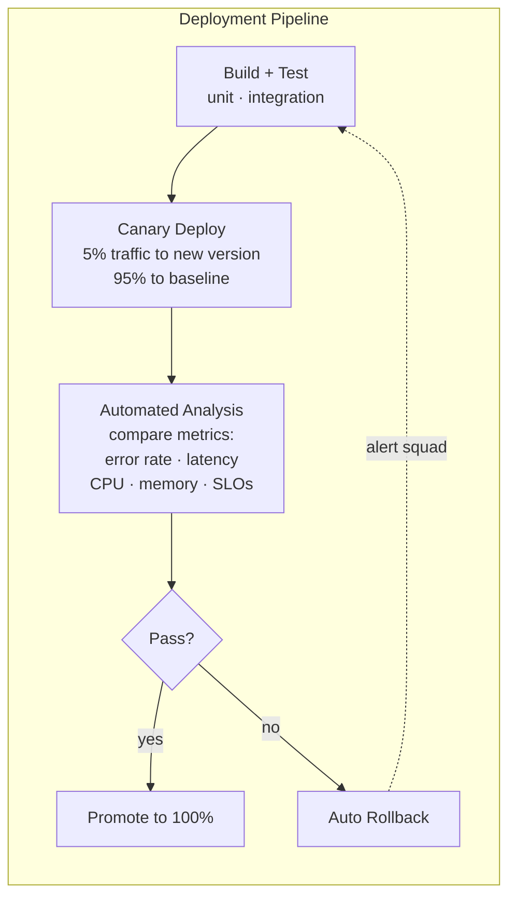

# Spotify — How Patterns Work in Production

> 675M+ MAU, 220M+ premium, 2000+ microservices, 500B events/day.
> Key: Backstage, Audio pipeline, ML/personalization, Event delivery.
> Stack: Java/Python/Scala/Go on GCP (GKE), Cassandra, Bigtable, BigQuery, Cloud Pub/Sub.

---

## High-Level Architecture

```
  ┌──────────────────────────────────────────────────────────────────────────┐
  │                         CLIENT LAYER                                     │
  │   iOS (Swift)  ·  Android (Kotlin)  ·  Desktop (C++)  ·  Web (React)   │
  │   Smart Speakers  ·  Cars  ·  Game Consoles  ·  Wearables              │
  │   (Adaptive bitrate, pre-fetch next 2-3 tracks, offline cache)         │
  └──────────────────────────┬───────────────────────────────────────────────┘
                             │
                ┌────────────┴────────────┐
                │                         │
                ▼                         ▼
  ┌──────────────────────┐   ┌──────────────────────────────────────┐
  │   API GATEWAY /      │   │         MULTI-CDN LAYER              │
  │   EDGE (Envoy)       │   │  ┌────────┐ ┌───────┐ ┌─────────┐  │
  │   Auth · Rate Limit  │   │  │ Fastly │ │Akamai │ │GCP CDN  │  │
  │   Routing             │   │  │(primary│ │(fallbk│ │(fallbk) │  │
  └──────────┬───────────┘   │  │ audio) │ │)      │ │         │  │
             │               │  └────────┘ └───────┘ └─────────┘  │
             │               │  Audio bytes served from edge PoPs  │
             │               └──────────────────────────────────────┘
             ▼
  ┌──────────────────────────────────────────────────────────────────┐
  │                      SERVICE LAYER (~2000+ microservices)        │
  │                                                                  │
  │  ┌────────────┐  ┌───────────┐  ┌────────────┐  ┌────────────┐ │
  │  │ User       │  │ Playback  │  │ Search     │  │ Playlist   │ │
  │  │ Service    │  │ Service   │  │ Service    │  │ Service    │ │
  │  └─────┬──────┘  └─────┬─────┘  └──────┬─────┘  └──────┬─────┘ │
  │        │               │               │               │       │
  │  ┌─────┴──────┐  ┌─────┴─────┐  ┌──────┴─────┐  ┌─────┴─────┐ │
  │  │ Recommend  │  │ Audio     │  │ Ad Service │  │ Social    │ │
  │  │ Engine(ML) │  │ Pipeline  │  │            │  │ Service   │ │
  │  └────────────┘  └───────────┘  └────────────┘  └───────────┘ │
  │                                                                  │
  │  Discovery: Backstage Service Catalog (CNCF)                    │
  │  Deploys: ~10,000/day on GKE via canary analysis                │
  └───────┬──────────────┬──────────────┬────────────────────────────┘
          │              │              │
          ▼              ▼              ▼
  ┌──────────────────────────────────────────────────────────────────┐
  │                      DATA LAYER                                  │
  │                                                                  │
  │  ┌───────────┐  ┌───────────┐  ┌──────────┐  ┌───────────────┐ │
  │  │ Cassandra │  │ Bigtable  │  │ BigQuery │  │ Memcached /   │ │
  │  │ (user     │  │ (events,  │  │ (10M+    │  │ Redis (cache) │ │
  │  │  data,    │  │  metrics, │  │  queries │  │               │ │
  │  │  lists)   │  │  timesrcs)│  │  /month) │  │               │ │
  │  └───────────┘  └───────────┘  └──────────┘  └───────────────┘ │
  │                                                                  │
  │  ┌──────────────────────────────────────────────────────┐       │
  │  │  Google Cloud Pub/Sub (event backbone)               │       │
  │  │  500B events/day · 8M events/sec peak                │       │
  │  │  Per-event-type topic isolation                      │       │
  │  └────────────────────────┬─────────────────────────────┘       │
  │                           ▼                                      │
  │  ┌──────────────────────────────────────────────────────┐       │
  │  │  Data Lake: GCS + Dataflow + BigQuery (100+ PB)     │       │
  │  └──────────────────────────────────────────────────────┘       │
  └──────────────────────────────────────────────────────────────────┘
```



---

## Pattern Deep Dives

### 1. Pub/Sub — Event Delivery at 500B Events/Day

> **Vault:** [[03_design_patterns/pub_sub]]

**The problem:** Every user action at Spotify — song plays, skips, searches, UI interactions
— must be captured, transported, and persisted reliably. The `EndSong` event (emitted
when a user finishes a track) directly determines royalty payments to labels and artists.
Dropped or duplicated events mean incorrect payments. At 500 billion events per day
(8M events/sec peak), this system must be both reliable and massively scalable.

**How Spotify implements it:**

Spotify originally ran on self-managed Kafka 0.7, which lacked reliable persistent storage
in brokers. Events were only considered "safely stored" once written to HDFS, making the
Hadoop cluster a single point of failure. In 2016-2017, they migrated the entire event
delivery system to Google Cloud Pub/Sub.

```
  Event Flow:

  ┌──────────────┐
  │ Client Device│  EndSong, Search, Skip, PlaylistEdit,
  │ (iOS/Android/│  AdImpression, UIInteraction, UserCreate ...
  │  Desktop/Web)│
  └──────┬───────┘
         │  batched events
         ▼
  ┌──────────────────┐
  │ Event Ingestion  │  Schema validation · dedup · batching
  │ Gateway          │  Reject malformed events at the edge
  └──────┬───────────┘
         │
         ▼
  ┌──────────────────────────────────────────────────────┐
  │          Google Cloud Pub/Sub                        │
  │                                                      │
  │  ┌─────────┐ ┌─────────┐ ┌─────────┐ ┌───────────┐ │
  │  │EndSong  │ │Search   │ │Skip     │ │AdImpress  │ │
  │  │Topic    │ │Topic    │ │Topic    │ │Topic      │ │
  │  └────┬────┘ └────┬────┘ └────┬────┘ └─────┬─────┘ │
  │       │           │           │             │       │
  │  Each event type = isolated topic                   │
  │  One bad type CANNOT block others                   │
  └───────┬───────────┬───────────┬─────────────┬───────┘
          │           │           │             │
          ▼           ▼           ▼             ▼
  ┌────────────┐ ┌──────────┐ ┌──────────┐ ┌──────────────┐
  │ Royalty    │ │ Real-Time│ │ Batch ETL│ │ ML Feature   │
  │ Pipeline   │ │ Consumers│ │ Dataflow │ │ Pipelines    │
  │ (EndSong → │ │ (alerts, │ │ → BigQry │ │ (training    │
  │  payments) │ │  dashbrd)│ │ → GCS    │ │  data)       │
  └────────────┘ └──────────┘ └──────────┘ └──────────────┘
```

**Key implementation details:**

- **Event type isolation:** The single most important architectural decision. Instead
  of one giant stream, each event type (EndSong, Search, Skip, etc.) gets its own
  Pub/Sub topic. If the Search event consumer falls behind, EndSong delivery (which
  drives royalty payments) is completely unaffected.
- **At-least-once delivery:** Pub/Sub guarantees at-least-once; consumers perform
  application-level deduplication using event IDs.
- **7-day retention:** Unacknowledged messages retained for 7 days, providing a safety
  buffer for consumer outages.
- **Schema enforcement:** Events validated against a schema registry at the ingestion
  gateway. Malformed events rejected before entering Pub/Sub.
- **Scale trajectory:** 60B events/day (2016) -> 100B (2017) -> 500B (2019+).
  Data grows an order of magnitude faster than user traffic growth.

**Why not stay on Kafka?**

Kafka 0.7 had no reliable broker-level persistence. The HDFS dependency was a single
point of failure. Upgrading to Kafka 0.8+ was evaluated but deemed too costly given
the existing cluster size. Cloud Pub/Sub offered: zero operational burden for brokers,
automatic scaling, built-in persistence, and per-topic isolation.

**When to cite in interviews:** Any event-driven architecture question, royalty/payment
systems, high-throughput messaging. The event-type-isolation pattern is a strong
advanced talking point.

---

### 2. CDN Edge Caching — Multi-Tier Audio Delivery

> No vault link. Related: [[03_design_patterns/consistent_hashing]]

**The problem:** Delivering 100M+ tracks to 675M+ users worldwide with sub-200ms
time-to-first-byte. Audio files exist in 4-6 codec/bitrate variants each (Ogg Vorbis
for desktop, AAC for mobile, FLAC for HiFi — at 64/128/256/320 kbps). A naive CDN
strategy wastes cache space on rarely played tracks and creates origin hotspots for
viral releases.

**How Spotify implements it:**

Spotify uses a multi-tier CDN architecture with Fastly as the primary audio CDN,
Akamai and Google Cloud CDN as fallbacks. The system uses a three-layer pull-based
caching model with proactive fill for predictable demand.

```
  Multi-Tier CDN Architecture:

  ┌──────────────────────────────────────────────────────────┐
  │  ORIGIN (Google Cloud Storage)                           │
  │  100M+ tracks × 4-6 variants each                       │
  │  Authoritative source of all encoded audio               │
  └─────────────────────────┬────────────────────────────────┘
                            │  origin pull (cache miss only)
                            ▼
  ┌──────────────────────────────────────────────────────────┐
  │  REGIONAL CACHE (mid-tier PoPs)                          │
  │  Stores medium-popularity content                        │
  │  Reduces origin load by ~80%                             │
  └─────────────────────────┬────────────────────────────────┘
                            │  regional pull (edge cache miss)
                            ▼
  ┌──────────────────────────────────────────────────────────┐
  │  EDGE PoPs (SSD-backed, closest to users)                │
  │  Hot tracks cached here (top ~5% of catalog = ~80% plays)│
  │  Consistent hashing determines which edge node serves    │
  │  which content hash range                                │
  └─────────────────────────┬────────────────────────────────┘
                            │  HTTPS chunked delivery
                            ▼
  ┌──────────────────────────────────────────────────────────┐
  │  CLIENT PLAYER                                           │
  │  - Adaptive bitrate: switches quality based on bandwidth │
  │  - Pre-fetch: downloads next 2-3 tracks in queue         │
  │  - Offline cache: premium users cache for offline play   │
  │  - CDN failover: client retries on alternate CDN node    │
  └──────────────────────────────────────────────────────────┘
```

**Key implementation details:**

- **Content-hash-based routing:** Audio files are sharded across CDN edge nodes using
  consistent hashing on the content hash (not filename). This ensures even distribution
  and minimal cache disruption when nodes are added/removed.
- **Proactive cache fill:** For known high-demand events (album drops, Spotify Wrapped
  season), the system pre-warms edge caches in relevant regions before the traffic spike.
- **Adaptive bitrate on client:** The client measures available bandwidth in real-time
  and switches between quality tiers (64 → 128 → 256 → 320 kbps) without interrupting
  playback. Premium users get higher max quality.
- **P2P history:** Spotify used peer-to-peer audio delivery from 2008-2014 (founders
  had uTorrent background). Abandoned when mobile usage made P2P impractical (battery
  drain, unreliable mobile networks).
- **Multi-CDN failover:** Client-side logic detects slow or failing CDN nodes and
  retries on an alternate provider. Automated CDN provisioning via Fastly APIs.

**When to cite in interviews:** Any media streaming design, CDN architecture, or
"design Spotify" question. The multi-tier caching + client-side intelligence
combination is key.

---

### 3. ML Pipeline — Discover Weekly and Personalization

> No vault link. Related: [[03_design_patterns/pub_sub]], [[03_design_patterns/event_sourcing]]

**The problem:** Generate personalized playlists (Discover Weekly, Daily Mix, Release
Radar) for 675M+ users weekly. Each user's playlist must contain 30 fresh tracks they
have not heard but are likely to enjoy. Cold-start problem: new tracks with zero
listening history still need to be recommendable.

**How Spotify implements it:**

Spotify uses a hybrid batch + real-time architecture. Discover Weekly playlists are
pre-computed in batch every Sunday night and cached. Real-time signals (skips, time
of day, mood context) adjust recommendations within a session.



**Key implementation details:**

- **Three signal types combined:**
  1. **Collaborative filtering:** "Users who liked X also liked Y." Matrix factorization
     on the user-track interaction matrix (hundreds of millions of users x 100M tracks).
     Run as Spark jobs on GCP Dataflow.
  2. **Content-based / NLP:** Analyze lyrics, artist bios, music blogs, and reviews
     using NLP. Captures genre/mood/theme signals independent of listening data.
  3. **Audio analysis (CNNs):** Feed raw spectrograms through convolutional neural
     networks to extract acoustic features (tempo, energy, danceability). Solves the
     cold-start problem: new tracks with zero listens can be recommended based on how
     they sound.

- **Satisfaction prediction model:** Spotify trains a separate model to predict user
  satisfaction (not just engagement). This model is the optimization target — avoiding
  the trap of optimizing for clicks/plays that lead to user regret.

- **Diversity injection:** Deliberate exploration of new artists/genres to avoid filter
  bubbles. The bandit/RL component trades off exploitation (play safe recommendations)
  vs. exploration (surface something unexpected).

- **Pre-computation trade-off:** Discover Weekly playlists are generated in batch and
  cached in Cassandra. The client simply fetches the pre-built playlist. This trades
  freshness for massive scale — no per-request ML inference needed for 675M users.

- **The Echo Nest acquisition (2014):** Provided foundational audio analysis capabilities
  that enabled the content-based filtering approach.

**When to cite in interviews:** Recommendation system design, ML system design, or any
question about batch vs. real-time trade-offs. The three-signal approach (collaborative +
content + audio) is a strong answer for cold-start questions.

---

### 4. Data Mesh — Decentralized Data Ownership

> No vault link. Related: [[03_design_patterns/pub_sub]]

**The problem:** With 100+ autonomous squads producing data and 100+ PB in the data
lake, centralized data teams became bottlenecks. Data quality suffered because producers
had no ownership incentive — they dumped raw data into the lake, and consumers struggled
to find, understand, or trust it.

**How Spotify implements it:**

Spotify adopted data mesh principles: each squad owns their data domain as a product.
Data producers are responsible for data quality, discoverability, and SLAs — not a
centralized data engineering team.

```
  Data Mesh at Spotify:

  ┌─────────────────────────────────────────────────────────────┐
  │                    DOMAIN TEAMS                              │
  │                                                              │
  │  ┌──────────────┐  ┌──────────────┐  ┌──────────────┐      │
  │  │ Playback     │  │ Search       │  │ Ads          │      │
  │  │ Squad        │  │ Squad        │  │ Squad        │      │
  │  │              │  │              │  │              │      │
  │  │ Owns:        │  │ Owns:        │  │ Owns:        │      │
  │  │ · EndSong    │  │ · SearchQuery│  │ · AdImpress  │      │
  │  │ · PlayEvents │  │ · ClickThru  │  │ · AdConvert  │      │
  │  │ · StreamQual │  │ · SearchRank │  │ · AdRevenue  │      │
  │  │              │  │              │  │              │      │
  │  │ SLA: 99.9%   │  │ SLA: 99.5%   │  │ SLA: 99.99%  │      │
  │  │ freshness    │  │ freshness    │  │ (revenue!)   │      │
  │  └──────┬───────┘  └──────┬───────┘  └──────┬───────┘      │
  │         │                 │                 │               │
  │         ▼                 ▼                 ▼               │
  │  ┌─────────────────────────────────────────────────────┐   │
  │  │  Self-Serve Data Platform                            │   │
  │  │  · Schema registry (enforce contracts)               │   │
  │  │  · Data catalog (via Backstage plugin)               │   │
  │  │  · Quality monitoring (automated SLA checks)         │   │
  │  │  · Access control (domain-level permissions)         │   │
  │  └──────────────────────┬──────────────────────────────┘   │
  │                         │                                   │
  │                         ▼                                   │
  │  ┌─────────────────────────────────────────────────────┐   │
  │  │  BigQuery Data Warehouse (100+ PB, 10M+ queries/mo) │   │
  │  │  Domain datasets are first-class products            │   │
  │  └─────────────────────────────────────────────────────┘   │
  └─────────────────────────────────────────────────────────────┘
```

**Key implementation details:**

- **Data as a product:** Each domain team publishes datasets with documented schemas,
  freshness SLAs, and quality metrics — treating downstream consumers as customers.
- **Schema registry:** Enforces contracts between producers and consumers. Schema
  evolution follows backward-compatible rules (add fields, never remove).
- **Backstage integration:** The data catalog is surfaced through a Backstage plugin,
  making datasets discoverable alongside services, APIs, and documentation.
- **Federated governance:** A thin central platform team provides tooling and standards
  (schema registry, quality monitoring, access control), but domain teams own the data.

**When to cite in interviews:** Data platform design, data lake architecture, or
organizational scaling questions. Data mesh vs. centralized data team is a common
discussion point.

---

### 5. Feature Flags + A/B Testing — Experiment-Driven Development

> Related: [[15_intermediate_topics/deployment_strategies]]

**The problem:** With 675M+ users across dozens of markets, rolling out a feature
globally without testing is reckless. Different markets, device types, and user
segments react differently. Spotify needs to test every change with statistical rigor
before committing to a full rollout.

**How Spotify implements it:**

Every product feature at Spotify launches behind a feature flag. The experiment
platform assigns users to control/treatment groups and measures impact on key
metrics before any decision to ship or kill.

```
  Experiment Lifecycle:

  ┌──────────────┐
  │ 1. Feature   │  Developer wraps new code in feature flag
  │    Flag      │  Flag = OFF by default for all users
  └──────┬───────┘
         ▼
  ┌──────────────┐
  │ 2. Targeting │  Define audience: 1% of free-tier US Android users
  │              │  Segmentation: market, tier, device, cohort
  └──────┬───────┘
         ▼
  ┌──────────────┐
  │ 3. A/B Split │  Users randomly assigned: control vs treatment
  │              │  Assignment is sticky (same user = same group)
  │              │  Multiple simultaneous experiments isolated
  └──────┬───────┘
         ▼
  ┌──────────────┐
  │ 4. Measure   │  Primary metrics: engagement, retention, revenue
  │              │  Guardrail metrics: crash rate, latency, churn
  │              │  Statistical significance required before decision
  └──────┬───────┘
         ▼
  ┌──────────────┐
  │ 5. Decision  │  Ship (ramp to 100%) · Kill · Iterate
  │              │  Thousands of concurrent experiments at any time
  └──────────────┘
```

**Key implementation details:**

- **Every ML model change** goes through A/B testing — not just UI features.
  The satisfaction prediction model, ranking algorithms, and diversity parameters
  are all experimentally validated.
- **Guardrail metrics:** Even if a feature improves engagement, it is killed if it
  degrades guardrail metrics (crash rate, app start time, battery usage).
- **Thousands of concurrent experiments:** The platform handles experiment isolation
  so that results from experiment A are not contaminated by experiment B.
- **Gradual ramp:** After statistical significance is achieved, features ramp from
  1% -> 5% -> 25% -> 50% -> 100%, with monitoring at each stage.

**When to cite in interviews:** Any feature rollout, A/B testing, or gradual
deployment question. The combination of feature flags + experiment platform + guardrail
metrics is a mature pattern.

---

### 6. Service Discovery — Backstage as Developer Portal

> **Vault:** [[02_building_blocks/service_discovery]]

**The problem:** By 2016, Spotify had 2000+ microservices maintained by 100+ squads.
Engineers spent more time searching for documentation, finding service owners, and
navigating fragmented tooling than writing code. "Who owns this service? Where are
the docs? How do I deploy? What dependencies does it have?" — answering these
questions required tribal knowledge.

**How Spotify implements it:**

Spotify built Backstage — an open-source framework for internal developer portals.
Open-sourced in 2020, donated to CNCF (Incubating status March 2022), now adopted
by 3000+ organizations.



**Key implementation details:**

- **Software Catalog:** Every microservice, library, data pipeline, ML model, and
  website is registered as an entity with ownership, dependencies, API specs, and
  health scores. Catalog is the single source of truth for "what exists and who owns it."
- **Software Templates (Golden Paths):** New services are scaffolded from approved
  templates that include CI/CD config, monitoring, docs structure, and security
  defaults. Enforces org-wide best practices from day one.
- **Soundcheck:** Scores services against "Golden Technology" standards (security
  posture, SLO compliance, dependency freshness). Gamified health tracking.
- **Plugin architecture:** Core + plugins model. Each plugin has its own frontend
  (React) and backend (Node.js) components. 100+ community plugins available.
- **Impact metrics:** Backstage users are 2.3x more active on GitHub and deploy
  software 2x as often compared to non-users.

**When to cite in interviews:** Developer platform design, service catalog, or
internal tooling questions. Backstage is the canonical example of a modern developer
portal.

---

### 7. Sharding — Cassandra/Bigtable for User Data

> **Vault:** [[03_design_patterns/sharding]]

**The problem:** 675M+ users, each with playlists, listening history, preferences,
social connections, and offline sync state. A single database node cannot hold this
data or serve the read/write throughput required. User data access patterns are
heavily skewed — some users have 10,000+ saved songs, others have 10.

**How Spotify implements it:**

User data is primarily stored in Cassandra (playlists, profiles, social graph) and
Google Bigtable (event timeseries, metrics). Both are horizontally sharded.

```
  Sharding Strategy:

  ┌─────────────────────────────────────────────────────────┐
  │  CASSANDRA CLUSTER (user data)                          │
  │                                                          │
  │  Partition key: user_id                                  │
  │  Each user's data lives on a deterministic set of nodes  │
  │                                                          │
  │  ┌──────────┐  ┌──────────┐  ┌──────────┐  ┌────────┐ │
  │  │ Node A   │  │ Node B   │  │ Node C   │  │Node ...│ │
  │  │ users    │  │ users    │  │ users    │  │        │ │
  │  │ 0x00-0x3F│  │ 0x40-0x7F│  │ 0x80-0xBF│  │0xC0-FF │ │
  │  └──────────┘  └──────────┘  └──────────┘  └────────┘ │
  │                                                          │
  │  Replication factor: 3 (copies across racks/zones)       │
  │  Consistency: quorum reads/writes for user-facing data   │
  │  Compaction: leveled (for read-heavy user profile loads) │
  └─────────────────────────────────────────────────────────┘

  ┌─────────────────────────────────────────────────────────┐
  │  BIGTABLE (event timeseries)                             │
  │                                                          │
  │  Row key: user_id + reverse_timestamp                    │
  │  Enables efficient "latest events for user X" queries    │
  │  Auto-sharded by Bigtable across tablet servers          │
  └─────────────────────────────────────────────────────────┘
```

**Key implementation details:**

- **Partition key = user_id:** All data for a single user lives on the same Cassandra
  partition. This makes single-user reads (the dominant access pattern) a single-partition
  query — fast and predictable.
- **Hot user mitigation:** Celebrity accounts and viral playlists can create hot partitions.
  Spotify handles this by caching hot user data in Memcached/Redis and serving reads
  from cache rather than hitting Cassandra directly.
- **Replication factor 3:** Each partition is replicated across 3 nodes in different
  failure domains. Quorum consistency (2 of 3) for user-facing reads/writes balances
  availability and consistency.
- **Audio storage sharding:** Audio files in GCS are sharded by content hash (not
  user_id), ensuring even distribution independent of popularity.

**When to cite in interviews:** Any database scaling question, user data modeling,
or "how would you store data for X million users" question. The user_id partition
key pattern is universally applicable.

---

### 8. Consistent Hashing — CDN Node Selection

> **Vault:** [[03_design_patterns/consistent_hashing]]

**The problem:** When Spotify adds or removes CDN edge nodes (for scaling or
maintenance), naive modulo-based routing (`hash(file) % N`) would invalidate nearly
all cache entries. For 100M+ tracks cached across thousands of edge nodes, mass cache
invalidation means a thundering herd of origin requests.

**How Spotify implements it:**

CDN edge routing uses consistent hashing to map content hashes to edge nodes. When
a node is added or removed, only ~1/N of the keys need to remap (instead of nearly
all keys with modulo hashing).

```
  Consistent Hash Ring (CDN edge routing):

              Node A
            ╱        ╲
      Node F            Node B
        │                  │
        │   ┌──────────┐   │
        │   │ Hash Ring │   │
        │   │           │   │
        │   │  content  │   │
        │   │  hashes   │   │
        │   │  mapped   │   │
        │   │  to next  │   │
        │   │  node CW  │   │
        │   └──────────┘   │
      Node E            Node C
            ╲        ╱
              Node D

  Adding Node G between C and D:
  - Only keys in range (C, G] remap from D to G
  - All other keys unchanged
  - Cache hit rate drops by ~1/N instead of ~100%

  Virtual nodes: each physical node gets 100-200 positions
  on the ring for even distribution across heterogeneous
  hardware (some edge PoPs are larger than others)
```

**Key implementation details:**

- **Virtual nodes:** Each physical CDN node maps to 100-200 virtual positions on the
  hash ring. This ensures even key distribution even when physical nodes have different
  capacities.
- **Content hash as key:** Audio files are identified by a content hash (not filename
  or track ID), making the routing independent of metadata changes.
- **Cassandra also uses this:** Cassandra's internal partitioner uses consistent hashing
  to distribute partitions across the cluster ring. Spotify leverages this natively.
- **Graceful scaling:** During traffic spikes (album drops, Wrapped season), new edge
  nodes can be added without cache stampede.

**When to cite in interviews:** Any CDN design, distributed caching, or load balancing
question. Consistent hashing is fundamental to all distributed cache systems.

---

### 9. Event Sourcing — Playback Events as Append-Only Stream

> **Vault:** [[03_design_patterns/event_sourcing]]

**The problem:** Spotify needs to answer questions about the past: "What did this user
listen to last Tuesday?" "How many streams did this artist get in Q3?" "What was the
user's listening state before they changed their playlist?" Traditional CRUD databases
overwrite state and lose history. Royalty calculations require an auditable, immutable
record of every play event.

**How Spotify implements it:**

All user actions are captured as immutable events in an append-only log. The current
state of any entity (user profile, playlist, listening history) can be reconstructed
by replaying its event stream. The event log is the source of truth; materialized
views (Cassandra tables, BigQuery tables) are derived from it.

```
  Event Sourcing Flow:

  User Action                 Event (immutable, append-only)
  ─────────────               ──────────────────────────────
  Play "Bohemian Rhapsody" →  {type: "EndSong", user: "abc",
                                track: "4u7EneS...", ts: 1708700000,
                                duration_ms: 354000, context: "playlist"}

  Skip at 0:15             →  {type: "Skip", user: "abc",
                                track: "7tFiyTw...", ts: 1708700355,
                                position_ms: 15000, reason: "manual"}

  Save to library          →  {type: "LibrarySave", user: "abc",
                                track: "4u7EneS...", ts: 1708700400}

  ┌─────────────────────────────────────────────────────────────┐
  │  APPEND-ONLY EVENT LOG (Cloud Pub/Sub → GCS → BigQuery)    │
  │                                                              │
  │  Event 1 → Event 2 → Event 3 → Event 4 → ... → Event N    │
  │  (never modified, never deleted)                             │
  │                                                              │
  │  Consumers derive materialized views:                        │
  │  ┌─────────────────┐  ┌───────────────┐  ┌──────────────┐  │
  │  │ User History    │  │ Artist Stats  │  │ Royalty       │  │
  │  │ (Cassandra)     │  │ (BigQuery)    │  │ Ledger       │  │
  │  │ "what did user  │  │ "total streams│  │ "how much    │  │
  │  │  listen to?"    │  │  per artist"  │  │  to pay?"    │  │
  │  └─────────────────┘  └───────────────┘  └──────────────┘  │
  └─────────────────────────────────────────────────────────────┘
```

**Key implementation details:**

- **Immutability:** Events are never modified or deleted. Corrections are modeled as
  new compensating events (e.g., "RoyaltyAdjustment" event if an EndSong was
  incorrectly attributed).
- **Multiple materialized views:** The same event stream feeds different read models:
  Cassandra for user-facing history, BigQuery for analytics, the royalty pipeline for
  payments, and ML feature stores for training data.
- **Replay capability:** If a materialized view is corrupted or a new view is needed,
  it can be built by replaying the event log from any point in time. This is how
  Spotify Wrapped works — replay the full year of events to compute year-end stats.
- **Spotify Wrapped:** The annual year-in-review feature processes a full year of
  listening events for every user. Event sourcing makes this possible without
  maintaining separate year-long aggregation state.

**When to cite in interviews:** Audit trail design, analytics pipeline, or any system
where "history matters." The royalty payment use case is a compelling business reason
for event sourcing.

---

### 10. Canary Deployments — 10K Deployments/Day

> Related: [[15_intermediate_topics/deployment_strategies]]

**The problem:** With 2000+ microservices and 100+ squads deploying independently,
Spotify averages 10,000 deployments per day. At this velocity, manual deployment
validation is impossible. A bad deploy to a critical service (playback, auth) could
affect hundreds of millions of users within minutes.

**How Spotify implements it:**

Every deployment goes through automated canary analysis. A small percentage of traffic
is routed to the new version (canary), key metrics are compared against the baseline,
and the deploy is automatically promoted or rolled back.



```
  Canary Analysis (simplified):

  ┌─────────────────────────────────────────────┐
  │  BASELINE (current version)  ←── 95% traffic │
  │  Metrics:                                     │
  │    p99 latency: 45ms                         │
  │    error rate:  0.02%                        │
  │    CPU usage:   35%                          │
  ├─────────────────────────────────────────────┤
  │  CANARY (new version)        ←── 5% traffic  │
  │  Metrics:                                     │
  │    p99 latency: 47ms   ✓ within threshold    │
  │    error rate:  0.03%  ✓ within threshold    │
  │    CPU usage:   38%    ✓ within threshold    │
  ├─────────────────────────────────────────────┤
  │  VERDICT: PASS → promote to 100%             │
  │                                               │
  │  If error rate was 2.5%:                      │
  │  VERDICT: FAIL → auto-rollback + alert squad  │
  └─────────────────────────────────────────────┘
```

**Key implementation details:**

- **Automated judgment:** No human in the loop for standard deployments. The canary
  analysis system compares baseline and canary metrics using statistical tests and
  auto-promotes or auto-rolls-back.
- **Per-service SLO thresholds:** Each service defines its own acceptable metric
  ranges. The playback service has tighter latency thresholds than an internal
  analytics service.
- **Kubernetes-native:** Deployments run on GKE. Canary traffic splitting uses
  Kubernetes service mesh primitives (Envoy-based).
- **10K deploys/day:** This velocity is only possible because the canary system
  removes the human bottleneck. Squads deploy with confidence, knowing bad changes
  will be auto-reverted.
- **Integration with feature flags:** Canary deployments test the code path; feature
  flags test the user experience. A deploy can ship code for a feature that is still
  flagged off, separating deployment risk from feature risk.

**When to cite in interviews:** Deployment strategy design, CI/CD pipeline design,
or any question about safe deployment at scale. The separation of deployment risk
(canary) from feature risk (flags) is a mature pattern.

---

## Pattern Summary

| # | Pattern | Where at Spotify | Scale / Key Metric | Vault Link |
|---|---------|-----------------|-------------------|------------|
| 1 | Pub/Sub | Event delivery (Cloud Pub/Sub) | 500B events/day, 8M/sec peak | [[03_design_patterns/pub_sub]] |
| 2 | CDN Edge Caching | Audio pipeline (Fastly/Akamai/GCP) | 100M+ tracks, sub-200ms TTFB | — |
| 3 | ML Pipeline (batch+RT) | Discover Weekly, Daily Mix, recs | 675M+ personalized playlists/week | — |
| 4 | Data Mesh | Decentralized data ownership per squad | 100+ PB, domain-owned datasets | — |
| 5 | Feature Flags + A/B | Every feature launch, every ML change | Thousands of concurrent experiments | [[15_intermediate_topics/deployment_strategies]] |
| 6 | Service Discovery | Backstage: developer portal + catalog | 2000+ services, 3000+ adopters | [[02_building_blocks/service_discovery]] |
| 7 | Sharding | Cassandra (user_id), Bigtable (events) | 675M+ users, horizontal scaling | [[03_design_patterns/sharding]] |
| 8 | Consistent Hashing | CDN node selection, Cassandra ring | Minimal cache invalidation on scale | [[03_design_patterns/consistent_hashing]] |
| 9 | Event Sourcing | Playback events as append-only stream | Foundation for analytics + royalties | [[03_design_patterns/event_sourcing]] |
| 10 | Canary Deployments | Automated canary analysis on GKE | 10K deployments/day | [[15_intermediate_topics/deployment_strategies]] |

---

## Failure Stories

### 1. The Kafka Bottleneck (2015-2016)

**What happened:** Spotify's event delivery system ran on Kafka 0.7, which lacked
reliable broker-level persistent storage. Events were only "safely stored" once
written to HDFS, making the Hadoop cluster a single point of failure. At 60 billion
events/day, the HDFS cluster was saturated and increasingly unreliable.

**Impact:** Event delivery delays affected royalty calculations, analytics dashboards,
and ML training data freshness. The team spent disproportionate time firefighting
Kafka/HDFS issues instead of building features.

**Resolution:** Migrated to Google Cloud Pub/Sub (2016-2017). Pub/Sub offered built-in
persistence, automatic scaling, and zero broker management. The old Kafka cluster was
shut down in February 2017.

**Lesson:** Do not let a critical data pipeline depend on a single persistence layer.
Managed services can dramatically reduce operational burden for commodity infrastructure.

---

### 2. Squad Autonomy Fragmentation (2014-2018)

**What happened:** The celebrated "Spotify Model" gave each squad full autonomy over
their tech stack, deployment process, monitoring, and documentation. This led to
dozens of different ways to deploy, monitor, and document services across the
organization. Cross-cutting changes (security patches, library upgrades, infrastructure
migrations) required coordinating with every squad individually.

**Impact:** Developer experience degraded. Onboarding took weeks. Finding who owned a
service required asking around on Slack. Security patches took months to propagate.

**Resolution:** Introduced "Golden Technologies" — mandated standard stacks for common
concerns (deployment, monitoring, logging). Built Backstage as the single pane of
glass for service discovery. Soundcheck gamified compliance with standards.

**Lesson:** Autonomy needs guardrails. Platform teams provide the standardized
foundation; product squads keep product autonomy. The Spotify Model was descriptive
(snapshot of 2012), not prescriptive — but the industry treated it as a blueprint.

---

### 3. The Accidental 100% Rollout (2016)

**What happened:** When migrating event delivery from Kafka to Cloud Pub/Sub, the team
planned a careful staged rollout: start with 1% of traffic, ramp gradually. Due to the
way traffic routing was configured, they accidentally rolled 100% of production traffic
to Pub/Sub on day one.

**Impact:** Surprisingly, Pub/Sub held under full production load. But if it had failed,
royalty calculations, analytics, and ML pipelines would have all gone dark simultaneously.
There was no way to quickly route traffic back to Kafka.

**Resolution:** It worked by luck. The team retroactively added proper traffic splitting
capabilities for future migrations.

**Lesson:** Even when a migration succeeds by accident, the process was wrong. Design
for safe incremental rollout with instant rollback capability. Canary deployments and
feature flags exist precisely for this scenario.

---

### 4. Data Growth Outpacing Capacity Planning

**What happened:** Spotify observed that data volume grows an order of magnitude faster
than user traffic. More teams instrumenting more features means exponential event growth
(new event types, higher cardinality) even with linear user growth. Capacity planning
based on user growth projections underestimated data infrastructure needs.

**Impact:** Storage and compute costs spiked. Query performance degraded in BigQuery.
ETL pipelines fell behind.

**Resolution:** Shifted capacity planning to account for organizational growth (more
teams, more instrumentation) in addition to user growth. Implemented data lifecycle
policies and cost attribution per squad.

**Lesson:** Capacity planning for data infrastructure must model organizational
behavior, not just user behavior. Each new squad that instruments their feature adds
a multiplicative factor to data volume.

---

## Interview Quick Reference

| Interview Question | Relevant Pattern | Key Numbers | Talking Points |
|---|---|---|---|
| Design a music streaming service | CDN caching, consistent hashing, sharding | 100M tracks, sub-200ms TTFB | Multi-tier CDN, adaptive bitrate, client pre-fetch |
| Design a recommendation system | ML pipeline (batch+RT), event sourcing | 675M personalized playlists/week | 3 signals: collaborative + content + audio CNN, cold-start |
| Design an event processing pipeline | Pub/Sub, event sourcing | 500B events/day, 8M/sec | Event type isolation, at-least-once + dedup |
| Design a developer portal | Service discovery (Backstage) | 2000+ services cataloged | Software catalog, templates, plugin arch |
| Design a feature flag / experiment system | Feature flags + A/B testing | Thousands concurrent experiments | Sticky assignment, guardrail metrics, gradual ramp |
| How to scale a database for 500M+ users | Sharding, consistent hashing | 675M users, Cassandra quorum | user_id partition key, hot-user caching, RF=3 |
| Design a deployment pipeline | Canary deployments | 10K deploys/day | Automated canary analysis, auto-rollback, SLO thresholds |
| On-prem to cloud migration | All patterns (GCP migration) | $450M/3yr GCP contract | Lift-and-shift first, 50-70 services/week, 18 months |

**Top talking points for any Spotify question:**

1. **Batch pre-computation vs. real-time:** Discover Weekly trades freshness for scale
   (pre-built playlists cached in Cassandra, no per-request ML inference).
2. **Event type isolation:** The single most important pattern in their event system.
   Each type gets independent delivery; one bad type cannot block others.
3. **Multi-tier CDN + client intelligence:** Server-side caching hierarchy plus
   client-side adaptive bitrate, pre-fetching, and failover.
4. **Autonomy + guardrails:** Squad autonomy for product decisions, platform
   standardization for infrastructure. Backstage bridges the gap.
5. **Kafka to Pub/Sub migration:** Operational cost vs. control trade-off. Managed
   services for commodity infrastructure, custom code for competitive advantage.

For a full interview-focused walkthrough, see [[05_case_studies/design_spotify]].

---

## Startup Playbook — What to Steal from Spotify

### Steal Now (Day 1 - Series A)

| What | Why | How |
|------|-----|-----|
| **Event type isolation** | Prevents one bad event type from killing your whole pipeline | Even with a single Kafka cluster, use separate topics per event type from day one. Retrofitting is painful. |
| **Feature flags from the start** | Decouple deployment from release. Ship code daily, enable features weekly. | Use LaunchDarkly, Unleash, or even a simple config service. Every new feature behind a flag. |
| **Schema enforcement on events** | Garbage-in-garbage-out kills analytics and ML before you even start. | Define event schemas (Avro, Protobuf, JSON Schema) and validate at ingestion. Reject malformed events. |
| **Docs-as-code** | Documentation that lives in the repo stays up to date. Documentation in Confluence dies. | Use MkDocs or Docusaurus, render from repo. Even if you do not adopt Backstage, adopt the pattern. |

### Steal Later (Series B - Growth)

| What | Why | How |
|------|-----|-----|
| **Backstage (or equivalent)** | Service catalog becomes essential once you pass ~20 services and ~5 teams. | Deploy Backstage open-source. Register services, set up templates. Investment pays off at 50+ services. |
| **Canary deployments** | Manual deploy validation stops working at ~50 deploys/day. | Argo Rollouts, Flagger, or Spinnaker+Kayenta. Automate the judgment, not just the deployment. |
| **Data mesh principles** | Centralized data teams become bottlenecks past ~10 data-producing squads. | Assign data ownership to producing teams. Enforce schemas. Build a data catalog. |
| **Satisfaction model (not engagement)** | Optimizing for clicks/plays leads to regret and churn. | Train a satisfaction prediction model. Use it as the reward signal for recommendations. |

### Do Not Steal

| What | Why |
|------|-----|
| **The "Spotify Model" org chart** | It was a 2012 snapshot, not a framework. Spotify itself moved past pure squad autonomy. Copy the principles (small teams, clear ownership), not the labels. |
| **2000+ microservices** | Spotify grew into this over 15 years. Starting with microservices at a 5-person company creates coordination overhead that kills velocity. Start monolith, extract services at pain points. |
| **Custom everything** | Spotify built custom data pipelines (Luigi, Scio), custom ML infra, custom CDN tooling because they had to at their scale. Use managed services (BigQuery, Dataflow, CloudFront) until they become limiting. |

---

## Sources and Further Reading

### Official Spotify Engineering Blog
- [Spotify's Event Delivery — Road to the Cloud (Part I)](https://engineering.atspotify.com/2016/02/spotifys-event-delivery-the-road-to-the-cloud-part-i)
- [Spotify's Event Delivery — Road to the Cloud (Part II)](https://engineering.atspotify.com/2016/03/spotifys-event-delivery-the-road-to-the-cloud-part-ii)
- [Spotify's Event Delivery — Life in the Cloud](https://engineering.atspotify.com/2019/11/spotifys-event-delivery-life-in-the-cloud)
- [Changing the Wheels on a Moving Bus — Event Delivery Migration](https://engineering.atspotify.com/2021/10/changing-the-wheels-on-a-moving-bus-spotify-event-delivery-migration)
- [How Spotify Aligned CDN Services](https://engineering.atspotify.com/2020/02/how-spotify-aligned-cdn-services-for-a-lightning-fast-streaming-experience)
- [Views From The Cloud: History of Spotify's Cloud Journey](https://engineering.atspotify.com/2019/12/views-from-the-cloud-a-history-of-spotifys-journey-to-the-cloud-part-1-2)

### Backstage
- [Backstage GitHub Repository](https://github.com/backstage/backstage)
- [Backstage — CNCF Project Page](https://www.cncf.io/projects/backstage/)
- [Spotify for Backstage](https://backstage.spotify.com/)

### Google Cloud
- [Spotify Case Study — Google Cloud](https://cloud.google.com/customers/spotify)
- [Spotify Kafka to Cloud Pub/Sub Migration](https://cloud.google.com/blog/products/gcp/spotifys-journey-to-cloud-why-spotify-migrated-its-event-delivery-system-from-kafka-to-google-cloud-pubsub)

### Recommendations
- [The Story of Discover Weekly — IEEE Spectrum](https://spectrum.ieee.org/the-little-hack-that-could-the-story-of-spotifys-discover-weekly-recommendation-engine)
- [Inside Spotify's Recommendation System](https://www.music-tomorrow.com/blog/how-spotify-recommendation-system-works-complete-guide)
