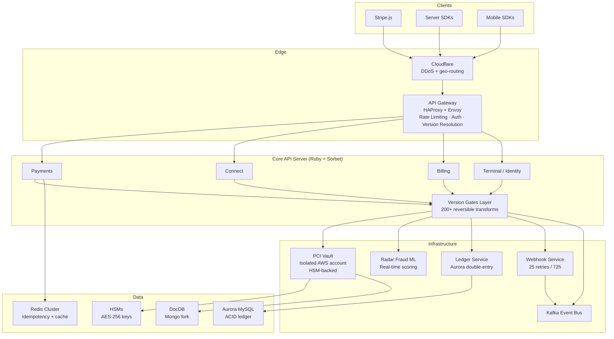
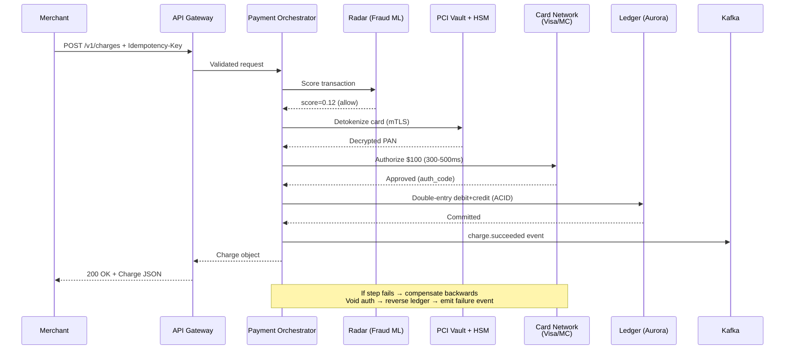
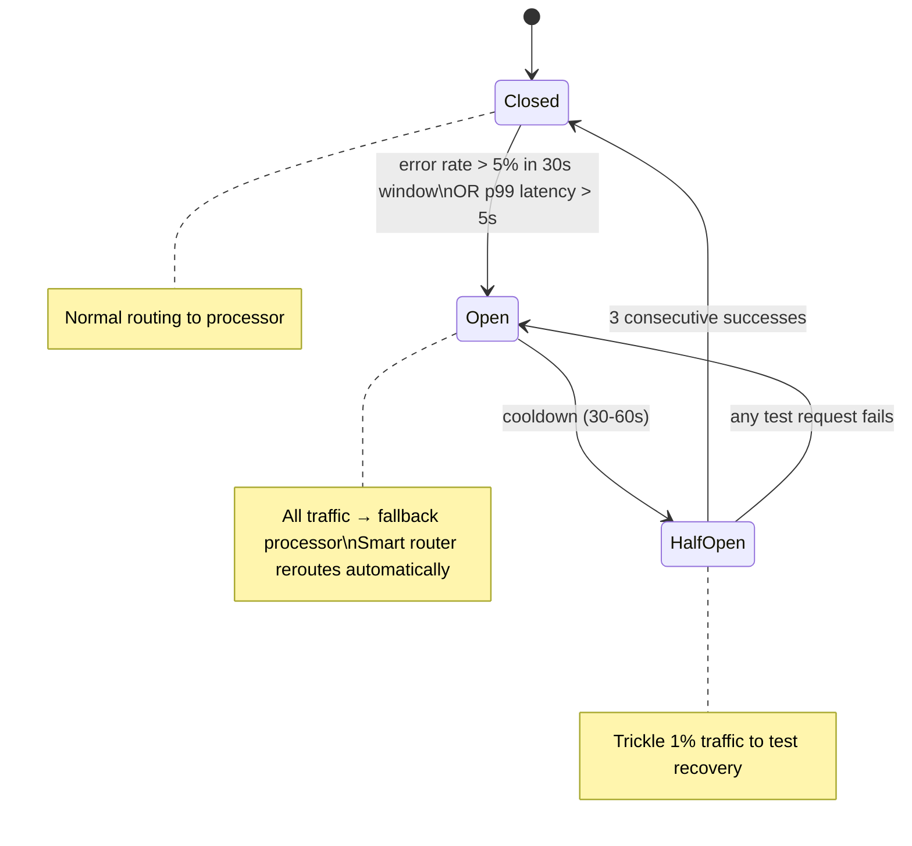

# Stripe — How Patterns Work in Production

> $1T+ annual volume, 4M+ businesses, 200+ API versions maintained simultaneously.
> Key: Idempotency system, Sorbet (Ruby type checker), Payment pipeline (orchestrated saga), PCI vault (bulkhead isolation).

---

## High-Level Architecture

```
  ┌──────────────────────────────────────────────────────────────────────────┐
  │                         CLIENT LAYER                                     │
  │   Stripe.js (browser)  ·  Mobile SDKs (iOS/Android)  ·  Server SDKs    │
  │   (Ruby, Python, Java, Go, Node, .NET, PHP)                            │
  └──────────────────────────┬───────────────────────────────────────────────┘
                             │  HTTPS (TLS 1.3)
                             ▼
  ┌──────────────────────────────────────────────────────────────────────────┐
  │                         EDGE LAYER                                       │
  │  ┌──────────────────────────────────────────────────────────────────┐   │
  │  │  CLOUDFLARE + CUSTOM PoPs                                        │   │
  │  │  DDoS mitigation · geo-routing                                   │   │
  │  └──────────────────────────────────────────────────────────────────┘   │
  │  ┌──────────────────────────────────────────────────────────────────┐   │
  │  │  API GATEWAY (HAProxy + Envoy mesh)                              │   │
  │  │  ┌──────────────┐ ┌──────────────┐ ┌──────────────────────────┐ │   │
  │  │  │ TLS termin.  │ │ Auth + API   │ │ Rate Limiting            │ │   │
  │  │  │ + routing    │ │ version      │ │ (3-layer token bucket)   │ │   │
  │  │  │              │ │ resolution   │ │ per-key · per-EP · global│ │   │
  │  │  └──────────────┘ └──────────────┘ └──────────────────────────┘ │   │
  │  └──────────────────────────────────────────────────────────────────┘   │
  └──────────────────────────┬─────────────────────────────────────────────┘
                             │
  ┌──────────────────────────▼─────────────────────────────────────────────┐
  │                    CORE API SERVER (Ruby — 10M+ lines, Sorbet-typed)   │
  │                                                                        │
  │  ┌────────────┐  ┌───────────┐  ┌────────────┐  ┌──────────────────┐  │
  │  │ Payments   │  │ Connect   │  │ Billing /  │  │ Terminal /       │  │
  │  │ Service    │  │ Service   │  │ Subscript. │  │ Identity / Issuing│  │
  │  └─────┬──────┘  └─────┬─────┘  └──────┬─────┘  └────────┬─────────┘  │
  │        │               │               │                  │            │
  │  Version Compatibility Layer ("Gates" — 200+ reversible transforms)    │
  └───────┬──────────────┬──────────────┬──────────────┬───────────────────┘
          │              │              │              │
          ▼              ▼              ▼              ▼
  ┌──────────────────────────────────────────────────────────────────────────┐
  │                    INFRASTRUCTURE LAYER                                  │
  │                                                                          │
  │  ┌───────────┐  ┌───────────┐  ┌──────────┐  ┌──────────┐  ┌────────┐ │
  │  │ PCI Vault │  │ Radar     │  │ Ledger   │  │ Webhooks │  │ Event  │ │
  │  │ (isolated │  │ (Fraud ML │  │ (Aurora  │  │ Service  │  │ Bus    │ │
  │  │  AWS acct,│  │  scoring, │  │  double- │  │ (25 retry│  │(Kafka) │ │
  │  │  HSM-     │  │  real-    │  │  entry)  │  │  over    │  │        │ │
  │  │  backed)  │  │  time)    │  │          │  │  72hrs)  │  │        │ │
  │  └─────┬─────┘  └─────┬─────┘  └─────┬────┘  └─────┬────┘  └────┬───┘ │
  │        │              │              │              │             │     │
  │  ┌─────▼─────┐  ┌─────▼─────┐  ┌────▼────┐  ┌─────▼─────┐           │
  │  │  HSMs     │  │  ML Model │  │ Aurora  │  │  Kafka    │           │
  │  │  (AES-256 │  │  (XGBoost │  │ (MySQL  │  │  (event   │           │
  │  │   keys)   │  │   + TF)   │  │  compat)│  │   bus)    │           │
  │  └───────────┘  └───────────┘  └─────────┘  └───────────┘           │
  │                                                                        │
  │  ┌──────────────────────────────────────────────────────────────────┐  │
  │  │  STORAGE: DocDB (Mongo fork) · Aurora · Redis Cluster · S3      │  │
  │  │  INFRA:   Kubernetes · Envoy mesh · Veneur+Datadog · Sorbet CI  │  │
  │  └──────────────────────────────────────────────────────────────────┘  │
  └──────────────────────────────────────────────────────────────────────────┘
```



---

## Pattern Deep Dives

### 1. Idempotency — Every Mutating API Call, Exactly-Once Semantics

> **Vault:** [[03_design_patterns/idempotency]]

**The problem:** Payment networks are unreliable. A client sends a charge request, the
charge succeeds on Visa's side, but the HTTP response is lost due to a network partition.
The client retries and double-charges the customer. At $1T+ annual volume, even 0.001%
double-charges would mean millions of dollars in errors.

**How Stripe implements it:**

Every mutating Stripe API call accepts an `Idempotency-Key` header — a client-generated
UUID. Stripe guarantees exactly-once semantics: the operation executes once, and
subsequent calls with the same key return the cached result.

```
  Client Request with Idempotency-Key: "idem_abc123"
            │
            ▼
  ┌─────────────────────────────────────────────────────┐
  │  1. LOOKUP in Redis                                 │
  │     Key found + status=complete?                    │
  │     ├── YES → Return cached response (200)          │
  │     └── NO  → Continue to step 2                    │
  │                                                     │
  │  2. ACQUIRE distributed lock (Redis SETNX, TTL=60s) │
  │     Lock acquired?                                  │
  │     ├── NO  → 409 Conflict ("request in progress")  │
  │     └── YES → Continue to step 3                    │
  │                                                     │
  │  3. PARAMETER MISMATCH CHECK                        │
  │     Key exists with different params?               │
  │     ├── YES → 400 Bad Request                       │
  │     └── NO  → Continue to step 4                    │
  │                                                     │
  │  4. EXECUTE                                         │
  │     a. Write idempotency record (status: started)   │  ← WAL: record before execute
  │     b. Execute payment logic (saga pipeline)        │
  │     c. Store full response in idempotency record    │
  │     d. Update status to "complete"                  │
  │                                                     │
  │  5. RELEASE lock, return response                   │
  └─────────────────────────────────────────────────────┘
```

**Key implementation details:**

- **Client-generated keys, not server-generated:** The client defines the scope of
  idempotency — what constitutes "the same request." Server tokens would require an
  extra round trip before the actual call.
- **24-hour TTL:** Long enough for any reasonable retry window. Infinite retention was
  considered but storage costs at hundreds of millions of active records were prohibitive.
  Clients do not retry after 24 hours in practice.
- **Parameter mismatch detection:** If a retry sends different parameters with the same
  key, Stripe returns 400. This catches bugs where clients accidentally reuse keys across
  different operations. The key is bound to the full request body hash.
- **Redis cluster:** ~50-100 nodes dedicated to idempotency. Sub-millisecond lookup (p50
  ~0.3ms, p99 ~2ms). ~5-10% of all API requests are retries that hit the cache.
- **Locked execution window:** If two requests arrive simultaneously with the same key,
  the second gets 409 rather than blocking. This avoids holding HTTP connections open.

**Patterns used:** [[03_design_patterns/distributed_locking]] (Redis SETNX),
[[03_design_patterns/write_ahead_log]] (record before execute),
[[03_design_patterns/event_sourcing]] (full request/response stored for audit/replay).

**When to cite in interviews:** Any question about exactly-once semantics, payment
idempotency, or distributed duplicate detection. This is Stripe's most distinctive
system.

---

### 2. Saga Pattern — Orchestrated 10-20 Step Payment Pipeline

> **Vault:** [[03_design_patterns/saga_pattern]]

**The problem:** Processing a single payment involves 10-20 discrete steps across
multiple services and external systems (card networks, banks). Any step can fail. The
system must handle partial completion gracefully: reversing charges, voiding
authorizations, or retrying specific steps. A payment is not a single database write —
it is a distributed transaction.

**How Stripe implements it:**

Stripe uses an **orchestrated saga** — the payment service acts as the central
coordinator, driving each step sequentially and compensating on failure. They chose
orchestration over choreography because it gives a single place to inspect the state
of any payment, making debugging vastly easier.

```
  POST /v1/charges → Payment Orchestrator drives:

  Step 1: API Validation + Auth         Compensation: none needed
       │
       ▼
  Step 2: Radar Fraud Screening (~20ms) Compensation: none needed
       │  ML model scores 0.0-1.0
       │  Block if score > threshold
       ▼
  Step 3: Payment Method Resolution     Compensation: none needed
       │  Retrieve token from PCI Vault
       │  Decrypt via HSM
       ▼
  Step 4: Smart Routing (Adaptive)      Compensation: none needed
       │  Choose optimal processor
       │  Based on: success rate, latency, cost
       │  If primary degraded → fallback processor
       ▼
  Step 5: Network Authorization         Compensation: VOID authorization
       │  Send to Visa/MC/Amex (~300-500ms)
       │  Timeout: 10s, retry: 1x on timeout
       │  DECLINED → return decline reason, stop
       ▼
  Step 6: Ledger Update (Aurora, ACID)  Compensation: REVERSE ledger entries
       │  Double-entry bookkeeping
       │  Debit + credit entries atomically
       ▼
  Step 7: Event Emission (Kafka)        Compensation: emit failure event
       │  Publish charge.succeeded
       │  Triggers: webhooks, receipts, analytics
       ▼
  Step 8: Response to merchant          Include idempotency record update
```

**Compensation flow (failure at step 6):**

```
  Step 6 (Ledger) fails
       │
       ▼
  Compensate Step 5: Send void/reversal to card network (~200ms)
       │              Authorization released on cardholder's account
       ▼
  Record failure event to Kafka + store in idempotency record
       │
       ▼
  Return 500 with descriptive error code
  Merchant can retry with same idempotency key
```



**Key implementation details:**

- **Orchestrated, not choreographed:** Single coordinator. Easier to debug ("where is
  this payment stuck?"), easier to add steps, easier to reason about compensation order.
  The cost is a central coordinator, but payments are inherently sequential anyway.
- **Smart routing with fallback:** Routes to the processor with highest expected success
  rate for a given card BIN, currency, and region. If primary is degraded (circuit
  breaker open), falls back automatically. This alone recovers ~1-3% of transactions.
- **Double-entry ledger (Aurora):** Every charge creates offsetting debit and credit
  entries in a single ACID transaction. Makes reconciliation possible, catches
  accounting bugs immediately.
- **Scale:** ~50K-100K payments/sec at peak. End-to-end: ~800ms median, ~2s p99
  (dominated by external card network round-trips of ~300-500ms).

**When to cite in interviews:** Any payment system design question. The orchestrated
saga with per-step compensation is the canonical answer for "how do you handle
distributed transactions without 2PC?"

---

### 3. Circuit Breaker — Per-Processor Isolation

> **Vault:** [[03_design_patterns/circuit_breaker]]

**The problem:** Stripe talks to dozens of external payment processors (Visa, Mastercard,
Amex, regional acquirers, bank APIs). Any processor can degrade — slow responses,
elevated error rates, full outages. Without isolation, a degraded Visa endpoint could
exhaust connection pools and take down processing for all card networks.

**How Stripe implements it:**

Each external processor gets its own circuit breaker with independent health tracking:

```
  Per-Processor Circuit Breakers:

  ┌───────────────────┐  ┌───────────────────┐  ┌───────────────────┐
  │  VISA Circuit     │  │  MASTERCARD       │  │  AMEX Circuit     │
  │  ┌─────────────┐  │  │  Circuit          │  │  ┌─────────────┐  │
  │  │ State: CLOSED│  │  │  ┌─────────────┐  │  │  │ State: OPEN │  │
  │  │ Err: 1.2%   │  │  │  │ State: CLOSED│  │  │  │ Err: 47%    │  │
  │  │ Latency: OK │  │  │  │ Err: 0.8%   │  │  │  │ → FALLBACK  │  │
  │  └─────────────┘  │  │  └─────────────┘  │  │  └─────────────┘  │
  │  Normal routing   │  │  Normal routing   │  │  Route to backup  │
  └───────────────────┘  └───────────────────┘  └───────────────────┘
                                                    │
                                                    ▼
                                              ┌───────────────────┐
                                              │  BACKUP ACQUIRER  │
                                              │  (secondary route)│
                                              └───────────────────┘
```



**Key implementation details:**

- **Per-processor + per-region:** Visa US-West might be healthy while Visa EU-Central
  is degraded. Circuit breakers track at processor+region granularity.
- **Threshold:** Error rate > 5% in a 30-second sliding window, OR p99 latency > 5
  seconds (card networks normally respond in 300-500ms).
- **Fallback = smart rerouting:** When a circuit opens, the smart router automatically
  sends transactions to a backup acquirer. This happens transparently to the merchant.
- **Half-open trickle:** Rather than sending one test request, Stripe trickles 1% of
  traffic to test recovery — statistically more reliable at their scale.
- **Impact:** Circuit breakers + smart routing recover ~1-3% of transactions that would
  otherwise fail, worth hundreds of millions of dollars annually.

**When to cite in interviews:** Any question about third-party API reliability, payment
processor failover, or "how do you handle external service degradation?"

---

### 4. Distributed Locking — Redis Locks for Idempotency Key Races

> **Vault:** [[03_design_patterns/distributed_locking]]

**The problem:** Two identical requests arrive simultaneously with the same idempotency
key. Without coordination, both execute the payment logic, resulting in a double-charge.
The idempotency system needs a fast, reliable distributed lock.

**How Stripe implements it:**

```
  Request A: Idempotency-Key="idem_xyz"     Request B: Idempotency-Key="idem_xyz"
       │ (arrives at t=0ms)                      │ (arrives at t=2ms)
       ▼                                         ▼
  ┌──────────────────┐                    ┌──────────────────┐
  │ Redis SETNX      │                    │ Redis SETNX      │
  │ key="lock:xyz"   │                    │ key="lock:xyz"   │
  │ value=instanceA  │                    │ value=instanceB  │
  │ TTL=60s          │                    │ TTL=60s          │
  │ Result: OK ✓     │                    │ Result: FAIL ✗   │
  └────────┬─────────┘                    └────────┬─────────┘
           │                                       │
           ▼                                       ▼
  Execute payment logic                   Return 409 Conflict
  Store response                          "Request already in progress"
  Release lock (DEL with Lua check)
  Return 200
```

**Key implementation details:**

- **Redis SETNX + TTL:** The fast path for ~99.9% of cases. Sub-millisecond acquisition.
  60-second TTL ensures locks auto-expire if the holder crashes.
- **Lua-script release:** Lock released only by the holder (Lua script checks value
  matches instance ID before DEL). Prevents accidentally releasing another instance's lock.
- **Secondary consistency check:** After the Redis split-brain incident (see Failure
  Stories), Stripe added a DocDB conditional write as a backup. Redis is the fast path,
  but the database provides a secondary guarantee. Defense in depth.
- **Redlock for critical paths:** For the most critical payment paths, Stripe uses
  Redlock across 5 independent Redis instances. Majority quorum required to acquire.
  Slower (~5ms vs ~0.3ms) but partition-tolerant.

**When to cite in interviews:** Any distributed locking question, especially combined
with idempotency. The evolution from simple SETNX to Redlock after a real split-brain
failure is an excellent production anecdote.

---

### 5. Rate Limiting — 3-Layer Token Bucket

> **Vault:** [[02_building_blocks/rate_limiter]] · Also: [[05_case_studies/design_rate_limiter]]

**The problem:** Stripe serves 4M+ businesses through a shared API. One merchant running
a batch import at 10K req/sec could starve others. Malicious actors could DDoS the API.
Internal services need protection from traffic spikes. Rate limiting must be fast (in the
hot path of every request), fair (per-tenant), and adaptive (handle abuse patterns).

**How Stripe implements it:**

Three layers, each protecting a different scope:

```
  Request arrives at API Gateway
            │
            ▼
  ┌─────────────────────────────────────────────────────────┐
  │  LAYER 1: GLOBAL (per-endpoint protection)              │
  │  Algorithm: Token bucket                                │
  │  Scope: Per API endpoint across all merchants           │
  │  Limit: ~10K req/sec per endpoint                       │
  │  Purpose: Protect infrastructure from total overload    │
  │  Storage: Local in-memory counter (no Redis round-trip) │
  └─────────────────────────┬───────────────────────────────┘
                            │ pass
                            ▼
  ┌─────────────────────────────────────────────────────────┐
  │  LAYER 2: PER-API-KEY (merchant fairness)               │
  │  Algorithm: Token bucket                                │
  │  Scope: Per merchant API key                            │
  │  Limit: 100 req/sec (live), 25 req/sec (test)          │
  │  Purpose: Prevent one merchant from starving others     │
  │  Storage: Redis INCR + EXPIRE (sliding window approx.)  │
  │  Adjustable: Enterprise merchants get custom limits     │
  └─────────────────────────┬───────────────────────────────┘
                            │ pass
                            ▼
  ┌─────────────────────────────────────────────────────────┐
  │  LAYER 3: ADAPTIVE / ABUSE DETECTION                    │
  │  Algorithm: Sliding window counters + anomaly detection │
  │  Scope: Per merchant, per endpoint, per IP              │
  │  Trigger: Sudden 10x spike → throttle                   │
  │  Purpose: Catch abuse patterns (scraping, brute force)  │
  │  Storage: Redis sorted sets for precise windowing       │
  └─────────────────────────────────────────────────────────┘
```

**Key implementation details:**

- **Token bucket algorithm:** Stripe chose token bucket over sliding window for Layers
  1-2 because it allows natural bursting. A merchant idle for 5 seconds accumulates
  tokens and can burst briefly, which fits real payment patterns (batch imports).
- **Redis counters for Layer 2:** `INCR` + `EXPIRE` on a key like
  `ratelimit:{api_key}:{minute}`. Atomic, fast (~0.3ms). The approximation is good
  enough — exact sliding windows are not worth the cost.
- **Response headers:** Every response includes `RateLimit-Limit`, `RateLimit-Remaining`,
  and `RateLimit-Reset` headers so clients can self-throttle.
- **429 Too Many Requests:** Includes `Retry-After` header with exponential backoff
  suggestion. Stripe's client SDKs auto-retry on 429 with built-in jitter.

**When to cite in interviews:** This is a top Stripe interview question. Know the 3-layer
architecture, explain why token bucket (allows bursting), and discuss per-tenant fairness.

---

### 6. Event Sourcing — Payment Ledger as Append-Only Event Log

> **Vault:** [[03_design_patterns/event_sourcing]]

**The problem:** Financial systems require a complete, immutable audit trail. Every
dollar must be traceable from charge to payout. "What happened to payment X?" must
be answerable by replaying events. Traditional CRUD overwrites state and loses history.

**How Stripe implements it:**

Every payment state change is recorded as an immutable event in Kafka and the ledger:

```
  Payment py_abc123 lifecycle (event log):

  t=0ms    charge.created        {amount: 10000, currency: "usd", status: "pending"}
  t=20ms   charge.fraud_checked  {radar_score: 0.12, outcome: "allow"}
  t=25ms   charge.method_resolved {payment_method: "pm_xyz", token: "tok_***"}
  t=30ms   charge.routed         {processor: "visa_us_west", acquirer: "chase"}
  t=530ms  charge.authorized     {auth_code: "A12B3C", network_status: "approved"}
  t=535ms  charge.ledger_updated {debit: "merchant_receivable", credit: "card_payable"}
  t=540ms  charge.succeeded      {final_amount: 10000, fee: 319}

  On failure at any step:
  t=535ms  charge.ledger_failed  {error: "deadlock", retry_count: 1}
  t=735ms  charge.void_sent      {reversal_id: "rev_abc"}
  t=935ms  charge.failed         {failure_code: "processing_error", message: "..."}
```

**Two layers of event sourcing:**

| Layer | Storage | Purpose | Retention |
|-------|---------|---------|-----------|
| **Kafka event bus** | Kafka topics partitioned by merchant | Real-time consumers: webhooks, analytics, Radar training, Dashboard updates | 7 days hot, then S3 cold storage |
| **Ledger (Aurora)** | Double-entry accounting rows | Financial truth: every debit has a matching credit. Immutable append-only. | Forever (regulatory requirement) |

**Key implementation details:**

- **Append-only, never update:** Ledger entries are never modified. A refund is a new
  set of entries that offset the original charge entries, not a deletion. This is
  standard double-entry bookkeeping adapted for event sourcing.
- **Event replay for debugging:** Engineers can replay the event log for any payment to
  reconstruct its full lifecycle. "Why did payment X fail?" is answered by reading the
  event sequence.
- **Kafka consumers are idempotent:** Every consumer (webhooks, analytics, Radar) uses
  Kafka consumer group offsets and processes events idempotently. Reprocessing the same
  event produces the same result.
- **API versioning as event sourcing:** The "gates" version system (see Pattern 8) is
  conceptually an event log of API changes applied in reverse order. Each gate is an
  event that transforms the response.

**When to cite in interviews:** Any question about audit trails, financial systems, or
"how do you debug a payment that went wrong?" Event sourcing + double-entry ledger is
the canonical answer for money systems.

---

### 7. Retry with Exponential Backoff + Jitter — All External Calls

> **Vault:** [[03_design_patterns/retry_with_backoff]]

**The problem:** External payment processors (Visa, Mastercard, bank APIs) have transient
failures — timeouts, 5xx responses, connection resets. Naive retries without backoff
create thundering herds. Retries without jitter synchronize across instances and create
periodic load spikes. Retries on non-idempotent operations risk double-charges.

**How Stripe implements it:**

```
  Retry strategy for external processor calls:

  Attempt 1: immediate
       │ timeout after 10s
       ▼
  Attempt 2: wait = min(base × 2^1 + jitter, max_delay)
       │      = min(500ms × 2 + rand(0,500ms), 30s)
       │      = ~1.0-1.5s
       │ timeout / 5xx
       ▼
  Attempt 3: wait = min(500ms × 4 + rand(0,500ms), 30s)
       │      = ~2.0-2.5s
       │ still failing
       ▼
  Give up → circuit breaker records failure
          → return error to saga orchestrator
          → orchestrator triggers compensation

  Formula: delay = min(base_delay × 2^attempt + random(0, base_delay), max_delay)
  base_delay = 500ms, max_delay = 30s, max_attempts = 3
```

**Key implementation details:**

- **Idempotency-key-safe retries:** Because external processor calls include Stripe's
  internal request ID, retries are safe — the processor deduplicates on their end. This
  is idempotency at the outbound level, not just inbound.
- **Full jitter (not equal jitter):** Stripe uses full jitter (`random(0, delay)`) rather
  than equal jitter (`delay/2 + random(0, delay/2)`). Full jitter has lower total
  client work and is simpler.
- **Webhook delivery retries:** Webhooks use a much longer retry schedule: 25 retries
  over 72 hours with exponential backoff. The gaps grow from seconds to hours. After 72
  hours, the event is marked as failed and the merchant is notified.
- **Circuit breaker integration:** Each retry failure is fed to the per-processor circuit
  breaker. After enough failures, the circuit opens and retries stop entirely — traffic
  reroutes to a backup processor.

**When to cite in interviews:** Always mention jitter when discussing retries. The
interaction between retry, idempotency, and circuit breaker is a key Stripe design
pattern triad.

---

### 8. API Versioning — The "Gates" Pattern

> No vault link (Stripe-specific pattern). Related: [[03_design_patterns/event_sourcing]]

**The problem:** Stripe maintains backwards compatibility across 200+ API versions dating
back to 2011. Merchants embed Stripe API calls deep in their payment flows. A breaking
change could cause payment failures across millions of businesses. Unlike consumer apps,
B2B API providers cannot force-update clients.

**How Stripe implements it:**

Stripe invented the "gates" pattern. Each API-breaking change is encoded as a small,
reversible transformation function called a "gate." Business logic ALWAYS operates on
the latest internal format. When rendering a response for an older API version, Stripe
applies all gates in reverse chronological order from the latest version down to the
merchant's pinned version.

```
  Internal representation (always latest):
  {
    "payment_method": "pm_abc",
    "metadata": {"desc": "Order #123"},
    "amount_details": {"tip": 200}
  }
       │
       │  Merchant is on version 2020-08-27
       │  Apply gates in REVERSE order:
       ▼
  ┌──────────────────────────────────────────┐
  │  Gate 2024-01-15: "description" moved    │
  │  Merchant version < 2024-01-15?          │
  │  YES → move metadata.desc → description  │
  └──────────────────┬───────────────────────┘
                     ▼
  ┌──────────────────────────────────────────┐
  │  Gate 2023-06-01: "source" renamed       │
  │  Merchant version < 2023-06-01?          │
  │  YES → rename payment_method → source    │
  └──────────────────┬───────────────────────┘
                     ▼
  ┌──────────────────────────────────────────┐
  │  Gate 2022-11-15: amount_details added   │
  │  Merchant version < 2022-11-15?          │
  │  YES → remove amount_details field       │
  └──────────────────┬───────────────────────┘
                     ▼
  ... (200+ gates, each is a small function) ...
                     ▼
  Final response for version 2020-08-27:
  {
    "source": "pm_abc",
    "description": "Order #123"
  }
```

**Key implementation details:**

- **Gates, not branches:** Each change is a small, isolated, reversible function. No
  version-conditional logic pollutes the core codebase. Adding a new version means adding
  one new gate function.
- **Core logic is always latest:** Internal data model and business logic always operate
  on the latest version. Version compatibility is a presentation concern at the boundary.
  This is critical — otherwise the codebase would accumulate 200 code paths.
- **~50 gates per year:** Roughly one per week. Each gate has tests for both forward and
  backward transformation.
- **Version gate fuzzing:** Automated testing generates random API responses and verifies
  all version transformations are reversible. Catches edge cases like zero-decimal
  currencies (JPY) that have tripped gates in the past.
- **Latency cost:** ~1-3ms per request to run through the gate chain. Acceptable.
- **~30% of merchants** are on API versions more than 2 years old.

**When to cite in interviews:** Any API versioning question. The gates pattern is far
more elegant than "maintain N separate code paths" or "URL versioning." It is Stripe's
most distinctive engineering contribution to API design.

---

### 9. Write-Ahead Log — Transaction Durability in Payment Pipeline

> **Vault:** [[03_design_patterns/write_ahead_log]]

**The problem:** In the payment pipeline, the system must survive crashes at any point.
If the process crashes after authorizing a charge on Visa but before recording the
result, the system has lost track of money. The charge happened in the real world but
the system does not know about it.

**How Stripe implements it:**

Before making any external call (card network authorization, bank transfer), the payment
orchestrator writes a durable record of the intent:

```
  Payment Pipeline with WAL:

  ┌────────────────────────────────────────┐
  │  1. Write intent to WAL (DocDB)        │
  │     {payment_id: "py_abc",             │
  │      step: "authorize",                │
  │      processor: "visa_us",             │
  │      amount: 10000,                    │
  │      status: "pending",                │
  │      created_at: 1708700000}           │
  │     DURABLY COMMITTED (w:majority)     │
  └──────────────────┬─────────────────────┘
                     │
                     ▼
  ┌────────────────────────────────────────┐
  │  2. Make external call                 │
  │     POST to Visa authorization API     │
  │     (this is the dangerous step —      │
  │      we might crash here)              │
  └──────────────────┬─────────────────────┘
                     │
                     ▼
  ┌────────────────────────────────────────┐
  │  3. Update WAL record                  │
  │     status: "completed"                │
  │     auth_code: "A12B3C"                │
  │     If crash before this step →        │
  │     recovery worker finds "pending"    │
  │     record and reconciles with Visa    │
  └────────────────────────────────────────┘

  Recovery Worker (runs continuously):
  ┌──────────────────────────────────────────┐
  │  SELECT * FROM wal                       │
  │  WHERE status = "pending"                │
  │  AND created_at < NOW() - 60 seconds     │
  │                                          │
  │  For each stale record:                  │
  │  1. Query processor: "Did auth happen?"  │
  │  2. If yes → update WAL, continue saga   │
  │  3. If no  → mark failed, compensate     │
  └──────────────────────────────────────────┘
```

**Key implementation details:**

- **DocDB with w:majority:** WAL records use majority write concern — the record must be
  replicated before the external call proceeds. This is the lesson from the 2015 MongoDB
  write loss incident.
- **Recovery worker:** A background process continuously scans for "pending" records older
  than 60 seconds. For each, it queries the external processor to determine what actually
  happened, then reconciles.
- **Idempotency record as WAL:** The idempotency system's "started" status record is
  itself a WAL entry. If the process crashes mid-operation, the idempotency record shows
  "started" and the recovery worker handles it.
- **Audit log:** The PCI Vault has its own WAL — every access (tokenize/detokenize) is
  logged to an append-only audit trail before the operation executes. This satisfies PCI
  DSS audit requirements.

**When to cite in interviews:** Any question about crash recovery, at-least-once
delivery, or "what if the process dies mid-payment?" WAL + recovery worker is the
standard answer.

---

### 10. Bulkhead — PCI Vault Isolated in Separate AWS Account

> **Vault:** [[03_design_patterns/bulkhead_pattern]]

**The problem:** A breach of card data (PANs, CVVs) would be existential for a payments
company. PCI DSS Level 1 compliance demands that cardholder data be isolated with strict
access controls, encryption, and auditing. The "blast radius" of any security incident
must be bounded.

**How Stripe implements it:**

The PCI Vault is a textbook bulkhead — a physically and logically isolated compartment:

```
  ┌─────────────────────────────────────────────────────────────────────┐
  │  STRIPE MAIN INFRASTRUCTURE (AWS Account A)                        │
  │                                                                     │
  │  ┌──────────┐ ┌──────────┐ ┌──────────┐ ┌──────────┐              │
  │  │ Payments │ │ Connect  │ │ Billing  │ │ Webhooks │              │
  │  │ Service  │ │ Service  │ │ Service  │ │ Service  │              │
  │  └────┬─────┘ └──────────┘ └──────────┘ └──────────┘              │
  │       │                                                             │
  │       │ gRPC over mTLS (ONLY allowed connection)                   │
  │       │                                                             │
  └───────┼─────────────────────────────────────────────────────────────┘
          │
  ════════╪══════════════════════════════════════════════════════════════
  ┌───────▼─────────────────────────────────────────────────────────────┐
  │  PCI VAULT (AWS Account B — completely separate)                    │
  │                                                                     │
  │  Network:    Separate VPC, NO internet gateway                     │
  │  Access:     <20 engineers, additional background checks            │
  │  Code:       ~5,000 lines (intentionally minimal)                  │
  │  Reviews:    2 reviewers required, both from vault team            │
  │  CI/CD:      Separate pipeline                                     │
  │  On-call:    Separate rotation                                     │
  │  Audit:      Every access logged, immutable trail                  │
  │                                                                     │
  │  ┌─────────────────┐     ┌─────────────────┐                       │
  │  │  Tokenizer       │     │  Detokenizer     │                      │
  │  │  PAN in → tok out│     │  tok in → PAN out│                      │
  │  └────────┬─────────┘     └────────┬─────────┘                      │
  │           │                        │                                │
  │  ┌────────▼────────────────────────▼────────┐                       │
  │  │  Encrypted Storage                        │                      │
  │  │  DocDB (field-level encryption)           │                      │
  │  │  + HSMs (AES-256, keys never leave HSM)   │                      │
  │  └──────────────────────────────────────────┘                       │
  │                                                                     │
  │  Does exactly 2 things: tokenize and detokenize. Nothing else.     │
  └─────────────────────────────────────────────────────────────────────┘
```

**Key implementation details:**

- **Minimal surface area:** ~5,000 lines of code. Every line is a potential attack
  surface. Features are aggressively pushed outside the PCI boundary.
- **Field-level + database-level encryption:** Even if an attacker compromises the
  database, they get ciphertext. Even if they get the database key, the HSM key-wrapping
  means they cannot decrypt without physical HSM access.
- **Network tokens:** Stripe increasingly uses network tokenization (Visa/MC-provisioned
  tokens replacing PANs). Improves authorization rates by ~2-4% and reduces PCI scope.
- **Bulkhead extends to Radar:** The fraud ML system also runs in isolated compute with
  limited blast radius. Different scaling characteristics (GPU, batch processing) than
  API serving.
- **Annual PCI DSS Level 1 audit** by a Qualified Security Assessor (QSA).

**When to cite in interviews:** Any question about PCI compliance, sensitive data
isolation, or security architecture. The separate-AWS-account approach is the gold
standard for bulkhead isolation.

---

## Pattern Summary

| # | Pattern | Where at Stripe | Key Detail | Vault Link |
|---|---------|-----------------|------------|------------|
| 1 | **Idempotency** | Every mutating API call | Client UUID, Redis-backed, 24h TTL, param mismatch detection | [[03_design_patterns/idempotency]] |
| 2 | **Saga Pattern** | Payment pipeline (10-20 steps) | Orchestrated (not choreography), per-step compensation | [[03_design_patterns/saga_pattern]] |
| 3 | **Circuit Breaker** | Per-processor (Visa, MC, Amex) | 5% error → open, auto-reroute to backup acquirer | [[03_design_patterns/circuit_breaker]] |
| 4 | **Distributed Locking** | Idempotency key race prevention | Redis SETNX fast path + Redlock for critical paths + DocDB backup | [[03_design_patterns/distributed_locking]] |
| 5 | **Rate Limiting** | 3-layer: global, per-key, adaptive | Token bucket, Redis INCR+EXPIRE, 100 req/s default | [[02_building_blocks/rate_limiter]] |
| 6 | **Event Sourcing** | Payment ledger + Kafka event bus | Append-only, double-entry bookkeeping, full payment replay | [[03_design_patterns/event_sourcing]] |
| 7 | **Retry + Backoff + Jitter** | All external processor calls + webhooks | Full jitter, idempotency-key-safe, feeds circuit breaker | [[03_design_patterns/retry_with_backoff]] |
| 8 | **API Versioning (Gates)** | 200+ API versions, response boundary | Reversible transforms applied in reverse order | — |
| 9 | **Write-Ahead Log** | Payment pipeline crash recovery | Intent written before external call, recovery worker reconciles | [[03_design_patterns/write_ahead_log]] |
| 10 | **Bulkhead** | PCI Vault (separate AWS account) | <20 engineers, ~5K LOC, HSM-backed, no internet gateway | [[03_design_patterns/bulkhead_pattern]] |

---

## Failure Stories

### 1. MongoDB Write Loss (2015)

**What happened:** A MongoDB replica set election during routine maintenance caused ~30
seconds of write unavailability. Payments were accepted by the API but could not be
persisted. Some charges were lost — they succeeded on the card network but Stripe had
no record.

**Root cause:** MongoDB's default write concern was `w:1` (acknowledged by primary only).
When the primary stepped down, in-flight writes that had not replicated were lost.

**Fix:**
- Moved to `w:majority` write concern for all payment-critical writes (~2ms latency
  increase, accepted)
- Major factor in eventual fork of MongoDB into proprietary DocDB, which defaults to
  majority write concern
- Added WAL (write-ahead logging) for all external calls — never make an external call
  without a durable record of intent

**Lesson:** In financial systems, you cannot trade durability for latency. The cost of
a lost payment far exceeds the cost of slightly slower writes. This incident shaped
Stripe's entire approach to data durability.

---

### 2. Webhook Cascade Failure (2019)

**What happened:** A large merchant's webhook endpoint went down. Stripe's retry system
dutifully retried — 25 times over 72 hours per event. This merchant generated ~10K
events/minute. The retry queue ballooned, consuming all webhook worker capacity. Other
merchants' webhooks were delayed by hours.

**Root cause:** No per-merchant isolation in the webhook delivery system. One merchant's
failure consumed shared resources. The retry system amplified the failure.

**Fix:**
- Per-merchant webhook delivery queues with independent rate limits
- Circuit breaker per endpoint: 5 consecutive failures → pause retries, increase backoff
- "Fast lane" / "slow lane" separation: new events get priority over retries
- Per-tenant resource isolation (bulkhead) for async workloads

**Lesson:** Retry systems amplify failures. Per-tenant isolation is essential in
multi-tenant systems. Circuit breakers are needed not just for outbound calls to
processors, but for outbound calls to merchant endpoints too.

**Related:** [[03_design_patterns/circuit_breaker]], [[03_design_patterns/bulkhead_pattern]]

---

### 3. Redis Split-Brain — Double Payment Execution (2020)

**What happened:** A network partition caused a Redis Cluster split-brain. The
idempotency key store had two masters accepting writes for the same key range. This
briefly allowed duplicate payment execution — two instances of the same idempotency
key ran concurrently, resulting in double-charges.

**Root cause:** Redis Cluster's partition handling, combined with the application relying
on Redis as the **sole** distributed lock. Single point of coordination, single point of
failure.

**Fix:**
- Added secondary consistency check: DocDB conditional write as backup to the Redis lock.
  Redis is the fast path (~0.3ms), DocDB is the safety net (~5ms).
- Implemented Redlock across 5 independent Redis instances for critical payment paths.
  Majority quorum required — tolerates up to 2 instance failures.
- Added monitoring for Redis cluster topology changes with automatic traffic draining
  before failover.

**Lesson:** Never rely on a single system for distributed locking in financial-critical
paths. Defense in depth: fast primary lock + durable secondary check. This is why
Stripe's idempotency system now has two layers.

**Related:** [[03_design_patterns/distributed_locking]]

---

## Interview Quick Reference

| Question Type | Key Patterns to Cite | Stripe-Specific Detail |
|--------------|---------------------|----------------------|
| "Design a payment system" | Saga, Idempotency, WAL, Circuit Breaker | Orchestrated 10-20 step pipeline, exactly-once via client-generated idempotency keys, per-processor circuit breakers |
| "Design a rate limiter" | Token Bucket, Sliding Window | 3-layer: global + per-key + adaptive. Redis INCR+EXPIRE. 100 req/s default (live) |
| "Design an API versioning system" | Gates pattern, Event Sourcing | Reversible transform functions applied in reverse. Core logic always latest. 200+ versions. |
| "Design a webhook system" | Retry+Backoff+Jitter, Circuit Breaker, Bulkhead | 25 retries over 72h, per-merchant queues, fast/slow lane split |
| "How to handle distributed locking?" | SETNX, Redlock, Defense-in-depth | Redis SETNX fast path + DocDB conditional write backup. Evolved after split-brain incident. |
| "How to store sensitive data?" | Bulkhead, Encryption at rest | Separate AWS account, HSM-backed field-level encryption, <20 engineers, ~5K LOC |
| "Consistency vs. availability?" | CP for money, WAL, w:majority | Stripe leans CP for all financial paths. MongoDB w:majority after 2015 write loss. |
| "How to handle partial failures?" | Saga compensation, Idempotency | Compensate backwards (void auth → reverse ledger). Idempotency keys survive retries. |

**What Stripe interviewers look for:**
- Strong opinions on consistency guarantees (they expect you to choose correctness over availability for money)
- Understanding of exactly-once semantics and why they are hard
- Practical knowledge of failure modes (network partitions, split-brain, cascading failures)
- Clean API design instincts — Stripe cares deeply about API ergonomics

**Detailed interview prep:** [[17_company_interview_guide/stripe]]

---

## Startup Playbook — What to Steal from Stripe

### Day 1: Idempotency Keys on All Mutating Endpoints

Add `Idempotency-Key` header support from launch. Use a simple Redis SETNX + TTL
implementation. This prevents double-charges, double-creates, and double-anything from
the start. Retrofitting idempotency is much harder than building it in.

**Minimal implementation:** Redis key = `idem:{key_hash}`, value = serialized response,
TTL = 24h. Check before execute, store after execute. ~50 lines of middleware.

### Day 1: WAL Before External Calls

Before calling any external API (payment processor, email service, SMS), write a durable
record of intent. A background recovery worker scans for stale "pending" records and
reconciles. This prevents "ghost" operations where the external call succeeded but your
system does not know.

### Week 1: Token Bucket Rate Limiting

Add per-API-key rate limiting from the start. A single Redis counter per key per minute
is sufficient. Without this, one misbehaving client can take down your API for everyone.

### Month 1: The Gates Pattern for API Versioning

If you have external API consumers, implement the gates pattern early. Each breaking
change is a small reversible function. Core logic always operates on the latest version.
This scales to hundreds of versions without codebase complexity growing linearly.

### Month 3: Per-Dependency Circuit Breakers

Wrap every external dependency (payment processors, third-party APIs) in a circuit
breaker. Use an off-the-shelf library (resilience4j, polly, etc.). When the circuit
opens, return a meaningful error or fall back to an alternative. Do not let one slow
dependency cascade into total failure.

### What NOT to Steal Yet

- **Sorbet / custom type systems:** Use TypeScript or a typed language from the start instead. Sorbet was a fix for choosing Ruby at scale — avoid the problem entirely.
- **Custom DocDB fork:** Use PostgreSQL. You will not need a custom database for years.
- **5-node Redlock:** Simple Redis SETNX is fine until you process billions. Add defense-in-depth when you have real split-brain risk.
- **Separate AWS accounts for PCI:** Use a managed PCI-compliant payment processor (like Stripe itself) until your scale demands in-house card storage.

---

## Sorbet — Bonus: Gradual Type System for Ruby

> Not a distributed systems pattern, but a key Stripe engineering decision worth knowing.

**What it is:** A fast, incremental type checker for Ruby. Stripe's core API is 10M+
lines of Ruby. Sorbet adds optional static typing with per-file strictness levels.

**Key details:**
- Written in C++ for speed: full typecheck of 10M lines in ~10 seconds, incremental
  checks in ~100ms
- Gradual adoption: files start at `# typed: false` and ratchet up to `# typed: strict`
- ~80% of codebase annotated (from 0% in 2017)
- Catches ~5,000+ type errors per week before production
- Runtime checks (`T.let`, `T.cast`) sampled in production for dynamic dispatch safety
- Open-sourced in 2019

**Why it matters for interviews:** Shows Stripe's engineering culture — they invest
heavily in developer tooling and code quality. If asked "what's unique about Stripe's
engineering," Sorbet is the answer.

---

## Sources & Further Reading

### Official Stripe Engineering Blog
- "Idempotency Keys: How Stripe Prevents Double Charges" — Brandur Leach, 2017
- "Sorbet: A Fast, Powerful Type Checker for Ruby" — 2019
- "Scaling Stripe's Rate Limiting" — Paul Tarjan, 2017
- "API Versioning at Stripe" — Brandur Leach, 2017
- "Designing Robust and Predictable APIs with Idempotency" — 2020
- "How Stripe Builds APIs" — 2024
- "Migrating to Kubernetes" — 2022

### Talks & Presentations
- "Move Fast, Don't Break Your API" — Amber Feng, Strange Loop 2015
- "Sorbet: Why We Built a Type Checker for Ruby" — Dmitry Petrashko, RubyConf 2019
- "Payment Systems at Scale" — Cristina Cordova, QCon 2020

### Key Papers
- "Sagas" — Garcia-Molina & Salem (1987) — foundational saga pattern paper
- "Idempotence Is Not a Medical Condition" — Pat Helland (2012) — distributed idempotency theory
- PCI DSS v4.0 Standard — pcisecuritystandards.org

### Cross-Links
- [[17_company_interview_guide/stripe]] — Interview prep
- [[05_case_studies/design_rate_limiter]] — Rate limiter design
- [[03_design_patterns/saga_pattern]] — Saga pattern theory
- [[03_design_patterns/circuit_breaker]] — Circuit breaker theory
- [[03_design_patterns/distributed_locking]] — Distributed locking theory
- [[03_design_patterns/event_sourcing]] — Event sourcing theory
- [[03_design_patterns/idempotency]] — Idempotency theory
- [[03_design_patterns/retry_with_backoff]] — Retry with backoff theory
- [[03_design_patterns/write_ahead_log]] — WAL theory
- [[03_design_patterns/bulkhead_pattern]] — Bulkhead pattern theory
- [[03_design_patterns/back_pressure]] — Back pressure theory

---

*Last updated: 2026-02-23*
