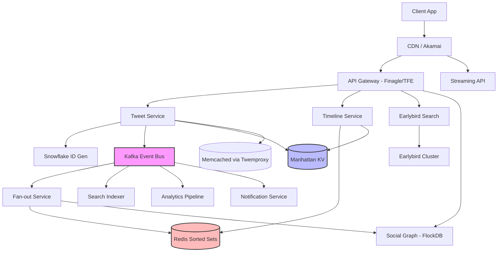
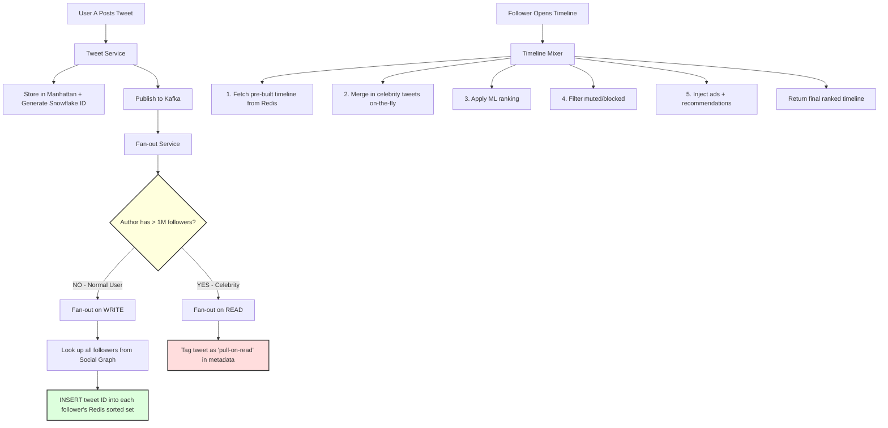
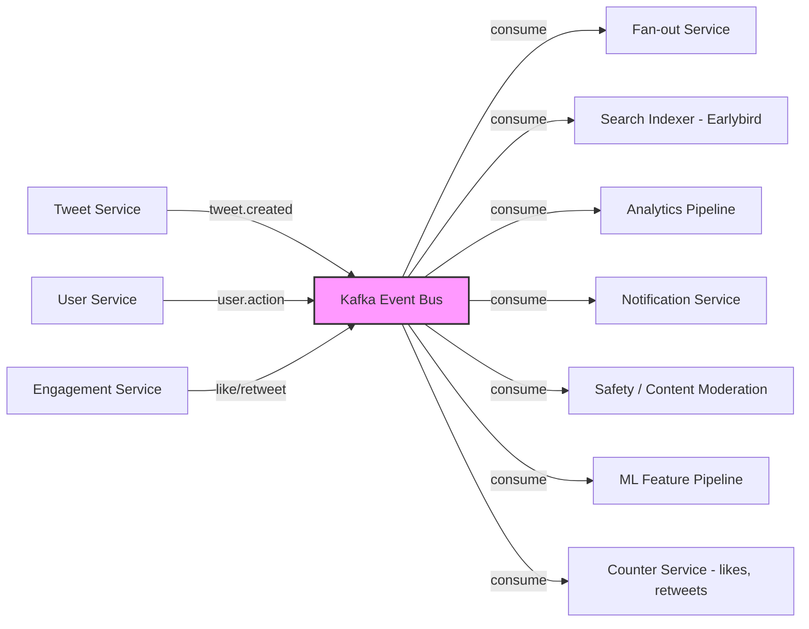
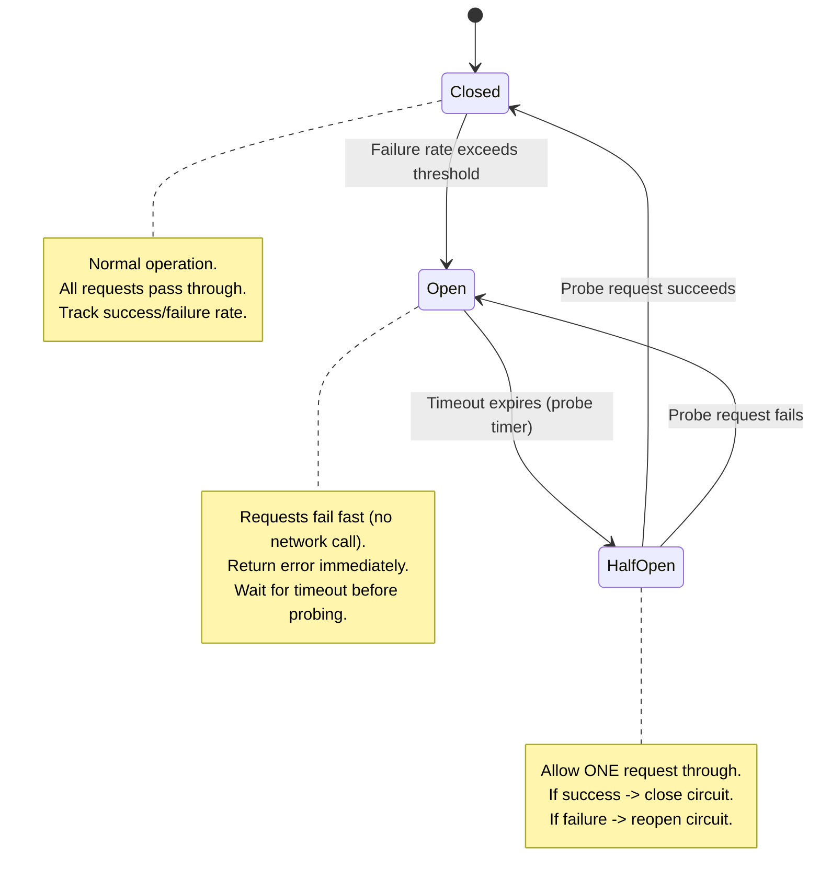

# Twitter/X --- How Patterns Work in Production

> 500M+ tweets/day, 200M+ DAU. Key systems: Snowflake IDs, Manhattan KV, Timeline Service, Earlybird Search. Open-source contributions: Finagle, Snowflake, Twemproxy, Heron.

---

## Company Snapshot

| Metric | Value |
|---|---|
| Tweets per day | 500M--650M (peaks during global events like World Cup) |
| Daily active users | 200M+ mDAU pre-acquisition; ~250M+ claimed post-rebrand |
| Timeline reads/sec | ~300K--600K (extreme read-heavy workload) |
| Search queries/sec | ~30K--50K |
| Peak event | 143,199 tweets/sec (2014 World Cup, Castle in the Sky record) |
| Primary languages | Scala (backend), Java (infra), Python (ML), Rust (perf-critical), C++ (serving) |
| Primary datastores | Manhattan (KV), MySQL (social graph), Redis, Memcached, Kafka, HDFS |
| Infrastructure | Bare-metal DCs (Sacramento, Portland, Atlanta) + Google Cloud (post-2023 migration) |
| Open-source | Finagle, Snowflake, Twemproxy, Heron, Summingbird, Algebird, Scrooge, twitter-server |
| Engineering headcount | ~6,500 pre-acquisition (Oct 2022) --> ~1,500 post-layoffs (2023) |

---

## High-Level Architecture

### ASCII Overview

```
                        +------------------------------+
                        |   Mobile / Web / API Clients |
                        +-------------+----------------+
                                      |
                                      v
                        +------------------------------+
                        |         CDN Layer            |
                        |   (Akamai + edge caches)     |
                        +-------------+----------------+
                                      |
                  +-------------------+-------------------+
                  |                                       |
                  v                                       v
        +------------------+                  +--------------------+
        |  API Frontend    |                  |   Streaming API    |
        |  (Finagle/TFE)   |                  |  (Firehose, Filter)|
        |  Rate limiting,  |                  |  persistent conn   |
        |  Auth, Routing   |                  +--------+-----------+
        +--------+---------+                           |
                 |                                     |
     +-----------+-----------+-----------+-------------+
     |           |           |           |
     v           v           v           v
+---------+ +----------+ +----------+ +-------------+
|Timeline | |  Tweet   | |  Social  | |   Search    |
| Service | | Service  | |  Graph   | | (Earlybird) |
|(fanout) | |(compose, | |(FlockDB/ | |  Real-time  |
|         | | deliver) | | MySQL)   | |  indexing   |
+----+----+ +----+-----+ +----+-----+ +------+------+
     |           |             |              |
     |     +-----+------+     |              |
     |     | Snowflake  |     |              |
     |     | ID Service |     |              |
     |     +------------+     |              |
     |                        |              |
+----+------------------------+--------------+------+
|                  Kafka Event Bus                   |
|       (tweet events, user actions, analytics)      |
+----+----------+----------+----------+-------------+
     |          |          |          |
     v          v          v          v
+---------+ +----------+ +--------+ +-----------+
|Manhattan| |Memcached | | Redis  | | HDFS /    |
|  (KV)   | |(Twemproxy| |(sorted | | Hadoop    |
|         | | proxy)   | | sets,  | | (batch)   |
|         | |          | | countr)| |           |
+---------+ +----------+ +--------+ +-----------+
```

### Mermaid: Service Interaction Flow



---

## Pattern Deep Dives

---

### Pattern 1: Distributed ID Generation --- Snowflake

> **Pattern:** Generate globally unique, time-sortable 64-bit IDs without any coordination between nodes.

**Link:** [[03_design_patterns/sharding]] (Snowflake IDs serve as natural shard keys)

#### Why Twitter Needed This

When Twitter sharded MySQL, auto-increment IDs broke --- two shards could generate the same ID. A centralized ID service would be a single point of failure. They needed IDs that are:
- Globally unique without coordination
- Roughly time-sorted (for timeline ordering)
- Compact (fit in 64 bits, not 128-bit UUIDs)
- Generatable at thousands per millisecond per worker

#### The 64-Bit Layout

```
+------+------------------------+------------+---------------------+
| Sign |      Timestamp         | Worker ID  |     Sequence        |
|  1b  |       41 bits          |  10 bits   |      12 bits        |
|      | (ms since custom epoch)|  (5 DC +   | (per-ms counter)    |
|      | ~69 years range        |  5 machine)|  0-4095 per ms      |
+------+------------------------+------------+---------------------+

Custom Epoch: 2010-11-04T01:42:54.657Z (Twitter's chosen start)

Capacity:
  - 41-bit timestamp: ~69 years from epoch (until ~2079)
  - 10-bit worker: 2^10 = 1,024 workers (32 DCs x 32 machines)
  - 12-bit sequence: 4,096 IDs per millisecond per worker
  - Theoretical max: 4,096 x 1,024 = ~4.2M IDs/ms across all workers
```

#### How It Works

```
Client (Tweet Service)         Snowflake Worker (embedded library)
─────────────────────         ──────────────────────────────────
        |                              |
        |──── request ID ────────────->|
        |                              |
        |                     1. Get current ms timestamp
        |                     2. Same ms as last call?
        |                        YES -> sequence++
        |                        NO  -> sequence = 0
        |                     3. Sequence > 4095?
        |                        YES -> spin-wait for next ms
        |                     4. Compose: (timestamp << 22)
        |                                 | (workerID << 12)
        |                                 | sequence
        |                              |
        |<──── 64-bit ID ─────────────|
```

#### Key Design Decisions

| Decision | Rationale |
|---|---|
| Custom epoch (not Unix) | Maximize usable time range; Unix epoch wastes 40+ years |
| Embedded library, not remote service | Eliminate network hop; sub-microsecond generation |
| Refuse IDs on clock skew backward | Safety over availability; log error until NTP corrects |
| Worker ID in the ID itself | Any node can determine which worker generated an ID |
| Time bits as most significant | IDs are naturally sortable by creation time |

#### Clock Skew Problem

```
Normal:    t=1000ms -> t=1001ms -> t=1002ms  (monotonic, fine)
NTP jump:  t=1000ms -> t=998ms               (backward jump!)

Snowflake response: REFUSE to generate IDs.
  - Throw exception / return error
  - Log alert for operations team
  - Wait until wall clock catches up to last seen timestamp
  - This trades AVAILABILITY for CORRECTNESS
```

**Interview anchor:** "How do you generate unique IDs across distributed systems without coordination?" Snowflake is the canonical answer. Mention the bit layout, the ~4096/ms/worker throughput, and the clock-skew trade-off.

---

### Pattern 2: CQRS / Fan-Out --- Timeline Service

> **Pattern:** Separate write model (fan-out tweet to follower inboxes) from read model (fetch pre-built timeline). Hybrid strategy: fan-out-on-write for normal users, fan-out-on-read for celebrities.

**Link:** [[03_design_patterns/cqrs]]

#### The Core Problem

- Pure fan-out-on-write: Celebrity with 80M followers = 80M Redis writes per tweet. Takes minutes. Wastes resources for followers who may never check their timeline.
- Pure fan-out-on-read: Every timeline load queries all 400 followed accounts. Latency explodes.
- Solution: Hybrid. Normal users get fan-out-on-write. Celebrities (>1M followers) get fan-out-on-read.

#### How Hybrid Fan-Out Works



#### Timeline Cache Structure (Redis Sorted Set)

```
Key: user:{userID}:timeline

+-----------------------------+----------------+
|  Score (Snowflake ID)       |  Member        |
+-----------------------------+----------------+
|  1541815603606036480        |  tweet_id_1    |  <-- newest
|  1541815103221036032        |  tweet_id_2    |
|  1541814800012345678        |  tweet_id_3    |
|  ...                        |  ...           |
|  1541612345678901234        |  tweet_id_800  |  <-- oldest (cap)
+-----------------------------+----------------+

Per-user size: ~800 tweet IDs x 8 bytes = ~6.4 KB
Fleet total:   200M active users x 6.4 KB = ~1.2 TB timeline cache
Operations:    ZADD O(log N), ZRANGEBYSCORE O(log N + K)
```

#### Why Snowflake IDs as Sort Scores

Using Snowflake IDs as Redis sorted-set scores is elegant because:
1. They are 64-bit integers (Redis scores are doubles, but integers up to 2^53 are exact)
2. They encode creation time, so sorting by ID = sorting by time
3. No separate timestamp field needed
4. Range queries by time become range queries by ID

#### Key Numbers

| Metric | Value |
|---|---|
| Fan-out threshold | ~1M followers (experimentally tuned) |
| Percentage of users on fan-out-on-read | ~0.01% of users |
| Timeline cache hit rate | ~99%+ for active users |
| Timeline cap | ~800 most recent tweet IDs per user |
| Cold-start fallback | Fan-out-on-read from social graph |

**Interview anchor:** "Design a news feed." Always mention the hybrid fan-out approach. The threshold is tunable --- it is not a fixed rule but an engineering trade-off between write amplification and read latency.

---

### Pattern 3: Consistent Hashing --- Manhattan and Twemproxy

> **Pattern:** Distribute data across nodes using a hash ring with virtual nodes (vnodes) so that adding/removing a node only remaps ~1/N of keys.

**Link:** [[03_design_patterns/consistent_hashing]]

#### Where Twitter Uses Consistent Hashing

| System | What Gets Hashed | Ring Members |
|---|---|---|
| Manhattan KV | Data partition key | Storage nodes |
| Twemproxy (Memcached) | Cache key | Memcached instances |
| Twemproxy (Redis) | Cache key | Redis instances |
| Earlybird | Tweet ID | Search shard nodes |

#### Twemproxy's Consistent Hash Ring

```
                    Hash Ring (2^32 positions)
                         ___________
                        /           \
                       /  vnode_A1   \
                      |    *         |
               vnode_C3 *      * vnode_B1
                     |               |
              vnode_A2 *        * vnode_C1
                      |               |
                       \  * vnode_B2  /
                        \___________/
                          * vnode_A3

    Node A: physical memcached instance, 3 vnodes (A1, A2, A3)
    Node B: physical memcached instance, 3 vnodes (B1, B2, B3)
    Node C: physical memcached instance, 3 vnodes (C1, C2, C3)

    Key "tweet:12345" hashes to position X on ring.
    Walk clockwise -> first vnode hit determines which physical node stores it.

    Adding Node D: only keys between D's vnodes and their predecessors remap.
    ~1/N of keys move. Other keys stay put.
```

#### Twemproxy Connection Multiplexing

```
Without Twemproxy:  100 app servers x 500 cache nodes = 50,000 TCP connections
With Twemproxy:     100 app servers x 1 proxy conn + proxy x 500 cache nodes
                    = 100 + 500 = 600 TCP connections  (83x reduction)
```

This is critical at Twitter's scale. Each TCP connection consumes kernel memory, file descriptors, and CPU for keepalive. Twemproxy also provides:
- Automatic ejection of failed nodes (with configurable retry)
- Pipelining of requests for higher throughput
- Support for multiple hashing algorithms (ketama, fnv1a, etc.)

#### Manhattan's Hash Ring

Manhattan uses consistent hashing for partition routing across its storage fleet. The coordinator node:
1. Hashes the requested key
2. Identifies the responsible partition on the ring
3. Routes to the correct storage node (or quorum of nodes)
4. Handles read-repair if replicas disagree

**Interview anchor:** "Why consistent hashing over modular hashing?" Because mod N remaps almost ALL keys when N changes. Consistent hashing remaps only ~1/N. At Twitter's scale (hundreds of cache nodes), this is the difference between a manageable rebalance and a full cache stampede.

---

### Pattern 4: Sharding --- Manhattan and Earlybird

> **Pattern:** Horizontally partition data across multiple nodes by a shard key. Each shard owns a subset of the keyspace.

**Link:** [[03_design_patterns/sharding]]

#### Manhattan: LSM-Tree KV Sharding

Manhattan shards data by hashing the primary key across storage nodes. Each storage node runs an LSM-tree engine:

```
Write Path:                           Read Path:

  PUT(key, value)                     GET(key)
       |                                   |
       v                                   v
  +-----------+                       +-----------+
  | MemTable  | (in-memory, sorted)   | MemTable  | -- check first (newest)
  +-----------+                       +-----------+
       |  (flush when full)                |  MISS
       v                                   v
  +-----------+                       +-----------+
  | SSTable 0 | (immutable, on-disk)  | SSTable 0 | -- bloom filter check
  +-----------+                       +-----------+
  | SSTable 1 |                       | SSTable 1 | -- bloom filter check
  +-----------+                       +-----------+
  | SSTable 2 |                       | SSTable 2 | -- bloom filter check
  +-----------+                       +-----------+
       |                                   |
  Background compaction                Merge results, return latest
  merges SSTables
```

Manhattan supports multi-tenancy: tweets, user profiles, DMs, ad data, and safety signals each get their own logical keyspace with isolated quotas and SLAs, all on the same physical cluster.

#### Earlybird: Scatter-Gather Search Sharding

Earlybird shards tweets across search nodes by tweet ID hash. A search query fans out to ALL shards:

```
Search Query: "openai"
       |
       v
+----------------+
| Earlybird Root |  (scatter-gather coordinator)
+-------+--------+
        |
   +----+----+----+----+
   |    |    |    |    |
   v    v    v    v    v
+----+----+----+----+----+
|Shard|Shard|Shard|Shard|Shard|
| 0  | 1  | 2  | 3  | 4  |  ...hundreds of shards
+----+----+----+----+----+
  |    |    |    |    |
  v    v    v    v    v
Each shard searches its local inverted index.
Returns top-K results sorted by Snowflake ID (recency).

Earlybird Root merges partial results from all shards.
Applies global ranking and returns final top-K.
```

#### Sharding Strategies Across Twitter

| System | Shard Key | Strategy | Shard Count |
|---|---|---|---|
| Manhattan | Primary key hash | Consistent hashing | Hundreds of nodes |
| MySQL (Gizzard) | User ID | Range-based via middleware | Thousands of shards |
| Redis (timelines) | User ID | Hash-based | Large cluster |
| Earlybird | Tweet ID hash | Hash-based, scatter-gather | Hundreds of instances |
| Memcached | Cache key | Consistent hashing (Twemproxy) | Hundreds of instances |

**Interview anchor:** "How do you shard a search index?" Scatter-gather is the standard answer. Every shard gets the query, returns local top-K, coordinator merges. Trade-off: query fanout grows with shard count, but each shard's index is smaller and faster to search.

---

### Pattern 5: Pub/Sub --- Kafka Event Bus

> **Pattern:** Decouple producers from consumers using an event bus. Every tweet becomes an event consumed by multiple downstream services independently.

**Link:** [[03_design_patterns/pub_sub]]

#### Twitter's Event Flow



#### Why Kafka, Not Point-to-Point

Before Kafka, Twitter used Kestrel (a Scala message queue). The problems:
- Adding a new consumer meant modifying the producer
- No replay capability --- once consumed, messages were gone
- No consumer group semantics for parallel processing

Kafka provides:
- **Decoupling**: Tweet Service publishes once; N consumers read independently
- **Replay**: New consumers can read from any offset (reprocess historical events)
- **Ordering**: Messages within a partition are strictly ordered (partition by tweet ID or user ID)
- **Durability**: Replicated across brokers; survives broker failure

#### Scale at Twitter

| Metric | Value |
|---|---|
| Events per second | Hundreds of thousands across all topics |
| Consumer groups | Dozens (fan-out, search, analytics, safety, ML, etc.) |
| Retention | Days to weeks depending on topic |
| Partition count | High (for parallelism across consumer instances) |

**Interview anchor:** "How do you notify downstream services of a new tweet?" Kafka (or any durable event bus). The key insight is that tweet creation is a single write, but it triggers N downstream effects --- fan-out, search indexing, notifications, analytics. Pub/sub decouples these entirely.

---

### Pattern 6: Inverted Index --- Earlybird Search

> **Pattern:** Map terms to posting lists of document IDs. The foundational data structure for full-text search.

**Link:** [[02_building_blocks/search_systems]]

#### Earlybird's Three-Tier Architecture

```
Tier 1: REALTIME
  - Latest ~hours of tweets
  - Mutable in-memory segments (modified Lucene)
  - New tweets indexed within SECONDS of posting
  - Highest query priority

Tier 2: PROTECTED
  - Last ~7 days of tweets
  - Immutable on-disk Lucene segments
  - Flushed from Tier 1 when segments fill up

Tier 3: FULL ARCHIVE
  - ALL tweets ever posted (billions)
  - Separate cluster, sharded by time + hash
  - Used for Search API (paying customers) and internal tools
  - Higher latency tolerance
```

#### Inverted Index Structure (Per Shard)

```
+------------------+--------------------------------------+
|  Term            |  Posting List (Snowflake tweet IDs)  |
+------------------+--------------------------------------+
|  "openai"        |  [id_99, id_45, id_12, id_7]        |  <-- sorted desc by ID
|  "#ai"           |  [id_88, id_45, id_7, id_3]         |
|  "@elonmusk"     |  [id_88, id_5, id_1]                |
|  "lang:en"       |  [id_99, id_88, id_45, id_5, id_1]  |
|  "has:media"     |  [id_45, id_12]                      |
|  "from:user123"  |  [id_99, id_7]                       |
+------------------+--------------------------------------+

Query: "openai" AND "lang:en"
  -> Intersect posting lists for "openai" and "lang:en"
  -> Result: [id_99, id_45] (IDs in both lists)
  -> Return top-K by Snowflake ID (recency)
```

#### What Makes Earlybird Special

Standard Lucene flushes segments periodically. Earlybird modifies Lucene to support:
1. **Mutable in-memory segments**: New tweets are searchable immediately, not after a flush
2. **Posting lists sorted by Snowflake ID descending**: Enables efficient early termination for recency-ranked queries (stop after finding K results)
3. **Concurrent reads and writes**: Readers see a consistent snapshot while writers append to the segment
4. **Custom tokenization**: Handles @mentions, #hashtags, cashtags ($TSLA), URLs, emojis

#### Scale Numbers

| Metric | Value |
|---|---|
| Indexing throughput | ~6,000 tweets/second |
| Query throughput | ~30K--50K queries/second |
| p50 search latency | ~50ms |
| p99 search latency | ~200ms |
| Realtime index coverage | Last ~hours in memory |
| Full archive | Billions of tweets, separate cluster |

**Interview anchor:** "Design Twitter Search." Key points: inverted index, real-time mutable segments, three-tier architecture (realtime/protected/archive), scatter-gather across shards, posting lists sorted by Snowflake ID for efficient recency queries.

---

### Pattern 7: Multi-Layer Caching

> **Pattern:** Stack multiple cache layers with different characteristics. Each layer absorbs a percentage of traffic, protecting the layers below.

**Link:** [[02_building_blocks/caching]]

#### Twitter's Cache Hierarchy

```
Request for tweet data
        |
        v
+------------------+
|  L1: In-Process   |  Guava/Caffeine cache inside each JVM
|  (hot objects)    |  TTL: seconds | Size: MBs per instance
|  Hit rate: ~60%   |  Absorbs repeated reads within a single process
+--------+---------+
         | MISS
         v
+------------------+
|  L2: Memcached    |  Distributed cache via Twemproxy
|  (Twemproxy)     |  TTL: minutes to hours | Size: ~30TB fleet-wide
|  Hit rate: ~99%+  |  Consistent hashing across hundreds of nodes
+--------+---------+
         | MISS
         v
+------------------+
|  L3: Manhattan    |  Distributed KV store (source of truth)
|  (primary store)  |  Persistent | Replicated
+------------------+
         |
         | Write-back to L2 on read-miss
         v
```

#### Twemproxy Configuration Highlights

```
Consistent hashing: ketama algorithm with virtual nodes (vnodes)
  - 150+ vnodes per physical node (configurable)
  - Adding a node remaps only ~1/N of keys
  - Auto-eject failed nodes after configurable timeout
  - Ejected nodes get their keys redistributed to neighbors

Connection pooling:
  - Each Twemproxy instance maintains persistent connections to all backends
  - Clients connect only to Twemproxy (not directly to Memcached)
  - Pipelining: batch multiple requests into a single TCP write

No replication in cache layer:
  - A cache miss simply falls through to Manhattan
  - Simplicity > availability for a cache layer
  - Source of truth is always Manhattan
```

#### Cache Warming Strategy

When new Memcached nodes join the cluster:
1. Consistent hashing means only ~1/N of keys remap to the new node
2. Those keys initially miss (cold cache on new node)
3. A warming process pre-loads hot keys from Manhattan
4. Without warming: thundering herd on Manhattan for all remapped keys

**Interview anchor:** "How do you design a caching layer for high-read systems?" Multi-layer caching. L1 (in-process) absorbs hot-key thundering herds. L2 (distributed Memcached) absorbs 99%+ of reads. L3 (persistent store) handles the rest. Mention Twemproxy for connection multiplexing and consistent hashing.

---

### Pattern 8: Back Pressure and Rate Limiting

> **Pattern:** When a system is overloaded, push back on callers rather than accepting work that cannot be completed. Degrade gracefully during traffic spikes.

**Link:** [[03_design_patterns/back_pressure]]

#### Where Twitter Applies Back Pressure

```
Layer 1: API Gateway Rate Limiting
  +--------------------------------------------------+
  | Per-user rate limits (token bucket / sliding window)
  | - Authenticated: X requests per 15-min window
  | - Unauthenticated: stricter limits
  | - Stored in Redis (fast counter checks)
  | - Returns HTTP 429 Too Many Requests
  +--------------------------------------------------+

Layer 2: Service-Level Admission Control (Finagle)
  +--------------------------------------------------+
  | Finagle's built-in load shedding:
  | - Track request latency percentiles
  | - When p99 exceeds threshold, start rejecting
  |   a percentage of incoming requests
  | - Nack (negative acknowledgment) to caller
  | - Caller retries with backoff (or fails fast)
  +--------------------------------------------------+

Layer 3: Stream Processing Back Pressure (Heron)
  +--------------------------------------------------+
  | Heron (Storm replacement) per-component backpressure:
  | - If a bolt (processing component) falls behind,
  |   it signals upstream spouts to slow down
  | - Storm had NO backpressure: overflow -> memory
  |   exhaustion -> topology crash
  | - Heron: controlled slowdown instead of crash
  +--------------------------------------------------+
```

#### World Cup Scenario (143K tweets/sec)

During the 2014 World Cup, tweet volume spiked to 143K tweets/sec. The system survived because:
1. Kafka buffered the spike (producers wrote faster than consumers read)
2. Fan-out service shed non-critical work (analytics events delayed)
3. Timeline delivery was prioritized over search indexing
4. Rate limiting prevented API abuse from amplifying the spike
5. Finagle circuit breakers isolated failing downstream services

#### Graceful Degradation Hierarchy

```
Normal load:       All features enabled (search, trends, recommendations, ads)
Elevated load:     Disable non-critical features (recommendations, analytics)
High load:         Disable trends computation, serve stale search results
Critical load:     Rate limit aggressively, serve cached timelines only
Emergency:         Read-only mode, disable tweet posting for non-verified users
```

**Interview anchor:** "How do you handle viral events?" Back pressure at every layer. Kafka absorbs write spikes, rate limiting protects the API, Finagle admission control protects services, and graceful degradation sheds non-critical features. Never let the system accept more work than it can handle.

---

### Pattern 9: Materialized Views --- Pre-Computed Timelines

> **Pattern:** Pre-compute and store query results so reads are fast. Trade write-time computation for read-time speed.

The Timeline Service is fundamentally a materialized view system. Each user's home timeline is a pre-computed view stored in Redis, updated asynchronously as tweets arrive.

#### How It Differs from a Database View

| Aspect | Database View | Twitter Timeline (Materialized View) |
|---|---|---|
| Storage | Computed on query (virtual) or periodically refreshed | Continuously maintained in Redis |
| Update trigger | Periodic refresh or query-time | Event-driven (tweet published -> fan-out -> Redis write) |
| Consistency | Strong (if virtual) | Eventual (fan-out takes seconds) |
| Read latency | Depends on underlying query | O(log N + K) --- Redis sorted-set range query |
| Write cost | None (virtual) or batch refresh | O(F) per tweet where F = author's follower count |

#### The Write Amplification Trade-Off

```
User with 1,000 followers posts a tweet:
  - 1 write to Manhattan (store the tweet)
  - 1 publish to Kafka
  - 1,000 ZADD operations to Redis (one per follower's timeline)
  = 1,002 total writes for 1 tweet

But each of those 1,000 followers can now read their timeline with:
  - 1 ZRANGEBYSCORE from Redis
  = 1 read operation

Write amplification: 1,000x
Read reduction:      from "query 400 followed accounts" to "1 Redis range query"

For a read-heavy system (300K timeline reads/sec vs 6K tweets/sec), this trade-off is overwhelmingly worth it.
```

**Interview anchor:** "Why pre-compute timelines instead of building them on-the-fly?" Because the read-to-write ratio is ~50:1. Pre-computing trades write amplification for near-instant reads. The key constraint is that it only works economically for users with bounded follower counts (hence the celebrity exception).

---

### Pattern 10: Circuit Breaker --- Finagle RPC Framework

> **Pattern:** When a downstream service fails, stop sending it requests. Give it time to recover. Periodically probe to check if it is back.

**Link:** [[03_design_patterns/circuit_breaker]]

#### Finagle's Built-In Circuit Breaker



#### Finagle's Additional Resilience Features

```
Finagle RPC Stack (per-client configuration):
+----------------------------------------------------+
| Retry Policy                                        |
|   - Configurable retries with backoff               |
|   - Budget-based: max N retries per M requests      |
|   - Prevents retry storms                           |
+----------------------------------------------------+
| Timeout                                             |
|   - Per-request timeout (e.g., 200ms)               |
|   - Session timeout (connection-level)              |
+----------------------------------------------------+
| Circuit Breaker                                     |
|   - Failure accrual: track rolling failure rate      |
|   - Mark node dead after N consecutive failures     |
|   - Probe periodically to detect recovery           |
+----------------------------------------------------+
| Load Balancer                                       |
|   - P2C (power of two choices): pick 2 random       |
|     backends, route to the one with fewer pending   |
|     requests (least-loaded)                         |
+----------------------------------------------------+
| Admission Control                                   |
|   - Nack (negative acknowledgment) when overloaded  |
|   - Client-side: respect nacks, try another backend |
+----------------------------------------------------+
```

#### Why Finagle Matters

Twitter has thousands of microservices. Without circuit breakers on every RPC call:
- One slow service would cause threads to pile up in callers
- Callers would time out, causing THEIR callers to pile up
- Cascading failure across the entire service mesh

Finagle makes circuit breakers the DEFAULT, not opt-in. Every service-to-service call gets retry, timeout, circuit breaker, and load balancing automatically.

**Interview anchor:** "How do you prevent cascading failures in a microservice architecture?" Circuit breakers on all RPC calls. Finagle is the canonical example --- it builds resilience into the RPC framework itself so individual service teams do not need to implement it.

---

## Pattern Summary

| # | Pattern | Where at Twitter | Key Mechanism | Scale Impact | Vault Link |
|---|---|---|---|---|---|
| 1 | Distributed ID Generation | Snowflake | 64-bit: 41 timestamp + 10 worker + 12 sequence | ~4K IDs/ms/worker, no coordination | [[03_design_patterns/sharding]] |
| 2 | CQRS / Fan-Out | Timeline Service | Hybrid: write for normal, read for celebrities | 300K+ timeline reads/sec | [[03_design_patterns/cqrs]] |
| 3 | Consistent Hashing | Manhattan, Twemproxy | Hash ring with vnodes, ~1/N remap on change | Hundreds of cache/storage nodes | [[03_design_patterns/consistent_hashing]] |
| 4 | Sharding | Manhattan, Earlybird | Hash-based partitioning, scatter-gather for search | Petabytes of data, billions of tweets | [[03_design_patterns/sharding]] |
| 5 | Pub/Sub | Kafka Event Bus | Decoupled producers/consumers, replay capability | Every tweet triggers N downstream effects | [[03_design_patterns/pub_sub]] |
| 6 | Inverted Index | Earlybird Search | Terms -> posting lists, mutable realtime segments | 6K tweets/sec indexed, 50K queries/sec | [[02_building_blocks/search_systems]] |
| 7 | Multi-Layer Caching | Memcached + Redis | L1 in-process -> L2 Twemproxy -> L3 Manhattan | 99%+ cache hit rate, 30TB+ cache fleet | [[02_building_blocks/caching]] |
| 8 | Back Pressure | API + Finagle + Heron | Rate limiting, admission control, stream backpressure | Survived 143K tweets/sec World Cup spike | [[03_design_patterns/back_pressure]] |
| 9 | Materialized Views | Timeline Redis cache | Pre-computed timelines, event-driven updates | 1 read vs querying 400 accounts | --- |
| 10 | Circuit Breaker | Finagle RPC framework | Failure accrual, half-open probing, fail-fast | Prevents cascading failure across 1000s of services | [[03_design_patterns/circuit_breaker]] |

---

## Failure Stories

---

### Failure 1: The Fail Whale Era (2007--2009)

**What happened:** Twitter's Ruby on Rails monolith showed the iconic "Fail Whale" error page during any meaningful traffic spike. The site was down for hours at a time, sometimes daily.

**Root causes:**
- Single MySQL database for ALL data --- no sharding, no read replicas initially
- Ruby's Global Interpreter Lock (GIL) prevented true parallelism
- Tight coupling: a slow query in tweet posting blocked ALL timeline reads
- No caching layer: every page load hit the database directly
- Starling (Ruby message queue) could not handle fan-out at scale

**The cascading failure pattern:**
```
Traffic spike (e.g., Obama election tweet)
       |
       v
MySQL connection pool exhausted
       |
       v
Ruby processes block waiting for DB connections (GIL prevents concurrency)
       |
       v
Mongrel/Passenger worker pool exhausted (all workers blocked)
       |
       v
New requests get 503 / Fail Whale
       |
       v
Users refresh aggressively (retry storm)
       |
       v
Load increases further (positive feedback loop)
       |
       v
Total outage
```

**Resolution:** Multi-year migration (2008--2012):
- Backend services rewritten in Scala on the JVM (Finagle)
- MySQL sharded via Gizzard middleware
- Memcached caching layer added
- Monolith decomposed into microservices
- Result: 10--100x throughput improvement

**Lesson:** A monolith with a single database and no caching layer cannot scale beyond a certain point. The inability to independently scale read and write paths is fatal for a read-heavy social network.

---

### Failure 2: The 2022 Mass Layoffs --- Reliability Impact

**What happened:** After Elon Musk's $44B acquisition in October 2022, approximately 75% of engineering staff was laid off or departed voluntarily (~6,500 to ~1,500 engineers).

**Impact on systems:**
- **Orphaned microservices**: Many services lost their entire on-call rotation. No one understood their failure modes.
- **Monitoring gaps**: Alerts fired with nobody to acknowledge them. Dashboards pointed to deprecated services.
- **Slower incident response**: MTTR for production incidents reportedly increased.
- **Infrastructure debt**: Google Cloud migration attempted with far fewer infra engineers, leading to extended timelines and partial rollbacks.
- **Knowledge loss**: Tribal knowledge about why specific configurations existed, what edge cases were handled, and how to recover from specific failure scenarios.

**What saved the system (temporarily):**
- Pre-existing architecture quality: Finagle's circuit breakers, Manhattan's isolation, Kafka's durability
- These systems were designed to be self-healing and required minimal manual intervention
- The architecture was resilient even when the operations team was gutted

**Counter-narrative:** Some engineers argued that removing organizational overhead allowed faster decision-making. Some outages were avoided because remaining engineers had deep expertise and could move without bureaucratic friction.

**Lesson:** Operational excellence requires both good architecture AND institutional knowledge. A system designed to run with minimal human intervention (self-healing, automated failover, circuit breakers) is more resilient to workforce changes than one requiring deep tribal knowledge. Design for operational simplicity.

---

### Failure 3: Rate Limiting Crisis (July 2023)

**What happened:** Twitter implemented extreme rate limits: unverified users could view only 600 tweets/day, verified users 6,000/day. Many users saw "Rate limit exceeded" errors during normal browsing.

**Stated reason:** Combating data scraping by AI companies training on Twitter data.

**Likely contributing factors:**
- Cost pressure from Google Cloud migration (moving off owned data centers)
- Reduced infrastructure capacity with fewer engineers to optimize
- Aggressive scraping by AI training pipelines (legitimate concern)
- Technical debt from deferred infrastructure work

**System design implications:**
```
The rate limiting architecture:

Request -> API Gateway -> Redis counter check -> Service
                              |
                              |  IF counter > limit:
                              |  Return HTTP 429 immediately
                              |  (never hits backend services)
                              |
                              v
                         Token bucket per user
                         Sliding window per IP
                         Stored in Redis cluster
```

The irony: Twitter's own rate limiting infrastructure (Redis-based, battle-tested) worked perfectly. The crisis was not a technical failure of the rate limiter --- it was a policy decision that degraded user experience to manage infrastructure costs.

**Lesson:** Rate limiting is a technical tool, but setting limits is a business decision. Over-aggressive rate limiting that degrades the core user experience is a product failure, not a systems success. The best rate limiter in the world cannot solve a cost-structure problem.

---

## Interview Quick Reference

| Interview Question | Key Concepts to Discuss | Patterns Used |
|---|---|---|
| "Design Twitter" | Hybrid fan-out, Snowflake IDs, social graph, caching, Kafka | CQRS, Pub/Sub, Materialized Views, Sharding |
| "Design a tweet posting system" | Write path: Snowflake ID -> Manhattan -> Kafka -> fan-out | Pub/Sub, CQRS, Distributed ID Gen |
| "Design Twitter Search" | Earlybird, inverted index, scatter-gather, three tiers | Inverted Index, Sharding, CQRS |
| "Design a unique ID generator" | Snowflake: 41+10+12 bit layout, clock skew, no coordination | Distributed ID Generation |
| "Design a news feed / timeline" | Fan-out-on-write vs read, Redis sorted sets, ML ranking | CQRS, Materialized Views, Caching |
| "Design a distributed cache" | Twemproxy, consistent hashing, L1/L2/L3 hierarchy | Consistent Hashing, Multi-Layer Caching |
| "Handle celebrity tweets" | Fan-out-on-read for >1M followers, merge at read time | CQRS, Back Pressure |
| "Prevent cascading failures" | Finagle circuit breakers, timeouts, retries with budget | Circuit Breaker, Back Pressure |
| "Handle viral events" | Kafka buffering, graceful degradation, rate limiting | Back Pressure, Pub/Sub |
| "Scale a search engine" | Scatter-gather, inverted index, mutable segments | Sharding, Inverted Index |

### The 5-Minute Twitter Architecture Answer

If asked "walk me through Twitter's architecture" in an interview, hit these points in order:

1. **ID Generation**: Snowflake gives every tweet a unique, time-sortable 64-bit ID. No coordination needed.
2. **Write Path**: Tweet -> Snowflake ID -> Manhattan (persistent store) -> Kafka (event bus).
3. **Fan-Out**: Kafka event triggers fan-out service. Normal users: push tweet ID to followers' Redis sorted sets. Celebrities: skip fan-out, pull at read time.
4. **Read Path**: Timeline Mixer reads from Redis (pre-built timeline) + merges celebrity tweets + applies ML ranking.
5. **Search**: Earlybird indexes tweets in seconds using modified Lucene with mutable in-memory segments. Scatter-gather across shards.
6. **Caching**: L1 in-process -> L2 Memcached (Twemproxy) -> L3 Manhattan. 99%+ hit rate.
7. **Resilience**: Finagle gives every RPC call circuit breakers, retries, and timeouts by default.

---

## Startup Playbook --- What to Steal from Twitter

### 1. Steal Snowflake IDs (Day 1)

**Why:** Even at startup scale, auto-increment IDs from a single database are a ticking time bomb. The moment you shard, they break.

**How to adopt:**
- Use an open-source Snowflake implementation (or Twitter's archived one)
- Or use a simplified version: `timestamp_ms + random_bits` (less precise but sufficient for most startups)
- Key: make IDs time-sortable from the start. You will thank yourself when you need to paginate by creation time.

**Cost:** Near zero. It is a library, not a service.

### 2. Steal Kafka as the Event Backbone (Month 3-6)

**Why:** The moment you have more than one consumer of an event (e.g., "user signed up" needs to trigger email, analytics, onboarding), point-to-point calls become unmaintainable.

**How to adopt:**
- Start with a managed Kafka (Confluent Cloud, AWS MSK) or even Redis Streams / Amazon SQS for simpler needs
- Publish domain events (user.created, order.placed) to topics
- Consumers subscribe independently
- Enables replay, decoupling, and easy addition of new consumers

**Cost:** Managed Kafka starts at ~$100/month. The architectural benefit is enormous.

### 3. Steal Twemproxy / Connection Pooling (When Cache Fleet > 3 Nodes)

**Why:** Once you have more than a few Memcached/Redis nodes, direct connections from every app server to every cache node create a connection explosion.

**How to adopt:**
- Deploy Twemproxy (open-source, battle-tested at Twitter)
- Or use Envoy proxy with Redis/Memcached support
- Consistent hashing included for free

**Cost:** One lightweight proxy process. Open-source.

### 4. Steal the Hybrid Fan-Out Concept (When You Have "Power Users")

**Why:** Any system with followers/subscribers and a feed will eventually hit the fan-out problem. Start simple (fan-out-on-write for everyone), add the celebrity exception when needed.

**How to adopt:**
- Phase 1: Fan-out-on-write for all users (works until you have users with >10K followers)
- Phase 2: Add a threshold. Users above it get fan-out-on-read.
- Phase 3: ML ranking replaces pure chronological

**Cost:** The hybrid adds complexity. Do NOT build it until you need it. Start with pure fan-out-on-write.

### 5. Steal Finagle's Resilience Defaults (Immediately)

**Why:** Every service-to-service call needs timeouts, retries, and circuit breakers. Making these opt-in means most calls will have none.

**How to adopt:**
- If using gRPC: configure deadline propagation and retry policies
- If using HTTP: use a library with built-in circuit breakers (Hystrix pattern, resilience4j, Polly)
- Key: make resilience the DEFAULT, not an add-on

**Cost:** Configuration, not infrastructure. Near zero.

### Priority Order for Startups

```
Day 1:      Snowflake-style IDs + Timeouts on all HTTP calls
Month 1:    Add a caching layer (even a single Redis instance)
Month 3:    Kafka/event bus for decoupling
Month 6:    Twemproxy when cache fleet grows
Year 1+:    Hybrid fan-out, scatter-gather search, multi-layer caching
Year 2+:    Custom KV store? Probably never. Use managed services.
```

---

## Scaling Timeline

```
2006          2008          2010          2012          2015          2022+
────────────────────────────────────────────────────────────────────────────>

Ruby on       "Fail         JVM Era       Manhattan     ML &          X /
Rails         Whale"        (Finagle,     replaces      Ranking       Post-
Monolith      Era           Snowflake,    Cassandra.    (algorithmic  acquisition.
Single DB.    Frequent      Scala)        Earlybird.    timeline).    Mass layoffs.
~20 req/sec.  outages.      5K+           Heron.        Cortex ML.    GCP migration.
              Kestrel       tweets/sec.   143K t/sec    Spaces.       Open-source
              replaces      FlockDB.      World Cup.                  algo. Rust.
              Starling.     Gizzard.                                  Rebrand to X.
```

---

## Cross-References

- [[05_case_studies/design_twitter]] --- Full interview walkthrough for "Design Twitter"
- [[03_design_patterns/sharding]] --- Sharding patterns (Manhattan, Earlybird, Snowflake as shard key)
- [[03_design_patterns/cqrs]] --- CQRS pattern (Timeline fan-out write path vs read path)
- [[03_design_patterns/consistent_hashing]] --- Consistent hashing (Twemproxy, Manhattan ring)
- [[03_design_patterns/pub_sub]] --- Pub/Sub pattern (Kafka event bus)
- [[03_design_patterns/back_pressure]] --- Back pressure (Finagle admission control, Heron)
- [[03_design_patterns/circuit_breaker]] --- Circuit breaker (Finagle built-in)
- [[02_building_blocks/search_systems]] --- Search systems (Earlybird inverted index)
- [[02_building_blocks/caching]] --- Caching (Twemproxy, multi-layer hierarchy)

---

## Sources and Further Reading

1. **Snowflake** --- Twitter Engineering Blog, "Announcing Snowflake" (2010); GitHub: twitter-archive/snowflake
2. **Manhattan** --- "Manhattan, our real-time, multi-tenant distributed database for Twitter scale" --- Twitter Engineering Blog (2014)
3. **Timeline Service** --- Raffi Krikorian, "Timelines at Scale" --- QCon (2012); Twitter Engineering Blog (2013)
4. **Earlybird** --- Michael Busch et al., "Earlybird: Real-Time Search at Twitter" --- ICDE 2012
5. **Finagle** --- Marius Eriksen, "Your Server as a Function" --- PLOS 2013; GitHub: twitter/finagle
6. **Twemproxy** --- GitHub: twitter/twemproxy; Twitter Engineering Blog
7. **Heron** --- Sanjeev Kulkarni et al., "Twitter Heron: Stream Processing at Scale" --- SIGMOD 2015
8. **The Architecture of Twitter** --- InfoQ presentation by Raffi Krikorian (2012)
9. **Open-source Recommendation Algorithm** --- GitHub: twitter/the-algorithm (March 2023)
10. **Post-acquisition reporting** --- Platformer, The Verge, and other tech journalism (2022--2024)
