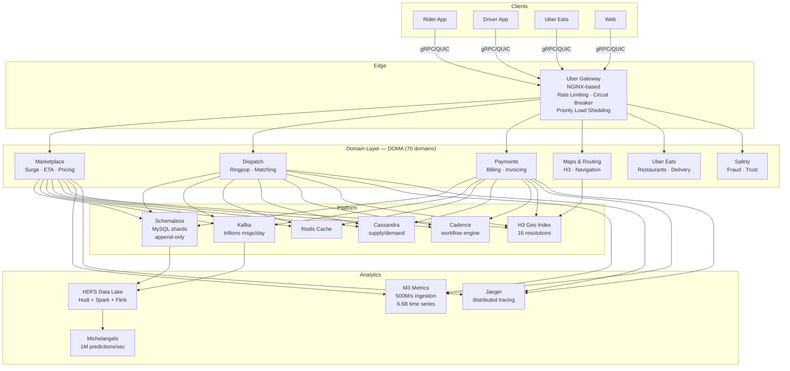
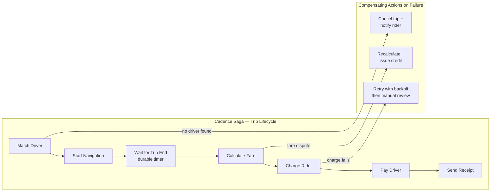
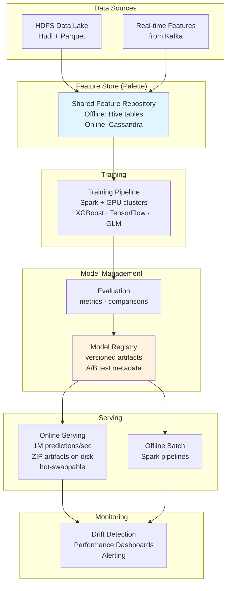
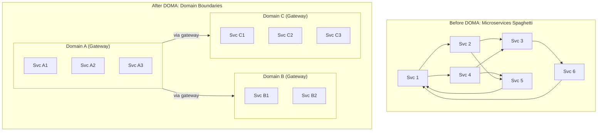

# Uber --- How Patterns Work in Production

> 156M+ MAU, 30M trips/day, 4500 microservices, 8M+ drivers, $162B gross bookings.
> Key systems: Ringpop, Schemaless, H3, Cadence, M3, Michelangelo, DOMA.

---

## High-Level Architecture

```
  ┌──────────────────────────────────────────────────────────────────────────┐
  │                         CLIENT LAYER                                     │
  │   Rider App (iOS/Android)  ·  Driver App  ·  Uber Eats  ·  Web         │
  │   (gRPC + QUIC to backend, H3 cell for location, push via WebSocket)   │
  └──────────────────────────┬───────────────────────────────────────────────┘
                             │
                    gRPC / QUIC / HTTPS
                             │
  ┌──────────────────────────▼───────────────────────────────────────────────┐
  │                      EDGE / GATEWAY LAYER                                │
  │  ┌─────────────────────────────────────────────────────────────────┐    │
  │  │  UBER GATEWAY (NGINX-based, custom routing)                     │    │
  │  │  ┌──────────────┐ ┌───────────────┐ ┌────────────────────────┐ │    │
  │  │  │ Auth + TLS   │ │ Per-endpoint  │ │ Priority-based Load    │ │    │
  │  │  │ Termination  │ │ Rate Limiting │ │ Shedding + Circuit     │ │    │
  │  │  │              │ │ (back press.) │ │ Breaker per service    │ │    │
  │  │  └──────────────┘ └───────────────┘ └────────────────────────┘ │    │
  │  └─────────────────────────────────────────────────────────────────┘    │
  └──────────────────────────┬───────────────────────────────────────────────┘
                             │
  ┌──────────────────────────▼───────────────────────────────────────────────┐
  │                 DOMAIN LAYER (DOMA: 70 domains, 4500 services)          │
  │                                                                          │
  │  ┌──────────────┐  ┌──────────────┐  ┌──────────────┐  ┌────────────┐  │
  │  │ Marketplace  │  │   Dispatch   │  │   Payments   │  │  Maps &    │  │
  │  │   Domain     │  │   Domain     │  │   Domain     │  │  Routing   │  │
  │  │ ┌──────────┐ │  │ ┌──────────┐ │  │ ┌──────────┐ │  │  Domain    │  │
  │  │ │ Gateway  │ │  │ │ Gateway  │ │  │ │ Gateway  │ │  │ ┌────────┐ │  │
  │  │ └──────────┘ │  │ └──────────┘ │  │ └──────────┘ │  │ │Gateway │ │  │
  │  │ Surge, ETA,  │  │ Ringpop,     │  │ Billing,     │  │ └────────┘ │  │
  │  │ Pricing      │  │ Matching     │  │ Invoicing    │  │ H3, ETA    │  │
  │  └──────────────┘  └──────────────┘  └──────────────┘  └────────────┘  │
  │                                                                          │
  │  ┌──────────────┐  ┌──────────────┐  ┌──────────────┐  ┌────────────┐  │
  │  │  Uber Eats   │  │   Safety     │  │   Identity   │  │  Comms     │  │
  │  │   Domain     │  │   Domain     │  │   Domain     │  │  Domain    │  │
  │  └──────────────┘  └──────────────┘  └──────────────┘  └────────────┘  │
  └──────┬─────────────────┬──────────────────┬────────────────┬────────────┘
         │                 │                  │                │
  ┌──────▼─────────────────▼──────────────────▼────────────────▼────────────┐
  │                      PLATFORM / DATA LAYER                              │
  │                                                                          │
  │  ┌──────────┐ ┌──────────┐ ┌───────┐ ┌─────────┐ ┌──────┐ ┌────────┐ │
  │  │Schemaless│ │  Kafka   │ │ Redis │ │Cassandra│ │ M3   │ │Cadence │ │
  │  │(MySQL    │ │ Event    │ │ Cache │ │ Supply/ │ │Metrics│ │Workflow│ │
  │  │ shards)  │ │ Bus      │ │       │ │ Demand  │ │ TSDB │ │ Engine │ │
  │  └──────────┘ └──────────┘ └───────┘ └─────────┘ └──────┘ └────────┘ │
  │                                                                          │
  │  ┌──────────┐ ┌──────────┐ ┌───────┐ ┌─────────┐ ┌────────────────┐   │
  │  │   H3     │ │  Jaeger  │ │DocStore│ │  Flink  │ │ Michelangelo   │   │
  │  │ Geo Index│ │ Tracing  │ │(MySQL+ │ │ Stream  │ │ ML Platform    │   │
  │  │          │ │          │ │Postgres)│ │ Process │ │                │   │
  │  └──────────┘ └──────────┘ └───────┘ └─────────┘ └────────────────┘   │
  │                                                                          │
  │  ┌────────────────────────────────────────────────────────────────┐     │
  │  │  HADOOP / HDFS DATA LAKE  (Hudi + Parquet + Spark + Flink)    │     │
  │  └────────────────────────────────────────────────────────────────┘     │
  └──────────────────────────────────────────────────────────────────────────┘
```



---

## Pattern Deep Dives

---

### Pattern 1 --- Consistent Hashing + Gossip: Ringpop

> **Pattern:** [[03_design_patterns/consistent_hashing]] + [[03_design_patterns/gossip_protocol]]
> **System:** Ringpop --- application-level consistent hash ring with SWIM gossip

**The problem.** Uber's dispatch system is stateful --- each city's supply/demand state
must live in memory somewhere. They needed Node.js dispatch workers to discover each
other, shard geospatial state by region, and automatically rebalance when nodes joined
or left. An external coordination service like ZooKeeper would add a network hop to
every shard lookup on the hot path.

**How Ringpop works.**

Ringpop embeds directly into application instances, organizing them into a consistent
hash ring. Every node knows the full ring topology. Any node can compute which peer
owns a given key without external lookups.

```
  ┌────────────────────────────────────────────────────────────┐
  │              CONSISTENT HASH RING (Ringpop)                │
  │                                                            │
  │     Node A ◄──gossip──► Node B ◄──gossip──► Node C        │
  │       │                   │                   │            │
  │   Hash Range          Hash Range          Hash Range       │
  │   [0, 120)            [120, 240)          [240, 360)       │
  │                                                            │
  │  SWIM Gossip Protocol (failure detection):                 │
  │   1. Node A pings random Node B                            │
  │   2. If B silent → A asks C to ping B (indirect probe)     │
  │   3. Still silent → A marks B as "suspect"                 │
  │   4. After timeout → B declared faulty → ring rebalances   │
  │   5. Convergence: seconds even with hundreds of nodes      │
  │                                                            │
  │  Key lookup:                                               │
  │   hash(trip_id) = 150 → falls in [120,240) → Node B       │
  │   Any node can compute this locally, zero network hops     │
  └────────────────────────────────────────────────────────────┘
```

**Scale numbers:**
- Handles dispatch sharding across all active cities worldwide
- Gossip convergence in seconds with hundreds of nodes
- Used in original Node.js dispatch tier processing millions of trips/day
- Built on TChannel (Uber's RPC protocol) for lower overhead than HTTP

**Key design decisions:**
- **SWIM over Serf/Consul** --- needed an embeddable library, not an external daemon.
  Ringpop runs in-process, eliminating a network hop for shard lookups.
- **Consistent hashing over random assignment** --- stateful dispatch needs deterministic
  routing. Any node computes which peer owns a key without central lookup.
- **TChannel over HTTP** --- lower overhead for internal service-to-service calls on
  the hot dispatch path.

**Interview angle:** "How would you shard stateful dispatch across nodes without a
central coordinator?" Answer: consistent hash ring with gossip-based membership
(Ringpop pattern). Every node holds the full ring; lookups are local.

---

### Pattern 2 --- Sharding: Schemaless on MySQL

> **Pattern:** [[03_design_patterns/sharding]]
> **System:** Schemaless --- append-only sparse triplet store on MySQL

**The problem.** By early 2014 Uber was growing explosively and their monolithic
Postgres backend could not keep up with trip storage. Halloween night was six months
away. They needed a horizontally scalable store built quickly on battle-tested MySQL,
with idempotent writes to survive retries.

**How Schemaless works.**

Schemaless is a three-dimensional persistent hash map layered on MySQL. Data is
addressed by `(row_key, column_name, ref_key)` and cells are immutable once written
--- similar to Google Bigtable.

```
  ┌───────────────────────────────────────────────────────────────┐
  │              SCHEMALESS ARCHITECTURE                           │
  │                                                               │
  │  Client Request                                               │
  │       │                                                       │
  │       ▼                                                       │
  │  ┌──────────┐  ┌──────────┐  ┌──────────┐                   │
  │  │ Worker   │  │ Worker   │  │ Worker   │  (stateless)       │
  │  │ Node 1   │  │ Node 2   │  │ Node N   │                   │
  │  └────┬─────┘  └────┬─────┘  └────┬─────┘                   │
  │       │              │              │                         │
  │       └──────┬───────┴──────┬───────┘                        │
  │              │              │                                  │
  │  ┌───────────▼───┐  ┌──────▼──────────┐                      │
  │  │ MySQL Shard 1 │  │ MySQL Shard N   │   (thousands)        │
  │  │               │  │                 │                       │
  │  │ ┌───────────────────────────────┐  │                      │
  │  │ │ row_key  │ col_name │ ref_key │  │                      │
  │  │ │ (UUID)   │ (string) │ (ver.)  │ → JSON blob             │
  │  │ └───────────────────────────────┘  │                      │
  │  └───────────────┘  └────────────────┘                       │
  │                                                               │
  │  Sharding strategy:                                           │
  │    shard_id = hash(row_key) % num_shards                      │
  │    row_key = entity UUID (e.g., trip_uuid)                    │
  │                                                               │
  │  Append-only writes:                                          │
  │    New ref_key for each "update" → full history preserved     │
  │    Writes are idempotent → safe to retry without corruption   │
  │                                                               │
  │  Change log triggers (per shard):                             │
  │    Every write emits event → downstream consumers             │
  │    Powers: billing, analytics, warehouse ETL                  │
  └───────────────────────────────────────────────────────────────┘
```

**Scale numbers:**
- Billions of trip records across thousands of MySQL shards
- Workers and storage nodes scale independently
- All writes idempotent and append-only
- Powers the critical path: "driver presses End Trip" through billing

**Key design decisions:**
- **MySQL over Cassandra** --- MySQL's single-node ACID simplified application logic.
  They shard MySQL themselves while keeping consistency within each shard.
- **Append-only over mutable rows** --- immutability makes writes idempotent, enables
  easy replication, simplifies debugging (full history preserved).
- **Build on MySQL over adopting NoSQL** --- deep MySQL operational expertise + needed
  production-ready in months, not years.

**Interview angle:** "How would you store billions of trips with horizontal scale?"
Answer: shard by entity UUID across MySQL instances, append-only writes for idempotency,
change-log triggers for async downstream processing.

---

### Pattern 3 --- Saga Pattern: Cadence Workflow Orchestration

> **Pattern:** [[03_design_patterns/saga_pattern]]
> **System:** Cadence --- durable workflow engine for long-running business logic

**The problem.** A trip lifecycle involves dozens of steps across multiple services:
match driver, start trip, track route, end trip, calculate fare, charge rider, pay
driver, send receipt, update analytics. Orchestrating this with just message queues
and callbacks led to brittle, hard-to-debug code. If any step fails mid-flow, the
system must compensate (refund rider, release driver, etc.).

**How Cadence implements the saga pattern.**

Developers write workflow logic as regular sequential code. Cadence handles state
persistence, retries, and failure recovery via replay-based execution. Each step
("activity") can have compensating actions for rollback.



```
  Cadence Architecture:

  ┌──────────────────┐     ┌──────────────────┐
  │ Workflow Workers  │     │ Activity Workers  │
  │ (Go/Java SDK)    │     │ (Go/Java SDK)     │
  └────────┬─────────┘     └────────┬──────────┘
           │  long-poll              │  long-poll
           └──────────┬──────────────┘
                      │
              ┌───────▼────────┐
              │ Cadence Server │
              │ (Frontend)     │
              └───────┬────────┘
                      │
          ┌───────────┼───────────┐
          │                       │
  ┌───────▼────────┐    ┌────────▼───────┐
  │ History Service │    │ Matching Svc   │
  │ (workflow state │    │ (task queues)  │
  │  event replay)  │    │                │
  └───────┬────────┘    └────────────────┘
          │
  ┌───────▼────────┐
  │ Persistence    │
  │ (Cassandra/    │
  │  MySQL)        │
  └────────────────┘

  Workflow code (pseudo-Go):
    func TripWorkflow(ctx, tripID) {
        matched = activity.MatchDriver(ctx, tripID)
        activity.StartNavigation(ctx, matched.driverID)
        activity.WaitForTripEnd(ctx, tripID)     // durable timer
        fare = activity.CalculateFare(ctx, tripID)
        activity.ChargeRider(ctx, fare)
        activity.PayDriver(ctx, fare)
        activity.SendReceipt(ctx, tripID)
    }
    // If any step fails or a node crashes, Cadence replays
    // from the last checkpoint automatically.
```

**Scale numbers:**
- Powers 1000+ services at Uber
- Millions of concurrent workflows
- Built-in async history event replication for zone-failure recovery
- Adopted by DoorDash, HashiCorp, Coinbase externally

**Key design decisions:**
- **Built Cadence over AWS Step Functions** --- needed on-prem, sub-second latency,
  millions of concurrent workflows. Step Functions had throughput limits + vendor lock-in.
- **Replay-based over checkpoint-based execution** --- replay provides deterministic
  debugging, audit trails, no explicit serialization of intermediate state.

**Interview angle:** "How would you handle a multi-step trip lifecycle that must be
reliable across failures?" Answer: saga pattern via Cadence. Write sequential workflow
code; the engine handles durability, retries, and compensating actions.

---

### Pattern 4 --- CQRS: Schemaless Write/Read Separation

> **Pattern:** [[03_design_patterns/cqrs]]
> **System:** Schemaless --- append-only writes, materialized views for reads

**The problem.** Trip data must be written at high throughput (every trip event, fare
calculation, driver update) while also being queryable by multiple downstream systems
with different access patterns (billing needs by trip_id, analytics needs by time range,
support needs by rider_id).

**How CQRS works in Schemaless.**

Writes always go to the append-only triplet store (row_key, column_name, ref_key).
Reads are served by materialized secondary indexes built asynchronously from the
change log. Write path and read path scale independently.

```
  ┌───────────────────────────────────────────────────────────────┐
  │                CQRS IN SCHEMALESS                             │
  │                                                               │
  │  WRITE PATH (append-only, immutable):                         │
  │    Client → Worker → MySQL Shard                              │
  │    INSERT (trip_uuid, "fare_data", ref_key_v3) → JSON blob    │
  │    Never UPDATE. Never DELETE. New version = new row.          │
  │                                                               │
  │  ──────────── change log (per shard) ────────────             │
  │                        │                                      │
  │                        ▼                                      │
  │  READ PATH (materialized views):                              │
  │    ┌─────────────────────────┐                                │
  │    │ Secondary Index Builder │  (async consumer of change log)│
  │    └────────┬────────────────┘                                │
  │             │                                                  │
  │    ┌────────▼────────┐  ┌────────────────┐                   │
  │    │ By-rider index  │  │ By-time index  │  (different views) │
  │    │ (support lookup)│  │ (analytics)    │                   │
  │    └─────────────────┘  └────────────────┘                   │
  │                                                               │
  │  Benefit: write throughput decoupled from read complexity.    │
  │  Each read model optimized for its specific access pattern.   │
  └───────────────────────────────────────────────────────────────┘
```

**Key design decisions:**
- Append-only writes give natural event sourcing --- every version preserved.
- Change log per shard enables fan-out to arbitrary downstream consumers.
- Secondary indexes built asynchronously --- eventual consistency acceptable for
  reads (billing reconciliation, analytics, support lookups).

**Interview angle:** "How would you handle different read patterns on the same trip
data without impacting write throughput?" Answer: CQRS --- append-only write path
separated from materialized read views built from change log.

---

### Pattern 5 --- Time-Series Storage: M3

> **System:** M3 --- custom distributed TSDB replacing Graphite

**The problem.** 4500 microservices emit massive volumes of metrics. Open-source
time-series databases could not handle the cardinality (6.6B+ active series) or
ingestion rate (500M metrics/sec raw) at Uber's scale.

**How M3 works.**

```
  Microservices (4,500+)
        │
        │ StatsD / Prometheus exposition
        ▼
  ┌─────────────────────┐
  │   M3Coordinator     │  ← ingestion gateway (stateless)
  └──────────┬──────────┘
             │
  ┌──────────▼──────────┐
  │   M3Aggregator      │  ← pre-aggregation (rollups, downsampling)
  │   (stateful, HA)    │  ← reduces 500M/s raw → 20M/s persisted
  └──────────┬──────────┘
             │
  ┌──────────▼──────────┐
  │       M3DB          │  ← custom distributed TSDB
  │  ┌──────┐ ┌──────┐  │  ← consistent hashing for shard assignment
  │  │Shard │ │Shard │  │  ← embedded inverted index for tag lookups
  │  │  1   │ │  2   │  │  ← Gorilla encoding (10-12x compression)
  │  └──────┘ └──────┘  │  ← quorum writes (3 replicas)
  └──────────┬──────────┘
             │
  ┌──────────▼──────────┐
  │     M3Query         │  ← query engine (M3QL + PromQL)
  │  DAG execution plan │  ← lazy decompression
  │  3.5 GB per-query   │  ← memory cap prevents OOM
  │  memory limit       │
  └─────────────────────┘
             │
             ▼
    Grafana / Alerting Systems
```

**Scale numbers:**
- **Ingest:** 500M metrics/sec raw, 20M/sec persisted (after aggregation, quorum 3x)
- **Store:** 6.6B+ active time series
- **Query:** ~2500 QPS, ~8.5B data points/sec, ~35 Gbps
- Single high-cardinality metric can spawn 100M+ unique series
- Per-query memory limit: 3.5 GB

**Key design decisions:**
- **Built M3DB over InfluxDB/TimescaleDB** --- neither could handle 6.6B series or
  500M/s ingestion at Uber's scale.
- **Gorilla-style delta-of-delta compression** --- timestamps near-monotonic, values
  change slowly. Achieves 10-12x compression.
- **Embedded inverted index over external Elasticsearch** --- co-locating index with
  data eliminates network hop on every tag-based lookup.
- **M3Aggregator as pre-aggregation tier** --- reduces 500M/s to 20M/s before
  persistence. Without this, storage costs would be 25x higher.

**Interview angle:** "How would you build a metrics system for 4500 microservices?"
Answer: pre-aggregate at ingestion (M3Aggregator), shard time series via consistent
hashing (M3DB), embed inverted index for tag queries, cap per-query memory.

---

### Pattern 6 --- ML Pipeline: Michelangelo

> **System:** Michelangelo --- end-to-end ML-as-a-service platform

**The problem.** Before Michelangelo, data scientists used scattered tools (R,
scikit-learn, custom algorithms) and separate engineering teams built bespoke one-off
systems for each model deployment. Getting a model to production required months.
There was no standard way to manage features, training, serving, or monitoring.

**How Michelangelo works.**



**Scale numbers:**
- 1M+ predictions/sec across all use cases (ETA, surge, fraud, matching)
- Thousands of models in production simultaneously
- Training on Spark over petabytes in HDFS
- Supports A/B testing with multiple models per serving container

**Key design decisions:**
- **Centralized Feature Store (Palette)** --- solved the feature duplication problem.
  Before it, every team re-computed the same features independently.
- **ZIP-based deployment over container-per-model** --- allows hot-swapping models
  without container restarts. Faster iteration, safer A/B testing.
- **Spark pipelines as universal model representation** --- unifies preprocessing and
  inference, eliminating training-serving skew.

**Use cases:** ETA prediction (every ride request), surge pricing, fraud detection,
food delivery time estimation, customer support routing, driver-rider matching.

**Interview angle:** "How would you design an ML platform for a company with hundreds
of models?" Answer: centralized feature store, model registry with versioning,
online+offline serving paths, monitoring for drift.

---

### Pattern 7 --- Service Mesh / Domain Architecture: DOMA

> **System:** Domain-Oriented Microservice Architecture (DOMA)

**The problem.** By 2018, Uber had 2200 microservices across 8000 Git repositories.
A simple feature integration could require touching 10+ services across multiple teams.
Dependency graphs were complex, cascading failures were common, and debugging was
extremely difficult. The "microservices explosion" had become the dominant engineering
challenge.

**How DOMA works.**

DOMA groups microservices into logical domains with clear boundaries, reducing the
effective complexity from 2200 independent services to ~70 domain interfaces.



**DOMA's four pillars:**

| Pillar | Description | Example |
|---|---|---|
| **Domains** | Collections of related microservices (not individual services) | Uber Maps = 80 microservices grouped into 3 domains |
| **Layers** | Hierarchy constraining allowed dependencies (top calls down, never up) | Infrastructure → Platform → Product → Edge |
| **Gateways** | Single entry point per domain, hiding internal complexity | Maps Gateway hides 80 internal services behind one API |
| **Extensions** | Plugin points for cross-domain logic without coupling | Payments registers extension in Trip domain for billing |

**Scale numbers:**
- 2200 services classified into ~70 domains
- Platform support costs dropped by order of magnitude
- Uber Maps: 3 domains, 80 microservices, 3 gateways
- Services grew to ~4500 by 2022 but complexity stayed manageable

**Key design decisions:**
- **Domains over individual service ownership** --- the unit of architecture is the
  domain, not the microservice. Teams own domains.
- **Gateways as decoupling layer** --- upstream consumers only know the gateway API.
  Internal services can be refactored, merged, or split without external impact.
- **Extension architecture** --- cross-cutting logic (e.g., payments hooks in trip
  lifecycle) implemented as registered extensions, not direct service calls.

**Interview angle:** "How would you manage 2000+ microservices?" Answer: DOMA ---
group into domains with gateways, enforce layered dependencies, use extension points
for cross-domain logic.

---

### Pattern 8 --- Pub/Sub: Kafka Event Backbone

> **Pattern:** [[03_design_patterns/pub_sub]]
> **System:** Apache Kafka --- trillions of messages/day

**The problem.** 4500 microservices need to communicate asynchronously. Direct
service-to-service calls create tight coupling and cascading failures. Every state
change (trip started, fare calculated, driver location updated) must be available
to dozens of downstream consumers without the producer knowing about them.

**How Kafka works at Uber.**

```
  Producers (4500 services)                     Consumers
  ┌──────────┐  ┌──────────┐                   ┌──────────────┐
  │ Dispatch │  │ Payments │                   │ Analytics    │
  │ events   │  │ events   │                   │ Billing      │
  └────┬─────┘  └────┬─────┘                   │ ML Features  │
       │              │                         │ Alerting     │
       ▼              ▼                         └──────┬───────┘
  ┌──────────────────────────────────────┐             │
  │           KAFKA CLUSTER              │             │
  │  ┌──────┐ ┌──────┐ ┌──────┐        │◄────────────┘
  │  │Topic │ │Topic │ │Topic │        │  consumer groups
  │  │trips │ │pays  │ │driver│        │  independent offsets
  │  │      │ │      │ │_loc  │        │
  │  │ P0   │ │ P0   │ │ P0   │        │
  │  │ P1   │ │ P1   │ │ P1   │        │
  │  │ P2   │ │ P2   │ │ P2   │        │
  │  └──────┘ └──────┘ └──────┘        │
  └──────────────────────────────────────┘
       │
       ▼
  ┌──────────────────────────────────────┐
  │  Flink / Samza (stream processing)   │
  │  Real-time surge calculation          │
  │  Driver location aggregation          │
  └──────────────────────────────────────┘

  Scale: trillions of messages/day
  Partitioning: by entity key (trip_id, driver_id)
  Retention: configurable per topic (hours to days)
  Consumers: independent consumer groups per use case
```

**Key design decisions:**
- **Kafka over RabbitMQ** --- needed durability, replay capability, and throughput for
  trillions of messages. RabbitMQ optimizes for low-latency delivery, not replay.
- **Topic-per-event-type** --- enables independent consumer groups to subscribe to
  only the events they care about.
- **Schemaless triggers feed into Kafka** --- every database write becomes an event,
  enabling event-driven architecture across the entire platform.

**Interview angle:** "How would you decouple 4500 microservices?" Answer: Kafka as
event backbone. Producers emit events per topic; consumers subscribe independently
with their own offsets. No direct coupling.

---

### Pattern 9 --- Circuit Breaker: Gateway-Level Protection

> **Pattern:** [[03_design_patterns/circuit_breaker]]
> **System:** Uber Gateway + service mesh, per-service circuit breakers

**The problem.** With 4500 microservices and deep call chains, a single slow or failed
downstream service can cascade failures upstream, eventually taking down user-facing
functionality. Without circuit breakers, the gateway would exhaust connection pools
waiting for unresponsive backends.

**How circuit breakers work at Uber.**

```
  ┌────────────────────────────────────────────────────────┐
  │  UBER GATEWAY — CIRCUIT BREAKER PER DOWNSTREAM SERVICE │
  │                                                        │
  │  ┌──────────────────────────────────────────────┐     │
  │  │  Service A circuit:  CLOSED (healthy)         │     │
  │  │  Error rate: 2%  │  Threshold: 50%            │     │
  │  │  → Requests flowing normally                  │     │
  │  └──────────────────────────────────────────────┘     │
  │                                                        │
  │  ┌──────────────────────────────────────────────┐     │
  │  │  Service B circuit:  OPEN (tripped)           │     │
  │  │  Error rate: 78% │  Threshold: 50%            │     │
  │  │  → Requests fast-fail immediately             │     │
  │  │  → Returns cached/default response            │     │
  │  │  → Half-open probe every 30s                  │     │
  │  └──────────────────────────────────────────────┘     │
  │                                                        │
  │  ┌──────────────────────────────────────────────┐     │
  │  │  Service C circuit:  HALF-OPEN (testing)      │     │
  │  │  Allowing 10% of requests through             │     │
  │  │  → If probe succeeds → CLOSED                 │     │
  │  │  → If probe fails → OPEN again                │     │
  │  └──────────────────────────────────────────────┘     │
  │                                                        │
  │  Also enforced at service mesh layer:                  │
  │  Every service-to-service call wrapped in CB           │
  │  Michelangelo: serving falls back to default model     │
  │  if primary model service circuit trips                │
  └────────────────────────────────────────────────────────┘
```

**Key design decisions:**
- **Per-service circuit breakers (not global)** --- a failure in Payments should not
  affect Dispatch. Each downstream dependency has its own circuit.
- **Fast-fail with degraded response** --- when circuit is open, return cached or
  default response immediately rather than timing out.
- **Service mesh enforcement** --- circuit breakers applied both at gateway level and
  at each service-to-service hop via the in-house service mesh.

**Interview angle:** "How do you prevent cascading failures across 4500 services?"
Answer: per-dependency circuit breakers at gateway + service mesh. Open circuit =
fast-fail with degraded response. Half-open probes for recovery.

---

### Pattern 10 --- Back Pressure: Rate Limiting + Load Shedding

> **Pattern:** [[03_design_patterns/back_pressure]]
> **System:** Gateway rate limiting, M3Coordinator throttling, priority-based shedding

**The problem.** During surge events (concerts, holidays, weather), request volume can
spike 10x within minutes. Without back pressure, downstream services drown, latencies
spike, and the entire platform degrades. The system must shed low-priority traffic to
protect high-priority flows (trip in progress > new trip request > analytics query).

**How back pressure works at Uber.**

```
  ┌────────────────────────────────────────────────────────────┐
  │  MULTI-LAYER BACK PRESSURE                                 │
  │                                                            │
  │  Layer 1: GATEWAY RATE LIMITING                            │
  │  ┌──────────────────────────────────────────────────┐     │
  │  │  Per-endpoint rate limits (requests/sec)          │     │
  │  │  Per-user rate limits (abuse prevention)          │     │
  │  │  Global rate limits (capacity protection)         │     │
  │  │  Excess requests → 429 Too Many Requests          │     │
  │  └──────────────────────────────────────────────────┘     │
  │                                                            │
  │  Layer 2: PRIORITY-BASED LOAD SHEDDING                     │
  │  ┌──────────────────────────────────────────────────┐     │
  │  │  P0: Trip in progress (never shed)                │     │
  │  │  P1: New trip request (shed last)                 │     │
  │  │  P2: Non-critical reads (shed early)              │     │
  │  │  P3: Analytics / batch (shed first)               │     │
  │  │                                                    │     │
  │  │  When CPU > 80%: start shedding P3                │     │
  │  │  When CPU > 90%: shed P3 + P2                     │     │
  │  │  When CPU > 95%: shed everything except P0        │     │
  │  └──────────────────────────────────────────────────┘     │
  │                                                            │
  │  Layer 3: DOWNSTREAM BACK PRESSURE                         │
  │  ┌──────────────────────────────────────────────────┐     │
  │  │  M3Coordinator → throttles when M3DB saturates    │     │
  │  │  Kafka consumer proxy → slows consumers on lag    │     │
  │  │  Schemaless workers → queue depth triggers slow-  │     │
  │  │  down of accepting new writes                     │     │
  │  └──────────────────────────────────────────────────┘     │
  └────────────────────────────────────────────────────────────┘
```

**Key design decisions:**
- **Priority-based shedding over random shedding** --- a rider mid-trip must never
  lose connectivity. Priority classes ensure critical flows survive even under extreme
  load.
- **Multi-layer defense** --- gateway (coarse), service (fine), infrastructure
  (downstream). No single layer is sufficient.
- **Shed early, shed gracefully** --- returning 429 or degraded response is better than
  letting latency spike to timeouts across the board.

**Interview angle:** "How do you handle 10x traffic spikes during surge?" Answer:
multi-layer back pressure. Gateway rate limits, priority-based load shedding (P0 trips
never shed), downstream throttling at storage layer.

---

### Pattern 11 --- Geospatial Indexing: H3 Hexagonal Grid

> **System:** H3 --- hexagonal hierarchical spatial index (open-source)

**The problem.** Uber processes millions of geospatial events daily --- every GPS ping,
ride request, driver location update. Traditional approaches using lat/lng rectangles
or quad-trees cause distance distortion (square grid corners are further than edges).
Mercator projections distort area at high latitudes. They needed a uniform spatial
index that works globally.

**How H3 works.**

```
  ┌────────────────────────────────────────────────────────────┐
  │  H3 HEXAGONAL HIERARCHICAL INDEX                           │
  │                                                            │
  │  Resolution Hierarchy (aperture 7 subdivision):            │
  │  Res 0:  ~4,357,449 km²  (continental)                    │
  │  Res 3:  ~12,393 km²                                      │
  │  Res 7:  ~5.16 km²       (surge pricing zones)            │
  │  Res 9:  ~0.1 km²        (ETA, supply/demand matching)    │
  │  Res 12: ~0.003 km²      (pickup point precision)         │
  │  Res 15: ~0.9 m²         (sub-meter, parking spots)       │
  │                                                            │
  │  Why Hexagons?                                             │
  │     +-----+-----+                                         │
  │     |     |     |    6 equidistant neighbors               │
  │     | hex | hex |    (squares have 8: 4 edge + 4 corner)   │
  │     |     |     |    No corner ambiguity                   │
  │     +--+--+--+--+    Better spatial smoothing              │
  │        | hex |        Each parent ≈ 7 children             │
  │        |     |                                             │
  │        +-----+                                             │
  │                                                            │
  │  Surge Pricing Pipeline:                                   │
  │  1. Partition city into H3 cells at resolution 7-9         │
  │  2. Count ride requests per cell in time window            │
  │  3. Count available drivers per cell                       │
  │  4. Compute supply/demand ratio → surge multiplier         │
  │  5. Smooth across neighboring hexagons (avoid sharp edges) │
  │                                                            │
  │  Implementation:                                           │
  │  - 64-bit cell index → fits in a long, fast comparisons   │
  │  - 122 base cells (icosahedron) with aperture-7 division  │
  │  - lat/lng → H3 index: O(1) operation                     │
  │  - k-ring neighbors: O(k²) operation                      │
  │  - Used as keys in Redis, Kafka partitioning, Cassandra    │
  └────────────────────────────────────────────────────────────┘
```

**Scale numbers:**
- Every GPS ping from 8M+ drivers indexed through H3
- 16 resolution levels from continental (~4.3M km^2) to sub-meter (~0.9 m^2)
- Used in surge pricing, ETA, supply positioning, marketplace optimization

**Key design decisions:**
- **Hexagons over squares** --- uniform adjacency (all 6 neighbors equidistant)
  eliminates bias in spatial analysis.
- **Icosahedral projection over Mercator** --- minimizes area distortion globally.
  Critical for a company operating on six continents.
- **Aperture-7 over aperture-4** --- finer granularity control between resolution
  levels, better for Uber's range of spatial scales.

**Interview angle:** "How would you build surge pricing?" Answer: partition city into
H3 hexagonal cells, count supply/demand per cell per time window, smooth across
neighbors, apply multiplier. H3 gives uniform spatial analysis with no edge bias.

---

### Pattern 12 --- Retry with Backoff: Inter-Service Resilience

> **Pattern:** [[03_design_patterns/retry_with_backoff]]
> **System:** All inter-service calls via Uber's RPC framework

**The problem.** With 4500 microservices and deep call chains, transient failures
(network blips, GC pauses, pod restarts) are constant. Without retries, every
transient failure becomes a user-visible error. Without backoff, retries during an
outage create a "retry storm" that prevents recovery.

**How retry with backoff works at Uber.**

```
  ┌────────────────────────────────────────────────────────────┐
  │  RETRY STRATEGY AT UBER                                    │
  │                                                            │
  │  Default inter-service retry policy:                       │
  │    Max retries: 3                                          │
  │    Initial backoff: 100ms                                  │
  │    Backoff multiplier: 2x (exponential)                    │
  │    Max backoff: 5s                                         │
  │    Jitter: ±20% (prevents thundering herd)                 │
  │                                                            │
  │  Timeline:                                                 │
  │  ─────────────────────────────────────────────────         │
  │  0ms       100ms      300ms        700ms                   │
  │  [call] → [retry 1] → [retry 2] → [retry 3] → fail       │
  │            +jitter     +jitter     +jitter                 │
  │                                                            │
  │  Retry classification:                                     │
  │  ┌────────────────────────────────────────────────┐       │
  │  │ Retryable:     5xx, timeout, connection reset  │       │
  │  │ Not retryable: 4xx (client error), 409 conflict│       │
  │  │ Idempotent:    GET, PUT (safe to retry)        │       │
  │  │ Non-idempotent: POST (needs idempotency key)   │       │
  │  └────────────────────────────────────────────────┘       │
  │                                                            │
  │  Interaction with circuit breaker:                         │
  │    If circuit OPEN → skip retries, fast-fail immediately   │
  │    If circuit HALF-OPEN → retry once as probe              │
  │    If circuit CLOSED → normal retry policy                 │
  │                                                            │
  │  Idempotency keys for non-idempotent operations:           │
  │    POST /charge { idempotency_key: "trip_123_charge_v1" }  │
  │    Server deduplicates → safe to retry even for mutations  │
  └────────────────────────────────────────────────────────────┘
```

**Key design decisions:**
- **Exponential backoff with jitter** --- prevents thundering herd where all clients
  retry at the same instant after a brief outage.
- **Idempotency keys for non-idempotent calls** --- payment charges, trip creation
  include client-generated idempotency keys so retries are safe.
- **Retry budget at service level** --- if >20% of calls are retries, stop retrying
  to prevent amplification. Let back pressure handle it instead.
- **Integration with circuit breaker** --- retries disabled when circuit is open,
  preventing wasted effort against a known-down service.

**Interview angle:** "How do you handle transient failures across 4500 services?"
Answer: exponential backoff with jitter + idempotency keys for non-idempotent calls
+ retry budget to prevent amplification + circuit breaker integration.

---

## Pattern Summary

| # | Pattern | System | Scale | Vault Link |
|---|---|---|---|---|
| 1 | Consistent Hashing + Gossip | Ringpop (SWIM protocol, hash ring) | Dispatch sharding, all cities | [[03_design_patterns/consistent_hashing]] [[03_design_patterns/gossip_protocol]] |
| 2 | Sharding | Schemaless (MySQL shards by UUID) | Billions of trips, thousands of shards | [[03_design_patterns/sharding]] |
| 3 | Saga Pattern | Cadence (durable workflow orchestration) | 1000+ services, millions concurrent workflows | [[03_design_patterns/saga_pattern]] |
| 4 | CQRS | Schemaless (append-only writes, materialized views) | Write/read path scale independently | [[03_design_patterns/cqrs]] |
| 5 | Time-Series Storage | M3 (M3DB + M3Aggregator + M3Query) | 500M metrics/sec, 6.6B time series | --- |
| 6 | ML Pipeline | Michelangelo (feature store + training + serving) | 1M predictions/sec, thousands of models | --- |
| 7 | Service Mesh / Domain Architecture | DOMA (domains, gateways, layers, extensions) | 2200 services into 70 domains | --- |
| 8 | Pub/Sub | Kafka (event backbone) | Trillions of messages/day | [[03_design_patterns/pub_sub]] |
| 9 | Circuit Breaker | Gateway + service mesh per-dependency | 4500 services, per-service circuits | [[03_design_patterns/circuit_breaker]] |
| 10 | Back Pressure | Gateway rate limiting + priority load shedding | P0-P3 priority classes, multi-layer | [[03_design_patterns/back_pressure]] |
| 11 | Geospatial Indexing | H3 (hexagonal hierarchical, 16 resolutions) | 8M+ drivers, every GPS ping | --- |
| 12 | Retry with Backoff | RPC framework (exponential + jitter + idempotency) | All inter-service calls | [[03_design_patterns/retry_with_backoff]] |

---

## Failure Stories

### 1. Microservices Explosion (2014--2018)

**What happened:** Uber went from monolith to 2200 microservices in four years. Each
team built and owned their own services independently. By 2018, a simple feature
integration could require touching 10+ services across multiple teams. Dependency
graphs became spaghetti. Cascading failures were common. Debugging required tracing
calls across dozens of services.

**Root cause:** No organizational principle for service boundaries. The unit of
architecture was the individual microservice, and there was no governance on
inter-service dependencies.

**The fix:** DOMA --- Domain-Oriented Microservice Architecture. Grouped 2200
services into ~70 domains, each with a gateway. Platform support costs dropped by
an order of magnitude. Services continued growing (to 4500) but complexity stayed
manageable because the domain boundary, not the service, became the unit of
architecture.

**Lesson:** Service boundaries matter more than service count. More microservices
does not mean better architecture.

---

### 2. Schemaless Migration Under Pressure (2014)

**What happened:** By early 2014, Uber's monolithic Postgres was hitting its limits.
Halloween night (one of Uber's biggest traffic nights) was six months away. The team
built Schemaless, an entirely new storage system, under extreme time pressure to
replace Postgres for trip data.

**Root cause:** Delayed migration from single-node Postgres as growth accelerated.
Building a storage system under deadline pressure introduced technical debt.

**The fix:** Schemaless shipped in time for Halloween. The append-only design with
MySQL shards handled the load. However, the technical debt from the rushed build took
years to pay down. The system was eventually superseded by DocStore and Google Cloud
Spanner for newer use cases.

**Lesson:** Sometimes building under pressure is the right call --- letting Postgres
fall over on Halloween would have been worse. But plan storage migrations well ahead
of the inflection point.

---

### 3. No Maintenance Windows

**What happened:** As Uber became a global business operating on six continents, there
was no "off-peak" time. It is always rush hour somewhere in the world. The concept of
maintenance windows became obsolete. Early on, teams scheduled deployments and
migrations during "low traffic" windows that no longer existed.

**Root cause:** Global expansion outpaced infrastructure processes designed for a
US-only business.

**The fix:** Every deployment, migration, and infrastructure change now happens live
with zero downtime. Canary deployments, progressive rollouts, and feature flags became
mandatory. All database migrations are online (no locking, no downtime).

**Lesson:** Design for zero-downtime operations from day one if you plan to operate
globally.

---

### 4. Failure Testing Regret

**What happened:** Matt Ranney (former Chief Systems Architect) publicly stated that
not making failure testing mandatory from the start was one of Uber's biggest regrets.
By the time they tried to retrofit chaos engineering, services had grown without being
designed for failure tolerance.

**Root cause:** Services were built for the happy path. Failure modes were an
afterthought. Retrofitting resilience into hundreds of services is orders of magnitude
harder than building it in from the start.

**The fix:** Mandatory production-readiness reviews (quarterly). Whiteboard the
architecture, map dependencies, identify single points of failure. Automated weekly
scoring for each service. Chaos engineering practices gradually adopted.

**Lesson:** Make failure testing mandatory from day one. Random killing, slowdowns,
and perturbations should be part of the production environment, not a retrofit.

---

### 5. Load Testing Visibility Gap

**What happened:** Many bugs only surfaced during peak traffic. Uber needed to keep
systems near peak load to find issues but had to back off as real traffic increased.
They could not distinguish test traffic from real traffic in production.

**Root cause:** No infrastructure to tag and route synthetic/test traffic separately
from real user traffic in production.

**The fix:** Built infrastructure to distinguish test traffic from real traffic.
Shadow traffic testing with clearly tagged requests. Load testing environments that
replay production traffic patterns.

**Lesson:** Build test traffic infrastructure early. Being able to load test in
production safely is a critical capability for high-scale systems.

---

## Interview Quick Reference

| Interview Question | Real Uber System | Key Points |
|---|---|---|
| "Design a ride-sharing dispatch" | Ringpop + H3 + Cadence | Consistent hash ring for stateful dispatch sharding, H3 for geospatial, Cadence for trip lifecycle saga |
| "How would you store trip data?" | Schemaless | Shard by entity UUID on MySQL, append-only for idempotency, change-log triggers for downstream |
| "Design a surge pricing system" | H3 + Kafka + Flink | Partition into H3 cells, count supply/demand per cell per window, smooth across neighbors |
| "How to monitor 4500 microservices?" | M3 + Jaeger | M3 for metrics (500M/s, 6.6B series), Jaeger for distributed tracing, production-readiness reviews |
| "Design an ML platform" | Michelangelo | Feature store (Palette), model registry, online serving (1M pred/sec), offline batch, drift monitoring |
| "How to handle microservices complexity?" | DOMA | Group into ~70 domains, gateway per domain, layered deps, extension points for cross-domain |
| "Design a workflow engine" | Cadence | Saga pattern, replay-based durability, activity workers, compensating actions |
| "How to scale geospatial indexing?" | H3 | Hexagonal grid, 16 resolutions, aperture-7, uniform adjacency, O(1) lat/lng to cell |
| "How to prevent cascading failures?" | Circuit Breaker + Back Pressure | Per-service circuits, priority-based load shedding (P0-P3), retry budgets |
| "How to handle 10x traffic spikes?" | Back Pressure + Load Shedding | Gateway rate limits, priority shedding (P0 trips never shed), downstream throttling |
| "How to make inter-service calls reliable?" | Retry + Circuit Breaker | Exponential backoff with jitter, idempotency keys, retry budget, circuit integration |
| "How to decouple microservices?" | Kafka Pub/Sub | Event backbone (trillions/day), topic-per-event, independent consumer groups |

---

## Startup Playbook --- What to Steal from Uber

### Phase 1: 0 to 1M Trips/Day

| Steal This | Uber System | Why | Startup Implementation |
|---|---|---|---|
| Append-only storage | Schemaless | Idempotent writes, full history, simple debugging | PostgreSQL with append-only tables + soft deletes. No Schemaless needed yet. |
| Hexagonal geo index | H3 | Uniform spatial analysis, no edge bias | Use H3 library directly (open-source). Resolution 7-9 for city-level operations. |
| Workflow orchestration | Cadence | Reliable multi-step flows without brittle callback chains | Use Temporal (Cadence successor) for trip lifecycle, payment flows. Avoids custom state machines. |
| Event backbone | Kafka | Decouple services, enable async processing | Start with managed Kafka (Confluent Cloud / AWS MSK). Topic-per-event-type from day one. |

### Phase 2: 1M to 10M Trips/Day

| Steal This | Uber System | Why | Startup Implementation |
|---|---|---|---|
| Priority-based load shedding | Back Pressure | Survive traffic spikes without losing active trips | Implement P0/P1/P2 request priority in your API gateway. P0 (active trips) never shed. |
| Circuit breakers everywhere | Gateway CBs | Prevent cascading failures as service count grows | Use Istio/Envoy service mesh. Per-dependency circuit breakers with sensible defaults. |
| Centralized ML feature store | Michelangelo Palette | Stop every team from re-computing the same features | Feast (open-source feature store). Shared features for ETA, pricing, fraud. |
| Metrics pipeline | M3 | You cannot manage what you cannot measure | Prometheus + Thanos (or Mimir) for metrics. Grafana dashboards. Alerting on user-facing SLIs. |

### Phase 3: 10M+ Trips/Day

| Steal This | Uber System | Why | Startup Implementation |
|---|---|---|---|
| Domain architecture | DOMA | Microservices complexity is the bottleneck, not performance | Define domains before you hit 50 services. Gateway per domain. Enforce layered dependencies. |
| Sharded storage | Schemaless | Single-node database is the ceiling | Vitess (MySQL sharding), CockroachDB, or Spanner. Shard by entity UUID. |
| Custom TSDB | M3 | Prometheus cannot handle 6.6B series | Only if you truly outgrow Prometheus + Thanos. Most startups never will. |
| Consistent hash ring | Ringpop | Stateful services need deterministic routing | Only if you have stateful in-memory services. Most can use stateless + Redis instead. |

### Key Principles Worth Stealing at Any Scale

1. **Append-only writes** --- immutability simplifies debugging, enables replay, makes
   retries safe. Apply this to your trip/order/transaction stores from day one.

2. **Idempotency keys on all mutations** --- every POST that charges money or creates
   a resource should accept a client-generated idempotency key. Uber learned this the
   hard way with payment double-charges.

3. **H3 for geospatial** --- if your product has a location component, use H3 from the
   start. It is open-source, well-documented, and eliminates an entire class of spatial
   analysis bugs.

4. **Priority-based shedding** --- define request priority classes (P0 = active
   transaction, P3 = analytics) before your first traffic spike. Shedding P3 to protect
   P0 is trivial to implement and saves outages.

5. **Domain boundaries before service boundaries** --- decide which services belong to
   which domain first. The gateway pattern from DOMA prevents the dependency spaghetti
   that forced Uber to reorganize 2200 services.

---

## Cross-References

- [[17_company_interview_guide/uber]] --- Uber-specific interview prep
- [[05_case_studies/design_ride_sharing]] --- Step-by-step ride-sharing system design
- [[03_design_patterns/consistent_hashing]] --- Consistent hashing pattern deep dive
- [[03_design_patterns/gossip_protocol]] --- Gossip protocol pattern deep dive
- [[03_design_patterns/sharding]] --- Sharding pattern deep dive
- [[03_design_patterns/saga_pattern]] --- Saga pattern deep dive
- [[03_design_patterns/cqrs]] --- CQRS pattern deep dive
- [[03_design_patterns/pub_sub]] --- Pub/Sub pattern deep dive
- [[03_design_patterns/circuit_breaker]] --- Circuit breaker pattern deep dive
- [[03_design_patterns/back_pressure]] --- Back pressure pattern deep dive
- [[03_design_patterns/retry_with_backoff]] --- Retry with backoff pattern deep dive
- [[05_case_studies/design_google_maps]] --- Related geospatial indexing patterns
