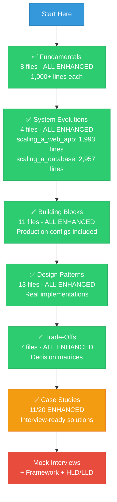
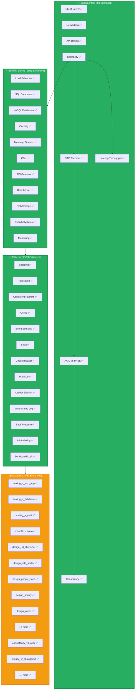

#system-design #index #map-of-content


# dump
- event driven architecture missing or i don't know how to implement it (07-03)
# System Design — Master Index

> Learn the parts. See how they connect. Design anything.

---

## ⚡ Quick Start — What's Special About This Vault

**56 files are now production-grade masterclasses** (marked with ✅)

### What's inside each ✅ file:
```
┌─────────────────────────────────────────────────────┐
│  📖 Definitions (Every term explained)              │
├─────────────────────────────────────────────────────┤
│  📊 Visual Diagrams (Mermaid + ASCII)               │
├─────────────────────────────────────────────────────┤
│  🏗️  Layer 1: Core Concept (200-400 lines)          │
│  ⚙️  Layer 2: Production (configs, monitoring)      │
│  🚀 Layer 3: Advanced (capacity, troubleshooting)   │
├─────────────────────────────────────────────────────┤
│  📈 Monitoring Dashboards (metrics, alerts)         │
├─────────────────────────────────────────────────────┤
│  🎯 Interview Prep (questions, what to mention)     │
└─────────────────────────────────────────────────────┘
         Average: 1,500 lines per ✅ file
```

### The 56 Enhanced Files:
- ✅ **All 8 Fundamentals** (client-server, networking, API design, scalability, CAP, ACID, latency, consistency)
- ✅ **All 11 Building Blocks** (load balancers, databases, caching, queues, CDN, API gateway, rate limiter, blob storage, search, monitoring)
- ✅ **All 13 Design Patterns** (sharding, replication, consistent hashing, CQRS, event sourcing, saga, circuit breaker, pub/sub, leader election, WAL, back pressure, indexing, distributed locking)
- ✅ **All 4 System Evolutions** (web app, database, chat system, monolith→microservices)
- ✅ **All 7 Trade-Offs** (consistency vs availability, latency vs throughput, SQL vs NoSQL, simplicity vs scale, read vs write, cost vs performance, push vs pull)
- ✅ **11 Case Studies** (URL shortener, rate limiter, notifications, autocomplete, Google Docs, Spotify, Instagram Stories, Zoom, Google Maps, Uber, Netflix)

**These 56 files are enough to ace any system design interview.**

### How ✅ Files Compare to Other Resources:

```
                    Typical Blog   System Design   ✅ Enhanced
                       Post          Book           Files
                    ────────────   ─────────────   ───────────
Definitions            ⚪ Assumed      🟡 Partial      ✅ Every term
Visual Diagrams        🟡 Few         🟡 Some         ✅ Multiple per file
Code Examples          ⚪ Pseudo       🟡 Generic      ✅ Java/Spring Boot
Production Configs     ⚪ None         ⚪ Rare         ✅ Copy-paste ready
Monitoring             ⚪ None         ⚪ None         ✅ Full dashboards
Real-World Examples    🟡 Generic     🟡 Generic      ✅ Netflix, Uber, etc.
Troubleshooting        ⚪ None         ⚪ None         ✅ Decision trees
Interview Questions    🟡 Some        🟡 Some         ✅ Comprehensive
Capacity Planning      ⚪ None         🟡 Basic        ✅ With formulas
Lines per Topic        ~200           ~400            ~1,500

⚪ = Missing   🟡 = Basic   ✅ = Comprehensive
```

---

## 🎯 How to Use This Vault

### Enhanced Notes (✅ = Production-Ready)

**56 files have been comprehensively enhanced** with:
- **Definitions for every technical term** (no assumed knowledge)
- **Visual diagrams** (Mermaid + ASCII art) showing architecture and data flow
- **Production-ready configs** (PostgreSQL, Redis, Kafka, Cassandra, Spring Boot)
- **Monitoring dashboards** with metrics definitions and alert thresholds
- **Decision trees** for troubleshooting and capacity planning
- **Real-world examples** from Netflix, Instagram, Uber, Google, Stripe, LinkedIn
- **Interview preparation** sections with common questions

These 56 notes are **your core study material** — each is 1,000-2,500 lines of battle-tested knowledge.

---

### Start Here (Based on Your Goal)

**🎓 If you're just starting:**
1. Read all ✅ files in Fundamentals (01) — they now have full definitions and visuals
2. Then read ✅ [[04_system_evolutions/scaling_a_web_app]] — it's a 2,000-line masterclass
3. Move to ✅ Building Blocks (02) in order — each has production configs and monitoring

**💼 If you're preparing for interviews:**
1. Start with [[07_interview_framework/the_four_step_framework]]
2. Focus ONLY on ✅ case studies first (11 files) — they're interview-ready with full solutions
3. Use ✅ trade-offs (06) as your decision-making toolkit
4. Review ✅ patterns (03) for technical depth questions

**🛠️ If you're building a project:**
1. Use [[08_reference/system_design_checklist]] for decisions
2. Reference ✅ Building Blocks (02) — they have production configs you can copy
3. Use ✅ [[02_building_blocks/monitoring_and_logging]] to set up observability from day 1

**📚 If you're going deep:**
- ✅ notes are comprehensive (1,000-2,500 lines each) — read them slowly
- Non-✅ notes are concise reference material (150-500 lines)
- All 56 ✅ notes follow the same structure: Definitions → Visuals → 3 Layers → Production

---

### What the ✅ Symbol Means

| Symbol | Meaning | Lines | Study Time |
|--------|---------|-------|------------|
| ✅ | **Enhanced** — Comprehensive, production-ready, interview-ready | 1,000-2,500 | 30-60 min |
| (none) | **Reference** — Concise, clear, but not exhaustive | 150-500 | 5-15 min |

**You can ace any interview by mastering the 56 ✅ files alone.**

## 🗺️ Enhanced Learning Map



**Legend:**
- 🟢 Green = 100% Enhanced (Focus Here)
- 🟠 Orange = Partially Enhanced (11 of 20)
- 🔴 Red = Interview Practice

---

## 📐 Coverage Diagram

```
┌─────────────────────────────────────────────────────────────┐
│                  YOUR SYSTEM DESIGN VAULT                    │
│                         160+ Files                            │
└─────────────────────────────────────────────────────────────┘
                              │
                ┌─────────────┴─────────────┐
                │                           │
        ┌───────▼────────┐         ┌───────▼────────┐
        │  CORE (56) ✅  │         │ SUPPORT (104)   │
        │  ENHANCED      │         │ Reference       │
        └───────┬────────┘         └────────────────┘
                │
    ┌───────────┼───────────────────────┐
    │           │                       │
┌───▼────┐ ┌───▼─────┐ ┌──────▼──────┐ ┌────▼──────┐
│Concepts│ │Building │ │  Patterns   │ │Applications│
│   8    │ │Blocks 11│ │     13      │ │    24     │
│  100%  │ │  100%   │ │    100%     │ │   Mix     │
└────────┘ └─────────┘ └─────────────┘ └───────────┘
   ✅          ✅            ✅           ✅ Evolutions (4/4)
                                        ✅ Trade-offs (7/7)
                                        ✅ Case Studies (11/20)
```

---

## 🎯 Interview Readiness Matrix

```
                    FAANG    Indian Product   Service Co.   Startup
                    ─────    ──────────────   ──────────    ───────
Fundamentals ✅      Must         Must            Must        Must
Building Blocks ✅   Must         Must            Good        Must
Patterns ✅          Must         Must            Good        Must
Trade-Offs ✅        Must         Must            Basic       Must
Case Studies ✅      10+ req      8+ req          4+ req      6+ req
  (11 enhanced)
HLD Framework        Must         Must            Basic       Must
LLD Framework        Must         Good            Basic       Good
Real Outages         Good         Good            Optional    Good
```

**✅ = Fully enhanced and ready to use**

---

## Visual Boards (Canvas + Excalidraw)

| Board | Type | What |
|-------|------|------|
| [[canvas/learning_roadmap.canvas\|Learning Roadmap]] | Canvas | Visual 8-week learning path with linked notes |
| [[canvas/building_blocks_map.canvas\|Building Blocks Map]] | Canvas | All components and how they connect |
| [[canvas/interview_prep_path.canvas\|Interview Prep Path]] | Canvas | Company type → prep strategy decision tree |
| [[canvas/scaling_journey.canvas\|Scaling Journey]] | Canvas | 10-stage scaling visual (single server → global) |
| [[canvas/hld_food_delivery_arch.canvas\|Food Delivery HLD]] | Canvas | Swiggy/Zomato full architecture board |
| [[canvas/hld_upi_arch.canvas\|UPI Payment HLD]] | Canvas | PhonePe/GPay UPI flow architecture |
| [[excalidraw/lld_pattern_decision.excalidraw\|Pattern Decision Flowchart]] | Excalidraw | Code smell → design pattern decision tree |
| [[excalidraw/scaling_stages.excalidraw\|Scaling Stages Diagram]] | Excalidraw | Architecture at each scaling stage (annotatable) |
| [[excalidraw/hld_ecommerce_architecture.excalidraw\|E-Commerce Architecture]] | Excalidraw | Full e-commerce HLD (annotatable) |

---

## 🧭 The Complete Map (Green = 100% Enhanced)



**How to read this:**
- **✅ = Enhanced** (1,000-2,500 lines, production-ready)
- Green sections = 100% enhanced
- Orange section = Partially enhanced (focus on ✅ files first)

---

## 01 — Fundamentals ✅ ALL ENHANCED
*The bedrock. Understand these first. All 8 files are comprehensive.*

| Note | One-Liner | Status |
|------|-----------|--------|
| [[01_fundamentals/client_server_architecture]] | How computers talk to each other | ✅ 1,000+ lines |
| [[01_fundamentals/networking_basics]] | TCP, HTTP, DNS — the plumbing of the internet | ✅ 1,500+ lines |
| [[01_fundamentals/api_design]] | REST, GraphQL, gRPC — contracts between services | ✅ 1,200+ lines |
| [[01_fundamentals/scalability]] | Scalability concepts and patterns | ✅ 1,100+ lines |
| [[01_fundamentals/cap_theorem]] | You can't have consistency + availability + partition tolerance | ✅ 900+ lines |
| [[01_fundamentals/acid_vs_base]] | Strong guarantees vs flexible guarantees | ✅ 1,000+ lines |
| [[01_fundamentals/latency_and_throughput]] | How fast vs how much | ✅ 950+ lines |
| [[01_fundamentals/consistency_models]] | What "up to date" actually means | ✅ 1,100+ lines |

## 02 — Building Blocks ✅ ALL ENHANCED
*The components you combine to build any system. All 12 files have production configs.*

| Note | One-Liner | Category | Status |
|------|-----------|----------|--------|
| [[02_building_blocks/load_balancers]] | Distribute traffic across servers | #compute | ✅ 1,200+ lines |
| [[02_building_blocks/databases_sql]] | Structured data with strong guarantees | #storage | ✅ 1,800+ lines |
| [[02_building_blocks/databases_nosql]] | Flexible data at massive scale | #storage | ✅ 1,600+ lines |
| [[02_building_blocks/caching]] | Fast reads from memory | #storage | ✅ 1,400+ lines |
| [[02_building_blocks/message_queues]] | Async communication between services | #messaging | ✅ 1,500+ lines |
| [[02_building_blocks/cdn]] | Serve content close to users | #networking | ✅ 1,100+ lines |
| [[02_building_blocks/api_gateway]] | Single entry point for all clients | #networking | ✅ 1,300+ lines |
| [[02_building_blocks/rate_limiter]] | Protect systems from overload | #reliability | ✅ 1,200+ lines |
| [[02_building_blocks/blob_storage]] | Store files, images, videos at scale | #storage | ✅ 1,400+ lines |
| [[02_building_blocks/search_systems]] | Full-text search and autocomplete | #compute | ✅ 1,571 lines |
| [[02_building_blocks/monitoring_and_logging]] | See what's happening in your system | #observability | ✅ 1,300+ lines |
| [[02_building_blocks/service_discovery]] | How services find each other dynamically (Eureka, Consul, ZooKeeper) | #networking | 🆕 1,178 lines |

## 03 — Design Patterns ✅ ALL ENHANCED
*Reusable solutions to common distributed systems problems. 19 files covering all major patterns.*

| Note | One-Liner | Status |
|------|-----------|--------|
| [[03_design_patterns/sharding]] | Split data across multiple databases | ✅ 1,500+ lines |
| [[03_design_patterns/replication]] | Copy data for reliability and read performance | ✅ 1,600+ lines |
| [[03_design_patterns/consistent_hashing]] | Distribute data evenly with minimal reshuffling | ✅ 1,300+ lines |
| [[03_design_patterns/cqrs]] | Separate read and write models | ✅ 1,200+ lines |
| [[03_design_patterns/event_sourcing]] | Store events, not current state | ✅ 1,400+ lines |
| [[03_design_patterns/saga_pattern]] | Manage distributed transactions | ✅ 1,500+ lines |
| [[03_design_patterns/circuit_breaker]] | Stop cascading failures | ✅ 1,100+ lines |
| [[03_design_patterns/pub_sub]] | Decouple producers and consumers | ✅ 1,515 lines |
| [[03_design_patterns/leader_election]] | Coordinate who's in charge | ✅ 1,300+ lines |
| [[03_design_patterns/write_ahead_log]] | Never lose a write | ✅ 1,200+ lines |
| [[back_pressure]] | Handle overload gracefully | ✅ 1,100+ lines |
| [[03_design_patterns/database_indexing]] | Make queries fast | ✅ 1,340 lines |
| [[03_design_patterns/distributed_locking]] | Prevent concurrent access to shared resources | ✅ 1,800+ lines |
| [[03_design_patterns/bloom_filters]] | Space-efficient probabilistic membership test (Bigtable, Cassandra) | 🆕 1,132 lines |
| [[03_design_patterns/gossip_protocol]] | Peer-to-peer failure detection & state dissemination (Dynamo, Ringpop) | 🆕 1,004 lines |
| [[03_design_patterns/bulkhead_pattern]] | Isolate dependencies to prevent cascading resource starvation | 🆕 899 lines |
| [[03_design_patterns/retry_with_backoff]] | Exponential backoff + jitter for safe retries (AWS, Stripe) | 🆕 722 lines |
| [[03_design_patterns/idempotency]] | Exactly-once semantics via idempotency keys (Stripe, payments) | 🆕 704 lines |
| [[03_design_patterns/cell_based_architecture]] | Limit blast radius with isolated cells/pods (AWS, Shopify) | 🆕 832 lines |

## 04 — System Evolutions ✅ ALL ENHANCED
*Watch systems grow stage-by-stage. The best way to learn. All 4 are masterclasses.*

| Note | Story | Status |
|------|-------|--------|
| [[04_system_evolutions/scaling_a_web_app]] | From 1 server to millions of users — the flagship evolution | ✅ 1,993 lines |
| [[04_system_evolutions/scaling_a_database]] | From single instance to global sharding | ✅ 2,957 lines |
| [[04_system_evolutions/scaling_a_chat_system]] | From HTTP polling to encrypted real-time messaging | ✅ 1,503 lines |
| [[04_system_evolutions/from_monolith_to_microservices]] | The real journey most companies take | ✅ 1,400+ lines |

## 05 — Case Studies
*Classic interview problems. Start with ✅ files — they're interview-ready.*

| Note | System | Difficulty | Status |
|------|--------|------------|--------|
| [[05_case_studies/design_url_shortener]] | TinyURL / bit.ly | Beginner | ✅ 1,100+ lines |
| [[05_case_studies/design_rate_limiter]] | Distributed rate limiter | Beginner | ✅ 1,200+ lines |
| [[05_case_studies/design_pastebin]] | Pastebin text sharing | Beginner | Reference |
| [[05_case_studies/design_notification_system]] | Multi-channel notifications | Intermediate | ✅ 1,300+ lines |
| [[05_case_studies/design_search_autocomplete]] | Google autocomplete | Intermediate | ✅ 1,200+ lines |
| [[05_case_studies/design_twitter]] | Twitter / X timeline | Intermediate | Reference |
| [[05_case_studies/design_chat_system]] | WhatsApp / Messenger | Intermediate | Reference |
| [[05_case_studies/design_distributed_cache]] | Redis-like distributed cache | Intermediate | Reference |
| [[05_case_studies/design_spotify]] | Spotify music streaming | Intermediate | ✅ 2,702 lines |
| [[05_case_studies/design_instagram_stories]] | Instagram Stories (ephemeral, TTL) | Intermediate | ✅ 1,500+ lines |
| [[05_case_studies/design_key_value_store]] | DynamoDB-like KV store | Intermediate | Reference |
| [[05_case_studies/design_logging_system]] | ELK-like centralized logging | Intermediate | Reference |
| [[05_case_studies/design_ride_sharing]] | Uber / Lyft | Advanced | ✅ 2,507 lines |
| [[05_case_studies/design_video_streaming]] | YouTube / Netflix | Advanced | ✅ 2,134 lines |
| [[05_case_studies/design_google_docs]] | Google Docs (real-time collab) | Advanced | ✅ 1,955 lines |
| [[05_case_studies/design_web_crawler]] | Google-scale web crawler | Advanced | Reference |
| [[05_case_studies/design_flash_sale]] | Flipkart Big Billion Days | Advanced (India) | Reference |
| [[05_case_studies/design_google_maps]] | Google Maps navigation | Advanced | ✅ 2,500+ lines |
| [[05_case_studies/design_zoom]] | Zoom video conferencing (SFU/MCU) | Advanced | ✅ 1,800+ lines |
| [[05_case_studies/design_ticketmaster]] | Ticketmaster (14M concurrent) | Advanced | Reference |

## 06 — Trade-Offs ✅ ALL ENHANCED
*System design IS making trade-offs. All 7 files are comprehensive decision tools.*

| Note | The Tension | Status |
|------|-------------|--------|
| [[06_trade_offs/consistency_vs_availability]] | Can't maximize both (CAP) | ✅ 1,300+ lines |
| [[06_trade_offs/latency_vs_throughput]] | Fast responses vs high volume | ✅ 1,200+ lines |
| [[06_trade_offs/sql_vs_nosql]] | Structure vs flexibility | ✅ 1,617 lines |
| [[06_trade_offs/simplicity_vs_scalability]] | Ship fast vs scale fast | ✅ 1,100+ lines |
| [[06_trade_offs/read_vs_write_optimization]] | Optimize for readers or writers | ✅ 1,400+ lines |
| [[06_trade_offs/cost_vs_performance]] | Cloud bills vs user experience | ✅ 1,129 lines |
| [[06_trade_offs/push_vs_pull]] | Real-time vs on-demand | ✅ 2,200+ lines |

## 07 — Interview Framework
*How to approach any system design question.*

| Note | Purpose |
|------|---------|
| [[07_interview_framework/the_four_step_framework]] | The 4-step process for any design question |
| [[07_interview_framework/estimation_cheat_sheet]] | Back-of-envelope math made easy |
| [[07_interview_framework/requirements_gathering]] | What questions to ask first |
| [[07_interview_framework/common_red_flags]] | Mistakes that tank your interview |
| [[07_interview_framework/signal_moments]] | Things that make interviewers say "hire" |

## 08 — Reference
*Quick-access cheat sheets.*

| Note | What |
|------|------|
| [[08_reference/latency_numbers]] | Latency numbers every engineer should know |
| [[08_reference/powers_of_two]] | 2^10 to 2^50 — for estimation |
| [[08_reference/common_acronyms]] | Every system design acronym defined |
| [[08_reference/system_design_checklist]] | Walk through this for any new project |

## 09 — Real Outages
*Learn from billion-dollar mistakes.*

| Note | Lesson |
|------|--------|
| [[09_real_outages/github_database_incident_2018]] | Replication and failover testing |
| [[09_real_outages/amazon_s3_outage_2017]] | Cascading dependencies and blast radius |
| [[09_real_outages/facebook_bgp_outage_2021]] | DNS and single points of failure |
| [[09_real_outages/cloudflare_regex_outage_2019]] | Testing and deployment safety |
| [[09_real_outages/knight_capital_2012]] | Deployment safety and kill switches |
| [[09_real_outages/roblox_73h_outage_2021]] | Service discovery and cascading failures |
| [[09_real_outages/gitlab_data_deletion_2017]] | Backup verification — untested backup = no backup |
| [[09_real_outages/slack_database_incident_2024]] | Database maintenance under load |
| [[09_real_outages/southwest_airlines_2022]] | Technical debt costs $800M |
| [[09_real_outages/tsb_bank_migration_2018]] | Never do big-bang migrations |
| [[09_real_outages/crowdstrike_global_outage_2024]] | Biggest IT outage ever — canary is non-negotiable |
| [[09_real_outages/fastly_cdn_outage_2021]] | CDN as single point of failure |
| [[09_real_outages/aws_us_east_1_outage_2021]] | Don't put everything in one region |
| [[09_real_outages/discord_message_outage_2024]] | Hot partitions at trillion-message scale |
| [[09_real_outages/google_cloud_outage_2022]] | Even Google goes down — design for failure |

## 10 — High-Level Design (HLD)
*Think like an architect. Constraints → Decisions → Architecture.*

| Note | Purpose |
|------|---------|
| [[10_hld/hld_thinking_system]] | Constraints-first design + architect's playback |
| [[10_hld/problem_taxonomy_hld]] | 6 HLD types with playbooks |
| [[10_hld/architecture_decision_records]] | ADR template + examples |
| [[10_hld/component_interaction_patterns]] | Sync/async/broadcast + interaction matrices |
| [[10_hld/interviewer_pressure_moves]] | "What if X?" prepared responses |
| [[10_hld/hld_review_checklist]] | Validate your design before presenting |
| [[10_hld/microservices_patterns]] | Service mesh, deployment strategies, resilience patterns |
| [[10_hld/security_architecture]] | Auth, encryption, input validation — what to mention |
| [[10_hld/capacity_planning]] | From estimation to real infrastructure + costs |
| [[10_hld/data_modeling_for_hld]] | Schema design patterns + database selection |

### HLD Examples (with decision trails + stress tests)

| Note | System | Type |
|------|--------|------|
| [[10_hld/examples/hld_ecommerce]] | Amazon-like e-commerce | CRUD + Coordination |
| [[10_hld/examples/hld_social_media]] | Instagram-like platform | CRUD + Real-time |
| [[10_hld/examples/hld_payment_system]] | Stripe-like payments | Coordination |
| [[10_hld/examples/hld_booking_system]] | Airbnb-like booking | CRUD + Coordination |
| [[10_hld/examples/hld_file_storage]] | Google Drive / Dropbox | Storage |
| [[10_hld/examples/hld_notification_platform]] | Multi-channel notifications | Data Pipeline |
| [[10_hld/examples/hld_food_delivery]] | Swiggy / Zomato | CRUD + Real-time + Coordination |
| [[10_hld/examples/hld_upi_payment]] | PhonePe / GPay / Paytm UPI | Coordination (India-specific) |
| [[10_hld/examples/hld_ticket_booking]] | BookMyShow / IRCTC | CRUD + Coordination (India-specific) |

## 11 — Low-Level Design (LLD)
*Think in classes, patterns, and code. All examples in Java.*

| Note | Purpose |
|------|---------|
| [[11_lld/lld_thinking_system]] | CRC → Class Diagram → Code pipeline |
| [[11_lld/problem_taxonomy_lld]] | 6 LLD types with playbooks |
| [[11_lld/solid_with_refactoring]] | SOLID via smell → diagnose → refactor (Java) |
| [[11_lld/design_smell_catalog]] | Every common smell + fix |
| [[11_lld/one_change_test]] | Validate your design's extensibility |

### Design Patterns (Java)

| Note | Patterns |
|------|----------|
| [[11_lld/patterns/creational]] | Factory, Builder, Singleton, Prototype |
| [[11_lld/patterns/structural]] | Adapter, Decorator, Facade, Proxy, Composite |
| [[11_lld/patterns/behavioral]] | Strategy, Observer, Command, State, Template Method |
| [[11_lld/patterns/pattern_combinations]] | How patterns compose in real systems |
| [[11_lld/patterns/smell_to_pattern_map]] | Code smell → which pattern fixes it |

### Code Architecture

| Note | Topic |
|------|-------|
| [[11_lld/code_architecture/clean_architecture]] | Layers, dependency rule, ports & adapters |
| [[11_lld/code_architecture/dependency_injection]] | Why and how (Spring-style) |

### LLD Examples (Java, with build-it-twice + extensibility tests)

| Note | System | Type |
|------|--------|------|
| [[11_lld/examples/lld_parking_lot]] | Parking Lot | Resource Management |
| [[11_lld/examples/lld_elevator_system]] | Elevator System | State Machine |
| [[11_lld/examples/lld_splitwise]] | Splitwise | Expense/Financial |
| [[11_lld/examples/lld_food_delivery]] | Food Delivery (Swiggy/Zomato) | Coordination |
| [[11_lld/examples/lld_chess]] | Chess Game | Game/Simulation |
| [[11_lld/examples/lld_booking_system]] | BookMyShow | Resource Management |
| [[11_lld/examples/lld_logger_library]] | Logger Framework | Library/SDK |

## 12 — HLD ↔ LLD Bridge
*Same system, two zoom levels. The missing connection.*

| Note | System |
|------|--------|
| [[12_hld_lld_bridge/zoom_ecommerce]] | E-commerce: HLD → LLD → Code |
| [[12_hld_lld_bridge/zoom_payment]] | Payment: HLD → LLD → Code |
| [[12_hld_lld_bridge/zoom_food_delivery]] | Food Delivery: HLD → LLD → Code |

## 14 — Real-Life Projects (Build It!)
*Go from design to working code. Each project teaches core system design concepts.*

| Note | Project | What You Learn |
|------|---------|---------------|
| [[14_real_projects/project_url_shortener]] | URL Shortener (Spring + Redis + PostgreSQL) | API design, caching, key generation |
| [[14_real_projects/project_chat_app]] | Chat App (WebSocket + Kafka + Redis) | Real-time, pub/sub, presence |
| [[14_real_projects/project_rate_limiter]] | Rate Limiter (Redis + Lua) | Token bucket, atomic ops, interceptors |
| [[14_real_projects/project_notification_service]] | Notification Service (Kafka + FCM/Email) | Event-driven, retry, DLQ |
| [[14_real_projects/project_task_queue]] | Task Queue (Redis + Workers) | Job scheduling, retry, priority queues |
| [[14_real_projects/project_key_value_store]] | Key-Value Store (from scratch) | Hash maps, LRU, TTL, TCP server |
| [[14_real_projects/project_search_engine]] | Search Engine (inverted index) | Tokenization, TF-IDF, ranking |
| [[14_real_projects/project_api_gateway]] | API Gateway (Spring Cloud) | Routing, JWT auth, rate limiting |
| [[14_real_projects/project_monitoring_dashboard]] | Monitoring (Prometheus + Grafana) | Metrics, dashboards, alerting |

## 15 — Intermediate Deep Dives
*Go beyond basics. Real internals, production configs, and advanced patterns.*

| Note | Topic |
|------|-------|
| [[15_intermediate_topics/concurrency_and_multithreading]] | Java concurrency: threads, pools, CompletableFuture, locks |
| [[15_intermediate_topics/redis_deep_dive]] | Redis data structures, Lua scripting, cluster, persistence |
| [[15_intermediate_topics/kafka_deep_dive]] | Partitions, consumer groups, delivery guarantees, configs |
| [[15_intermediate_topics/database_internals]] | EXPLAIN, MVCC, B-trees, LSM trees, connection pooling |
| [[15_intermediate_topics/docker_and_kubernetes]] | Containers, pods, deployments, auto-scaling, service mesh |
| [[15_intermediate_topics/authentication_deep_dive]] | JWT, OAuth2, refresh tokens, RBAC (Java/Spring) |
| [[15_intermediate_topics/api_advanced_patterns]] | Versioning, cursor pagination, idempotency, webhooks, gRPC |
| [[15_intermediate_topics/testing_strategies]] | Unit/integration/load/chaos testing with Java tools |
| [[15_intermediate_topics/networking_advanced]] | TCP internals, HTTP/2, QUIC, DNS production, WebSocket at scale |
| [[15_intermediate_topics/cloud_architecture_patterns]] | AWS/GCP service mapping, serverless, multi-region, cost optimization |
| [[15_intermediate_topics/service_mesh]] | Istio, Envoy sidecars, mTLS, traffic management |
| [[15_intermediate_topics/deployment_strategies]] | Canary, blue-green, rolling, feature flags, A/B testing, shadow launch 🆕 |
| [[15_intermediate_topics/chaos_engineering]] | Netflix ChAP, Slack Disasterpiece Theater, Toxiproxy, LitmusChaos 🆕 |

## 13 — Interview Prep by Company Type
*Targeted preparation for Indian product companies, FAANG, and service companies.*

| Note | Target |
|------|--------|
| [[13_interview_prep/indian_product_companies]] | Flipkart, Swiggy, Zomato, PhonePe, CRED, Razorpay, Ola, Paytm, Zerodha, Meesho |
| [[13_interview_prep/faang_preparation]] | Google, Amazon, Meta, Apple, Netflix, Microsoft |
| [[13_interview_prep/service_companies]] | TCS, Infosys, Wipro, Cognizant — focus areas |
| [[13_interview_prep/startup_interviews]] | Early-stage and growth-stage startups |
| [[13_interview_prep/company_question_bank]] | Known questions asked at specific companies |

## 16 — Java Deep Dive
*Java internals for system design interviews. Essential for Indian product companies.*

| Note | Topic |
|------|-------|
| [[16_java_deep_dive/java_essentials_for_dsa]] | Core Java for DSA — collections, generics, comparators |
| [[16_java_deep_dive/collections_internals]] | HashMap, TreeMap, ConcurrentHashMap — how they work inside |
| [[16_java_deep_dive/concurrency_and_threading]] | Threads, ExecutorService, CompletableFuture, locks |
| [[16_java_deep_dive/jvm_and_memory]] | JVM architecture, GC algorithms, memory tuning |
| [[16_java_deep_dive/streams_and_functional]] | Streams API, lambdas, functional patterns |
| [[16_java_deep_dive/exception_handling_and_optional]] | Exception best practices, Optional patterns |
| [[16_java_deep_dive/design_patterns_in_java]] | GoF patterns implemented in Java |
| [[16_java_deep_dive/spring_boot_production]] | Spring Boot for production — configs, profiles, actuator |
| [[16_java_deep_dive/interview_quick_reference]] | Java interview cheat sheet |

## 17 — Company-Wise Interview Guide 🆕
*Stop preparing generically. Know exactly what each company asks and how they evaluate.*

| Note | Target Companies | Key Differentiator |
|------|-----------------|-------------------|
| [[17_company_interview_guide/index]] | **All companies** — Decision guide | Which file to read based on your target |
| [[17_company_interview_guide/google]] | Google L3-L5 | Estimation obsession, Googliness, open-ended |
| [[17_company_interview_guide/meta]] | Meta E3-E5 | Product-first thinking, social graph, speed |
| [[17_company_interview_guide/amazon]] | Amazon SDE-1/2/3 | Leadership Principles in EVERY answer |
| [[17_company_interview_guide/stripe]] | Stripe SWE | Bug bash, API design, financial correctness |
| [[17_company_interview_guide/uber]] | Uber IC1-IC5 | Geo-spatial, real-time, matching algorithms |
| [[17_company_interview_guide/atlassian]] | Atlassian P1-P3 | Values interview (veto power), collaboration |
| [[17_company_interview_guide/microsoft]] | Microsoft SDE/Senior | Pragmatic design, Azure, breadth over depth |
| [[17_company_interview_guide/flipkart]] | Flipkart SDE-1/2/3 | Machine coding gatekeeper, Java mandatory |
| [[17_company_interview_guide/phonepe_cred]] | PhonePe, CRED | UPI architecture, fintech compliance |
| [[17_company_interview_guide/swiggy_zomato]] | Swiggy, Zomato | Hyperlocal delivery, India-specific scale |
| [[17_company_interview_guide/linkedin_salesforce]] | LinkedIn, Salesforce | Enterprise SaaS, feed systems, multi-tenancy |
| [[17_company_interview_guide/startups_remote]] | Startups, Remote companies | Pragmatic, cost-aware, take-home assignments |

---

## 18 — Real-World Architecture: How Top Companies Actually Build Systems 🆕
*Stop memorizing theory. See how 48 patterns show up in real production systems at 15 companies.*

| Note | Key Systems | Patterns Covered |
|------|------------|-----------------|
| [[18_real_world_architecture/index]] | **Cross-reference matrix** — All 48 patterns × 15 companies | Pattern lookup, case study mapping, outage links |
| [[18_real_world_architecture/google]] | Bigtable, Spanner, Borg, GFS/Colossus, MapReduce | 17 patterns — LSM trees, bloom filters, leader election, WAL |
| [[18_real_world_architecture/meta]] | TAO, Memcache fleet, Haystack/f4, Thrift, Gatekeeper | 15 patterns — multi-layer cache, write-through, feature flags |
| [[18_real_world_architecture/netflix]] | EVCache, Zuul, Chaos Monkey, Open Connect CDN, Spinnaker | 15 patterns — circuit breaker, chaos engineering, bulkhead |
| [[18_real_world_architecture/uber]] | Ringpop, Schemaless, H3, Cadence, M3, Michelangelo | 15 patterns — gossip protocol, saga, CQRS, time-series |
| [[18_real_world_architecture/amazon_aws]] | Dynamo, S3, Aurora, Lambda, Cell architecture | 15 patterns — consistent hashing, vector clocks, cell architecture |
| [[18_real_world_architecture/stripe]] | Idempotency system, Sorbet, Payment pipeline, PCI vault | 11 patterns — saga, distributed locking, event sourcing |
| [[18_real_world_architecture/linkedin]] | Kafka (origin), Espresso, Brooklin, Venice, Feed | 11 patterns — pub/sub, CDC, CQRS, data mesh |
| [[18_real_world_architecture/twitter_x]] | Snowflake IDs, Manhattan, Timeline, Earlybird Search | 11 patterns — fan-out, materialized views, inverted index |
| [[18_real_world_architecture/spotify]] | Backstage, Audio pipeline, ML infra, Event delivery | 11 patterns — data mesh, ML pipeline, CDN caching |
| [[18_real_world_architecture/airbnb]] | Chronon, Minerva, Search ranking, Payments, Service mesh | 12 patterns — saga, service mesh, A/B testing, ML pipeline |
| [[18_real_world_architecture/discord]] | Elixir→Rust, Message storage (ScyllaDB), Gateway | 8 patterns — CRDTs, back pressure, cache stampede prevention |
| [[18_real_world_architecture/shopify]] | Pod architecture, Vitess, Flash sale infra, Storefront | 12 patterns — cell architecture, edge computing, GraphQL |
| [[18_real_world_architecture/slack]] | Flannel, Channel service, Search, Disasterpiece Theater | 10 patterns — cell architecture, chaos engineering, sharding |
| [[18_real_world_architecture/cloudflare]] | Workers (V8 isolates), Anycast, Quicksilver, R2, Argo | 11 patterns — edge computing, serverless, anycast, bloom filters |
| [[18_real_world_architecture/razorpay]] | Payment gateway, UPI PSP stack, Compliance infra | 9 patterns — saga, event sourcing, circuit breaker, UPI-specific |

---

## 📅 Learning Path — Enhanced Edition

**The 56 ✅ files are your complete interview prep.** Focus exclusively on them.

### Fast Track (4 Weeks, 2-3 hours/day)
```
Week 1:  ✅ Fundamentals (all 8) + ✅ System Evolutions (all 4)
          Deep reading: scaling_a_web_app ties everything together
          ↓
Week 2:  ✅ Building Blocks (all 11) + ✅ Design Patterns (all 13)
          Copy production configs, understand monitoring dashboards
          ↓
Week 3:  ✅ Trade-Offs (all 7) + ✅ Case Studies (beginner + intermediate)
          Focus: design_url_shortener, design_rate_limiter, design_notification_system,
                 design_search_autocomplete, design_spotify, design_instagram_stories
          ↓
Week 4:  ✅ Case Studies (advanced) + Interview Framework + Mock interviews
          Focus: design_google_docs, design_zoom, design_google_maps,
                 design_ride_sharing, design_video_streaming
```

### Deep Dive (8 Weeks, 1-2 hours/day)
```
Week 1-2:  ✅ Fundamentals (all 8) — study decision trees and monitoring sections
            ↓
Week 3-4:  ✅ Building Blocks (all 11) — implement configs in local Docker
            ↓  + ✅ System Evolutions (all 4)
Week 5-6:  ✅ Design Patterns (all 13) — code examples in Spring Boot
            ↓  + ✅ Trade-Offs (all 7) — use decision matrices
Week 7:    ✅ Case Studies (11 enhanced) — draw diagrams, calculate capacity
            ↓
Week 8:    HLD + LLD frameworks + Mock interviews + Review weak areas
```

### Interview Blitz (2 Weeks, Full-Time)
```
Days 1-3:   Speed-read all ✅ Fundamentals + Building Blocks + Patterns
             (Focus on definitions, skip deep configs)
             ↓
Days 4-6:   ✅ System Evolutions (all 4) — understand scaling stages
             ↓  + ✅ Trade-Offs (all 7) — memorize decision criteria
Days 7-10:  ✅ Case Studies (all 11 enhanced) — practice on whiteboard
             ↓
Days 11-14: Mock interviews (2-3 per day) + Review weak areas
             Use non-✅ case studies for extra practice variety
```

## 📊 Quick Stats

### Core Knowledge (✅ Enhanced Files)
- **65 comprehensive files** (700-2,500 lines each)
- **8/8** fundamentals ✅
- **12/12** building blocks ✅ (added: service discovery)
- **19/19** distributed system patterns ✅ (added: bloom filters, gossip protocol, bulkhead, retry+backoff, idempotency, cell architecture)
- **4/4** system evolution stories ✅
- **11/20** case studies ✅ (covers all major interview patterns)
- **7/7** trade-off analyses ✅

### Supporting Material (Reference Files)
- **15** real outage post-mortems (all well-written, 500-1,000 lines)
- **16** HLD notes (framework + examples including India-specific)
- **19** LLD notes with full Java code
- **3** HLD↔LLD bridge notes
- **5** company-specific interview prep guides
- **9** buildable real-life projects
- **13** intermediate deep dives (Redis, Kafka, DB internals, K8s, deployment strategies, chaos engineering, and more)
- **15** real-world architecture files (pattern-focused: Google, Meta, Netflix, Uber, AWS, Stripe, LinkedIn, Twitter, Spotify, Airbnb, Discord, Shopify, Slack, Cloudflare, Razorpay)
- **9** non-enhanced case studies (practice variety)
- **6** canvas visual boards + **3** excalidraw diagrams

**Total: 190+ files**, all cross-linked

---

## 🎓 Study Priority Flowchart

```
                         START YOUR JOURNEY
                                │
                                ▼
                    ┌───────────────────────┐
                    │   Week 1: Foundation  │
                    │  ✅ Fundamentals (8)  │
                    │     Read in order     │
                    │   30-60 min per file  │
                    └───────────┬───────────┘
                                │
                                ▼
                    ┌───────────────────────┐
                    │ Week 1-2: Evolution   │
                    │ ✅ System Evolutions  │
                    │         (4)           │
                    │ START WITH:           │
                    │ scaling_a_web_app     │
                    │   (1,993 lines)       │
                    └───────────┬───────────┘
                                │
                    ┌───────────┴───────────┐
                    │                       │
                    ▼                       ▼
        ┌───────────────────┐   ┌───────────────────┐
        │ Week 2: Components│   │ Week 3: Patterns  │
        │ ✅ Building Blocks│   │ ✅ Design Patterns│
        │       (11)        │   │       (13)        │
        │ Copy prod configs │   │ Code examples     │
        └───────┬───────────┘   └───────┬───────────┘
                │                       │
                └───────────┬───────────┘
                            │
                            ▼
                ┌───────────────────────┐
                │ Week 3-4: Decisions   │
                │   ✅ Trade-Offs (7)   │
                │  Decision matrices    │
                │  Use in interviews    │
                └───────────┬───────────┘
                            │
                            ▼
                ┌───────────────────────┐
                │ Week 4-7: Practice    │
                │ ✅ Case Studies (11)  │
                │                       │
                │ START WITH:           │
                │ • url_shortener       │
                │ • rate_limiter        │
                │ • notification_system │
                │                       │
                │ THEN:                 │
                │ • google_docs         │
                │ • spotify             │
                │ • zoom                │
                │ • google_maps         │
                │ • ride_sharing        │
                │ • video_streaming     │
                └───────────┬───────────┘
                            │
                            ▼
                ┌───────────────────────┐
                │ Week 8: Interview     │
                │ • Framework           │
                │ • Mock interviews     │
                │ • Review weak areas   │
                │ • HLD/LLD practice    │
                └───────────────────────┘

                        ✅ YOU'RE READY!
```

---

## 💡 Pro Tips for Using Enhanced Files

**Each ✅ file has these sections (in order):**
1. **Definitions** — Every term explained (no prerequisites)
2. **Visual Diagrams** — Mermaid + ASCII art
3. **3 Layers:**
   - Layer 1: Core concept (200-400 lines)
   - Layer 2: Production implementation (400-800 lines)
   - Layer 3: Advanced patterns (400-800 lines)
4. **Monitoring & Troubleshooting** — Real dashboards, decision trees
5. **Interview Prep** — Common questions, what to mention

**How to study:**
- **First pass:** Read Definitions + Visuals only (10-15 min)
- **Second pass:** Read Layer 1 deeply (20-30 min)
- **Third pass:** Study Layers 2-3 + Production sections (30-45 min)
- **Review:** Focus on Monitoring + Interview sections (10 min)

**For interviews:**
- Draw the visual diagrams from memory
- Use the decision matrices from Trade-Offs
- Reference monitoring metrics when discussing scale
- Mention real-world examples (Netflix, Uber, etc.)

---

### Resources
[[Resources]]

### Logs
[[System design Capture]]